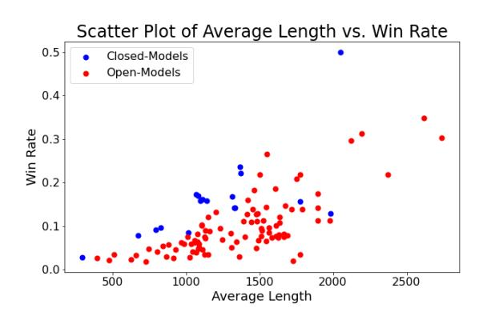
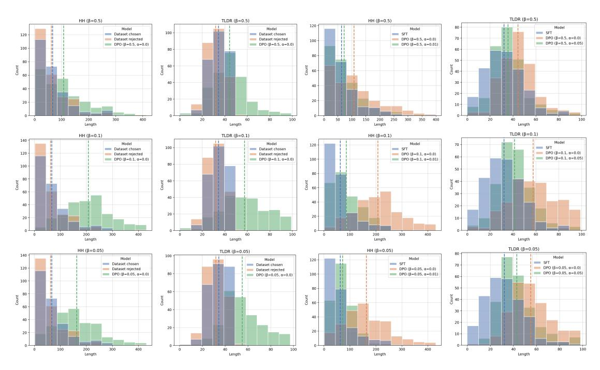
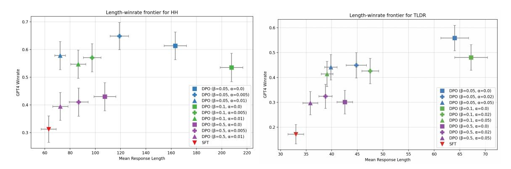
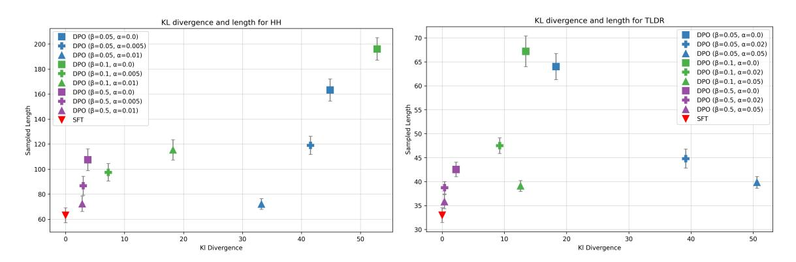
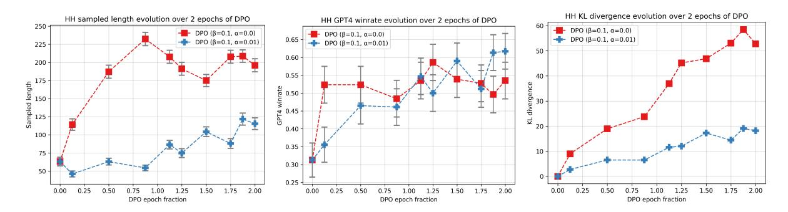
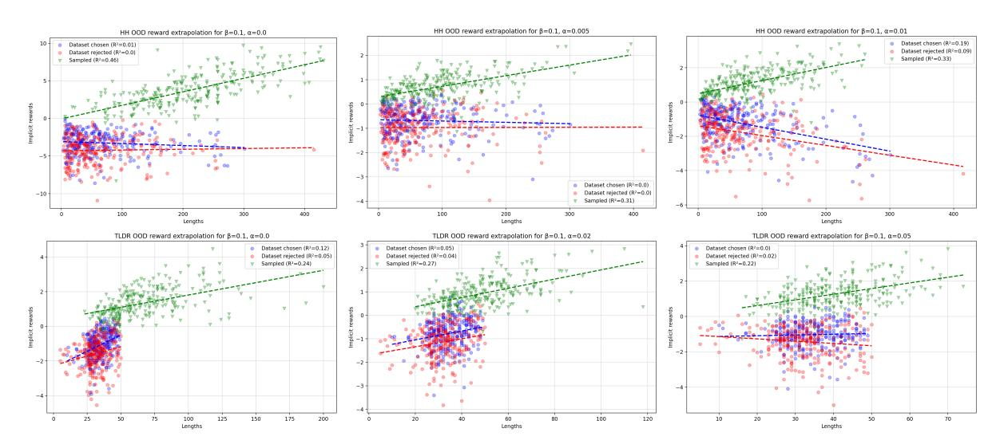
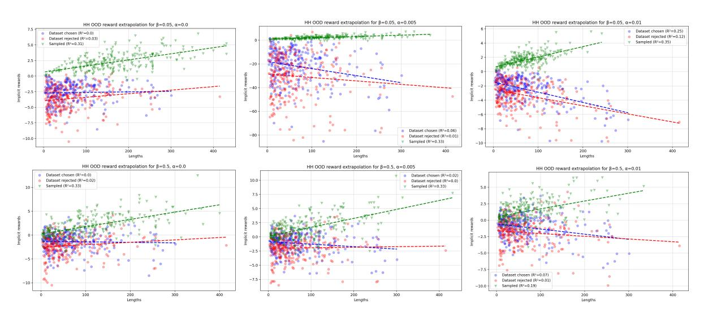
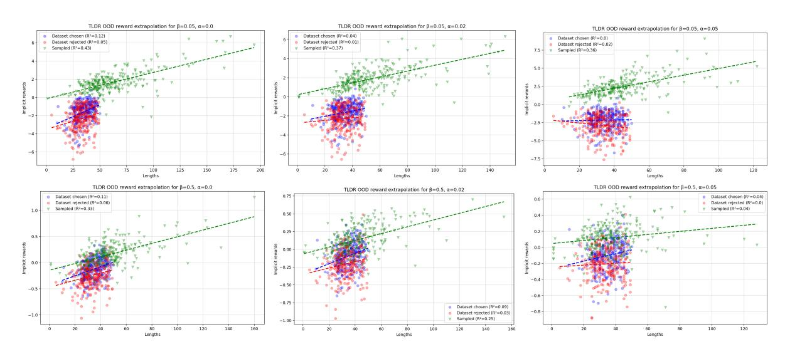

# Disentangling Length from Quality in Direct Preference Optimization

# Ryan Park\*

Stanford University rypark@stanford.edu

## Stefano Ermon

Stanford University ermon@stanford.edu

#### Abstract

Reinforcement Learning from Human Feedback (RLHF) has been a crucial component in the recent success of Large Language Models. However, RLHF is know to exploit biases in human preferences, such as verbosity. A well-formatted and eloquent answer is often more highly rated by users, even when it is less helpful and objective. A number of approaches have been developed to control those biases in the classical RLHF literature, but the problem remains relatively under-explored for Direct Alignment Algorithms such as Direct Preference Optimization (DPO). Unlike classical RLHF, DPO does not train a separate reward model or use reinforcement learning directly, so previous approaches developed to control verbosity cannot be directly applied to this setting. Our work makes several contributions. For the first time, we study the length problem in the DPO setting, showing significant exploitation in DPO and linking it to out-of-distribution bootstrapping. We then develop a principled but simple regularization strategy that prevents length exploitation while still maintaining improvements in model quality. We demonstrate these effects across datasets on summarization and dialogue, where we achieve up to 20% improvement in win rates when controlling for length, despite the GPT-4 judge's well-known verbosity bias.

#### 1 Introduction

Recently, Large Language Models (LLMs) have seen significant improvements in capabilities, such as code-generation, mathematical reasoning, and tool use. Importantly, they can now fluently interact with users and follow their instructions, leading to their widespread adoption. Fine-tuning with Reinforcement Learning from Human Feedback (RLHF) [\(Christiano et al.,](#page-11-0) [2017;](#page-11-0) [Stiennon et al.,](#page-12-0)

# Rafael Rafailov\*

Stanford University rafailov@stanford.edu

# Chelsea Finn

Stanford University cbfinn@stanford.edu

Figure 1: Average win rates versus generation length [\(Liu,](#page-12-1) [2024\)](#page-12-1) on the Alpaca Eval benchmark [\(Dubois](#page-11-1) [et al.,](#page-11-1) [2024\)](#page-11-1). While the highest-scoring open-source models can match the overall performance of strong closed models, they lag significantly on length-corrected basis.

[2022\)](#page-12-0) has been a significant component in those advances and is now a standard part of advanced LLM training pipelines [\(Ouyang et al.,](#page-12-2) [2022;](#page-12-2) [Bai et al.,](#page-10-0) [2022a;](#page-10-0) [Touvron et al.,](#page-12-3) [2023;](#page-12-3) [Jiang et al.,](#page-11-2) [2024;](#page-11-2) [Anil](#page-8-0) [et al.,](#page-8-0) [2023\)](#page-8-0). Currently, all the leading LLMs deploy some sort of RLHF pipeline [\(Dubois et al.,](#page-11-1) [2024;](#page-11-1) [Zheng et al.,](#page-12-4) [2023;](#page-12-4) [Liang et al.,](#page-11-3) [2023\)](#page-11-3). The classical approach consists of three-stages. The first stage begins with a general model pre-trained with next-token prediction on a large corpus of text [\(Radford et al.,](#page-12-5) [2019;](#page-12-5) [Brown et al.,](#page-11-4) [2020\)](#page-11-4), which is then further-tuned for instruction-following purposes [\(Wei et al.,](#page-12-6) [2022\)](#page-12-6). In the second stage, the model is prompted with general requests, and generates multiple possible answers, which are then ranked by the user. These ratings are used to train a reward model, which represents human preferences [\(Christiano et al.,](#page-11-0) [2017;](#page-11-0) [Stiennon et al.,](#page-12-0) [2022;](#page-12-0) [Ziegler et al.,](#page-13-0) [2020;](#page-13-0) [Bai et al.,](#page-10-0) [2022a;](#page-10-0) [Touvron et al.,](#page-12-3) [2023\)](#page-12-3). In the final stage, the instruction-tuned LLM is further trained to maximize expected rewards from the previously trained reward model (a proxy for user preferences) using general purpose rein-

\*Denotes equal contribution

Figure 2: Distribution of response lengths of human feedback datasets, average length is marked by the dashed line. First Column: Statistics on Anthropic's Helpful and Harmless dialogue dataset [\(Bai et al.,](#page-10-1) [2022b\)](#page-10-1). Second Column: Statistics on the Reddit TL;DR summarization dataset [\(Stiennon et al.,](#page-12-0) [2022\)](#page-12-0). While both datasets exhibit a small bias in preference towards longer responses, the un-regularized DPO model produces answers twice as long on average, with lengths significantly out of distribution of the feedback dataset. Third and Fourth Columns: Comparison between the SFT, DPO and length-regularized DPO models on HH and TL;DR respectively. While length-regularized DPO algorithm still generates longer answers on average, it stays closer to the SFT model.

forcement learning algorithms [\(Schulman et al.,](#page-12-7) [2017;](#page-12-7) [Mnih et al.,](#page-12-8) [2016\)](#page-12-8). While successful, this pipeline is technically complex and computationally expensive, mainly due to the final stage of RL optimization.

The quality of the learned reward model is crucial for the RLHF process [\(Touvron et al.,](#page-12-3) [2023\)](#page-12-3). However, prior works have demonstrated that reward models can be exploited [\(Casper et al.,](#page-11-5) [2023;](#page-11-5) [Gao et al.,](#page-11-6) [2023\)](#page-11-6) due to a Goodhart's law effect [\(Clark and Amodei,](#page-11-7) [2016;](#page-11-7) [Manheim and](#page-12-9) [Garrabrant,](#page-12-9) [2019;](#page-12-9) [Skalse et al.,](#page-12-10) [2022;](#page-12-10) [Lambert](#page-11-8) [and Calandra,](#page-11-8) [2023\)](#page-11-8). Under this phenomenon, the model can achieve high rewards during the RL training while generating undesirable behaviours [\(Gao et al.,](#page-11-6) [2023;](#page-11-6) [Dubois et al.,](#page-11-1) [2024\)](#page-11-1). A particular case of the reward exploitation phenomenon is the well-known verbosity issue - models fine-tuned with RLHF generate significantly longer answers, without necessarily improving the actual quality [\(Singhal et al.,](#page-12-11) [2023;](#page-12-11) [Kabir et al.,](#page-11-9) [2023\)](#page-11-9). This has been linked to an explicit bias in the preference data towards longer responses [\(Singhal et al.,](#page-12-11) [2023\)](#page-12-11). However, the statistical increase in verbosity of RLHF-trained models significantly outmatches

the the difference of distribution lengths between the preferred and rejected answers. This effect is even observed in in strong propriety models, such as GPT-4 [\(John Schulman et al.,](#page-11-10) [2022\)](#page-11-10), which is now frequently used to evaluate the performance of other LLMs [\(Dubois et al.,](#page-11-1) [2024;](#page-11-1) [Zheng et al.,](#page-12-4) [2023;](#page-12-4) [Zeng et al.,](#page-12-12) [2023\)](#page-12-12). However, even as an evaluator, GPT-4 exhibits strong preferences for length. Prior work [\(Wang et al.,](#page-12-13) [2023\)](#page-12-13) has noted that when evaluating 13B parameter models in head-to-head comparisons with the Davinci-003 model, win rates and the average number of unique tokens in the model's response have correlation of 0.96.

Recently, Direct Preference Optimization [\(Rafailov et al.,](#page-12-14) [2023\)](#page-12-14) has emerged as an alternative to the standard RLHF pipeline. The key observation of DPO is that the reward model can directly be re-parameterized through the optimal LLM policy obtained in the reinforcement learning stage. This allows us to directly train the language model through the reward learning pipeline, eliminating the need for the reinforcement learning stage. This algorithm has become widely used, since it can train completely offline, yielding better simplicity of tuning, speed, and resource efficiency,

while still maintaining performance (Dubois et al., 2024; Jiang et al., 2024). For these reasons, it has also been widely adopted by the open-source community. At the time of this writing, 9 out of the top 10 models on the HuggingFace Open LLM Leaderboard use DPO as part of their training pipeline.

While the question of length exploitation has been extensively studied in the classical RLHF pipeline, it has not been explored in the DPO setting. RLHF-style reward models are explicit, making them susceptible to issues like reward overoptimization (Gao et al., 2023). It is unclear whether these issues transfer to DPO, where the lack of an explicit reward model means the problem of reward overoptimization is harder to define. To complicate this issue, others have argued that apparent gains in open-source model performance across automated benchmarks are driven by evaluator's verbosity bias (Liu, 2024). These statistics are demonstrated in Figure 1, as open-source models can match the overall performance of proprietary ones, but lag significantly on length-corrected basis.

We make several contributions in our work: First, we show the length exploitation is quite prevalent in DPO. We demonstrate empirically (for the first time) that in this settings OOD extrapolation issues emerge similarly to classical RLHF. Next, we derive a simple but efficient regularization approach, showing it can effectively control verbosity and minimally impact performance even under a length-biased judge which also explains other empirical phenomena in DPO training, such as early convergence.

#### 2 Preliminaries

In this section, we will outline the core components of the standard RLHF pipeline Ziegler et al.; Stiennon et al.; Bai et al.; Ouyang et al.) and the Direct Preference Optimization algorithm (Rafailov et al., 2023), which is central to our analysis and regularization derivations.

# 2.1 Reinforcement Learning From Human Feedback

The standard RLHF pipeline consists of three stages: 1) we first pre-train a general LLM for instruction-following purposes with supervised fine-tuning (SFT); 2) next, we gather human feedback and train a parameterized reward model; 3) we further optimize the LLM in a reinforcement

learning loop using the trained reward model.

**SFT**: During this stage, we use a dataset of prompts  $\mathbf{x}$  and high-quality answers  $\mathbf{y}$  to train an LLM with next-token prediction to obtain a model  $\pi_{SFT}(\mathbf{y}|\mathbf{x})$ . In our notation, we treat the entire prompt and answer strings as a single variable.

Reward modeling Phase: In the second phase the instruction-tuned model is given prompts  $\mathbf{x}$ , and produces pairs of answers  $(\mathbf{y}_1, \mathbf{y}_2) \sim \pi_{\text{SFT}}(\mathbf{y}|\mathbf{x})$ . Users then rank the answers. We denote these preferences as  $\mathbf{y}_w \succ \mathbf{y}_l \mid \mathbf{x}$ , where  $\mathbf{y}_w$  and  $\mathbf{y}_l$  are the preferred and dispreferred answer. The rankings are usually assumed to be generated by the Bradley-Terry (BT) (Bradley and Terry, 1952), in which the preference distribution p is assumed to be driven by an unobserved latent reward  $r(\mathbf{x}, \mathbf{y})$  and the following parametrization:

$$p(\mathbf{y}_1 \succ \mathbf{y}_2 \mid x) = \frac{\exp(r(\mathbf{x}, \mathbf{y}_1))}{\exp(r(\mathbf{x}, \mathbf{y}_1)) + \exp(r(\mathbf{x}, \mathbf{y}_2))}.$$
(1)

Then, given a dataset of user rankings  $\mathcal{D} = \left\{\mathbf{x}^{(i)}, \mathbf{y}_w^{(i)}, \mathbf{y}_l^{(i)}\right\}_{i=1}^N$ , we can train a parameterized reward model  $r_{\phi}(\mathbf{x}, \mathbf{y})$  using maximum likelihood:

$$\mathcal{L}_{R}(r_{\phi}, \mathcal{D}) = -\mathbb{E}_{(\mathbf{x}, \mathbf{y}_{w}, \mathbf{y}_{l}) \sim \mathcal{D}} \left[ \log \sigma(r_{\phi}(\mathbf{x}, \mathbf{y}_{w}) - r_{\phi}(\mathbf{x}, \mathbf{y}_{l})) \right]$$
(2)

where  $\sigma$  is the logistic function.

**Reinforcement Learning Phase**: During the final phase, we use the learned reward function in an RL loop where the LLM is treated as a policy. The most common optimization objective is the following:

$$\max_{\pi_{\theta}} \mathbb{E}_{\mathbf{x} \sim \mathcal{D}, \mathbf{y} \sim \pi_{\theta}(\mathbf{y}|\mathbf{x})} [r_{\phi}(\mathbf{x}, \mathbf{y})] - \beta \mathbb{D}_{KL} [\pi_{\theta}(\mathbf{y} \mid \mathbf{x}) \mid\mid \pi_{ref}(\mathbf{y}|\mathbf{x})]$$
(3)

where  $\pi_{\rm ref}(\mathbf{y}|\mathbf{x})$  is a reference distribution (usually taken to be  $\pi_{\rm ref}(\mathbf{y}|\mathbf{x})$ ) and  $\beta$  is a hyper-parameter. This objective trades off maximizing the reward  $r_{\phi}(\mathbf{x},\mathbf{y})$  and the regularizing divergence term, which prevents the policy from drifting far from  $\pi_{\rm ref}(\mathbf{y}|\mathbf{x})$ . This objective is then optimized using a general purpose RL algorithm, such as PPO (Schulman et al., 2017).

#### 2.2 Direct Preference Optimization

Direct Preference Optimization (Rafailov et al., 2023) starts with the same objective as Eq. 3. However, DPO assumes we have access to the ground

truth reward r(x, y) and derives an analytical transformation between the optimal reward and optimal policy. This can be substituted back into the reward optimization objective in Eq. [2,](#page-2-1) which allows us to train the optimal model directly on the feedback data using the following objective:

$$\mathcal{L}_{\text{DPO}}(\pi_{\theta}; \pi_{\text{ref}}) = -\mathbb{E}_{(\mathbf{x}, \mathbf{y}_{w}, \mathbf{y}_{l}) \sim \mathcal{D}} \left[ \log \sigma \left( \beta \log \frac{\pi_{\theta} (\mathbf{y}_{w} \mid \mathbf{x})}{\pi_{\text{ref}} (\mathbf{y}_{w} \mid \mathbf{x})} - \beta \log \frac{\pi_{\theta} (\mathbf{y}_{l} \mid \mathbf{x})}{\pi_{\text{ref}} (\mathbf{y}_{l} \mid \mathbf{x})} \right) \right]$$
(4)

Here, the parameter β is the same as in Eq. [3,](#page-2-0) and similarly controls the trade-off between expected reward and divergence from the model initialization. The DPO objective is attractive since it allows us to recover the optimal model using a standard classification loss, without the need for on-policy sampling or significant amount of hyper-parameter tuning. Eq. [4](#page-3-0) resembles the reward modeling objective in Eq. [2](#page-2-1) under the parameterization

$$r_{\theta}(\mathbf{x}, \mathbf{y}) = \beta \log \frac{\pi_{\theta} (\mathbf{y} \mid \mathbf{x})}{\pi_{\text{ref}} (\mathbf{y} \mid \mathbf{x})}$$
 (5)

We will refer to this as the DPO "implicit reward". Theorem 1 in [\(Rafailov et al.,](#page-12-14) [2023\)](#page-12-14) shows that this is indeed a valid parameterization of a reward model without loss of generality. If we substitute this form of rθ(x, y) into the RL objective [3,](#page-2-0) we can obtain the optimal solution in a closed form, which happens to be πθ. We will return to the interpretation of DPO as an implicit reward function later on in our analysis of out-of-distribution bootstrapping.

## 3 Building in Explicit Regularization in DPO

Prior works have explicitly considered lengthregularization in the classical RLHF pipeline [\(Sing](#page-12-11)[hal et al.,](#page-12-11) [2023\)](#page-12-11), however these methods do not transfer directly to direct alignment algorithms, such as DPO [\(Rosset et al.,](#page-12-15) [2024\)](#page-12-15). We derive a length-regularized version of the algorithm by adding a regularized term to Eq. [3.](#page-2-0) The below considerations hold for a general regularizer, but we focus on a length term α|y|, where α is a hyperparameter and |y| denotes the token-length of the answer y. We then formulate the regularized RL

problems in the following objective:

$$\max_{\pi_{\theta}} \mathbb{E}_{\mathbf{x} \sim \mathcal{D}, \mathbf{y} \sim \pi_{\theta}(\mathbf{y}|\mathbf{x})} [r(\mathbf{x}, \mathbf{y})] - \alpha |\mathbf{y}| - \beta \mathbb{D}_{KL} [\pi_{\theta}(\mathbf{y} \mid \mathbf{x}) \mid\mid \pi_{ref}(\mathbf{y}|\mathbf{x})]$$
(6)

where we assume that r(x, y) is still the same latent reward driving human preferences. We can follow the same derivations in [\(Rafailov et al.,](#page-12-14) [2023\)](#page-12-14) for the reward function r(x, y) − α|y| and obtain the optimal solution to Eq. [6](#page-3-1) as

$$\pi^*(\mathbf{y}|\mathbf{x}) = \frac{1}{Z(\mathbf{x})} \pi_{\text{ref}} e^{\frac{1}{\beta}(r(\mathbf{x}, \mathbf{y}) - \alpha|\mathbf{y}|)}$$
(7)

where Z(x) = P y πrefe 1 β (r(x,y)−α|y|) . With some simple algebra, we can then obtain the equivalent regularized reward re-formulation:

$$r(\mathbf{x}, \mathbf{y}) = \beta \log \frac{\pi^*(\mathbf{y}|\mathbf{x})}{\pi_{\text{ref}}(\mathbf{y}|\mathbf{x})} + \beta \log Z(\mathbf{x}) + \alpha |\mathbf{y}|$$
(8)

We can then plug in Eq. [8](#page-3-2) into the reward modeling stage in Eq. [2,](#page-2-1) which yields the following regularized DPO objective:

$$\mathcal{L}_{\text{R-DPO}}(\pi_{\theta}; \pi_{\text{ref}}) = -\mathbb{E}_{(\mathbf{x}, \mathbf{y}_{w}, \mathbf{y}_{l}) \sim \mathcal{D}} \left[ \log \sigma \left( \beta \log \frac{\pi_{\theta} (\mathbf{y}_{w} \mid \mathbf{y})}{\pi_{\text{ref}} (\mathbf{y}_{w} \mid \mathbf{x})} - \beta \log \frac{\pi_{\theta} (\mathbf{y}_{l} \mid \mathbf{x})}{\pi_{\text{ref}} (\mathbf{y}_{l} \mid \mathbf{x})} + (\alpha |\mathbf{y}_{w}| - \alpha |\mathbf{y}_{l}|) \right) \right]$$
(9)

This is similar to the standard DPO objective, except for an additional regularization term (α|yw| − α|yl |) in the logit of the binary classification loss. Recent work [\(Zhou et al.,](#page-12-16) [2023\)](#page-12-16), aims to develop a multi-objective optimization approach and arrives at a similar objective involving a mixture of reward models, while we focus on optimization robustness of DPO. Another concurrent work [\(Chen et al.,](#page-11-12) [2024\)](#page-11-12) also consider the length exploitation problem in the classical RLHF pipeline, suggesting a similar regularization in the reward modeling stage in Eq. [2.](#page-2-1) This regularizer helps disentangle answer quality from length, demonstrating meaningful improvement in length-controlled performance. Our derivations can be seen as the DPO implicit reward counterpart to this classical RLHF approach, explicitly linking the regularized reward modeling problem to an equivalent regularized RL setup.

Similar to the original DPO formulation, the regularized objective still aims to increase the likelihood along the preferred answer, while decreasing

| Dataset           | Preferred Length |        |      | Dispreferred Length |        |      |
|-------------------|------------------|--------|------|---------------------|--------|------|
|                   | Mean             | Median | Std. | Mean                | Median | Std. |
| Anthropic RLHF HH | 79.6             | 57.0   | 74.0 | 75.7                | 51.0   | 73.3 |
| Reddit TL;DR      | 37.9             | 36.0   | 13.9 | 35.2                | 34.0   | 13.4 |

Table 1: Summary statistics across preference datasets. Bold indicates maximum between preferred and dispreferred statistic for a particular dataset. Statistics do not exclude long tails.

the likelihood along the dis-preferred answer, modulated by a weighting term. This term is equivalent to the original DPO formulation with the addition of the regularization margin α|yw|−α|yl |. We can interpret this as an additional per-example learning rate, which up-weighs the gradient on feedback pairs, in which the selected answer is shorter and down-weights the gradient on pairs in which the selected answer is longer, proportional to the difference in length.

#### 4 Experiments

In this section we will empirically investigate the verbosity exploitation issues in DPO, the effectiveness of our regularization strategy and the potential causes of these effects. We beging with a description of our evaluation tasks and models.

#### 4.1 Datasets and Models

We utilize three different setups in our experimental setting based on summarization, dialogue and general instruction-following.

Summarization We use the standard Reddit TL;DR (TL;DR) summarization dataset from [\(Sti](#page-12-0)[ennon et al.,](#page-12-0) [2022\)](#page-12-0), which consists of a Reddit post and several short summaries, judged for quality and informativeness by human evaluators.

Dialogue: For our dialogue experiment we use the Anthropic Helpful and Harmless (HH) datasets [\(Bai et al.,](#page-10-1) [2022b\)](#page-10-1), which consists of general conversations with a language model assistants, which are also ranked by human annotators.

Datasets statistics are included in Table [1](#page-4-0) where exhibit a small length bias in the preferred response. Following [\(Rafailov et al.,](#page-12-14) [2023\)](#page-12-14), we use the Pythia 2.8B [\(Biderman et al.,](#page-10-2) [2023\)](#page-10-2) for both the dialogue and summarization tasks, carrying out full-parameter fine-tuning using the DPO original codebase[2](#page-4-1) with default hyperparameters, except when noted otherwise. See [C](#page-13-1) for more details.

## 4.2 Length Exploitation in DPO and Effectiveness of Regularization

We first consider the Anthropic Helpful and Harmless and Reddit TL;DR datasets. For both tasks, we train models with three parameter values β ∈ [0.5, 0.1, 0.05] and then sample 256 answers using prompts from the evaluation dataset. The length histograms are shown in Fig. [2.](#page-1-0) The first two columns show the answer length distribution for the set of preferred, rejected and DPO-generated answers, with each row corresponding to a different β parameter value. We see that the DPO generated answers are, on average, significantly longer than both the preferred and rejected answers. Models trained with smaller values of β generate longer responses on average, which is expected since β controls the deviation from the initial policy. Not only does the DPO model generate longer answers, it also generates answers that are significantly outof-distribution in terms of length from the offline preference dataset.

The third and fourth column in Fig. [2](#page-1-0) show results for the SFT, DPO the length-regularized DPO model introduced in Section [3.](#page-3-3) We use α = 0.01 and α = 0.05 for the Anthropic Helpful and Harmless and Reddit TL;DR datasets respectively. While the length-regularized models still show mild increase in average length, they match the SFT model much more closely. Moreover, they do not generate answers with significantly out-of-distribution lengths. This indicates that the proposed algorithm can efficiently regularize the verbosity of the trained model.

## 4.3 Length Versus Quality Trade-Offs

In this section, we evaluate the length versus quality model trade-offs. For the Anthropic Helpful and Harmless and Reddit TL;DR datasets, we use the answers sampled from DPO policies and compare them head-to-head against the dataset preferred answer, with GPT-4 as an evaluator. Our main results are shown in Fig. [3,](#page-5-0) which plots

2 https://github.com/eric-mitchell/direct-preferenceoptimization

Figure 3: Sampled lengths vs. GPT-4 winrates for HH and TL;DR test sets. 256 samples evaluated for length and winrates. GPT-4-0613 used as judge with prompt similar to [\(Rafailov et al.,](#page-12-14) [2023\)](#page-12-14), with random position flipping.

model win rates against average answer length, with 90% confidence intervals. We again evaluate all models with β ∈ [0.05, 0.1.0.5]. For HH, we use α ∈ [0, 0.005, 0.01]; for TL;DR, we use α ∈ [0, 0.2, 0.5] (α = 0 is standard DPO). Similar to before, we see that the length-regularized training can efficiently control verbosity, significantly decreasing the average length of the answers as compared to standard DPO. Moreover, on the HH task, regularization also leads to mild improvement in win rates, but a slight decrease on TL;DR (although both of these are not statistically significant). These results are quite promising, as GPT-4 is known to have a significant length bias in its preferences [\(Wang et al.,](#page-12-13) [2023;](#page-12-13) [Singhal et al.,](#page-12-11) [2023\)](#page-12-11). On both HH and TL;DR, the length-regularized experiments with β = 0.05 and β = 0.01 match the average lengths of the corresponding β = 0.5 runs, but achieve statistically significant higher corresponding win rates, with close to 20% improvement on HH and close to 15% improvement on TL;DR.

#### 4.4 Is Length a Proxy for KL-Divergence?

In the constrained RL problem in Eq. [3](#page-2-0) and the corresponding DPO objective in Eq. [4,](#page-3-0) the β parameter controls the degree of policy divergence from the initial reference model. In Fig. [2](#page-1-0) and Fig. [3,](#page-5-0) we see that average length of the model generated answers is inversely proportional to the β parameter. In this section, we investigate the relationship between the length-regularized DPO objective in Eq. [9](#page-3-4) and the KL divergence from the initial policy. In Fig. [4,](#page-6-0) we plot the trained policy's KL divergence from πref for the different values of β and α parameters. We see only a weak correlation between KL divergence and length. For both

HH and TL;DR, length-regularized models trained with β = 0.05 and β = 0.01 match the average length of train runs with β = 0.5 (Fig. [3\)](#page-5-0). At the same time, these runs have statistically significant higher KL divergences and win rates as shown in Fig. [4.](#page-6-0) We hypothesize that this indicates the existence of different factors driving human preference, with length only partially accounting for the policy KL divergence.

## 4.5 DPO and Early Convergence

In [\(Rafailov et al.,](#page-12-14) [2023\)](#page-12-14), the authors show early convergence of the DPO algorithm on the HH dataset. DPO achieves its best performance within a few hundred gradient steps, and does not improve with further training. Similar observations have also been made within the open-source community. We claim that this effect is likely due to length exploitation and the biased GPT-4 evaluator. In Fig. [5,](#page-6-1) we consider the training progression on the HH dataset with β = 0.1. We compare the regular DPO run (α = 0) with the length-regularized one (α = 0.1). We train for two epochs and evaluate intermediate checkpoints on the same set of prompts for average answer length, win rates, and KL divergence. Within the first 10% of the epoch, the standard DPO run produces answers almost twice as long as the SFT model. Standard DPO achieves its highest win rate here, with only KL divergence and average length increasing steadily with further training. In contrast, the length-regularized run sees little to no intermediate increase in length, but steady improvement in win rates throughout training and slow increases in divergence from the reference policy. Our final regularized checkpoint outperforms the non-regularized model along all fronts (KL, winrate, and length) at the end of 2

Figure 4: KL divergence vs. sampled lengths for HH and TL;DR. Particularly for TL;DR, the KL budget is only weakly correlated with winrates and length.

Figure 5: Evolution of HH sample length, winrates, and KL divergence within two epochs of DPO training. Error bars indicate 90% confidence intervals. The length-regularized model achieves higher final winrates over the regular DPO model, at less than 40% of the KL budget and almost half the response length. Moreover, the length-regularized model demonstrates steady improvement throughout training, while standard DPO performance peaks early on tin the first epoch and does not improve further, indicating it is not able to learn more complex features of the data.

epochs. We hypothesize that the regular DPO training quickly increases length, exploiting the evaluator's bias, but fails to capture more complex preference features. On the other hand, the lengthregularized training run is able to disentangle the verbosity component and fit other, more difficult quality features over a longer training period.

#### 4.6 What Drives Length Exploitation?

In classical RLHF, excessive model verbosity [\(John Schulman et al.,](#page-11-10) [2022\)](#page-11-10) has been well understood as a reward exploitation problem [\(Gao et al.,](#page-11-6) [2023;](#page-11-6) [Casper et al.,](#page-11-5) [2023;](#page-11-5) [Lambert and Calandra,](#page-11-8) [2023\)](#page-11-8), driven by a bias in the feedback datasets for longer answers. In particular, in the classical RLHF pipeline from Section [2.1,](#page-2-2) the reward model is continuously queried on new data generated by the model, creating an out-of-distribution (OOD) robustness issue. These results do not directly transfer to the DPO algorithm, as it does not train a separate reward model and only uses the offline feedback dataset for training. Surprisingly, we find that

the exploding length issue in DPO training is similarly driven by out-of-distribution exploitation. We consider the DPO algorithm as an implicit reward training method, as outlined in Section [2.2.](#page-2-3) We investigate the behavior of the implicit reward rθ as defined in Eq. [5.](#page-3-5) Since the DPO policy πθ is the optimal solution to the constrained RL problem in Eq. [3](#page-2-0) corresponding to rθ, any exploitation behaviour from the policy must be driven by the reward function. In Fig. [6,](#page-7-0) we evaluate rθ trained with β = 0.1 and different α parameters on the offline feedback dataset (within its training distribution) and on answers generated by the corresponding DPO policy (out of distribution). Surprisingly, within distribution, the corresponding implicit reward models exhibit weak to no length correlation (and even negative length correlation with strong α regularization). However, they all show significant length bias out-of-distribution, with length explaining 30- 46% of the reward variance (as measured by the R2 of a linear regression of the implicit DPO reward on answer length).

Figure 6: Evaluation of the DPO implicit reward model as defined in Section [2.2](#page-2-3) on in-distribution preferred (blue) and rejected (red) answers, as well as OOD answers (green) generated from the corresponding policy. The reward model exhibits little to no length bias in distribution, but significant length correlation outside its training distribution.

## 5 Related Work

In this section we outline relevant work on reward exploitation in RLHF and the verbosity bias.

Reward Exploitation in RLHF: RLHF reward exploitation, also known as reward over-optimization, is a well-known issue [\(Skalse et al.,](#page-12-10) [2022;](#page-12-10) [Pan et al.,](#page-12-17) [2022;](#page-12-17) [Casper et al.,](#page-11-5) [2023;](#page-11-5) [Lambert and Calandra,](#page-11-8) [2023\)](#page-11-8) in which during the reinforcement learning stage, the expected reward keeps improving, but the quality of the model begins to degrade after some point. These effects were confirmed analytically in controlled experiments [\(Gao et al.,](#page-11-6) [2023\)](#page-11-6), as well as empirically in user studies [\(Dubois et al.,](#page-11-1) [2024\)](#page-11-1). Increased model verbosity has been explicitly linked to this phenomenon [\(John Schulman](#page-11-10) [et al.,](#page-11-10) [2022\)](#page-11-10). A number approaches have been proposed to mitigate this issue, such as penalizing epistemic uncertainty [\(Coste et al.,](#page-11-13) [2023;](#page-11-13) [Zhai](#page-12-18) [et al.,](#page-12-18) [2023;](#page-12-18) [Ahmed et al.,](#page-8-1) [2024\)](#page-8-1) or using mixture reward models [\(Moskovitz et al.,](#page-12-19) [2023\)](#page-12-19), but they do not explicitly target the length issue.

Mitigating Length Biases in RLHF: A number of works have sought to explicitly address length biases in RLHF policies. [\(Ramamurthy et al.,](#page-12-20) [2023\)](#page-12-20) suggest setting a simple discount factor, which improves naturalness of the generated language, [\(Singhal et al.,](#page-12-11) [2023\)](#page-12-11) carry out an extensive study of length correlations in classical RLHF and suggest a number of heuristic-based mitigating approaches. The closes to our approach are the works of [\(Shen](#page-12-21) [et al.,](#page-12-21) [2023\)](#page-12-21) and the concurrent work of [\(Chen et al.,](#page-11-12)

[2024\)](#page-11-12), which propose to disentangle length-biases from quality during the reward modeling stage. Our work can be seen as a DPO equivalent counter-part to these approaches.

As far as we are aware, this is the first work to study the length exploitation problem for Direct Alignment Algorithms such as DPO.

## 6 Conclusion

In this work, we study the problem of length exploitation in the Direct Preference Optimization (DPO) algorithm, extending its analysis from classical RLHF to DPO for the first time. On two standard human feedback datasets, we empirically show that DPO exhibits significant length hacking across a range of hyperparameters. We then specifically link this phenomenon to out-of-distribution bootstrapping. We derive an analytical lengthregularized version of the DPO algorithm and show empirically that we can maintain model performance, as evaluated by GPT-4 without significant increases in verbosity, boosting length-corrected win rates by up to 15-20%. Given the strong length bias in public feedback datasets and the prominence of DPO in the open source community, we hypothesize that many open-source models suffer from similar length-exploitation issues, driving the observations of Fig. [1.](#page-0-0) Our results are encouraging, suggesting that open-source models could match proprietary ones on automated evaluations on a length corrected basis as well.

## 7 Limitations

Our work addresses the particular issue of length exploitation in Direct Preference Optimization. Our regularization objective requires explicit penalty function (such as length) and may not be suitable to avoid general exploitation issues along axes separate from verbosity. Furthermore, we only study the DPO objective, which might behave differently from other direct alignment algorithms, which use different objective functions. We also e4valuate our approach on one model size and two smaller-scale public datasets of human feedback. It is unclear what the scaling laws of such exploitation behaviours might be and to what degree they are dependent on model size, capability and data quality beyond length biases. We believe these questions are a promising direction for future work.

## Ethics Statement

This work focuses on alleviating and empirical extrapolation issues during DPO training, specifically an increasing verbosity bias. Experiments are ran on publicly-available data and pre-trained models, and do not release any new models for public use. As a result, there should be no ethical concerns.

## Acknowledgements

Chelsea Finn is a CIFAR Fellow in the Learning in Machines and Brains program. This work was also supported by ONR grant N00014-22-1-2621 and the Volkswagen Group.

## References

Ahmed M. Ahmed, Rafael Rafailov, Stepan Sharkov, Xuechen Li, and Sanmi Koyejo. 2024. [Scalable en](http://arxiv.org/abs/2406.01013)[sembling for mitigating reward overoptimisation.](http://arxiv.org/abs/2406.01013)

Rohan Anil, Sebastian Borgeaud, Yonghui Wu, Jean-Baptiste Alayrac, Jiahui Yu, Radu Soricut, Johan Schalkwyk, Andrew M. Dai, Anja Hauth, Katie Millican, David Silver, Slav Petrov, Melvin Johnson, Ioannis Antonoglou, Julian Schrittwieser, Amelia Glaese, Jilin Chen, Emily Pitler, Timothy Lillicrap, Angeliki Lazaridou, Orhan Firat, James Molloy, Michael Isard, Paul R. Barham, Tom Hennigan, Benjamin Lee, Fabio Viola, Malcolm Reynolds, Yuanzhong Xu, Ryan Doherty, Eli Collins, Clemens Meyer, Eliza Rutherford, Erica Moreira, Kareem Ayoub, Megha Goel, George Tucker, Enrique Piqueras, Maxim Krikun, Iain Barr, Nikolay Savinov, Ivo Danihelka, Becca Roelofs, Anaïs White, Anders Andreassen, Tamara von Glehn, Lakshman Yagati, Mehran Kazemi, Lucas Gonzalez, Misha Khalman, Jakub Sygnowski, Alexandre Frechette, Charlotte Smith, Laura Culp, Lev Proleev, Yi Luan, Xi Chen, James Lottes, Nathan Schucher, Federico Lebron, Alban Rrustemi, Natalie Clay, Phil Crone, Tomas Kocisky, Jeffrey Zhao, Bartek Perz, Dian Yu, Heidi Howard, Adam Bloniarz, Jack W. Rae, Han Lu, Laurent Sifre, Marcello Maggioni, Fred Alcober, Dan Garrette, Megan Barnes, Shantanu Thakoor, Jacob Austin, Gabriel Barth-Maron, William Wong, Rishabh Joshi, Rahma Chaabouni, Deeni Fatiha, Arun Ahuja, Ruibo Liu, Yunxuan Li, Sarah Cogan, Jeremy Chen, Chao Jia, Chenjie Gu, Qiao Zhang, Jordan Grimstad, Ale Jakse Hartman, Martin Chadwick, Gaurav Singh Tomar, Xavier Garcia, Evan Senter, Emanuel Taropa, Thanumalayan Sankaranarayana Pillai, Jacob Devlin, Michael Laskin, Diego de Las Casas, Dasha Valter, Connie Tao, Lorenzo Blanco, Adrià Puigdomènech Badia, David Reitter, Mianna Chen, Jenny Brennan, Clara Rivera, Sergey Brin, Shariq Iqbal, Gabriela Surita, Jane Labanowski, Abhi Rao, Stephanie Winkler, Emilio Parisotto, Yiming Gu, Kate Olszewska, Yujing Zhang, Ravi Addanki, Antoine Miech, Annie Louis, Laurent El Shafey, Denis Teplyashin, Geoff Brown, Elliot Catt, Nithya Attaluri, Jan Balaguer, Jackie Xiang, Pidong Wang, Zoe Ashwood, Anton Briukhov, Albert Webson, Sanjay Ganapathy, Smit Sanghavi, Ajay Kannan, Ming-Wei Chang, Axel Stjerngren, Josip Djolonga, Yuting Sun, Ankur Bapna, Matthew Aitchison, Pedram Pejman, Henryk Michalewski, Tianhe Yu, Cindy Wang, Juliette Love, Junwhan Ahn, Dawn Bloxwich, Kehang Han, Peter Humphreys, Thibault Sellam, James Bradbury, Varun Godbole, Sina Samangooei, Bogdan Damoc, Alex Kaskasoli, Sébastien M. R. Arnold, Vijay Vasudevan, Shubham Agrawal, Jason Riesa, Dmitry Lepikhin, Richard Tanburn, Srivatsan Srinivasan, Hyeontaek Lim, Sarah Hodkinson, Pranav Shyam, Johan Ferret, Steven Hand, Ankush Garg, Tom Le Paine, Jian Li, Yujia Li, Minh Giang, Alexander Neitz, Zaheer Abbas, Sarah York, Machel Reid, Elizabeth Cole, Aakanksha Chowdhery, Dipanjan Das, Dominika Rogozinska, ´ Vitaly Nikolaev, Pablo Sprechmann, Zachary Nado, Lukas Zilka, Flavien Prost, Luheng He, Marianne Monteiro, Gaurav Mishra, Chris Welty, Josh Newlan, Dawei Jia, Miltiadis Allamanis, Clara Huiyi Hu, Raoul de Liedekerke, Justin Gilmer, Carl Saroufim, Shruti Rijhwani, Shaobo Hou, Disha Shrivastava, Anirudh Baddepudi, Alex Goldin, Adnan Ozturel, Albin Cassirer, Yunhan Xu, Daniel Sohn, Devendra Sachan, Reinald Kim Amplayo, Craig Swanson, Dessie Petrova, Shashi Narayan, Arthur Guez, Siddhartha Brahma, Jessica Landon, Miteyan Patel, Ruizhe Zhao, Kevin Villela, Luyu Wang, Wenhao Jia, Matthew Rahtz, Mai Giménez, Legg Yeung, Hanzhao Lin, James Keeling, Petko Georgiev, Diana Mincu, Boxi Wu, Salem Haykal, Rachel Saputro, Kiran Vodrahalli, James Qin, Zeynep Cankara, Abhanshu Sharma, Nick Fernando, Will Hawkins, Behnam Neyshabur, Solomon Kim, Adrian Hutter, Priyanka Agrawal, Alex Castro-Ros, George van den Driessche, Tao Wang, Fan Yang, Shuo yiin Chang, Paul Komarek, Ross McIlroy, Mario Luciˇ c,´

Guodong Zhang, Wael Farhan, Michael Sharman, Paul Natsev, Paul Michel, Yong Cheng, Yamini Bansal, Siyuan Qiao, Kris Cao, Siamak Shakeri, Christina Butterfield, Justin Chung, Paul Kishan Rubenstein, Shivani Agrawal, Arthur Mensch, Kedar Soparkar, Karel Lenc, Timothy Chung, Aedan Pope, Loren Maggiore, Jackie Kay, Priya Jhakra, Shibo Wang, Joshua Maynez, Mary Phuong, Taylor Tobin, Andrea Tacchetti, Maja Trebacz, Kevin Robinson, Yash Katariya, Sebastian Riedel, Paige Bailey, Kefan Xiao, Nimesh Ghelani, Lora Aroyo, Ambrose Slone, Neil Houlsby, Xuehan Xiong, Zhen Yang, Elena Gribovskaya, Jonas Adler, Mateo Wirth, Lisa Lee, Music Li, Thais Kagohara, Jay Pavagadhi, Sophie Bridgers, Anna Bortsova, Sanjay Ghemawat, Zafarali Ahmed, Tianqi Liu, Richard Powell, Vijay Bolina, Mariko Iinuma, Polina Zablotskaia, James Besley, Da-Woon Chung, Timothy Dozat, Ramona Comanescu, Xiance Si, Jeremy Greer, Guolong Su, Martin Polacek, Raphaël Lopez Kaufman, Simon Tokumine, Hexiang Hu, Elena Buchatskaya, Yingjie Miao, Mohamed Elhawaty, Aditya Siddhant, Nenad Tomasev, Jinwei Xing, Christina Greer, Helen Miller, Shereen Ashraf, Aurko Roy, Zizhao Zhang, Ada Ma, Angelos Filos, Milos Besta, Rory Blevins, Ted Klimenko, Chih-Kuan Yeh, Soravit Changpinyo, Jiaqi Mu, Oscar Chang, Mantas Pajarskas, Carrie Muir, Vered Cohen, Charline Le Lan, Krishna Haridasan, Amit Marathe, Steven Hansen, Sholto Douglas, Rajkumar Samuel, Mingqiu Wang, Sophia Austin, Chang Lan, Jiepu Jiang, Justin Chiu, Jaime Alonso Lorenzo, Lars Lowe Sjösund, Sébastien Cevey, Zach Gleicher, Thi Avrahami, Anudhyan Boral, Hansa Srinivasan, Vittorio Selo, Rhys May, Konstantinos Aisopos, Léonard Hussenot, Livio Baldini Soares, Kate Baumli, Michael B. Chang, Adrià Recasens, Ben Caine, Alexander Pritzel, Filip Pavetic, Fabio Pardo, Anita Gergely, Justin Frye, Vinay Ramasesh, Dan Horgan, Kartikeya Badola, Nora Kassner, Subhrajit Roy, Ethan Dyer, Víctor Campos, Alex Tomala, Yunhao Tang, Dalia El Badawy, Elspeth White, Basil Mustafa, Oran Lang, Abhishek Jindal, Sharad Vikram, Zhitao Gong, Sergi Caelles, Ross Hemsley, Gregory Thornton, Fangxiaoyu Feng, Wojciech Stokowiec, Ce Zheng, Phoebe Thacker, Çaglar Ünlü, Zhishuai Zhang, Moham- ˘ mad Saleh, James Svensson, Max Bileschi, Piyush Patil, Ankesh Anand, Roman Ring, Katerina Tsihlas, Arpi Vezer, Marco Selvi, Toby Shevlane, Mikel Rodriguez, Tom Kwiatkowski, Samira Daruki, Keran Rong, Allan Dafoe, Nicholas FitzGerald, Keren Gu-Lemberg, Mina Khan, Lisa Anne Hendricks, Marie Pellat, Vladimir Feinberg, James Cobon-Kerr, Tara Sainath, Maribeth Rauh, Sayed Hadi Hashemi, Richard Ives, Yana Hasson, YaGuang Li, Eric Noland, Yuan Cao, Nathan Byrd, Le Hou, Qingze Wang, Thibault Sottiaux, Michela Paganini, Jean-Baptiste Lespiau, Alexandre Moufarek, Samer Hassan, Kaushik Shivakumar, Joost van Amersfoort, Amol Mandhane, Pratik Joshi, Anirudh Goyal, Matthew Tung, Andrew Brock, Hannah Sheahan, Vedant Misra, Cheng Li, Nemanja Rakicevi ´ c,´ Mostafa Dehghani, Fangyu Liu, Sid Mittal, Junhyuk

Oh, Seb Noury, Eren Sezener, Fantine Huot, Matthew Lamm, Nicola De Cao, Charlie Chen, Gamaleldin Elsayed, Ed Chi, Mahdis Mahdieh, Ian Tenney, Nan Hua, Ivan Petrychenko, Patrick Kane, Dylan Scandinaro, Rishub Jain, Jonathan Uesato, Romina Datta, Adam Sadovsky, Oskar Bunyan, Dominik Rabiej, Shimu Wu, John Zhang, Gautam Vasudevan, Edouard Leurent, Mahmoud Alnahlawi, Ionut Georgescu, Nan Wei, Ivy Zheng, Betty Chan, Pam G Rabinovitch, Piotr Stanczyk, Ye Zhang, David Steiner, Subhajit Naskar, Michael Azzam, Matthew Johnson, Adam Paszke, Chung-Cheng Chiu, Jaume Sanchez Elias, Afroz Mohiuddin, Faizan Muhammad, Jin Miao, Andrew Lee, Nino Vieillard, Sahitya Potluri, Jane Park, Elnaz Davoodi, Jiageng Zhang, Jeff Stanway, Drew Garmon, Abhijit Karmarkar, Zhe Dong, Jong Lee, Aviral Kumar, Luowei Zhou, Jonathan Evens, William Isaac, Zhe Chen, Johnson Jia, Anselm Levskaya, Zhenkai Zhu, Chris Gorgolewski, Peter Grabowski, Yu Mao, Alberto Magni, Kaisheng Yao, Javier Snaider, Norman Casagrande, Paul Suganthan, Evan Palmer, Geoffrey Irving, Edward Loper, Manaal Faruqui, Isha Arkatkar, Nanxin Chen, Izhak Shafran, Michael Fink, Alfonso Castaño, Irene Giannoumis, Wooyeol Kim, Mikołaj Rybinski, Ashwin ´ Sreevatsa, Jennifer Prendki, David Soergel, Adrian Goedeckemeyer, Willi Gierke, Mohsen Jafari, Meenu Gaba, Jeremy Wiesner, Diana Gage Wright, Yawen Wei, Harsha Vashisht, Yana Kulizhskaya, Jay Hoover, Maigo Le, Lu Li, Chimezie Iwuanyanwu, Lu Liu, Kevin Ramirez, Andrey Khorlin, Albert Cui, Tian LIN, Marin Georgiev, Marcus Wu, Ricardo Aguilar, Keith Pallo, Abhishek Chakladar, Alena Repina, Xihui Wu, Tom van der Weide, Priya Ponnapalli, Caroline Kaplan, Jiri Simsa, Shuangfeng Li, Olivier Dousse, Fan Yang, Jeff Piper, Nathan Ie, Minnie Lui, Rama Pasumarthi, Nathan Lintz, Anitha Vijayakumar, Lam Nguyen Thiet, Daniel Andor, Pedro Valenzuela, Cosmin Paduraru, Daiyi Peng, Katherine Lee, Shuyuan Zhang, Somer Greene, Duc Dung Nguyen, Paula Kurylowicz, Sarmishta Velury, Sebastian Krause, Cassidy Hardin, Lucas Dixon, Lili Janzer, Kiam Choo, Ziqiang Feng, Biao Zhang, Achintya Singhal, Tejasi Latkar, Mingyang Zhang, Quoc Le, Elena Allica Abellan, Dayou Du, Dan McKinnon, Natasha Antropova, Tolga Bolukbasi, Orgad Keller, David Reid, Daniel Finchelstein, Maria Abi Raad, Remi Crocker, Peter Hawkins, Robert Dadashi, Colin Gaffney, Sid Lall, Ken Franko, Egor Filonov, Anna Bulanova, Rémi Leblond, Vikas Yadav, Shirley Chung, Harry Askham, Luis C. Cobo, Kelvin Xu, Felix Fischer, Jun Xu, Christina Sorokin, Chris Alberti, Chu-Cheng Lin, Colin Evans, Hao Zhou, Alek Dimitriev, Hannah Forbes, Dylan Banarse, Zora Tung, Jeremiah Liu, Mark Omernick, Colton Bishop, Chintu Kumar, Rachel Sterneck, Ryan Foley, Rohan Jain, Swaroop Mishra, Jiawei Xia, Taylor Bos, Geoffrey Cideron, Ehsan Amid, Francesco Piccinno, Xingyu Wang, Praseem Banzal, Petru Gurita, Hila Noga, Premal Shah, Daniel J. Mankowitz, Alex Polozov, Nate Kushman, Victoria Krakovna, Sasha Brown, MohammadHossein Bateni, Dennis Duan, Vlad Firoiu, Meghana Thotakuri, Tom Natan, Anhad Mohananey, Matthieu Geist, Sidharth Mudgal, Sertan Girgin, Hui Li, Jiayu Ye, Ofir Roval, Reiko Tojo, Michael Kwong, James Lee-Thorp, Christopher Yew, Quan Yuan, Sumit Bagri, Danila Sinopalnikov, Sabela Ramos, John Mellor, Abhishek Sharma, Aliaksei Severyn, Jonathan Lai, Kathy Wu, Heng-Tze Cheng, David Miller, Nicolas Sonnerat, Denis Vnukov, Rory Greig, Jennifer Beattie, Emily Caveness, Libin Bai, Julian Eisenschlos, Alex Korchemniy, Tomy Tsai, Mimi Jasarevic, Weize Kong, Phuong Dao, Zeyu Zheng, Frederick Liu, Fan Yang, Rui Zhu, Mark Geller, Tian Huey Teh, Jason Sanmiya, Evgeny Gladchenko, Nejc Trdin, Andrei Sozanschi, Daniel Toyama, Evan Rosen, Sasan Tavakkol, Linting Xue, Chen Elkind, Oliver Woodman, John Carpenter, George Papamakarios, Rupert Kemp, Sushant Kafle, Tanya Grunina, Rishika Sinha, Alice Talbert, Abhimanyu Goyal, Diane Wu, Denese Owusu-Afriyie, Cosmo Du, Chloe Thornton, Jordi Pont-Tuset, Pradyumna Narayana, Jing Li, Sabaer Fatehi, John Wieting, Omar Ajmeri, Benigno Uria, Tao Zhu, Yeongil Ko, Laura Knight, Amélie Héliou, Ning Niu, Shane Gu, Chenxi Pang, Dustin Tran, Yeqing Li, Nir Levine, Ariel Stolovich, Norbert Kalb, Rebeca Santamaria-Fernandez, Sonam Goenka, Wenny Yustalim, Robin Strudel, Ali Elqursh, Balaji Lakshminarayanan, Charlie Deck, Shyam Upadhyay, Hyo Lee, Mike Dusenberry, Zonglin Li, Xuezhi Wang, Kyle Levin, Raphael Hoffmann, Dan Holtmann-Rice, Olivier Bachem, Summer Yue, Sho Arora, Eric Malmi, Daniil Mirylenka, Qijun Tan, Christy Koh, Soheil Hassas Yeganeh, Siim Põder, Steven Zheng, Francesco Pongetti, Mukarram Tariq, Yanhua Sun, Lucian Ionita, Mojtaba Seyedhosseini, Pouya Tafti, Ragha Kotikalapudi, Zhiyu Liu, Anmol Gulati, Jasmine Liu, Xinyu Ye, Bart Chrzaszcz, Lily Wang, Nikhil Sethi, Tianrun Li, Ben Brown, Shreya Singh, Wei Fan, Aaron Parisi, Joe Stanton, Chenkai Kuang, Vinod Koverkathu, Christopher A. Choquette-Choo, Yunjie Li, TJ Lu, Abe Ittycheriah, Prakash Shroff, Pei Sun, Mani Varadarajan, Sanaz Bahargam, Rob Willoughby, David Gaddy, Ishita Dasgupta, Guillaume Desjardins, Marco Cornero, Brona Robenek, Bhavishya Mittal, Ben Albrecht, Ashish Shenoy, Fedor Moiseev, Henrik Jacobsson, Alireza Ghaffarkhah, Morgane Rivière, Alanna Walton, Clément Crepy, Alicia Parrish, Yuan Liu, Zongwei Zhou, Clement Farabet, Carey Radebaugh, Praveen Srinivasan, Claudia van der Salm, Andreas Fidjeland, Salvatore Scellato, Eri Latorre-Chimoto, Hanna Klimczak-Plucinska, David Bridson, Dario de Ce- ´ sare, Tom Hudson, Piermaria Mendolicchio, Lexi Walker, Alex Morris, Ivo Penchev, Matthew Mauger, Alexey Guseynov, Alison Reid, Seth Odoom, Lucia Loher, Victor Cotruta, Madhavi Yenugula, Dominik Grewe, Anastasia Petrushkina, Tom Duerig, Antonio Sanchez, Steve Yadlowsky, Amy Shen, Amir Globerson, Adam Kurzrok, Lynette Webb, Sahil Dua, Dong Li, Preethi Lahoti, Surya Bhupatiraju, Dan Hurt, Haroon Qureshi, Ananth Agarwal, Tomer Shani, Matan Eyal, Anuj Khare, Shreyas Rammohan Belle, Lei Wang, Chetan Tekur, Mihir Sanjay Kale, Jinliang Wei, Ruoxin Sang, Brennan Saeta, Tyler Liechty, Yi Sun, Yao Zhao, Stephan Lee, Pandu Nayak, Doug Fritz, Manish Reddy Vuyyuru, John Aslanides, Nidhi Vyas, Martin Wicke, Xiao Ma, Taylan Bilal, Evgenii Eltyshev, Daniel Balle, Nina Martin, Hardie Cate, James Manyika, Keyvan Amiri, Yelin Kim, Xi Xiong, Kai Kang, Florian Luisier, Nilesh Tripuraneni, David Madras, Mandy Guo, Austin Waters, Oliver Wang, Joshua Ainslie, Jason Baldridge, Han Zhang, Garima Pruthi, Jakob Bauer, Feng Yang, Riham Mansour, Jason Gelman, Yang Xu, George Polovets, Ji Liu, Honglong Cai, Warren Chen, XiangHai Sheng, Emily Xue, Sherjil Ozair, Adams Yu, Christof Angermueller, Xiaowei Li, Weiren Wang, Julia Wiesinger, Emmanouil Koukoumidis, Yuan Tian, Anand Iyer, Madhu Gurumurthy, Mark Goldenson, Parashar Shah, MK Blake, Hongkun Yu, Anthony Urbanowicz, Jennimaria Palomaki, Chrisantha Fernando, Kevin Brooks, Ken Durden, Harsh Mehta, Nikola Momchev, Elahe Rahimtoroghi, Maria Georgaki, Amit Raul, Sebastian Ruder, Morgan Redshaw, Jinhyuk Lee, Komal Jalan, Dinghua Li, Ginger Perng, Blake Hechtman, Parker Schuh, Milad Nasr, Mia Chen, Kieran Milan, Vladimir Mikulik, Trevor Strohman, Juliana Franco, Tim Green, Demis Hassabis, Koray Kavukcuoglu, Jeffrey Dean, and Oriol Vinyals. 2023. [Gemini: A family of highly capable](http://arxiv.org/abs/2312.11805) [multimodal models.](http://arxiv.org/abs/2312.11805)

Yuntao Bai, Andy Jones, Kamal Ndousse, Amanda Askell, Anna Chen, Nova DasSarma, Dawn Drain, Stanislav Fort, Deep Ganguli, Tom Henighan, Nicholas Joseph, Saurav Kadavath, Jackson Kernion, Tom Conerly, Sheer El-Showk, Nelson Elhage, Zac Hatfield-Dodds, Danny Hernandez, Tristan Hume, Scott Johnston, Shauna Kravec, Liane Lovitt, Neel Nanda, Catherine Olsson, Dario Amodei, Tom Brown, Jack Clark, Sam McCandlish, Chris Olah, Ben Mann, and Jared Kaplan. 2022a. [Training a](http://arxiv.org/abs/2204.05862) [helpful and harmless assistant with reinforcement](http://arxiv.org/abs/2204.05862) [learning from human feedback.](http://arxiv.org/abs/2204.05862)

Yuntao Bai, Saurav Kadavath, Sandipan Kundu, Amanda Askell, Jackson Kernion, Andy Jones, Anna Chen, Anna Goldie, Azalia Mirhoseini, Cameron McKinnon, Carol Chen, Catherine Olsson, Christopher Olah, Danny Hernandez, Dawn Drain, Deep Ganguli, Dustin Li, Eli Tran-Johnson, Ethan Perez, Jamie Kerr, Jared Mueller, Jeffrey Ladish, Joshua Landau, Kamal Ndousse, Kamile Lukosuite, Liane Lovitt, Michael Sellitto, Nelson Elhage, Nicholas Schiefer, Noemi Mercado, Nova DasSarma, Robert Lasenby, Robin Larson, Sam Ringer, Scott Johnston, Shauna Kravec, Sheer El Showk, Stanislav Fort, Tamera Lanham, Timothy Telleen-Lawton, Tom Conerly, Tom Henighan, Tristan Hume, Samuel R. Bowman, Zac Hatfield-Dodds, Ben Mann, Dario Amodei, Nicholas Joseph, Sam McCandlish, Tom Brown, and Jared Kaplan. 2022b. [Constitutional ai: Harmless](http://arxiv.org/abs/2212.08073)[ness from ai feedback.](http://arxiv.org/abs/2212.08073)

Stella Biderman, Hailey Schoelkopf, Quentin Anthony, Herbie Bradley, Kyle O'Brien, Eric Hallahan, Mohammad Aflah Khan, Shivanshu Purohit, USVSN Sai Prashanth, Edward Raff, Aviya Skowron, Lintang

- Sutawika, and Oskar van der Wal. 2023. [Pythia:](http://arxiv.org/abs/2304.01373) [A suite for analyzing large language models across](http://arxiv.org/abs/2304.01373) [training and scaling.](http://arxiv.org/abs/2304.01373)
- Ralph Allan Bradley and Milton E. Terry. 1952. [Rank](https://doi.org/https://doi.org/10.2307/2334029) [analysis of incomplete block designs: I. the method](https://doi.org/https://doi.org/10.2307/2334029) [of paired comparisons.](https://doi.org/https://doi.org/10.2307/2334029) *Biometrika*, 39(3/4):324– 345.
- Tom B. Brown, Benjamin Mann, Nick Ryder, Melanie Subbiah, Jared Kaplan, Prafulla Dhariwal, Arvind Neelakantan, Pranav Shyam, Girish Sastry, Amanda Askell, Sandhini Agarwal, Ariel Herbert-Voss, Gretchen Krueger, Tom Henighan, Rewon Child, Aditya Ramesh, Daniel M. Ziegler, Jeffrey Wu, Clemens Winter, Christopher Hesse, Mark Chen, Eric Sigler, Mateusz Litwin, Scott Gray, Benjamin Chess, Jack Clark, Christopher Berner, Sam McCandlish, Alec Radford, Ilya Sutskever, and Dario Amodei. 2020. [Language models are few-shot learners.](http://arxiv.org/abs/2005.14165)
- Stephen Casper, Xander Davies, Claudia Shi, Thomas Krendl Gilbert, Jérémy Scheurer, Javier Rando, Rachel Freedman, Tomasz Korbak, David Lindner, Pedro Freire, Tony Wang, Samuel Marks, Charbel-Raphaël Segerie, Micah Carroll, Andi Peng, Phillip Christoffersen, Mehul Damani, Stewart Slocum, Usman Anwar, Anand Siththaranjan, Max Nadeau, Eric J. Michaud, Jacob Pfau, Dmitrii Krasheninnikov, Xin Chen, Lauro Langosco, Peter Hase, Erdem Bıyık, Anca Dragan, David Krueger, Dorsa Sadigh, and Dylan Hadfield-Menell. 2023. [Open problems and fundamental limitations of](http://arxiv.org/abs/2307.15217) [reinforcement learning from human feedback.](http://arxiv.org/abs/2307.15217)
- Lichang Chen, Chen Zhu, Davit Soselia, Jiuhai Chen, Tianyi Zhou, Tom Goldstein, Heng Huang, Mohammad Shoeybi, and Bryan Catanzaro. 2024. [Odin:](http://arxiv.org/abs/2402.07319) [Disentangled reward mitigates hacking in rlhf.](http://arxiv.org/abs/2402.07319)
- Paul F Christiano, Jan Leike, Tom Brown, Miljan Martic, Shane Legg, and Dario Amodei. 2017. [Deep](https://proceedings.neurips.cc/paper_files/paper/2017/file/d5e2c0adad503c91f91df240d0cd4e49-Paper.pdf) [reinforcement learning from human preferences.](https://proceedings.neurips.cc/paper_files/paper/2017/file/d5e2c0adad503c91f91df240d0cd4e49-Paper.pdf) In *Advances in Neural Information Processing Systems*, volume 30. Curran Associates, Inc.
- Jack Clark and Dario Amodei. 2016. [Faulty reward](https://openai.com/research/faulty-reward-functions) [functions in the wild.](https://openai.com/research/faulty-reward-functions)
- Thomas Coste, Usman Anwar, Robert Kirk, and David Krueger. 2023. [Reward model ensembles help miti](http://arxiv.org/abs/2310.02743)[gate overoptimization.](http://arxiv.org/abs/2310.02743)
- Ganqu Cui, Lifan Yuan, Ning Ding, Guanming Yao, Wei Zhu, Yuan Ni, Guotong Xie, Zhiyuan Liu, and Maosong Sun. 2023. [Ultrafeedback: Boosting lan](http://arxiv.org/abs/2310.01377)[guage models with high-quality feedback.](http://arxiv.org/abs/2310.01377)
- Yann Dubois, Xuechen Li, Rohan Taori, Tianyi Zhang, Ishaan Gulrajani, Jimmy Ba, Carlos Guestrin, Percy Liang, and Tatsunori B. Hashimoto. 2024. [Alpaca](http://arxiv.org/abs/2305.14387)[farm: A simulation framework for methods that learn](http://arxiv.org/abs/2305.14387) [from human feedback.](http://arxiv.org/abs/2305.14387)
- Leo Gao, John Schulman, and Jacob Hilton. 2023. Scaling laws for reward model overoptimization.

- Mojan Javaheripi, Sébastien Bubeck, Marah Abdin, Jyoti Aneja, Sebastien Bubeck, Caio César Teodoro Mendes, Weizhu Chen, Allie Del Giorno, Ronen Eldan, Sivakanth Gopi, et al. 2023. Phi-2: The surprising power of small language models. *Microsoft Research Blog*.
- Albert Q. Jiang, Alexandre Sablayrolles, Antoine Roux, Arthur Mensch, Blanche Savary, Chris Bamford, Devendra Singh Chaplot, Diego de las Casas, Emma Bou Hanna, Florian Bressand, Gianna Lengyel, Guillaume Bour, Guillaume Lample, Lélio Renard Lavaud, Lucile Saulnier, Marie-Anne Lachaux, Pierre Stock, Sandeep Subramanian, Sophia Yang, Szymon Antoniak, Teven Le Scao, Théophile Gervet, Thibaut Lavril, Thomas Wang, Timothée Lacroix, and William El Sayed. 2024. [Mix](http://arxiv.org/abs/2401.04088)[tral of experts.](http://arxiv.org/abs/2401.04088)
- Barret Zoph John Schulman, Christina Kim, Jacob Hilton, Jacob Menick, Jiayi Weng, Juan Felipe Ceron Uribe, Liam Fedus, Michael Pokorny Luke Metz, Rapha Gontijo Lopes, Shengjia Zhao, Arun Vijayvergiya, Eric Sigler, Adam Perelman, Chelsea Voss, Mike Heaton, Joel Parish, Dave Cummings, Rajeev Nayak, Valerie Balcom, David Schnurr, Tomer Kaftan, Chris Hallacy, Nicholas Turley, Noah Deutsch, Vik Goel, Jonathan Ward, Aris Konstantinidis, Wojciech Zaremba, Long Ouyang, Leonard Bogdonoff, Joshua Gross, David Medina, Sarah Yoo, Teddy Lee, Ryan Lowe, Dan Mossing, Joost Huizinga, Roger Jiang, Carroll Wainwright amd Diogo Almeida, Steph Lin, Marvin Zhang, Kai Xiao, Katarina Slama, Steven Bills, Alex Gray, Jan Leike, Jakub Pachocki, Phil Tillet, Shantanu Jain, Greg Brockman, Nick Ryder, Alex Paino, Qiming Yuan, Clemens Winter, Ben Wang, Mo Bavarian, Igor Babuschkin, Szymon Sidor, Ingmar Kanitscheider, Mikhail Pavlov, Matthias Plappert, Nik Tezak, Heewoo Jun, William Zhuk, Vitchyr Pong, Lukasz Kaiser, Jerry Tworek, Andrew Carr, Lilian Weng, Sandhini Agarwal, Karl Cobbe, Vineet Kosaraju, Alethea Power, Stanislas Polu, Jesse Han, Raul Puri, Shawn Jain, Benjamin Chess, Christian Gibson, Oleg Boiko, Emy Parparita, Amin Tootoonchian, Kyle Kosic, and Christopher Hesse. 2022. [Introducing chatgpt.](https://openai.com/blog/chatgpt#OpenAI)
- Samia Kabir, David N. Udo-Imeh, Bonan Kou, and Tianyi Zhang. 2023. [Who answers it better? an in](http://arxiv.org/abs/2308.02312)[depth analysis of chatgpt and stack overflow answers](http://arxiv.org/abs/2308.02312) [to software engineering questions.](http://arxiv.org/abs/2308.02312)
- Nathan Lambert and Roberto Calandra. 2023. [The align](http://arxiv.org/abs/2311.00168)[ment ceiling: Objective mismatch in reinforcement](http://arxiv.org/abs/2311.00168) [learning from human feedback.](http://arxiv.org/abs/2311.00168)
- Percy Liang, Rishi Bommasani, Tony Lee, Dimitris Tsipras, Dilara Soylu, Michihiro Yasunaga, Yian Zhang, Deepak Narayanan, Yuhuai Wu, Ananya Kumar, Benjamin Newman, Binhang Yuan, Bobby Yan, Ce Zhang, Christian Cosgrove, Christopher D. Manning, Christopher Ré, Diana Acosta-Navas, Drew A. Hudson, Eric Zelikman, Esin Durmus, Faisal Ladhak, Frieda Rong, Hongyu Ren, Huaxiu Yao, Jue Wang, Keshav Santhanam, Laurel Orr, Lucia Zheng,

- Mert Yuksekgonul, Mirac Suzgun, Nathan Kim, Neel Guha, Niladri Chatterji, Omar Khattab, Peter Henderson, Qian Huang, Ryan Chi, Sang Michael Xie, Shibani Santurkar, Surya Ganguli, Tatsunori Hashimoto, Thomas Icard, Tianyi Zhang, Vishrav Chaudhary, William Wang, Xuechen Li, Yifan Mai, Yuhui Zhang, and Yuta Koreeda. 2023. [Holistic eval](http://arxiv.org/abs/2211.09110)[uation of language models.](http://arxiv.org/abs/2211.09110)
- Peter J. Liu. 2024. [https://twitter.com/i/web/](https://twitter.com/i/web/status/1750318955808583997) [status/1750318955808583997](https://twitter.com/i/web/status/1750318955808583997).
- David Manheim and Scott Garrabrant. 2019. [Categoriz](http://arxiv.org/abs/1803.04585)[ing variants of goodhart's law.](http://arxiv.org/abs/1803.04585)
- Volodymyr Mnih, Adrià Puigdomènech Badia, Mehdi Mirza, Alex Graves, Timothy P. Lillicrap, Tim Harley, David Silver, and Koray Kavukcuoglu. 2016. Asynchronous methods for deep reinforcement learning. *International Conference on Machine Learning*.
- Ted Moskovitz, Aaditya K. Singh, DJ Strouse, Tuomas Sandholm, Ruslan Salakhutdinov, Anca D. Dragan, and Stephen McAleer. 2023. [Confronting reward](http://arxiv.org/abs/2310.04373) [model overoptimization with constrained rlhf.](http://arxiv.org/abs/2310.04373)
- Long Ouyang, Jeffrey Wu, Xu Jiang, Diogo Almeida, Carroll Wainwright, Pamela Mishkin, Chong Zhang, Sandhini Agarwal, Katarina Slama, Alex Ray, John Schulman, Jacob Hilton, Fraser Kelton, Luke Miller, Maddie Simens, Amanda Askell, Peter Welinder, Paul F Christiano, Jan Leike, and Ryan Lowe. 2022. [Training language models to follow instructions with](https://proceedings.neurips.cc/paper_files/paper/2022/file/b1efde53be364a73914f58805a001731-Paper-Conference.pdf) [human feedback.](https://proceedings.neurips.cc/paper_files/paper/2022/file/b1efde53be364a73914f58805a001731-Paper-Conference.pdf) In *Advances in Neural Information Processing Systems*, volume 35, pages 27730–27744. Curran Associates, Inc.
- Alexander Pan, Kush Bhatia, and Jacob Steinhardt. 2022. The effects of reward misspecification: Mapping and mitigating misaligned models. *International Conference on Learning Representations*.
- Alec Radford, Jeff Wu, Rewon Child, David Luan, Dario Amodei, and Ilya Sutskever. 2019. Language models are unsupervised multitask learners. OpenAI.
- Rafael Rafailov, Archit Sharma, Eric Mitchell, Christopher D Manning, Stefano Ermon, and Chelsea Finn. 2023. [Direct preference optimization: Your language](https://arxiv.org/abs/2305.18290) [model is secretly a reward model.](https://arxiv.org/abs/2305.18290) In *Thirty-seventh Conference on Neural Information Processing Systems*.
- Rajkumar Ramamurthy, Prithviraj Ammanabrolu, Kianté Brantley, Jack Hessel, Rafet Sifa, Christian Bauckhage, Hannaneh Hajishirzi, and Yejin Choi. 2023. [Is reinforcement learning \(not\) for natural](http://arxiv.org/abs/2210.01241) [language processing: Benchmarks, baselines, and](http://arxiv.org/abs/2210.01241) [building blocks for natural language policy optimiza](http://arxiv.org/abs/2210.01241)[tion.](http://arxiv.org/abs/2210.01241)
- Corby Rosset, Ching-An Cheng, Arindam Mitra, Michael Santacroce, Ahmed Awadallah, and Tengyang Xie. 2024. [Direct nash optimization:](http://arxiv.org/abs/2404.03715) [Teaching language models to self-improve with gen](http://arxiv.org/abs/2404.03715)[eral preferences.](http://arxiv.org/abs/2404.03715)

- John Schulman, Filip Wolski, Prafulla Dhariwal, Alec Radford, and Oleg Klimov. 2017. [Proximal policy](http://arxiv.org/abs/1707.06347) [optimization algorithms.](http://arxiv.org/abs/1707.06347)
- Wei Shen, Rui Zheng, Wenyu Zhan, Jun Zhao, Shihan Dou, Tao Gui, Qi Zhang, and Xuanjing Huang. 2023. [Loose lips sink ships: Mitigating length bias in rein](http://arxiv.org/abs/2310.05199)[forcement learning from human feedback.](http://arxiv.org/abs/2310.05199)
- Prasann Singhal, Tanya Goyal, Jiacheng Xu, and Greg Durrett. 2023. [A long way to go: Investigating length](http://arxiv.org/abs/2310.03716) [correlations in rlhf.](http://arxiv.org/abs/2310.03716)
- Joar Skalse, Nikolaus H. R. Howe, Dmitrii Krasheninnikov, and David Krueger. 2022. Defining and characterizing reward hacking.
- Nisan Stiennon, Long Ouyang, Jeff Wu, Daniel M. Ziegler, Ryan Lowe, Chelsea Voss, Alec Radford, Dario Amodei, and Paul Christiano. 2022. [Learning](http://arxiv.org/abs/2009.01325) [to summarize from human feedback.](http://arxiv.org/abs/2009.01325)
- Hugo Touvron, Thibaut Lavril, Gautier Izacard, Xavier Martinet, Marie-Anne Lachaux, Timothée Lacroix, Baptiste Rozière, Naman Goyal, Eric Hambro, Faisal Azhar, et al. 2023. Llama: Open and efficient foundation language models. *arXiv preprint arXiv:2302.13971*.
- Yizhong Wang, Hamish Ivison, Pradeep Dasigi, Jack Hessel, Tushar Khot, Khyathi Raghavi Chandu, David Wadden, Kelsey MacMillan, Noah A. Smith, Iz Beltagy, and Hannaneh Hajishirzi. 2023. How far can camels go? exploring the state of instruction tuning on open resources. *Conference on Neural Information Processing Systems Track on Datasets and Benchmarks*.
- Jason Wei, Maarten Bosma, Vincent Y. Zhao, Kelvin Guu, Adams Wei Yu, Brian Lester, Nan Du, Andrew M. Dai, and Quoc V. Le. 2022. Finetuned language models are zero-shot learners. *International Conference on Learning Representations*.
- Zhiyuan Zeng, Jiatong Yu, Tianyu Gao, Yu Meng, Tanya Goyal, and Danqi Chen. 2023. Evaluating large language models at evaluating instruction following. *arXiv preprint arXiv:2310.07641*.
- Yuanzhao Zhai, Han Zhang, Yu Lei, Yue Yu, Kele Xu, Dawei Feng, Bo Ding, and Huaimin Wang. 2023. [Uncertainty-penalized reinforcement learning from](http://arxiv.org/abs/2401.00243) [human feedback with diverse reward lora ensembles.](http://arxiv.org/abs/2401.00243)
- Lianmin Zheng, Wei-Lin Chiang, Ying Sheng, Siyuan Zhuang, Zhanghao Wu, Yonghao Zhuang, Zi Lin, Zhuohan Li, Dacheng Li, Eric P. Xing, Hao Zhang, Joseph E. Gonzalez, and Ion Stoica. 2023. Judging llm-as-a-judge with mt-bench and chatbot arena. *Conference on Neural Information Processing Systems Track on Datasets and Benchmarks.*
- Zhanhui Zhou, Jie Liu, Chao Yang, Jing Shao, Yu Liu, Xiangyu Yue, Wanli Ouyang, and Yu Qiao. 2023. [Beyond one-preference-fits-all alignment: Multi](http://arxiv.org/abs/2310.03708)[objective direct preference optimization.](http://arxiv.org/abs/2310.03708)

Daniel M. Ziegler, Nisan Stiennon, Jeffrey Wu, Tom B. Brown, Alec Radford, Dario Amodei, Paul Christiano, and Geoffrey Irving. 2020. [Fine-tuning lan](http://arxiv.org/abs/1909.08593)[guage models from human preferences.](http://arxiv.org/abs/1909.08593)

#### A Phi-2 UltraFeedback Experiments

To further validate the effectiveness of the proposed length regularization schena, we run a small set of experiments with the 2.7B Microsoft model Phi-2 [\(Javaheripi et al.,](#page-11-14) [2023\)](#page-11-14) on the Ultrafeedback binarized dataset[3](#page-13-2) [\(Cui et al.,](#page-11-15) [2023\)](#page-11-15). This dataset consists of 64K prompts, whose completions are generated by LLMs and then ranked with GPT. The chosen response is considered to be the highestscoring completion, and the rejected prompt is chosen at random from the other 3 responses. We use the same experimental setup as for the TL;DR/HH Pythia 2.8B experiments (see Appendix [C\)](#page-13-1), and run 1 epoch of supervised fine-tuning on Ultrafeedback prior to alignment with DPO. We compare α = 0.0 and α = 0.05, using β = 0.1 for both models. For evaluation, we use the multi-turn MT Bench harness [\(Zheng et al.,](#page-12-4) [2023\)](#page-12-4). The results (Table [2\)](#page-15-0) indicate that the length regularization strategy decreases length, while actually increasing downstream performance, though both gains are small.

# B Additional Out-of-Distribution Experiments

In Fig. [7](#page-14-0) and Fig. [8,](#page-14-0) we provide the rest of the reward-length correlation experiments across both TL;DR and HH (see Fig. [6\)](#page-7-0). The results across different α and β parameter values indicate a similar pattern of out-of-distribution extrapolation along the length axis.

#### C Experimental Details

We follow the original DPO codebase [\(https://github.com/eric-mitchell/direct](https://github.com/eric-mitchell/direct-preference-optimization)[preference-optimization\)](https://github.com/eric-mitchell/direct-preference-optimization) with default hyperparameters unless otherwise noted (1 epoch of training, batch size of 128 with 16 gradient accumulation steps, RMSProp with a learning rate of 0.5 × 10−6 with linear warm-up for 150 steps).

For the experiments in the main body of the paper, we used the OpenAI TL;DR dataset (92K preferred/dispreferred response pairs) [\(Stiennon](#page-12-0)

[et al.,](#page-12-0) [2022\)](#page-12-0). Each prompt is a Reddit post belonging to one of several topic forums, with title/post metadata included. 256 prompts sampled from the held-out set are used for all evaluations (e.g. loss, accuracy, KL, winrates, length), with temperature 1.0 and max length 512. All models in the main experiments were initialized from Pythia 2.8B base pre-trained weights, and underwent supervised fine-tuning on TL;DR for 1 epoch prior to DPO. All experiments were carried out on 4 NVIDIA A40 GPUs for a total of about 2000 GPU hours. All evaluations were computed with gpt-4-1106-preview as judge, with random positional flips to avoid known bias. We use the same GPT-4 evaluation prompts as in [\(Rafailov et al.,](#page-12-14) [2023\)](#page-12-14), they are listed below for completeness.

#### HH GPT-4 winrate prompt.

For the following query to a chatbot, which response is more helpful?

Query: <the user query>

Response A:

<either the test method or baseline>

Response B:

<the other response>

FIRST provide a one-sentence comparison of the two responses and explain which you feel is more helpful. SECOND, on a new line, state only "A" or "B" to indicate which response is more helpful. Your response should use the format: Comparison:

<one-sentence comparison and explanation> More helpful: <"A" or "B">

#### TL;DR GPT-4 winrate prompt.

Which of the following summaries does a better job of summarizing the most important points in the given forum post?

Post:

<post>

Summary A:

Summary B:

3 [https://huggingface.co/datasets/](#page-12-0) [HuggingFaceH4/ultrafeedback\\_binarized](#page-12-0)

Figure 7: HH KL divergence and DPO implicit reward (Eq. [5\)](#page-3-5) evaluated on dataset responses (preferred in blue, dispreferred in red) as well as model-generated responses (green). Top row: α = 0.0, Middle row: α = 0.005, Bottom row: α = 0.01. Left column: β = 0.05, Right column: β = 0.5.

Figure 8: TL;DR KL divergence and DPO implicit reward (Eq. [5\)](#page-3-5) evaluated on dataset responses (preferred in blue, dispreferred in red) as well as model-generated responses (green). Top row: α = 0.0, Middle row: α = 0.02, Bottom row: α = 0.05. Left column: β = 0.05, Right column: β = 0.5.

| Dataset                       | MT Bench Score |        |      | Sample Length |        |        |
|-------------------------------|----------------|--------|------|---------------|--------|--------|
|                               | Turn 1         | Turn 2 | Mean | Turn 1        | Turn 2 | Mean   |
| Regularized DPO (α = 0.05) | 7.29           | 5.71   | 6.50 | 295.15        | 243.26 | 269.21 |
| Standard DPO (α = 0.0)     | 7.14           | 5.81   | 6.48 | 292.00        | 260.03 | 276.01 |
| SFT                           | 6.84           | 5.00   | 5.92 | 257.88        | 246.69 | 252.28 |

Table 2: Phi-2 Ultrafeedback results on β = 0.1 and α ∈ [0, 0.05]. Bold indicates best value (highest score, lowest length). All evaluations done with standard MT bench parameters, see [https://github.com/lm-sys/FastChat/](https://github.com/lm-sys/FastChat/blob/main/fastchat/llm_judge/README.md) [blob/main/fastchat/llm\\_judge/README.md](https://github.com/lm-sys/FastChat/blob/main/fastchat/llm_judge/README.md) for more details.

FIRST provide a one-sentence comparison of the two summaries, explaining which you prefer and why. SECOND, on a new line, state only "A" or "B" to indicate your choice. Your response should use the format: Comparison:

<one-sentence comparison and explanation> Preferred: <"A" or "B">

## D Sample Responses Across Models

In this section, we provide examples of model responses generated by length-regularized DPO (RDPO), standard DPO (DPO), and the initial policy (SFT), in response to prompts from the HH/TL;DR evaluation sets. These examples are selected to highlight cases where regularized DPO wins against the dataset response (according to the GPT-4 evaluator), but both the DPO and SFT-produced answers do not. All samples were generated with the standard procedure in Appendix [C](#page-13-1) from the same set of 256 prompts used for the rest of evaluations. See Tables [3](#page-16-0) through [6](#page-19-0) for samples.

| Prompt | Human: How often should a one year old shower? Assistant: An important part of daily hygiene is to shower or bathe on a regular basis. The frequency of bathing or showering depends on the weather and activity. Children should bathe or shower as needed to keep clean. Generally children under one year of age don't need to bathe or shower. When children are one year old, you should bathe or shower as often as your child's doctor recommends. Generally, it's fine to take your child for a bath or shower as often as you feel like. Human: Okay, but too often might strip the oils from their skin. Assistant:                                                                                                              |
|--------|--------------------------------------------------------------------------------------------------------------------------------------------------------------------------------------------------------------------------------------------------------------------------------------------------------------------------------------------------------------------------------------------------------------------------------------------------------------------------------------------------------------------------------------------------------------------------------------------------------------------------------------------------------------------------------------------------------------------------------------------------------------------------|
| SFT    | Correct, taking the wrong age appropriate number of baths or showers can cause the oil layer to thin or disappear. Generally speaking, it's best to bathe or shower your child for a healthy clean skin. You might need to bathe or shower your child after using soap or other cleansing products.                                                                                                                                                                                                                                                                                                                                                                                                                                                             |
| DPO    | You're correct! Ideally, a child should bathe or shower only when they need to, but there are some occasions when parents may want to take a more frequent approach to washing their child. For example, a child under one year old might benefit from being bathed or showered more frequently if their skin is oily or if they have a common skin irritant or infection. As a general rule, it's best to take a more frequent approach to bathing or showering your child when they are young, rather than a more infrequent one. You should still only bathe or shower as often as your child's doctor recommends. For your child's health and wellbeing, you should be as careful and responsible about bathing or showering as possible. |
| RDPO   | You're right, taking a child for a bath too often can strip the child's skin of its oils. Bathing too frequently can also cause skin irritation and rashes, so try to                                                                                                                                                                                                                                                                                                                                                                                                                                                                                                                                                                                                 |

Table 3: HH prompt, β = 0.05, α ∈ [0, 0.05].

get your child into the shower or bath only as needed.

| Prompt | Human: Should you rent a Uhaul to move? Assistant: Do you need to transport very large, heavy items? Human: Yes like couches and beds. Assistant: I would probably recommend a Uhaul. Human: Can anyone drive one of them? Assistant:                                                                                                                                                                                                                                                                                                                                                                                                                                                   |
|--------|--------------------------------------------------------------------------------------------------------------------------------------------------------------------------------------------------------------------------------------------------------------------------------------------------------------------------------------------------------------------------------------------------------------------------------------------------------------------------------------------------------------------------------------------------------------------------------------------------------------------------------------------------------------------------------------------------------|
| SFT    | No.                                                                                                                                                                                                                                                                                                                                                                                                                                                                                                                                                                                                                                                                                                    |
| DPO    | Well yes and no. It's not easy, but you might be able to rent one from your gas station or auto parts store, or you could buy the driver's manual for one from Amazon for around \$60, and you can always learn if you don't feel confident enough. The main challenge is that you'll need to be very sure that you're fully competent before driving one. You might also consider renting one, because it's also better for the environment because it's more efficient. So for example, if you need to transport two couches instead of one, it will take you two trips instead of one. And there's less plastic packaging in the world, so that's good for the environment. |
| RDPO   | Renting a Uhaul from an authorized rental company requires a driver's license and a minimum of 2.5 years of driving experience. So no, it's not possible to rent one without having a driver's license and 2.5 years of driving experience.                                                                                                                                                                                                                                                                                                                                                                                                                                                      |

Table 4: HH prompt, β = 0.1, α ∈ [0, 0.05].

| Prompt | SUBREDDIT: r/relationships TITLE: Me[25M] with my EX GF [18F] 2 years, We broke up because I flirted with another girl. POST: # Part 1 I'm finding it hard to understand something. My ex GF broke up with me 6 months ago, I tried winning her back for 6 months. We would see each other once every 2 weeks and we'd get on like 2 peas in a pod and she kept leading me on, however 2 days after seeing her she would tell me it was a mistake and that we can't speak anymore. This of course was really unfair and caused me great depression. # Part 2 After dealing with this for 6 months I decided to completely cut her out, and I've been doing good by not messaging her anymore. She still messages me almost every 2nd night. I don't get it She doesn't want anything to do with me however she still messages me. Surely if someone wanted to cut someone out of their life they wouldn't go through all the trouble of constantly messaging someone? # Part 3 I guess what I'm trying to get at is, does anyone have an explanation as to why someone who broke up with me keeps messaging me even after I said goodbye for good? Thanks |
|--------|--------------------------------------------------------------------------------------------------------------------------------------------------------------------------------------------------------------------------------------------------------------------------------------------------------------------------------------------------------------------------------------------------------------------------------------------------------------------------------------------------------------------------------------------------------------------------------------------------------------------------------------------------------------------------------------------------------------------------------------------------------------------------------------------------------------------------------------------------------------------------------------------------------------------------------------------------------------------------------------------------------------------------------------------------------------------------------------------------------------------------------------------------------------------------------------------------------------------------|
| SFT    |                                                                                                                                                                                                                                                                                                                                                                                                                                                                                                                                                                                                                                                                                                                                                                                                                                                                                                                                                                                                                                                                                                                                                                                                                          |
| DPO    | in advance Me (24f) and ex GF of 6 months (29f) broke up 6 months ago. She still messes me up when I tell her we can never speak again and I've been deleting all her text messages and emails. Why does she still message me?                                                                                                                                                                                                                                                                                                                                                                                                                                                                                                                                                                                                                                                                                                                                                                                                                                                                                                                                                                                  |
| RDPO   | SO confused on why GF keeps messaging after saying she doesn't want any thing to do with me beyond the odd text.                                                                                                                                                                                                                                                                                                                                                                                                                                                                                                                                                                                                                                                                                                                                                                                                                                                                                                                                                                                                                                                                                                      |

Table 5: TL;DR prompt, β = 0.05, α ∈ [0, 0.05].

| Prompt | SUBREDDIT: r/relationships TITLE: Me [40 F] with my husband [40 M] we have been married 17 years. He has absolutely no interest in going out on date nights, not even for our anniversary or for my birthday. POST: I'm just hurting inside. Number one, he doesn't want to spend time with me without the kids. Number two, it doesn't matter to him at all that I would like some time without the kids. You'd think that even if he didn't want to go out, he'd do it at least once a year for me, you know? We moved here, 400 miles away from my family, so he could take his dream job. Between work and school he is often gone 80 hours a week. One of our children is special needs with sensory processing disorder and anxiety/depression. I do most of the parenting while trying to run a freelance business on the side. My family would often help with the kids but without the family support and with him being gone it's so hard. And he won't compromise. He just doesn't ever want to go out on date nights. He'll happily go to a baseball game for work or go out golfing with his buddies, but he'll never do anything for me. And I |
|--------|-----------------------------------------------------------------------------------------------------------------------------------------------------------------------------------------------------------------------------------------------------------------------------------------------------------------------------------------------------------------------------------------------------------------------------------------------------------------------------------------------------------------------------------------------------------------------------------------------------------------------------------------------------------------------------------------------------------------------------------------------------------------------------------------------------------------------------------------------------------------------------------------------------------------------------------------------------------------------------------------------------------------------------------------------------------------------------------------------------------------------------------------------------------------------------------------------------------|
|        | get really sad that he doesn't seem to crave any alone time with me. Am I being unreasonable to want to get out on a date night? What should I do?                                                                                                                                                                                                                                                                                                                                                                                                                                                                                                                                                                                                                                                                                                                                                                                                                                                                                                                                                                                                                                                     |
| SFT    | my husband takes forever to get to date night and never wants to spend time with me.                                                                                                                                                                                                                                                                                                                                                                                                                                                                                                                                                                                                                                                                                                                                                                                                                                                                                                                                                                                                                                                                                                                   |
| DPO    | My boyfriend of two years isn't interested in me spending time on a date night with him. Instead, I've found him working long hours with his dream job and I am alone all the time. I feel like I am dying inside because we used to go out regularly and now he doesn't seem to even want that type of relationship. I just feel unloved by this man and I need some answers. BF of two years has chosen to pursue some crazy dream job instead of spending time with me on a regular basis. I am lonely and unhappy. I need some clarity on what I can do about this issue.                                                                                                                                                                                                                                                                                                                                                                                                                                                                                                                                                                                                        |
| RDPO   | My husband seems to take very little time out for me and I feel neglected. He rarely devotes time for date night and I feel deprived and lonely. I want him to be more invested in our relationship.                                                                                                                                                                                                                                                                                                                                                                                                                                                                                                                                                                                                                                                                                                                                                                                                                                                                                                                                                                                                |

Table 6: TL;DR prompt, β = 0.1, α ∈ [0, 0.05].