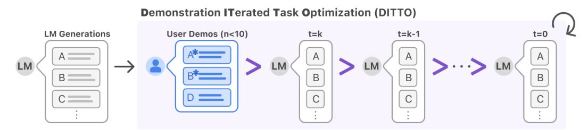
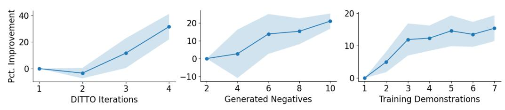
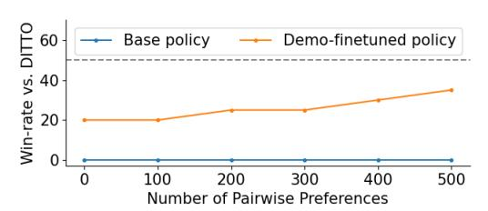
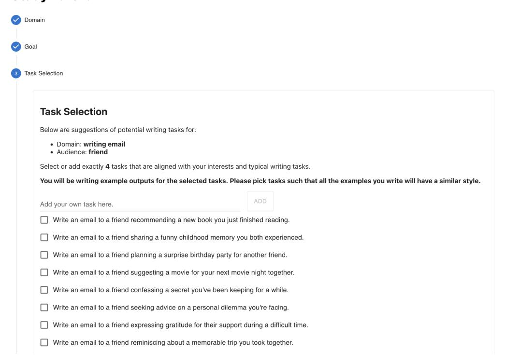
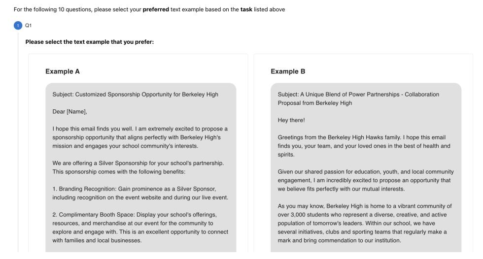

# *Show, Don't Tell*: Aligning Language Models with Demonstrated Feedback

Omar Shaikh<sup>∗</sup> Michelle Lam<sup>∗</sup> Joey Hejna<sup>∗</sup> Yijia Shao

Michael Bernstein Diyi Yang

Stanford University

# Abstract

Language models are aligned to emulate the collective voice of many, resulting in outputs that align with no one in particular. Steering LLMs away from generic output is possible through supervised finetuning or RLHF, but requires prohibitively large datasets for new ad-hoc tasks. We argue that it is instead possible to align an LLM to a specific setting by leveraging a very small number (< 10) of demonstrations as feedback. Our method, Demonstration ITerated Task Optimization (DITTO), directly aligns language model outputs to a user's demonstrated behaviors. Derived using ideas from online imitation learning, DITTO cheaply generates online comparison data by treating users' demonstrations as preferred over output from the LLM and its intermediate checkpoints. We evaluate DITTO's ability to learn fine-grained style and task alignment across domains such as news articles, emails, and blog posts. Additionally, we conduct a user study soliciting a range of demonstrations from participants (N = 16). Across our benchmarks and user study, we find that win-rates for DITTO outperform few-shot prompting, supervised fine-tuning, and other self-play methods by an average of 19% points. By using demonstrations as feedback directly, DITTO offers a novel method for effective customization of LLMs.[1](#page-0-0)

# 1 Introduction

Large language models (LLMs) are trained for general-purpose use. In practice, however, they are often applied to very specific tasks for very specific users. Consider a task as simple as writing an email: our preferred email depends on personal writing style, the specific email task, or the target audience (a friend, stranger, etc.). As a result, there can be a mismatch between the universal style [\[9,](#page-9-0) [37\]](#page-11-0) trained into an LLM via instruction and preference tuning, and the specific style needed for applications. LLM outputs feel unopinionated and generic because of this mismatch.

While existing approaches such as supervised or preference finetuning are effective, they can require a large corpus of (un)acceptable behavior (on the order of ≈ 1K samples [\[32,](#page-11-1) [54\]](#page-12-0)), which in turn requires unreasonably high effort from an individual. RLAIF methods like Constitutional AI [\[4\]](#page-9-1) automate pairwise preference collection with an LLM, but align models to general principles that may not capture fine-grained preferences. Although prompting is data efficient, finding an effective prompt can be tedious—end-users often rely on brittle prompting heuristics [\[49,](#page-11-2) [55\]](#page-12-1). How might we efficiently communicate preferences and align a language model to a new individual or task?

This paper introduces a framework for aligning LLMs to specific settings by providing a small number of *demonstrations* (Fig. [1\)](#page-1-0). Rather than using prompts, principles, or pairwise preferences,

<sup>∗</sup>Equal contribution.

<span id="page-0-0"></span><sup>1</sup>Code:<https://github.com/SALT-NLP/demonstrated-feedback>



<span id="page-1-0"></span>Figure 1: DITTO iteratively aligns LLMs to demonstrated behavior. When a user supplies demonstrations (through edits to a model's output, past preferred interaction history, or writing examples from scratch), DITTO treats these demonstrations as preferred to all model behavior, including earlier iterations of the trained model. Using demonstrations as feedback allows for cheap generation of online comparison data and enables few-shot alignment with just a handful of samples.

we show that we can achieve strong alignment with individuals by leveraging a small number of user-provided examples of desired behavior. These examples can be drawn from a user's existing interaction logs, or from direct edits made to LLM outputs. Our approach, DITTO, scaffolds a handful of these demonstrations (< 10) into a substantial dataset of preference comparisons, by treating users' demonstrations as preferred over model output from both the original LLM and models' earlier training iterations. This augmented dataset of demonstration-grounded comparisons can then be used to update the language model using an alignment algorithm like DPO [\[34\]](#page-11-3). We additionally show that DITTO can be interpreted as an online imitation learning algorithm, where data sampled from the LLM is used to distinguish expert behavior. This perspective allows us to prove that DITTO can extrapolate *beyond* the performance of the expert ([§3\)](#page-2-0).

Since DITTO focuses on user/task-specific alignment, we benchmark DITTO through (1) an evaluation on datasets of author-specific writing ([§4.1\)](#page-5-0) and (2) a user evaluation ([§4.2\)](#page-6-0) on real-world tasks defined by human participants. Our author-specific datasets include writing from blog posts to emails to articles. We find that win rates for DITTO outperform methods like SFT (avg. 11% pt. increase), self-play methods like SPIN (20.2% pt.), and few-shot prompting (33.4% pt.) on Mistral 7B—even when few-shot prompts are provided to a more powerful LLM (GPT-4, 18% pt.). Next, we conduct a user study (N = 16), asking individuals to edit generations from GPT-4 in an email-writing task. We use finalized demonstrations as inputs for DITTO. In these realistic user evaluations, DITTO's advantage becomes clearer: DITTO continues to outperform baselines, including few-shot prompting (23.9% pt.), user-constructed prompts (27.9% pt.), and SFT (12% pt.). Finally, in a direct comparison between demonstrations and pairwise feedback, we show that using demonstrations with DITTO is an order of magnitude more sample-efficient for individuals than soliciting pairwise preferences.

# 2 Related Work

LLMs and Preference Finetuning. Large language models trained on vast amounts of data have been known to perform well with careful prompting [\[7,](#page-9-2) [44\]](#page-11-4). Prompting, however, can be incredibly tedious [\[49\]](#page-11-2) to design and often sensitive to variations. Thus, it has become necessary to either finetune these models on large curated instruction following datasets [\[12,](#page-9-3) [28,](#page-10-0) [42\]](#page-11-5) and/or employ RLHF, where the LLM is trained to maximize a reward function learned from human preferences as a contextual bandit [\[58\]](#page-12-2). Typically, this is done using policy-gradient style methods [\[38,](#page-11-6) [45\]](#page-11-7) though more recent works learn directly from preference data [\[3,](#page-9-4) [19,](#page-10-1) [34\]](#page-11-3). While these methods are effective at tasks like summarization [\[41,](#page-11-8) [46,](#page-11-9) [47\]](#page-11-10) and instruction following [\[30,](#page-10-2) [32\]](#page-11-1) they require thousands to hundreds of thousands of paired comparisons to obtain a quality estimate of reward. This makes them prohibitively expensive for a wide range of applications, such as training a customized writing assistant or building a domain-specific chatbot. Group Preference Optimization (GPO) [\[52\]](#page-12-3) takes a promising step towards few-shot alignment of LLMs; however, preference groups must be pre-defined for meta-learning, which requires a large dataset. On the other hand, Gao et al. [\[16\]](#page-10-3) uses direct edits to distill latent preferences into prompt-based principles. In place of principles or pairwise feedback, DITTO directly learns preferences from a set of demonstrations, similar to model editing from canonical examples [\[20\]](#page-10-4). Drawing from prior studies on programming by demonstration and end-user programming in HCI [\[13,](#page-9-5) [14\]](#page-10-5), our work aims at soliciting feedback at a finer-grained level than binary preferences, principles, or prompts.

Self-Improvement. Recent works use iterative sampling to improve LLMs. Aproaches like STaR [2, 50, 51] are supervised by verifying the correctness of outputs, while Yuan et al. [48] and Burns et al. [8] use (potentially stronger) language models as critics. Unlike these approaches, DITTO does not require external signals besides demonstrations, similar to self-play methods like SPIN [10]. Unlike SPIN—which uses thousands of demonstrations and is targeted more towards SFT scale datasets—DITTO is designed for fast adaptation in the data-limited setting and thus has a few key distinctions. Namely, DITTO does not update the reference policy and uses intermodel comparisons to combat overfitting. We found these changes to be important to obtain good performance with only a handful of demonstrations. In data-abundant settings, other works have shown that an oracle reward function [18] or model [26] is sufficient to provide feedback. We consider tasks like personalization, for which there is no abundant data or oracle.

Online Imitation Learning. DITTO builds on online imitation learning, which appeals to the long-standing success of learning reward functions from comparisons [1, 15]. Brown et al. [5] first showed that with ranked demonstrations, one could improve a policy beyond the demonstrator's performance. Follow-ups used automatic noise injection to remove human rankings [6]. Other contemporary approaches to online imitation learning are based on adversarial games between reward and policy players [21, 57]. In our case, we use a KL-constrained formulation, like Watson et al. [43]. Sikchi et al. [39] generalizes the adversarial game to a ranking game and thus uses generated comparisons like DITTO. Unlike DITTO, however, these approaches explicitly require learning a reward function and are designed for continuous control—not for LLMs.

### <span id="page-2-0"></span>3 DITTO

While prior works use thousands of comparisons to align LLMs, DITTO instead uses only a handful of expert demonstrations to alter a model's behavior. This type of cheap, rapid adaptation is enabled by our core insight; that online comparison data can be easily obtained from demonstrations.

### 3.1 Notation and Background

A language model can be viewed as policy  $\pi(y|x)$  that produces a distribution over completions y to a prompt x. In RLHF, our objective is to train an LLM to maximize a reward function r(x,y) that measures the quality of a prompt-completion pair (x,y). Typically, a KL-divergence constraint is added to prevent the updated model from straying too far from a base LM [58], which we denote as  $\pi_{\text{ref}}$ . Altogether, RLHF methods optimize the following objective,

<span id="page-2-1"></span>
$$\mathcal{J}_{KL}(\pi) = \mathbb{E}_{y \sim \pi(\cdot|x), x \sim p} \left[ r(x, y) - \alpha \log \frac{\pi(y|x)}{\pi_{ref}(y|x)} \right]$$
 (1)

which maximizes the expected reward over the prompt distribution p subject to a KL-constraint modulated by  $\alpha$ . Usually, this objective is optimized using a comparison dataset of the form  $\{(x, y^w, y^l)\}$ , where the "win" completion  $y^w$  is preferred to the "loss" completion  $y^l$ , which we write as  $y^w \succeq y^l$ .

While this objective is ubiquitous in prior work [32, 34], it is typically applied in the context of population-based reward functions learned from large comparison datasets collected via a multitude of annotators. In contrast, we consider r(x,y) to be the objective of a single individual. In this regime, collecting thousands of comparisons from one user is infeasible. Instead, we assume access to a small dataset of expert demonstrations, denoted  $\mathcal{D}_E$ . We assume these demonstrations to be generated from the expert policy  $\pi_E = \arg\max_{\pi} \mathbb{E}_{y \sim \pi(\cdot|x), x \sim p}[r(x,y)]$ , which maximizes reward in expectation. While demonstrations are typically used for SFT, such approaches typically struggle in data-limited settings. On the other hand, it can be difficult to prompt a model to "overcome" the priors induced by its RLHF training. DITTO, as described in the next section, addresses these problems by directly generating comparison data using LM outputs and expert demonstrations. This means that unlike synthetic data generation paradigms [26], DITTO does not require a model that performs well at the given task a priori.

### 3.2 DITTO

The key insight of DITTO is that the LM itself, along with the expert demonstrations, can generate comparison datasets for alignment, removing the need to collect a large number of pairwise prefer-

ences. This results in a contrastive-like objective, where the expert demonstrations are positives. Here we provide an intuitive explanation of DITTO; later we provide a more theoretical derivation in §3.3.

Generating Comparisons. Consider a completion sampled from the expert policy,  $y^E \sim \pi_E(\cdot|x)$ . By virtue of being "expert",  $y^E$  is likely to have high reward, as  $\pi_E$  is definitionally the reward maximizer in expectation. Consequently, we would expect samples from any other policy  $\pi$  to have rewards less than or equal to those of  $\pi_E$ , i.e.,  $\forall \pi, \mathbb{E}_{\pi_E}[r(x,y)] \geq \mathbb{E}_{\pi}[r(x,y)]$ . Using this observation, we can construct comparisons  $(x,y^E,y^\pi)$  where  $y^E \succeq y^\pi$  by simply sampling completions  $y^\pi \sim \pi(\cdot|x)$  for every demonstration-prompt pair in  $\mathcal{D}_E$ . Though such comparisons are derived from policies instead

### Algorithm 1: DITTO

```
Input :LM \pi_{\mathrm{ref}}, demos \mathcal{D}_E = \{(x_i, y_i^E)\}_{i \in N}, sample size M, sample frequency K
Init :\pi_0 \leftarrow \mathbf{SFT}(\pi_{\mathrm{ref}}, \mathcal{D}_E), t = 0
while not converged do
\mathcal{D}_t \leftarrow \cup_{i=1}^N \{(x_i, y_j \sim \pi_t(\cdot|x_i)\}_{j=1}^M
for k = 1, 2, 3, ..., K do
Sample batch B = \{(x, y^w, y^l)\} of comparisons from induced ranking:
\mathcal{D}_E \succeq \mathcal{D}_t \succeq \mathcal{D}_{t-1} \succeq ... \succeq \mathcal{D}_0
\pi_t \leftarrow \mathrm{DPO}(\pi_t, B) \text{ # Update policy}
t \leftarrow t + 1
```

of individual examples, they have proven effective in prior work [6]. A naïve approach for DITTO would then optimize Eq. (1) using this dataset and an off-the-shelf RLHF algorithm. Doing so would increase the probability of the expert responses while decreasing the probability of the current model samples, unlike standard finetuning which only does the former. Crucially, using samples from  $\pi$  allows us to construct an unbounded preference dataset given only a few demonstrations. However, we can do better by considering the temporal aspect of the learning process.

From Comparisons to Rankings. Using comparisons only between the expert and single policy  $\pi$  may be insufficient for obtaining good performance. Doing so decreases likelihoods only at that specific  $\pi$ , leading to the overfitting problems that plague SFT in low-data regimes. Analogous to replay in RL [29], we can consider data generated from all policies learned over time during RLHF.

At the first iteration, let the initial policy be  $\pi_0$ . We can sample from this policy to assemble a dataset  $\mathcal{D}_0 = \{(x, y^{\pi_0})\}$ . Then, we can generate comparison data for RLHF as  $y^E \succeq y^{\pi_0}$ , which we denote as  $\mathcal{D}_E \succeq \mathcal{D}_0$  for brevity. Using these induced comparisons, we update  $\pi_0$  to obtain a new policy  $\pi_1$ . By definition,  $\mathbb{E}_{\pi_E}[r(x,y)] \geq \mathbb{E}_{\pi_1}[r(x,y)]$  as well. It follows that we can also generate comparisons using  $\pi_1$  as  $\mathcal{D}_E \succeq \mathcal{D}_1$ . Continuing this procedure, we generate a progressively more diverse comparison dataset using all prior policies. We refer to these as "replay" comparisons.

While this approach is theoretically consistent, it decreases the likelihood of the LM everywhere except at expert demonstrations. Though permissible in data rich scenarios, this may also lead to overfitting with a small  $\mathcal{D}_E$ . However, if we assume that the policy improves at each iteration, i.e.  $\mathbb{E}_{\pi_{t+1}}[r(x,y)] \geq \mathbb{E}_{\pi_t}[r(x,y)]$ , then we can also consider comparisons between policies during the course of learning. Unlike comparisons with the expert, we do not guarantee that this holds; in practice, however, we found that models tended to improve with each iteration, perhaps owing to the convexity of both reward modeling and Eq. (1). This lets us sample comparisons between the complete ranking of policies

<span id="page-3-1"></span>
$$\mathcal{D}_E \succeq \mathcal{D}_t \succeq \mathcal{D}_{t-1} \succeq \dots \succeq \mathcal{D}_1 \succeq \mathcal{D}_0. \tag{2}$$

The effect of adding these "intermodel" and "replay" comparisons is that the likelihoods of earlier samples (e.g., those in  $\mathcal{D}_1$ ) are pushed down more than those of later samples (e.g., those in  $\mathcal{D}_t$ ), smoothing the implicit reward landscape. Our practical implementation aggregates a handful of these intermodel comparisons in addition to comparisons with the expert.

A Practical Algorithm. In practice, the DITTO algorithm is an iterative procedure comprised of *three* simple components as outlined in Algorithm 1. *First*, we begin by running supervised fine-tuning on the set of expert demonstrations for a limited number of gradient steps. We set this to be the initial policy  $\pi_0$ . *Second*, we sample comparisons: at most K times during the training process, we construct a new dataset  $\mathcal{D}_t$  by sampling M completions from  $\pi_t$  for each of the N demonstrations in  $\mathcal{D}_E$  and add it to the ranking over policies Eq. (2). When sampling comparisons from Eq. (2) each batch B is comprised of 70% "online" comparisons  $\mathcal{D}_E \succeq \mathcal{D}_t$ , 20% "replay" comparisons of the form  $\mathcal{D}_E \succeq \mathcal{D}_{i < t}$ , and 10% "intermodel comparisons" of the form  $\mathcal{D}_{i \le t} \succeq \mathcal{D}_{j < i}$ . *Finally*, we update the policy using RLHF. Specifically, using batches sampled via the aforementioned procedure, we update

the policy  $\pi_t$  to obtain  $\pi_{t+1}$  using the DPO [34] loss function

$$\mathcal{L}_{\mathrm{DPO}}(\pi, \mathcal{D}) = -\mathbb{E}_{(x, y^w, y^l) \sim \mathcal{D}} \left[ \log \sigma \left( \alpha \log \frac{\pi(y^w | x)}{\pi_{\mathrm{ref}}(y^w | x)} - \alpha \log \frac{\pi(y^l | x)}{\pi_{\mathrm{ref}}(y^l | x)} \right) \right].$$

where  $\sigma$  is the logistic function from the Bradley-Terry preference model. During each update, we do not update the reference model  $\pi_{\text{ref}}$  from the SFT policy to avoid straying too far from initialization.

# <span id="page-4-0"></span>3.3 Deriving DITTO as Online Imitation Learning

DITTO can be derived through an *online imitation learning* perspective, where expert demonstrations are used in conjunction with online data to simultaneously learn a reward function and policy. Specifically, the policy player maximizes expected reward  $\max_{\pi} \mathcal{J}(\pi,r)$ , as the reward player minimizes its loss  $\min_{r} \mathcal{L}(\mathcal{D}^{\pi},r)$  over an online dataset  $\mathcal{D}^{\pi}$ . Concretely, we instantiate this optimization problem using the policy objective in Eq. (1) and the standard reward modeling loss

<span id="page-4-1"></span>
$$\min_{r} \left\{ -\mathbb{E}_{(x,y^w,y^l) \sim \mathcal{D}_{\pi}} \left[ \log \sigma(r(x,y^w) - r(x,y^l)) \right] \text{ s.t. } \pi = \arg \max_{\pi} \mathcal{J}_{\text{KL}}(\pi,r) \right\}. \tag{3}$$

As done in prior work [39], we take  $\mathcal{D}^{\pi}$  to be a dataset of comparisons such that  $y^{\pi} \succeq y^{\pi'}$  if  $\mathbb{E}_{\pi}[r(x,y)] \geq \mathbb{E}_{\pi'}[r(x,y)]$ . The  $\pi$  superscript indicates that  $\mathcal{D}^{\pi}$  contains *online* comparisons between  $\pi$  and the expert  $\pi_E$ . By using different choices of regularizers and comparison data, one can arrive at different inverse RL (IRL) objectives [21].

**Deriving DITTO.** The first step in simplifying Eq. (3) is addressing the inner policy maximization. Fortunately, from Ziebart [56] we know that the policy objective  $\mathcal{J}_{\text{KL}}$  has a closed form solution of the form  $\pi^{\star}(y|x) = \pi_{\text{ref}}(y|x)e^{r(x,y)/\alpha}/Z(x)$  where Z(x) is the partition function normalizing the distribution. Notably, this establishes a bijection between policies and reward functions which we can use to eliminate the inner optimization. By rearranging this solution, we can write the reward function r as

$$r(x,y) = \alpha \log \frac{\pi^{\star}(y|x)}{\pi_{ref}(y|x)} - \alpha \log Z(x).$$

Furthermore, prior work [35] shows that this reparameterization can express any reward function. Thus, we can perform a change of variables from r to  $\pi$  by substitution into Eq. (3), giving us the DITTO objective

$$\min_{\pi} - \mathbb{E}_{\mathcal{D}^{\pi}} \left[ \log \sigma \left( \alpha \log \frac{\pi(y^w | x)}{\pi_{\text{ref}}(y^w | x)} - \alpha \log \frac{\pi(y^l | x)}{\pi_{\text{ref}}(y^l | x)} \right) \right].$$

Note that like DPO, we implicitly estimate the reward function. Unlike DPO, DITTO depends on an *online* dataset of preferences  $\mathcal{D}^{\pi}$ . At a minimum, the online preference dataset ought to contain comparisons  $\pi_E \succeq \pi, \forall \pi$ . However, any preferences consistent with the ground-truth reward function can additionally be used. We leave this exploration to future work.

Why does DITTO work better than SFT alone? One reason for DITTO's relatively high performance is that it uses far more data than SFT by generating comparisons. Another is that online imitation learning methods can, in some circumstances, perform better than the demonstrator while SFT only mimics the demonstrations. While this is known in the IRL community, we show the following result in Appendix A to relate DITTO's ability to extrapolate beyond the demonstrator to two divergence measures.

**Lemma 3.1.** (Adapted from Brown et al. [6]) Let  $\pi^*$  be the optimal policy for Eq. (1) and  $\hat{\pi}$  be the policy estimated by DITTO using expert demonstrations  $\mathcal{D}_E$ . Extrapolation beyond the demonstrator, i.e.  $\mathbb{E}_{\hat{\pi}}[r(x,y)] > \mathbb{E}_{\mathcal{D}_E}[r(x,y)]$  is guaranteed if  $\mathcal{J}_{\mathit{KL}}(\pi^*) - \mathbb{E}_{\mathcal{D}_E}[r(x,y)] > \alpha D_{\mathit{KL}}(\hat{\pi}||\pi^*) - \alpha D_{\mathit{KL}}(\hat{\pi}||\pi_{\mathit{ref}})$ .

### <span id="page-4-2"></span>4 Experiments

We first outline benchmarks, focusing on tasks with subjective preferences (e.g., email writing, essays, articles). We then discuss automatic evaluation, compare DITTO to several baselines, and outline results. Finally, we conduct a user study with DITTO, soliciting demonstrations from participants.

| Data | Method                                          | $a_{\text{avg}}$                                                                                                     | $a_1$                                     | $a_2$                                            | $a_3$                                            | $a_4$                                            | $a_5$                                            | $a_6$                                            | $a_7$                                            | $a_8$                                            | $a_9$                                            | $a_{10}$                                         |
|------|-------------------------------------------------|----------------------------------------------------------------------------------------------------------------------|-------------------------------------------|--------------------------------------------------|--------------------------------------------------|--------------------------------------------------|--------------------------------------------------|--------------------------------------------------|--------------------------------------------------|--------------------------------------------------|--------------------------------------------------|--------------------------------------------------|
|      | ⊟ zero-shot<br>  ⊖ few-shot                     | $31.89_{3.05} \\ 63.89_{3.18}$                                                                                       | 43.06<br><b>73.61</b>                     | 29.17 $68.06$                                    | $22.22 \\ 62.50$                                 | $37.04 \\ 62.04$                                 | $18.52 \\ 55.56$                                 | $42.59 \\ 64.81$                                 | 19.44<br><b>75.93</b>                            | 40.28<br><b>63.89</b>                            | $40.28 \\ 40.28$                                 | 31.48<br>68.52                                   |
| CMCC | zero-shot few-shot SPIN SSFT DITTO              | $\begin{array}{c} 27.33_{2.24} \\ 46.89_{4.76} \\ 51.56_{3.85} \\ 56.78_{7.04} \\ \textbf{71.67}_{2.30} \end{array}$ | 34.72<br>61.11<br>56.94<br>18.06<br>62.50 | 30.56<br><b>76.39</b><br>48.61<br>27.78<br>69.44 | 16.67<br>26.39<br>56.94<br><b>86.11</b><br>79.17 | 29.63<br>30.56<br>40.74<br>74.07<br><b>75.93</b> | 27.78<br>42.59<br>73.15<br>58.33<br><b>74.07</b> | 30.56<br>52.78<br>48.15<br>43.52<br><b>67.59</b> | 19.44<br>37.04<br>59.26<br>64.81<br>74.07        | 38.89<br>41.67<br>59.72<br>47.22<br>58.33        | 19.44<br>54.17<br>31.94<br>81.94<br><b>81.94</b> | 26.85<br>54.63<br>38.89<br>58.33<br><b>71.30</b> |
|      | ⊟ zero-shot<br>  ⊖ few-shot                     | $19.35_{1.40} \\ 53.70_{2.19}$                                                                                       | 19.44<br>64.81                            | 24.07<br>53.70                                   | 25.00<br>61.11                                   | 18.52<br>53.70                                   | 12.96<br>47.22                                   | 20.37<br>44.44                                   | 12.04<br>45.37                                   | 23.15<br>61.11                                   | 16.67 $52.78$                                    | 21.30<br>52.78                                   |
| CCAT | zero-shot  g few-shot  H SPIN  SPIN  SFT  DITTO | $18.06_{1.61} \\ 40.37_{2.33} \\ 62.13_{3.11} \\ 73.89_{2.50} \\ 82.50_{1.93}$                                       | 13.89<br>56.48<br>56.48<br>61.11<br>77.78 | 23.15<br>45.37<br>69.44<br>62.04<br><b>72.22</b> | 15.74<br>35.19<br>55.56<br>76.85<br><b>80.56</b> | 12.96<br>32.41<br><b>82.41</b><br>72.22<br>77.78 | 13.89<br>41.67<br>70.37<br>80.56<br><b>83.33</b> | 22.22<br>39.81<br>54.63<br>81.48<br><b>87.04</b> | 17.59<br>46.30<br>58.33<br>80.56<br><b>89.81</b> | 14.81<br>35.19<br>54.63<br>68.52<br><b>92.59</b> | 28.70<br>34.26<br>51.85<br>82.41<br><b>83.33</b> | 17.59<br>37.04<br>67.59<br>73.15<br><b>80.56</b> |

<span id="page-5-2"></span>Table 1: **GPT-4 Eval**: Head-to-head win rates between methods across benchmark test splits. DITTO outperforms all baseline methods on average and across a plurality of individual authors.  $a_1...a_{10}$  represents a single model trained on one of ten sampled authors from each dataset (see §4). Results are averaged across 3 runs, with 3 samples generated from each model with temperature 1.0. We also report win rates averaged across authors, along with standard error of the mean (avg<sub>sem</sub>).

### <span id="page-5-0"></span>4.1 Static Benchmarks

**Data** Measuring few-shot alignment with DITTO requires demonstrations from individuals instead of aggregated datasets. We therefore build on prior  $Author\ Attribution\ (AA)$  datasets. The AA task requires one to determine which author a from a set of authors A wrote a specific document. We can reframe prior AA classification tasks as effective alignment: aligning an LLM to a specific author should result in generations that are more likely to be attributed to the same author. We collect data from 20 distinct authors from two sources: (1) emails and blog posts from the CMCC dataset [17] that contain only one author and (2) news articles from the CCAT dataset [27]. For more dataset details, we refer the reader to Appendix B.

**Splits and Preprocessing** Some of our benchmarks have more writing samples per author than others. While the original CCAT can have more than 50 samples per author, CMCC can have as few as 12. To control for sample count, we randomly select the smallest set of demonstrations available from each author across our training splits (12) for our experiments. We randomly select 10 authors from each dataset, use 7 samples to train, and split the remainder into test and validation. Table 4 in the Appendix describes the finalized train/val/test counts across each benchmark.

**Models and Baselines** Alongside DITTO, we evaluate continued supervised fine-tuning (**SFT**), where we simply fine-tune on the expert demonstrations  $\mathcal{D}_E$ . We also evaluate **SPIN** [10], an iterative self-play method designed to replace SFT. Finally, we test **zero-shot** and **few-shot** prompting, including demonstrations directly in the model's context. For few-shot prompting, we add the train set of an author in-context. Our experiments require a base, instruction following LLM. We use Mistral Instruct v0.2 7B as a starting point [23] and train using LoRA [22]. Finally, we compare against zero/few-shot prompting with a more powerful LLM (GPT-4). Hyperparameter details are in Appendix C.

<span id="page-5-3"></span>**Automatic Evaluation** Given that our datasets contain a total of 20 authors, we must train and evaluate a large set of models (20 authors x 7 training paradigms = 140 models). To facilitate the evaluation process, we use GPT-4<sup>2</sup> to compare the outputs of models across various conditions. Prior work has used GPT to both annotate and evaluate text [53]. Performance lags behind human evaluation; however, GPT-4 eval generally outperforms other automatic metrics, allowing us to scale hyperparameter search and run evaluation in a more cost-effective manner.

In our setting, we use GPT-4 to determine if a text sounds more or less like a specific author. Given an author-written text t and two pairs of generated text from different conditions a and b, we prompt GPT-4 to select the text that most closely matches the validation or test text t, and compute averaged head-to-head win rates. Prompting details are outlined in Appendix D.

<span id="page-5-1"></span><sup>&</sup>lt;sup>2</sup>We use the gpt-4-0613 version of GPT-4. We observed that Turbo versions of GPT-4 were more biased towards their own outputs. Queries were run between December 20th, 2023 to May 10th, 2024.

Results Our main results, evaluated with GPT-4 eval, are summarized in Table [1.](#page-5-2) Averaged across all authors, DITTO outperforms all baselines, with an average 77.09% win-rate across both CMCC (71.67%) and CCAT50 (82.50%). On CCAT50, DITTO outperforms all baselines across authors but one. On CMCC, DITTO outperforms all other baselines for 5/10 authors, followed by few-shot prompting for 3/10. While SFT serves as a strong baseline (56.78% on CMCC, 73.89% on CCAT), DITTO provides an average ↑11.7% pt. win rate improvement compared to SFT alone.

Prompted baselines also lag far behind DITTO, especially zero-shot (including closed-source) models (avg. ↓54.4% pt. decrease on Mistral, ↓51.5% pt. on GPT-4). While zero-shot GPT-4 is already finetuned using RLHF, we suspect that this training feedback differs significantly from that of authors in both CMCC and CCAT50. Adding few-shot examples to the prompt does help: win rates for few-shot prompting increase compared to zero-shot for both Mistral (↑20.94% pt.) and GPT-4 (↑22.95% pt.) based LLMs. However, including few-shot examples still falls behind applying DITTO (avg. ↓37.35% pt. decrease for Mistral; ↓26.99% pt. for GPT-4). We suspect the underlying RLHF priors for out-of-the-box LLMs are fairly strong. Qualitatively, few-shot generations still sound GPT-generated relative to DITTO (Table [6](#page-22-0) in Appendix).

While we do test another self-improvement training method (SFT + SPIN), we find that performance is lower than DITTO (avg.↓ 9.3% pt.)—we suspect that design decisions for SPIN (e.g., updating the reference policy, excluding interpolicy / replay comparisons) are targeted towards SFT-scale datasets. We ablate these decisions in [§5.1](#page-7-0) and propose reasons for performance degradation.

# <span id="page-6-0"></span>4.2 User Study: Testing Generalization to Naturalistic Tasks

Our static benchmarks have focused on pre-existing author attribution datasets, using GPT-4 to measure alignment. However, GPT-4 eval exhibits a self-enhancement bias, likely inflating performance for LLM-like generations [\[33,](#page-11-16) [53\]](#page-12-7). We therefore evaluate DITTO in a *more naturalistic* setting; we conduct a user study to evaluate DITTO and ask users to provide demonstrations for a range of tasks. As baselines, we use zero-shot and few-shot prompted GPT-4, along with SFT. Additionally, we ask participants to self-prompt models by iteratively authoring their own prompts to steer the model outputs. Zero-shot, few-shot, and self-prompt emulate what most users would do today to steer LLMs, and SFT provides a strong finetuning baseline. We recruit 16 participants from social media postings (Twitter). Participants were paid \$30 per hour, and our study was approved by our institution's IRB.

User Study Outline The user study consists of two parts. In the first part, we ask participants to specify four email-writing tasks (e.g., *Write an email to your advisor asking for feedback*). Participants are asked to provide two demonstrations for two of the tasks (4 training demonstrations in total). To help brainstorm tasks, we generate concrete task suggestions with GPT-4; participants could select from among these or provide their own custom tasks. We randomly split two task prompts into train, and saved two for testing; participants gave two demonstrations each for both the training prompts, to mimic a user willing to only put in minimal effort. Users were provided with default generations from GPT-4 to aid authoring demonstrations, which they could edit or ignore. In the second part, we use the two tasks from the test set and show participants

| Method       |                                      | Win Rate             |
|--------------|--------------------------------------|----------------------|
| GPT-4        | zero-shot<br>few-shot<br>self-prompt | 25.0<br>48.1<br>44.2 |
| SFT<br>DITTO |                                      | 60.1<br>72.1         |

<span id="page-6-1"></span>Table 2: User Study Results. In head-to-head human annotated win rates, DITTO outperforms selfprompted, few-shot, and zero-shot GPT-4 baselines, along with SFT.

generations across all methods. We sampled one output from each method (self-prompt, zero-shot, few-shot, SFT, and DITTO), and solicited 10 pairwise preferences for each test prompt (resulting in 20 preferences total for each user). In all, we collect a total of 320 pairwise preferences across 16 users. Additional user study details (e.g., interface, examples of demonstrated feedback, prompts for generating tasks, etc.) are in Appendix [E.](#page-16-0)

Results Our user study results corroborate findings from static benchmarks. DITTO outperforms baseline methods in aligning to demonstrated preferences (Table [2\)](#page-6-1), with DITTO (72.1% win-rate) > SFT (60.1%) > few-shot (48.1%) > self-prompt (44.2%) > zero-shot (25.0%). Additionally, users generally struggle with verbalizing preferences into prompts: self-prompting slightly underperforms providing demonstrations in a few-shot prompt, and substantially underperforms DITTO. We also qualitatively observe that users often edit nearly half of the default output from GPT-4 when authoring demonstrations (examples in Appendix [E\)](#page-16-0), with average normalized Levenshtein edit distance = 0.43. Large edits to the output alone highlight the effectiveness of demonstrated feedback as an interaction.



<span id="page-7-1"></span>Figure 2: Head-to-head win rates across DITTO hyperparameter perturbations on CMCC. First, increasing the number of DITTO iterations improves GPT-4 eval performance (left). Increasing the number of generated negatives also reduces DITTO variance across users while improving DITTO performance (middle). Finally, increasing demos also improves performance, but we observe diminishing returns (right). Error bars correspond to standard error of the mean across authors.

# 5 When does DITTO work?

A user must decide on several prerequisites before using DITTO, from how many demos they have to how many negatives they must sample from the LM. We explore the impact of these decisions and focus on CMCC, as it covers a broader range of tasks than CCAT. We additionally analyze the sample efficiency of demonstrations vs. pairwise feedback in our user study setting.

# <span id="page-7-0"></span>5.1 Algorithm Perturbations

DITTO consists of several hyperparameters: namely, the number of DITTO iterations N = {1..4} and negative samples M = {2...10} generated from our sequence of policies. Separately, we ablate components of DITTO, like the use of inter-policy (Di≤<sup>t</sup> ⪰ Dj<i) and replay (D<sup>E</sup> ⪰ Di<t) comparisons. We also test an ablation where we do not re-sample data during training and instead cumulatively sample all negatives at the start, and where we update πref = π<sup>t</sup> at each iteration like SPIN [\[10\]](#page-9-8). We then reevaluate DITTO against ablations and hyperparameter perturbations by computing head-to-head win rates with GPT-4 (similar to [§4.1\)](#page-5-3). Because DITTO performance varies from user to user, we convert win rates to % improvement from the first ablation across authors.

Increasing the number of DITTO iterations generally improves performance (Fig. [2\)](#page-7-1). Comparing Iteration 1 to Iteration 4, we observe a relative 31.5% increase in GPT-4 eval win rates. Improvement is non-monotonic—in Iteration 2, performance drops slightly (-3.4%). Early iterations might yield noisier samples, potentially reducing performance. On the other hand, increasing negative samples monotonically improves DITTO performance. Generating 10 negatives for each demonstration in the training set, for example, yields an 21.09% win-rate improvement compared to just 2. Furthermore, as we sample more negatives increases, variance in DITTO performance decreases. However, there is a tradeoff associated with increasing the number of negative samples: runtime of DITTO will also increase. We also hypothesize that increasing iterations, negative samples, etc., will yield diminishing returns; exploring these tradeoffs is an avenue for future work.

| Ablation             | Win Rate |
|----------------------|----------|
| Cumulative sample    | 57.3     |
| DITTO                | 70.1     |
| → remove interpolicy | 68.1     |
| → remove replay      | 63.6     |
| → update πref        | 45.8     |

<span id="page-7-2"></span>Table 3: Head-to-head win rates across DITTO algorithm ablations on CMCC. We experiment with sampling all negatives upfront (Cumulative Sample), ablating replay and interpolicy comparisons, and updating the reference policy.

We also find that ablating components of DITTO results in reduced performance (Table [3\)](#page-7-2). If we sample all negatives at the start—instead of iteratively resampling in an online fashion—we observe that win rates compared to using DITTO drop from 70.1% to 57.3%. While iteratively re-sampling improves performance, continuously updating πref during this online process can significantly degrade performance: win rates drop from 70.1% to 45.8%. We suspect updating πref results in potential overfitting. Finally, both replay and inter-policy comparisons help DITTO. Removing replay and interpolicy comparisons reduces win rates from DITTO by 6.5 and 2 points respectively.

### 5.2 Sample Efficiency

A key affordance of DITTO is its sample efficiency. In [§4,](#page-4-2) we examined DITTO's performance on the full training set of 7 demonstrations from each author. In practice, a user may only provide one or two demonstrations. Therefore, we evaluate sample efficiency across DITTO trained smaller subsets of the full training corpus  $N=\{1...7\}$ . Like with our algorithm perturbations, we report per-user normalized win rates (Figure 2). First, we observe that DITTO win rates increase rapidly at the start. From  $1 \le N \le 3$ , normalized performance roughly doubles for each additional demonstration  $(0\% \to 5\% \to 11.9\%)$ . However, we observe diminishing returns when supplying extra demonstrations  $(4 \le N \le 7, 11.9\% \to 15.39\%)$ , indicating that DITTO performance saturates as demonstrations increase. A key design decision in using DITTO lies in the selection of demonstrations; we additionally suspect that the quality of provided demonstrations likely also affects DITTO performance. Understanding how to select an optimal set of demonstrations for DITTO from a user is an avenue for future work.

# 5.3 How do pairwise preferences compare against demonstrations?

A core assumption of DITTO lies in sample efficiency coming from demonstrations. In theory, a user *could* achieve similar performance by labeling many pairwise preferences with an ideal set of demonstrations in mind. As a preliminary approximation, one author provided demonstrations for the user study and also annotated 500 preference pairs using outputs sampled from the instruction following Mistral 7B (demonstrations in Appendix E.4). Altogether, we constructed a pairwise preferences dataset  $D_{pref} = \{(x, y^i, y^j)\}, \text{ where } y_i \succ y_j. \text{ We then }$ computed win rates between 20 pairs sampled from Mistral trained on (a) 4 demonstrations with DITTO, and (b) on  $\{0...500\}$  preference pairs with just DPO. When we sample pairwise preferences from  $\pi_{ref}$  alone, we observe that generated pairs are out-of-distribution relative to the demonstrations—pairwise preferences do not



<span id="page-8-0"></span>Figure 3: **Demonstrations are more sample efficient than pairwise preferences** for an individual user. We compared DITTO with 4 demos to pairwise prefs sampled from (1) base instruction-following LM  $\pi_{\rm ref}$  and (2)  $\pi_{\rm ref}$  fine-tuned on demos. Applying DPO on 500 pairwise preferences—with samples from  $\pi_{\rm ref}$ —yields no improvement compared to DITTO. Even if demos are used to fine-tune  $\pi_{\rm ref}$  before sampling, one must collect many pairwise preferences to approach DITTO.

reach a user's demonstrated behavior (results in Fig. 3: "Base policy," in blue). Even when we fine-tune  $\pi_{\text{ref}}$  on the user's demonstrations, we still need > 500 preferences to match DITTO performance (Fig. 3: "Demo-finetuned policy," in orange).

### 6 Conclusion

Current modes for soliciting feedback—like principles or pairwise annotations—cater to population-level preferences. In this work, we instead highlight the effectiveness of using demonstrations as feedback, and show that a limited number of demonstrated behaviors can provide a strong signal for preferences specific to an individual. We also introduce a new technique, DITTO, that cheaply generates online comparison data from demonstrations, and test DITTO's effectiveness across static benchmarks and a user study. Focusing feedback collection at the demonstration level may offer a more diverse overview of individual preferences, and encourage a re-evaluation of the interfaces and interactions used to collect human feedback.

Limitations First, we noticed a discrepancy between GPT eval and our user study (Appendix D). While we do mitigate this effect with a user study, we still note that GPT eval is biased toward LLM-generated results. Furthermore, GPT eval is highly sensitive to the prompt used for evaluation. Another limitation involves DITTO speed: DITTO is slower than training-free approaches (prompting) and SFT (15 minutes with DITTO vs. 2 minutes with SFT on 7 demonstrations). A bottleneck lies in sampling, though we suspect a mix of prior (e.g., vLLM [25]) and future work in LLM inference optimization can improve DITTO's speed. Finally, DITTO is uninterpretable. It is unclear exactly what a model learns after several iterations: do values shift too, or is it just style? We also suspect that forgetting may affect DITTO. Even with LoRA, models DITTO-ed on writing sometimes refuse to generate code. Related work on overgeneralization might mitigate these effects [40]. Because of evaluation and computational constraints, we also do not test other model families or sizes. Finally, analyzing tradeoffs between types of preference data (e.g. demonstrations vs. preferences vs. principles) requires additional analysis; each type of feedback requires different levels of effort, and the effectiveness depends on the user providing feedback. We leave exploration for future work.

Broader Impacts Demonstrated feedback is a double-edged sword. While DITTO can enable effective personalization of language models, we also suspect that DITTO will be especially useful for model *un*-alignment, amongst a range of other risks [\[24\]](#page-10-16). However, the current status quo of language model alignment lies with large corporations that practice limited transparency. Models like GPT-4 already espouse dangerous positive stereotypes or unfairly benefit privileged groups due to representation issues in the feedback collection process [\[11,](#page-9-12) [36\]](#page-11-18).

# 7 Acknowledgements

We thank Eric Zelikman, Matt Jörke, Jan-Philipp Fränken, Michael Y. Li, Michael Ryan, Will Held, Shan Rizvi, Suvir Mirchandani, and Jensen Gao for helpful discussions and feedback. We also thank members of the SALT Lab and the Stanford HCI / NLP groups.

# References

- <span id="page-9-9"></span>[1] R. Akrour, M. Schoenauer, and M. Sebag. April: Active preference learning-based reinforcement learning. In *Machine Learning and Knowledge Discovery in Databases: European Conference, ECML PKDD 2012, Bristol, UK, September 24-28, 2012. Proceedings, Part II 23*, pages 116–131. Springer, 2012.
- <span id="page-9-6"></span>[2] C. Andukuri, J.-P. Fränken, T. Gerstenberg, and N. D. Goodman. Star-gate: Teaching language models to ask clarifying questions. *arXiv preprint arXiv:2403.19154*, 2024.
- <span id="page-9-4"></span>[3] M. G. Azar, M. Rowland, B. Piot, D. Guo, D. Calandriello, M. Valko, and R. Munos. A general theoretical paradigm to understand learning from human preferences. *arXiv preprint arXiv:2310.12036*, 2023.
- <span id="page-9-1"></span>[4] Y. Bai, S. Kadavath, S. Kundu, A. Askell, J. Kernion, A. Jones, A. Chen, A. Goldie, A. Mirhoseini, C. McKinnon, et al. Constitutional ai: Harmlessness from ai feedback. *arXiv preprint arXiv:2212.08073*, 2022.
- <span id="page-9-10"></span>[5] D. Brown, W. Goo, P. Nagarajan, and S. Niekum. Extrapolating beyond suboptimal demonstrations via inverse reinforcement learning from observations. In *International conference on machine learning*, pages 783–792. PMLR, 2019.
- <span id="page-9-11"></span>[6] D. S. Brown, W. Goo, and S. Niekum. Better-than-demonstrator imitation learning via automatically-ranked demonstrations. In *Conference on robot learning*, pages 330–359. PMLR, 2020.
- <span id="page-9-2"></span>[7] T. Brown, B. Mann, N. Ryder, M. Subbiah, J. D. Kaplan, P. Dhariwal, A. Neelakantan, P. Shyam, G. Sastry, A. Askell, et al. Language models are few-shot learners. *Advances in neural information processing systems*, 33:1877–1901, 2020.
- <span id="page-9-7"></span>[8] C. Burns, P. Izmailov, J. H. Kirchner, B. Baker, L. Gao, L. Aschenbrenner, Y. Chen, A. Ecoffet, M. Joglekar, J. Leike, et al. Weak-to-strong generalization: Eliciting strong capabilities with weak supervision. *arXiv preprint arXiv:2312.09390*, 2023.
- <span id="page-9-0"></span>[9] T. Chakrabarty, P. Laban, D. Agarwal, S. Muresan, and C.-S. Wu. Art or artifice? large language models and the false promise of creativity. *arXiv preprint arXiv:2309.14556*, 2023.
- <span id="page-9-8"></span>[10] Z. Chen, Y. Deng, H. Yuan, K. Ji, and Q. Gu. Self-play fine-tuning converts weak language models to strong language models. *arXiv preprint arXiv:2401.01335*, 2024.
- <span id="page-9-12"></span>[11] M. Cheng, E. Durmus, and D. Jurafsky. Marked personas: Using natural language prompts to measure stereotypes in language models. *arXiv preprint arXiv:2305.18189*, 2023.
- <span id="page-9-3"></span>[12] H. W. Chung, L. Hou, S. Longpre, B. Zoph, Y. Tay, W. Fedus, Y. Li, X. Wang, M. Dehghani, S. Brahma, et al. Scaling instruction-finetuned language models. *arXiv preprint arXiv:2210.11416*, 2022.
- <span id="page-9-5"></span>[13] A. Cypher. Eager: Programming repetitive tasks by example. In *Proceedings of the SIGCHI conference on Human factors in computing systems*, pages 33–39, 1991.

- <span id="page-10-5"></span>[14] A. Cypher and D. C. Halbert. *Watch what I do: programming by demonstration*. MIT press, 1993.
- <span id="page-10-8"></span>[15] J. Fürnkranz, E. Hüllermeier, W. Cheng, and S.-H. Park. Preference-based reinforcement learning: a formal framework and a policy iteration algorithm. *Machine learning*, 89:123–156, 2012.
- <span id="page-10-3"></span>[16] G. Gao, A. Taymanov, E. Salinas, P. Mineiro, and D. Misra. Aligning llm agents by learning latent preference from user edits. *arXiv preprint arXiv:2404.15269*, 2024.
- <span id="page-10-11"></span>[17] J. Goldstein, K. Goodwin, R. Sabin, and R. Winder. Creating and using a correlated corpora to glean communicative commonalities. In *Proceedings of the Sixth International Conference on Language Resources and Evaluation (LREC'08)*, 2008.
- <span id="page-10-6"></span>[18] C. Gulcehre, T. L. Paine, S. Srinivasan, K. Konyushkova, L. Weerts, A. Sharma, A. Siddhant, A. Ahern, M. Wang, C. Gu, et al. Reinforced self-training (rest) for language modeling. *arXiv preprint arXiv:2308.08998*, 2023.
- <span id="page-10-1"></span>[19] J. Hejna, R. Rafailov, H. Sikchi, C. Finn, S. Niekum, W. B. Knox, and D. Sadigh. Contrastive preference learning: Learning from human feedback without reinforcement learning. In *The Twelfth International Conference on Learning Representations*, 2024. URL [https:](https://openreview.net/forum?id=iX1RjVQODj) [//openreview.net/forum?id=iX1RjVQODj](https://openreview.net/forum?id=iX1RjVQODj).
- <span id="page-10-4"></span>[20] J. Hewitt, S. Chen, L. L. Xie, E. Adams, P. Liang, and C. D. Manning. Model editing with canonical examples. *arXiv preprint arXiv:2402.06155*, 2024.
- <span id="page-10-9"></span>[21] J. Ho and S. Ermon. Generative adversarial imitation learning. *Advances in neural information processing systems*, 29, 2016.
- <span id="page-10-14"></span>[22] E. J. Hu, P. Wallis, Z. Allen-Zhu, Y. Li, S. Wang, L. Wang, W. Chen, et al. Lora: Low-rank adaptation of large language models. In *International Conference on Learning Representations*, 2021.
- <span id="page-10-13"></span>[23] A. Q. Jiang, A. Sablayrolles, A. Mensch, C. Bamford, D. S. Chaplot, D. d. l. Casas, F. Bressand, G. Lengyel, G. Lample, L. Saulnier, et al. Mistral 7b. *arXiv preprint arXiv:2310.06825*, 2023.
- <span id="page-10-16"></span>[24] H. R. Kirk, B. Vidgen, P. Röttger, and S. A. Hale. Personalisation within bounds: A risk taxonomy and policy framework for the alignment of large language models with personalised feedback. *arXiv preprint arXiv:2303.05453*, 2023.
- <span id="page-10-15"></span>[25] W. Kwon, Z. Li, S. Zhuang, Y. Sheng, L. Zheng, C. H. Yu, J. Gonzalez, H. Zhang, and I. Stoica. Efficient memory management for large language model serving with pagedattention. In *Proceedings of the 29th Symposium on Operating Systems Principles*, pages 611–626, 2023.
- <span id="page-10-7"></span>[26] H. Lee, S. Phatale, H. Mansoor, K. Lu, T. Mesnard, C. Bishop, V. Carbune, and A. Rastogi. Rlaif: Scaling reinforcement learning from human feedback with ai feedback. *arXiv preprint arXiv:2309.00267*, 2023.
- <span id="page-10-12"></span>[27] D. D. Lewis, Y. Yang, T. Russell-Rose, and F. Li. Rcv1: A new benchmark collection for text categorization research. *Journal of machine learning research*, 5(Apr):361–397, 2004.
- <span id="page-10-0"></span>[28] S. Mishra, D. Khashabi, C. Baral, and H. Hajishirzi. Cross-task generalization via natural language crowdsourcing instructions. In *Proceedings of the 60th Annual Meeting of the Association for Computational Linguistics (Volume 1: Long Papers)*, pages 3470–3487, 2022.
- <span id="page-10-10"></span>[29] V. Mnih, K. Kavukcuoglu, D. Silver, A. A. Rusu, J. Veness, M. G. Bellemare, A. Graves, M. Riedmiller, A. K. Fidjeland, G. Ostrovski, et al. Human-level control through deep reinforcement learning. *nature*, 518(7540):529–533, 2015.
- <span id="page-10-2"></span>[30] R. Nakano, J. Hilton, S. Balaji, J. Wu, L. Ouyang, C. Kim, C. Hesse, S. Jain, V. Kosaraju, W. Saunders, et al. Webgpt: Browser-assisted question-answering with human feedback. *arXiv preprint arXiv:2112.09332*, 2021.
- <span id="page-10-17"></span>[31] A. Y. Ng, D. Harada, and S. Russell. Policy invariance under reward transformations: Theory and application to reward shaping. In *Icml*, volume 99, pages 278–287, 1999.

- <span id="page-11-1"></span>[32] L. Ouyang, J. Wu, X. Jiang, D. Almeida, C. Wainwright, P. Mishkin, C. Zhang, S. Agarwal, K. Slama, A. Ray, et al. Training language models to follow instructions with human feedback. *Advances in Neural Information Processing Systems*, 35:27730–27744, 2022.
- <span id="page-11-16"></span>[33] A. Panickssery, S. R. Bowman, and S. Feng. Llm evaluators recognize and favor their own generations. *arXiv preprint arXiv:2404.13076*, 2024.
- <span id="page-11-3"></span>[34] R. Rafailov, A. Sharma, E. Mitchell, S. Ermon, C. D. Manning, and C. Finn. Direct preference optimization: Your language model is secretly a reward model. *arXiv preprint arXiv:2305.18290*, 2023.
- <span id="page-11-15"></span>[35] R. Rafailov, J. Hejna, R. Park, and C. Finn. From r to q ∗ : Your language model is secretly a q-function. *arXiv preprint arXiv:2404.12358*, 2024.
- <span id="page-11-18"></span>[36] M. J. Ryan, W. Held, and D. Yang. Unintended impacts of llm alignment on global representation. *arXiv preprint arXiv:2402.15018*, 2024.
- <span id="page-11-0"></span>[37] S. Santurkar, E. Durmus, F. Ladhak, C. Lee, P. Liang, and T. Hashimoto. Whose opinions do language models reflect? *arXiv preprint arXiv:2303.17548*, 2023.
- <span id="page-11-6"></span>[38] J. Schulman, F. Wolski, P. Dhariwal, A. Radford, and O. Klimov. Proximal policy optimization algorithms. *arXiv preprint arXiv:1707.06347*, 2017.
- <span id="page-11-14"></span>[39] H. Sikchi, A. Saran, W. Goo, and S. Niekum. A ranking game for imitation learning, 2022. URL <https://openreview.net/forum?id=I59qJ0sJ2nh>.
- <span id="page-11-17"></span>[40] M. Stephan, A. Khazatsky, E. Mitchell, A. S. Chen, S. Hsu, A. Sharma, and C. Finn. Rlvf: Learning from verbal feedback without overgeneralization. *arXiv preprint arXiv:2402.10893*, 2024.
- <span id="page-11-8"></span>[41] N. Stiennon, L. Ouyang, J. Wu, D. M. Ziegler, R. Lowe, C. Voss, A. Radford, D. Amodei, and P. Christiano. Learning to summarize from human feedback. *arXiv preprint arXiv:2009.01325*, 2020.
- <span id="page-11-5"></span>[42] R. Thoppilan, D. De Freitas, J. Hall, N. Shazeer, A. Kulshreshtha, H.-T. Cheng, A. Jin, T. Bos, L. Baker, Y. Du, et al. Lamda: Language models for dialog applications. *arXiv preprint arXiv:2201.08239*, 2022.
- <span id="page-11-13"></span>[43] J. Watson, S. H. Huang, and N. Heess. Coherent soft imitation learning. In *Advances in Neural Information Processing Systems (NeurIPS)*, 2023.
- <span id="page-11-4"></span>[44] J. Wei, X. Wang, D. Schuurmans, M. Bosma, F. Xia, E. Chi, Q. V. Le, D. Zhou, et al. Chain-ofthought prompting elicits reasoning in large language models. *Advances in Neural Information Processing Systems*, 35:24824–24837, 2022.
- <span id="page-11-7"></span>[45] R. J. Williams. Simple statistical gradient-following algorithms for connectionist reinforcement learning. *Machine learning*, 8:229–256, 1992.
- <span id="page-11-9"></span>[46] Y. Wu and B. Hu. Learning to extract coherent summary via deep reinforcement learning. In *Proceedings of the AAAI conference on artificial intelligence*, volume 32, 2018.
- <span id="page-11-10"></span>[47] Z. Wu, Y. Hu, W. Shi, N. Dziri, A. Suhr, P. Ammanabrolu, N. A. Smith, M. Ostendorf, and H. Hajishirzi. Fine-grained human feedback gives better rewards for language model training. *Advances in Neural Information Processing Systems*, 36, 2024.
- <span id="page-11-12"></span>[48] W. Yuan, R. Y. Pang, K. Cho, S. Sukhbaatar, J. Xu, and J. Weston. Self-rewarding language models. *arXiv preprint arXiv:2401.10020*, 2024.
- <span id="page-11-2"></span>[49] J. Zamfirescu-Pereira, R. Y. Wong, B. Hartmann, and Q. Yang. Why johnny can't prompt: how non-ai experts try (and fail) to design llm prompts. In *Proceedings of the 2023 CHI Conference on Human Factors in Computing Systems*, pages 1–21, 2023.
- <span id="page-11-11"></span>[50] E. Zelikman, Y. Wu, J. Mu, and N. Goodman. Star: Bootstrapping reasoning with reasoning. *Advances in Neural Information Processing Systems*, 35:15476–15488, 2022.

- <span id="page-12-4"></span>[51] E. Zelikman, G. Harik, Y. Shao, V. Jayasiri, N. Haber, and N. D. Goodman. Quiet-star: Language models can teach themselves to think before speaking, 2024.
- <span id="page-12-3"></span>[52] S. Zhao, J. Dang, and A. Grover. Group preference optimization: Few-shot alignment of large language models. *arXiv preprint arXiv:2310.11523*, 2023.
- <span id="page-12-7"></span>[53] L. Zheng, W.-L. Chiang, Y. Sheng, S. Zhuang, Z. Wu, Y. Zhuang, Z. Lin, Z. Li, D. Li, E. Xing, et al. Judging llm-as-a-judge with mt-bench and chatbot arena. *Advances in Neural Information Processing Systems*, 36, 2024.
- <span id="page-12-0"></span>[54] C. Zhou, P. Liu, P. Xu, S. Iyer, J. Sun, Y. Mao, X. Ma, A. Efrat, P. Yu, L. Yu, et al. Lima: Less is more for alignment. *Advances in Neural Information Processing Systems*, 36, 2024.
- <span id="page-12-1"></span>[55] Y. Zhou, A. I. Muresanu, Z. Han, K. Paster, S. Pitis, H. Chan, and J. Ba. Large language models are human-level prompt engineers. *arXiv preprint arXiv:2211.01910*, 2022.
- <span id="page-12-6"></span>[56] B. D. Ziebart. *Modeling purposeful adaptive behavior with the principle of maximum causal entropy*. Carnegie Mellon University, 2010.
- <span id="page-12-5"></span>[57] B. D. Ziebart, A. L. Maas, J. A. Bagnell, A. K. Dey, et al. Maximum entropy inverse reinforcement learning. In *Aaai*, volume 8, pages 1433–1438. Chicago, IL, USA, 2008.
- <span id="page-12-2"></span>[58] D. M. Ziegler, N. Stiennon, J. Wu, T. B. Brown, A. Radford, D. Amodei, P. Christiano, and G. Irving. Fine-tuning language models from human preferences. *arXiv preprint arXiv:1909.08593*, 2019.

### <span id="page-13-0"></span>**A Deriving DITTO as Online Imitation Learning**

For understanding the provided derivations, it is helpful to be familiar with the fixed point solution for Eq. (1), which was first derived for maximum entropy RL [56].

$$\begin{split} Q^*(x,y) &= r(x,y) \quad \text{(because contextual bandit)} \\ V^*(x) &= \alpha \log \mathbb{E}_{y \sim \pi_{\text{ref}}(\cdot \mid x)} \left[ e^{r(x,y)/\alpha} \right] \\ \pi^*(y|x) &= \pi_{\text{ref}}(y|x) e^{(r(x,y)-V^*(x))/\alpha} = \frac{1}{Z(x)} \pi_{\text{ref}}(y|x) e^{r(x,y)/\alpha} \end{split}$$

where  $Z(x)=e^{V^*(x)/\alpha}=\mathbb{E}_{y\sim\pi_{\mathrm{ref}}(\cdot|x)}\left[e^{r(x,y)/\alpha}\right]$ . Using this information, in conjunction with Equation 1, we can a number of useful inequalities between  $\pi^*$ ,  $\pi_{\mathrm{ref}}$ , and an arbitrary  $\pi$ .

### A.1 Deriving DITTO

Here we provide a more detailed derivation of DITTO from an online imitation learning perspective. In particular, we consider the common two-player min-max interpretation of imitation learning [39, 57], but do so with general objective functions.

$$\min_{r} \mathcal{L}(\mathcal{D}^{\pi}, r) \quad \max_{\pi} \mathcal{J}(\pi, r)$$

In this formulation,  $\mathcal{D}^{\pi}$  is a dataset of preferences such that  $y^{\pi} \succeq y^{\pi'} | x$  if  $\mathbb{E}_{\pi}[r(x,y)] \geq \mathbb{E}_{\pi'}[r(x,y)]$ , i.e. one completion is preferred to another if the corresponding policy has higher expected reward. This framework generalizes prior work. For example, we limit ourselves to only comparing the expert policy  $\pi_E$  to the current policy  $\pi$ , and add a regularizer, we can obtain the maximum entropy IRL objective from Ho and Ermon [21]. Choosing  $\mathcal{J}_{\text{KL}}$  as the policy objective function and maximum likelihood on the Bradley-Terry model as the reward objective we get the following optimization:

$$\min_{r} - \mathbb{E}_{(x, y^w, y^l) \sim \mathcal{D}_{\pi}} \left[ \log \sigma(r(x, y^w) - r(x, y^l)) \right], \quad \max_{\pi} \mathcal{J}_{\text{KL}}(\pi, r)$$

where  $\mathcal{J}_{KL}$  is the KL-constrained RL objective from before, but now dependent on the learned reward function. We then select an ordering for the optimization, by making policy learning the "inner" objective as done in Ho and Ermon [21]. Sikchi et al. [39] makes connections between this choice and game theory. This results in the same equation in the main paper, repeated here for clarity.

$$\min_{r} \left\{ -\mathbb{E}_{(x,y^w,y^l) \sim \mathcal{D}_{\pi}} \left[ \log \sigma(r(x,y^w) - r(x,y^l)) \right] \text{ s.t. } \pi = \arg \max_{\pi} \mathcal{J}_{\text{KL}}(\pi,r) \right\},$$

We can then re-arrange the fixed point equations from maximum entropy RL, obtaining the "DPO-trick":

$$r(x,y) = \alpha \log \frac{\pi^*(y|x)}{\pi_{\text{ref}}(y|x)} - \alpha \log Z(x).$$

This alone, however, is insufficient to obtain a representation for the optimal policy as naively substituting the above does not garuntee that the domain of reward functions can be fully expressed by such a reparameterization in terms of the policy. Fortunately, prior work have established both that such a reparatermization is equally expressive [31, 43] and that it does not affect the preference model [19, 35]. Completing this substitution yields the main DITTO objective.

However, DITTO is compatible with other algorithms, such as traditional RL methods, so long as they can be used to solve for the KL-constrained RL objective in Eq. (1). Instead of using the DPO trick, one could use a few steps of a policy gradient algorithm to update the policy.

**Distributional versus Point-wise Preferences.** One thing to note is that we construct preferences for DITTO from distributional preferences, ie  $\mathbb{E}_{\pi_1}[r(x,y)] \geq \mathbb{E}_{\pi_2}[r(x,y)]$ . However, this only guarantees that completions from one policy are preferred to another in expectation, not necessarily that every realized preference pair follows this relationship. We found that his choice works well in practice, and is actually common in prior work. For example, Brown et al. [6] uses a sequence of policies ranked by expected return in combination with a Bradley-Terry model. Appendix C of Stephan et al. [40] shows that artificially sampling comparisons between two policies is consistent with a Bradley-Terry reward model. Another possible view of this is that DITTO ends up optimizing an upper bound on the standard reward modeling loss:

$$\mathbb{E}_{\pi^w,\pi^l \sim \mathcal{D}^{\pi}}[-\log \sigma(\mathbb{E}_{y \sim \pi^w}[r(x,y)] - \mathbb{E}_{y \sim \pi^l}[r(x,y)])] \leq \mathbb{E}_{\pi^w,\pi^l \sim \mathcal{D}^{\pi}}[-\log \sigma(r(x,y^w) - r(x,y^l)])$$
 which arises from applying Jensen's inequality on the negative log-sigmoid function.

### A.2 Online Imitation Can Perform Better than SFT

Here we show that, under some circumstances, online imitation learning is theoretically able to perform better than SFT on the expert dataset. To do this, we require a few building blocks.

**Proposition A.1.** The objective value  $\mathcal{J}_{KL}$  of any policy  $\pi$  can be expressed in terms of the optimal policy  $\pi^*$  as  $\mathcal{J}_{KL}(\pi) = \mathcal{J}_{KL}(\pi^*) - \alpha \mathbb{E}_{x \sim p} \left[ D_{KL} \left( \pi(\cdot|x||\pi^*(\cdot|x)) \right) \right]$ 

*Proof.* Note that at convergence, the optimal policy obeys the equality  $\pi^*(y|x) = \pi_{\text{ref}}(y|x)e^{(r(x,y)-V^*(x))/\alpha}$ . Thus, we can rewrite the reward function in terms of the optimal policy as

$$r(x,y) = \alpha \log \frac{\pi^*(y|x)}{\pi_{\text{ref}}(y|x)} + V^*(x)$$

and substitute it into the objective function for the reward.

$$\begin{split} \mathcal{J}(\pi) &= \mathbb{E}_{y \sim \pi(\cdot|x), x \sim p} \left[ r(x, y) - \alpha \log \frac{\pi(y|x)}{\pi_{\text{ref}}(y|x)} \right] \\ &= \mathbb{E}_{y \sim \pi(\cdot|x), x \sim p} \left[ \alpha \log \frac{\pi^*(y|x)}{\pi_{\text{ref}}(y|x)} + V^*(x) - \alpha \log \frac{\pi(y|x)}{\pi_{\text{ref}}(y|x)} \right] \\ &= \mathbb{E}_{y \sim \pi(\cdot|x), x \sim p} \left[ \alpha \log \frac{\pi^*(y|x)}{\pi(y|x)} + V^*(x) \right] \\ &= \mathbb{E}_{x \sim p} \left[ V^*(x) \right] - \mathbb{E}_{y \sim \pi(\cdot|x), x \sim p} \left[ \alpha \log \frac{\pi(y|x)}{\pi^*(y|x)} \right] \\ &= \mathcal{J}(\pi^*) - \alpha \mathbb{E}_{x \sim p} \left[ D_{\text{KL}} \left( \pi(\cdot|x) ||\pi^*(\cdot|x) \right) \right] \end{split}$$

This also implies that  $\pi^*$  is unique (though this is known to be true of MaxEnt RL objectives). This means that provided the reference policy is not already optimal, DITTO is able to improve it.

**Corollary A.2.** Given 
$$\pi_{ref} \neq \pi^*$$
, then  $\mathcal{J}(\pi^*) > \mathcal{J}(\pi_{ref})$ .

This follows by considering proposition 1 in conjunction with the fact that  $\mathcal{J}(\pi^*) \geq \mathcal{J}(\pi_{ref})$  and the KL-divergence is only zero if both distributions are equal.

**Lemma A.3.** (Adapted from Theorem 1 of Brown et al. [6]) Let  $\pi^*$  be the optimal policy for Eq. (1) and  $\hat{\pi}$  be the policy estimated by DITTO using expert demonstrations  $\mathcal{D}_E$ . Extrapolation beyond the demonstrator, i.e.  $\mathbb{E}_{y \sim \hat{\pi}(\cdot|x), x \sim p}[r(x, y)] > \mathbb{E}_{x, y \sim \mathcal{D}_E}[r(x, y)]$  is guaranteed if

$$\mathcal{J}_{\mathit{KL}}(\pi^*) - \mathbb{E}_{\mathcal{D}_E}[r(x,y)] > \alpha \mathbb{E}_{x \sim p} \left[ D_{\mathit{KL}} \left( \hat{\pi}(\cdot|x) || \pi^*(\cdot|x) \right) \right] - \alpha \mathbb{E}_{x \sim p} \left[ D_{\mathit{KL}} \left( \hat{\pi}(\cdot|x) || \pi_{\mathit{ref}}(\cdot|x) \right) \right].$$

*Proof.* This can be shown via simple sequence of inequalities and application of proposition 1. For brevity, we will omit the expectations over the prompt distribution. We proceed directly.

$$\begin{split} \mathbb{E}_{\hat{\pi}}[r(x,y)] > \mathbb{E}_{\mathcal{D}_E}[r(x,y)] \\ \mathcal{J}_{\text{KL}}(\hat{\pi}) > \mathbb{E}_{\mathcal{D}_E}[r(x,y)] - \alpha D_{\text{KL}}\left(\hat{\pi}||\pi_{\text{ref}}\right) \\ \mathcal{J}_{\text{KL}}(\pi^*) - \mathcal{J}_{\text{KL}}(\pi^*) + \mathcal{J}_{\text{KL}}(\hat{\pi}) > \mathbb{E}_{\mathcal{D}_E}[r(x,y)] - \alpha D_{\text{KL}}\left(\hat{\pi}||\pi_{\text{ref}}\right) \\ \mathcal{J}_{\text{KL}}(\pi^*) - \alpha D_{\text{KL}}\left(\hat{\pi}||\pi^*\right) > \mathbb{E}_{\mathcal{D}_E}[r(x,y)] - \alpha D_{\text{KL}}\left(\hat{\pi}||\pi_{\text{ref}}\right) \\ \mathcal{J}_{\text{KL}}(\pi^*) - \mathbb{E}_{\mathcal{D}_E}[r(x,y)] > \alpha D_{\text{KL}}\left(\hat{\pi}||\pi^*\right) - \alpha D_{\text{KL}}\left(\hat{\pi}||\pi_{\text{ref}}\right) \end{split}$$

If one wants to directly compare expected rewards, the  $-\alpha D_{\text{KL}}\left(\pi^*||\pi_{\text{ref}}\right)$  term in  $\mathcal{J}_{\text{KL}}(\pi^*)$  can simply be moved to the right hand side of the inequality. In practice, we choose a fairly small value of  $\alpha$ . This means that if the objective value of our optimal policy (reward minus KL) is higher than the average reward of the dataset, then we expect to do better than the demonstrator when our learned policy is closer to the optimal one than the reference.

### **B** Dataset Details

In all, we collect data from a total of 20 distinct authors from two sources: (1) **CMCC** consists of texts written by 21 students in six different genres (email, essay, interview transcript, blog article,

| Source | Author | Train / Author | Val / Author | Test / Author |
|--------|--------|----------------|--------------|---------------|
| CMCC   | 10     | 7              | 2-3          | 2-3           |
| CCAT   | 10     | 7              | 3            | 3             |

<span id="page-15-0"></span>Table 4: Final Aggregate Benchmark Statistics

chat, or discussion transcript) covering six different controversial topics [\[17\]](#page-10-11). We filter this corpus to include only emails and blog posts, excluding sources where multiple individuals were involved (e.g., chat). (2) CCAT [\[27\]](#page-10-12) consists of articles from Canadian Broadcasting Corporation's French Service, sourced from RCV1-v2 Reuters Corpus dataset. Due to the large number of training paradigms evaluated in this work, we sample articles from 10 authors from each dataset (260 documents total). Table [4](#page-15-0) highlights raw counts for each author.

# <span id="page-15-1"></span>C Hyperparameters and Training Details

We run a random hyperparameter sweep over a single, randomly selected author from each corpus, using lr = {1e − 4, 3e − 4, 1e − 5, 3e − 5, 1e − 6, 3e − 6}, epoch = {10, 15, 20, 25, 30}, and β = {0.01, 0.05, 0.1}. We additionally tune how frequently DITTO samples negatives (K = {1, 5, 10}); and how many negatives DITTO samples (M = {1, 5, 10}). We fix optimal hyperparameters for each benchmark across all our remaining evaluations. We select hyperparameters from searches conducted on the validation set. All training was conducted on 1 A100 80GB GPU. We use the cosine scheduler for the SFT training step, with a warmup ratio of 0.1; and the constant\_with\_warmup scheduler for DPO with a warmup ratio of 0.25. For a dataset, we train with SFT until BCE train loss on a given batch approaches 1.00 (early stopping); ideally, we want an LLM to not overfit entirely to demos before the DPO step. Finally, we use AdamW across all experiments.

| Dataset                | CMCC | CCAT |
|------------------------|------|------|
| LoRA Rank              | 16   | 16   |
| Alpha                  | 32   | 32   |
| SFT Batch Size         | 4    | 4    |
| Learning Rate          | 3e-5 | 3e-5 |
| DPO Batch Size         | ≈ 24 | ≈ 24 |
| DPO Learning Rate      | 1e-6 | 1e-6 |
| DPO Grad Steps         | 40   | 40   |
| DPO β                  | 0.05 | 0.05 |
| DITTO Negative Samples | 10   | 10   |
| Resample Step-Rate     | 10   | 10   |
| Resample Temperature   | 1.0  | 1.0  |
| Frac Replay            | 0.2  | 0.2  |
| Frac Expert            | 0.7  | 0.7  |
| Frac Inter-model       | 0.1  | 0.1  |

Table 5: Hyperparameters across benchmark datasets.

# <span id="page-15-2"></span>D **GPT-eval** Prompts

We outline our final evaluation prompt below. We re-prompted for every pair of conditions, swapped generation orders to account for positional bias, and computed an averaged win rate. We sample with temperature = 0.0 for eval, and use GPT-4 0613.

```
System: You are an impartial evaluator.
You are an impartial evaluator. Below is a sample of a human author's writing and two
options.
### HUMAN AUTHOR'S WRITING:
{demo}
### OUTPUT A:
{text_a}
### OUTPUT B:
{text_b}
### Task
Which option was written by the human author based on similarity to the HUMAN AUTHOR'S
WRITING above? Respond only with a JSON of the following format:
{
  "answer": "<The option most similar to the HUMAN AUTHOR'S WRITING; either A or B>"
}
ALWAYS REMAIN IMPARTIAL WHEN EVALUATING OUTPUTS.
```



<span id="page-16-1"></span>Figure 4: Task Elicitation Screenshot from the User Study. Individuals can either select GPT-4 generated prompts, or write their own.

# <span id="page-16-0"></span>E User Study Details and Example Demonstrations

### E.1 User Study Interface

Our interface consists of two parts: a data collection phase where we solicit tasks (Fig. [4\)](#page-16-1) and demonstrations (Fig. [5\)](#page-17-0) from users; and a preference elicitation phase (Fig. [6\)](#page-17-1) where we ask individuals to select between pairwise generations across baselines.


<span id="page-17-0"></span>Figure 5: Demonstration Collection Screenshot. In this step, users provide demonstrations for 2 of the 4 selected prompts. We give GPT-4 zero-shot completions so that users can edit or rewrite to their liking. In the screenshot above, we show the GPT-4 completion before edits.



<span id="page-17-1"></span>Figure 6: Pairwise Preference Screenshot. In the final step, users are asked to rank 20 pairwise preferences comparing all training paradigms.

# E.2 User Study Task Generation Prompts

While users can provide their own tasks as part of the data collection phase, we also generate prompts to make the process easier. Below, we outline the prompt for task generation. We replace {domain} and {audience} based on the input from the user.

```
Please generate {n_tasks} ChatGPT writing prompts for the domain of "{domain}" and an
audience of "{audience}".
EXAMPLES: Here are some examples of writing prompts based on a domain of "Writing
email" and an audience of "personal friends":
Write an email to a friend inviting them to dinner.
Write an email to a friend asking for advice.
Write an email to a friend sharing a recent accomplishment.
Like our examples, make sure the new tasks you generate will result in writing with the
same style or values (e.g. all casual, all formal, all honest, etc.)
Respond with ONLY a JSON with the following format:
{
  "tasks": [
    "<Task 1>",
    "<Task 2>",
    "<Task 3>",
    ...
}
```

### E.3 Examples of Demonstrated Feedback

We include some examples of demonstrated feedback to highlight the types of changes users make.

### E.3.1 User A

### *Task Prompt*

Write an email to a friend discussing a recent movie or TV show you watched.

# *Original GPT-4 Generation*

Subject: Let's dish about the latest movie we watched!

Hey [Friend's Name],

I hope you're doing well! I wanted to chat with you about the movie I just watched last night - "Inception". Have you seen it yet? It's a mind-bending thriller that kept me on the edge of my seat the whole time.

The storyline is so unique and complex, with layers of dreams within dreams that kept me guessing until the very end. The visuals and special effects were absolutely stunning, and the acting was top-notch. Leonardo DiCaprio was fantastic in his role, as always.

I don't want to give too much away in case you haven't seen it yet, but I highly recommend it if you're into thought-provoking films that make you question reality. Let me know if you've seen it and what your thoughts are - I'd love to hear your take on it!

Looking forward to catching up with you soon.

Take care, [Your Name]

# *User's Demonstration*

Subject: WTF even happens in Tenet?

I know you like Inception, but your boy Nolan's newest movie is Tenet and OMG I have no idea what happens. Like they are traveling through time, but not like normal time travel, they just move backwards through time. Like everything happens as if a movie were played in reverse. So, like, when people who are moving forward in time (the way we do in real life) see the people who are moving backward in time they actually look like they're moving in reverse. And then kenneth branagh is like somehow communicating with the future and building a weapon to kill everyone for unknown reasons. I have watched it three times and I literally still have no idea what happens. But the special effects are so dope I just keep rewatching it, lol. N-E-WAYZ watch it and tell me what you think mmmm-kay?

# E.3.2 User B

# *Task Prompt*

Email a faculty member requesting guidance on preparing an effective research mentorship application.

### *Original GPT-4 Generation*

Subject: Request for Guidance on Research Mentorship Application Preparation

Dear [Faculty Member's Name],

I hope this email finds you well. I am reaching out to seek your guidance and advice on preparing an effective research mentorship application.

I am interested in applying for a research mentorship opportunity [specific program or opportunity if applicable] and I believe that your expertise and experience could greatly enhance my application. I have a strong interest in [briefly mention your research interests or specific area of study] and I am excited about the prospect of working with you to further develop my research skills.

I would greatly appreciate it if you could provide me with insights on what makes a successful research mentorship application, including key elements to focus on, potential strategies to highlight my strengths, and any other advice you may have based on your experience in this field.

I am committed to dedicating the necessary time and effort to submit a competitive application and value your guidance in this process. Your support and mentorship would be invaluable to me as I strive to further my research goals and academic pursuits.

Thank you in advance for considering my request. I look forward to your advice and suggestions to help me craft a strong research mentorship application.

Warm regards,

[Your Name] [Your Contact Information]

### *User's Demonstration*

Subject: Request for Guidance on Research Mentorship Application Preparation

Dear [Faculty Member's Name],

My name is [my name], a PhD student at [university name]. I am applying to [name of this faculty member's mentorship program] for Summer 2024. I am excited about the possibility of participating in your institute's program, and I am reaching out with a question about faculty participating in your program.

My research interests and prior experience span several areas: [briefly mention your research interests in a concise list or sentence]. However, these areas are relevant to several faculty within your institute – [list 2-3 names] – some of whom may not be advising students this summer through your program.

If possible, could you please let me know if any of these faculty are participating in your program in summer? I would love to apply if any of these faculty are accepting students.

Thank you!

[Your Name] [Your Contact Information]

# <span id="page-21-0"></span>E.4 Demonstrations for Sample Efficiency Task

## Task Prompt

Write an email informing lab mates that we will be having ice cream this weekend as a lab social.

### *Demonstration #1*

We are gonna get some EYE SCREAM this weekend at [place] for our social. It's getting really friggin hot. Plus, you know, me and ice cream...

Whenever you get time: can you reply to me ASAP so I can have a good idea of what the count looks like? I'll send some more details in a bit re time.

See ya'll there!

[Name]

# *Demonstration #2*

# ATTENTION!!! VERY URGENT!!

Ice cream this weekend at [place]. We haven't had a social in a bit; plus [person] is gonna join us too.

Lemme know if [time] works for you all! If not, we can figure something else out.

Be there or be a melted ice cream cone,

[Name]

### Task Prompt

Write an email informing students that there will be no seminar next week.

# *Demonstration #1*

Hey folks!

We won't be having a seminar this week. Let me know if you have any questions for next week, though!

[Name]

# *Demonstration #2*

Hi everyone!

Just a reminder that there won't be a seminar this week. See you next week! As always, feel free to reach out if you have any questions about the seminar in general.

[Name]

|                                                                                                                                                                                                                                                                                                                                                                                                                                                                                                                                                                                                     | Dataset                                                                                                                                                                                                                                                                                                                                                                                                                                                                                                                                                                                |                                                                                                                                                                                                                                                                                                                                                                                                                                                                                                                                                                                                                                                                 |
|-----------------------------------------------------------------------------------------------------------------------------------------------------------------------------------------------------------------------------------------------------------------------------------------------------------------------------------------------------------------------------------------------------------------------------------------------------------------------------------------------------------------------------------------------------------------------------------------------------|----------------------------------------------------------------------------------------------------------------------------------------------------------------------------------------------------------------------------------------------------------------------------------------------------------------------------------------------------------------------------------------------------------------------------------------------------------------------------------------------------------------------------------------------------------------------------------------|-----------------------------------------------------------------------------------------------------------------------------------------------------------------------------------------------------------------------------------------------------------------------------------------------------------------------------------------------------------------------------------------------------------------------------------------------------------------------------------------------------------------------------------------------------------------------------------------------------------------------------------------------------------------|
| CMCC                                                                                                                                                                                                                                                                                                                                                                                                                                                                                                                                                                                                | CCAT50                                                                                                                                                                                                                                                                                                                                                                                                                                                                                                                                                                                 | User Study                                                                                                                                                                                                                                                                                                                                                                                                                                                                                                                                                                                                                                                      |
| Write an approximately 500 word essay to<br>the following prompt: The city of Denver has<br>decided to legalize small amounts of mari-<br>juana for persons over 21. How do you feel<br>about this?                                                                                                                                                                                                                                                                                                                                                                                                 | Write an article that starts with the follow-<br>ing: Two of Japan's most troubled banks took<br>action on Tuesday to end their long-running<br>financial problems, with one finding a merger<br>partner and the other finalising a radical re-<br>structuring.                                                                                                                                                                                                                                                                                                                        | Write an email to a friend sharing a ne recipe you tried and loved.                                                                                                                                                                                                                                                                                                                                                                                                                                                                                                                                                                                             |
|                                                                                                                                                                                                                                                                                                                                                                                                                                                                                                                                                                                                     | Author-written                                                                                                                                                                                                                                                                                                                                                                                                                                                                                                                                                                         |                                                                                                                                                                                                                                                                                                                                                                                                                                                                                                                                                                                                                                                                 |
| Marijuana is one of those things that's still stigmatized for few legitimate reasons, and most of the reasons people feel a certain way about it are also true of alcohol. One huge, bone-crushingly important, monumental difference between the two is this: the government can and does effectively tax the manufacture and distribution of alcohol (and tobacco, for that matter). Denver has taken a step in the right direction, and maybe the only step that needs to be taken. Since people are                                                                                             | [] The moves are seen as just the beginning of a drive by the the indebted banking industry to get ready for Japan's emerging "Big Bang" era of financial deregulation. Hokkaido Takushoku Bank, Japan's 10th-largest commercial bank, said it will merge with the smaller Hokkaido Bank Ltd and cease its overseas operations to become a "super-regional" bank. Such super-regionals use their local power base to build a large presence that rivals their big-city competi-                                                                                                        | Note: samples from the user study have different train prompts. We have no ground truth for the test prompts.  Write an email to a friend planning virtual movie night.  Guess what we are doing on Saturday!? Having a virtual movie night!!!                                                                                                                                                                                                                                                                                                                                                                                                                  |
| given permission to carry only small quanti-<br>ties, theoretically this still legislates against<br>large-scale wheeling and dealing while pre-<br>venting cops from having to divert time and<br>attention to minor drug busts, which are often<br>a waste of resources []                                                                                                                                                                                                                                                                                                                        | tors. Meanwhile, Nippon Credit Bank Ltd,<br>one of three long-term credit banks in Japan,<br>was expected to hold a news conference later<br>in the day on a restructuring that would in-<br>clude an injection of government money and<br>bankruptcy filings []                                                                                                                                                                                                                                                                                                                       | Date: [Date] []  I will send you the link later. Te Graham to come too. I've invited Bob an Sarah so I think we'll have a good crew. D not bai!!! []                                                                                                                                                                                                                                                                                                                                                                                                                                                                                                            |
| e e e e e e e e e e e e e e e e e e e                                                                                                                                                                                                                                                                                                                                                                                                                                                                                                                                                               | DITTO                                                                                                                                                                                                                                                                                                                                                                                                                                                                                                                                                                                  | I more kind                                                                                                                                                                                                                                                                                                                                                                                                                                                                                                                                                                                                                                                     |
| The Denver City Council recently voted to approve the legalization of small amounts of marijuana for residents 21 and over (The Denver Post). I absolutely support this decision. This is a move towards common sense law. It saves the police significant amounts of time and resources. I'd argue that the enforcement of all laws concerning drugs should take this angle. It's also beneficial for other reasons (revenue to the city, taxpayer dollars spent more effectively, etc). Opponents frequently argue for the "children being present in the streets" theory. Fine, add a proviso [] | [] Under that plan, the government vowed to fully privatise Japan's troubled financial institutions by the 1998 business year. "The government will help with the mergers and will provide a stable environment in which the institutions can take steps toward becoming self-sustaining," Finance Minister Ryutaro Hashimoto told reporters after a meeting on Tuesday with executives of the two troubled institutions. The two had already taken the first necessary steps toward their "dying business" scenarios, in which they have almost no chance of standing on their own [] | Hey friend! Hope you're doing well. Th weekend I tried out this new vegan recipe f lentil bolognesse (lentil bolognesa?) and was amazing!! If you try it, the sauce is act ally made with lentils instead of ground me. You have to cook it down for like 45 minut (you can even make it the night before and I it sit) — it's the most hands off thing, and thickens the longer it simmers. Then just to it with pasta, garlic bread and you're good go. Lentils are the best for filling in the plac of ground meat, and this felt so satisfying a meal. So I highly recommend, it's on a the vegan cooking instagrams but there's million ways to make it [] |
|                                                                                                                                                                                                                                                                                                                                                                                                                                                                                                                                                                                                     | Few-shot GPT-4                                                                                                                                                                                                                                                                                                                                                                                                                                                                                                                                                                         |                                                                                                                                                                                                                                                                                                                                                                                                                                                                                                                                                                                                                                                                 |
| I am certainly intrigued by the city of Denver's recent decision to decriminalize small quantities of marijuana for individuals who have reached the legal drinking age. Given the myriad of implications this policy shift has for government, society, and individuals alike, it is certainly a development worthy of thoughtful examination. []                                                                                                                                                                                                                                                  | [] In what is seen as a significant development in the banking industry, stricken Sumitomo Trust & Banking firm announced a merger deal with established Sakura Bank Ltd. Meanwhile, Tokai Bank Ltd, grappling with similar issues, unveiled a comprehensive restructuring plan aiming to nurse the bank back to health over the next few years []                                                                                                                                                                                                                                     | Subject: YOU NEED TO TRY THI RECIPE!!! OMG! You have GOT to he about this bomb-diggity recipe I just disco ered! It's a pasta dish from Italy's homemac spaghetti aglio e olio!! YES, it sounds fanc but trust me it's super simple, idiot-proof, ar the finished product, it's lip-smackingly DEI ISH! The main stuff you need are spaghet garlic, olive oil, chilli flakes (for the kick and EVERYONE's fav cheese Parmesan [                                                                                                                                                                                                                                 |
|                                                                                                                                                                                                                                                                                                                                                                                                                                                                                                                                                                                                     | SFT                                                                                                                                                                                                                                                                                                                                                                                                                                                                                                                                                                                    |                                                                                                                                                                                                                                                                                                                                                                                                                                                                                                                                                                                                                                                                 |
| The Mile High City has made headlines once again as the result of an ordinance passed earlier this year. Denver, Colorado's main metro area, has made history by legalizing small amounts of marijuana for persons over the age of 21. The Denver Police Department now cannot levy charges against those found in possession of the substance in sizes con-                                                                                                                                                                                                                                        | [] Yamatane Seimei First Real Estate Co Ltd will be the first major institution to be wound up in Japan since World War Two, when Japan's wartime debt was liquidated, the firm said in a statement. The firm said it will request on Wednesday that the govern- ment order it into a special public liquidation scheme – which is supposed to be a last resort                                                                                                                                                                                                                        | Hey friend, So last night I had some peop over for dinner, and I cooked this amazir chicken recipe. I'm not gonna lie, it took little bit of work, but it was totally worth it. was a skillet chicken marsala, and it tasted a mazing. I cooked the chicken in butter untit was golden brown on the outside, and the I took it out and cooked some shallots ar                                                                                                                                                                                                                                                                                                  |

<span id="page-22-0"></span>Table 6: **Selected prompts and responses across datasets** (CMCC, CCAT50, User Study) and methods (DITTO, SFT, Few-shot GPT-4) for all evaluated models. Compared to the author-written ground truth, we observe that SFT occasionally feels longwinded, or fails to capture quirks of the author's writing. Meanwhile, few-shot GPT prompting yields outputs that sound "GPT-like" (*myriad of implications, significant development, etc.*), or over-does the author's original style (i.e. is cringe). Qualitatively, DITTO generations best preserve the author's voice and style.

for rescued financial institutions. [...]

mushrooms in the pan. Then I added some

marsala wine, chicken stock, and cream, and

let it simmer for about 20 minutes. At the very last, I added the chicken back to the pan to cook through while the sauce reduced.

sidered "reasonable"; the law, however, bans

the sale and consumption of marijuana in any

publicly accessible vicinity. [...]