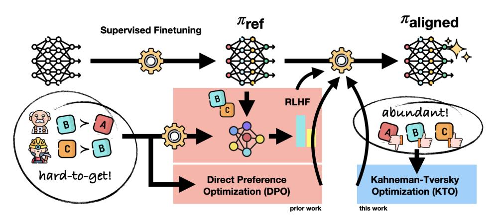
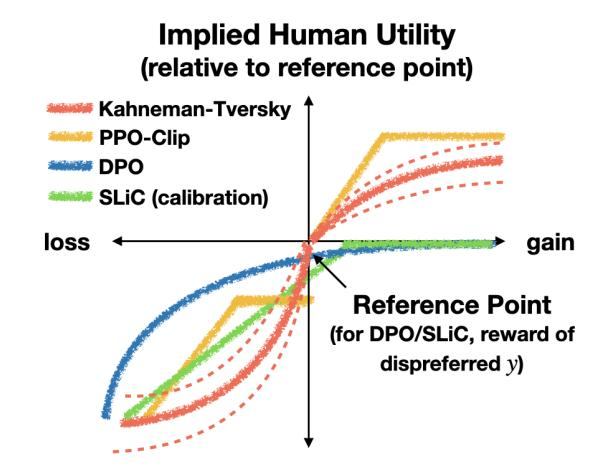
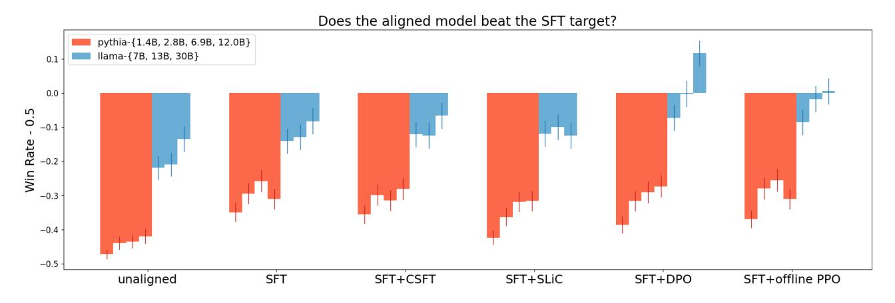
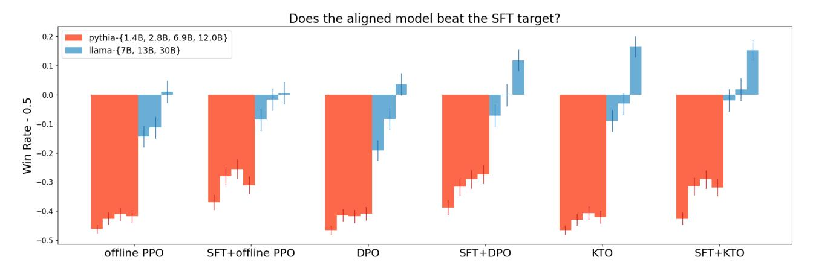
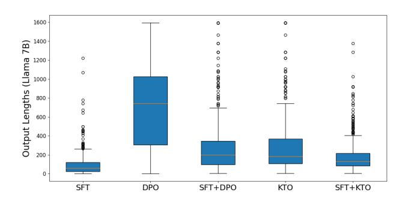
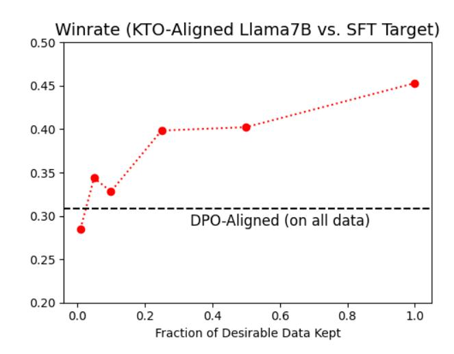
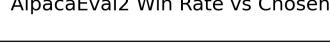
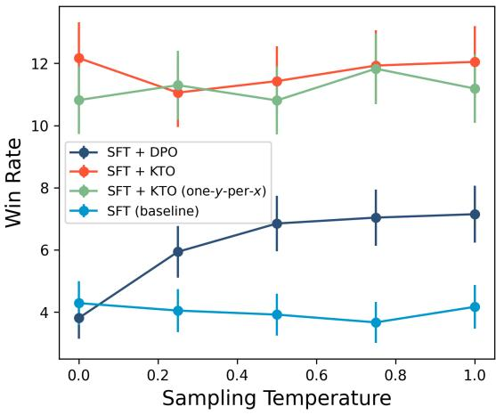

# KTO: Model Alignment as Prospect Theoretic Optimization

Kawin Ethayarajh 1 Winnie Xu 2 Niklas Muennighoff 2 Dan Jurafsky 1 Douwe Kiela 1 2

## Abstract

Kahneman & Tversky's *prospect theory* tells us that humans perceive random variables in a biased but well-defined manner [\(1992\)](#page-10-0); for example, humans are famously loss-averse. We show that objectives for aligning LLMs with human feedback implicitly incorporate many of these biases the success of these objectives (e.g., DPO) over cross-entropy minimization can partly be ascribed to them being *human-aware loss functions* (HA-LOs). However, the utility functions these methods attribute to humans still differ from those in the prospect theory literature. Using a Kahneman-Tversky model of human utility, we propose a HALO that directly maximizes the utility of generations instead of maximizing the log-likelihood of preferences, as current methods do. We call this approach Kahneman-Tversky Optimization (KTO), and it matches or exceeds the performance of preference-based methods at scales from 1B to 30B. Crucially, KTO does not need preferences only a binary signal of whether an output is desirable or undesirable for a given input. This makes it far easier to use in the real world, where preference data is scarce and expensive.

### 1. Introduction

Aligning generative models with human feedback has been successfully used to make generations more helpful, factual, and ethical, among other desiderata [\(Ouyang et al.,](#page-10-1) [2022;](#page-10-1) [Tian et al.,](#page-10-2) [2023\)](#page-10-2). For LLMs, alignment methods such as RLHF and DPO have consistently proven to be more beneficial than doing supervised finetuning (SFT) alone. However, human feedback is often discussed only in the context of preferences (e.g., output A ≻ B for input x), despite preferences being a kind of data that is relatively scarce and expensive to collect in the real world [\(Casper](#page-9-0) [et al.,](#page-9-0) [2023\)](#page-9-0). This is largely because the alignment methods shown to work best—RLHF [\(Christiano et al.,](#page-9-1) [2017\)](#page-9-1) and

the mathematically equivalent DPO [\(Rafailov et al.,](#page-10-3) [2023\)](#page-10-3) take preference data as input.

To understand why these alignment methods work so well, and whether feedback needs to be in the form of preferences, we frame them through the lens of *prospect theory* [\(Kahneman & Tversky,](#page-10-4) [1979;](#page-10-4) [Tversky & Kahneman,](#page-10-0) [1992\)](#page-10-0). Prospect theory explains why humans make decisions about uncertain events that do not maximize expected value. It formalizes how humans perceive random variables in a biased but well-defined manner; for example, relative to some reference point, humans are more sensitive to losses than gains, a property called *loss aversion*. We show that popular alignment methods such as PPO [\(Schulman et al.,](#page-10-5) [2017\)](#page-10-5), DPO [\(Rafailov et al.,](#page-10-3) [2023\)](#page-10-3), and SLiC [\(Zhao et al.,](#page-11-0) [2023\)](#page-11-0) implicitly model such biases, helping explain their success independently of the data used. For this reason, we call them *human-aware loss functions* (HALOs).

Although it is impossible to say that HALOs are categorically better than non-HALOs, we find that among existing methods, those that meet the definition of a HALO work better than those that do not. We find that DPO performance can even be matched at most scales by running an offline PPO variant on dummy +1/-1 rewards, suggesting that preference data might not be needed if the inductive bias in the loss function is good enough. However, despite the surprising success of this simple baseline, it significantly lags behind DPO at the 30B model scale and suffers from hyperparameter sensitivity, making it difficult to use.

Taking a more principled approach, we derive a HALO using the model of human utility that Kahneman & Tversky empirically derived to describe how humans make decisions about uncertain monetary outcomes [\(Tversky & Kahneman,](#page-10-0) [1992\)](#page-10-0). This approach, which we call Kahneman-Tversky Optimization (KTO), directly maximizes the utility of generations instead of maximizing the log-likelihood of preferences, as most current methods do. KTO only requires a binary signal of whether an output is desirable or undesirable for a given input. This data is much more abundant, cheaper, and faster to collect in the real world than preferences, making it easier to scale alignment in production environments and rapidly iterate on models.

In our experiments, we find that:

1 Stanford University 2Contextual AI. Correspondence to: Kawin Ethayarajh <kawin@stanford.edu>.

Figure 1. The traditional pipeline for LLM alignment starts with supervised finetuning, followed by fitting the LLM to paired preference data using a method such as RLHF or DPO. However, the paired preferences that existing approaches need are hard-to-get. Kahneman-Tversky Optimization (KTO) only needs to know whether a given output is (un)desirable for the input, giving it access to a source of data that is much more abundant, cheaper, and faster to collect in the real world.

- KTO matches or exceeds DPO performance at scales from 1B to 30B parameters.[1](#page-1-0) That is, taking a preference dataset of n DPO pairs and breaking it up into 2n examples for KTO can yield better generations, despite the model ostensibly learning from a weaker signal. We provide some theoretical explanations for this phenomenon ([§4.3\)](#page-7-0).
- KTO can handle extreme data imbalances, matching DPO performance while using up to 90% fewer desirable examples (i.e., examples of good generations). Its success thus cannot be ascribed to the alignment data being sourced from a preference dataset.
- When the pretrained model is sufficiently good, one can skip supervised finetuning and go straight to KTO without a loss in generation quality. In contrast, we find that without doing SFT first, DPO-aligned models are significantly worse at all scales.

The fact that KTO can match and sometimes even outperform DPO is surprising, given that it learns from a weaker signal. We conclude by discussing some theoretical explanations for this phenomenon.

### 2. Background

Feedback-aligned LLMs are traditionally trained in three stages [\(Ouyang et al.,](#page-10-1) [2022\)](#page-10-1):

Pretraining Given a large corpus, train the model to predict the next token conditioned on the preceding text using the cross-entropy loss. Let π denote the pretrained model.

Supervised Finetuning Finetune the model to predict the next token on data that is more relevant to the downstream task. Often, such data will comprise instructions and an appropriate response (i.e., instruction finetuning). Let πref denote the finetuned model.

RLHF Given a dataset D of preferences (x, yw, yl) where x is an input, yw, yl are the preferred and dispreferred outputs (i.e., yw ≻ yl for x), and r ∗ is the "true" reward function underlying the preferences—it is first assumed that the probability that yw is preferred to yl can be captured with a specific function class, typically a Bradley-Terry model [\(Bradley & Terry,](#page-9-2) [1952\)](#page-9-2). Where σ is the logistic function:

$$p^*(y_w \succ y_l|x) = \sigma(r^*(x, y_w) - r^*(x, y_l))$$
 (1)

Since getting the true reward from a human would be intractably expensive, a reward model rϕ learns to serve as a proxy, done by minimizing the negative log-likelihood of the human preference data:

$$\mathcal{L}_{R}(r_{\phi}) = \mathbb{E}_{x, y_{w}, y_{l} \sim D}[-\log \sigma(r_{\phi}(x, y_{w}) - r_{\phi}(x, y_{l}))]$$

But solely maximizing the reward might come at the expense of desiderata such as generating grammatical text. To avoid this, a KL divergence penalty is introduced to restrict how far the language model can drift from πref. Where πθ is the model we are optimizing, the optimal model π ∗ is that which maximizes

$$\mathbb{E}_{x \in D, y \in \pi_{\theta}}[r_{\phi}(x, y)] - \beta D_{\text{KL}}(\pi_{\theta}(y|x) || \pi_{\text{ref}}(y|x))$$
 (2)

where β > 0 is a hyperparameter. Since this objective is not differentiable, we need to use an RL algorithm like PPO [\(Schulman et al.,](#page-10-5) [2017\)](#page-10-5).

1Our code is available on [Github](https://github.com/ContextualAI/HALOs) and models on [Huggingface.](https://huggingface.co/ContextualAI)

However, RLHF is often slow (largely because of having to sample generations) and quite unstable in practice (especially in a distributed setting). For this reason, recent work has focused on designing closed-form losses that maximize the margin between the preferred and dispreferred generations, such as Sequence-Likelihood Calibration (SLiC) (Zhao et al., 2023) and Direct Preference Optimization (DPO) (Rafailov et al., 2023). The latter has become popular due to its mathematical equivalence with RLHF:

$$\mathcal{L}_{DPO}(\pi_{\theta}, \pi_{ref}) = \mathbb{E}\left[-\log \sigma \left(\beta \log \frac{\pi_{\theta}(y_w|x)}{\pi_{ref}(y_w|x)} - \beta \log \frac{\pi_{\theta}(y_l|x)}{\pi_{ref}(y_l|x)}\right)\right]$$
(3)

### 3. A Prospect Theoretic View of Alignment

Kahneman & Tversky's *prospect theory* explains why, faced with an uncertain event, humans make decisions that do not maximize the expected value (1992). For example, because humans are loss-averse, given a gamble that returns \$100 with 80% probability and \$0 with 20% probability, a person might accept \$60 to avoid the gamble, despite their *certainty equivalent* of \$60 being less than the expected value of \$80.

#### 3.1. Prospect Theory

In prospect theory, human utility depends on a *value function* and a *weighting function*:2

**Definition 3.1.** A value function  $v: z \to \mathbb{R}$  maps an outcome z, relative to some reference point  $z_{\text{ref}}$ , to its perceived (or subjective) value. For example, these functions capture the fact that humans tend to be more sensitive to relative losses than relative gains of the same magnitude.

**Definition 3.2.** A weighting function w is the derivative of a capacity function that maps cumulative probabilities to perceived cumulative probabilities. These functions capture, for example, the fact that humans tend to overestimate the chance of rare events. Let  $w_z$  denote the weight placed on outcome z.

**Definition 3.3.** The *utility of a random variable* Z is a function of its outcomes:  $u(Z) \triangleq \sum_{z \in Z} w_z v(z - z_{\text{ref}})$ .

However, because humans do not see the full probability distribution of an LLM, weighting functions are not salient to this discussion; we will focus only on value functions. Using experiments that presented real humans with monetary gambles and asked for their certainty equivalent, Tversky & Kahneman (1992) proposed the following functional form for human value:

$$v(z, z_{\text{ref}}; \lambda; \alpha) = \begin{cases} (z - z_{\text{ref}})^{\alpha} & \text{if } z > z_{\text{ref}} \\ -\lambda (z_{\text{ref}} - z)^{\alpha} & \text{if } z < z_{\text{ref}} \end{cases}$$
(4)

Figure 2. The utility that a human gets from the outcome of a random variable, as imputed by the value function implicit in HALOs. Notice that the imputed functions share properties such as loss aversion with the human value functions that Kahneman & Tversky empirically derived (1992).

where the median value of hyperparameter  $\alpha=0.88$  and  $\lambda=2.25$  across individuals.  $\alpha$  controls how quickly utility changes and  $\lambda$  controls the degree of loss aversion. While the shape of the median Kahneman-Tversky value function is illustrated in Figure 2, it should be noted that it varies across individuals (Tversky & Kahneman, 1992). There are also other functional forms for the value function that have been proposed in later work (Gurevich et al., 2009). The salient qualities of a value function are: the existence of a reference point that is added or subtracted to get the relative gain or loss respectively; concavity in relative gains (i.e. diminishing sensitivity away from  $z_{\rm ref}$ ); loss aversion (i.e., greater sensitivity to losses).

#### **3.2. HALOs**

Informally, HALOs are loss functions that model the human biases in Tversky & Kahneman (1992). Formally,

**Definition 3.4 (HALOs).** Let  $x \in \mathcal{X}$  denote an input and  $y \in \mathcal{Y}$  an output. Then  $f: (x,y) \to \mathbb{R}$  is a *human-aware* loss function if there exists the following: a parameterized reward function  $r_{\theta}$  such that  $\forall (x_1, y_1), (x_2, y_2) \in \mathcal{X} \times \mathcal{Y}$ ,

$$r_{\theta}(x_1, y_1) > r_{\theta}(x_2, y_2) \iff (x_1, y_1) \succ_{r_{\theta}} (x_2, y_2)$$

reference point distributions  $Q_x(X'), Q_y(Y'|X')$ , a value function  $v_f: \mathbb{R} \to \mathbb{R}$  that is monotonic non-decreasing and concave in  $(0, \infty)$ , and a negative affine function t such that

$$f(x,y;\theta) = t(v_f(r_\theta(x,y) - \mathbb{E}_{x',y'}[r_\theta(x',y')]))$$
 (5)  
where  $x' \sim Q_x(X')$  and  $y' \sim Q_y(Y'|x')$ .

Put simply, the requirement for the reward function is that it assigns higher rewards to input-output pairs that are more

&lt;sup>2Cumulative prospect theory is the full name of the expanded theory we dicuss here (Tversky & Kahneman, 1992).

preferred under it. The reference point is the expected reward with respect to input-output pairs sampled from the distributions  $Q_x, Q_y$ . We require that the value function be concave in gains but not necessarily convex in losses—unlike the canonical Kahneman-Tversky value functions—because in the original work on prospect theory, a minority of individuals were found to be risk-averse in both the gain and loss regime (i.e., concave in both gains and losses) (Kahneman & Tversky, 1979). Note that risk-aversion is different from loss-aversion; they relate to the curvature and magnitude of the slope respectively.

**Proposition 3.5.** *DPO, SLiC (calibration loss only), and PPO-Clip are human-aware loss functions.* 

The proof is deferred to Appendix A. In Figure 2, we can see this more intuitively by plotting the value function for each loss (i.e., the implied human utility). We see that the value functions of all three losses incorporate a sense of loss aversion, although this is not needed to meet the definition of a HALO, since there are individuals and scenarios for which loss aversion does not necessarily apply. The value functions are also either concave or affine (depending on the interval), unlike the standard Kahneman-Tversky value function, which is concave in gains but convex in losses. The reference point distributions used also differs across the losses.

#### 3.3. Does being a HALO matter?

A natural question is whether the modeling of human biases in HALOs has practical benefits. This is difficult to answer, since both HALOs and non-HALOs are diverse function classes, but we attempt to do so by comparing popular non-HALO and HALO baselines on the exact same data:

- 1. **CSFT**: Conditional SFT is a simple alignment method where a control token is prepended to the output during training; then, at inference, the control token corresponding to desirable generations (e.g., < | good | >) is appended to the input to induce good generations (Korbak et al., 2023). This is a non-HALO loss.
- 2. **SLiC**: SLiC with a regularization penalty  $(\lambda_{\text{reg}} \neq 0)$  is a non-HALO loss:

$$\mathcal{L}_{\text{SLiC}}(\pi_{\theta}, \pi_{\text{ref}}) = \mathcal{L}_{\text{cal}}(\pi_{\theta}) + \lambda_{\text{reg}} L_{\text{reg}}(\pi_{\theta})$$

$$\mathcal{L}_{\text{cal}} = \mathbb{E}_{x, y_{w}, y_{l} \sim D} \left[ \max \left( 0, \delta - \log \frac{\pi_{\theta}(y_{w}|x)}{\pi_{\theta}(y_{l}|x)} \right) \right]$$

$$\mathcal{L}_{\text{reg}} = \mathbb{E}_{x \sim D, y \sim \pi_{\text{ref}}(x)} [-\log \pi_{\theta}(y|x)]$$

Although the max-margin loss  $\mathcal{L}_{cal}$  is a HALO on its own (Proposition 3.5), the complete loss is not, since the  $\mathcal{L}_{reg}$  term is the standard language modeling loss.

3. **DPO**: DPO, as defined in (3), is a HALO loss (Proposition 3.5).

4. **PPO** (offline): The standard RLHF objective in (2) is typically optimized with PPO-Clip, which works by "clipping" how far  $\pi_{\theta}$  can drift from the version  $\pi_{\text{old}}$  at the previous step:

$$\mathcal{L}_{\text{PPO (offline)}} = -\mathbb{E}_{x,y,t \sim D}[\min(q_{\theta}A(x,y_{< t},y_{t}), \\ \text{clip}(q_{\theta}, 1 - \epsilon, 1 + \epsilon)A(x,y_{< t},y_{t}))]$$

where  $q_{\theta} = \log \frac{\pi_{\theta}}{\pi_{\text{old}}}$  and  $A(x, y_{< t}, y_t)$  is the per-token advantage (i.e., the surplus benefit from producing a given token in a given state).

PPO is an online algorithm—generations are sampled from the current model, judged by a reward model, and then used to update the current version. However, this process is slow (due to having to sample generations), so we choose to use offline data instead. Because RLHF is also quite unstable in a distributed setting, we never update  $\pi_{\rm old}$  and keep it as  $\pi_{\rm ref}$ , instead clipping less conservatively than we traditionally would (see Appendix B for details). Baheti et al. (2023) found that these changes, along with treating the entire output sequence as a single action, greatly improves stability. However, since RLHF has historically calculated tokenlevel advantages, we omit the third change and only preserve the first two. The PPO-Clip loss itself is left unchanged and is therefore a HALO (Proposition 3.5).

Calling this method PPO is somewhat imprecise, because it is offline and takes only one step, but to avoid introducing too many new terms, we will call this PPO (offline). Instead of using learned rewards, we simplify even further and use dummy +1/-1 rewards for  $y_w$  and  $y_l$  instead. Further details on the implementation of this method can be found in Appendix B.

We compare these baselines on a suite of 7 models spanning two model families, Pythia-{1.4B, 2.8B, 6.9B, 12B} (Biderman et al., 2023) and Llama-{7B, 13B, 30B} (Touvron et al., 2023). This permits us to see how LLM alignment scales within a model family (Llama-2 lacks a 30B model, hence our use of Llama). Later experiments (§4.2) are done on Mistral-7B and its derivatives (Jiang et al., 2023). The models were trained on a combination of Anthropic HH (Ganguli et al., 2022), OpenAssistant (Köpf et al., 2023), and SHP (Ethayarajh et al., 2022).

All models were aligned under identical settings on the same data (e.g., same effective batch size, same optimizer, etc.), save for hyperparameters unique to them. Similar to Rafailov et al. (2023), the target sequences for SFT are a subset of the generations used to subsequently align the model; however, for a more realistic SFT setup, we do not necessarily set the most preferred generation to be the target (with the exception of HH, since the dispreferred output in that dataset is often harmful). Then we used GPT-4-0613

Figure 3. Among existing alignment methods, the HALOs (DPO and our offline PPO variant) generally outperform non-HALOs (SLiC and CSFT), though the gap is only significant (p < 0.05) at 13B+ model sizes. In fact, only the HALO-aligned Llama-{13B, 30B} models are able to match or exceed the generation quality of SFT target sequences, which are drawn directly from the alignment dataset. It is also worth noting that up to a scale of 7B parameters, virtually all of the gains from LLM alignment come from the SFT stage.

to judge whether the aligned model's response was better than the SFT target for the given input with respect to helpfulness, harmlessness, and conciseness, a now standard practice [\(Zheng et al.,](#page-11-1) [2023;](#page-11-1) [Li et al.,](#page-10-10) [2023\)](#page-10-10).[3](#page-4-0) Note that while the SFT target is considered a desirable output for x, it is by no means the *best* output, meaning that it can be improved upon by an aligned model.

In Figure [3,](#page-4-1) we see the results of this analysis:

- The HALOs we tested (DPO and our PPO variant) either match or outperform the non-HALOs at all scales, though the gap is only significant (p < 0.05) at 13B+ model sizes. In fact, only the HALO-aligned Llama- {13B, 30B} models match or exceed a win rate of 50% (i.e., are able to match or exceed the generation quality of the SFT targets in the test data).
- Up to a scale of 7B parameters, alignment provides virtually no gains over SFT alone. However, it is worth noting that if the SFT data distribution were less similar to the preference data, then the gains from the alignment stage would ostensibly be greater.
- Surprisingly, despite only using dummy +1/-1 rewards, our offline PPO variant performs as well as DPO for all models except Llama30B. This challenges conventional wisdom, which places heavy emphasis on reward learning [\(Casper et al.,](#page-9-0) [2023\)](#page-9-0), suggesting that even the simplest rewards can prove useful when used in a loss function that has a strong inductive bias. Despite its surprising success, our offline PPO baseline still suffers from hyperparameter sensitivity and training instability,

albeit not to the same extent as traditional RLHF.

## 4. Kahneman-Tversky Optimization

The surprising success of offline PPO with dummy +1/-1 rewards suggests that—with the right HALO—a binary signal of good/bad generations may be sufficient to reach DPOlevel performance, even if the offline PPO approach itself was unable to do so past a certain scale ([§3.3\)](#page-3-1). Taking a more principled approach, we now derive a HALO using the Kahneman-Tversky model of human utility, which allows us to directly optimize for utility instead of maximizing the log-likelihood of preferences. This Kahneman-Tversky Optimization (KTO) loss only needs a binary signal of whether an output is (un)desirable for a given input, giving it access to a source of data is more abundant, cheaper, and faster to collect in the real world.

### 4.1. Derivation

From prior work [\(Go et al.,](#page-9-8) [2023;](#page-9-8) [Peng et al.,](#page-10-11) [2019;](#page-10-11) [Peters](#page-10-12) [& Schaal,](#page-10-12) [2007\)](#page-10-12), we know that the policy that maximizes the KL-constrained RLHF objective in [\(2\)](#page-1-1) is

$$\pi^*(y|x) = \frac{1}{Z(x)} \pi_{\text{ref}}(y|x) \exp\left(\frac{1}{\beta} r^*(x,y)\right)$$

where Z(x) is a partition function. [Rafailov et al.](#page-10-3) [\(2023\)](#page-10-3) rewrite this in terms of the optimal reward for an inputoutput pair:

$$r^*(x,y) = \beta \log \frac{\pi^*(y|x)}{\pi_{\text{ref}}(y|x)} + \beta \log Z(x)$$
 (6)

They then plug this expression into the Bradley-Terry model of preferences and take the negative logarithm of that objective to get the DPO loss [\(3\)](#page-2-2).

3We validate that GPT-4 judgments concur with human judgments in Appendix [C.](#page-15-0)

Figure 4. Kahneman-Tversky Optimization (KTO) is as good or better than DPO at all scales, both when preceded and not preceded by supervised finetuning (SFT). In fact, for the Llama models, KTO alone matches the performance of SFT+DPO and is significantly better than DPO alone. Error bars denote a 90% binomial confidence interval.

Instead, we plug this expression into the Kahneman-Tversky model of human utility, with some changes to make it more amenable to the LLM setting:

- 1. The exponent in the Kahneman-Tversky value function (4) makes it difficult to optimize, so we set  $v_{\rm KTO}$  to be the logistic function  $\sigma$ , which is also concave in gains and convex in losses. We replace the lossaversion coefficient with two hyperparameters  $\lambda_D, \lambda_U$  that weight the losses for desirable and undesirable outputs respectively.
- 2. The Kahneman-Tversky value function was derived based on experiments with humans and monetary gambles. Since LLM generations do not have a monetary reward associated with them, we set  $r_{\rm KTO}$  to be the implicit reward under the RLHF objective (6).
- 3. Rather than having just one dispreferred generation  $y_l|x$  as the reference point, we assume that humans judge the quality of (x,y) in relation to all input-output pairs they have seen. Thus we write the reference point to be the expected reward under the optimal policy, not just for generations following x but following any input x':  $\mathbb{E}_{x'\sim D,y'\sim\pi^*}[r^*(x',y')]$ . Under the assumption that the expected value of the partition function across x' is zero, this simplifies to the KL divergence between  $\pi^*$  and  $\pi_{\rm ref}$  scaled by  $\beta$ .

Combining all of these changes, we can optimize the following loss, where the notion of an output being "desirable" or "undesirable" corresponds to the Kahneman-Tversky notion of a relative gain or loss.

$$L_{\text{KTO}}(\pi_{\theta}, \pi_{\text{ref}}) = \mathbb{E}_{x,y \sim D}[w(y)(1 - v_{\text{KTO}}(x, y; \beta))] \quad (7)$$

where

$$\begin{split} r_{\text{KTO}}(x,y) &= \beta \log \frac{\pi_{\theta}(y|x)}{\pi_{\text{ref}}(y|x)} \\ z_{\text{ref}} &= \mathbb{E}_{x' \sim D} \left[ \beta \ \text{KL}(\pi_{\theta}(y'|x') \| \pi_{\text{ref}}(y'|x')) \right] \\ v_{\text{KTO}}(x,y;\beta) &= \begin{cases} \sigma(r_{\text{KTO}}(x,y) - z_{\text{ref}}) \text{ if } y \sim y_{\text{desirable}} | x \\ \sigma(z_{\text{ref}} - r_{\text{KTO}}(x,y)) \text{ if } y \sim y_{\text{undesirable}} | x \end{cases} \\ w(y) &= \begin{cases} \lambda_D & \text{if } y \sim y_{\text{desirable}} | x \\ \lambda_U & \text{if } y \sim y_{\text{undesirable}} | x \end{cases} \end{split}$$

Intuitively, KTO works because if the model increases the reward of a desirable example in a generic way, then the KL penalty will also rise and no progress will be made on the loss. This forces the model to learn exactly what makes an output desirable, so that the reward can be increased while keeping the KL term flat (or even decreasing it). A similar argument works in the other direction as well, though the non-negativity of the KL term allows faster saturation.

**Implementation** In practice, we estimate the KL term by matching inputs x' with unrelated outputs  $y'_U$  in a batch of size m and then calculating  $\max\left(0,\frac{1}{m}\sum\log\frac{\pi_\theta(y'_U|x')}{\pi_{\text{ref}}(y'_U|x')}\right)$  over the entire batch. We do not back-propagate through the KL term, as it makes training much more stable. This means that the KL term purely serves to control how saturated the loss is.

 $\beta$  has the same meaning as in DPO; the lower it is, the less we penalize  $\pi_{\theta}$  from moving away from the SFT model  $\pi_{\rm ref}$ . We find that  $\beta=0.1$  is close-to-best on most datasets. Where  $n_D$  and  $n_U$  refer to the number of desirable and undesirable examples respectively, we set  $\lambda_D, \lambda_U$  such that

$$\frac{\lambda_D n_D}{\lambda_U n_U} \in \left[1, \frac{4}{3}\right] \tag{8}$$

Figure 5. Without doing SFT first, DPO-aligned models tend to ramble and hallucinate entire conversations. KTO does not suffer from this issue.

where at least one of the two should be set to 1 and the ratio is controlled by changing the other. For example, if there is a 1:1 ratio of desirable:undesirable examples, we would set λU = 1, λD ∈ [1, 1.33]. If we then discard 90% of the desirable examples and only keep 10%, then we would set λU = 1, λD ∈ [10, 13.33]. The interval [1, 4/3] was determined empirically and suggests a value function that is more gain-sensitive than loss-sensitive, in contrast to the original Kahneman-Tversky value function [\(4\)](#page-2-3). However, the ideal interval is also task-dependent; for example, if avoiding negative outcomes were very important, then we might consider a setting of λU > 1 instead.

Data If the alignment data is naturally binary, every positive example can be assumed to be drawn from ydesirable|x and every negative example from yundesirable|x. However, the canonical feedback datasets in academic research (HH, SHP, OASST) are in preference format, since the methods that have worked best up until now are preference-based. In our experiments, we converted preference data yw ≻ yl by assuming that yw is drawn from the desirable distribution and yl from the undesirable one. To enable an apples-to-apples comparison with DPO, we apply KTO on the same data for most experiments. However, to ensure that KTO can be used with non-preference data, we also subsample one output y per x for some experiments (denoted one-y-per-x).

If the data is score-based, where a higher score denotes greater desirability, one has multiple options:

- Assume that any output with a score above some fixed threshold τ is desirable.
- Assume that any output with a score above the mean or median (either across all inputs or just the input it was conditioned on) is desirable.
- Let desirability be a Bernoulli random variable where p(y ∼ ydesirable|x) is some function of its score (e.g., logistic). Then randomly sample to determine whether y is desirable or not.

Figure 6. Even after discarding 90% of the desirable examples while keeping all of the undesirable data (leading to a 1:10 ratio of desirable:undesirable data), a KTO-aligned Llama-7B model still outperforms its DPO counterpart. This implies that preference pairs do not have to be the source of KTO data.

#### 4.2. Experiments

KTO ≥ DPO As seen in Figure [4,](#page-5-0) SFT+KTO is competitive with SFT+DPO at model scales from 1B to 30B, despite learning from a weaker signal. KTO alone is better than DPO alone for the Llama-{7B, 13B, 30B} models, and this gap is significant (p < 0.01) at 7B and 30B even after correcting for multiple comparisons [\(Holm,](#page-9-9) [1979\)](#page-9-9). Perhaps most surprising is the fact that a KTO-aligned Llama-{13B, 30B} model is competitive with its SFT+KTO counterpart, despite not undergoing supervised finetuning first, and is the only alignment method of the ones we tested to show this behavior. This is perhaps due to the fact that KTO keeps the average response length roughly the same as it is for the SFT model. In contrast, doing DPO without SFT first causes the average response length to increase dramatically.

## KTO data need not come from preference datasets.

Might KTO be secretly benefiting from the fact that its 2n examples in the previous experiment came from n preference pairs instead of a naturally unpaired data distribution? To test this, we randomly discard increasingly large fractions of the desirable data before KTO-aligning a Llama-7B model. For example, if we discard 90% of the desirable data while leaving the undesirable data untouched, then the ratio of desirable:undesirable examples goes from 1:1 to 1:10 and the vast majority of examples no longer have a preferred output counterpart. We handle such imbalances by changing the loss weights λD, λU to satisfy the criteria in [\(8\)](#page-5-1); when we drop 90% of the desirable data, we set λu = 1, λD = 13.33. The full results are given in Figure [6.](#page-6-1) For Llama-7b, we find that up to 90% of the desirable

Table 1. In aligning Mistral-7B on the OpenAssistant dataset, we find that using KTO with only one output per input still outperforms DPO, despite this restriction reducing the amount of training data by 72%. A 90% confidence interval is given.

| Method                         | Winrate vs. SFT Target |
|--------------------------------|------------------------|
| Mistral-7B (unaligned)         | 0.525 ± 0.037          |
| Mistral-7B + DPO               | 0.600 ± 0.037          |
| Mistral-7B + KTO (all y per x) | 0.652 ± 0.036          |
| Mistral-7B + KTO (one y per x) | 0.631 ± 0.036          |
| Mistral-7B-Instruct            | 0.621 ± 0.031          |

data can in fact be discarded while still outperforming DPO. A similar trend holds when discarding undesirable data. For different models and datasets, the optimal settings of λD, λU differ.

We further verify this claim by aligning Mistral-7B on OpenAssistant using DPO (on n pairs), standard KTO (on all 2n outputs), and KTO where only one y per x is used. Since the output of one y in OpenAssistant is not conditioned on the other outputs for the same input, the latter effectively captures the setting where the data is from an inherently unpaired distribution. Despite the one-y-per-x setup decreasing the amount of training data by 72%, the KTO-aligned model still outperforms both its DPO counterpart and the official instruction-tuned version of Mistral-7B [\(Jiang et al.,](#page-10-8) [2023\)](#page-10-8), as seen in Table [1.](#page-7-1)

On average, KTO improves performance across generative benchmarks. Zephyr-β is a variant of Mistral-7B that has been instruction-tuned and DPO-aligned on the UltraFeedback dataset [\(Tunstall et al.,](#page-10-13) [2023;](#page-10-13) [Cui et al.,](#page-9-10) [2023\)](#page-9-10). We find that substituting KTO for DPO (and changing nothing else) improves performance across MMLU (0-shot) [\(Hendrycks et al.,](#page-9-11) [2021\)](#page-9-11), GSM8K (8-shot, CoT) [\(Cobbe](#page-9-12) [et al.,](#page-9-12) [2021\)](#page-9-12), HumanEval (0-shot) [\(Chen et al.,](#page-9-13) [2021\)](#page-9-13), and BigBench-Hard (3-shot CoT) [\(Srivastava et al.,](#page-10-14) [2022\)](#page-10-14). On GSM8K, just swapping DPO for KTO improves performance by 13.5 points. Even when we align with KTO using only one y per x (i.e., reducing the data volume by half), we still outperform DPO on all but one benchmark.

### 4.3. Theoretical Analysis

KTO was designed with the motivation that even if it had to learn from a weaker signal, it would make up for this limitation with the fact that it has access to much more data in the real world, where thumbs-up/thumbs-down data is common but preferences are scarce and expensive to collect. So why does KTO perform as good or better than DPO in our experiments, when it sees the same amount of data? Data efficiency may not be the only answer. Our theoretical analysis suggests that preference likelihood can

Table 2. Aligning Zephyr [\(Tunstall et al.,](#page-10-13) [2023\)](#page-10-13), a derivative of Mistral-7B, on UltraFeedback with KTO instead of DPO improves results across a suite of benchmarks. This is true even when only one of the two outputs in each preference is seen by KTO, despite this reducing the volume of data by half (one-y-per-x).

| Dataset (→)        | MMLU | GSM8k | HumanEval | BBH  |
|--------------------|------|-------|-----------|------|
| Metric (→)         | EM   | EM    | pass@1    | EM   |
| Zephyr-β SFT       | 57.2 | 39.0  | 30.1      | 46.3 |
| +DPO               | 58.2 | 40.0  | 30.1      | 44.1 |
| +KTO               | 58.6 | 53.5  | 30.9      | 52.6 |
| +KTO (one-y-per-x) | 58.0 | 50.0  | 30.7      | 49.9 |

be maximized without necessarily maximizing underlying human utility and that KTO implicitly ignores noisy and intransitive data.

Proposition 4.1. *KTO does not learn from undesirable examples with sufficiently high rewards or desirable examples with sufficiently low rewards.*

Informally, if an example is too difficult to learn from, then the KTO update will not change πθ. This may be a blessing in disguise, since human preferences are often noisy and not every given preference can be recovered with the true reward r ∗ [\(Hoeffler & Ariely,](#page-9-14) [1999\)](#page-9-14). This means that it may be useful to avoid unlearnable preferences. However, this is a double-edged sword: it also means that KTO could end up ignoring some data that is hard-to-learn but necessary to recover r ∗ , resulting in under-fitting.

Theorem 4.2. *Assuming the value function is logistic, for any bounded reward function* ra*, there exists a reward function in its equivalence class (i.e.,* rb(x, y) = ra(x, y)+h(x) *for some* h(x)*) that induces the same optimal policy* π ∗ *and Bradley-Terry preference distribution but a different human value distribution.*

A key insight from [Rafailov et al.](#page-10-3) [\(2023\)](#page-10-3) is that reward functions in the same equivalence class (i.e., differing only in an input-specific component) induce the same optimal policy under [\(2\)](#page-1-1) and the same Bradley-Terry preference distribution. However, we show under mild assumptions that the value distribution—i.e., human utility—is affected by such input-specific changes, so maximizing preference likelihood does not mean one is maximizing human utility. Approaches that directly maximize utility, such as KTO, may thus perform better in open-ended evaluation.

Theorem 4.3. *Let two humans* a, b *have value functions* va, vb *and contradicting preferences* y1 ≻a y2 *and* y2 ≻b y1 *for some input* x*. Assume* π*ref*(y|x) = 0 =⇒ πθ(y|x) = 0 *for all* x, y*. In the worst-case, the optimal policy under DPO decreases the expected value of both humans. In contrast, if each preference is broken up into two examples, then KTO (with default settings) does not change the policy.*

Informally, we assume that humans want the model to in-

crease and decrease the probability of generations they like and dislike respectively. However, the preferences of two humans often contradict, leading to a dataset containing intransitive preferences. In the worst-case, DPO allows one of the two preferences to be recovered while decreasing the expected value of both humans. In contrast, KTO will change nothing at all in any case. Since existing datasets contain preferences from multiple annotators, the existence of intransitivity may help explain why KTO works better.

### 4.4. KTO vs. DPO – when to use which?

When human feedback is in a binary format, and especially when there is an imbalance between the number of desirable and undesirable examples, KTO is the natural choice. When your data is in the form of preferences, the choice is less clear. Putting aside the greater data efficiency of KTO, our theoretical analysis suggests that if your preference data has sufficiently little noise and sufficiently little intransitivity, then DPO will work better, since there is some risk of KTO underfitting. But if there is enough noise and transitivity, then the better worst-case guarantees of KTO will win out. Most publicly available preference datasets (e.g., SHP, OpenAssistant) contain noisy feedback from many different humans whose preferences likely contradict, which explains why KTO was able to match or exceed DPO performance in our experiments. Even AI feedback can be noisy and intransitive, which helps explain why KTO outperforms DPO when aligning with the synthetic UltraFeedback data.

# 5. Related Work

Human feedback has been used to improve LLM capabilities in translation [\(Kreutzer et al.,](#page-10-15) [2018\)](#page-10-15), summarization [\(Stien](#page-10-16)[non et al.,](#page-10-16) [2020\)](#page-10-16), sentiment-conditioned generation [\(Ziegler](#page-11-2) [et al.,](#page-11-2) [2019\)](#page-11-2), and instruction-following [\(Ouyang et al.,](#page-10-1) [2022\)](#page-10-1). The RLHF framework [\(Christiano et al.,](#page-9-1) [2017;](#page-9-1) [Bai et al.,](#page-9-15) [2022\)](#page-9-15) traditionally used to accomplish this is detailed in [§2.](#page-1-2)

Still, momentum has largely shifted in favor of closed-form losses that directly operate on offline preferences, such as DPO [\(Rafailov et al.,](#page-10-3) [2023\)](#page-10-3). This single stage of optimization distinguishes DPO from the conventional approach in preference-based RL, which learns a reward and then fits the policy to those rewards [\(Jain et al.,](#page-10-17) [2013;](#page-10-17) [Busa-Fekete et al.,](#page-9-16) [2014\)](#page-9-16). A recent string of work has centered on the idea of "self-training" or "self-play", during which new preference data is inferred from a model's generations [\(Chen et al.,](#page-9-17) [2024;](#page-9-17) [Yuan et al.,](#page-11-3) [2024\)](#page-11-3). Despite not being a human-aware loss, *unlikelihood training* was among to first to methods to align language models using a binary signal [\(Welleck et al.,](#page-10-18) [2019\)](#page-10-18). However, work by [Korbak et al.](#page-10-6) [\(2023\)](#page-10-6) found that it is worse than the CSFT baseline we tested in our work.

Prospect theory, despite being highly influential in behav-

ioral economics, has had a fairly muted impact in machine learning, with work concentrated in human-robot interaction [\(Kwon et al.,](#page-10-19) [2020;](#page-10-19) [Sun et al.,](#page-10-20) [2019;](#page-10-20) [Chan et al.,](#page-9-18) [2021\)](#page-9-18). Learning from sparse binary feedback is a staple of information retrieval and recommender systems [\(He et al.,](#page-9-19) [2017;](#page-9-19) [Koren et al.,](#page-10-21) [2009\)](#page-10-21), although to our knowledge it has not been used to generate open-ended text.

## 6. Future Work

The existence of HALOs raises many questions. For one, the KTO loss is based on the Kahneman-Tversky value function for monetary gains and losses, which is almost certainly different from how humans perceive the relative goodness of text. What value function—and corresponding HALO—best describes how humans perceive language?

Given that the data that KTO needs is much more abundant, cheaper, and faster to collect—both as human and AI feedback—how far can we push synthetic data? For example, if we wanted to create a toxicity dataset to align our models to be less toxic, creating a tuple (x, yw, yl) where yl is more toxic than yw is non-trivial. However, with KTO, we can easily create a dataset where desirability is determined by some black-box toxicity detection API. What other kinds of desiderata can we synthetically optimize for with KTO? Can we convert signals like "conversation lead to sale made" or "support ticket resolved" into KTO data?

Currently, KTO can learn from score-based data when the score is used to infer desirability. However, can we design a HALO where scores are directly incorporated into this loss?

## 7. Conclusion

We proposed a class of functions called *human-aware losses* (HALOs) based on the idea of a Kahneman-Tversky value function, which models some of the key cognitive biases that inform how humans make decisions about uncertain outcomes. We showed that among existing alignment methods, those that met the definition of a HALO performed better than those that did not, suggesting a benefit to the modeling of human biases. We then designed a human-aware loss called KTO for directly maximizing the utility of generations instead of maximizing preference likelihood. Despite only learning from a binary signal of whether an output is (un)desirable, KTO is as good or better than DPO at scales from 1B to 30B. Still, we make no claims that KTO is the best HALO for all scenarios; there remains much work to be done in discovering the optimal human-aware for each setting.

## Acknowledgements

We thank Dilip Arumugam and Arya McCarthy for feedback on the paper and Nathan Lambert for feedback on an early version of this draft. We thank Stas Bekman and Gautam Mittal for cluster assistance and Alex Manthey for helping with human evaluation.

# References

- Baheti, A., Lu, X., Brahman, F., Bras, R. L., Sap, M., and Riedl, M. Improving language models with advantage-based offline policy gradients. *arXiv preprint arXiv:2305.14718*, 2023.
- Bai, Y., Jones, A., Ndousse, K., Askell, A., Chen, A., Das-Sarma, N., Drain, D., Fort, S., Ganguli, D., Henighan, T., et al. Training a helpful and harmless assistant with reinforcement learning from human feedback. *arXiv preprint arXiv:2204.05862*, 2022.
- Biderman, S., Schoelkopf, H., Anthony, Q. G., Bradley, H., O'Brien, K., Hallahan, E., Khan, M. A., Purohit, S., Prashanth, U. S., Raff, E., et al. Pythia: A suite for analyzing large language models across training and scaling. In *International Conference on Machine Learning*, pp. 2397–2430. PMLR, 2023.
- Bradley, R. A. and Terry, M. E. Rank analysis of incomplete block designs: I. the method of paired comparisons. *Biometrika*, 39(3/4):324–345, 1952.
- Busa-Fekete, R., Szor¨ enyi, B., Weng, P., Cheng, W., and ´ Hullermeier, E. Preference-based reinforcement learning: ¨ evolutionary direct policy search using a preference-based racing algorithm. *Machine learning*, 97:327–351, 2014.
- Casper, S., Davies, X., Shi, C., Gilbert, T. K., Scheurer, J., Rando, J., Freedman, R., Korbak, T., Lindner, D., Freire, P., et al. Open problems and fundamental limitations of reinforcement learning from human feedback. *arXiv preprint arXiv:2307.15217*, 2023.
- Chan, L., Critch, A., and Dragan, A. Human irrationality: both bad and good for reward inference. *arXiv preprint arXiv:2111.06956*, 2021.
- Chen, M., Tworek, J., Jun, H., Yuan, Q., Pinto, H. P. d. O., Kaplan, J., Edwards, H., Burda, Y., Joseph, N., Brockman, G., et al. Evaluating large language models trained on code. *arXiv preprint arXiv:2107.03374*, 2021.
- Chen, Z., Deng, Y., Yuan, H., Ji, K., and Gu, Q. Self-play fine-tuning converts weak language models to strong language models. *arXiv preprint arXiv:2401.01335*, 2024.
- Christiano, P. F., Leike, J., Brown, T., Martic, M., Legg, S., and Amodei, D. Deep reinforcement learning from

- human preferences. *Advances in neural information processing systems*, 30, 2017.
- Cobbe, K., Kosaraju, V., Bavarian, M., Chen, M., Jun, H., Kaiser, L., Plappert, M., Tworek, J., Hilton, J., Nakano, R., Hesse, C., and Schulman, J. Training verifiers to solve math word problems. *arXiv preprint arXiv:2110.14168*, 2021.
- Cui, G., Yuan, L., Ding, N., Yao, G., Zhu, W., Ni, Y., Xie, G., Liu, Z., and Sun, M. Ultrafeedback: Boosting language models with high-quality feedback, 2023.
- Ethayarajh, K., Choi, Y., and Swayamdipta, S. Understanding dataset difficulty with V-usable information. In Chaudhuri, K., Jegelka, S., Song, L., Szepesvari, C., Niu, G., and Sabato, S. (eds.), *Proceedings of the 39th International Conference on Machine Learning*, volume 162 of *Proceedings of Machine Learning Research*, pp. 5988–6008. PMLR, 17–23 Jul 2022.
- Ganguli, D., Lovitt, L., Kernion, J., Askell, A., Bai, Y., Kadavath, S., Mann, B., Perez, E., Schiefer, N., Ndousse, K., et al. Red teaming language models to reduce harms: Methods, scaling behaviors, and lessons learned. *arXiv preprint arXiv:2209.07858*, 2022.
- Go, D., Korbak, T., Kruszewski, G., Rozen, J., Ryu, N., and Dymetman, M. Aligning language models with preferences through f-divergence minimization. *arXiv preprint arXiv:2302.08215*, 2023.
- Gurevich, G., Kliger, D., and Levy, O. Decision-making under uncertainty–a field study of cumulative prospect theory. *Journal of Banking & Finance*, 33(7):1221–1229, 2009.
- He, X., Liao, L., Zhang, H., Nie, L., Hu, X., and Chua, T.-S. Neural collaborative filtering. In *Proceedings of the 26th international conference on world wide web*, pp. 173–182, 2017.
- Hendrycks, D., Burns, C., Basart, S., Zou, A., Mazeika, M., Song, D., and Steinhardt, J. Measuring massive multitask language understanding. *Proceedings of the International Conference on Learning Representations (ICLR)*, 2021.
- Hoeffler, S. and Ariely, D. Constructing stable preferences: A look into dimensions of experience and their impact on preference stability. *Journal of consumer psychology*, 8 (2):113–139, 1999.
- Holm, S. A simple sequentially rejective multiple test procedure. *Scandinavian journal of statistics*, pp. 65–70, 1979.

- Jain, A., Wojcik, B., Joachims, T., and Saxena, A. Learning trajectory preferences for manipulators via iterative improvement. *Advances in neural information processing systems*, 26, 2013.
- Jiang, A. Q., Sablayrolles, A., Mensch, A., Bamford, C., Chaplot, D. S., Casas, D. d. l., Bressand, F., Lengyel, G., Lample, G., Saulnier, L., et al. Mistral 7b. *arXiv preprint arXiv:2310.06825*, 2023.
- Kahneman, D. and Tversky, A. Prospect theory: An analysis of decision under risk. *Econometrica*, 47(2):263–292, 1979.
- Kopf, A., Kilcher, Y., von R ¨ utte, D., Anagnostidis, S., ¨ Tam, Z.-R., Stevens, K., Barhoum, A., Duc, N. M., Stanley, O., Nagyfi, R., et al. Openassistant conversations– democratizing large language model alignment. *arXiv preprint arXiv:2304.07327*, 2023.
- Korbak, T., Shi, K., Chen, A., Bhalerao, R. V., Buckley, C., Phang, J., Bowman, S. R., and Perez, E. Pretraining language models with human preferences. In *International Conference on Machine Learning*, pp. 17506– 17533. PMLR, 2023.
- Koren, Y., Bell, R., and Volinsky, C. Matrix factorization techniques for recommender systems. *Computer*, 42(8): 30–37, 2009.
- Kreutzer, J., Uyheng, J., and Riezler, S. Reliability and learnability of human bandit feedback for sequence-tosequence reinforcement learning. In *Proceedings of the 56th Annual Meeting of the Association for Computational Linguistics (Volume 1: Long Papers)*, pp. 1777– 1788, 2018.
- Kwon, M., Biyik, E., Talati, A., Bhasin, K., Losey, D. P., and Sadigh, D. When humans aren't optimal: Robots that collaborate with risk-aware humans. In *Proceedings of the 2020 ACM/IEEE international conference on humanrobot interaction*, pp. 43–52, 2020.
- Li, X., Zhang, T., Dubois, Y., Taori, R., Gulrajani, I., Guestrin, C., Liang, P., and Hashimoto, T. B. Alpacaeval: An automatic evaluator of instruction-following models. [https://github.com/tatsu-lab/](https://github.com/tatsu-lab/alpaca_eval) [alpaca\\_eval](https://github.com/tatsu-lab/alpaca_eval), 2023.
- Ouyang, L., Wu, J., Jiang, X., Almeida, D., Wainwright, C., Mishkin, P., Zhang, C., Agarwal, S., Slama, K., Ray, A., et al. Training language models to follow instructions with human feedback. *Advances in Neural Information Processing Systems*, 35:27730–27744, 2022.
- Peng, X. B., Kumar, A., Zhang, G., and Levine, S. Advantage-weighted regression: Simple and scalable off-policy reinforcement learning. *arXiv preprint arXiv:1910.00177*, 2019.

- Peters, J. and Schaal, S. Reinforcement learning by rewardweighted regression for operational space control. In *Proceedings of the 24th international conference on Machine learning*, pp. 745–750, 2007.
- Rafailov, R., Sharma, A., Mitchell, E., Ermon, S., Manning, C. D., and Finn, C. Direct preference optimization: Your language model is secretly a reward model. *arXiv preprint arXiv:2305.18290*, 2023.
- Schulman, J., Wolski, F., Dhariwal, P., Radford, A., and Klimov, O. Proximal policy optimization algorithms. *arXiv preprint arXiv:1707.06347*, 2017.
- Srivastava, A., Rastogi, A., Rao, A., Shoeb, A. A. M., Abid, A., Fisch, A., Brown, A. R., Santoro, A., Gupta, A., Garriga-Alonso, A., et al. Beyond the imitation game: Quantifying and extrapolating the capabilities of language models. *arXiv preprint arXiv:2206.04615*, 2022.
- Stiennon, N., Ouyang, L., Wu, J., Ziegler, D., Lowe, R., Voss, C., Radford, A., Amodei, D., and Christiano, P. F. Learning to summarize with human feedback. *Advances in Neural Information Processing Systems*, 33: 3008–3021, 2020.
- Sun, L., Zhan, W., Hu, Y., and Tomizuka, M. Interpretable modelling of driving behaviors in interactive driving scenarios based on cumulative prospect theory. In *2019 IEEE Intelligent Transportation Systems Conference (ITSC)*, pp. 4329–4335. IEEE, 2019.
- Tian, K., Mitchell, E., Yao, H., Manning, C. D., and Finn, C. Fine-tuning language models for factuality. *arXiv preprint arXiv:2311.08401*, 2023.
- Touvron, H., Lavril, T., Izacard, G., Martinet, X., Lachaux, M.-A., Lacroix, T., Roziere, B., Goyal, N., Hambro, E., ` Azhar, F., et al. Llama: Open and efficient foundation language models. *arXiv preprint arXiv:2302.13971*, 2023.
- Tunstall, L., Beeching, E., Lambert, N., Rajani, N., Rasul, K., Belkada, Y., Huang, S., von Werra, L., Fourrier, C., Habib, N., Sarrazin, N., Sanseviero, O., Rush, A. M., and Wolf, T. Zephyr: Direct distillation of lm alignment, 2023.
- Tversky, A. and Kahneman, D. Advances in prospect theory: Cumulative representation of uncertainty. *Journal of Risk and uncertainty*, 5:297–323, 1992.
- von Werra, L., Belkada, Y., Tunstall, L., Beeching, E., Thrush, T., Lambert, N., and Huang, S. Trl: Transformer reinforcement learning. [https://github.](https://github.com/huggingface/trl) [com/huggingface/trl](https://github.com/huggingface/trl), 2020.
- Welleck, S., Kulikov, I., Roller, S., Dinan, E., Cho, K., and Weston, J. Neural text generation with unlikelihood

- training. In *International Conference on Learning Representations*, 2019.
- Yuan, W., Pang, R. Y., Cho, K., Sukhbaatar, S., Xu, J., and Weston, J. Self-rewarding language models. *arXiv preprint arXiv:2401.10020*, 2024.
- Zhao, Y., Joshi, R., Liu, T., Khalman, M., Saleh, M., and Liu, P. J. Slic-hf: Sequence likelihood calibration with human feedback. *arXiv preprint arXiv:2305.10425*, 2023.
- Zheng, L., Chiang, W.-L., Sheng, Y., Zhuang, S., Wu, Z., Zhuang, Y., Lin, Z., Li, Z., Li, D., Xing, E., et al. Judging llm-as-a-judge with mt-bench and chatbot arena. *arXiv preprint arXiv:2306.05685*, 2023.
- Ziegler, D. M., Stiennon, N., Wu, J., Brown, T. B., Radford, A., Amodei, D., Christiano, P., and Irving, G. Fine-tuning language models from human preferences. *arXiv preprint arXiv:1909.08593*, 2019.

#### A. Proofs

**Proposition 3.5 (restated)** DPO, SLiC (calibration loss only), and PPO-Clip are human-aware loss functions.

*Proof.* For a loss to be a HALO, it needs to be expressible as

$$f(x, y; \theta) = t(v_f(r_\theta(x, y) - \mathbb{E}_{x' \sim Q'_x, y' \sim Q'_y}[r_\theta(x', y')]))$$

with a parameterized reward function  $r_{\theta}$  such that  $\forall (x_1, y_1), (x_2, y_2) \in \mathcal{X} \times \mathcal{Y}, r_{\theta}(x_1, y_1) > r_{\theta}(x_2, y_2) \iff (x_1, y_1) \succ_{r_{\theta}} (x_2, y_2)$ , reference point distributions  $Q_x(X'), Q_y(Y'|X')$ , a value function  $v_f : \mathbb{R} \to \mathbb{R}$  that is monotonic non-decreasing and concave in  $(0, \infty)$ , and a negative affine function t.

The DPO loss is

$$\mathcal{L}_{\text{DPO}}(\pi_{\theta}, \pi_{\text{ref}}) = \mathbb{E}\left[-\log \sigma \left(\beta \log \frac{\pi_{\theta}(y_w|x)}{\pi_{\text{ref}}(y_w|x)} - \beta \log \frac{\pi_{\theta}(y_l|x)}{\pi_{\text{ref}}(y_l|x)}\right)\right]$$

where  $\beta>0$  is a hyperparameter. DPO meets the criteria with the following construction:  $t(\cdot)$  is just taking the negative,  $v_f=\log\sigma$  is increasing and concave everywhere,  $r_\theta$  is the DPO reward  $\beta\log[\pi_\theta(y|x)/\pi_{\rm ref}(y|x)]$ ,  $Q_x$  places all mass on x and  $Q_y$  places all mass on the dispreferred output  $y_l$  for x such that  $y\succ y_l$ .

The calibration loss in SLiC is

$$\mathcal{L}_{\text{cal}} = \mathbb{E}_{x, y_w, y_l \sim D} \left[ \max \left( 0, \delta - \log \pi_{\theta}(y_w | x) + \log \pi_{\theta}(y_l | x) \right) \right]$$
  
=  $\mathbb{E}_{x, y_w, y_l \sim D} \left[ -\min \left( 0, \log \pi_{\theta}(y_w | x) - \log \pi_{\theta}(y_l | x) - \delta \right) \right]$ 

where  $\delta > 0$  is hyperparameter. The calibration loss meets the criteria under the following construction:  $t(\cdot)$  is just taking the negative,  $v_f(z) = \min(0, z - \delta)$  is non-decreasing everywhere and concave in gains,  $r_{\theta}(x, y) = \log p_{\theta}(y|x)$ , and the reference point distributions are defined the same as they are for DPO.

The PPO-Clip loss is

$$\mathcal{L}_{\text{PPO (offline)}} = -\mathbb{E}_{x,y,i \sim D}[\min(q_{\theta}A(x,y_{< i},y_{i}), \text{clip}(q_{\theta},1-\epsilon,1+\epsilon)A(x,y_{< i},y_{i}))]$$

where  $q_{\theta} = \frac{\pi_{\theta}(y_t|x,y_{< i})}{\pi_{\text{ref}}(y_t|x,y_{< i})}$  are the token-level probability ratios, where  $y_{< i}$  denotes the output sequence up to the i-th token. This token-level focus makes this objective different from DPO and SLiC. A denotes the token-level advantages, and  $\epsilon > 0$  is a hyperparameter. The reward  $r_{\theta}(x,y) = \log q_{\theta}$  and t then just takes the negative. We can let  $Q_x$  place all mass on the joint sequence x:y and  $Q_y$  be an arbitrary distribution over  $\mathcal{Y}$ —since there is no advantage to generating tokens past  $y_n$ , the distributions  $\pi^*(\cdot|x:y)$  and  $\pi_{\text{ref}}(\cdot|x:y)$  should be arbitrarily close, pushing  $\log q_{\theta} \to 0$ . We construct the value function piecewise:

$$v_f(z) = \begin{cases} A \min(\exp z, 1 + \epsilon) & \text{if } A(x, y_{< i}, y_i) > 0 \\ A \max(\exp z, 1 - \epsilon) & \text{if } A(x, y_{< i}, y_i) < 0 \end{cases}$$

**Proposition 4.1 (restated)** KTO does not learn from undesirable examples with sufficiently high rewards or desirable examples with sufficiently low rewards.

*Proof.* Where  $\lambda(y) = -\lambda_D$  when y is desirable and  $\lambda_U$  when y is undesirable, and  $z = r_{\text{KTO}}(x,y) - z_{\text{ref}}$ , the derivative of the KTO loss is

$$\nabla_{\theta} L_{\text{KTO}}(\pi_{\theta}, \pi_{\text{ref}}) = \mathbb{E}_{x, y \sim D} \left[ \lambda(y) \sigma(z) \sigma(-z) \nabla \beta \log \pi_{\theta}(y|x) \right]$$
(9)

Note that we do not backpropagate through the KL term in the KTO loss and  $\beta > 0$ . This gradient is simple to interpret: if y is desirable, then  $\lambda(y)$  is negative and we push up the probability of  $\pi_{\theta}(y|x)$  to minimize the loss; we do the opposite if y is undesirable. As z tends to  $\pm \infty$ , the gradient will tend to zero since either  $\sigma(-z)$  or  $\sigma(z)$  will tend to zero. Since z is increasing in the reward, this means that sufficiently large and sufficiently small rewards will yield a gradient of zero.  $\Box$ 

Theorem [4.2](#page-7-3) (restated) *Assuming the value function is logistic, for any bounded reward function* ra*, there exists a reward function in its equivalence class (i.e.,* rb(x, y) = ra(x, y) + h(x) *for some* h(x)*) that induces the same optimal policy* π ∗ *and Bradley-Terry preference distribution but a different human value distribution.*

*Proof.* Following the definition in [Rafailov et al.](#page-10-3) [\(2023\)](#page-10-3), we say two functions ra(x, y) and rb(x, y) are in the same equivalence class if there exists some function h(x) such that rb(x, y) = ra(x, y) + h(x). From Lemma 1 in [Rafailov et al.](#page-10-3) [\(2023\)](#page-10-3), we know that two functions in the same equivalence class induce the same optimal policy:

$$\begin{split} \pi_{r_b}(y|x) &= \frac{1}{Z(x)} \pi_{\text{ref}}(y|x) \exp\left(\frac{1}{\beta} r_b(x,y)\right) \\ &= \frac{1}{\sum_y \pi_{\text{ref}}(y|x) \exp\left(\frac{1}{\beta} (r_a(x,y) + h(x))\right)} \pi_{\text{ref}}(y|x) \exp\left(\frac{1}{\beta} (r_a(x,y) + h(x))\right) \\ &= \frac{1}{\sum_y \pi_{\text{ref}}(y|x) \exp\left(\frac{1}{\beta} r_a(x,y)\right) \exp\left(\frac{1}{\beta} h(x)\right)} \pi_{\text{ref}}(y|x) \exp\left(\frac{1}{\beta} r_a(x,y)\right) \exp\left(\frac{1}{\beta} h(x)\right) \\ &= \pi_{r_a}(y|x) \end{split}$$

For a Bradley-Terry model of preferences, it is trivial to show that p(yw ≻ yl |x) is unaffected by h(x) since it is added to the reward of both yw and yl . We will now show that the two reward functions do not necessarily induce the same distribution of values. Let

$$h_u(x) = \begin{cases} 0 & \text{if } x \neq u \\ C_u & \text{if } x = u \end{cases}$$

where Cu ̸= 0 is an input-specific constant.

Assume that y is a desirable output for x without loss of generality. Let nu be the number of times u appears in a set of size n. For reward functions ra, rb with corresponding logistic value functions va, vb such that rb(x, y) = ra(x, y) + hu(x) for some input u, :

$$v_b(x,y) = \sigma(r_b(x,y) - \mathbb{E}_{x' \sim D, y' \sim \pi^*}[r_b(x',y')])$$

$$= \sigma(r_a(x,y) + h_u(x) - \mathbb{E}_{x' \sim D, y' \sim \pi^*}[r_a(x',y') + h_u(x')])$$

$$= \sigma(r_a(x,y) - \mathbb{E}_{x' \sim D, y' \sim \pi^*}[r_a(x',y')] + (h_u(x) - \mathbb{E}_{x' \sim D}[h_u(x')]))$$

Let v ′ a be the derivative of va, and let ϵ denote the error term from a first-order Taylor series expansion.

When u = x:

$$\begin{split} v_b(x,y) &= \sigma \left( r_a(x,y) - \mathbb{E}_{x' \sim D, y' \sim \pi^*} [r_a(x',y')] + \left( C_u - \frac{n_u}{n} C_u \right) \right) \\ &= v_a(x,y) + \left( C_u - \frac{n_u C_u}{n} \right) v_a'(x,y) + \epsilon \\ &= v_a(x,y) + \left( C_u - \frac{n_u C_u}{n} \right) v_a(x,y) (1 - v_a(x,y)) + \epsilon \end{split}$$

When u ̸= x,

$$v_b(x,y) = \sigma \left( r_a(x,y) - \mathbb{E}_{x' \sim D, y' \sim \pi^*} [r_a(x',y')] - \frac{n_u}{n} C_u \right)$$
$$= v_a(x,y) - \frac{n_u C_u}{n} v_a(x,y) (1 - v_a(x,y)) + \epsilon$$

Since the rewards are bounded by assumption, we have va ∈ (0, 1). For a k-th order Taylor Series approximation, we thus have ϵ ∈ O(Cu2 −k ). Even if we generously assume that ϵ = 0, we have vb(x, ·) ̸= va(x, ·) in at least one of these cases (either when nu > 0 or when nu = n). We have thus shown that two bounded reward functions in the same equivalence class can induce both the same policy and Bradley-Terry preference distribution but a different distribution of human values.

**Theorem 4.3 (restated)** Let two humans a, b have value functions  $v_a, v_b$  and contradicting preferences  $y_1 \succ_a y_2$  and  $y_2 \succ_b y_1$  for some input x. Assume  $\pi_{ref}(y|x) = 0 \implies \pi_{\theta}(y|x) = 0$  for all x, y. In the worst-case, the optimal policy under DPO decreases the expected value of both humans. In contrast, if each preference is broken up into two examples, then KTO (with default settings) does not change the policy.

*Proof.* Where  $u = \beta \log \frac{\pi_{\theta}(y_1|x)}{\pi_{\text{ref}}(y_1|x)} - \beta \log \frac{\pi_{\theta}(y_2|x)}{\pi_{\text{ref}}(y_2|x)}$ , we can write the total DPO loss as

$$\hat{\mathcal{L}}_{\text{DPO}}(\pi_{\theta}, \pi_{\text{ref}}) = \frac{1}{2}(-\log \sigma(u)) + \frac{1}{2}(-\log \sigma(-u))$$

Taking the derivative with respect to u and setting to zero, we get

$$0 = -\frac{1}{2} \left( \frac{\sigma(u)\sigma(-u)}{\sigma(u)} - \frac{\sigma(-u)\sigma(u)}{\sigma(-u)} \right)$$

$$= \frac{\sigma(u)(\sigma(-u))^2}{\sigma(u)\sigma(-u)} - \frac{(\sigma(u))^2\sigma(-u)}{\sigma(u)\sigma(-u)}$$

$$= \sigma(-u) - \sigma(u)$$

$$\Rightarrow u = 0$$

Since  $\beta > 0$ , u = 0 can only occur when the rewards of both the preferred and dispreferred outputs are equal. This can be satisfied when  $\pi_{\theta}(y_1|x) = \pi_{\theta}(y_2|x) = 0$ , with the probability mass allocated to examples with lower true reward  $r^*$  in the worst case. Since value functions by definition are monotonically non-decreasing, the expected value for both humans would decrease in the worst-case.

Where  $z_1, z_2$  are the reference-adjusted rewards, we can write the total KTO loss (with default settings  $\lambda_D = \lambda_U = 1$ ) as:

$$\begin{split} \hat{\mathcal{L}}_{\text{KTO}}(\pi_{\theta}, \pi_{\text{ref}}) &= \frac{1}{4}(1 - \sigma(z_1)) + \frac{1}{4}(1 - \sigma(-z_1)) + \frac{1}{4}(1 - \sigma(z_2)) + \frac{1}{4}(1 - \sigma(-z_2)) \\ &= \frac{1}{4}(\sigma(-z_1)) + \frac{1}{4}(1 - \sigma(-z_1)) + \frac{1}{4}(\sigma(-z_2)) + \frac{1}{4}(1 - \sigma(-z_2)) \\ &= \frac{1}{2} \end{split}$$

Therefore the loss is already minimal and no changes are made to the policy.

#### **B.** Implementations

**SLiC** Instead of sampling from the reference model to calculate the  $\mathcal{L}_{reg}$  as Zhao et al. (2023) do—as it is very slow—we just apply the cross-entropy loss to the SFT data, assuming that the reference model recovers the SFT distribution.

**DPO** We use the implementation of DPO in the code provided by Rafailov et al. (2023). We found that, as mentioned in the original paper,  $\beta=0.1$  works best for most settings. Other training configurations, such as the learning rate and optimizer, were borrowed from the original paper.

**CSFT** The control tokens used for generating the good and bad outputs are < |good| > and < |bad| > respectively, following the precedent set in Korbak et al. (2023).

**KTO** We use a  $\beta = 0.1$  in our experiments unless otherwise specified (the same setting as for DPO), as it is close-to-optimal for most settings.

**PPO**-Clip is the traditional means of optimizing the RLHF objective (2). However, most implementations of PPO-Clip for LLM alignment suffer from instability, particularly during distributed training. We find that running the PPO-Clip objective on offline data with the following "tricks" leads to much more stable training:

• We never update the reference distribution (i.e., the policy only takes one step in the trust region). Baheti et al. (2023) recommend this as well. To accommodate for this conservative change, we clip the probability ratios more liberally,

finding that an asymmetric interval of [0.25, 4.0] works best instead of the small symmetrical interval (e.g., [0.8, 1.2]) that is traditionally recommended.

- Including a KL penalty (between the policy and reference distributions) in addition to the clipping makes training more stable, as is also done in the implementation by [von Werra et al.](#page-10-22) [\(2020\)](#page-10-22). We find that it is important to estimate the KL term not using the entire distribution, however, but rather as the mean difference in the predicted log probabilities of the actual output tokens (i.e., the labels). We suspect that this makes a difference because the rest of the distribution can be poorly calibrated.
- The value of a state is generally predicted by some value head attached to the policy model; the value loss is the MSE between the predicted value and the discounted sum of future rewards for each token. This is a linear layer in many RLHF implementations [\(von Werra et al.,](#page-10-22) [2020\)](#page-10-22). However, we find that backpropagating the value loss through this head and the policy leads to worse performance. Instead, we make the value head a 3-layer MLP and detach it from the computational graph, so that the value losses are not backpropagated through the policy model but the value head still has sufficient capacity to learn good estimates.

## C. Human Evaluation

For human evaluation, we randomly sampled 256 prompts from the OpenAssistant test set and generated outputs from Mistral 7B models aligned with DPO and KTO. All inputs were multi-turn conversations between a user and an assistant, where the LLM played the role of the assistant (see Table [4](#page-17-0) for an example) and the last turn in the input was that of the user. These were sent to a third-party data annotation service where a pool of workers picked either the generated output or the SFT target (from the OpenAssistant dataset) as the more appropriate response by the assistant. Any question that required specific domain experience (e.g., coding) were skipped, leading to 214 comparisons for DPO and KTO each.

The winrates of the aligned model over the SFT targets are 72.9% ± 5.3 for KTO and 62.1% ± 5.7 for DPO (where the intervals are 90% binomial confidence intervals). In contrast, Table [1](#page-7-1) contains the winrates when the same experiment is run with GPT-4 as a judge instead: 65.2% ± 3.6 for KTO and 60.0% ± 3.7. Thus although there is no significant difference in the GPT-4-based evaluation, there is a significant difference with human evaluation at p < 0.05. We found that 68.7% of the human judgments over the KTO comparisons concurred with GPT-4; this number fell to 65.9% for DPO.

### D. Additional Experiments

Figure 7. Alpaca Eval 2 winrates with GPT-4-turbo chain-of-thought as evaluator. KTO consistently outperforms DPO and unaligned Mistral 7B base models. KTO also demonstrates greater robustness across varying temperatures.

# E. Sample Generations

Table 3. Aligning Zephyr [\(Tunstall et al.,](#page-10-13) [2023\)](#page-10-13), a derivative of Mistral-7B, on UltraFeedback with KTO instead of DPO improves results across a suite of benchmarks. AlpacaEval 2 was run using the GPT4 Turbo CoT as the LM judge annotator. All evaluations were run with sampling temperature 0.7.

| Dataset (→) Setup (→) Metric (→) | MMLU 0-shot EM | GSM8k 8-shot, CoT EM | HumanEval 0-shot, Synth. pass@1 | BBH 3-Shot, CoT EM | TydiQA 1-Shot, GP F1 | AlpacaEval 0-shot % Win | Avg. |
|----------------------------------------|----------------------|----------------------------|---------------------------------------|--------------------------|----------------------------|-------------------------------|------|
| Zephyr-β SFT                        | 57.2                 | 39.0                       | 30.1                                  | 46.3                     | 36.3                       | 6.41                          | 35.9 |
| +DPO                                   | 58.2                 | 40.0                       | 30.1                                  | 44.1                     | 36.5                       | 7.79                          | 36.1 |
| +KTO                                   | 58.6                 | 53.5                       | 30.9                                  | 52.6                     | 31.2                       | 12.48                         | 39.9 |
| +KTO (unary)                           | 58.0                 | 50.0                       | 30.7                                  | 49.9                     | 37.7                       | 11.55                         | 39.6 |

| Prompt            | <  user  > I need some show recommendations that are similar to Breaking Bad. <  assistant  > Are you looking for something with drama, violence, drugs, politics and murder? <  user  > This is exactly what I'm looking for in a show <  assistant  >                                                                                                                                                                                  |  |  |
|-------------------|------------------------------------------------------------------------------------------------------------------------------------------------------------------------------------------------------------------------------------------------------------------------------------------------------------------------------------------------------------------------------------------------------------------------------------------------------------|--|--|
| SFT               | Well, you've just asked for one of the best shows ever made, and they all have those elements in some combination. There are a lot of shows with those elements.                                                                                                                                                                                                                                                                                        |  |  |
| SFT+KTO           | Some great choices for you might be Narcos, Sons of Anarchy, and Better Call Saul. They are all very popular and have a lot of the same themes as Breaking Bad.                                                                                                                                                                                                                                                                                         |  |  |
| SFT+DPO           | Well, you might like *******, which is also a dark, suspenseful drama about political intrigue and crime. Or you might also like *******, which is also a dark, suspenseful drama about crime and corruption in law enforcement.                                                                                                                                                                                                                     |  |  |
|                   | — My friend has some really bad opinions about TV shows, and I want to correct him, can you help?                                                                                                                                                                                                                                                                                                                                                    |  |  |
|                   | — Sure! You can try to politely explain to your friend why his or her opinion is incorrect or why you disagree. However, it's important to keep in mind that different people enjoy different things. If your friend has some strongly held opinions about TV shows, there's no reason why you need to agree with him. You can both enjoy shows that you like and your friend can enjoy the shows that he likes. That's just the way it is. |  |  |
|                   | — Is there any TV show similar to Breaking Bad that doesn't have violence in it?                                                                                                                                                                                                                                                                                                                                                                        |  |  |
|                   | — It's very hard to find a TV show that doesn't have any violence in it at all. However, there are some TV shows that are not focused on violence. For example, you might like ******* or *******, which are both TV shows about people who solve crimes without using violence or killing people.                                                                                                                                             |  |  |
|                   | — Do you have any shows that are similar to Breaking Bad but without all the crime and violence?                                                                                                                                                                                                                                                                                                                                                     |  |  |
|                   | — Sure! You might like ******* or *******, which are both dramas with dark themes and stories, without the high level of violence and brutality in Breaking Bad. Or you might like *******, which is also a dark and suspenseful drama.                                                                                                                                                                                                           |  |  |
|                   | — Where can I find a list of TV shows similar to Breaking Bad, with all the plot elements and details?                                                                                                                                                                                                                                                                                                                                               |  |  |
|                   | — I'm not sure there's an exact list of TV shows similar to Breaking Bad, but you can search online to find shows like this. For example, you might like *******, which is also a dark and suspenseful drama about crime and power                                                                                                                                                                                                                |  |  |
| SFT+PPO (offline) | Well, you've just asked for one of the best shows ever made, and they only made 5 seasons of it. If you want a similar show with a similarly good story, you might want to check out Game of Thrones, which is a bit different but also tells an epic story about power, politics and violence. Let me know if you need any more recommendations, it's no problem!                                                                             |  |  |

Table 4. Sample generations from the different aligned versions of Llama-30b for a prompt about show recommendations (all models were aligned with data following the user-assistant prompt). Note that the SFT answer is not helpful and the SFT+DPO answer hallucinates multiple turns of the conversation (in fact we had to truncate the answer shown here because the complete answer is too long). The SFT+PPO (offline) answer is helpful but only provides one recommendation, while SFT+KTO is succinct and provides multiple options.