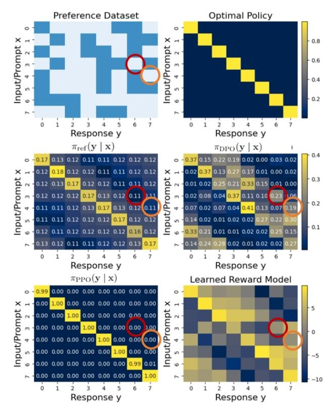
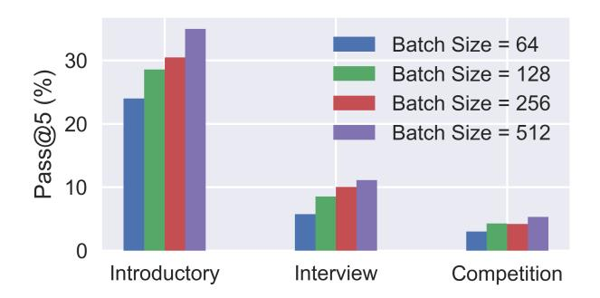

# Is DPO Superior to PPO for LLM Alignment? A Comprehensive Study

Shusheng Xu <sup>1</sup> Wei Fu <sup>1</sup> Jiaxuan Gao <sup>1</sup> Wenjie Ye <sup>2</sup> Weilin Liu <sup>2</sup> Zhiyu Mei <sup>1</sup> Guangju Wang <sup>2</sup> Chao Yu \* 1 Yi Wu \* 1 2 3

# Abstract

Reinforcement Learning from Human Feedback (RLHF) is currently the most widely used method to align large language models (LLMs) with human preferences. Existing RLHF methods can be roughly categorized as either *reward-based* or *reward-free*. Novel applications such as ChatGPT and Claude leverage *reward-based* methods that first learn a reward model and apply actor-critic algorithms, such as Proximal Policy Optimization (PPO). However, in academic benchmarks, the state-of-the-art results are often achieved via *reward-free* methods, such as Direct Preference Optimization (DPO). *Is DPO truly superior to PPO? Why does PPO perform poorly on these benchmarks?* In this paper, we first conduct both theoretical and empirical studies on the algorithmic properties of DPO and show that DPO may have fundamental limitations. Moreover, we also comprehensively examine PPO and reveal the key factors for the best performances of PPO in finetuning LLMs. Finally, we benchmark DPO and PPO across a collection of RLHF testbeds, ranging from dialogue to code generation. Experiment results demonstrate that PPO is able to surpass other alignment methods in all cases and achieve state-of-the-art results in challenging code competitions.

### 1. Introduction

Large Language Models (LLMs) derive their extensive language patterns and knowledge through pre-training on substantial textual datasets [\(Brown et al.,](#page-8-0) [2020;](#page-8-0) [OpenAI,](#page-10-0) [2023;](#page-10-0) [Touvron et al.,](#page-11-0) [2023;](#page-11-0) [Chowdhery et al.,](#page-8-1) [2023;](#page-8-1) [Anil et al.,](#page-8-2) [2023\)](#page-8-2). To leverage the formidable capabilities of LLMs in practical applications, a growing amount of research has

underscored the importance of aligning these models with human preferences [\(Agrawal et al.,](#page-8-3) [2023;](#page-8-3) [Kadavath et al.,](#page-9-0) [2022;](#page-9-0) [Shi et al.,](#page-11-1) [2023;](#page-11-1) [Liang et al.,](#page-10-1) [2021;](#page-10-1) [Sheng et al.,](#page-11-2) [2019\)](#page-11-2). Various methods have been developed for fine-tuning LLMs, with popular approaches including Supervised Fine-Tuning (SFT) [\(Peng et al.,](#page-10-2) [2023\)](#page-10-2) and Reinforcement Learning from Human Feedback (RLHF) [\(Ziegler et al.,](#page-12-0) [2019;](#page-12-0) [Stiennon](#page-11-3) [et al.,](#page-11-3) [2020;](#page-11-3) [Ouyang et al.,](#page-10-3) [2022\)](#page-10-3). Typically, fine-tuning involves two phases: SFT to establish a base model, followed by RLHF for enhanced performance. SFT involves imitating high-quality demonstration data, while RLHF refines LLMs through preference feedback.

Within RLHF, two prominent approaches are *reward-based* and *reward-free* methods. Reward-based methods, pioneered by OpenAI [\(Ouyang et al.,](#page-10-3) [2022;](#page-10-3) [Ziegler et al.,](#page-12-0) [2019;](#page-12-0) [Stiennon et al.,](#page-11-3) [2020\)](#page-11-3), construct a reward model using preference data and then employ actor-critic algorithms like Proximal Policy Optimization (PPO) to optimize the reward signal. In contrast, reward-free methods, including Direct Preference Optimization (DPO) [\(Rafailov et al.,](#page-10-4) [2023\)](#page-10-4), RRHF [\(Yuan et al.,](#page-12-1) [2023\)](#page-12-1), and PRO [\(Song et al.,](#page-11-4) [2023\)](#page-11-4), eliminate the explicit use of a reward function. DPO, a representative reward-free method, expresses the reward function in a logarithmic form of the policy and focuses solely on policy optimization.

Notably, the most successful applications like Chat-GPT [\(OpenAI,](#page-10-5) [2022\)](#page-10-5) and Claude [\(Antropic,](#page-8-4) [2023\)](#page-8-4) are produced by the reward-based RLHF method PPO, while strong performances in academic benchmarks often result from the reward-free RLHF method DPO [\(Rafailov et al.,](#page-10-4) [2023;](#page-10-4) [Mis](#page-10-6)[tralAI,](#page-10-6) [2023\)](#page-10-6). This discrepancy raises two fundamental questions: 1) *Is DPO truly superior to PPO in the RLHF domain?* and 2) *Can the performance of PPO be substantially improved in common RLHF benchmarks?* In this paper, we delve into these questions. Through theoretical and empirical analysis, we uncover the fundamental limitations of DPO and explore critical factors that enhance the practical performance of PPO in RLHF.

First, our theoretical examination reveals that DPO might find biased solutions that exploit out-of-distribution responses. Empirically, we demonstrate that the performance of DPO is significantly affected by the distribution shift

<sup>\*</sup>Co-corresponding authors. <sup>1</sup>Tsinghua University, Beijing China <sup>2</sup>OpenPsi Inc. <sup>3</sup> Shanghai Qi Zhi Institute, Shanghai, China. Correspondence to: Shusheng Xu <xssstory@gmail.com>, Chao Yu <zoeyuchao@gmail.com>, Yi Wu <jxwuyi@gmail.com>.

between the model outputs and the preference dataset. Second, we perform ablation studies on the algorithmic components of PPO and discover a collection of critical factors for PPO's best RLHF performances, including advantage normalization, large batch size, and exponential moving average update for the reference model. Finally, we validate our findings through extensive experiments, including dialogue generation tasks and more challenging code generation tasks. These experiments feature diverse feedback types and difficulty levels. The results indicate that PPO consistently outperforms DPO across all experiments. Particularly, in the most challenging code competition tasks, PPO achieves state-of-the-art results. Specifically, on the Code-Contest dataset [\(Li et al.,](#page-9-1) [2022\)](#page-9-1), our PPO model with 34B parameters outperforms AlphaCode-41B [\(Li et al.,](#page-9-1) [2022\)](#page-9-1), exhibiting a 10@1k improvement from 16.4% to 22.4%.

## 2. Related Work

Large language models (LLMs) trained on large datasets acquire surprising capabilities [\(Brown et al.,](#page-8-0) [2020;](#page-8-0) [Ope](#page-10-0)[nAI,](#page-10-0) [2023;](#page-10-0) [Touvron et al.,](#page-11-0) [2023;](#page-11-0) [Chowdhery et al.,](#page-8-1) [2023;](#page-8-1) [Anil et al.,](#page-8-2) [2023;](#page-8-2) [Kaplan et al.,](#page-9-2) [2020;](#page-9-2) [Brown et al.,](#page-8-0) [2020\)](#page-8-0). To leverage these capabilities to real applications, pretrained LLM is further fine-tuned on specific tasks [\(Rad](#page-10-7)[ford et al.,](#page-10-7) [2019;](#page-10-7) [Chung et al.,](#page-9-3) [2022;](#page-9-3) [Tay et al.,](#page-11-5) [2023\)](#page-11-5). Through fine-tuning with popular approaches such as SFT and RLHF, LLMs demonstrate impressive performance on established benchmarks [\(Touvron et al.,](#page-11-0) [2023;](#page-11-0) [OpenAI,](#page-10-0) [2023\)](#page-10-0), aligning further with human preferences and societal well-being [\(Russell & Norvig,](#page-10-8) [2020;](#page-10-8) [Russell,](#page-10-9) [2022\)](#page-10-9).

This paper concentrates on RLHF methods, which can be broadly categorized into reward-based and reward-free approaches. Reward-based methods entail training a reward model on preference data in an initial phase [\(Gao et al.,](#page-9-4) [2023;](#page-9-4) [Ziegler et al.,](#page-12-0) [2019;](#page-12-0) [Stiennon et al.,](#page-11-3) [2020;](#page-11-3) [Ouyang](#page-10-3) [et al.,](#page-10-3) [2022\)](#page-10-3). Subsequently, this learned reward model is utilized to provide a reward signal for online Reinforcement Learning (RL) algorithms such as PPO [\(Schulman et al.,](#page-11-6) [2017\)](#page-11-6). There exist previous works that have studied these methods through hyper-parameter tuning and analyzed the effects of the quality reward model quality [\(Zheng et al.,](#page-12-2) [2023;](#page-12-2) [Casper et al.,](#page-8-5) [2023\)](#page-8-5). In contrast, reward-free methods offer a simpler training procedure by directly training LLMs on preference data or ranking data to distill human preference [\(Yuan et al.,](#page-12-1) [2023;](#page-12-1) [Liu et al.,](#page-10-10) [2023;](#page-10-10) [Touvron et al.,](#page-11-0) [2023;](#page-11-0) [Rafailov et al.,](#page-10-4) [2023;](#page-10-4) [Song et al.,](#page-11-4) [2023;](#page-11-4) [Dong et al.,](#page-9-5) [2023;](#page-9-5) [Hong et al.,](#page-9-6) [2024\)](#page-9-6). Among these reward-free methods, DPO [\(Rafailov et al.,](#page-10-4) [2023\)](#page-10-4) has demonstrated strong performances and become popular in the community [\(Mis](#page-10-6)[tralAI,](#page-10-6) [2023;](#page-10-6) [Chen et al.,](#page-8-6) [2024;](#page-8-6) [Yuan et al.,](#page-12-3) [2024\)](#page-12-3). Recent work discussed the performance gap of DPO and PPO on synthetic contextual bandits [\(Li et al.,](#page-10-11) [2023\)](#page-10-11). In this paper, We analyze the limitations of DPO theoretically and empirically, and explore the key factors for PPO training.

Concurrent efforts have been undertaken to avoid reward model overoptimization [\(Rame et al.](#page-10-12) ´ , [2024\)](#page-10-12), facilitate alignment data generation [\(Lee et al.,](#page-9-7) [2023;](#page-9-7) [Yang et al.,](#page-11-7) [2023\)](#page-11-7), and implement resource-efficient RLHF systems [\(Yao et al.,](#page-11-8) [2023;](#page-11-8) [Santacroce et al.,](#page-10-13) [2023\)](#page-10-13). These works complement our study and can be seamlessly integrated into our implementation. Previous works have explored the implementation details of PPO for LLMs [\(Zheng et al.,](#page-12-2) [2023;](#page-12-2) [Ramamurthy](#page-10-14) [et al.,](#page-10-14) [2023\)](#page-10-14). Our paper extends its investigations with additional RLHF techniques, optimizing PPO performance to surpass its reward-free counterpart, DPO. Our work is also closely related to studies on algorithm implementation in the RL community [\(Engstrom et al.,](#page-9-8) [2020;](#page-9-8) [Andrychowicz](#page-8-7) [et al.,](#page-8-7) [2021;](#page-8-7) [Yu et al.,](#page-12-4) [2022\)](#page-12-4). However, our findings provide further insights into fine-tuning LLMs with a model size of up to 34B parameters.

### <span id="page-1-1"></span>3. Preliminary

Language Model. We consider an LLM as a policy πθ(y | x) parameterized by θ. π<sup>θ</sup> is designed to follow user instructions x ∈ X to generate a text response y ∈ Y. We only consider single-round conversations to simplify notations. Given a prompt x, the LLM π<sup>θ</sup> will generate response y in an auto-regressive manner:

$$\pi_{\theta} (\mathbf{y} \mid \mathbf{x}) = \prod_{t} \pi_{\theta} (y_{t} \mid \mathbf{x}, \mathbf{y}_{< t}), \qquad (1)$$

where y<sup>t</sup> is the t-th token in the response and y<t is tokens in the response before yt.

SFT. As an initial phase of alignment, the pre-trained model is enforced to imitate high-quality demonstration data (dialogue, summarization, etc.), which is usually referred to as Supervised Fine-Tuning (SFT).

RLHF. To further align the SFT model π<sup>θ</sup> with human preference, prior works [\(Ziegler et al.,](#page-12-0) [2019;](#page-12-0) [Ouyang et al.,](#page-10-3) [2022\)](#page-10-3) proposed the Reinforcement Learning from Human Feedback (RLHF) procedure, which maximizes the following objective,

<span id="page-1-0"></span>
$$J_r(\pi_{\theta}) = \mathbb{E}_{\mathbf{x} \sim p_{\text{data}}, \mathbf{y} \sim \pi_{\theta}} \left[ r(\mathbf{x}, \mathbf{y}) - \beta \log \frac{\pi_{\theta}(\mathbf{y} \mid \mathbf{x})}{\pi_{\text{ref}}(\mathbf{y} \mid \mathbf{x})} \right].$$
(2)

where r is the reward function reflecting human preferences. r takes a prompt and the corresponding response as input and outputs a scalar value. πref is the reference model used for regularizing π<sup>θ</sup> with Kullback–Leibler divergence. β is a constant to control the degree of regularization.

In the rest of this section, we will introduce two representative algorithms to optimize Eq. [\(2\)](#page-1-0): a reward-based approach, PPO, and a reward-free approach, DPO.

**PPO.** We can directly adopt standard reinforcement learning methods for Eq. (2). In this paper, we chose PPO as the training algorithm. When r is unknown, a reward model  $r_{\phi} \in R$  is first learned from human-labeled data to approximate r. A common practice is to collect a dataset of preference pairs  $\mathcal{D} = \{(\mathbf{x}, \mathbf{y}_w, \mathbf{y}_l)\}$ .  $\mathbf{y}_w$  and  $\mathbf{y}_l$  are responses to  $\mathbf{x}$  and marked as "win" and "lose" by human respectively. The distribution of the preference dataset is assumed to follow the Bradley-Terry model (Bradley & Terry, 1952; Christiano et al., 2017), i.e., the probability of response  $\mathbf{y}_w$  is better than  $\mathbf{y}_l$  is given by

$$\mathbb{P}_{\phi}(\mathbf{y}_{w} \succ \mathbf{y}_{l} \mid \mathbf{x}) = \frac{\exp(r_{\phi}(\mathbf{x}, \mathbf{y}_{w}))}{\exp(r_{\phi}(\mathbf{x}, \mathbf{y}_{w})) + \exp(r_{\phi}(\mathbf{x}, \mathbf{y}_{l}))}$$
$$= \sigma(r_{\phi}(\mathbf{x}, \mathbf{y}_{w}) - r_{\phi}(\mathbf{x}, \mathbf{y}_{l})). \tag{3}$$

where  $\sigma$  is the sigmoid function. Given  $\mathcal{D}$ ,  $r_{\phi}$  is trained by minimizing the negative log-likelihood of Eq. (3):

$$\mathcal{L}_{R}(r_{\phi}) = -\mathbb{E}_{(\mathbf{x}, \mathbf{y}_{w}, \mathbf{y}_{l}) \sim \mathcal{D}} \left[ \log \sigma(r_{\phi}(\mathbf{x}, \mathbf{y}_{w}) - r_{\phi}(\mathbf{x}, \mathbf{y}_{l})) \right]$$
(4)

After a reward model  $r_{\phi}$  is obtained, r is replaced with  $r_{\phi}$  and  $J_{r_{\phi}}(\pi_{\theta})$  could be explicitly optimized with online RL algorithms. We note that there exist cases when a ground-truth reward is available, and thus reward modeling becomes unnecessary (Zhang et al., 2020; Sellam et al., 2020; Ramamurthy et al., 2023). In these cases, the reward function can be directly incorporated into Eq. (2). While we acknowledge other actor-critic algorithms can also be feasible (Mnih et al., 2016; Haarnoja et al., 2018), we follow the mainstream work (Ziegler et al., 2019; Stiennon et al., 2020) and focus on PPO (Schulman et al., 2017) for our analysis in this paper.

**DPO.** Instead of learning a reward model, Direct Preference Optimization (DPO) (Rafailov et al., 2023) optimizes the policy  $\pi_{\theta}$  over preference data. DPO derived the closed-form solution of Eq. (2), which reveals the relationship between the reward  $r(\mathbf{x}, \mathbf{y})$  and the optimal language model  $\pi^*(\mathbf{y} \mid \mathbf{x})$ :

<span id="page-2-1"></span>
$$\pi^*(\mathbf{y} \mid \mathbf{x}) = \frac{1}{Z(\mathbf{x})} \pi_{\text{ref}}(\mathbf{y} \mid \mathbf{x}) \exp\left(\frac{1}{\beta} r(\mathbf{x}, \mathbf{y})\right),$$
 (5)

where  $Z(\mathbf{x})$  is a partition function that only depends on prompt  $\mathbf{x}$ . According to Eq. (5), if  $\pi_{\theta}$  maximizes  $J_{r_{\phi}}(\pi_{\theta})$ , the underlying reward can be derived with

<span id="page-2-4"></span>
$$r_{\phi}(\mathbf{x}, \mathbf{y}) = \beta \log \frac{\pi_{\theta}(\mathbf{y} \mid \mathbf{x})}{\pi_{\text{ref}}(\mathbf{y} \mid \mathbf{x})} + C(\mathbf{x}).$$
 (6)

where  $C: \mathcal{X} \to \mathbb{R}$  is a scalar function. This enables us to reparameterize Eq. (4) with the policy  $\pi_{\theta}$ , and then we can drive the DPO loss that directly optimizes  $\pi_{\theta}$ , i.e.,

$$\mathcal{L}_{\text{DPO}}(\pi_{\theta}) = -\mathbb{E}_{(\mathbf{x}, \mathbf{y}_{w}, \mathbf{y}_{l}) \sim \mathcal{D}}$$

$$\left[ \log \sigma \left( \beta \left( \log \frac{\pi_{\theta}(\mathbf{y}_{w} \mid \mathbf{x})}{\pi_{\text{ref}}(\mathbf{y}_{w} \mid \mathbf{x})} - \log \frac{\pi_{\theta}(\mathbf{y}_{l} \mid \mathbf{x})}{\pi_{\text{ref}}(\mathbf{y}_{l} \mid \mathbf{x})} \right) \right) \right].$$

<span id="page-2-5"></span>

| Action               | $\mathbf{y}_1$         | $\mathbf{y}_2$     | $\mathbf{y}_3$                    |
|----------------------|------------------------|--------------------|-----------------------------------|
| $\pi_{\mathrm{ref}}$ | 0.5                    | 0.5                | 0                                 |
| $D_{\rm pref}$       | $ \{(\mathbf{y}_u)\} $ | $v = \mathbf{y}_1$ | $\{\mathbf{y}_l = \mathbf{y}_2\}$ |
| $\pi_{\mathrm{DPO}}$ | 0.1                    | 0.0                | 0.9                               |
| $\pi_{\mathrm{PPO}}$ | 1                      | 0                  | 0                                 |

Table 1. A state-less counter-example with three actions when DPO can minimize the loss but produce an unexpected policy. PPO will not produce  $\pi_{\rm DPO}$  because  $\pi_{\rm ref}$  enforces the probability of outputting  $\mathbf{y}_3$  is zero.

<span id="page-2-0"></span>We remark that although Rafailov et al. (2023) performs a single-round DPO over the preference dataset, some recent works also adapt DPO to an iterative variant with a learned reward model (Xiong et al., 2023; Yuan et al., 2024). We also investigate the performance of iterative DPO.

## <span id="page-2-2"></span>4. Understanding the Limitation of DPO

In this section, we demonstrate that DPO may not be superior to PPO. Firstly, we theoretically demonstrate issues with the DPO training objective. Secondly, we illustrate that DPO is more susceptible to out-of-distribution (OOD) data through a synthetic example. Lastly, through experiments on a real preference dataset, we validate that the performance of DPO can be improved by mitigating the distribution shift between the model outputs and the preference dataset.

#### 4.1. Theoretical Analysis

It is well-known that PPO could exploit potential failures in the learned reward model to achieve high rewards without meeting the actual human preference, often manifested as erroneous (Lewis et al., 2017) or overly complex outputs (Singhal et al., 2023). We argue that, though DPO avoids reward modeling, DPO has a similar generalization issue. In the following theorem, we will show that any solution found by PPO also minimizes the DPO objective Eq. (7), and thus, any solution found by PPO that exploits the reward model can also be found by DPO. Furthermore, DPO might discover solutions exploiting out-of-distribution data, posing a risk of deviating excessively from the reference policy even when the reference policy aligns well with human preferences.

<span id="page-2-6"></span>**Theorem 4.1.** Given a ground-truth reward r and a preference dataset  $\mathcal{D}$ , let  $\Pi_{PPO}$  be the class of policies induced by training reward model  $r_{\phi}$  over  $\mathcal{D}$  and running PPO to optimize  $J_{r_{\phi}}(\theta)$ . Let  $\Pi_{DPO}$  be the class of policies induced by minimizing DPO objective Eq. (7). We have the following conclusion:  $\Pi_{PPO}$  is a proper subset of  $\Pi_{DPO}$ .

<span id="page-2-3"></span>*Proof.* We first prove that  $\Pi_{PPO}$  is a subset of  $\Pi_{DPO}$ , i.e.

 $\Pi_{\mathrm{PPO}} \subseteq \Pi_{\mathrm{DPO}}$ . Let R be the class of reward models that minimizes reward learning loss Eq. (4). We note there is an one-to-many mapping between  $\Pi_{\mathrm{PPO}}$  and R according to Eq. (6). Without loss of generality, we omit the scalar factor  $C(\mathbf{x})$  and define f to be an one-to-one mapping from a policy to a reward function  $f(\pi)(\mathbf{x}, \mathbf{y}) = \beta \log \frac{\pi(\mathbf{y}|\mathbf{x})}{\pi_{ref}(\mathbf{y}|\mathbf{x})}$ .

We will show that the minimum DPO loss is the same as the minimum reward learning loss, i.e.,  $\min_r \mathcal{L}_R(r) = \min_\pi \mathcal{L}_{\mathrm{DPO}}(\pi)$ . We can show that  $\min_\pi \mathcal{L}_{\mathrm{DPO}}(\pi) = \min_\pi \mathcal{L}_R(f(\pi)) \geq \min_r \mathcal{L}_R(r)$ . And for a minimizer  $r^*$  of  $\mathcal{L}_R(r)$ , we can construct a policy  $\pi^*$  from  $r^*$  by Eq. (5) and then  $\min_\pi \mathcal{L}_{\mathrm{DPO}}(\pi) \leq \mathcal{L}_{\mathrm{DPO}}(\pi^*) = \min_r \mathcal{L}_R(r)$ . Therefore the reward learning loss achieved by reward models in R and DPO loss achieved by policies in  $\Pi_{\mathrm{DPO}}$  are the same, i.e.  $\forall r_\phi \in R, \pi_{\mathrm{DPO}} \in \Pi_{\mathrm{DPO}}, \min_r \mathcal{L}_R(r) = \mathcal{L}_R(r_\phi) = \mathcal{L}_{\mathrm{DPO}}(\pi_{\mathrm{DPO}}) = \min_\pi \mathcal{L}_{\mathrm{DPO}}(\pi)$ .

For any solution found by PPO,  $\pi_{PPO} \in \Pi_{PPO}$ , the reward  $r^* = f(\pi_{PPO})$  satisfies that  $\pi_{PPO}$  is a maximizer of  $J_{r^*}(\pi)$  and  $\pi_{PPO}$  can be represented by  $r^*$  with

<span id="page-3-0"></span>
$$\pi_{\text{PPO}}(\mathbf{y} \mid \mathbf{x}) = \frac{1}{Z(\mathbf{x})} \pi_{\text{ref}}(\mathbf{y} \mid \mathbf{x}) \exp\left(\frac{1}{\beta} r^*(\mathbf{x}, \mathbf{y})\right).$$
 (8)

Substituting  $\pi_{\text{PPO}}$  with Eq. (8) in  $\mathcal{L}_{\text{DPO}}(\pi_{\text{PPO}})$ , we get  $\mathcal{L}_{\text{DPO}}(\pi_{\text{PPO}}) = \mathcal{L}_R(r_\phi)$ . Therefore,  $\pi_{\text{PPO}}$  also minimizes the DPO loss, which implies  $\pi_{\text{PPO}} \in \Pi_{\text{DPO}}$ .

Next, we show that  $\Pi_{PPO}$  is a proper subset of  $\Pi_{DPO}$ , i.e.  $\Pi_{PPO} \subseteq \Pi_{DPO}$  with a counter-example as shown in Table 1. In this counter-example, we will show that there exists a solution found by DPO,  $\pi_{DPO} \in \Pi_{DPO}$ , that does not maximize the RL objective of PPO Eq. (2). Consider a simple state-less case with three actions, but the preference dataset only contains a single pair comparison between  $\mathbf{v}_1$ and  $y_2$ . Denote the probability of DPO policy  $\pi_{DPO}$  outputting the first two actions as a and b. The DPO loss in this scenario is given by  $\mathcal{L}_{DPO} = \log(1 + (\frac{b}{a})^{\beta})$ , which can be minimized as long as b = 0. A possible optimal policy produced by DPO is shown in the third row of Table 1, which has a 0.1 probability to output  $y_1$  and a 0.9 probability to output  $y_3$ . This policy cannot be produced by PPO because  $\pi_{\mathrm{ref}}$  enforces  $\pi_{\mathrm{PPO}}$  to assign 0 probability to  $\mathbf{y}_3$  according to Eq. (8).

We remark that the root cause of reward misspecification is the narrow distribution coverage of the preference dataset. The learned reward model may assign a high value to outof-distribution (OOD) samples and has the potential to be exploited during the RL process. Although DPO avoids training the reward model, it still suffers from the misspecification issue on OOD samples but in a different manner. Specifically, DPO can develop a biased distribution



<span id="page-3-1"></span>Figure 1. Preference dataset coverage, policy probability distributions of  $\pi_{\rm ref}$ ,  $\pi_{\rm PPO}$ ,  $\pi_{\rm DPO}$ , and the value of learned rewards in the synthetic scenario. In the first figure, dark color represents data present in preference data, while light means the data points are not included. Although data points marked with red circles and orange circles are not covered by the preference dataset, DPO assigns higher probabilities of these data points compared with the reference model. PPO assigns low probability to the marked data points and learns the optimal policy.

favoring unseen responses, directly impacting quality of the learned policy. By contrast, PPO can leverage prompt-only data and generate responses beyond the preference dataset distribution. During training, KL divergence between  $\pi_{\theta}$  and  $\pi_{\rm ref}$  can provide additional regularization for PPO on these generated samples.

#### 4.2. Empirical Validation in A Synthetic Scenario

We design a synthetic scenario to validate Theorem 4.1 in practice. We create discrete spaces of prompts and responses, both of size 8. The policy  $\pi_{\theta}$  and reward model  $r_{\phi}$  are modeled as MLPs, which take a one-hot vector as input and output a categorical distribution of overall responses. We manually enforce the optimal response to be diagonal indices. The preference dataset is randomly created under this constraint and only covers limited preference pairs for each input. The resulting policies of DPO and PPO are shown in Figure 1. We can see that in practice, DPO and the learned reward model can assign high values to the response out of the distribution of preference dataset, which

are marked using circles. In the case of DPO, the final model may assign higher probabilities than the reference model to these responses, which is not desirable as performance improvement on OOD responses could not be guaranteed. For example, in the red circles, DPO increases the probability from 0.11 to 0.23. In contrast, though the reward model has a similar misspecification issue, PPO can alleviate the issue with explicit KL regularization w.r.t. the reference model.

Practical Remark: From the analysis in this section, we attempt to provide insights to understand the performance of DPO in practice — DPO is prone to generating a biased policy that favors out-of-distribution responses, leading to unpredictable behaviors. We will further validate these insights through an experimental study involving LLMs on real preference datasets.

### <span id="page-4-1"></span>4.3. Experiments on Real Preference Datasets

In this section, we conduct experiments on real preference datasets and investigate two aspects that may influence DPO performance, including the base model and preference data used for DPO training.

Experimental Setup. We perform our experimental analysis on SafeRLHF dataset [\(Dai et al.,](#page-9-11) [2023\)](#page-9-11). In this dataset, preference pairs have the form (x, y1, y2, lh, ls, b1, b2), where l<sup>h</sup> and l<sup>s</sup> are a preference labels over y<sup>1</sup> and y<sup>2</sup> in terms of helpfulness and safety, respectively, which could be either 1 or 2. b<sup>1</sup> and b<sup>2</sup> are binary safety labels of these two responses, which could be positive or negative. With this dataset, our objective is to train an LLM that prioritizes safety over helpfulness in content generation. Specifically, in constructing the preference dataset, our preference is for the more helpful response when both options are considered safe (i.e., l<sup>h</sup> if b<sup>1</sup> and b<sup>2</sup> are both positive). Otherwise, our preference shifts towards the safer one (i.e., ls). Following [Dai et al.](#page-9-11) [\(2023\)](#page-9-11), the base model is trained on the Alpaca [\(Taori et al.,](#page-11-12) [2023\)](#page-11-12) open-source dataset with SFT, denoted as *SFT (Alpaca)*. We use the evaluation models released by the official codebase to evaluate the helpfulness and harmfulness. We remark that these official evaluation models are not involved during the training. Our experimental study is shown in Table [2.](#page-4-0)

Impact of The Base Model. When using *SFT (Alpaca)* as the base and reference model, we find that DPO performs poorly, producing only a 55.4% safety rate and low helpfulness reward. We hypothesize that this is caused by the distribution shift between the training data of the base model, i.e., the Alpaca dataset, and the preference data, i.e., the SafeRLHF dataset. To study the impact, we further fine-tune *SFT (Alpaca)* on the SafeRLHF dataset with safe responses to obtain *SFT (Safe)*. We then use *SFT (Safe)* as the reference model to re-train DPO from scratch. As

<span id="page-4-0"></span>

|                      | ∆Help. ↑ | Harm. ↓ | S.R. ↑ |
|----------------------|----------|---------|--------|
| SFT (Alpaca)         | -2.62    | 1.50    | 41.6%  |
| PPO                  | 1.69     | -12.08  | 99.5%  |
| + SFT (Safe)         | 4.47     | -12.33  | 99.6%  |
| DPO                  | -4.19    | -0.97   | 55.4%  |
| + SFT (Safe)         | -1.62    | -3.50   | 71.8%  |
| + filter dual-unsafe | 2.46     | -4.88   | 80.8%  |
| + filter dual-safe   | -2.86    | -6.82   | 95.8%  |
| DPO Iter.1           | -3.22    | -5.23   | 86.7%  |
| DPO Iter.2           | -3.27    | -8.83   | 99.7%  |
| DPO Iter.3           | -3.26    | -10.21  | 99.9%  |
| DPO Iter.4           | -2.96    | -11.07  | 99.9%  |

Table 2. The impact of training data on DPO. We first train Llama-2-7B on the Alpaca open-source dataset and obtain *SFT (Alpaca)*. Then the SFT model is trained with DPO and PPO. DPO performs poorly due to distribution mismatch and noises. These issues can be resolved by (1) additional SFT on the preference dataset (*SFT (Safe)*), (2) filtering out controversy and noisy preference pairs, and (3) generating new responses and using a learned reward model to label the preference data for iterative DPO training.

shown in Table [2,](#page-4-0) resolving the distribution shift issue essentially increases the safety rate by 16.4% and the helpfulness reward from −4.19 to −1.62.

Sensitivity to Preference Data. There exist pairs (x, y1, y2) in the SafeRLHF dataset where both y<sup>1</sup> and y<sup>2</sup> have the same safety label. After filtering out the dualunsafe and dual-safe preference data in the dataset, the trained model could obtain a much higher safety rate. However, filtering the dual-safe preference data would largely hurt the performance of helpfulness. These results suggest that while DPO may derive advantages from eliminating noise or controversies in the training data, excessively discarding high-quality data could be detrimental to DPO performance.

Impact of Preference Data Distribution. While mitigating the distribution shift can be done with additional SFT, we also investigate whether collecting additional data with the base model could bring benefit. Specifically, instead of using the existing preference data, we generate new responses with *SFT (Safe)* and use a learned reward model for preference labeling. We further repeat this process and iteratively set the reference model as the latest DPO model in the last iteration. We denote this method as *DPO-Iter*. Remarkably, *DPO-Iter* achieves a comparable safety rate with PPO. This experiment again demonstrates that DPO could be improved by mitigating the distribution shift. However, it also obtains a much lower helpfulness reward compared to PPO.

Practical Remark: The performance of DPO could be improved by mitigating the distribution shift between the model and the preference dataset. To alleviate the issue of distribution shift and noisy data, we suggest adopting the iterative DPO method. One should carefully annotate the

| Task           | HH-RLHF               | APPS             |                  |                 | CodeContest |          |         |
|----------------|-----------------------|------------------|------------------|-----------------|-------------|----------|---------|
| Metric         | OpenAssaint<br>Reward | Intro.<br>pass@5 | Inter.<br>pass@5 | Comp.<br>pass@5 | pass@10     | pass@100 | pass@1k |
| SFT            | 0.532                 | 38.6%            | 10.1%            | 3.9%            | 0.9%        | 4.3%     | 12.0%   |
| baseline PPO   | 0.706                 | 18.0%            | 2.4%             | 1.1%            | 4.3%        | 6.0%     | 7.7%    |
| + Adv.Norm.    | 0.716                 | 38.1%            | 11.4%            | 4.6%            | 6.8%        | 9.4%     | 15.4%   |
| + Large.Batch. | 0.716                 | 42.3%            | 14.6%            | 7.5%            | 5.1%        | 12.8%    | 19.6%   |
| + Ref.EMA      | 0.718                 | 44.4%            | 18.0%            | 9.1%            | 6.8%        | 13.7%    | 21.4%   |

Table 3. Ablation study of PPO on different tasks. Baseline PPO is trained with a batch size of 64. Specifically, for the HH-RLHF task, the base model employed is Llama2-7B. In the case of APPS and CodeContest tasks, the base model utilized is CodeLlama-34B.



<span id="page-5-0"></span>Figure 2. Performance of PPO on APPS dataset under different batch sizes. The base LLM is CodeLlma-13B. "Introductory", "Interview" and "Competition" represent three levels of difficulty.

model-generated samples each time and then proceed to the next round of training. However, we will demonstrate in Sec. [6](#page-6-0) that even with a nearly perfect annotator, the performance of DPO remains unsatisfactory in challenging tasks such as code generation.

## 5. Key Factors to PPO for RLHF

In this section, we investigate the key factors to the RLHF performance of PPO. We find three key techniques: (1) advantage normalization [\(Raffin et al.,](#page-10-16) [2021\)](#page-10-16), (2) largebatch-size training [\(Yu et al.,](#page-12-4) [2022\)](#page-12-4), and (3) updating the parameters of the reference model with exponential moving average [\(Ouyang et al.,](#page-10-3) [2022\)](#page-10-3). The first two techniques are widely adopted by the RL community but are not wellstudied in the field of RLHF. The third is a technique that has received limited discussion in the literature, involving the gradual update of the reference model through an exponential moving average [\(Ouyang et al.,](#page-10-3) [2022\)](#page-10-3). This particular approach has the potential to yield additional performance enhancements.

Implementation Details. Our PPO implementation is based on DeepSpeed-Chat [\(Yao et al.,](#page-11-8) [2023\)](#page-11-8), except that (1) we use a scalar reward for each response instead of dense rewards assigned on each token and (2) we omit the auxiliary SFT loss during PPO training because of the limited amount of data. This implementation includes common PPO techniques such as value loss clip and generalized advantage estimation (GAE) [\(Schulman et al.,](#page-10-17) [2016\)](#page-10-17). We list experiment details in Appendix [A.2.](#page-13-0)

Experimental Setup. Our ablation experiments for PPO are carried out on a dialogue task HH-RLHF [\(Bai et al.,](#page-8-10) [2022\)](#page-8-10) as well as two code generation tasks: APPS [\(Hendrycks](#page-9-12) [et al.,](#page-9-12) [2021\)](#page-9-12) and CodeContest [\(Li et al.,](#page-9-1) [2022\)](#page-9-1). HH-RLHF is a preference dataset in the form defined in Section [3](#page-1-1) that aims to train a helpful and harmless LLM. APPS and CodeContest datasets are competitive programming datasets. Given a problem, the LLM should output a piece of executable code to solve this problem. The correctness is verified by test cases in the dataset, which can then generate reward signals or preference pairs for PPO and DPO training, respectively. We remark that these two types of tasks feature different types of reward signals: preference and direct reward feedback. The complete experimental setup is listed in Section [6.](#page-6-0) In the experiment result, we denote advantage normalization as *Adv. Norm.*, large batch-size training as *LargeBatch* and exponential moving average of reference model update as *Ref. EMA*.

Analysis. The result of the ablation study is shown in Section [4.3.](#page-4-0) In Section [4.3,](#page-4-0) with a small batch size, baseline PPO improves over the SFT model on HH-RLHF and Code-Contest dataset but shows significant performance degradation on the APPS dataset. Advantage normalization stabilizes PPO training and improves the performance of PPO. The most significant benefit is brought by using a large batch size, especially on code generation tasks. Lastly, using the exponential moving average for the reference model also brings additional benefits. The intuition behind this is that while the main LLM of PPO is rapidly changing, the reference model should also be updated accordingly. Otherwise, the learned model may be strongly regularized to be close to the SFT model, which can hurt performance in challenging tasks. Figure [2](#page-5-0) further demonstrates that increasing the batch size of PPO consistently improves the performance across all difficulty levels in the APPS dataset. We also

|          | OpenAssistant | Tested V.S. Chosen |     |              | Tested V.S. SFT |     |           |
|----------|---------------|--------------------|-----|--------------|-----------------|-----|-----------|
|          | Reward        | Tested Win ↑       | Tie | Chosen Win ↓ | Tested Win ↑    | Tie | SFT Win ↓ |
| RRHF     | 0.523         | 28                 | 33  | 39           | 29              | 37  | 34        |
| PRO      | 0.529         | 37                 | 26  | 37           | 34              | 33  | 33        |
| DPO      | 0.611         | 55                 | 21  | 24           | 53              | 31  | 16        |
| DPO-Iter | 0.678         | 55                 | 18  | 27           | 54              | 33  | 13        |
| PPO      | 0.718         | 57                 | 21  | 22           | 58              | 29  | 13        |

Table 4. Results on the HH-RLHF test set. The evaluation metrics include the OpenAssistant rewards and the win rate of models against the chosen responses and SFT model outputs. The OpenAssistant reward model is not used during the training process. Note that DPO is trained on the preference data in the dataset, while Iter. DPO is trained on self-generated responses, using a reward model for labeling.

|                   | PPO Win | Tie | DPO Win |
|-------------------|---------|-----|---------|
| PPO V.S. DPO      | 42      | 28  | 30      |
| PPO V.S. DPO-Iter | 36      | 36  | 28      |

Table 5. On HH-RLHF, we use GPT-4 to compare the outputs of the PPO and DPO models.

highlight that utilizing a small batch size, such as 64, in PPO training could negatively impact the performance of the base SFT model, resulting in a 33.7% performance level on the introductory scale. We remark that our findings are consistent with those developed in the RL community [\(Yu](#page-12-4) [et al.,](#page-12-4) [2022\)](#page-12-4).

## <span id="page-6-0"></span>6. Benchmark Results

In this section, we conduct experimental validations to evaluate the performances of both DPO and PPO. Initially, our experiments focus on general dialogue tasks, specifically HH-RLHF and SafeRLHF. The primary goal is to improve the effectiveness of LLM by promoting constructive interactions and mitigating detrimental components within the model. Additionally, our investigation extends to demanding code generation tasks, namely APPS and CodeContest.

| LLM     | Method          | ∆Help. ↑       | Harm. ↓          | S.R. ↑          |
|---------|-----------------|----------------|------------------|-----------------|
|         | Beaver          | -              | -6.59            | 89.6%           |
|         | SFT             | -2.26          | 0.78             | 46.5%           |
| Llama 1 | DPO             | -2.70          | -6.38            | 93.1 %          |
| 7B      | DPO-Iter<br>PPO | -2.79<br>+0.66 | -11.86<br>-10.22 | 100.0%<br>98.6% |
|         | SFT             | -2.12          | 0.00             | 52.1%           |
| Llama 2 | DPO             | -2.86          | -6.82            | 95.8%           |
| 7B      | DPO-Iter        | -2.96          | -11.07           | 99.9%           |
|         | PPO             | +1.69          | -12.08           | 99.5%           |

Table 6. Results on SafeRLHF. "Beaver" is the officially released model. "∆ Help." denotes helpfulness relative to Beaver. "S.R." denotes safety rate. The reported results are based on the official evaluation model.

HH-RLHF [\(Bai et al.,](#page-8-10) [2022\)](#page-8-10) dataset consists of human preferences on AI assistant responses, encompassing 170k comparisons. In this dataset, we conduct experiments based

<span id="page-6-5"></span><span id="page-6-3"></span><span id="page-6-2"></span>

| Model        | Method   | Intro. | Inter. | Comp. |
|--------------|----------|--------|--------|-------|
| GPT-Neo 2.7B | SFT      | 5.6%   | 0.8%   | 0.0%  |
| Codex 12B    | SFT      | 9.7%   | 0.5%   | 0.1%  |
| CodeT5       | CodeRL   | 16.4%  | 4.9%   | 2.8%  |
| AlphaCode 1B | 5@1k     | 14.4%  | 5.6%   | 4.6%  |
|              | Few shot | 10.8%  | 2.0%   | 0.8%  |
| Code Llama   | SFT      | 30.0%  | 7.8%   | 2.8%  |
| 7B           | DPO-Iter | 20.9%  | 3.4%   | 1.3%  |
|              | PPO      | 29.4%  | 7.6%   | 2.4%  |
|              | Few shot | 23.7%  | 5.6%   | 2.1%  |
| Code Llama   | SFT      | 33.7%  | 8.7%   | 3.6%  |
| 13B          | DPO-Iter | 33.0%  | 8.0%   | 2.8%  |
|              | PPO      | 36.4%  | 11.47% | 4.6%  |
|              | Few shot | 32.8%  | 8.8%   | 2.9%  |
| Code Llama   | SFT      | 38.6%  | 10.1%  | 3.9%  |
| 34B          | DPO-Iter | 34.2%  | 9.3%   | 3.7%  |
|              | PPO      | 44.4%  | 18.0%  | 9.1%  |

Table 7. Results on Apps test set. All the numbers are pass@5 except for AlphaCode. Where "5@1k" means this model samples 1000 times for each problem and 5 sampled codes that pass the public test cases (in the problem description) are selected to be evaluated on hidden test cases.

on Llama2-7B. We evaluate the trained models using the OpenAssistant reward model[1](#page-6-1) . Note that this model is only used for evaluation and is not involved during training. In addition, we adopt GPT-4 to compare the responses of different models. The prompt and evaluation details are listed in Appenidx [B.](#page-13-1)

<span id="page-6-4"></span>As shown in Table [4,](#page-6-2) except DPO and PPO, we also investigate other alignment methods such as RRHF [\(Yuan et al.,](#page-12-1) [2023\)](#page-12-1) and PRO [\(Song et al.,](#page-11-4) [2023\)](#page-11-4). The results demonstrate that PPO and DPO are much more preferred by GPT-4 than the chosen responses in the dataset and SFT model outputs, outperforming RRHF and PRO across all metrics. In this paper, we focus more on the performance of DPO and PPO. We observe that DPO-Iter performs better than DPO but worse than PPO. PPO consistently achieves a higher reward and higher win rates. We also use GPT-4 to compare the outputs of DPO and PPO directly, and the results are

<span id="page-6-1"></span><sup>1</sup> https://huggingface.co/OpenAssistant/oasst-rm-2-pythia-6.9b-epoch-1

| Model          | Method                        | Valid. Set<br>10@1k            | Test Set<br>10@1k              |
|----------------|-------------------------------|--------------------------------|--------------------------------|
| AlphaCode 9B   | -                             | 16.9%                          | 14.3%                          |
| AlphaCode 41B  | -<br>+ clustering             | 16.9%<br>21.0%                 | 15.6%<br>16.4%                 |
| Code Llama 34B | SFT<br>DPO<br>DPO-Iter<br>PPO | 10.3%<br>0.0%<br>3.5%<br>19.7% | 15.2%<br>0.0%<br>3.2%<br>22.4% |

Table 8. Pass rate on CodeContests dataset. "10@1k" means that 1000 samples will be evaluated on public tests in the problem description, and only 10 of them will be submitted for hidden tests. We only used Python for solving problems, while AlphaCode used both Python and C++.

listed in Table [5,](#page-6-3) which demonstrates that GPT-4 prefers the responses of PPO.

SafeRLHF [\(Dai et al.,](#page-9-11) [2023\)](#page-9-11) dataset comprises over 30k entries of expert comparison data. Each entry in this dataset contains two responses to a question. In our experiments, we consolidate two preferences as mentioned in Section [4.3.](#page-4-1) For evaluation, we borrow the official reward model and cost model[2](#page-7-0) , which are trained to evaluate helpfulness and harmlessness, respectively.

The results on SafeRLHF are listed in Tab [6.](#page-6-4) Experiments indicate that after alignment, both DPO and PPO can generate responses with less harm, while PPO's responses are more helpful.

APPS [\(Hendrycks et al.,](#page-9-12) [2021\)](#page-9-12) is a description-to-code generation benchmark from competitive programming platforms. For each question, there are also test cases to verify the accuracy of generated codes. We use these test cases in the training set to provide feedback. For PPO training, the feedback could be directly used as a reward. We simply define the reward as 10 if the generated code passes all test cases. Otherwise, the reward is 0. For DPO, since there are no preference pairs, we adopt DPO-Iter. Specifically, we use the base model to sample 5 codes for each prompt and utilize the test cases to label the correctness of generated codes. It is worth noting that for many prompts, the base model may fail to sample any correct answer. In such cases, we use the correct solutions from the dataset as yw. We evaluate the results using pass@k, which is defined as the proportion of problems successfully solved by employing k generated programs for each problem.

As shown in Table [7.](#page-6-5) We conduct experiments on different model sizes. In particular, when using CodeLlama-34B as the base model, we achieved state-of-the-art results on the APPS dataset. We can observe that DPO-Iter fails to improve the SFT model performances on all the model sizes. In contrast, for PPO, as the model size increases, the improvement is more apparent. We remark that the feedback using test cases is nearly perfect. However, the performance of DPO-Iter remains unsatisfactory.

<span id="page-7-1"></span>CodeContest [\(Li et al.,](#page-9-1) [2022\)](#page-9-1) is a more challenging competitive programming dataset consisting of several programming languages. Here, we only use Python code. We adopt a similar way to train PPO as in the APPS dataset. For DPO training, we construct the preference dataset by using the correct and incorrect codes provided by the dataset. To compare with previous work, we adopt k@n to evaluate the generated code, which means that n samples will be evaluated on public tests in the problem description, and k of them will be submitted for hidden tests.

The results are listed in Table [8.](#page-7-1) We obtained similar conclusions as in APPS. PPO improves the SFT model significantly, while DPO fails to generate any correct codes. After one epoch of training, the code written by the DPO model has achieved a pass rate of 0, we observe that the DPO model outputs many meaningless code snippets. The results also demonstrate that DPO-Iter performs worse compared to SFT. With the assistance of PPO, CodeLlama-34B has surpassed the previous state-of-the-art on this task, outperforming Alphacode with 41 billion parameters.

## 7. Conclusion

In this paper, we uncover the fundamental limitations of DPO and explore critical factors that enhance the practical performance of PPO in RLHF. Through theoretical and experimental analysis, we explore the limitations of DPO and find that DPO is sensitive to the distribution shift between the base model outputs and preference data. We suggest that iterative DPO is better than training on static data. However, we also find that DPO fails to improve the performance on challenging tasks such as code generation. Moreover, according to the ablation study, we summarize the key factors for PPO training, including advantage normalization, large batch size, and updating the parameters of the reference model with an exponential moving average. With our practical tuning guideline, PPO demonstrates robust effectiveness across diverse tasks and achieves state-of-the-art results in challenging code competition tasks.

There are also limitations in our work. The reward model is significant in the training processes of both PPO and DPO-Iter. However, in this paper, we have not delved into the discussion of how to effectively train a robust reward model. For the code competition task, we utilize the groundtruth reward for PPO training and the labeling of DPO-Iter. However, this does not affect the conclusions drawn in our paper, and we leave it as future works.

<span id="page-7-0"></span>https://github.com/PKU-Alignment/safe-rlhf

### Impact Statements

Our study investigates a critical challenge in aligning Large Language Models (LLMs) with human preferences, emphasizing its societal impact, including the elimination of bias and the reduction of unfairness. The use of a public dataset ensures transparency, mitigating concerns related to privacy and ethical considerations. This research emphasizes our dedication to responsible AI practices, aiming to improve societal well-being by aligning LLMs with human values while upholding rigorous standards for privacy and ethics.

# References

- <span id="page-8-3"></span>Agrawal, A., Mackey, L., and Kalai, A. T. Do language models know when they're hallucinating references? *CoRR*, abs/2305.18248, 2023. doi: 10.48550/ARXIV. 2305.18248. URL [https://doi.org/10.48550/](https://doi.org/10.48550/arXiv.2305.18248) [arXiv.2305.18248](https://doi.org/10.48550/arXiv.2305.18248).
- <span id="page-8-7"></span>Andrychowicz, M., Raichuk, A., Stanczyk, P., Orsini, M., Girgin, S., Marinier, R., Hussenot, L., Geist, M., Pietquin, O., Michalski, M., Gelly, S., and Bachem, O. What matters for on-policy deep actor-critic methods? A largescale study. In *9th International Conference on Learning Representations, ICLR 2021, Virtual Event, Austria, May 3-7, 2021*. OpenReview.net, 2021. URL [https:](https://openreview.net/forum?id=nIAxjsniDzg) [//openreview.net/forum?id=nIAxjsniDzg](https://openreview.net/forum?id=nIAxjsniDzg).
- <span id="page-8-2"></span>Anil, R., Dai, A. M., Firat, O., Johnson, M., Lepikhin, D., Passos, A., Shakeri, S., Taropa, E., Bailey, P., Chen, Z., Chu, E., Clark, J. H., Shafey, L. E., Huang, Y., Meier-Hellstern, K., Mishra, G., Moreira, E., Omernick, M., Robinson, K., Ruder, S., Tay, Y., Xiao, K., Xu, Y., Zhang, Y., Abrego, G. H., Ahn, J., Austin, J., Barham, ´ P., Botha, J. A., Bradbury, J., Brahma, S., Brooks, K., Catasta, M., Cheng, Y., Cherry, C., Choquette-Choo, C. A., Chowdhery, A., Crepy, C., Dave, S., Dehghani, M., Dev, S., Devlin, J., D´ıaz, M., Du, N., Dyer, E., Feinberg, V., Feng, F., Fienber, V., Freitag, M., Garcia, X., Gehrmann, S., Gonzalez, L., and et al. Palm 2 technical report. *CoRR*, abs/2305.10403, 2023. doi: 10.48550/ARXIV.2305.10403. URL [https://doi.](https://doi.org/10.48550/arXiv.2305.10403) [org/10.48550/arXiv.2305.10403](https://doi.org/10.48550/arXiv.2305.10403).
- <span id="page-8-4"></span>Antropic. Claude, Jul 2023. URL [https://claude.](https://claude.ai/chats) [ai/chats](https://claude.ai/chats).
- <span id="page-8-10"></span>Bai, Y., Jones, A., Ndousse, K., Askell, A., Chen, A., Das-Sarma, N., Drain, D., Fort, S., Ganguli, D., Henighan, T., et al. Training a helpful and harmless assistant with reinforcement learning from human feedback. *arXiv preprint arXiv:2204.05862*, 2022.
- <span id="page-8-8"></span>Bradley, R. A. and Terry, M. E. Rank analysis of incomplete block designs: I. the method of paired comparisons. *Biometrika*, 39(3/4):324–345, 1952.

- <span id="page-8-0"></span>Brown, T. B., Mann, B., Ryder, N., Subbiah, M., Kaplan, J., Dhariwal, P., Neelakantan, A., Shyam, P., Sastry, G., Askell, A., Agarwal, S., Herbert-Voss, A., Krueger, G., Henighan, T., Child, R., Ramesh, A., Ziegler, D. M., Wu, J., Winter, C., Hesse, C., Chen, M., Sigler, E., Litwin, M., Gray, S., Chess, B., Clark, J., Berner, C., McCandlish, S., Radford, A., Sutskever, I., and Amodei, D. Language models are few-shot learners. In Larochelle, H., Ranzato, M., Hadsell, R., Balcan, M., and Lin, H. (eds.), *Advances in Neural Information Processing Systems 33: Annual Conference on Neural Information Processing Systems 2020, NeurIPS 2020, December 6-12, 2020, virtual*, 2020. URL [https://proceedings.](https://proceedings.neurips.cc/paper/2020/hash/1457c0d6bfcb4967418bfb8ac142f64a-Abstract.html) [neurips.cc/paper/2020/hash/](https://proceedings.neurips.cc/paper/2020/hash/1457c0d6bfcb4967418bfb8ac142f64a-Abstract.html) [1457c0d6bfcb4967418bfb8ac142f64a-Abstr](https://proceedings.neurips.cc/paper/2020/hash/1457c0d6bfcb4967418bfb8ac142f64a-Abstract.html)act. [html](https://proceedings.neurips.cc/paper/2020/hash/1457c0d6bfcb4967418bfb8ac142f64a-Abstract.html).
- <span id="page-8-5"></span>Casper, S., Davies, X., Shi, C., Gilbert, T. K., Scheurer, J., Rando, J., Freedman, R., Korbak, T., Lindner, D., Freire, P., Wang, T., Marks, S., Segerie, C., Carroll, ´ M., Peng, A., Christoffersen, P. J. K., Damani, M., Slocum, S., Anwar, U., Siththaranjan, A., Nadeau, M., Michaud, E. J., Pfau, J., Krasheninnikov, D., Chen, X., Langosco, L., Hase, P., Biyik, E., Dragan, A. D., Krueger, D., Sadigh, D., and Hadfield-Menell, D. Open problems and fundamental limitations of reinforcement learning from human feedback. *CoRR*, abs/2307.15217, 2023. doi: 10.48550/ARXIV.2307.15217. URL [https:](https://doi.org/10.48550/arXiv.2307.15217) [//doi.org/10.48550/arXiv.2307.15217](https://doi.org/10.48550/arXiv.2307.15217).
- <span id="page-8-6"></span>Chen, Z., Deng, Y., Yuan, H., Ji, K., and Gu, Q. Self-play fine-tuning converts weak language models to strong language models. *arXiv preprint arXiv:2401.01335*, 2024.
- <span id="page-8-1"></span>Chowdhery, A., Narang, S., Devlin, J., Bosma, M., Mishra, G., Roberts, A., Barham, P., Chung, H. W., Sutton, C., Gehrmann, S., Schuh, P., Shi, K., Tsvyashchenko, S., Maynez, J., Rao, A., Barnes, P., Tay, Y., Shazeer, N., Prabhakaran, V., Reif, E., Du, N., Hutchinson, B., Pope, R., Bradbury, J., Austin, J., Isard, M., Gur-Ari, G., Yin, P., Duke, T., Levskaya, A., Ghemawat, S., Dev, S., Michalewski, H., Garcia, X., Misra, V., Robinson, K., Fedus, L., Zhou, D., Ippolito, D., Luan, D., Lim, H., Zoph, B., Spiridonov, A., Sepassi, R., Dohan, D., Agrawal, S., Omernick, M., Dai, A. M., Pillai, T. S., Pellat, M., Lewkowycz, A., Moreira, E., Child, R., Polozov, O., Lee, K., Zhou, Z., Wang, X., Saeta, B., Diaz, M., Firat, O., Catasta, M., Wei, J., Meier-Hellstern, K., Eck, D., Dean, J., Petrov, S., and Fiedel, N. Palm: Scaling language modeling with pathways. *J. Mach. Learn. Res.*, 24:240:1–240:113, 2023. URL [http:](http://jmlr.org/papers/v24/22-1144.html) [//jmlr.org/papers/v24/22-1144.html](http://jmlr.org/papers/v24/22-1144.html).
- <span id="page-8-9"></span>Christiano, P. F., Leike, J., Brown, T. B., Martic, M., Legg, S., and Amodei, D. Deep reinforcement learning from human preferences. In Guyon, I., von Luxburg, U.,

- Bengio, S., Wallach, H. M., Fergus, R., Vishwanathan, S. V. N., and Garnett, R. (eds.), *Advances in Neural Information Processing Systems 30: Annual Conference on Neural Information Processing Systems 2017, December 4-9, 2017, Long Beach, CA, USA*, pp. 4299– 4307, 2017. URL [https://proceedings.](https://proceedings.neurips.cc/paper/2017/hash/d5e2c0adad503c91f91df240d0cd4e49-Abstract.html) [neurips.cc/paper/2017/hash/](https://proceedings.neurips.cc/paper/2017/hash/d5e2c0adad503c91f91df240d0cd4e49-Abstract.html)
- [d5e2c0adad503c91f91df240d0cd4e49-Abstr](https://proceedings.neurips.cc/paper/2017/hash/d5e2c0adad503c91f91df240d0cd4e49-Abstract.html)act. [html](https://proceedings.neurips.cc/paper/2017/hash/d5e2c0adad503c91f91df240d0cd4e49-Abstract.html).
- <span id="page-9-3"></span>Chung, H. W., Hou, L., Longpre, S., Zoph, B., Tay, Y., Fedus, W., Li, E., Wang, X., Dehghani, M., Brahma, S., Webson, A., Gu, S. S., Dai, Z., Suzgun, M., Chen, X., Chowdhery, A., Narang, S., Mishra, G., Yu, A., Zhao, V. Y., Huang, Y., Dai, A. M., Yu, H., Petrov, S., Chi, E. H., Dean, J., Devlin, J., Roberts, A., Zhou, D., Le, Q. V., and Wei, J. Scaling instruction-finetuned language models. *CoRR*, abs/2210.11416, 2022. doi: 10.48550/ARXIV. 2210.11416. URL [https://doi.org/10.48550/](https://doi.org/10.48550/arXiv.2210.11416) [arXiv.2210.11416](https://doi.org/10.48550/arXiv.2210.11416).
- <span id="page-9-11"></span>Dai, J., Pan, X., Sun, R., Ji, J., Xu, X., Liu, M., Wang, Y., and Yang, Y. Safe rlhf: Safe reinforcement learning from human feedback. *arXiv preprint arXiv:2310.12773*, 2023.
- <span id="page-9-5"></span>Dong, H., Xiong, W., Goyal, D., Pan, R., Diao, S., Zhang, J., Shum, K., and Zhang, T. RAFT: reward ranked finetuning for generative foundation model alignment. *CoRR*, abs/2304.06767, 2023. doi: 10.48550/ARXIV. 2304.06767. URL [https://doi.org/10.48550/](https://doi.org/10.48550/arXiv.2304.06767) [arXiv.2304.06767](https://doi.org/10.48550/arXiv.2304.06767).
- <span id="page-9-8"></span>Engstrom, L., Ilyas, A., Santurkar, S., Tsipras, D., Janoos, F., Rudolph, L., and Madry, A. Implementation matters in deep RL: A case study on PPO and TRPO. In *8th International Conference on Learning Representations, ICLR 2020, Addis Ababa, Ethiopia, April 26-30, 2020*. OpenReview.net, 2020. URL [https://openreview.](https://openreview.net/forum?id=r1etN1rtPB) [net/forum?id=r1etN1rtPB](https://openreview.net/forum?id=r1etN1rtPB).
- <span id="page-9-4"></span>Gao, L., Schulman, J., and Hilton, J. Scaling laws for reward model overoptimization. In Krause, A., Brunskill, E., Cho, K., Engelhardt, B., Sabato, S., and Scarlett, J. (eds.), *International Conference on Machine Learning, ICML 2023, 23-29 July 2023, Honolulu, Hawaii, USA*, volume 202 of *Proceedings of Machine Learning Research*, pp. 10835–10866. PMLR, 2023. URL [https://proceedings.mlr.press/](https://proceedings.mlr.press/v202/gao23h.html) [v202/gao23h.html](https://proceedings.mlr.press/v202/gao23h.html).
- <span id="page-9-9"></span>Haarnoja, T., Zhou, A., Abbeel, P., and Levine, S. Soft actor-critic: Off-policy maximum entropy deep reinforcement learning with a stochastic actor. In Dy, J. G. and Krause, A. (eds.), *Proceedings of*

- *the 35th International Conference on Machine Learning, ICML 2018, Stockholmsmassan, Stockholm, Swe- ¨ den, July 10-15, 2018*, volume 80 of *Proceedings of Machine Learning Research*, pp. 1856–1865. PMLR, 2018. URL [http://proceedings.mlr.press/](http://proceedings.mlr.press/v80/haarnoja18b.html) [v80/haarnoja18b.html](http://proceedings.mlr.press/v80/haarnoja18b.html).
- <span id="page-9-12"></span>Hendrycks, D., Basart, S., Kadavath, S., Mazeika, M., Arora, A., Guo, E., Burns, C., Puranik, S., He, H., Song, D., et al. Measuring coding challenge competence with apps. *arXiv preprint arXiv:2105.09938*, 2021.
- <span id="page-9-6"></span>Hong, J., Lee, N., and Thorne, J. Reference-free monolithic preference optimization with odds ratio. *arXiv preprint arXiv:2403.07691*, 2024.
- <span id="page-9-0"></span>Kadavath, S., Conerly, T., Askell, A., Henighan, T., Drain, D., Perez, E., Schiefer, N., Hatfield-Dodds, Z., DasSarma, N., Tran-Johnson, E., Johnston, S., Showk, S. E., Jones, A., Elhage, N., Hume, T., Chen, A., Bai, Y., Bowman, S., Fort, S., Ganguli, D., Hernandez, D., Jacobson, J., Kernion, J., Kravec, S., Lovitt, L., Ndousse, K., Olsson, C., Ringer, S., Amodei, D., Brown, T., Clark, J., Joseph, N., Mann, B., McCandlish, S., Olah, C., and Kaplan, J. Language models (mostly) know what they know. *CoRR*, abs/2207.05221, 2022. doi: 10.48550/ARXIV. 2207.05221. URL [https://doi.org/10.48550/](https://doi.org/10.48550/arXiv.2207.05221) [arXiv.2207.05221](https://doi.org/10.48550/arXiv.2207.05221).
- <span id="page-9-2"></span>Kaplan, J., McCandlish, S., Henighan, T., Brown, T. B., Chess, B., Child, R., Gray, S., Radford, A., Wu, J., and Amodei, D. Scaling laws for neural language models. *CoRR*, abs/2001.08361, 2020. URL [https://arxiv.](https://arxiv.org/abs/2001.08361) [org/abs/2001.08361](https://arxiv.org/abs/2001.08361).
- Langley, P. Crafting papers on machine learning. In Langley, P. (ed.), *Proceedings of the 17th International Conference on Machine Learning (ICML 2000)*, pp. 1207–1216, Stanford, CA, 2000. Morgan Kaufmann.
- <span id="page-9-7"></span>Lee, H., Phatale, S., Mansoor, H., Lu, K., Mesnard, T., Bishop, C., Carbune, V., and Rastogi, A. RLAIF: scaling reinforcement learning from human feedback with AI feedback. *CoRR*, abs/2309.00267, 2023. doi: 10.48550/ ARXIV.2309.00267. URL [https://doi.org/10.](https://doi.org/10.48550/arXiv.2309.00267) [48550/arXiv.2309.00267](https://doi.org/10.48550/arXiv.2309.00267).
- <span id="page-9-10"></span>Lewis, M., Yarats, D., Dauphin, Y. N., Parikh, D., and Batra, D. Deal or no deal? end-to-end learning for negotiation dialogues. *arXiv preprint arXiv:1706.05125*, 2017.
- <span id="page-9-1"></span>Li, Y., Choi, D., Chung, J., Kushman, N., Schrittwieser, J., Leblond, R., Eccles, T., Keeling, J., Gimeno, F., Dal Lago, A., et al. Competition-level code generation with alphacode. *Science*, 378(6624):1092–1097, 2022.

- <span id="page-10-11"></span>Li, Z., Xu, T., and Yu, Y. Policy optimization in rlhf: The impact of out-of-preference data. *arXiv preprint arXiv:2312.10584*, 2023.
- <span id="page-10-1"></span>Liang, P. P., Wu, C., Morency, L., and Salakhutdinov, R. Towards understanding and mitigating social biases in language models. In Meila, M. and Zhang, T. (eds.), *Proceedings of the 38th International Conference on Machine Learning, ICML 2021, 18-24 July 2021, Virtual Event*, volume 139 of *Proceedings of Machine Learning Research*, pp. 6565–6576. PMLR, 2021. URL [http://proceedings.mlr.press/v139/](http://proceedings.mlr.press/v139/liang21a.html) [liang21a.html](http://proceedings.mlr.press/v139/liang21a.html).
- <span id="page-10-10"></span>Liu, T., Zhao, Y., Joshi, R., Khalman, M., Saleh, M., Liu, P. J., and Liu, J. Statistical rejection sampling improves preference optimization. *CoRR*, abs/2309.06657, 2023. doi: 10.48550/ARXIV.2309.06657. URL [https://](https://doi.org/10.48550/arXiv.2309.06657) [doi.org/10.48550/arXiv.2309.06657](https://doi.org/10.48550/arXiv.2309.06657).
- <span id="page-10-6"></span>MistralAI. Mistral 7B — mistral.ai. [https://mistral.](https://mistral.ai/news/announcing-mistral-7b/) [ai/news/announcing-mistral-7b/](https://mistral.ai/news/announcing-mistral-7b/), 2023. [Accessed 18-01-2024].
- <span id="page-10-15"></span>Mnih, V., Badia, A. P., Mirza, M., Graves, A., Lillicrap, T. P., Harley, T., Silver, D., and Kavukcuoglu, K. Asynchronous methods for deep reinforcement learning. In Balcan, M. and Weinberger, K. Q. (eds.), *Proceedings of the 33nd International Conference on Machine Learning, ICML 2016, New York City, NY, USA, June 19-24, 2016*, volume 48 of *JMLR Workshop and Conference Proceedings*, pp. 1928–1937. JMLR.org, 2016. URL [http://proceedings.mlr.press/](http://proceedings.mlr.press/v48/mniha16.html) [v48/mniha16.html](http://proceedings.mlr.press/v48/mniha16.html).
- <span id="page-10-5"></span>OpenAI. Introducing chatgpt, Nov 2022. URL [https:](https://openai.com/blog/chatgpt) [//openai.com/blog/chatgpt](https://openai.com/blog/chatgpt).
- <span id="page-10-0"></span>OpenAI. GPT-4 technical report. *CoRR*, abs/2303.08774, 2023. doi: 10.48550/ARXIV.2303.08774. URL [https:](https://doi.org/10.48550/arXiv.2303.08774) [//doi.org/10.48550/arXiv.2303.08774](https://doi.org/10.48550/arXiv.2303.08774).
- <span id="page-10-3"></span>Ouyang, L., Wu, J., Jiang, X., Almeida, D., Wainwright, C. L., Mishkin, P., Zhang, C., Agarwal, S., Slama, K., Ray, A., Schulman, J., Hilton, J., Kelton, F., Miller, L., Simens, M., Askell, A., Welinder, P., Christiano, P. F., Leike, J., and Lowe, R. Training language models to follow instructions with human feedback. In Koyejo, S., Mohamed, S., Agarwal, A., Belgrave, D., Cho, K., and Oh, A. (eds.), *Advances in Neural Information Processing Systems 35: Annual Conference on Neural Information Processing Systems 2022, NeurIPS 2022, New Orleans, LA, USA, November 28 - December 9, 2022*, 2022. URL [http://papers.](http://papers.nips.cc/paper_files/paper/2022/hash/b1efde53be364a73914f58805a001731-Abstract-Conference.html) [nips.cc/paper\\_files/paper/2022/hash/](http://papers.nips.cc/paper_files/paper/2022/hash/b1efde53be364a73914f58805a001731-Abstract-Conference.html) [b1efde53be364a73914f58805a001731-Abstr](http://papers.nips.cc/paper_files/paper/2022/hash/b1efde53be364a73914f58805a001731-Abstract-Conference.html)act-Conference.
  - [html](http://papers.nips.cc/paper_files/paper/2022/hash/b1efde53be364a73914f58805a001731-Abstract-Conference.html).

- <span id="page-10-2"></span>Peng, B., Li, C., He, P., Galley, M., and Gao, J. Instruction tuning with GPT-4. *CoRR*, abs/2304.03277, 2023. doi: 10.48550/ARXIV.2304.03277. URL [https://doi.](https://doi.org/10.48550/arXiv.2304.03277) [org/10.48550/arXiv.2304.03277](https://doi.org/10.48550/arXiv.2304.03277).
- <span id="page-10-7"></span>Radford, A., Wu, J., Child, R., Luan, D., Amodei, D., Sutskever, I., et al. Language models are unsupervised multitask learners. *OpenAI blog*, 1(8):9, 2019.
- <span id="page-10-4"></span>Rafailov, R., Sharma, A., Mitchell, E., Ermon, S., Manning, C. D., and Finn, C. Direct preference optimization: Your language model is secretly a reward model. *CoRR*, abs/2305.18290, 2023. doi: 10.48550/ARXIV. 2305.18290. URL [https://doi.org/10.48550/](https://doi.org/10.48550/arXiv.2305.18290) [arXiv.2305.18290](https://doi.org/10.48550/arXiv.2305.18290).
- <span id="page-10-16"></span>Raffin, A., Hill, A., Gleave, A., Kanervisto, A., Ernestus, M., and Dormann, N. Stable-baselines3: Reliable reinforcement learning implementations. *Journal of Machine Learning Research*, 22(268):1–8, 2021. URL [http:](http://jmlr.org/papers/v22/20-1364.html) [//jmlr.org/papers/v22/20-1364.html](http://jmlr.org/papers/v22/20-1364.html).
- <span id="page-10-14"></span>Ramamurthy, R., Ammanabrolu, P., Brantley, K., Hessel, J., Sifa, R., Bauckhage, C., Hajishirzi, H., and Choi, Y. Is reinforcement learning (not) for natural language processing: Benchmarks, baselines, and building blocks for natural language policy optimization. In *The Eleventh International Conference on Learning Representations, ICLR 2023, Kigali, Rwanda, May 1-5, 2023*. OpenReview.net, 2023. URL [https://openreview.net/](https://openreview.net/pdf?id=8aHzds2uUyB) [pdf?id=8aHzds2uUyB](https://openreview.net/pdf?id=8aHzds2uUyB).
- <span id="page-10-12"></span>Rame, A., Vieillard, N., Hussenot, L., Dadashi, R., Cideron, ´ G., Bachem, O., and Ferret, J. Warm: On the benefits of weight averaged reward models. *arXiv preprint arXiv:2401.12187*, 2024.
- <span id="page-10-9"></span>Russell, S. Human-compatible artificial intelligence. In Muggleton, S. H. and Chater, N. (eds.), *Human-Like Machine Intelligence*, pp. 3–23. Oxford University Press, 2022. doi: 10.1093/OSO/9780198862536.003. 0001. URL [https://doi.org/10.1093/oso/](https://doi.org/10.1093/oso/9780198862536.003.0001) [9780198862536.003.0001](https://doi.org/10.1093/oso/9780198862536.003.0001).
- <span id="page-10-8"></span>Russell, S. and Norvig, P. *Artificial Intelligence: A Modern Approach (4th Edition)*. Pearson, 2020. ISBN 9780134610993. URL [http://aima.cs.](http://aima.cs.berkeley.edu/) [berkeley.edu/](http://aima.cs.berkeley.edu/).
- <span id="page-10-13"></span>Santacroce, M., Lu, Y., Yu, H., Li, Y., and Shen, Y. Efficient RLHF: reducing the memory usage of PPO. *CoRR*, abs/2309.00754, 2023. doi: 10.48550/ARXIV. 2309.00754. URL [https://doi.org/10.48550/](https://doi.org/10.48550/arXiv.2309.00754) [arXiv.2309.00754](https://doi.org/10.48550/arXiv.2309.00754).
- <span id="page-10-17"></span>Schulman, J., Moritz, P., Levine, S., Jordan, M. I., and Abbeel, P. High-dimensional continuous control using

- generalized advantage estimation. In Bengio, Y. and Le-Cun, Y. (eds.), *4th International Conference on Learning Representations, ICLR 2016, San Juan, Puerto Rico, May 2-4, 2016, Conference Track Proceedings*, 2016. URL <http://arxiv.org/abs/1506.02438>.
- <span id="page-11-6"></span>Schulman, J., Wolski, F., Dhariwal, P., Radford, A., and Klimov, O. Proximal policy optimization algorithms. *CoRR*, abs/1707.06347, 2017. URL [http://arxiv.](http://arxiv.org/abs/1707.06347) [org/abs/1707.06347](http://arxiv.org/abs/1707.06347).
- <span id="page-11-9"></span>Sellam, T., Das, D., and Parikh, A. P. BLEURT: learning robust metrics for text generation. In Jurafsky, D., Chai, J., Schluter, N., and Tetreault, J. R. (eds.), *Proceedings of the 58th Annual Meeting of the Association for Computational Linguistics, ACL 2020, Online, July 5-10, 2020*, pp. 7881–7892. Association for Computational Linguistics, 2020. doi: 10.18653/V1/ 2020.ACL-MAIN.704. URL [https://doi.org/10.](https://doi.org/10.18653/v1/2020.acl-main.704) [18653/v1/2020.acl-main.704](https://doi.org/10.18653/v1/2020.acl-main.704).
- <span id="page-11-2"></span>Sheng, E., Chang, K., Natarajan, P., and Peng, N. The woman worked as a babysitter: On biases in language generation. In Inui, K., Jiang, J., Ng, V., and Wan, X. (eds.), *Proceedings of the 2019 Conference on Empirical Methods in Natural Language Processing and the 9th International Joint Conference on Natural Language Processing, EMNLP-IJCNLP 2019, Hong Kong, China, November 3-7, 2019*, pp. 3405–3410. Association for Computational Linguistics, 2019. doi: 10.18653/V1/D19-1339. URL <https://doi.org/10.18653/v1/D19-1339>.
- <span id="page-11-1"></span>Shi, F., Chen, X., Misra, K., Scales, N., Dohan, D., Chi, E. H., Scharli, N., and Zhou, D. Large language mod- ¨ els can be easily distracted by irrelevant context. In Krause, A., Brunskill, E., Cho, K., Engelhardt, B., Sabato, S., and Scarlett, J. (eds.), *International Conference on Machine Learning, ICML 2023, 23-29 July 2023, Honolulu, Hawaii, USA*, volume 202 of *Proceedings of Machine Learning Research*, pp. 31210–31227. PMLR, 2023. URL [https://proceedings.mlr.press/](https://proceedings.mlr.press/v202/shi23a.html) [v202/shi23a.html](https://proceedings.mlr.press/v202/shi23a.html).
- <span id="page-11-11"></span>Singhal, P., Goyal, T., Xu, J., and Durrett, G. A long way to go: Investigating length correlations in rlhf. *arXiv preprint arXiv:2310.03716*, 2023.
- <span id="page-11-4"></span>Song, F., Yu, B., Li, M., Yu, H., Huang, F., Li, Y., and Wang, H. Preference ranking optimization for human alignment. *CoRR*, abs/2306.17492, 2023. doi: 10.48550/ARXIV. 2306.17492. URL [https://doi.org/10.48550/](https://doi.org/10.48550/arXiv.2306.17492) [arXiv.2306.17492](https://doi.org/10.48550/arXiv.2306.17492).
- <span id="page-11-3"></span>Stiennon, N., Ouyang, L., Wu, J., Ziegler, D. M., Lowe, R., Voss, C., Radford, A., Amodei, D., and Christiano, P. F. Learning to summarize with human feedback. In Larochelle, H., Ranzato, M., Hadsell,

- R., Balcan, M., and Lin, H. (eds.), *Advances in Neural Information Processing Systems 33: Annual Conference on Neural Information Processing Systems 2020, NeurIPS 2020, December 6-12, 2020, virtual*, 2020. URL [https://proceedings.](https://proceedings.neurips.cc/paper/2020/hash/1f89885d556929e98d3ef9b86448f951-Abstract.html) [neurips.cc/paper/2020/hash/](https://proceedings.neurips.cc/paper/2020/hash/1f89885d556929e98d3ef9b86448f951-Abstract.html) [1f89885d556929e98d3ef9b86448f951-Abstr](https://proceedings.neurips.cc/paper/2020/hash/1f89885d556929e98d3ef9b86448f951-Abstract.html)act. [html](https://proceedings.neurips.cc/paper/2020/hash/1f89885d556929e98d3ef9b86448f951-Abstract.html).
- <span id="page-11-12"></span>Taori, R., Gulrajani, I., Zhang, T., Dubois, Y., Li, X., Guestrin, C., Liang, P., and Hashimoto, T. B. Stanford alpaca: An instruction-following llama model, 2023.
- <span id="page-11-5"></span>Tay, Y., Dehghani, M., Tran, V. Q., Garcia, X., Wei, J., Wang, X., Chung, H. W., Bahri, D., Schuster, T., Zheng, H. S., Zhou, D., Houlsby, N., and Metzler, D. UL2: unifying language learning paradigms. In *The Eleventh International Conference on Learning Representations, ICLR 2023, Kigali, Rwanda, May 1-5, 2023*. OpenReview.net, 2023. URL [https://openreview.net/](https://openreview.net/pdf?id=6ruVLB727MC) [pdf?id=6ruVLB727MC](https://openreview.net/pdf?id=6ruVLB727MC).
- <span id="page-11-0"></span>Touvron, H., Martin, L., Stone, K., Albert, P., Almahairi, A., Babaei, Y., Bashlykov, N., Batra, S., Bhargava, P., Bhosale, S., Bikel, D., Blecher, L., Canton-Ferrer, C., Chen, M., Cucurull, G., Esiobu, D., Fernandes, J., Fu, J., Fu, W., Fuller, B., Gao, C., Goswami, V., Goyal, N., Hartshorn, A., Hosseini, S., Hou, R., Inan, H., Kardas, M., Kerkez, V., Khabsa, M., Kloumann, I., Korenev, A., Koura, P. S., Lachaux, M., Lavril, T., Lee, J., Liskovich, D., Lu, Y., Mao, Y., Martinet, X., Mihaylov, T., Mishra, P., Molybog, I., Nie, Y., Poulton, A., Reizenstein, J., Rungta, R., Saladi, K., Schelten, A., Silva, R., Smith, E. M., Subramanian, R., Tan, X. E., Tang, B., Taylor, R., Williams, A., Kuan, J. X., Xu, P., Yan, Z., Zarov, I., Zhang, Y., Fan, A., Kambadur, M., Narang, S., Rodriguez, A., Stojnic, R., Edunov, S., and Scialom, T. Llama 2: Open foundation and fine-tuned chat models. *CoRR*, abs/2307.09288, 2023. doi: 10.48550/ARXIV.2307.09288. URL [https:](https://doi.org/10.48550/arXiv.2307.09288) [//doi.org/10.48550/arXiv.2307.09288](https://doi.org/10.48550/arXiv.2307.09288).
- <span id="page-11-10"></span>Xiong, W., Dong, H., Ye, C., Wang, Z., Zhong, H., Ji, H., Jiang, N., and Zhang, T. Iterative preference learning from human feedback: Bridging theory and practice for rlhf under kl-constraint. In *ICLR 2024 Workshop on Mathematical and Empirical Understanding of Foundation Models*, 2023.
- <span id="page-11-7"></span>Yang, K., Klein, D., Celikyilmaz, A., Peng, N., and Tian, Y. RLCD: reinforcement learning from contrast distillation for language model alignment. *CoRR*, abs/2307.12950, 2023. doi: 10.48550/ARXIV.2307.12950. URL [https:](https://doi.org/10.48550/arXiv.2307.12950) [//doi.org/10.48550/arXiv.2307.12950](https://doi.org/10.48550/arXiv.2307.12950).
- <span id="page-11-8"></span>Yao, Z., Aminabadi, R. Y., Ruwase, O., Rajbhandari, S., Wu, X., Awan, A. A., Rasley, J., Zhang, M., Li, C., Holmes, C.,

- Zhou, Z., Wyatt, M., Smith, M., Kurilenko, L., Qin, H., Tanaka, M., Che, S., Song, S. L., and He, Y. Deepspeedchat: Easy, fast and affordable RLHF training of chatgptlike models at all scales. *CoRR*, abs/2308.01320, 2023. doi: 10.48550/ARXIV.2308.01320. URL [https://](https://doi.org/10.48550/arXiv.2308.01320) [doi.org/10.48550/arXiv.2308.01320](https://doi.org/10.48550/arXiv.2308.01320).
- <span id="page-12-4"></span>Yu, C., Velu, A., Vinitsky, E., Gao, J., Wang, Y., Bayen, A. M., and Wu, Y. The surprising effectiveness of PPO in cooperative multi-agent games. In Koyejo, S., Mohamed, S., Agarwal, A., Belgrave, D., Cho, K., and Oh, A. (eds.), *Advances in Neural Information Processing Systems 35: Annual Conference on Neural Information Processing Systems 2022, NeurIPS 2022, New Orleans, LA, USA, November 28 - December 9, 2022*, 2022. URL [http://papers.](http://papers.nips.cc/paper_files/paper/2022/hash/9c1535a02f0ce079433344e14d910597-Abstract-Datasets_and_Benchmarks.html) [nips.cc/paper\\_files/paper/2022/hash/](http://papers.nips.cc/paper_files/paper/2022/hash/9c1535a02f0ce079433344e14d910597-Abstract-Datasets_and_Benchmarks.html) [9c1535a02f0ce079433344e14d910597-Abstr](http://papers.nips.cc/paper_files/paper/2022/hash/9c1535a02f0ce079433344e14d910597-Abstract-Datasets_and_Benchmarks.html)act-Datasets\_ [and\\_Benchmarks.html](http://papers.nips.cc/paper_files/paper/2022/hash/9c1535a02f0ce079433344e14d910597-Abstract-Datasets_and_Benchmarks.html).
- <span id="page-12-3"></span>Yuan, W., Pang, R. Y., Cho, K., Sukhbaatar, S., Xu, J., and Weston, J. Self-rewarding language models. *CoRR*, abs/2401.10020, 2024. URL [https://arxiv.org/](https://arxiv.org/pdf/2401.10020.pdf) [pdf/2401.10020.pdf](https://arxiv.org/pdf/2401.10020.pdf).
- <span id="page-12-1"></span>Yuan, Z., Yuan, H., Tan, C., Wang, W., Huang, S., and Huang, F. RRHF: rank responses to align language models with human feedback without tears. *CoRR*, abs/2304.05302, 2023. doi: 10.48550/ARXIV. 2304.05302. URL [https://doi.org/10.48550/](https://doi.org/10.48550/arXiv.2304.05302) [arXiv.2304.05302](https://doi.org/10.48550/arXiv.2304.05302).
- <span id="page-12-5"></span>Zhang, T., Kishore, V., Wu, F., Weinberger, K. Q., and Artzi, Y. Bertscore: Evaluating text generation with BERT. In *8th International Conference on Learning Representations, ICLR 2020, Addis Ababa, Ethiopia, April 26-30, 2020*. OpenReview.net, 2020. URL [https:](https://openreview.net/forum?id=SkeHuCVFDr) [//openreview.net/forum?id=SkeHuCVFDr](https://openreview.net/forum?id=SkeHuCVFDr).
- <span id="page-12-2"></span>Zheng, R., Dou, S., Gao, S., Hua, Y., Shen, W., Wang, B., Liu, Y., Jin, S., Liu, Q., Zhou, Y., Xiong, L., Chen, L., Xi, Z., Xu, N., Lai, W., Zhu, M., Chang, C., Yin, Z., Weng, R., Cheng, W., Huang, H., Sun, T., Yan, H., Gui, T., Zhang, Q., Qiu, X., and Huang, X. Secrets of RLHF in large language models part I: PPO. *CoRR*, abs/2307.04964, 2023. doi: 10.48550/ARXIV.2307.04964. URL [https:](https://doi.org/10.48550/arXiv.2307.04964) [//doi.org/10.48550/arXiv.2307.04964](https://doi.org/10.48550/arXiv.2307.04964).
- <span id="page-12-0"></span>Ziegler, D. M., Stiennon, N., Wu, J., Brown, T. B., Radford, A., Amodei, D., Christiano, P. F., and Irving, G. Finetuning language models from human preferences. *CoRR*, abs/1909.08593, 2019. URL [http://arxiv.org/](http://arxiv.org/abs/1909.08593) [abs/1909.08593](http://arxiv.org/abs/1909.08593).

## A. Implementation Details

### A.1. DPO Details

For DPO training, we use β = 0.1 with a learning rate of 1e-6. We sweep the batch size and report the best performance. For HH-RLHF and SafeRLHF, we train DPO for two epochs. For code generation tasks, we train DPO for a single epoch, since it has led to a deterioration in performance.

### <span id="page-13-0"></span>A.2. PPO Details

During the PPO training phase, we separate the parameters of actor and critic, and set the learning rate to 1e-5 for the actor model and 5e-6 for the critic model. By default, we set the global batch size as 512, and 512 roll-out samples are split into 4 mini-batches to update the actor and critic models. We configure the sampling parameters to include a temperature of 1.0 and a top-k value of 200. The advantage estimation parameter λ in GAE and the RL discount factor γ are fixed at 1. We set the KL penalty coefficient β as 0.1, with a clipping value of 20 for reward scores. We additionally adopt advantage normalization and value normalization to stabilize the training.

For HH-RLHF and SafeRLHF, we set the maximum generated tokens as 256 and adopted PPO training for 5 epochs. For APPS and CodeContest, we set the maximum generated tokens as 1024, and adopt PPO training for 16 epochs. The checkpoints with the highest reward/pass@k on the validation sets are selected.

## <span id="page-13-1"></span>B. GPT-4 Evaluation

We adopt the same evaluation prompt with [\(Rafailov et al.,](#page-10-4) [2023\)](#page-10-4). The prompt is :

```
For the following query to a chatbot, which response is more helpful?
Query: <the user query>
Response A:
<either the test method or baseline>
Response B:
<the other response>
FIRST provide a one-sentence comparison of the two responses and explain \
which you feel is more helpful. SECOND, on a new line, state only "A" or \
"B" to indicate which response is more helpful. Your response should use \
the format:
Comparison: <one-sentence comparison and explanation>
More helpful: <"A" or "B">
```

When using GPT-4 for evaluation, we randomly sampled 100 queries from the test set. And ask GPT-4 to compare the two responses. To minimize the impact of response position on comparison, we swapped the positions of the two responses and evaluated them separately. If the results of the two evaluations are inconsistent, we set the final result as a "Tie".

## C. Additional Experiments

### C.1. Varying the Reference Model

We conduct experiments to assess the impact of distribution shift by varying the reference model. The results are listed in Table [9](#page-14-0) and Table [10.](#page-14-1) Llama2-7B-SFT(Safe) and Codellama13B-SFT are models that are closer to the preference dataset in the Safe-RLHF and APPS dataset, respectively. The results indicate that DPO is more affected by the distribution shift than PPO.

<span id="page-14-0"></span>

| Method | Reference Model        | Avg. Pass@5 |
|--------|------------------------|-------------|
| DPO    | Codellama-13B-Pretrain | 0.24%       |
| DPO    | Codellama-13B-SFT      | 12.8%       |
| PPO    | Codellama-13B-Pretrain | 13.8%       |
| PPO    | Codellama-13B-SFT      | 15.1%       |

Table 9. Results of changing the reference model on APPS dataset. Codellama-13B-SFT is closer to the preference dataset than Codellama-13B-Pretrain. DPO is more affected by the distribution shift than PPO.

<span id="page-14-1"></span>

| Method | Reference Model       | ∆Help. ↑ | Harm. ↓ | S.R. ↑ |
|--------|-----------------------|----------|---------|--------|
| DPO    | Llama2-7B-SFT(Alpaca) | -4.19    | -0.97   | 55.4%  |
| DPO    | Llama2-7B-SFT (Safe)  | -1.62    | -3.5    | 71.8%  |
| PPO    | Llama2-7B-SFT(Alpaca) | 1.69     | -12.08  | 99.5%  |
| PPO    | Llama2-7B-SFT (Safe)  | 4.47     | -12.33  | 99.6%  |

Table 10. Results of changing the reference model on Safe-RLHF dataset. Llama2-7B-SFT(Safe) is closer to the preference dataset than Llama2-7B-SFT(Alpaca). DPO is more affected by the distribution shift than PPO.

### C.2. Varying β

In Table [11,](#page-14-2) We explore the impact of β on the HH-RLHF and APPS datasets. On the HH-RLHF dataset, we evaluate the model using the OpenAssistant reward metric. On the APPS dataset, we report the average pass@5 score. The results indicate that having too large β may harm the performance of both DPO and PPO. A β value of 0.1 consistently performs well across various models and tasks.

<span id="page-14-2"></span>

| β                   | 0            | 0.05            | 0.1 (default)  | 0.2             |
|---------------------|--------------|-----------------|----------------|-----------------|
| HH-RLHF, Llama-7B   |              |                 |                |                 |
| PPO<br>DPO          | 0.705<br>N/A | 0.720<br>0.609  | 0.718<br>0.611 | 0.629<br>0.597  |
| APPS, Codellama-13B |              |                 |                |                 |
| PPO<br>DPO          | 13.0%<br>N/A | 14.1%<br>12.56% | 15.1%<br>12.0% | 14.9%<br>12.32% |

Table 11. Results of changing the β parameter on HH-RLHF and APPS dataset. The results indicate that having too large β may harm the performance of both DPO and PPO. A β value of 0.1 consistently performs well across various models and tasks.

### C.3. Varying Preference Dataset

We train the model on a subset of the HH-RLHF preference dataset. The results are shown in Table [12.](#page-15-0) The results suggest that the performance of both PPO and DPO may be affected by the extent of coverage in the preference dataset. When training on the helpful-base subset, the performance of DPO has dropped to be similar to that of the SFT model.

We also evaluate PPO on the HH-RLHF dataset by filtering dual-unsafe and dual-safe preference pairs. The results are listed in Table [13.](#page-15-1) We observe that PPO could also be affected by the composition of the preference dataset. Overall, PPO maintains a safe rate of over 92% cross all the settings, while DPO is more affected by the preference dataset.

When filtering dual-unsafe samples, the PPO model achieves significantly higher helpfulness rewards. We hypothesize that it is because the reward model can discern helpfulness at a more nuanced level. Upon further filtering of dual-safe samples, we observe that the model becomes conservative, often declining to respond to questions altogether. This phenomenon occurs because, after filtering both dual-unsafe and dual-safe samples, the reward model focuses solely on safety. And refusing to respond could always be a safe option.

#### Is DPO Superior to PPO for LLM Alignment? A Comprehensive Study

<span id="page-15-0"></span>

| Preference Dataset | helpful-base set | full set (default) |
|--------------------|------------------|--------------------|
| SFT                | N/A              | 0.532              |
| PPO                | 0.602            | 0.718              |
| DPO                | 0.544            | 0.615              |

Table 12. Results of changing the coverage level of preference dataset on HH-RLHF dataset. When training on the helpful-base subset, the performance of DPO has dropped to be similar to that of the SFT model.

<span id="page-15-1"></span>

|                      | ∆Help. ↑ | Harm. ↓ | S.R. ↑ |
|----------------------|----------|---------|--------|
| PPO                  | 1.69     | -12.08  | 99.5%  |
| + filter dual-unsafe | 5.88     | -9.12   | 92.6%  |
| + filter dual-safe   | -8.04    | -4.51   | 94.9%  |
| DPO                  | -1.62    | -3.50   | 71.8%  |
| + filter dual-unsafe | 2.46     | -4.88   | 80.8%  |
| + filter dual-safe   | -2.86    | -6.82   | 95.8%  |

Table 13. The impact of filtering dual-safe and dual-unsafe training data on PPO and DPO on the Safe-RLHF dataset.

### C.4. Human Evaluation

We also include human evaluation to validate the preference-based tasks. The results are listed in Table [14.](#page-15-2) We ensure that each reference pairs are evaluated by 4 different persons. Human agree with GPT-4 evaluations at a rate of 60% and 61%, respectively. According to human evaluation results, PPO outperforms both DPO and DPO-Iter.

<span id="page-15-2"></span>

|                   | PPO win | Tie | DPO win | GPT4-Human agree % |
|-------------------|---------|-----|---------|--------------------|
| PPO V.S. DPO      | 45      | 26  | 29      | 60                 |
| PPO V.S. DPO-iter | 38      | 29  | 33      | 61                 |

Table 14. Results of human evaluation on HH-RLHF dataset. GPT-4 agrees with human evaluations at a rate of 60% and 61%, respectively. According to human evaluation results, PPO outperforms both DPO and DPO-Iter.