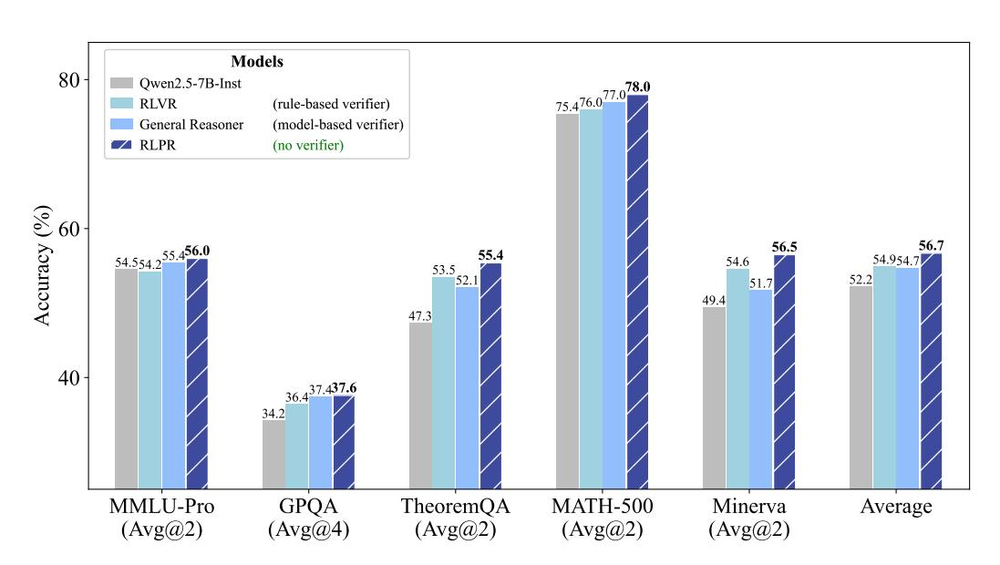
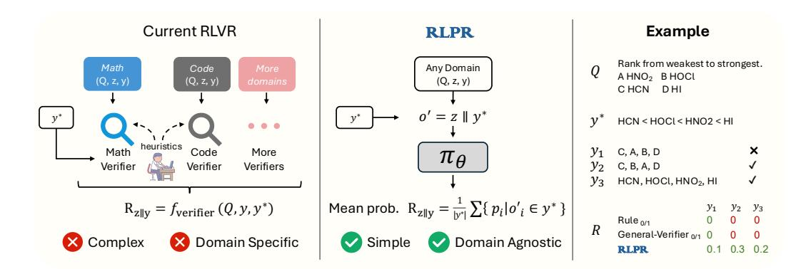
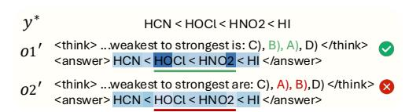
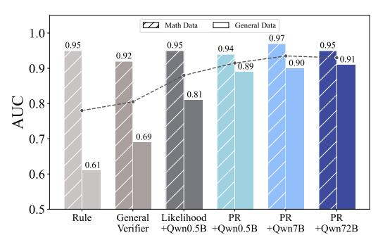
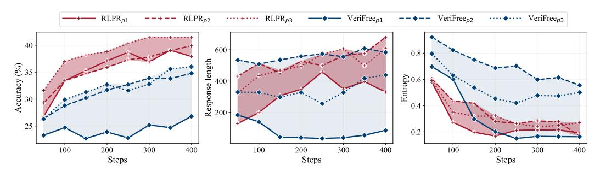
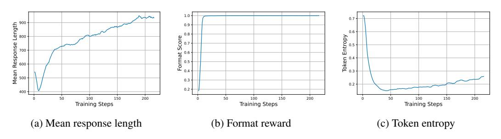
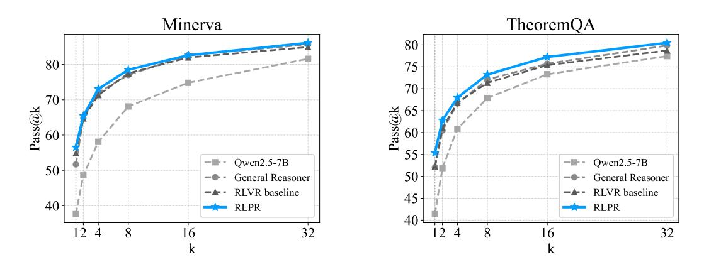

# RLPR: EXTRAPOLATING RLVR TO GENERAL DO-MAINS WITHOUT VERIFIERS

Tianyu Yu $^{1\dagger*}$ Bo Ji $^{2\dagger}$ Shouli Wang $^{4\dagger}$ Shu Yao $^{5\dagger}$ Zefan Wang $^{1\dagger}$ Ganqu Cui $^1$ Lifan Yuan $^6$ Ning Ding $^1$ Yuan Yao $^{2,3\ddagger}$ Zhiyuan Liu $^{1\ddagger}$ Maosong Sun $^1$ Tat-Seng Chua $^2$ 

yiranytianyu@gmail.com yaoyuanthu@gmail.com

RLPR Code

RLPR Dataset

RLPR Models

<span id="page-0-0"></span>

Figure 1: Overall performance on general-domain and mathematical reasoning benchmarks. By simply replacing the rule-based verifier reward of RLVR with the proposed LLM's intrinsic probability reward, **RLPR** achieves consistent improvements in both mathematical and general domains, even outperforming strong RL methods driven by model-based verifier reward. Average: average accuracy of five benchmarks. Verifier requirements of different methods are listed in parentheses.

### **ABSTRACT**

Reinforcement Learning with Verifiable Rewards (RLVR) demonstrates promising potential in advancing the reasoning capabilities of LLMs. However, its success remains largely confined to mathematical and code domains. This primary limitation stems from the heavy reliance on domain-specific verifiers, which results in prohibitive complexity and limited scalability. To address the challenge, our key observation is that LLM's intrinsic probability of generating a correct free-form answer directly indicates its own evaluation of the reasoning reward (i.e., how well the reasoning process leads to the correct answer). Building on this insight, we propose **RLPR**, a simple verifier-free framework that extrapolates RLVR to broader general domains. **RLPR** uses the LLM's own token probability scores for reference answers as the reward signal and maximizes the expected

<sup>&</sup>lt;sup>1</sup>Tsinghua University <sup>2</sup>National University of Singapore <sup>3</sup>Shanghai Qi Zhi Institute

<sup>&</sup>lt;sup>4</sup>Harbin Institute of Technology <sup>5</sup>Beijing University of Posts and Telecommunications

<sup>&</sup>lt;sup>6</sup>University of Illinois Urbana-Champaign

<sup>\*</sup>Project Lead.

<sup>&</sup>lt;sup>†</sup>Core Contributors.

<sup>&</sup>lt;sup>‡</sup>Corresponding authors.

reward during training. We find that addressing the high variance of this noisy probability reward is crucial to make it work, and propose prob-to-reward and stabilizing methods to ensure a precise and stable reward from LLM intrinsic probabilities. Comprehensive experiments in four general-domain benchmarks and three mathematical benchmarks show that RLPR consistently improves reasoning capabilities in both areas for Gemma, Llama, and Qwen based models. Notably, RLPR outperforms concurrent VeriFree by 7.6 points on TheoremQA and 7.5 points on Minerva, and even surpasses strong verifier-model-dependent approaches General-Reasoner by 1.6 average points across seven benchmarks.

# 1 INTRODUCTION

Large-scale Reinforcement Learning with Verifiable Rewards (RLVR) has emerged as a promising paradigm to advance the reasoning capabilities of Large Language Models (LLMs) [\(Jaech et al.,](#page-12-0) [2024;](#page-12-0) [DeepSeek-AI et al., 2025;](#page-10-0) [Hu et al., 2025b;](#page-12-1) [Luo et al., 2025a\)](#page-13-0). This paradigm not only shows the power of scaling test-time computation for addressing complex problems, but also sheds valuable light on paths to AGI with incentivized exploration and evolution.

However, in contrast to the pretraining of LLMs that can learn foundational capabilities from general domain data, most RLVR methods are confined to mathematics [\(Hu et al., 2025b;](#page-12-1) [Liu et al., 2025b;](#page-13-1) [Zeng et al., 2025;](#page-15-0) [Yu et al., 2025\)](#page-15-1) and code generation [\(Luo et al., 2025a;](#page-13-0) [He et al., 2025;](#page-12-2) [Cui et al.,](#page-10-1) [2025a\)](#page-10-1). The primary reason is that existing RLVR methods heavily rely on domain-specific verifiers to obtain reward, as shown in Figure [2.](#page-2-0) The most widely adopted verifiers are handcrafted rules [\(Hu](#page-12-1) [et al., 2025b;](#page-12-1) [Liu et al., 2025b;](#page-13-1) [Zeng et al., 2025\)](#page-15-0). Extending these rule-based reward systems to new models and domains typically requires prohibitive heuristic engineering. Moreover, for generaldomain reasoning with free-form answers, it is even impossible to devise rule-based verifiers due to the high diversity and complexity of natural language. Recent works attempt to address this problem by training specialized LLMs as verifier models [\(Ma et al., 2025\)](#page-13-2). However, training LLMs for general reward evaluation requires non-trivial and extensive data annotation, which often leads to unsatisfactory reward quality in practice. Involving separate verifier models also complicates the RL training framework and introduces additional computation cost. As a result, this scalability problem prevents existing RLVR methods from utilizing rich general-domain data and limits the potential of broader reasoning capabilities.

To address the problem, we propose the RLPR framework (Reinforcement Learning with Reference Probability Reward) that extrapolates general-domain RLVR without external verifiers. *The basic insight is that LLM's intrinsic probability of generating a correct answer directly indicates its own evaluation of the reasoning reward* (i.e., how well the reasoning process leads to the correct answer). It also reflects the policy by measuring how likely the LLM is to take the correct action. Therefore, we can directly leverage this probability signal as a reward to incentivize reasoning for the correct answer in general domains. Since this probability score is a natural built-in of LLM's foundational capabilities, it offers good coverage and potential for reward evaluation even without any specialized fine-tuning. It can also better deal with the complexity and diversity of free-form natural language answers, giving reasonable reward even to partially correct answers.

Specifically, RLPR introduces two key innovations: (1) At the reward modeling level, we propose a simple and scalable alternative to the explicit reward from external verifiers with an intrinsic Probability-based Reward (PR), calculated by the average decoding probabilities of the reference answer tokens. Compared with naive sequence likelihood as reward [\(Zhou et al., 2025\)](#page-15-2), the proposed PR shows better robustness and higher reward quality on quantitative examinations (see Figure [4\)](#page-6-0). Moreover, we propose a simple debiasing method to eliminate the reward bias from text by optimizing the reward advantage over the same prompt without reasoning. (2) At the training level, we propose an adaptive curriculum learning mechanism to stabilize training. We adaptively remove prompts yielding low reward standard deviation (indicating prompts that are too easy or too complex), using a dynamic threshold based on the exponential moving average of past rewards' standard deviation. We find that this approach can well keep up with the reward distribution shifts during training, and improves both the training stability and final performance.

Comprehensive experiments on seven benchmarks show that, without any external verifiers, RLPR substantially enhances reasoning capabilities in both mathematical and general domains.

<span id="page-2-0"></span>

Figure 2: Existing RLVR methods rely on specialized verifiers for each domain, suffering from high complexity and limited scalability. We propose the **RLPR** framework, which replaces the complex verifier-based reward with a simple probability-based reward generated by the policy model  $\pi_{\theta}$ . Q: input question, z: generated reasoning content before final answer, y: generated final answer,  $y^*$ : reference answer. As shown in the example on the right side, rules and verifier models wrongly label both  $y_2$  and  $y_3$  as incorrect due to their limited capability of handling natural language complexity.

Leveraging Qwen2.5-7B (Team, 2024) as base model, **RLPR** achieves 56.0 on MMLU-Pro and 55.4 on TheoremQA, even surpassing the strong General Reasoner-7B (Ma et al., 2025) that utilizes a specially trained 1.5B verifier model. Furthermore, compared with VeriFree (Zhou et al., 2025), a concurrent verifier-free approach, **RLPR** achieves significant improvement of 7.6 on TheoremQA and 7.5 on Minerva. We also evaluate **RLPR** on models from Llama3.1 Grattafiori et al. (2024) and Gemma2 Team et al. (2024), achieving improvements of 6.4 and 6.1 average points across seven benchmarks respectively.

The contribution of this work can be summarized as fourfold: (1) We present **RLPR**, a simple and scalable framework that extends RLVR to general domains without using external verifiers. (2) We propose a novel probability reward that eliminates the need for external verifiers and achieves better reward quality than naive likelihood as a reward. (3) We introduce a novel standard deviation filtering strategy that effectively stabilizes training by removing samples with low reward standard deviation. (4) We conduct comprehensive experiments to demonstrate the effectiveness of the proposed framework on various base models from Qwen, Llama and Gemma. All the codes, data, and model weights are released to facilitate future research.

### 2 RLPR

In this section, we first introduce the fundamentals of RLVR and describe the procedure to calculate the probability reward for **RLPR**. Then we introduce the debiasing method and the standard deviation filtering approach.

# 2.1 REINFORCEMENT LEARNING FROM VERIFIABLE REWARDS

Reinforcement learning from verifiable reward (RLVR) is a general post-training paradigm in which a rule-based verifier assigns a scalar reward score to each generated response. Specifically, given a prompt x, the policy  $\pi_{\theta}$  produces reasoning content z and the final answer y. Then the expected verifier score is optimized:

$$\mathcal{J}(\theta) = \mathbb{E}_{z, y \sim \pi_{\theta}(\cdot|x)} \left[ f_{\text{verifier}}(y, y^*) \right], \tag{1}$$

where  $f_{\text{verifier}}$  is a task-specific, rule-based verifier checking whether the generated answer y passes the test defined by ground truth  $y^*$ . Common instantiations include symbolic verifiers (Hynek & Greg, 2025) for mathematical problems or sandboxed execution (Bytedance-Seed-Foundation-Code-Team et al., 2025) for code generation. However, building rule-based verifiers is a laborious, systematic effort that involves designing handcrafted rules and edge case handling. This restricts the application of RLVR to new domains.

### 2.2 PROBABILITY REWARD

Motivated by the observation that the LLM's intrinsic probability of generating a correct answer directly indicates its internal evaluation of the reasoning quality, we use per-token decoding probabilities of the reference answer as the reward signal. Unlike existing methods that rely on domain-specific verifiers (Cui et al., 2025a; Luo et al., 2025a), which require substantial manual heuristics and engineering effort for the construction of verifiers, our reward computation process involves only the model itself. An overview of the process is illustrated in Figure 2.

We denote each response to question Q with  $o=(o_0,\cdots,o_N)$ , where  $o_i$  is an individual token in the response. To obtain probabilities, we first extract the generated answer y from the full response sequence and denote the remaining content as reasoning z. We then construct a modified sequence  $o'=(o'_0,\cdots,o'_{N'})$  by replacing the generated answer with the reference from the training data. This sequence is fed to the policy model to get probabilities  $(p_0,\cdots,p_{N'})$ . The probability reward is computed as:

<span id="page-3-0"></span>
$$r = f_{\text{seq}}(\{p_i | o_i' \in y^*\}),$$
 (2)

where  $f_{\rm seq}$  aggregates per-token probabilities into a single reward scalar for the response o. While using  $f_{\rm seq} = \sqrt[n]{\prod}$  (the normalized product of probabilities, i.e., sequence likelihood) reflects the overall likelihood of the reference answer, we observe that it introduces high variance and is overly sensitive to minor variations, such as synonyms. For instance, the token probability sequences (0.01, 0.7, 0.9) and (0.05, 0.7, 0.9) yield vastly different scores under the product, despite only a small difference on the first token. To address this issue, we instead adopt  $f_{\rm seq} = \frac{1}{\mid y^* \mid} \sum$  (mean probabilities), which yields a more robust reward signal and demonstrates superior correlation with answer quality in our analyses (see Fig 4). We observe that probability reward values are highly consistent with the quality of generated answer y, where high rewards are gained when the predicted answer is semantically similar to the reference answer and low rewards are assigned otherwise. Note that the length-normalization step is redundant for GRPO (Shao et al., 2024) but could be crucial for algorithms like REINFORCE++ (Hu et al., 2025a) which do not include group-normalization.

### 2.3 REWARD DEBIASING

Although the probability-based rewards correlate strongly with response quality, they are also influenced by various latent factors. We denote the contributors to the probability reward r as  $U_r$ , which can be essentially decomposed into two latent factors:

$$U_r = U_z + U_{\text{others}},\tag{3}$$

where  $U_z$  represents the effects of the reasoning content, and  $U_{\rm others}$  captures the characteristics of other related factors, including the question and reference answer. Using r directly as a reward introduces bias associated with the unobserved factor  $U_{\rm other}$ , potentially degrading the reward quality. To mitigate this, we introduce a base score r' by computing the probability score of directly decoding the reference answer  $y^*$ , without intermediate reasoning z, using Eq 2. This gives  $U_z = U_r - U_{r'}$ , and the debiased probability reward is then calculated as with:

$$\hat{r} = \text{clip}(0, 1, r - r'),\tag{4}$$

where the clipping operation ensures that the reward remains within a favorable numeric range [0,1]. This formulation effectively removes the potential bias from  $U_Q$  and  $U_{y^*}$  and models PR as the improvement in probability given the generated reasoning z. We observe this debiasing step stabilizes training and enhances reward robustness. The final gradient estimator of our objective function is:

$$\nabla \mathcal{J}_{RLPR}(\theta) = \nabla \mathbb{E}_{o \sim \pi_{\theta}(\cdot | x)} \left[ \hat{r} \right]$$

$$= \sum_{o} \hat{r} \, \pi_{\theta}(o | x) \nabla \log \pi_{\theta}(o | x)$$

$$= \mathbb{E}_{o \sim \pi_{\theta}(\cdot | x)} \left[ \hat{r} \nabla \log \pi_{\theta}(o | x) \right], \tag{5}$$

where we optimize the expected reward on the whole response o = z||y|.

# 2.4 STANDARD DEVIATION FILTERING

Existing RLVR methods employ accuracy filtering [\(Cui et al., 2025a\)](#page-10-1) to stabilize training by excluding too difficult and too easy prompts. Typically, this involves filtering entirely correct or incorrect prompts. However, the continuous nature of PR makes it challenging to directly apply accuracy filtering since it is hard to set a universal threshold for response correctness.

Through the analysis of accuracy filtering, we observe that filtering prompts with low standard deviation in reward values can effectively achieve a similar effect. Specifically, prompts that consistently yield all high or all low scores exhibit low standard deviation due to the boundedness of PR (i.e., all reward values lie within [0, 1]). Meanwhile, the overall standard deviation distribution continuously shifts during training, and a fixed threshold may cause either too strict or loose filtering at different training stages. To address this, we adopt an exponential moving average to dynamically update the filtering threshold β using the average standard deviation of each training step. By filtering the prompts whose reward standard deviation is less than β, we introduce an adaptive curriculum learning mechanism to improve both the training stability and final performance.

# 3 EXPERIMENTS

In this section, we empirically investigate the effectiveness of RLPR in enhancing LLM reasoning capabilities. In addition to evaluating model performance, we also analyze reward quality of our proposed PR, the efficacy of different components, and the potential of applying RLPR to verifiable domains such as mathematics.

# <span id="page-4-0"></span>3.1 EXPERIMENTAL SETUP

Models. We conduct experiments on Gemma2 [Team et al.](#page-14-1) [\(2024\)](#page-14-1), Llama3.1 [Grattafiori et al.](#page-10-2) [\(2024\)](#page-10-2) and Qwen2.5 [\(Team, 2024\)](#page-14-0) series models for fair comparison with most existing methods and thorough evaluation. Unless otherwise specified, experiments are conducted on Qwen2.5-7B-Base.

Training Data. We adopt the collection of prompts released by [\(Ma et al., 2025\)](#page-13-2), which includes high-quality reasoning questions across multiple complex domains. To focus on the effectiveness of RLPR in general domains, we only use non-mathematics prompts from the data. We ask GPT-4.1 [\(OpenAI, 2025\)](#page-13-3) to filter out prompts that are too easy and finally get 77k prompts for training.

Evaluation. We evaluate the reasoning capabilities with multiple general reasoning and mathematical benchmarks. For math reasoning, we include MATH-500 [\(Cobbe et al., 2021\)](#page-10-3), Minerva [\(Lewkowycz et al., 2022\)](#page-13-4), and AIME24. For general domains, we adopt four benchmarks:

- MMLU-Pro [\(Wang et al., 2024\)](#page-14-3) is a widely used multitask language understanding benchmark that includes challenging, reasoning-intensive questions across diverse domains. We randomly sample 1000 prompts from the benchmark to strike a balance between efficiency and variance.
- GPQA [\(Rein et al., 2023\)](#page-13-5) includes graduate-level questions from multiple disciplines, including physics, chemistry, etc. We use the highest-quality GPQA-diamond subset for evaluation.
- TheoremQA [\(Chen et al., 2023\)](#page-9-1) assesses a model's ability to apply theorems to solve complex science problems. This benchmark includes 800 high-quality questions covering 350 theorems from domains including Math, Physics, etc. We remove the 53 multimodal instructions.
- WebInstruct. We hold out a validation split from WebInstruct [\(Ma et al., 2025\)](#page-13-2) as a more accessible benchmark for medium-sized models. Unlike the aforementioned benchmarks, this benchmark is designed to be less challenging while still assessing multidisciplinary reasoning. We uniformly sample 1k prompts from the training set and remove potential data contamination by applying 10-gram deduplication, resulting in 638 distinct questions.

Baselines. We compare our approach with the following established and contemporaneous methods: (1) Base models and Instruct models. We include the Qwen2.5 [\(Team, 2024\)](#page-14-0) model family for comparison, reporting results for both Qwen2.5-7B and Qwen2.5-7B-Instruct. We also compare with Gemma2-2B-it and Llama3.1-8B-Inst. (2) PRIME [\(Cui et al., 2025a\)](#page-10-1) enhances the mathematical and code reasoning capabilities using implicit rewards. (3) SimpleRL-Zoo [\(Zeng et al., 2025\)](#page-15-0) trains the model using rule-based rewards. We report both results of the Qwen2.5-Math and Qwen2.5-7B

<span id="page-5-0"></span>

| Model            | Base | Verifier | MMLU-Pro<br>Avg@2 | GPQA<br>Avg@4 | TheoremQA<br>Avg@2 | WebInst.<br>Avg@2 | MATH-500<br>Avg@2 | Minerva<br>Avg@2 | AIME 24<br>Avg@16 | General | All  |
|------------------|------|----------|-------------------|---------------|--------------------|-------------------|-------------------|------------------|-------------------|---------|------|
| Gemma Models     |      |          |                   |               |                    |                   |                   |                  |                   |         |      |
| Gemma2-2B-it     | Base | _        | 27.9              | 19.3          | 16.4               | 33.5              | 26.6              | 15.9             | 0.0               | 24.3    | 19.9 |
| RLVR             | Inst | Rule     | 31.6              | 25.8          | 20.1               | 52.3              | 30.7              | 16.5             | 0.2               | 32.4    | 25.3 |
| RLPR             | Inst | X        | 33.5              | 28.5          | 21.2               | 52.0              | 30.4              | 17.1             | 0.2               | 33.8    | 26.0 |
| Llama Models     |      |          |                   |               |                    |                   |                   |                  |                   |         |      |
| Llama3.1-8B-Inst | Base | _        | 46.4              | 31.6          | 31.3               | 54.7              | 50.1              | 32.7             | 4.2               | 40.5    | 35.6 |
| RLVR             | Inst | Rule     | 49.3              | 36.0          | 32.0               | 60.2              | 51.9              | 35.2             | 4.6               | 44.4    | 38.5 |
| RLPR             | Inst | X        | 53.6              | 36.5          | 35.5               | 68.5              | 54.1              | 39.0             | 8.8               | 48.5    | 42.3 |
| Qwen Models      |      |          |                   |               |                    |                   |                   |                  |                   |         |      |
| Qwen2.5-7B       | _    | _        | 45.3              | 32.4          | 41.4               | 60.4              | 63.0              | 37.6             | 6.5               | 44.9    | 40.9 |
| Qwen2.5-7B-Inst  | Base | _        | 54.5              | 34.2          | 47.3               | 72.6              | 75.4              | 49.4             | 9.4               | 52.2    | 49.0 |
| Oat-Zero         | Math | Rule     | 45.8              | 38.8          | 53.3               | 71.5              | 80.8              | 52.1             | 29.8              | 52.4    | 53.2 |
| PRIME            | Math | Rule     | 39.5              | 32.1          | 47.7               | 54.5              | 76.4              | 45.5             | 20.4              | 43.4    | 45.2 |
| SimpleRL-Zoo     | Math | Rule     | 46.9              | 38.4          | 51.1               | 70.3              | 77.1              | 51.0             | 26.5              | 51.7    | 51.6 |
| TTRL             | Base | Rule     | 51.1              | 34.1          | 48.8               | 68.0              | 82.1              | 52.8             | 15.8              | 50.5    | 50.4 |
| SimpleRL-Zoo     | Base | Rule     | 54.1              | 36.2          | 49.5               | 70.7              | 76.3              | 49.2             | 14.8              | 52.6    | 50.1 |
| RLVR             | Base | Rule     | 55.1              | 36.2          | 52.2               | 75.3              | 76.5              | 54.9             | 17.7              | 54.7    | 52.6 |
| General Reasoner | Base | Model    | 55.4              | 37.4          | 52.1               | 74.5              | 77.0              | 51.7             | 16.0              | 54.8    | 52.0 |
| VeriFree         | Base | X        | 53.8              | 36.7          | 47.6               | 72.5              | 73.5              | 49.0             | 12.5              | 52.6    | 49.4 |
| RLPR             | Base | X        | 56.0              | 37.6          | 55.4               | 75.5              | 78.0              | 56.5             | 16.3              | 56.1    | 53.6 |

Table 1: Overall performance on seven reasoning benchmarks. WebInst.: held-out evaluation set from WebInstruct. General: Average of MMLU-Pro, GPQA, TheoremQA and WebInst.

as the base model. (4) Oat-Zero (Liu et al., 2025b) proposes to remove the standard deviation and token-level normalization in GRPO. (5) TTRL (Zuo et al., 2025) eliminates the reliance on labeled reference answers and instead uses majority voting to assign pseudo-labels to sampled responses. We report the result of the model trained on MATH-500 (Zuo et al., 2025) prompts. (6) General Reasoner (Ma et al., 2025) conducts RLVR in multiple domains by introducing an additional verifier model, which is distilled from Gemini 2.0 (Google DeepMind, 2024) to verify general-domain responses. (7) VeriFree (Zhou et al., 2025) is a concurrent work that uses the likelihood of reference answers (for those shorter than 7-tokens) as the reward signal and incorporates an auxiliary finetuning loss. As results were only released for the Qwen3 (Team, 2025a) model series, we reproduce their method on Qwen2.5-7B using the official repository. For fair comparison, we evaluate both their provided prompt and our training prompt, finding that the original prompt yields better results. Therefore, we adopt this configuration for this baseline.

**Implementation Details.** We adopt the verl (Sheng et al., 2024) framework for efficient training. In each rollout step, we sample eight responses per prompt for a batch of 768 prompts using a temperature of 1, and subsequently perform 4 policy updates on the collected responses. The scale  $\beta$  used for filtering is set to 0.5. The clip threshold in PPO loss is set to (0.8, 1.27) to prevent entropy collapse (Yu et al., 2025; Cui et al., 2025b). During evaluation, we set the rollout temperature to 1. To reduce the evaluation variance, we evaluate the model on each benchmark multiple times and report the final Avg@k results. The max generation length for training and evaluation is 3072, with minimal truncation observed. For baseline evaluation, we adopt the default generation temperature from the original papers. For baseline evaluation, we follow the corresponding papers to select generation parameters and use our setup if the original paper uses greedy decoding. For reliable answer extraction, we adopt the "<think></think><answer></answer>" template of R1 (Liu et al., 2025b) during training and use the striped content inside answer tags as the generated answer. For experiments on Gemma and Llama, we change the training and evaluation temperature to 0.6 and remove the <think> part in templates to prevent generation degradation. We observe that rule-based scoring scripts introduce errors in benchmarks containing question formats beyond multiple-choice. To address this, we deploy a Qwen2.5-7B-Inst model server for evaluation, and additionally leverage GPT-4.1 for more complex benchmarks, such as TheoremOA and Minerva.

### 3.2 MAIN RESULTS

The main experimental results are reported in Table 1, from which we observe that: (1) **RLPR** significantly improves general-domain reasoning performance. Without any external verifier, our method

improves the average performance on four general-domain reasoning benchmarks by 24.9% on Qwen2.5-7B. (2) **RLPR** exceeds the RLVR baseline on Qwen, Llama and Gemma. Specifically, we achieve larger general reasoning performance improvement over RLVR for 1.4, 3.9 and 1.4 average points on Gemma, Llama and Qwen respectively. (3) **RLPR** enhances mathematical reasoning capability on par with frameworks dedicated to math reasoning. Though we removed the mathematical category from the original WebInstrut dataset during training, we find the performance on multiple mathematical benchmarks is significantly improved and the score on Minerva surpasses Oat-Zero and SimpleRL-Zoo. (4) **RLPR** exhibits even better performance compared with methods that require trained verifier models, surpassing General Reasoner, which uses a trained 1.5B-parameter verifier model to judge each sampled response, by 1.6 on average across all seven reasoning benchmarks. (5) **RLPR** achieves a significant performance advantage compared with concurrent verifier-free methods, with improvement of 7.6 points on TheoremQA and 7.5 points on Minerva over VeriFree (Zhou et al., 2025).

#### 3.3 PROBABILITY-BASED REWARD ANALYSIS

We first illustrate a token-level probability example in Figure 3, where response sequence o2 receives a substantially lower score on the "HO" token, precisely reflecting the error made by response sequence o2 (i.e., placing option A before option B). For quantitative analysis of the Probability-based Reward (PR) quality, we sample eight responses for each prompt from the WebInstruct (Ma et al., 2025) and DeepScale (Luo et al., 2025b) datasets. To ensure a fair evaluation, we use the publicly released model from (Hu et al., 2025b). Human annotators then evaluate the correctness of each response. To maintain robustness and control labeling costs, we randomly keep 50 prompts from each dataset that contain both correct and incorrect responses.

PR discriminates correct responses better than the rule-based verifier on general data. To evaluate the ability of different reward to distinguish between correct and incorrect responses (i.e., assign higher rewards to correct responses), we rank responses for each prompt according to the respective rewards and compute the ROC-AUC (Bradley, 1997) metric using human annotations as ground truth. Higher AUC values indicate stronger discrimination capability. As shown in Figure 4, while the rule-based verifier achieves reasonable performance on mathematical prompts, it struggles on

<span id="page-6-1"></span>

Figure 3: Token-level probability visualization, where deeper colors represent higher values. The underlined part highlights that probabilities precisely reflect that response sequence o2 incorrectly place option B after A, resulting lower scores at the corresponding positions in the reference answer. The question is shown in Figure 2.

general-domain prompts, achieving an AUC of only 0.61. The primary flaw of the rule-based verifier in general domains is that it overlooks correct responses due to its limited capability of processing natural language complexity. We show an example in Figure 2 to illustrate the phenomenon. In contrast, PR consistently delivers high-quality rewards across both mathematical and general domains.

PR outperforms verifier models across both mathematical and general domains. While the General-Verifier achieves improvement over rule-based reward on general data  $(0.61 \rightarrow 0.69)$ , its performance declines on mathematical prompts  $(0.95 \rightarrow 0.92)$  as shown in Figure 4. We attribute this limitation to the finetuning-based paradigm, which requires extensive task-specific data and struggles to generalize across domains. In contrast, our proposed PR achieves improvements of at least 2% on mathematical data and 20% on generaldomain data compared with the verifier model. Upon analyzing the General-Verifier's judgments, we find that its main errors stem from limited comprehension of complex responses and challenges in output parsing. By leverag-

<span id="page-6-0"></span>

Figure 4: Reward quality comparison. We report the AUC on both math data and general data, and highlight the average score with the dashed line. Qwn: Qwen2.5 models.

ing the intrinsic capabilities of LLMs, PR directly produces high-quality reward scores in a single forward pass, also eliminating the need for any text post-processing.

PR is effective with even small-scale models. We compare the quality of PR using models of varying sizes. As shown in Figure 4, even the smallest Qwen2.5-0.5B outperforms the specifically trained General-Verifier on both mathematical and general data. While increasing the model size further improves the performance on general-domain data, gains on mathematical data are marginal due to the already high absolute scores.

PR is robust over entropy and length distribution. We also analyze the robustness of PR by analyzing the correlation between PR values and factors, including length and decoding entropy of generated responses. For each prompt, we calculate the Spearman correlation coefficient and p-value. We observe that only 8% prompts get a pvalue smaller than 0.05, and the average coefficient is -0.060 for length and 0.059 for entropy. These results ining data and reward mechanisms.

<span id="page-7-0"></span>

| Data        | Verifier | TheoremQA<br>Avg@2  | Minerva<br>Avg@2    |  |
|-------------|----------|---------------------|---------------------|--|
| DAPO        | Rule     | 50.3                | 50.6                |  |
| WebInstruct | Rule     | 52.2<br><b>55.4</b> | 54.9<br><b>56.5</b> |  |

Table 2: Effect of different RLVR train-

dicate that the probability reward values show negligible correlation with both entropy and length. This indicates that our proposed reward serves as a robust reward mechanism.

PR is essential for utilizing general-domain data. We compare the performance of models trained exclusively on mathematical prompts Yu et al. (2025) versus those trained on general-domain prompts, as shown in Table 2. The results demonstrate that general-domain data enhances the performance on both benchmarks (+1.9 on TheoremQA, +4.3 on Minerva). However, general-domain data also includes additional challenges for rule-based verifiers. Consequently, directly adopting existing rule-based verifiers gives obvious diminished performance.

#### 3.4 ABLATION STUDY

To investigate the contribution of different design choices in **RLPR**, we perform an ablation study.

Effect of per-token probability as reward. We compare our per-token probability-based reward with naive sequence likelihood as the reward signal. In the calculation of likelihood, low-probability tokens can dramatically affect the final reward. For instance, probabilities of  $1e^{-4}$  versus  $1e^{-5}$  can lead to a tenfold difference in reward, despite their small absolute difference. This issue becomes more pronounced for longer reference answers, which are more likely to contain at least one lowprobability token. (Zhou et al., 2025) addresses this instability by filtering out prompts whose reference answers exceed seven tokens. However, this also significantly limits the data diversity. In contrast, using the mean per-token probability is much more robust and yields better performance, as shown in Table 3. We also compare the reward quality of the likelihood reward and our proposed PR in Figure 4, where PR consistently achieves better results on both domains.

Effect of reward debiasing and standard deviation filtering. We compare our final debiased reward  $\hat{r}$  with directly using the reward in Eq 2. Results in Table 3 shows that the performance on both benchmarks is worse with original reward, demonstrating the effectiveness of the debiasing operation. To quantify the effectiveness of the standard deviation filtering approach, we also train a model without any filtering mechanism. The results in Table 3 show that the filtering strategy is important for the final performance of models by removing prompts that do not get diverse responses.

| Method            | TheoremQA            | Minerva   |
|-------------------|----------------------|-----------|
| RLPR              | 55.4                 | 56.5      |
| w/o debiasing     | 52.7- <del>2.7</del> | 54.1-2.4  |
| w/o std-filtering | 52.5- <del>2.9</del> | 55.1-1.4  |
| w/o token prob.   | 33.5-21.9            | 34.2-22.3 |

<span id="page-7-1"></span>Table 3: Ablation experimental results. Token prob.: token probability average. Avg@2 results are reported.

| Reward          | TheoremQA | Minerva |
|-----------------|-----------|---------|
| Rule-based      | 44.8      | 50.0    |
| Rule-based + PR | 48.8      | 49.0    |

<span id="page-7-2"></span>Table 4: Experimental results of different rewards on mathematical data. Avg@2 results are reported. We combine rule-based reward and PR by summarizing advantages.

<span id="page-8-0"></span>

Figure 5: Robustness across different training prompt templates. **RLPR** yields consistently higher performance compared with VeriFree. Left: average performance on seven benchmarks. Middle: response length. Right: response entropy during training.

### 3.5 **RLPR** ON VERIFIABLE DOMAINS

We study the effectiveness of **RLPR** on domains where verifiers are already available. In this section, we use the mathematical training data of PRIME (Cui et al., 2025b) as a representative mathematical RLVR dataset. Though rule-verifiers already give a reliable correctness label on mathematical data, we observe that such a binary correctness label lacks fine-grained discrimination capability on different responses sharing the same correctness. For example, given reference answer "200" for a question, "199" is generally better than "1". We argue that such fine-grained discrimination can be helpful for the model to get a more comprehensive understanding of the qualities of sampled responses and thus improve its performance. We combine the rule-based verifier scores and our proposed PR to train the model and report results in Table 4. Results show that our proposed probability reward can also improve the utilization of data from verifiable domains like mathematics.

### 3.6 ROBUSTNESS ANALYSIS

Compared with rule-based rewards, the distribution of our proposed probability-based reward (PR) may be influenced by variations in training prompt templates. To evaluate the robustness of **RLPR** with different templates, we consider three prompt settings:  $p_1$  from VeriFree Zhou et al. (2025),  $p_2$  used in DeepSeek-R1 DeepSeek-AI et al. (2025) and  $p_3$  which moves the format requirement to user prompt. To reduce training costs, we switch the base model to Qwen2.5-3B, decrease the batch size to 128, and apply a single update per training step. For fair comparison, we adopt the origin dataset from VeriFree for this experiment. Figure 5 presents the comparison of performances, response length, and entropy across different training steps. We observe that **RLPR** maintains consistent performance regardless of prompt choice, while VeriFree exhibits high sensitivity, with a notable performance drop of by 8.0 at step-400 when using  $p_1$ . Furthermore, the response length of **RLPR** under all prompts converges to a similar level, and the entropy remains within a reasonable range with no signs of entropy collapse Cui et al. (2025b).

### 4 RELATED WORKS

Reinforcement Learning with Verifiable Rewards. Reinforcement learning from binary verifiable rewards (Cui et al., 2025a; Yu et al., 2025; Luo et al., 2025c; Team, 2025b; DeepSeek-AI et al., 2025) recently demonstrates strong reasoning capabilities on math and code tasks, and has emerged as a common practice. These practices utilize verifiers such as Math-Verify (Hynek & Greg, 2025), SandboxFusion (Bytedance-Seed-Foundation-Code-Team et al., 2025), and custom implemented ones (Cui et al., 2025a), which effectively judge the correctness of model rollouts and forgo the need for preference annotations. However, this paradigm is restricted to domains where robust verifiers are available. Moreover, existing implementations of verifiers show inconsistencies (He et al., 2025) since the complexity for rule-based verifiers to handle edge cases is nontrivial. In this work, we propose to extend RLVR practices to domains without robust verifiers.

Reasoning in General Domains Previous research explores reasoning in general domains, a vital part of which is how to obtain reliable reward signals. One line of work is generative reward models (Mahan et al., 2024), where another generative model judges the quality of rollouts. This concept has been extended to the implementation of verifiers based on a generative model (Ma et al., 2025; Liu et al., 2025a) and enhancements of the judge model itself as a reasoner (Chen et al., 2025). In

this work, we demonstrate that reinforcement learning for general-domain reasoning can rely on the decoding probability of the reference answer as a reward signal. Concurrent to our work, [\(Zhou](#page-15-2) [et al., 2025\)](#page-15-2) utilizes policy likelihood for reference answer as rewards, while limited to short answers less than 7 tokens and requires a auxiliary fine-tuning-based objective. Instead, we observe the robustness of per-token probability as a reward signal and extend RLVR to general domains without length constraints.

Self-Reward Optimization Unsupervised reinforcement learning on language models using the policy model itself as a reward has recently emerged as an embarrassingly effective approach [\(Zuo](#page-15-3) [et al., 2025;](#page-15-3) [Zhao et al., 2025\)](#page-15-4). The common idea behind the practice of self-reward is raising the probability of consistent answers [\(Zuo et al., 2025\)](#page-15-3), intuitively from the observation that concentrating on the majority brings free improvements [\(Wang et al., 2022\)](#page-14-7). Recent literature [\(Agarwal et al.,](#page-9-4) [2025\)](#page-9-4) shows that entropy minimization, which naively degrades generation diversity, is a sugar for reasoning tasks, though restricted to certain model families. However, such practice might be problematic for restricting exploration [\(Cui et al., 2025b;](#page-10-5) [Hochlehnert et al., 2025;](#page-12-5) [Yu et al., 2025\)](#page-15-1). In contrast to self-rewarding methods that remove diversity to exploit existing reasoning ability, our approach builds the reward based on the reference answer, yielding reasoning performance with healthy token entropy from the clip-high trick [\(Yu et al., 2025\)](#page-15-1).

# 5 CONCLUSION

RLVR shows the power of scaling test-time computation for addressing complex problems and sheds valuable light on paths to AGI. In this work, we present RLPR , a novel framework that extends this paradigm to broader general domains. Comprehensive experimental results on Gemma, Llama and Qwen show that our method achieves significant improvement on both general and mathematical reasoning tasks without using external verifiers. We propose a novel probability reward (PR) and reward debiasing strategy to enhance its quality further. By replacing rule-based reward with PR, we eliminate the need for external verifiers and achieve better performance than using naive likelihood as a reward or using verifier models. Moreover, we propose a simple standard deviation filtering strategy that stabilizes training by removing samples with low reward standard deviation. In the future, we will explore more domains, including multimodal understanding and scaling RLPR to larger models.

# REFERENCES

<span id="page-9-4"></span>Shivam Agarwal, Zimin Zhang, Lifan Yuan, Jiawei Han, and Hao Peng. The unreasonable effectiveness of entropy minimization in llm reasoning. *arXiv preprint arXiv:2505.15134*, 2025.

<span id="page-9-2"></span>Andrew P. Bradley. The use of the area under the roc curve in the evaluation of machine learning algorithms. *Pattern Recognition*, 30(7):1145–1159, 1997. ISSN 0031-3203. doi: 10.1016/S0031-3203(96)00142-2.

<span id="page-9-0"></span>Bytedance-Seed-Foundation-Code-Team, Yao Cheng, Jianfeng Chen, Jie Chen, Li Chen, Liyu Chen, Wentao Chen, Zhengyu Chen, Shijie Geng, Aoyan Li, Bo Li, Bowen Li, Linyi Li, Boyi Liu, Jiaheng Liu, Kaibo Liu, Qi Liu, Shukai Liu, Siyao Liu, Tianyi Liu, Tingkai Liu, Yongfei Liu, Rui Long, Jing Mai, Guanghan Ning, Z. Y. Peng, Kai Shen, Jiahao Su, Jing Su, Tao Sun, Yifan Sun, Yunzhe Tao, Guoyin Wang, Siwei Wang, Xuwu Wang, Yite Wang, Zihan Wang, Jinxiang Xia, Liang Xiang, Xia Xiao, Yongsheng Xiao, Chenguang Xi, Shulin Xin, Jingjing Xu, Shikun Xu, Hongxia Yang, Jack Yang, Yingxiang Yang, Jianbo Yuan, Jun Zhang, Yufeng Zhang, Yuyu Zhang, Shen Zheng, He Zhu, and Ming Zhu. Fullstack bench: Evaluating llms as full stack coders, 2025. URL <https://arxiv.org/abs/2412.00535>.

<span id="page-9-1"></span>Wenhu Chen, Ming Yin, Max Ku, Pan Lu, Yixin Wan, Xueguang Ma, Jianyu Xu, Xinyi Wang, and Tony Xia. Theoremqa: A theorem-driven question answering dataset, 2023. URL [https:](https://arxiv.org/abs/2305.12524) [//arxiv.org/abs/2305.12524](https://arxiv.org/abs/2305.12524).

<span id="page-9-3"></span>Xiusi Chen, Gaotang Li, Ziqi Wang, Bowen Jin, Cheng Qian, Yu Wang, Hongru Wang, Yu Zhang, Denghui Zhang, Tong Zhang, et al. Rm-r1: Reward modeling as reasoning. *arXiv preprint arXiv:2505.02387*, 2025.

<span id="page-10-3"></span>Karl Cobbe, Vineet Kosaraju, Mohammad Bavarian, Mark Chen, Heewoo Jun, Lukasz Kaiser, Matthias Plappert, Jerry Tworek, Jacob Hilton, Reiichiro Nakano, Christopher Hesse, and John Schulman. Training verifiers to solve math word problems, 2021. URL [https://arxiv.](https://arxiv.org/abs/2110.14168) [org/abs/2110.14168](https://arxiv.org/abs/2110.14168).

<span id="page-10-1"></span>Ganqu Cui, Lifan Yuan, Zefan Wang, Hanbin Wang, Wendi Li, Bingxiang He, Yuchen Fan, Tianyu Yu, Qixin Xu, Weize Chen, et al. Process reinforcement through implicit rewards. *arXiv preprint arXiv:2502.01456*, 2025a.

<span id="page-10-5"></span>Ganqu Cui, Yuchen Zhang, Jiacheng Chen, Lifan Yuan, Zhi Wang, Yuxin Zuo, Haozhan Li, Yuchen Fan, Huayu Chen, Weize Chen, et al. The entropy mechanism of reinforcement learning for reasoning language models. *arXiv preprint arXiv:2505.22617*, 2025b.

<span id="page-10-0"></span>DeepSeek-AI, Daya Guo, Dejian Yang, Haowei Zhang, Junxiao Song, Ruoyu Zhang, Runxin Xu, Qihao Zhu, Shirong Ma, Peiyi Wang, Xiao Bi, Xiaokang Zhang, Xingkai Yu, Yu Wu, Z. F. Wu, Zhibin Gou, Zhihong Shao, Zhuoshu Li, Ziyi Gao, Aixin Liu, Bing Xue, Bingxuan Wang, Bochao Wu, Bei Feng, Chengda Lu, Chenggang Zhao, Chengqi Deng, Chenyu Zhang, Chong Ruan, Damai Dai, Deli Chen, Dongjie Ji, Erhang Li, Fangyun Lin, Fucong Dai, Fuli Luo, Guangbo Hao, Guanting Chen, Guowei Li, H. Zhang, Han Bao, Hanwei Xu, Haocheng Wang, Honghui Ding, Huajian Xin, Huazuo Gao, Hui Qu, Hui Li, Jianzhong Guo, Jiashi Li, Jiawei Wang, Jingchang Chen, Jingyang Yuan, Junjie Qiu, Junlong Li, J. L. Cai, Jiaqi Ni, Jian Liang, Jin Chen, Kai Dong, Kai Hu, Kaige Gao, Kang Guan, Kexin Huang, Kuai Yu, Lean Wang, Lecong Zhang, Liang Zhao, Litong Wang, Liyue Zhang, Lei Xu, Leyi Xia, Mingchuan Zhang, Minghua Zhang, Minghui Tang, Meng Li, Miaojun Wang, Mingming Li, Ning Tian, Panpan Huang, Peng Zhang, Qiancheng Wang, Qinyu Chen, Qiushi Du, Ruiqi Ge, Ruisong Zhang, Ruizhe Pan, Runji Wang, R. J. Chen, R. L. Jin, Ruyi Chen, Shanghao Lu, Shangyan Zhou, Shanhuang Chen, Shengfeng Ye, Shiyu Wang, Shuiping Yu, Shunfeng Zhou, Shuting Pan, S. S. Li, Shuang Zhou, Shaoqing Wu, Shengfeng Ye, Tao Yun, Tian Pei, Tianyu Sun, T. Wang, Wangding Zeng, Wanjia Zhao, Wen Liu, Wenfeng Liang, Wenjun Gao, Wenqin Yu, Wentao Zhang, W. L. Xiao, Wei An, Xiaodong Liu, Xiaohan Wang, Xiaokang Chen, Xiaotao Nie, Xin Cheng, Xin Liu, Xin Xie, Xingchao Liu, Xinyu Yang, Xinyuan Li, Xuecheng Su, Xuheng Lin, X. Q. Li, Xiangyue Jin, Xiaojin Shen, Xiaosha Chen, Xiaowen Sun, Xiaoxiang Wang, Xinnan Song, Xinyi Zhou, Xianzu Wang, Xinxia Shan, Y. K. Li, Y. Q. Wang, Y. X. Wei, Yang Zhang, Yanhong Xu, Yao Li, Yao Zhao, Yaofeng Sun, Yaohui Wang, Yi Yu, Yichao Zhang, Yifan Shi, Yiliang Xiong, Ying He, Yishi Piao, Yisong Wang, Yixuan Tan, Yiyang Ma, Yiyuan Liu, Yongqiang Guo, Yuan Ou, Yuduan Wang, Yue Gong, Yuheng Zou, Yujia He, Yunfan Xiong, Yuxiang Luo, Yuxiang You, Yuxuan Liu, Yuyang Zhou, Y. X. Zhu, Yanhong Xu, Yanping Huang, Yaohui Li, Yi Zheng, Yuchen Zhu, Yunxian Ma, Ying Tang, Yukun Zha, Yuting Yan, Z. Z. Ren, Zehui Ren, Zhangli Sha, Zhe Fu, Zhean Xu, Zhenda Xie, Zhengyan Zhang, Zhewen Hao, Zhicheng Ma, Zhigang Yan, Zhiyu Wu, Zihui Gu, Zijia Zhu, Zijun Liu, Zilin Li, Ziwei Xie, Ziyang Song, Zizheng Pan, Zhen Huang, Zhipeng Xu, Zhongyu Zhang, and Zhen Zhang. Deepseek-r1: Incentivizing reasoning capability in llms via reinforcement learning, 2025. URL <https://arxiv.org/abs/2501.12948>.

<span id="page-10-4"></span>Google DeepMind. Gemini 2.0: Our latest, most capable ai model yet, December 2024. First Gemini 2.0 Flash announced December 11, 2024; multimodal support for text, image, audio, native tool use.

<span id="page-10-2"></span>Aaron Grattafiori, Abhimanyu Dubey, Abhinav Jauhri, Abhinav Pandey, Abhishek Kadian, Ahmad Al-Dahle, Aiesha Letman, Akhil Mathur, Alan Schelten, Alex Vaughan, Amy Yang, Angela Fan, Anirudh Goyal, Anthony Hartshorn, Aobo Yang, Archi Mitra, Archie Sravankumar, Artem Korenev, Arthur Hinsvark, Arun Rao, Aston Zhang, Aurelien Rodriguez, Austen Gregerson, Ava Spataru, Baptiste Roziere, Bethany Biron, Binh Tang, Bobbie Chern, Charlotte Caucheteux, Chaya Nayak, Chloe Bi, Chris Marra, Chris McConnell, Christian Keller, Christophe Touret, Chunyang Wu, Corinne Wong, Cristian Canton Ferrer, Cyrus Nikolaidis, Damien Allonsius, Daniel Song, Danielle Pintz, Danny Livshits, Danny Wyatt, David Esiobu, Dhruv Choudhary, Dhruv Mahajan, Diego Garcia-Olano, Diego Perino, Dieuwke Hupkes, Egor Lakomkin, Ehab AlBadawy, Elina Lobanova, Emily Dinan, Eric Michael Smith, Filip Radenovic, Francisco Guzman, Frank Zhang, Gabriel Synnaeve, Gabrielle Lee, Georgia Lewis Anderson, Govind That- ´ tai, Graeme Nail, Gregoire Mialon, Guan Pang, Guillem Cucurell, Hailey Nguyen, Hannah Korevaar, Hu Xu, Hugo Touvron, Iliyan Zarov, Imanol Arrieta Ibarra, Isabel Kloumann, Ishan Misra, Ivan Evtimov, Jack Zhang, Jade Copet, Jaewon Lee, Jan Geffert, Jana Vranes, Jason Park, Jay Mahadeokar, Jeet Shah, Jelmer van der Linde, Jennifer Billock, Jenny Hong, Jenya Lee, Jeremy Fu, Jianfeng Chi, Jianyu Huang, Jiawen Liu, Jie Wang, Jiecao Yu, Joanna Bitton, Joe Spisak, Jongsoo Park, Joseph Rocca, Joshua Johnstun, Joshua Saxe, Junteng Jia, Kalyan Vasuden Alwala, Karthik Prasad, Kartikeya Upasani, Kate Plawiak, Ke Li, Kenneth Heafield, Kevin Stone, Khalid El-Arini, Krithika Iyer, Kshitiz Malik, Kuenley Chiu, Kunal Bhalla, Kushal Lakhotia, Lauren Rantala-Yeary, Laurens van der Maaten, Lawrence Chen, Liang Tan, Liz Jenkins, Louis Martin, Lovish Madaan, Lubo Malo, Lukas Blecher, Lukas Landzaat, Luke de Oliveira, Madeline Muzzi, Mahesh Pasupuleti, Mannat Singh, Manohar Paluri, Marcin Kardas, Maria Tsimpoukelli, Mathew Oldham, Mathieu Rita, Maya Pavlova, Melanie Kambadur, Mike Lewis, Min Si, Mitesh Kumar Singh, Mona Hassan, Naman Goyal, Narjes Torabi, Nikolay Bashlykov, Nikolay Bogoychev, Niladri Chatterji, Ning Zhang, Olivier Duchenne, Onur C¸ elebi, Patrick Alrassy, Pengchuan Zhang, Pengwei Li, Petar Vasic, Peter Weng, Prajjwal Bhargava, Pratik Dubal, Praveen Krishnan, Punit Singh Koura, Puxin Xu, Qing He, Qingxiao Dong, Ragavan Srinivasan, Raj Ganapathy, Ramon Calderer, Ricardo Silveira Cabral, Robert Stojnic, Roberta Raileanu, Rohan Maheswari, Rohit Girdhar, Rohit Patel, Romain Sauvestre, Ronnie Polidoro, Roshan Sumbaly, Ross Taylor, Ruan Silva, Rui Hou, Rui Wang, Saghar Hosseini, Sahana Chennabasappa, Sanjay Singh, Sean Bell, Seohyun Sonia Kim, Sergey Edunov, Shaoliang Nie, Sharan Narang, Sharath Raparthy, Sheng Shen, Shengye Wan, Shruti Bhosale, Shun Zhang, Simon Vandenhende, Soumya Batra, Spencer Whitman, Sten Sootla, Stephane Collot, Suchin Gururangan, Sydney Borodinsky, Tamar Herman, Tara Fowler, Tarek Sheasha, Thomas Georgiou, Thomas Scialom, Tobias Speckbacher, Todor Mihaylov, Tong Xiao, Ujjwal Karn, Vedanuj Goswami, Vibhor Gupta, Vignesh Ramanathan, Viktor Kerkez, Vincent Gonguet, Virginie Do, Vish Vogeti, V´ıtor Albiero, Vladan Petrovic, Weiwei Chu, Wenhan Xiong, Wenyin Fu, Whitney Meers, Xavier Martinet, Xiaodong Wang, Xiaofang Wang, Xiaoqing Ellen Tan, Xide Xia, Xinfeng Xie, Xuchao Jia, Xuewei Wang, Yaelle Goldschlag, Yashesh Gaur, Yasmine Babaei, Yi Wen, Yiwen Song, Yuchen Zhang, Yue Li, Yuning Mao, Zacharie Delpierre Coudert, Zheng Yan, Zhengxing Chen, Zoe Papakipos, Aaditya Singh, Aayushi Srivastava, Abha Jain, Adam Kelsey, Adam Shajnfeld, Adithya Gangidi, Adolfo Victoria, Ahuva Goldstand, Ajay Menon, Ajay Sharma, Alex Boesenberg, Alexei Baevski, Allie Feinstein, Amanda Kallet, Amit Sangani, Amos Teo, Anam Yunus, Andrei Lupu, Andres Alvarado, Andrew Caples, Andrew Gu, Andrew Ho, Andrew Poulton, Andrew Ryan, Ankit Ramchandani, Annie Dong, Annie Franco, Anuj Goyal, Aparajita Saraf, Arkabandhu Chowdhury, Ashley Gabriel, Ashwin Bharambe, Assaf Eisenman, Azadeh Yazdan, Beau James, Ben Maurer, Benjamin Leonhardi, Bernie Huang, Beth Loyd, Beto De Paola, Bhargavi Paranjape, Bing Liu, Bo Wu, Boyu Ni, Braden Hancock, Bram Wasti, Brandon Spence, Brani Stojkovic, Brian Gamido, Britt Montalvo, Carl Parker, Carly Burton, Catalina Mejia, Ce Liu, Changhan Wang, Changkyu Kim, Chao Zhou, Chester Hu, Ching-Hsiang Chu, Chris Cai, Chris Tindal, Christoph Feichtenhofer, Cynthia Gao, Damon Civin, Dana Beaty, Daniel Kreymer, Daniel Li, David Adkins, David Xu, Davide Testuggine, Delia David, Devi Parikh, Diana Liskovich, Didem Foss, Dingkang Wang, Duc Le, Dustin Holland, Edward Dowling, Eissa Jamil, Elaine Montgomery, Eleonora Presani, Emily Hahn, Emily Wood, Eric-Tuan Le, Erik Brinkman, Esteban Arcaute, Evan Dunbar, Evan Smothers, Fei Sun, Felix Kreuk, Feng Tian, Filippos Kokkinos, Firat Ozgenel, Francesco Caggioni, Frank Kanayet, Frank Seide, Gabriela Medina Florez, Gabriella Schwarz, Gada Badeer, Georgia Swee, Gil Halpern, Grant Herman, Grigory Sizov, Guangyi, Zhang, Guna Lakshminarayanan, Hakan Inan, Hamid Shojanazeri, Han Zou, Hannah Wang, Hanwen Zha, Haroun Habeeb, Harrison Rudolph, Helen Suk, Henry Aspegren, Hunter Goldman, Hongyuan Zhan, Ibrahim Damlaj, Igor Molybog, Igor Tufanov, Ilias Leontiadis, Irina-Elena Veliche, Itai Gat, Jake Weissman, James Geboski, James Kohli, Janice Lam, Japhet Asher, Jean-Baptiste Gaya, Jeff Marcus, Jeff Tang, Jennifer Chan, Jenny Zhen, Jeremy Reizenstein, Jeremy Teboul, Jessica Zhong, Jian Jin, Jingyi Yang, Joe Cummings, Jon Carvill, Jon Shepard, Jonathan McPhie, Jonathan Torres, Josh Ginsburg, Junjie Wang, Kai Wu, Kam Hou U, Karan Saxena, Kartikay Khandelwal, Katayoun Zand, Kathy Matosich, Kaushik Veeraraghavan, Kelly Michelena, Keqian Li, Kiran Jagadeesh, Kun Huang, Kunal Chawla, Kyle Huang, Lailin Chen, Lakshya Garg, Lavender A, Leandro Silva, Lee Bell, Lei Zhang, Liangpeng Guo, Licheng Yu, Liron Moshkovich, Luca Wehrstedt, Madian Khabsa, Manav Avalani, Manish Bhatt, Martynas Mankus, Matan Hasson, Matthew Lennie, Matthias Reso, Maxim Groshev, Maxim Naumov, Maya Lathi, Meghan Keneally, Miao Liu, Michael L. Seltzer, Michal Valko, Michelle Restrepo, Mihir Patel, Mik Vyatskov, Mikayel Samvelyan, Mike Clark, Mike Macey, Mike Wang, Miquel Jubert Hermoso, Mo Metanat, Mohammad Rastegari, Munish Bansal, Nandhini Santhanam, Natascha Parks, Natasha White, Navyata Bawa, Nayan Singhal, Nick Egebo, Nicolas Usunier, Nikhil Mehta, Nikolay Pavlovich Laptev, Ning Dong, Norman Cheng, Oleg Chernoguz, Olivia Hart, Omkar Salpekar, Ozlem Kalinli, Parkin Kent, Parth Parekh, Paul Saab, Pavan Balaji, Pedro Rittner, Philip Bontrager, Pierre Roux, Piotr Dollar, Polina Zvyagina, Prashant Ratanchandani, Pritish Yuvraj, Qian Liang, Rachad Alao, Rachel Rodriguez, Rafi Ayub, Raghotham Murthy, Raghu Nayani, Rahul Mitra, Rangaprabhu Parthasarathy, Raymond Li, Rebekkah Hogan, Robin Battey, Rocky Wang, Russ Howes, Ruty Rinott, Sachin Mehta, Sachin Siby, Sai Jayesh Bondu, Samyak Datta, Sara Chugh, Sara Hunt, Sargun Dhillon, Sasha Sidorov, Satadru Pan, Saurabh Mahajan, Saurabh Verma, Seiji Yamamoto, Sharadh Ramaswamy, Shaun Lindsay, Shaun Lindsay, Sheng Feng, Shenghao Lin, Shengxin Cindy Zha, Shishir Patil, Shiva Shankar, Shuqiang Zhang, Shuqiang Zhang, Sinong Wang, Sneha Agarwal, Soji Sajuyigbe, Soumith Chintala, Stephanie Max, Stephen Chen, Steve Kehoe, Steve Satterfield, Sudarshan Govindaprasad, Sumit Gupta, Summer Deng, Sungmin Cho, Sunny Virk, Suraj Subramanian, Sy Choudhury, Sydney Goldman, Tal Remez, Tamar Glaser, Tamara Best, Thilo Koehler, Thomas Robinson, Tianhe Li, Tianjun Zhang, Tim Matthews, Timothy Chou, Tzook Shaked, Varun Vontimitta, Victoria Ajayi, Victoria Montanez, Vijai Mohan, Vinay Satish Kumar, Vishal Mangla, Vlad Ionescu, Vlad Poenaru, Vlad Tiberiu Mihailescu, Vladimir Ivanov, Wei Li, Wenchen Wang, Wenwen Jiang, Wes Bouaziz, Will Constable, Xiaocheng Tang, Xiaojian Wu, Xiaolan Wang, Xilun Wu, Xinbo Gao, Yaniv Kleinman, Yanjun Chen, Ye Hu, Ye Jia, Ye Qi, Yenda Li, Yilin Zhang, Ying Zhang, Yossi Adi, Youngjin Nam, Yu, Wang, Yu Zhao, Yuchen Hao, Yundi Qian, Yunlu Li, Yuzi He, Zach Rait, Zachary DeVito, Zef Rosnbrick, Zhaoduo Wen, Zhenyu Yang, Zhiwei Zhao, and Zhiyu Ma. The llama 3 herd of models, 2024. URL <https://arxiv.org/abs/2407.21783>.

<span id="page-12-2"></span>Jujie He, Jiacai Liu, Chris Yuhao Liu, Rui Yan, Chaojie Wang, Peng Cheng, Xiaoyu Zhang, Fuxiang Zhang, Jiacheng Xu, Wei Shen, Siyuan Li, Liang Zeng, Tianwen Wei, Cheng Cheng, Bo An, Yang Liu, and Yahui Zhou. Skywork open reasoner series, 2025. Notion Blog.

<span id="page-12-5"></span>Andreas Hochlehnert, Hardik Bhatnagar, Vishaal Udandarao, Samuel Albanie, Ameya Prabhu, and Matthias Bethge. A sober look at progress in language model reasoning: Pitfalls and paths to reproducibility. *arXiv preprint arXiv:2504.07086*, 2025.

<span id="page-12-4"></span>Jian Hu, Jason Klein Liu, and Wei Shen. Reinforce++: An efficient rlhf algorithm with robustness to both prompt and reward models, 2025a. URL <https://arxiv.org/abs/2501.03262>.

<span id="page-12-1"></span>Jingcheng Hu, Yinmin Zhang, Qi Han, Daxin Jiang, Xiangyu Zhang, and Heung-Yeung Shum. Open-reasoner-zero: An open source approach to scaling up reinforcement learning on the base model, 2025b. URL <https://arxiv.org/abs/2503.24290>.

<span id="page-12-3"></span>Kydl´ıcek Hynek and Gandenberger Greg. Math-verify, March 2025. ˇ

<span id="page-12-0"></span>Aaron Jaech, Adam Kalai, Adam Lerer, Adam Richardson, Ahmed El-Kishky, Aiden Low, Alec Helyar, Aleksander Madry, Alex Beutel, Alex Carney, Alex Iftimie, Alex Karpenko, Alex Tachard Passos, Alexander Neitz, Alexander Prokofiev, Alexander Wei, Allison Tam, Ally Bennett, Ananya Kumar, Andre Saraiva, Andrea Vallone, Andrew Duberstein, Andrew Kondrich, Andrey Mishchenko, Andy Applebaum, Angela Jiang, Ashvin Nair, Barret Zoph, Behrooz Ghorbani, Ben Rossen, Benjamin Sokolowsky, Boaz Barak, Bob McGrew, Borys Minaiev, Botao Hao, Bowen Baker, Brandon Houghton, Brandon McKinzie, Brydon Eastman, Camillo Lugaresi, Cary Bassin, Cary Hudson, Chak Ming Li, Charles de Bourcy, Chelsea Voss, Chen Shen, Chong Zhang, Chris Koch, Chris Orsinger, Christopher Hesse, Claudia Fischer, Clive Chan, Dan Roberts, Daniel Kappler, Daniel Levy, Daniel Selsam, David Dohan, David Farhi, David Mely, David Robinson, Dimitris Tsipras, Doug Li, Dragos Oprica, Eben Freeman, Eddie Zhang, Edmund Wong, Elizabeth Proehl, Enoch Cheung, Eric Mitchell, Eric Wallace, Erik Ritter, Evan Mays, Fan Wang, Felipe Petroski Such, Filippo Raso, Florencia Leoni, Foivos Tsimpourlas, Francis Song, Fred von Lohmann, Freddie Sulit, Geoff Salmon, Giambattista Parascandolo, Gildas Chabot, Grace Zhao, Greg Brockman, Guillaume Leclerc, Hadi Salman, Haiming Bao, Hao Sheng, Hart Andrin, Hessam Bagherinezhad, Hongyu Ren, Hunter Lightman, Hyung Won Chung, Ian Kivlichan, Ian O'Connell, Ian Osband, Ignasi Clavera Gilaberte, Ilge Akkaya, Ilya Kostrikov, Ilya Sutskever, Irina Kofman, Jakub Pachocki, James Lennon, Jason Wei, Jean Harb, Jerry Twore, Jiacheng Feng, Jiahui Yu, Jiayi Weng, Jie Tang, Jieqi Yu, Joaquin Quinonero Candela, Joe Palermo, Joel Parish, ˜ Johannes Heidecke, John Hallman, John Rizzo, Jonathan Gordon, Jonathan Uesato, Jonathan Ward, Joost Huizinga, Julie Wang, Kai Chen, Kai Xiao, Karan Singhal, Karina Nguyen, Karl Cobbe, Katy Shi, Kayla Wood, Kendra Rimbach, Keren Gu-Lemberg, Kevin Liu, Kevin Lu, Kevin Stone, Kevin Yu, Lama Ahmad, Lauren Yang, Leo Liu, Leon Maksin, Leyton Ho, Liam Fedus, Lilian Weng, Linden Li, Lindsay McCallum, Lindsey Held, Lorenz Kuhn, Lukas Kondraciuk, Lukasz Kaiser, Luke Metz, Madelaine Boyd, Maja Trebacz, Manas Joglekar, Mark Chen, Marko Tintor, Mason Meyer, Matt Jones, Matt Kaufer, Max Schwarzer, Meghan Shah, Mehmet Yatbaz, Melody Y. Guan, Mengyuan Xu, Mengyuan Yan, Mia Glaese, Mianna Chen, Michael Lampe, Michael Malek, Michele Wang, Michelle Fradin, Mike McClay, Mikhail Pavlov, Miles Wang, Mingxuan Wang, Mira Murati, Mo Bavarian, Mostafa Rohaninejad, Nat McAleese, Neil Chowdhury, Neil Chowdhury, Nick Ryder, Nikolas Tezak, Noam Brown, Ofir Nachum, Oleg Boiko, Oleg Murk, Olivia Watkins, Patrick Chao, Paul Ashbourne, Pavel Izmailov, Peter Zhokhov, Rachel Dias, Rahul Arora, Randall Lin, Rapha Gontijo Lopes, Raz Gaon, Reah Miyara, Reimar Leike, Renny Hwang, Rhythm Garg, Robin Brown, Roshan James, Rui Shu, Ryan Cheu, Ryan Greene, Saachi Jain, Sam Altman, Sam Toizer, Sam Toyer, Samuel Miserendino, Sandhini Agarwal, Santiago Hernandez, Sasha Baker, Scott McKinney, Scottie Yan, Shengjia Zhao, Shengli Hu, Shibani Santurkar, Shraman Ray Chaudhuri, Shuyuan Zhang, Siyuan Fu, Spencer Papay, Steph Lin, Suchir Balaji, Suvansh Sanjeev, Szymon Sidor, Tal Broda, Aidan Clark, Tao Wang, Taylor Gordon, Ted Sanders, Tejal Patwardhan, Thibault Sottiaux, Thomas Degry, Thomas Dimson, Tianhao Zheng, Timur Garipov, Tom Stasi, Trapit Bansal, Trevor Creech, Troy Peterson, Tyna Eloundou, Valerie Qi, Vineet Kosaraju, Vinnie Monaco, Vitchyr Pong, Vlad Fomenko, Weiyi Zheng, Wenda Zhou, Wes McCabe, Wojciech Zaremba, Yann Dubois, Yinghai Lu, Yining Chen, Young Cha, Yu Bai, Yuchen He, Yuchen Zhang, Yunyun Wang, Zheng Shao, and Zhuohan Li. Openai o1 system card, 2024. URL <https://arxiv.org/abs/2412.16720>.

- <span id="page-13-4"></span>Aitor Lewkowycz, Anders Andreassen, David Dohan, Ethan Dyer, Henryk Michalewski, Vinay Ramasesh, Ambrose Slone, Cem Anil, Imanol Schlag, Theo Gutman-Solo, Yuhuai Wu, Behnam Neyshabur, Guy Gur-Ari, and Vedant Misra. Solving quantitative reasoning problems with language models, 2022. URL <https://arxiv.org/abs/2206.14858>.
- <span id="page-13-9"></span>Qianchu Liu, Sheng Zhang, Guanghui Qin, Timothy Ossowski, Yu Gu, Ying Jin, Sid Kiblawi, Sam Preston, Mu Wei, Paul Vozila, et al. X-reasoner: Towards generalizable reasoning across modalities and domains. *arXiv preprint arXiv:2505.03981*, 2025a.
- <span id="page-13-1"></span>Zichen Liu, Changyu Chen, Wenjun Li, Penghui Qi, Tianyu Pang, Chao Du, Wee Sun Lee, and Min Lin. Understanding r1-zero-like training: A critical perspective, 2025b. URL [https:](https://arxiv.org/abs/2503.20783) [//arxiv.org/abs/2503.20783](https://arxiv.org/abs/2503.20783).
- <span id="page-13-0"></span>Michael Luo, Sijun Tan, Roy Huang, Ameen Patel, Alpay Ariyak, Qingyang Wu, Xiaoxiang Shi, Rachel Xin, Colin Cai, Maurice Weber, Ce Zhang, Li Erran Li, Raluca Ada Popa, and Ion Stoica. Deepcoder: A fully open-source 14b coder at o3-mini level, 2025a. Notion Blog.
- <span id="page-13-6"></span>Michael Luo, Sijun Tan, Justin Wong, Xiaoxiang Shi, William Tang, Manan Roongta, Colin Cai, Jeffrey Luo, Tianjun Zhang, Erran Li, Raluca Ada Popa, and Ion Stoica. Deepscaler: Surpassing o1-preview with a 1.5b model by scaling rl, 2025b. Notion Blog.
- <span id="page-13-7"></span>Michael Luo, Sijun Tan, Justin Wong, Xiaoxiang Shi, William Y Tang, Manan Roongta, Colin Cai, Jeffrey Luo, Tianjun Zhang, Li Erran Li, et al. Deepscaler: Surpassing o1-preview with a 1.5 b model by scaling rl. *Notion Blog*, 2025c.
- <span id="page-13-2"></span>Xueguang Ma, Qian Liu, Dongfu Jiang, Ge Zhang, Zejun Ma, and Wenhu Chen. General-reasoner: Advancing llm reasoning across all domains, 2025. URL [https://arxiv.org/abs/2505.](https://arxiv.org/abs/2505.14652) [14652](https://arxiv.org/abs/2505.14652).
- <span id="page-13-8"></span>Dakota Mahan, Duy Van Phung, Rafael Rafailov, Chase Blagden, Nathan Lile, Louis Castricato, Jan-Philipp Franken, Chelsea Finn, and Alon Albalak. Generative reward models. ¨ *arXiv preprint arXiv:2410.12832*, 2024.
- <span id="page-13-3"></span>OpenAI. Introducing gpt-4.1 in the api, April 2025. Accessed: 2025-06-03.
- <span id="page-13-5"></span>David Rein, Betty Li Hou, Asa Cooper Stickland, Jackson Petty, Richard Yuanzhe Pang, Julien Dirani, Julian Michael, and Samuel R. Bowman. Gpqa: A graduate-level google-proof q&a benchmark, 2023. URL <https://arxiv.org/abs/2311.12022>.

<span id="page-14-2"></span>Zhihong Shao, Peiyi Wang, Qihao Zhu, Runxin Xu, Junxiao Song, Xiao Bi, Haowei Zhang, Mingchuan Zhang, Y. K. Li, Y. Wu, and Daya Guo. Deepseekmath: Pushing the limits of mathematical reasoning in open language models, 2024. URL [https://arxiv.org/abs/2402.](https://arxiv.org/abs/2402.03300) [03300](https://arxiv.org/abs/2402.03300).

<span id="page-14-5"></span>Guangming Sheng, Chi Zhang, Zilingfeng Ye, Xibin Wu, Wang Zhang, Ru Zhang, Yanghua Peng, Haibin Lin, and Chuan Wu. Hybridflow: A flexible and efficient rlhf framework. *arXiv preprint arXiv: 2409.19256*, 2024.

<span id="page-14-1"></span>Gemma Team, Morgane Riviere, Shreya Pathak, Pier Giuseppe Sessa, Cassidy Hardin, Surya Bhupatiraju, Leonard Hussenot, Thomas Mesnard, Bobak Shahriari, Alexandre Ram ´ e, Johan Fer- ´ ret, Peter Liu, Pouya Tafti, Abe Friesen, Michelle Casbon, Sabela Ramos, Ravin Kumar, Charline Le Lan, Sammy Jerome, Anton Tsitsulin, Nino Vieillard, Piotr Stanczyk, Sertan Girgin, Nikola Momchev, Matt Hoffman, Shantanu Thakoor, Jean-Bastien Grill, Behnam Neyshabur, Olivier Bachem, Alanna Walton, Aliaksei Severyn, Alicia Parrish, Aliya Ahmad, Allen Hutchison, Alvin Abdagic, Amanda Carl, Amy Shen, Andy Brock, Andy Coenen, Anthony Laforge, Antonia Paterson, Ben Bastian, Bilal Piot, Bo Wu, Brandon Royal, Charlie Chen, Chintu Kumar, Chris Perry, Chris Welty, Christopher A. Choquette-Choo, Danila Sinopalnikov, David Weinberger, Dimple Vijaykumar, Dominika Rogozinska, Dustin Herbison, Elisa Bandy, Emma Wang, ´ Eric Noland, Erica Moreira, Evan Senter, Evgenii Eltyshev, Francesco Visin, Gabriel Rasskin, Gary Wei, Glenn Cameron, Gus Martins, Hadi Hashemi, Hanna Klimczak-Plucinska, Harleen ´ Batra, Harsh Dhand, Ivan Nardini, Jacinda Mein, Jack Zhou, James Svensson, Jeff Stanway, Jetha Chan, Jin Peng Zhou, Joana Carrasqueira, Joana Iljazi, Jocelyn Becker, Joe Fernandez, Joost van Amersfoort, Josh Gordon, Josh Lipschultz, Josh Newlan, Ju yeong Ji, Kareem Mohamed, Kartikeya Badola, Kat Black, Katie Millican, Keelin McDonell, Kelvin Nguyen, Kiranbir Sodhia, Kish Greene, Lars Lowe Sjoesund, Lauren Usui, Laurent Sifre, Lena Heuermann, Leticia Lago, Lilly McNealus, Livio Baldini Soares, Logan Kilpatrick, Lucas Dixon, Luciano Martins, Machel Reid, Manvinder Singh, Mark Iverson, Martin Gorner, Mat Velloso, Mateo Wirth, Matt Davidow, ¨ Matt Miller, Matthew Rahtz, Matthew Watson, Meg Risdal, Mehran Kazemi, Michael Moynihan, Ming Zhang, Minsuk Kahng, Minwoo Park, Mofi Rahman, Mohit Khatwani, Natalie Dao, Nenshad Bardoliwalla, Nesh Devanathan, Neta Dumai, Nilay Chauhan, Oscar Wahltinez, Pankil Botarda, Parker Barnes, Paul Barham, Paul Michel, Pengchong Jin, Petko Georgiev, Phil Culliton, Pradeep Kuppala, Ramona Comanescu, Ramona Merhej, Reena Jana, Reza Ardeshir Rokni, Rishabh Agarwal, Ryan Mullins, Samaneh Saadat, Sara Mc Carthy, Sarah Cogan, Sarah Perrin, Sebastien M. R. Arnold, Sebastian Krause, Shengyang Dai, Shruti Garg, Shruti Sheth, Sue Ron- ´ strom, Susan Chan, Timothy Jordan, Ting Yu, Tom Eccles, Tom Hennigan, Tomas Kocisky, Tulsee Doshi, Vihan Jain, Vikas Yadav, Vilobh Meshram, Vishal Dharmadhikari, Warren Barkley, Wei Wei, Wenming Ye, Woohyun Han, Woosuk Kwon, Xiang Xu, Zhe Shen, Zhitao Gong, Zichuan Wei, Victor Cotruta, Phoebe Kirk, Anand Rao, Minh Giang, Ludovic Peran, Tris Warkentin, Eli Collins, Joelle Barral, Zoubin Ghahramani, Raia Hadsell, D. Sculley, Jeanine Banks, Anca Dragan, Slav Petrov, Oriol Vinyals, Jeff Dean, Demis Hassabis, Koray Kavukcuoglu, Clement Farabet, Elena Buchatskaya, Sebastian Borgeaud, Noah Fiedel, Armand Joulin, Kathleen Kenealy, Robert Dadashi, and Alek Andreev. Gemma 2: Improving open language models at a practical size, 2024. URL <https://arxiv.org/abs/2408.00118>.

<span id="page-14-0"></span>Qwen Team. Qwen2.5: A party of foundation models, September 2024.

<span id="page-14-4"></span>Qwen Team. Qwen3 technical report, 2025a. URL <https://arxiv.org/abs/2505.09388>.

<span id="page-14-6"></span>Qwen Team. Qwq-32b: Embracing the power of reinforcement learning, March 2025b.

<span id="page-14-7"></span>Xuezhi Wang, Jason Wei, Dale Schuurmans, Quoc Le, Ed Chi, Sharan Narang, Aakanksha Chowdhery, and Denny Zhou. Self-consistency improves chain of thought reasoning in language models. *arXiv preprint arXiv:2203.11171*, 2022.

<span id="page-14-3"></span>Yubo Wang, Xueguang Ma, Ge Zhang, Yuansheng Ni, Abhranil Chandra, Shiguang Guo, Weiming Ren, Aaran Arulraj, Xuan He, Ziyan Jiang, Tianle Li, Max Ku, Kai Wang, Alex Zhuang, Rongqi Fan, Xiang Yue, and Wenhu Chen. Mmlu-pro: A more robust and challenging multi-task language understanding benchmark, 2024. URL <https://arxiv.org/abs/2406.01574>.

- <span id="page-15-1"></span>Qiying Yu, Zheng Zhang, Ruofei Zhu, Yufeng Yuan, Xiaochen Zuo, Yu Yue, Tiantian Fan, Gaohong Liu, Lingjun Liu, Xin Liu, et al. Dapo: An open-source llm reinforcement learning system at scale. *arXiv preprint arXiv:2503.14476*, 2025.
- <span id="page-15-0"></span>Weihao Zeng, Yuzhen Huang, Qian Liu, Wei Liu, Keqing He, Zejun Ma, and Junxian He. Simplerlzoo: Investigating and taming zero reinforcement learning for open base models in the wild, 2025. URL <https://arxiv.org/abs/2503.18892>.
- <span id="page-15-4"></span>Xuandong Zhao, Zhewei Kang, Aosong Feng, Sergey Levine, and Dawn Song. Learning to reason without external rewards. *arXiv preprint arXiv:2505.19590*, 2025.
- <span id="page-15-2"></span>Xiangxin Zhou, Zichen Liu, Anya Sims, Haonan Wang, Tianyu Pang, Chongxuan Li, Liang Wang, Min Lin, and Chao Du. Reinforcing general reasoning without verifiers. *arXiv preprint arXiv:2505.21493*, 2025.
- <span id="page-15-3"></span>Yuxin Zuo, Kaiyan Zhang, Li Sheng, Shang Qu, Ganqu Cui, Xuekai Zhu, Haozhan Li, Yuchen Zhang, Xinwei Long, Ermo Hua, Biqing Qi, Youbang Sun, Zhiyuan Ma, Lifan Yuan, Ning Ding, and Bowen Zhou. Ttrl: Test-time reinforcement learning, 2025. URL [https://arxiv.org/](https://arxiv.org/abs/2504.16084) [abs/2504.16084](https://arxiv.org/abs/2504.16084).

#### A APPENDIX

#### A.1 EXPERIMENTAL DETAILS

Our experiments are conducted on Qwen2.5-7B (Team, 2024) if not additionally specified. Following most RLVR practices, we forgo the supervised fine-tuning process and directly post-train on the base model, and use GRPO algorithm by default. We change the prompt template during training and validation time in our main experiments to control the response structure to have extractable thoughts and answers. The prompt template is shown in Table 5.

```
RLPR training prompt

<|iim_start|>system
A conversation between User and Assistant. The user asks a question,
and the Assistant solves it. The assistant first thinks about the
reasoning process in the mind and then provides the user with the
answer. The reasoning process and answer are enclosed within <think>
</think> and <answer> </answer> tags, respectively, i.e., <think>
reasoning process here </think> <answer> answer here </answer>.
<|iim_end|>
<|iim_start|>user
{{question}}<|iim_end|>
<|iim_start|>assistant
```

Table 5: We adopt the training prompt of R1 (DeepSeek-AI et al., 2025) for RLPR.

#### A.1.1 PARAMETER SETTINGS

Each experiment is trained on 32 NVIDIA A100 GPUS. We use a 1e-3 entropy penalty coefficient and no KL penalty. The learning rate for the policy model is 5e-7.

#### A.1.2 TRAINING LOGS

We monitor key training metrics of our methods in 6. During training, the response length (Fig. 6a) steadily increases, allowing more profound reasoning behaviors and no sign of degeneration. In Fig. 6b, the policy model quickly learns to follow the response structure. Moreover, as shown in Fig. 6c, our training entropy exhibits neither collapses as a result of the clip-high trick, nor abrupt increases. This ensures the balance between exploration and exploitation.

<span id="page-16-1"></span>

Figure 6: Training dynamics of **RLPR** on Qwen2.5-7B

### A.2 PASS@K EVALUATION

To further test the impact on the potential reasoning boundary of our method, we provide pass@k results on various tasks in Fig. 7. Compared to standard RLVR and General Reasoner, **RLPR** shows comparable or better pass@k accuracy, indicating that our method is not trading reasoning potential for pass@1 improvements.

<span id="page-17-0"></span>

Figure 7: Pass@k curves for **RLPR** and baselines.

### A.3 TRAINING DATA

We adopt WebInstruct (Ma et al., 2025) as our training dataset, excluding math-related prompts to focus on general-domain reasoning. To ensure the quality and difficulty of training samples, we apply a multi-stage filtering strategy: First, we remove history-related questions and those targeting elementary or middle school levels to avoid commonsense or overly simple content. Finally, leveraging GPT-4.1-mini's reasoning scores (1–4, see Table 6), we retain only highly challenging samples (score  $\geq$  3). This process reduces the dataset from 231,833 to 77,687 samples, yielding a focused and high-quality corpus for complex non-mathematical reasoning.

### <span id="page-17-1"></span>A.4 IMPLEMENTATION DETAILS

This section provides additional implementation details to supplement Section 3.1. The policy model generates 8 responses per question, using a learning rate of 1e-6. We remove the KL divergence term by setting the KL coefficient to 0. Detailed configurations are presented in Table 7, where the number of policy updates per step and the value of  $\beta$  are empirically determined to be optimal for their respective scenarios.

RLVR baselines are trained under the same setting with corresponding **RLPR** results, except using rule-based verifiers and accuracy filtering. For RLVR training on Llama and Gemma, we find accuracy filtering can remove over 90% training prompts and thus significantly increase the training cost and find small batch size causes entropy blow up. So we do not apply accuracy filtering for these two experiments and conduct only one update for each batch to stabilize training.

## <span id="page-18-0"></span>Prompt for GPT-4.1 to assess reasoning complexity

#### # Description

You are asked to evaluate the reasoning level requirement of problems. Problems are scored from 1 to 4, with higher scores indicating greater reasoning demands. You should make your decision based on the following detail instructions.

## 1 Point: No reasoning requirements.

Problems requiring direct recall of specific facts and commonsense knowledge. Examples:

- What is Fermat's Last Theorem. (Requires only recalling facts)
- What are the five quantitative forecasting models? (Requires only recalling facts)
- What is the capital of China? (Requires only recalling commonsense knowledge)
- When was Mark Twain born? (Requires only recalling commonsense knowledge)

### ## 2 Points: No reasoning skill requirements.

Problems that do not require reasoning skills. Either because (1) it is too simply and reasoning skills don't help, or (2) it is too hard to clearly rank different answers since the question is too open-ended and reasoning skills also do not help.

### Examples:

- Solve x + 1 = 10, what is the value of x. (Too simple)
- What would you do if you have four legs. (Too open-ended to determine response quality)

## 3 Points: Moderate level reasoning skills and knowledge are enough.

Problems requiring moderate level reasoning skills and knowledge. Such as problems that are mostly likely to be solved by any random undergraduate student regardless of their majors.

### Examples:

- Solve a quadratic equation:  $x^2 5x + 6 = 0$ .
- Find all solutions to  $[\sqrt{x}+2\sqrt{x^2+7x}+\sqrt{x+7}=35-2x]$ . Enter all the solutions, separated by commas.
- Summarize the main causes of World War I. (Requires recalling and organizing established historical factors).
- Describe the importance of empathy in storytelling to someone unfamiliar with the concept, using no more than 4 sentences, and ensure all text is in lowercase. Include a quote from a famous author at the end.

## 4 Points: Long-time analysis and deep understanding of relevant knowledge are required.

Problems requiring long-time to analyze and solve, and depend on deep understanding of relevant knowledge. Such as designing a complex system, developing a comprehensive strategy or providing detail and easy-to-understand solution for realworld problems.

### Examples

- Design a scalable and secure REST API for a large e-commerce platform, considering microservices architecture, data consistency, fault tolerance, and evolving business needs.
- Develop a comprehensive urban planning strategy for sustainable development in a rapidly growing city, integrating environmental, social, economic, and infrastructural considerations.
- Conduct a thorough root cause analysis for a major systemic failure (e.g., a financial crisis or a large-scale environmental disaster) and propose multi-level preventative and corrective policy measures.
- The polynomial  $P(x)=(1+x+x^2+\ldots+x^{17})^2-x^{17}$  has 34 complex zeros of the form  $z_k=r_k\left[\cos(2\pi\alpha_k)+i\sin(2\pi\alpha_k)\right], k=1,2,3,\ldots,34$ , with  $0<\alpha_1\leq\alpha_2\leq\alpha_3\leq\cdots\leq\alpha_{34}<1$  and  $r_k>0$ . Find  $\alpha_1+\alpha_2+\alpha_3+\alpha_4+\alpha_5$ .

Please score the following question: Q: {question}

You should first explain your reasoning briefly, then give the final score in following format:

Reasoning score: [1-4]

Table 6: Prompt for GPT-4.1 to assess reasoning complexity.

<span id="page-19-0"></span>

| Experiment name                    | Table / Figure   |     | Batch Size Update per Step Clip Threshold |             | β   |
|------------------------------------|------------------|-----|-------------------------------------------|-------------|-----|
|                                    | Figures 1, 6, 7  | 768 | 4                                         | (0.8, 1.27) | 0.5 |
|                                    | Qwen in Table 1  | 768 | 4                                         | (0.8, 1.27) | 0.5 |
| Main experiment                    | Llama in Table 1 | 256 | 4                                         | (0.8, 1.27) | 0.9 |
|                                    | Gemma in Table 1 | 256 | 4                                         | (0.8, 1.27) | 1.0 |
| RLPR vs. RLPR                      | Table 2          | 768 | 4                                         | (0.8, 1.27) | 0.5 |
| Ablation study                     | Table 3          | 768 | 4                                         | (0.8, 1.27) | 0.5 |
| RLPR on verifiable domains Table 4 |                  | 128 | 2                                         | (0.8, 1.20) | -   |
| Robustness analysis                | Figure 5         | 128 | 1                                         | (0.8, 1.27) | 0.5 |

Table 7: Implementation setup for each experiment. Default settings align with Sections [3.1](#page-4-0) and [A.4.](#page-17-1)