# TTRL: Test-Time Reinforcement Learning

Yuxin Zuo\*1,2 Kaiyan Zhang\*1 Li Sheng1,2 Shang Qu<sup>1,2</sup> Ganqu Cui<sup>2</sup> Xuekai Zhu<sup>1</sup> Haozhan Li<sup>1,2</sup> Yuchen Zhang<sup>2</sup> Xinwei Long<sup>1</sup> Ermo Hua<sup>1</sup> Biqing Qi<sup>2</sup> Youbang Sun<sup>1</sup> Zhiyuan Ma<sup>1</sup> Lifan Yuan<sup>1</sup> Ning Ding\*1,2 Bowen Zhou\*1,2

<sup>1</sup>Tsinghua University <sup>2</sup>Shanghai AI Lab

https://github.com/PRIME-RL/TTRL

### **Abstract**

This paper investigates Reinforcement Learning (RL) on data without explicit labels for reasoning tasks in Large Language Models (LLMs). The core challenge of the problem is reward estimation during inference while not having access to ground-truth information. While this setting appears elusive, we find that common practices in Test-Time Scaling (TTS), such as majority voting, yield surprisingly effective rewards suitable for driving RL training. In this work, we introduce Test-Time Reinforcement Learning (TTRL), a novel method for training LLMs using RL on unlabeled data. TTRL enables self-evolution of LLMs by utilizing the priors in the pre-trained models. Our experiments demonstrate that TTRL consistently improves performance across a variety of tasks and models. Notably, TTRL boosts the pass@1 performance of Qwen-2.5-Math-7B by approximately 211% on the AIME 2024 with only unlabeled test data. Furthermore, although TTRL is only supervised by the maj@n metric, TTRL has demonstrated performance to consistently surpass the upper limit of the initial model maj@n, and approach the performance of models trained directly on test data with ground-truth labels. Our experimental findings validate the general effectiveness of TTRL across various tasks and highlight TTRL's potential for broader tasks and domains.

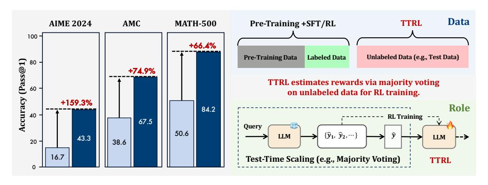

Figure 1: Performance and Position of TTRL.

 $<sup>^*</sup>$ Equal Contribution. Kaiyan Zhang (zhang-ky22@mails.tsinghua.edu.cn) and Ganqu Cui lead the project.  $^*$ : Corresponding authors.

# **Contents**

| 1 | Introduction                 |                                         |                                                                                                             |  |  |  |  |
|---|------------------------------|-----------------------------------------|-------------------------------------------------------------------------------------------------------------|--|--|--|--|
| 2 |                              | Test-Time Reinforcement Learning (TTRL) | 3<br>4<br>4<br>5<br>5<br>5<br>6<br>8<br>8<br>10<br>11<br>12<br>12<br>13<br>13<br>14<br>19<br>19<br>20<br>20 |  |  |  |  |
|   | 2.1                          | Methodology<br>                         |                                                                                                             |  |  |  |  |
|   | 2.2                          | Majority Voting Reward Function         |                                                                                                             |  |  |  |  |
| 3 |                              | Experiments                             |                                                                                                             |  |  |  |  |
|   | 3.1                          | Experimental Setup                      |                                                                                                             |  |  |  |  |
|   | 3.2                          | Main Results                            |                                                                                                             |  |  |  |  |
| 4 |                              | Analysis and Discussions                |                                                                                                             |  |  |  |  |
|   | 4.1                          | Q1: How Well Can TTRL Perform?          |                                                                                                             |  |  |  |  |
|   | 4.2                          | Q2: Why Does TTRL Work?<br>             |                                                                                                             |  |  |  |  |
|   | 4.3                          | Q3: When Might TTRL Fail?               |                                                                                                             |  |  |  |  |
| 5 |                              | Related Works                           |                                                                                                             |  |  |  |  |
|   | 5.1                          | Test-Time Scaling<br>                   |                                                                                                             |  |  |  |  |
|   | 5.2                          | RL for Reasoning<br>                    |                                                                                                             |  |  |  |  |
| 6 | Conclusion                   |                                         |                                                                                                             |  |  |  |  |
| 7 | Limitations and Future Works |                                         |                                                                                                             |  |  |  |  |
| A | Reward Function Pseudo-Code  |                                         |                                                                                                             |  |  |  |  |
| B | Additional Results           |                                         |                                                                                                             |  |  |  |  |
| C | Training Metrics             |                                         |                                                                                                             |  |  |  |  |
| D | Terminology                  |                                         |                                                                                                             |  |  |  |  |
|   | D.1                          | Test-Time Training (TTT)                | 20                                                                                                          |  |  |  |  |
|   | D.2                          | Test-Time Inference (TTI)               | 21                                                                                                          |  |  |  |  |

# <span id="page-2-0"></span>**1 Introduction**

Recent advances in Large Reasoning Models (LRMs), such as DeepSeek-R1 [\(Guo et al.,](#page-14-0) [2025\)](#page-14-0) and OpenAI's o1 [\(Jaech et al.,](#page-15-0) [2024\)](#page-15-0), have demonstrated that Reinforcement Learning (RL) is essential for enhancing long chain-of-thought (CoT) reasoning [\(Wei et al.,](#page-16-0) [2022\)](#page-16-0) through training on expensive human-annotated data. These models achieve remarkable performance on a range of highly challenging tasks. For example, OpenAI's o3 attains a 75.7% success rate on ARC-AGI-1. However, complex and unlabeled questions continuously emerge, posing significant challenges. For instance, o3 solves only 4% of problems on the recently released ARC-AGI-2 benchmark (2025) [1](#page-2-1) . Addressing such tasks typically involves scaling up training with more data and computational resources, and it may still fail to yield strong performance on these tasks. [Silver & Sutton](#page-16-1) [\(2025\)](#page-16-1) has recently advocated for a transition to the "era of experience," emphasizing the limitations of existing AI systems that rely heavily on human supervision, as well as the importance of enabling models to self-evolve through experience.

Further building upon the substantial progress of LRMs, it naturally motivates a promising direction in which AI systems autonomously improve via RL on unlabeled data by directly engaging in self-experience and learning, thereby pushing the boundaries of RL and further advancing the frontier of AI capabilities. Such self-evolvement can be broadly categorized into two modes: adaptation to test-time data, which enables models to tackle harder benchmarks such as ARC-AGI-2, and training on external unlabeled data, which unlocks more training data beyond labeled corpora. This work focuses on the adaptation to testtime data, which has been extensively studied under the paradigm of Test-Time Training (TTT) [\(Sun et al.,](#page-16-2) [2019;](#page-16-2) [2024;](#page-16-3) [Behrouz et al.,](#page-14-1) [2024;](#page-14-1) [Akyurek et al.](#page-14-2) ¨ , [2024\)](#page-14-2). TTT has received increasing attention recently. These approaches adapt model parameters at test time by exploiting the structure and distributional properties of incoming test data.

Therefore, we aim to fully advance AI evolution by updating models at test time using RL, thereby enhancing their generalization to previously unseen data. However, this introduces a critical challenge: *How to obtain rewards for RL at test-time?* This also highlights a broader limitation of current RL approaches. Despite their promise, most existing methods still rely heavily on labeled data, which significantly limits their scalability. As real-world tasks continue to increase in both complexity and volume, large-scale annotation for RL becomes increasingly impractical, posing a substantial barrier to the continual improvement of state-of-the-art models.

We introduce Test-Time Reinforcement Learning (**TTRL**), which performs test-time training through RL. **TTRL** employs repeated sampling strategies in the rollout phase to accurately estimate the label and compute rule-based rewards, thereby enabling RL on unlabeled data. By incorporating effective majority voting rewards, **TTRL** facilitates efficient and stable RL in the absence of ground truth labels. As previously highlighted, the emergence of more challenging tasks will inevitably lead to larger proportions of unlabeled data. **TTRL** directly addresses the problem of training models via RL without explicit supervision, investigating a model's ability to explore and learn in this challenging yet critical setting. Essentially, **TTRL** enables the model to generate its own experiences, estimate rewards, and improve its performance over time.

In experiments, applying **TTRL** to Qwen2.5-Math-7B results in an improvement on AIME 2024 of **211**% (12.9 to 40.2), with an average gain of **76**% across AIME 2024, AMC, MATH-500, and GPQA. These improvements are achieved through self-evolution without any labeled training data and further generalize to other tasks. **TTRL** not only enhances performance on pass@1 but also improves TTS through majority voting. Moreover, our preliminary experiments suggest that **TTRL** is effective across models of different scales and types and that it can be integrated with existing RL algorithms. We also found that **TTRL** exhibits favorable characteristics such as a high-performance ceiling. These observations highlight its potential to substantially reduce reliance on human annotations, enabling continual learning and scaling RL to large-scale unsupervised training. Below are several key takeaways:

<span id="page-2-1"></span><sup>1</sup><https://arcprize.org/>

<span id="page-3-2"></span>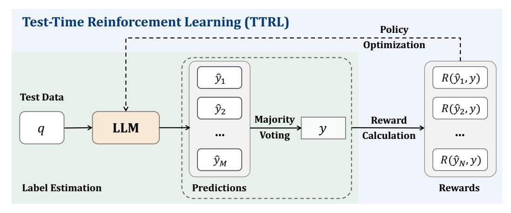

Figure 2: TTRL combines both Test-Time Scaling (TTS) and Test-Time Training (TTT).

#### **Takeaways**

- 1. Majority voting provides effective reward estimation for TTRL (§ 3).
- 2. **TTRL** can exceed its training signal and upper limit maj@n, and closely mirrors the performance of direct training on the test data with ground-truth (§ 4.1).
- 3. It is possible to achieve efficient and stable RL in an unsupervised manner (§ 4.2).

# <span id="page-3-0"></span>2 Test-Time Reinforcement Learning (TTRL)

Unlike traditional RL, where the agent learns from known reward signals, **TTRL** operates on unlabeled test data. In other words, the model must learn and adapt without access to explicit supervision. Our task is defined as follows:

We study the problem of training a pre-trained model during test time using RL without ground-truth labels. We call this setting Test-Time Reinforcement Learning.

#### <span id="page-3-1"></span>2.1 Methodology

Figure 2 illustrates how our approach, **TTRL**, tackles this challenge. Given a state represented by the prompt x, the model acts by producing an output y sampled from a policy  $\pi_{\theta}(y \mid x)$  parameterized by  $\theta$ . To construct a reward signal without ground-truth labels, we generate multiple candidate outputs  $\{y_1, y_2, \ldots, y_N\}$  from the model through repeated sampling. A consensus output  $y^*$  is derived, for instance, by majority voting or another aggregation method, serving as a proxy for the optimal action. The environment then provides a reward  $r(y, y^*)$  based on the alignment between the sampled action y and the consensus action  $y^*$ . The RL objective is thus to maximize the expected reward:

$$\max_{\theta} \mathbb{E}_{y \sim \pi_{\theta}(\cdot|x)}[r(y, y^*)], \tag{1}$$

and parameters  $\theta$  are updated through gradient ascent:

$$\theta \leftarrow \theta + \eta \nabla_{\theta} \mathbb{E}_{y \sim \pi_{\theta}(\cdot|x)}[r(y, y^*)],$$
 (2)

where  $\eta$  denotes the learning rate. This approach enables the model to adapt during inference, effectively improving its performance on distribution-shifted inputs without the need for labeled data.

### <span id="page-4-0"></span>2.2 Majority Voting Reward Function

The majority voting reward is determined by first estimating a label through majority voting. This estimated label is then used to calculate rule-based rewards, which serve as the final rewards. Given a question x, we first input x into the LLM to generate a set of outputs. An answer extractor then processes these outputs to obtain the corresponding predicted answers, denoted as  $P = \{\hat{y}_i\}_{i=1}^N$ . We first follow Equation 4 over P to estimate a label, with majority voting as the scoring function s(y,x) to get y, the most frequently occurring prediction in P. The majority-voted prediction y is then used as the estimated label to compute rule-based rewards (Guo et al., 2025). The reward function is:

$$R(\hat{y}_i, y) = \begin{cases} 1, & \text{if } \hat{y}_i = y, \\ 0, & \text{otherwise.} \end{cases}$$
 (3)

Appendix A presents the pseudo-code of the reward function.

# <span id="page-4-1"></span>3 Experiments

## <span id="page-4-2"></span>3.1 Experimental Setup

**Models** To evaluate the generalizability of **TTRL** across different backbone models, we conduct experiments using both base and instruct models of various scales. In addition, we carry out experiments on leading LRMs to demonstrate that **TTRL** can improve model performance even after costly post-training. The models we experiment with are as follows:

- Math Base Models: Qwen2.5-Math-1.5B, Qwen2.5-Math-7B (Yang et al., 2024a);
- Vanilla Base Models: Qwen2.5-7B, Qwen2.5-32B (Yang et al., 2024b);
- Instruct Models: LLaMA-3.1-8B-Instruct (Grattafiori et al., 2024), Qwen3-8B (non-thinking mode) (Yang et al., 2024b);
- **Reasoning Models:** Skywork-OR1-Math-7B (He et al., 2025), Qwen3-8B (thinking mode) (Yang et al., 2024b);

**Benchmarks** We evaluate **TTRL** on GPQA-Diamond (Rein et al., 2024), a challenging and high-quality subset of the Graduate-Level Google-Proof Question Answering benchmark, and 3 mathematical reasoning benchmarks: AIME 2024 (Li et al., 2024), AMC (Li et al., 2024), and MATH-500 (Hendrycks et al., 2021).

**Evaluation Setup** We apply **TTRL** to each benchmark individually and then evaluate. We set the maximum generation length to 3072 tokens, unless otherwise specified. For the **main experiments**, following DeepSeek-R1 (Guo et al., 2025), we adopt the pass@k evaluation protocol (Chen et al., 2021) and report pass@1 using non-zero temperature sampling. Specifically, we generate 16 responses (4 for 32k context) per question using a temperature of 0.6 and a top-p value of 0.95. The pass@1 score is computed as:

pass@1 = 
$$\frac{1}{k} \sum_{i=1}^{k} p_i$$
,

where  $p_i$  indicates whether the *i*-th response is correct. For the **analysis and additional experiments on Qwen2.5-MATH**, we evaluate using greedy decoding to report pass@1, to ensure a fair comparison with previous works. Appendix C presents a set of training-time metrics we used to monitor the performance of **TTRL** and analyze its training dynamics in the absence of ground-truth labels.

**Baselines** Since the use of TTT for reasoning has not been previously explored, we primarily compare it with the backbone model to validate whether **TTRL** can achieve effective improvements through self-evolution. Appendix B presents additional experimental results comparing **TTRL** with previous state-of-the-art RL approaches for reasoning.

<span id="page-5-2"></span>Table 1: Main results of **TTRL** on each task. \* indicates that Qwen3-8B is evaluated in non-thinking mode within a 3k context. Table 2 provides results within a 32k context.

| Name              | AIME 2024 | AMC            | MATH-500        | GPQA             | Avg             |  |
|-------------------|-----------|----------------|-----------------|------------------|-----------------|--|
| Math Base Models  |           |                |                 |                  |                 |  |
| Qwen2.5-Math-1.5B | 7.7       | 28.6           | 32.7            | 24.9             | 23.5            |  |
| w/TTRL            | 15.8      | 48.9           | 73.0            | 26.1             | 41.0            |  |
| Δ                 | +8.1      | +20.3          | +40.3           | +1.2             | +17.5           |  |
|                   | ↑ 105.2%  | ↑ 71.0%        | † 123.2%        | $\uparrow 4.8\%$ | ↑ <b>74.4</b> % |  |
| Qwen2.5-Math-7B   | 12.9      | 35.6           | 46.7            | 29.1             | 31.1            |  |
| w/ TTRL           | 40.2      | 68.1           | 83.4            | 27.7             | 54.9            |  |
| Δ                 | +27.3     | +32.5          | +36.7           | -1.4             | +23.8           |  |
|                   | ↑ 211.6%  | ↑ 91.3%        | ↑ 78.6%         | ↓ 4.8%           | ↑ 76.5%         |  |
|                   | Vanil     | la Base Mo     | odels           |                  |                 |  |
| Qwen2.5-7B        | 7.9       | 34.8           | 60.5            | 31.8             | 33.8            |  |
| w/TTRL            | 23.3      | 56.6           | 80.5            | 33.6             | 48.5            |  |
| Δ                 | +15.4     | +21.8          | +20.0           | +1.8             | +14.7           |  |
|                   | ↑ 194.9%  | <b>†</b> 62.6% | ↑ 33.1%         | ↑ 5.7%           | † <b>4</b> 3.7% |  |
| Qwen2.5-32B       | 7.9       | 32.6           | 55.8            | 33.2             | 32.4            |  |
| w/TTRL            | 24.0      | 59.3           | 83.2            | 37.7             | 51.1            |  |
| Δ                 | +16.1     | +26.7          | +27.4           | +4.5             | +18.7           |  |
|                   | ↑ 203.8%  | ↑ 81.9%        | ↑ <b>4</b> 9.1% | † 13.6%          | ↑ 57.7%         |  |
| Instruct Models   |           |                |                 |                  |                 |  |
| LLaMA3.1-8B       | 4.6       | 23.3           | 48.6            | 30.8             | 26.8            |  |
| w/TTRL            | 10.0      | 32.3           | 63.7            | 34.1             | 35.0            |  |
| Δ                 | +5.4      | +9.0           | +15.1           | +3.3             | +8.2            |  |
|                   | † 117.4%  | <b>†</b> 38.6% | ↑ <b>31.1</b> % | ↑ 10.7%          | ↑ 30.6%         |  |
| Qwen3-8B*         | 26.9      | 57.8           | 82.3            | 48.1             | 53.8            |  |
| w/ TTRL           | 46.7      | 69.1           | 89.3            | 53.0             | 64.5            |  |
| Δ                 | +19.8     | +11.3          | +7.0            | +4.9             | +10.8           |  |
|                   | ↑ 73.6%   | † 19.6%        | <b>↑ 8.5%</b>   | ↑ 10.2%          | ↑ 20.0%         |  |

Implementation Details We independently apply GRPO (Shao et al., 2024) on each benchmark to implement TTRL. For hyperparameters, we use a cosine learning rate schedule with a peak value of  $5\times 10^{-7}$  and adopt the AdamW optimizer for the policy model. For rollout, we sample 64 responses using a temperature of 0.6 (1.0 for Qwen2.5-Math) for voting-based label estimation and downsample 32 responses per prompt for training. Evidence shows that our vote-then-sample strategy effectively reduces computational costs while still achieving strong performance. The maximum generation length is set to 32,768 tokens for reasoning models and 3,072 tokens for all other models. We set the number of episodes to 10, 30, and 80 for MATH-500, AMC, and AIME 2024, respectively, based on the dataset size. All experiments were conducted on 8 \* NVIDIA A100 40GB GPUs.

#### <span id="page-5-0"></span>3.2 Main Results

TTRL performs well on most tasks and models. Table 1 presents the main results. We apply TTRL to 6 models spanning 4 model families, 2 model types, and 3 model sizes, consistently demonstrating substantial improvements across 4 highly challenging benchmarks. On the demanding mathematical reasoning benchmark AIME 2024, TTRL achieves a minimum improvement of 105% across all 6 models. Moreover, applying TTRL to a 1.5B model leads to a significant gain of up to 40.3 points on the MATH-500. Table 2 also presents the results of applying TTRL to the reasoning model. We set

<span id="page-5-1"></span>Table 2: **TTRL** on the reasoning model.

| Name                     | AIME 2024     |
|--------------------------|---------------|
| Skywork-OR1-Math-7B      | 66.7          |
| w/ TTRL<br>Δ             | 75.0<br>+8.3  |
| Qwen3-8B (thinking mode) | 72.5          |
| w/ TTRL<br>Δ             | 82.5<br>+10.0 |

the maximum generation length for the evaluation of both models to 32,768, and evaluate

Qwen3-8B under thinking mode. Even though the model has already undergone extensive post-training, **TTRL** still brings significant improvements. Furthermore, as shown in Appendix B, despite relying solely on self-evolution using unlabeled test data, **TTRL** achieves performance comparable to existing RL-based models that are trained on large-scale labeled datasets.

**TTRL naturally scales.** Another noteworthy observation is that as the model size increases  $(1.5B \rightarrow 7B \text{ and } 7B \rightarrow 32B)$ , performance consistently improves, highlighting the natural scaling behavior of **TTRL**: larger models can produce more accurate majority voting rewards during self-improvement, which leads to more effective learning on new data.

TTRL generalizes well beyond the target task. We perform TTRL on each benchmark and further evaluate pass@1 using greedy decoding on others, with Qwen2.5-Math-7B as the backbone. Figure 3 shows the results. Despite the out-of-distribution nature of this setting, TTRL achieves substantial improvements across all benchmarks. This suggests that TTRL does not rely on overfitting, which would lead to trade-offs on other tasks, but instead acquires generalizable gains during self-improvement.

<span id="page-6-0"></span>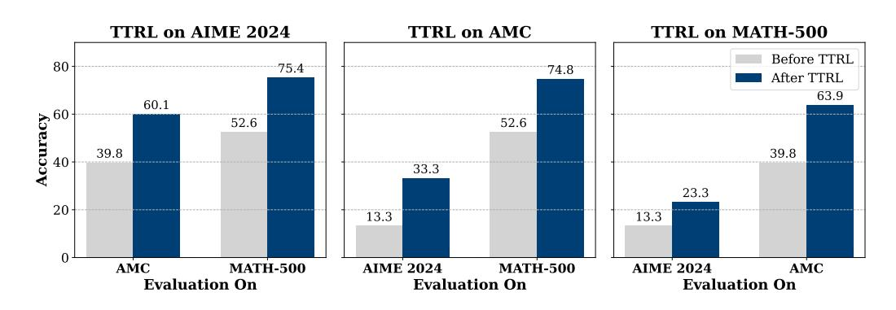

Figure 3: Out-of-distribution performance before and after TTRL.

**TTRL** is compatible with different RL algorithms. We further apply **TTRL** using two RL algorithms on MATH-500 to assess its compatibility, which are PPO (Schulman et al., 2017), a value mode based method, and PRIME (Cui et al., 2025), a process-level RL algorithm. Figure 4 presents the results. The performance trajectories of GRPO, PPO, and PRIME are closely aligned.

<span id="page-6-1"></span>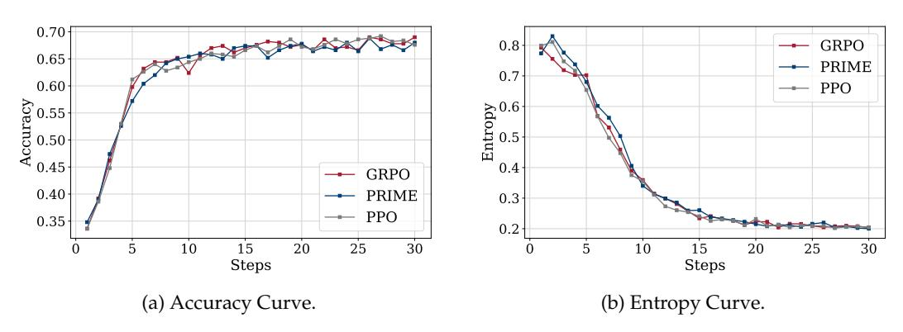

Figure 4: Comparison over steps of different RL algorithms, GRPO, PPO, and PRIME on MATH-500 using Qwen2.5-Math-1.5B.

TTRL achieves sustainable self-evolution through "online" and "RL". To gain a deeper understanding of the underlying mechanisms of TTRL, we conduct an analysis of the

model's training dynamics by tracking the average (pass@1/avg@16) and majority (maj@16) scores throughout the training process. Given that majority voting serves as the basis for generating training signals, examining its performance trajectory is essential for understanding how it functions. Furthermore, we investigate whether TTRL improves pass@1 at the cost of a reduction in maj@16 performance. Figure 5 illustrates the TTRL training dynamics on AMC with Qwen2.5-Math-1.5B as the base model. It is notable that, as training progresses, both metrics demonstrate a consistent upward trend. This indicates that TTRL is not simply approaching the initial model's majority voting performance. Due to its dynamic nature, TTRL can generate higher-quality supervision signals as its capabilities improve. Moreover, through TTRL's use of RL for TTT, by converting voting-based pseudo-labels into reward signals, it enhances the effective supervision quality (e.g., accuracy; see Q2 4.2), while decoupling learning from the limitations imposed by maj@n.

<span id="page-7-2"></span>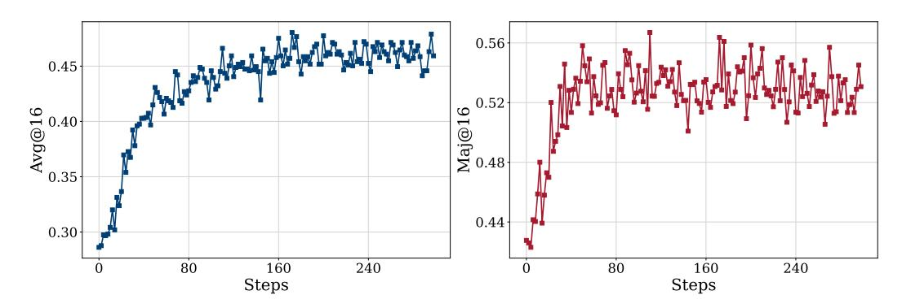

Figure 5: Training dynamics of TTRL on AMC using Qwen2.5-Math-1.5B as the base model.

## <span id="page-7-0"></span>4 Analysis and Discussions

## <span id="page-7-1"></span>4.1 Q1: How Well Can TTRL Perform?

#### **Takeaways**

- TTRL surpasses the traditional self-training upper bound, the majority accuracy of the initial model.
- 2. The empirical upper bound of **TTRL** is direct RL on labeled test data (i.e., training on the test data). **TTRL** can approach the performance of this upper bound, highlighting its potential advantages in efficacy over standard *training-evaluation* protocols.
- 3. For challenging tasks, **TTRL** can reach the empirical upper bound using only a 1.5B model. This demonstrates that LLMs can now efficiently self-evolve through **TTRL**, enabling unbounded lifelong learning on large-scale datasets.

We analyze the potential performance of **TTRL** using two upper bounds. The first upper bound is the maj@n of the initial model. The second upper bound is direct training on benchmark data, which assumes access to ground-truth labels and thus leaks label information to the policy model.

TTRL is Supervised by maj@n Yet Surpasses It. Since TTRL utilizes the model's own majority-voted outputs for RL, this voting-based performance of the initial model can intuitively be regarded as an upper bound of the final performance. This upper bound is also the performance limit of traditional self-training methods (Huang et al., 2022), which select self-generated CoT through majority voting for supervised fine-tuning (SFT). However, we observe a surprising phenomenon: after training, the model not only matches but also surpasses the expected upper bound, suggesting that it exceeds the performance limit of the original model, which also serves as its initial supervision signal. Figure 5 illustrates this

<span id="page-8-0"></span>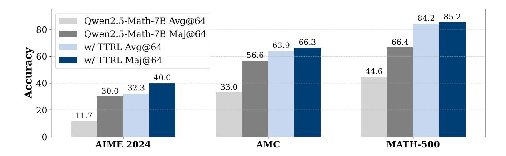

Figure 6: Majority voting performance comparison between the backbone and after TTRL.

remarkable result, where it can be observed that the final avg@16 score exceeds the initial maj@16 score by more than 20 points. Furthermore, we perform additional evaluations of TTRL on Qwen2.5-Math-7B across various benchmarks, using more samples per question to enable more reliable assessment. Figure 6 shows results. It can be observed that TTRL avg@64 consistently outperforms Qwen2.5-Math-7B maj@64 across all benchmarks, with a considerable margin. Through a self-reinforcing loop, the model "lifts itself up by its own bootstraps", evolving beyond the anticipated performance ceiling. Moreover, the performance of TTRL further improves when majority voting is applied.

TTRL's Performance Gains Approach **Training on the Benchmark.** The motivation of TTRL is to estimate labels using majority voting to obtain more accurate rewards, facilitating effective self-improvement through RL on the data without ground-truth labels. Therefore, a natural upper bound of **TTRL** is performing RL directly on the test data, denoted as RL (leakage). Although this setting is rarely adopted or studied due to the issue of information leakage, it represents the most efficient way to improve performance on the particular dataset, with efficiency that far exceeds traditional training-evaluation paradigms. We use

<span id="page-8-1"></span>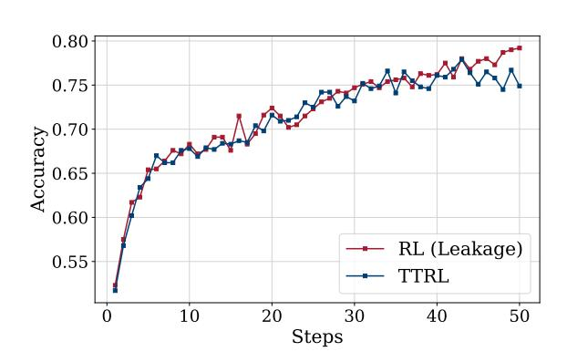

Figure 7: Comparison of RL (Leakage) vs TTRL.

Qwen2.5-Math-7B to perform both **TTRL** and RL (leakage) on MATH-500 and conduct evaluations. Figure 7 shows results. Surprisingly, we find that the performance curve of **TTRL** closely approaches that of RL (leakage). This suggests that:

- 1. **TTRL** can achieve a level of self-improvement comparable to that of supervised learning (even in the information leakage scenario) through RL in an unsupervised setting. This indicates its substantial efficiency and performance gains.
- 2. TTRL provides evidence that even small LLMs can now effectively self-improve on input-only challenging tasks through RL, enabling continual learning. Results on Qwen2.5-Math-1.5B further support this observation: starting from a subpar performance of 32.7 on MATH-500, the model improved by 123.2% to reach 73.0, demonstrating clear self-improvement through TTRL.

<span id="page-9-2"></span>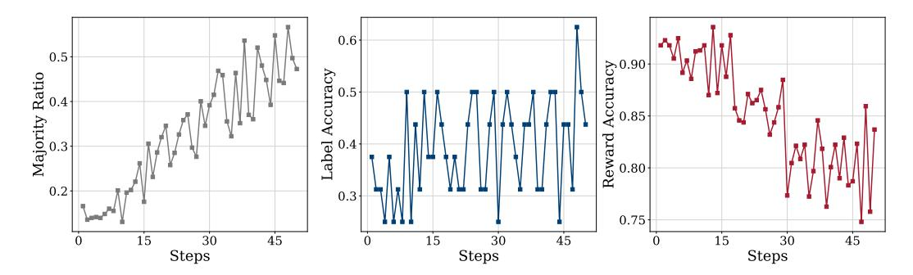

Figure 8: Comparison of Majority Ratio, Label Accuracy, and Reward Accuracy on AIME 2024 over steps. Even with low label accuracy, reward accuracy remains high due to "Lucky Hit", allowing TTRL to provide reliable training signals.

### <span id="page-9-0"></span>4.2 Q2: Why Does TTRL Work?

This section presents a progressive analysis of the factors enabling **TTRL** to achieve stable and effective RL under unsupervised conditions. Our analysis identifies three key factors: label estimation, reward calculation, and online learning.

**Label Estimations.** A direct difference between **TTRL** and standard RL algorithms is that **TTRL** involves label estimation, which introduces reward inaccuracies. We believe that **TTRL** works despite these inaccuracies due to the following two reasons. (i) Existing studies have shown that RL can tolerate a certain degree of reward inaccuracy. Moreover, RL tends to generalize better than SFT, which often relies on memorizing training data (Chu et al., 2025). In RL, rewards are typically vague and serve primarily as directional signals for exploration, leading to RL's robustness to reward noise (Razin et al., 2025). (ii) Prior work has also examined what constitutes a good reward model from an optimization perspective, revealing that more accurate reward models are not necessarily better teachers (Wang et al., 2020). Therefore, reward signals estimated by the policy model itself may offer more suitable guidance for learning.

**Reward Calculations.** When the model is capable of estimating accurate labels via majority voting, the reward and subsequently training are generally reliable. However, a natural question arises: Why does TTRL remain effective even when the model fails to estimate accurate labels via majority voting on challenging benchmarks such as AIME 2024? The most fundamental reason lies in the mechanism by which the verifier computes rewards in RL. For tasks such as mathematics, the verifier works based on "comparison" to obtain rule-based rewards by checking whether the predicted answer matches the given "label." This mechanism can lead to the phenomenon of "Lucky Hit": for an incorrectly predicted answer, even if the estimated label does not match the ground truth label, as long as it differs from the predicted answer, the verifier will still output a negative reward, and this is exactly the correct reward that we expect, as illustrated in Figure 9. In other words, it is sufficient that the estimated label differs from the predicted answer

<span id="page-9-1"></span>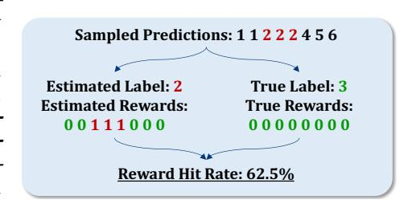

Figure 9: A toy case of "Lucky Hit". We illustrate a basic numerical prediction scenario to compare reward computation under two conditions: when the model incorrectly estimates the label versus when the ground-truth label is used. As shown on the left, although the estimated label is incorrect, some of the incorrect predictions still differ from the wrong label and therefore receive the correct reward (denoted as 0).

for the verifier to assign the correct negative reward. To provide a more detailed case study, we examine the performance of TTRL on the AIME 2024 using Qwen2.5-Math-7B. Figure 8

presents the variation curves of the three metrics, as described in Appendix [C.](#page-19-0) We identify two main reasons why **TTRL** remains effective on AIME 2024:

- 1. **Reward robustness enabled by multiple outputs within a rollout.** First, rewards are denser than labels, allowing for more opportunities to recover useful reward signals even when the estimated label is inaccurate. For example, even when the predicted label is incorrect, alternative outputs within the same rollout can still yield correct or high-quality rewards, as shown in Figure [9,](#page-9-1) whereas a rollout containing only a single output would not provide such flexibility. This makes the overall reward signal more robust to errors in pseudo-label estimation.
- 2. **High reward accuracy due to scattered incorrect predictions.** Second, counterintuitively, when the model has weaker capability, the majority voting rewards of **TTRL** may be more accurate. As shown in Figure [8,](#page-9-2) although the initial label estimation through majority voting achieves an accuracy of only 37%, the reward accuracy reaches an impressive 92%. By examining the model outputs, we find that this is because the model's responses are highly scattered and consistently incorrect, as shown in Figure [9.](#page-9-1) A result consistent with this observation is that, for the base model, the most frequently predicted answer accounts for only 16.6% of all predictions, indicating that the outputs are highly scattered. Therefore, even when the labels are not accurately estimated, due to "Lucky Hit", most outputs can still receive correct rewards. Moreover, the poorer the model's performance, the more mistakes it tends to make, which paradoxically leads to more accurate reward estimation. An empirical observation supporting this view is the comparison between the label accuracy and reward accuracy, as shown in Figure [8.](#page-9-2) Although the label accuracy rarely exceeds 50%, the reward accuracy remains consistently high, staying above 75%. This high reward accuracy provides a reliable foundation for effective self-improvement on test data.

**Online Learning. TTRL** is designed based on an online RL approach, whereas traditional self-training and test-time training methods operate in an offline manner. The online nature of **TTRL** enables the model to improve its capabilities during the application, which in turn leads to more accurate labels generated through voting. As a result, the quality of the supervision signal improves, allowing for truly sustainable self-evolution. As shown in Figure [5,](#page-7-2) this dynamic learning process leads to a complementary improvement of performance in both pass@1 and maj@n.

## <span id="page-10-0"></span>**4.3 Q3: When Might TTRL Fail?**

At the algorithmic level, **TTRL** is not fundamentally different from existing RL algorithms and therefore inherits several of their characteristics, such as sensitivity to data difficulty, strong reliance on priors, and risk of collapse under certain conditions. At the implementation level, these issues are further amplified by the constraints of **TTRL**, which estimates labels via majority voting and operates exclusively on test data that is both sparse and previously unseen, potentially resulting in failures in certain scenarios. In our preliminary experiments, we identified two potential issues:

**Lack of Prior Knowledge on Target Task.** Prior knowledge plays a crucial role in RL, often determining the success or failure of the **TTRL** learning process[2](#page-10-1) . This is mainly because the test data generally exhibits higher difficulty and introduces new features, but **TTRL** does not incorporate mechanisms such as data filtering to support curriculum learning.

Therefore, for the same backbone, **TTRL** fails if the model's prior knowledge is insufficient to handle the complexity of the data. To further validate this hypothesis, we conduct an ablation study on MATH-500. We divide MATH-500 into five subsets according to its annotated difficulty levels, ranging from 1 to 5, and apply **TTRL** to each subset independently, using Qwen2.5-Math-1.5B. We then compare the results to those of the backbone, as shown in Table [3.](#page-11-2) We observe that as the question difficulty increases, both the performance improvement and length reduction ratios tend to decrease. **This suggests that the available**

<span id="page-10-1"></span><sup>2</sup><https://ysymyth.github.io/The-Second-Half/>

<span id="page-11-2"></span>

| Metric        | Name               | MATH-500-L1         | MATH-500-L2         | MATH-500-L3         | MATH-500-L4       | MATH-500-L5       |
|---------------|--------------------|---------------------|---------------------|---------------------|-------------------|-------------------|
| Accuracy      | Backbone<br>w/TTRL | 25.9<br>71.2        | 33.0<br>76.2        | 36.3<br>76.3        | 32.5<br>58.7      | 22.3<br>39.2      |
|               | Δ                  | +45.4<br>↑ 175.3%   | +43.2<br>↑ 130.8%   | +40.0<br>↑ 110.2%   | +26.2<br>↑ 80.4%  | +16.8<br>↑ 75.3%  |
| Response Len. | Backbone<br>w/TTRL | 2,339.2<br>624.3    | 2,125.1<br>614.4    | 2,120.6<br>672.3    | 1,775.1<br>783.5  | 1,751.3<br>985.3  |
|               | Δ                  | -1,715.0<br>↓ 73.3% | −1,510.6<br>↓ 71.1% | -1,448.3<br>↓ 68.3% | −991.6<br>↓ 55.9% | -766.0<br>↓ 43.7% |

Table 3: Performance of TTRL across the five difficulty levels of MATH-500.

prior knowledge of the backbone is insufficient to support learning on more challenging questions.

Inappropriate RL Hyperparameters. Hyperparameter settings play a crucial role in RL training, varying across projects <sup>3</sup> and often leading to training failures. The influence of hyperparameters is further amplified in TTRL due to potential noise in reward estimation and the characteristics of the test data. Figure 10 presents a comparison of several unsuccessful attempts on AIME 2024. Both of these failed attempts exhibit persistently high entropy that does not diminish throughout training, consistent with findings of prior work (He et al., 2025). In our preliminary experiments, we identified two key hyperparameters that can critically affect training stability and success:

<span id="page-11-4"></span>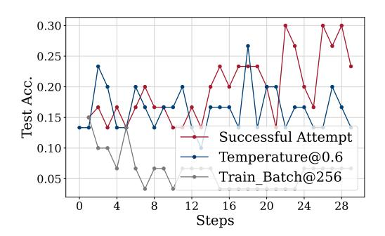

Figure 10: Failed attempts. We compare the curves under settings with appropriate parameters versus those with suboptimal temperature and training batch size.

- **Temperature:** Setting the temperature to 1.0, as opposed to 0.6, increases the model's output entropy. This promotes more extensive exploration and allows the model to make better use of its prior knowledge for self-improvement, which is particularly important when addressing challenging benchmarks.
- **Episodes:** Given the substantial variation in size and difficulty across datasets, smaller and more difficult datasets need more episodes to achieve sufficient exploration.

#### <span id="page-11-0"></span>5 Related Works

## <span id="page-11-1"></span>5.1 Test-Time Scaling

Test-Time Scaling (TTS) is designed to enhance the capabilities of Large Language Models (LLMs) in handling complex tasks by increasing computational resources at test time. Prior research (Snell et al., 2024; Liu et al., 2025a) indicates that TTS is more efficient than scaling during pre-training (Kaplan et al., 2020). Therefore, reallocating the same computational resources from pre-training to test-time could yield greater improvements in model performance. Current studies on TTS fall into two categories (Welleck et al., 2024): parallel generation and sequential generation. Parallel generation involves LLMs producing multiple candidate responses (self-consistency (Wang et al., 2022; Chen et al., 2023), best-of-N (Stiennon et al., 2020; Nakano et al., 2021)), decision steps (Monte Carlo Tree Search (Zhou et al., 2023; Xie et al., 2024)), or tokens (Reward-guided Search (Deng & Raffel, 2023; Khanov et al., 2024)) during inference. Subsequently, an aggregation strategy is applied to integrate

<span id="page-11-3"></span><sup>3</sup>https://github.com/TsinghuaC3I/Awesome-RL-Reasoning-Recipes

these candidates, commonly using process reward models [\(Lightman et al.,](#page-15-8) [2023;](#page-15-8) [Wang](#page-16-13) [et al.,](#page-16-13) [2023;](#page-16-13) [Zhang et al.,](#page-17-3) [2025a\)](#page-17-3). Concurrently, sequential generation focuses on extending the LLMs' output to include longer responses with reflective and chain-of-thought (CoT) processes [\(Wei et al.,](#page-16-0) [2022;](#page-16-0) [Madaan et al.,](#page-15-9) [2023\)](#page-15-9). Although prompting techniques are widely adopted, they are often constrained by the capabilities of the underlying models. Notably, DeepSeek-R1 [\(Guo et al.,](#page-14-0) [2025\)](#page-14-0) is a representative advancement in this area, achieving extended reasoning capabilities in pre-trained language models through outcome-based reinforcement learning (RL), more specifically group relative policy optimization [\(Shao](#page-16-5) [et al.,](#page-16-5) [2024\)](#page-16-5). Compared to the first approach, which requires intensive process-level supervision [\(Yuan et al.,](#page-17-4) [2024\)](#page-17-4), the second approach is more scalable due to its reliance on rule-based rewards.

Beyond the aforementioned methods that focus on scaling test-time inference computation, another approach to increasing test-time computing is **Test-Time Training (TTT)**. We introduce the relationship between these terminologies in Appendix [D.](#page-19-1) While prior work has primarily focused on applications such as video generation and understanding [\(Hardt](#page-14-11) [& Sun,](#page-14-11) [2024;](#page-14-11) [Dalal et al.,](#page-14-12) [2025\)](#page-14-12), and to some extent on large language models [\(Wang et al.,](#page-16-14) [2025;](#page-16-14) [Akyurek et al.](#page-14-2) ¨ , [2024\)](#page-14-2), the integration of test-time scaling with reinforcement learning remains largely underexplored.

## <span id="page-12-0"></span>**5.2 RL for Reasoning**

Reinforcement Learning (RL) [\(Sutton et al.,](#page-16-15) [1998\)](#page-16-15) plays a critical role in enhancing the instruction-following capabilities of Large Language Models (LLMs), particularly through approaches like Reinforcement Learning from Human Feedback (RLHF) [\(Ouyang et al.,](#page-15-10) [2022\)](#page-15-10). RLHF aligns base models with human preferences using algorithms such as Proximal Policy Optimization (PPO) [\(Schulman et al.,](#page-16-6) [2017\)](#page-16-6), where preference modeling is essential. Recently, Large Reasoning Models (LRMs), such as DeepSeek-R1 [\(Guo et al.,](#page-14-0) [2025\)](#page-14-0), have demonstrated the significance of RL in improving reasoning abilities using rule-based rewards, as exemplified by GRPO [\(Shao et al.,](#page-16-5) [2024\)](#page-16-5). Unlike RLHF, which is tailored to open-domain instructions, GRPO is specifically designed to elicit long CoT [\(Wei et al.,](#page-16-0) [2022\)](#page-16-0) reasoning in mathematical problem-solving. Recent studies have focused primarily on improving the training stability of rule-based RL methods like GRPO and PPO [\(Cui et al.,](#page-14-7) [2025;](#page-14-7) [Yu et al.,](#page-17-5) [2025;](#page-17-5) [Liu et al.,](#page-15-11) [2025b\)](#page-15-11). However, these methods typically train LLMs only on supervised training data, while inference involves generating extended CoT reasoning on unseen test problems. Moreover, current RL approaches [\(Hu et al.,](#page-14-13) [2025a;](#page-14-13) [Wei et al.,](#page-16-16) [2025\)](#page-16-16) depend on verifiable outputs—such as solutions in mathematics or code—that can provide reliable reward signals.

Previous studies have explored self-rewarding [\(Yuan et al.,](#page-17-6) [2025;](#page-17-6) [Prasad et al.,](#page-15-12) [2024\)](#page-15-12) and self-play training [\(Chen et al.,](#page-14-14) [2024\)](#page-14-14) for unlabeled data. However, these works primarily focus on open-domain instruction following [\(Yuan et al.,](#page-17-6) [2025;](#page-17-6) [Chen et al.,](#page-14-14) [2024\)](#page-14-14) rather than mathematical reasoning or employ preference-based optimization strategies [\(Prasad et al.,](#page-15-12) [2024\)](#page-15-12) such as DPO [\(Rafailov et al.,](#page-15-13) [2023\)](#page-15-13) instead of online reinforcement learning algorithms. In addition to these studies, we identified several concurrent works [\(Xu et al.,](#page-17-7) [2025;](#page-17-7) [Zhang](#page-17-8) [et al.,](#page-17-8) [2025b;](#page-17-8) [Zhao et al.,](#page-17-9) [2025\)](#page-17-9), that explore self-supervised and semi-supervised reasoning using reinforcement-like methods. The key distinction lies in reward estimation: we employ majority voting, which is derived from the model itself and mitigates reward hacking. We acknowledge that future research integrating the insights and strengths of these approaches could lead to more robust reasoning models at the era of experience [\(Silver & Sutton,](#page-16-1) [2025\)](#page-16-1). **TTRL offers a preliminary attempt at RL with self-labeled rewards, advancing toward learning from streams of experience.**

## <span id="page-12-1"></span>**6 Conclusion**

In this paper, we propose Test-Time Reinforcement Learning (**TTRL**), a novel framework for training large language models with Reinforcement Learning (RL) on test data without access to ground-truth labels. A key component of **TTRL** is its majority voting reward function, which generates rule-based rewards based on consensus among model predictions. Our experiments demonstrate the strong potential of **TTRL**, achieving consistent improvements across a variety of models and tasks. We view **TTRL** as a preliminary step toward RL with self-labeled rewards, marking an important direction of learning from continuous streams of experience.

# <span id="page-13-0"></span>**7 Limitations and Future Works**

**Limitations** This work represents an initial exploration of test-time reinforcement learning using self-labeled rewards. While our experimental results are promising, several aspects require further investigation. In particular, we plan to conduct a more in-depth analysis of the impact of prior knowledge and hyperparameter configurations, both of which play critical roles in reinforcement learning dynamics. We will provide comprehensive discussions and ablation studies in future revisions of this paper.

**Future Works** Building on our findings, we identify several directions for future research:

- **Theoretical Analysis:** Developing a formal convergence analysis of **TTRL**, particularly focusing on its ability to optimize toward the two upper bounds in § [4.1.](#page-7-1)
- **Online Learning with Streaming Data:** Extending **TTRL** to real-time learning scenarios, where models interact with continuously arriving data and adapt dynamically, that is Test-Time Adaptation [\(Liang et al.,](#page-15-14) [2025\)](#page-15-14).
- **Large-Scale Self-Supervised RL Training:** Scaling up **TTRL** to massive datasets and models to explore its potential in self-supervised regimes without human-labeled data.
- **Agentic Tasks and Scientific Discovery:** Applying **TTRL** to more complex, open-ended domains such as agentic tasks and multi-step scientific reasoning.

# **References**

- <span id="page-14-2"></span>Ekin Akyurek, Mehul Damani, Linlu Qiu, Han Guo, Yoon Kim, and Jacob Andreas. ¨ The surprising effectiveness of test-time training for abstract reasoning. *arXiv preprint arXiv:2411.07279*, 2024.
- <span id="page-14-1"></span>Ali Behrouz, Peilin Zhong, and Vahab Mirrokni. Titans: Learning to memorize at test time. *arXiv preprint arXiv:2501.00663*, 2024.
- <span id="page-14-6"></span>Mark Chen, Jerry Tworek, Heewoo Jun, Qiming Yuan, Henrique Ponde De Oliveira Pinto, Jared Kaplan, Harri Edwards, Yuri Burda, Nicholas Joseph, Greg Brockman, et al. Evaluating large language models trained on code. *arXiv preprint arXiv:2107.03374*, 2021.
- <span id="page-14-9"></span>Xinyun Chen, Renat Aksitov, Uri Alon, Jie Ren, Kefan Xiao, Pengcheng Yin, Sushant Prakash, Charles Sutton, Xuezhi Wang, and Denny Zhou. Universal self-consistency for large language model generation. *arXiv preprint arXiv:2311.17311*, 2023.
- <span id="page-14-14"></span>Zixiang Chen, Yihe Deng, Huizhuo Yuan, Kaixuan Ji, and Quanquan Gu. Self-play finetuning converts weak language models to strong language models. *arXiv preprint arXiv:2401.01335*, 2024.
- <span id="page-14-8"></span>Tianzhe Chu, Yuexiang Zhai, Jihan Yang, Shengbang Tong, Saining Xie, Dale Schuurmans, Quoc V Le, Sergey Levine, and Yi Ma. Sft memorizes, rl generalizes: A comparative study of foundation model post-training. *arXiv preprint arXiv:2501.17161*, 2025.
- <span id="page-14-7"></span>Ganqu Cui, Lifan Yuan, Zefan Wang, Hanbin Wang, Wendi Li, Bingxiang He, Yuchen Fan, Tianyu Yu, Qixin Xu, Weize Chen, et al. Process reinforcement through implicit rewards. *arXiv preprint arXiv:2502.01456*, 2025.
- <span id="page-14-12"></span>Karan Dalal, Daniel Koceja, Gashon Hussein, Jiarui Xu, Yue Zhao, Youjin Song, Shihao Han, Ka Chun Cheung, Jan Kautz, Carlos Guestrin, et al. One-minute video generation with test-time training. *arXiv preprint arXiv:2504.05298*, 2025.
- <span id="page-14-10"></span>Haikang Deng and Colin Raffel. Reward-augmented decoding: Efficient controlled text generation with a unidirectional reward model. *arXiv preprint arXiv:2310.09520*, 2023.
- <span id="page-14-3"></span>Aaron Grattafiori, Abhimanyu Dubey, Abhinav Jauhri, Abhinav Pandey, Abhishek Kadian, Ahmad Al-Dahle, Aiesha Letman, Akhil Mathur, Alan Schelten, Alex Vaughan, et al. The llama 3 herd of models. *arXiv preprint arXiv:2407.21783*, 2024.
- <span id="page-14-0"></span>Daya Guo, Dejian Yang, Haowei Zhang, Junxiao Song, Ruoyu Zhang, Runxin Xu, Qihao Zhu, Shirong Ma, Peiyi Wang, Xiao Bi, et al. Deepseek-r1: Incentivizing reasoning capability in llms via reinforcement learning. *arXiv preprint arXiv:2501.12948*, 2025.
- <span id="page-14-11"></span>Moritz Hardt and Yu Sun. Test-time training on nearest neighbors for large language models, 2024. URL <https://arxiv.org/abs/2305.18466>.
- <span id="page-14-4"></span>Jujie He, Jiacai Liu, Chris Yuhao Liu, Rui Yan, Chaojie Wang, Peng Cheng, Xiaoyu Zhang, Fuxiang Zhang, Jiacheng Xu, Wei Shen, Siyuan Li, Liang Zeng, Tianwen Wei, Cheng Cheng, Bo An, Yang Liu, and Yahui Zhou. Skywork open reasoner series. [https://capricious-hydrogen-41c.notion.site/](https://capricious-hydrogen-41c.notion.site/Skywork-Open-Reaonser-Series-1d0bc9ae823a80459b46c149e4f51680) [Skywork-Open-Reaonser-Series-1d0bc9ae823a80459b46c149e4f51680](https://capricious-hydrogen-41c.notion.site/Skywork-Open-Reaonser-Series-1d0bc9ae823a80459b46c149e4f51680), 2025. Notion Blog.
- <span id="page-14-5"></span>Dan Hendrycks, Collin Burns, Saurav Kadavath, Akul Arora, Steven Basart, Eric Tang, Dawn Song, and Jacob Steinhardt. Measuring mathematical problem solving with the math dataset. *arXiv preprint arXiv:2103.03874*, 2021.
- <span id="page-14-13"></span>Jingcheng Hu, Yinmin Zhang, Qi Han, Daxin Jiang, Xiangyu Zhang, and Heung-Yeung Shum. Open-reasoner-zero: An open source approach to scaling up reinforcement learning on the base model. *arXiv preprint arXiv:2503.24290*, 2025a.
- <span id="page-14-15"></span>Jingcheng Hu, Yinmin Zhang, Qi Han, Daxin Jiang, Xiangyu Zhang, and Heung-Yeung Shum. Open-reasoner-zero: An open source approach to scaling up reinforcement learning on the base model, 2025b. URL <https://arxiv.org/abs/2503.24290>.

- <span id="page-15-2"></span>Jiaxin Huang, Shixiang Shane Gu, Le Hou, Yuexin Wu, Xuezhi Wang, Hongkun Yu, and Jiawei Han. Large language models can self-improve. *arXiv preprint arXiv:2210.11610*, 2022.
- <span id="page-15-0"></span>Aaron Jaech, Adam Kalai, Adam Lerer, Adam Richardson, Ahmed El-Kishky, Aiden Low, Alec Helyar, Aleksander Madry, Alex Beutel, Alex Carney, et al. Openai o1 system card. *arXiv preprint arXiv:2412.16720*, 2024.
- <span id="page-15-5"></span>Jared Kaplan, Sam McCandlish, Tom Henighan, Tom B Brown, Benjamin Chess, Rewon Child, Scott Gray, Alec Radford, Jeffrey Wu, and Dario Amodei. Scaling laws for neural language models. *arXiv preprint arXiv:2001.08361*, 2020.
- <span id="page-15-7"></span>Maxim Khanov, Jirayu Burapacheep, and Yixuan Li. Args: Alignment as reward-guided search. *arXiv preprint arXiv:2402.01694*, 2024.
- <span id="page-15-1"></span>Jia Li, Edward Beeching, Lewis Tunstall, Ben Lipkin, Roman Soletskyi, Shengyi Huang, Kashif Rasul, Longhui Yu, Albert Q Jiang, Ziju Shen, et al. Numinamath: The largest public dataset in ai4maths with 860k pairs of competition math problems and solutions. *Hugging Face repository*, 13:9, 2024.
- <span id="page-15-15"></span>Xuefeng Li, Haoyang Zou, and Pengfei Liu. Limr: Less is more for rl scaling. *arXiv preprint arXiv:2502.11886*, 2025.
- <span id="page-15-14"></span>Jian Liang, Ran He, and Tieniu Tan. A comprehensive survey on test-time adaptation under distribution shifts. *International Journal of Computer Vision*, 133(1):31–64, 2025.
- <span id="page-15-8"></span>Hunter Lightman, Vineet Kosaraju, Yuri Burda, Harrison Edwards, Bowen Baker, Teddy Lee, Jan Leike, John Schulman, Ilya Sutskever, and Karl Cobbe. Let's verify step by step. In *The Twelfth International Conference on Learning Representations*, 2023.
- <span id="page-15-4"></span>Runze Liu, Junqi Gao, Jian Zhao, Kaiyan Zhang, Xiu Li, Biqing Qi, Wanli Ouyang, and Bowen Zhou. Can 1b llm surpass 405b llm? rethinking compute-optimal test-time scaling. *arXiv preprint arXiv:2502.06703*, 2025a.
- <span id="page-15-11"></span>Zichen Liu, Changyu Chen, Wenjun Li, Penghui Qi, Tianyu Pang, Chao Du, Wee Sun Lee, and Min Lin. Understanding r1-zero-like training: A critical perspective. *arXiv preprint arXiv:2503.20783*, 2025b.
- <span id="page-15-9"></span>Aman Madaan, Niket Tandon, Prakhar Gupta, Skyler Hallinan, Luyu Gao, Sarah Wiegreffe, Uri Alon, Nouha Dziri, Shrimai Prabhumoye, Yiming Yang, et al. Self-refine: Iterative refinement with self-feedback. *Advances in Neural Information Processing Systems*, 36: 46534–46594, 2023.
- <span id="page-15-6"></span>Reiichiro Nakano, Jacob Hilton, Suchir Balaji, Jeff Wu, Long Ouyang, Christina Kim, Christopher Hesse, Shantanu Jain, Vineet Kosaraju, William Saunders, et al. Webgpt: Browserassisted question-answering with human feedback. *arXiv preprint arXiv:2112.09332*, 2021.
- <span id="page-15-10"></span>Long Ouyang, Jeffrey Wu, Xu Jiang, Diogo Almeida, Carroll Wainwright, Pamela Mishkin, Chong Zhang, Sandhini Agarwal, Katarina Slama, Alex Ray, et al. Training language models to follow instructions with human feedback. *Advances in neural information processing systems*, 35:27730–27744, 2022.
- <span id="page-15-12"></span>Archiki Prasad, Weizhe Yuan, Richard Yuanzhe Pang, Jing Xu, Maryam Fazel-Zarandi, Mohit Bansal, Sainbayar Sukhbaatar, Jason Weston, and Jane Yu. Self-consistency preference optimization. *arXiv preprint arXiv:2411.04109*, 2024.
- <span id="page-15-13"></span>Rafael Rafailov, Archit Sharma, Eric Mitchell, Christopher D Manning, Stefano Ermon, and Chelsea Finn. Direct preference optimization: Your language model is secretly a reward model. *Advances in Neural Information Processing Systems*, 36:53728–53741, 2023.
- <span id="page-15-3"></span>Noam Razin, Zixuan Wang, Hubert Strauss, Stanley Wei, Jason D Lee, and Sanjeev Arora. What makes a reward model a good teacher? an optimization perspective. *arXiv preprint arXiv:2503.15477*, 2025.

- <span id="page-16-4"></span>David Rein, Betty Li Hou, Asa Cooper Stickland, Jackson Petty, Richard Yuanzhe Pang, Julien Dirani, Julian Michael, and Samuel R Bowman. Gpqa: A graduate-level googleproof q&a benchmark. In *First Conference on Language Modeling*, 2024.
- <span id="page-16-6"></span>John Schulman, Filip Wolski, Prafulla Dhariwal, Alec Radford, and Oleg Klimov. Proximal policy optimization algorithms. *arXiv preprint arXiv:1707.06347*, 2017.
- <span id="page-16-5"></span>Zhihong Shao, Peiyi Wang, Qihao Zhu, Runxin Xu, Junxiao Song, Xiao Bi, Haowei Zhang, Mingchuan Zhang, YK Li, Y Wu, et al. Deepseekmath: Pushing the limits of mathematical reasoning in open language models. *arXiv preprint arXiv:2402.03300*, 2024.
- <span id="page-16-1"></span>David Silver and Richard S Sutton. Welcome to the era of experience. *Google AI*, 2025.
- <span id="page-16-8"></span>Charlie Snell, Jaehoon Lee, Kelvin Xu, and Aviral Kumar. Scaling llm test-time compute optimally can be more effective than scaling model parameters. *arXiv preprint arXiv:2408.03314*, 2024.
- <span id="page-16-11"></span>Nisan Stiennon, Long Ouyang, Jeffrey Wu, Daniel Ziegler, Ryan Lowe, Chelsea Voss, Alec Radford, Dario Amodei, and Paul F Christiano. Learning to summarize with human feedback. *Advances in neural information processing systems*, 33:3008–3021, 2020.
- <span id="page-16-2"></span>Yu Sun, Xiaolong Wang, Zhuang Liu, John Miller, Alexei A Efros, and Moritz Hardt. Testtime training for out-of-distribution generalization. *Arxiv*, 2019.
- <span id="page-16-3"></span>Yu Sun, Xinhao Li, Karan Dalal, Jiarui Xu, Arjun Vikram, Genghan Zhang, Yann Dubois, Xinlei Chen, Xiaolong Wang, Sanmi Koyejo, et al. Learning to (learn at test time): Rnns with expressive hidden states. *arXiv preprint arXiv:2407.04620*, 2024.
- <span id="page-16-15"></span>Richard S Sutton, Andrew G Barto, et al. *Reinforcement learning: An introduction*, volume 1. MIT press Cambridge, 1998.
- <span id="page-16-7"></span>Jingkang Wang, Yang Liu, and Bo Li. Reinforcement learning with perturbed rewards. In *Proceedings of the AAAI conference on artificial intelligence*, volume 34, pp. 6202–6209, 2020.
- <span id="page-16-13"></span>Peiyi Wang, Lei Li, Zhihong Shao, RX Xu, Damai Dai, Yifei Li, Deli Chen, Yu Wu, and Zhifang Sui. Math-shepherd: Verify and reinforce llms step-by-step without human annotations. *arXiv preprint arXiv:2312.08935*, 2023.
- <span id="page-16-14"></span>Renhao Wang, Yu Sun, Arnuv Tandon, Yossi Gandelsman, Xinlei Chen, Alexei A Efros, and Xiaolong Wang. Test-time training on video streams. *Journal of Machine Learning Research*, 26(9):1–29, 2025.
- <span id="page-16-10"></span>Xuezhi Wang, Jason Wei, Dale Schuurmans, Quoc Le, Ed Chi, Sharan Narang, Aakanksha Chowdhery, and Denny Zhou. Self-consistency improves chain of thought reasoning in language models. *arXiv preprint arXiv:2203.11171*, 2022.
- <span id="page-16-0"></span>Jason Wei, Xuezhi Wang, Dale Schuurmans, Maarten Bosma, Fei Xia, Ed Chi, Quoc V Le, Denny Zhou, et al. Chain-of-thought prompting elicits reasoning in large language models. *Advances in neural information processing systems*, 35:24824–24837, 2022.
- <span id="page-16-16"></span>Yuxiang Wei, Olivier Duchenne, Jade Copet, Quentin Carbonneaux, Lingming Zhang, Daniel Fried, Gabriel Synnaeve, Rishabh Singh, and Sida I Wang. Swe-rl: Advancing llm reasoning via reinforcement learning on open software evolution. *arXiv preprint arXiv:2502.18449*, 2025.
- <span id="page-16-9"></span>Sean Welleck, Amanda Bertsch, Matthew Finlayson, Hailey Schoelkopf, Alex Xie, Graham Neubig, Ilia Kulikov, and Zaid Harchaoui. From decoding to meta-generation: Inferencetime algorithms for large language models. *arXiv preprint arXiv:2406.16838*, 2024.
- <span id="page-16-12"></span>Yuxi Xie, Anirudh Goyal, Wenyue Zheng, Min-Yen Kan, Timothy P Lillicrap, Kenji Kawaguchi, and Michael Shieh. Monte carlo tree search boosts reasoning via iterative preference learning. *arXiv preprint arXiv:2405.00451*, 2024.

- <span id="page-17-7"></span>Fangzhi Xu, Hang Yan, Chang Ma, Haiteng Zhao, Qiushi Sun, Kanzhi Cheng, Junxian He, Jun Liu, and Zhiyong Wu. Genius: A generalizable and purely unsupervised self-training framework for advanced reasoning. *arXiv preprint arXiv:2504.08672*, 2025.
- <span id="page-17-0"></span>An Yang, Baosong Yang, Binyuan Hui, Bo Zheng, Bowen Yu, Chang Zhou, Chengpeng Li, Chengyuan Li, Dayiheng Liu, Fei Huang, et al. Qwen2 technical report. *arXiv preprint arXiv:2407.10671*, 2024a.
- <span id="page-17-1"></span>An Yang, Baosong Yang, Beichen Zhang, Binyuan Hui, Bo Zheng, Bowen Yu, Chengyuan Li, Dayiheng Liu, Fei Huang, Haoran Wei, Huan Lin, Jian Yang, Jianhong Tu, Jianwei Zhang, Jianxin Yang, Jiaxi Yang, Jingren Zhou, Junyang Lin, Kai Dang, Keming Lu, Keqin Bao, Kexin Yang, Le Yu, Mei Li, Mingfeng Xue, Pei Zhang, Qin Zhu, Rui Men, Runji Lin, Tianhao Li, Tingyu Xia, Xingzhang Ren, Xuancheng Ren, Yang Fan, Yang Su, Yichang Zhang, Yu Wan, Yuqiong Liu, Zeyu Cui, Zhenru Zhang, and Zihan Qiu. Qwen2.5 technical report. *arXiv preprint arXiv:2412.15115*, 2024b.
- <span id="page-17-5"></span>Qiying Yu, Zheng Zhang, Ruofei Zhu, Yufeng Yuan, Xiaochen Zuo, Yu Yue, Tiantian Fan, Gaohong Liu, Lingjun Liu, Xin Liu, et al. Dapo: An open-source llm reinforcement learning system at scale. *arXiv preprint arXiv:2503.14476*, 2025.
- <span id="page-17-4"></span>Lifan Yuan, Wendi Li, Huayu Chen, Ganqu Cui, Ning Ding, Kaiyan Zhang, Bowen Zhou, Zhiyuan Liu, and Hao Peng. Free process rewards without process labels. *arXiv preprint arXiv:2412.01981*, 2024.
- <span id="page-17-6"></span>Weizhe Yuan, Richard Yuanzhe Pang, Kyunghyun Cho, Xian Li, Sainbayar Sukhbaatar, Jing Xu, and Jason Weston. Self-rewarding language models, 2025. URL [https://arxiv.org/](https://arxiv.org/abs/2401.10020) [abs/2401.10020](https://arxiv.org/abs/2401.10020).
- <span id="page-17-10"></span>Weihao Zeng, Yuzhen Huang, Qian Liu, Wei Liu, Keqing He, Zejun Ma, and Junxian He. Simplerl-zoo: Investigating and taming zero reinforcement learning for open base models in the wild, 2025. URL <https://arxiv.org/abs/2503.18892>.
- <span id="page-17-3"></span>Kaiyan Zhang, Jiayuan Zhang, Haoxin Li, Xuekai Zhu, Ermo Hua, Xingtai Lv, Ning Ding, Biqing Qi, and Bowen Zhou. Openprm: Building open-domain process-based reward models with preference trees. In *The Thirteenth International Conference on Learning Representations*, 2025a.
- <span id="page-17-8"></span>Qingyang Zhang, Haitao Wu, Changqing Zhang, Peilin Zhao, and Yatao Bian. Right question is already half the answer: Fully unsupervised llm reasoning incentivization. *arXiv preprint arXiv:2504.05812*, 2025b.
- <span id="page-17-9"></span>Andrew Zhao, Yiran Wu, Yang Yue, Tong Wu, Quentin Xu, Yang Yue, Matthieu Lin, Shenzhi Wang, Qingyun Wu, Zilong Zheng, and Gao Huang. Absolute zero: Reinforced self-play reasoning with zero data, 2025. URL <https://arxiv.org/abs/2505.03335>.
- <span id="page-17-2"></span>Andy Zhou, Kai Yan, Michal Shlapentokh-Rothman, Haohan Wang, and Yu-Xiong Wang. Language agent tree search unifies reasoning acting and planning in language models. *arXiv preprint arXiv:2310.04406*, 2023.

### <span id="page-18-0"></span>A Reward Function Pseudo-Code

Listing 1: The pseudo-code of the majority voting reward function.

```
from collections import Counter
   def majority_voting_reward_fn(outputs):
3
       Assigns a reward of 1 to each output whose extracted answer matches
5
           the majority answer, otherwise 0.
       # Extract answers from each output
       answers = [extract_answer(output) for output in outputs]
       # Find the majority answer
10
       counts = Counter(answers)
       majority_answer, _ = counts.most_common(1)[0]
13
       # Assign rewards: 1 if matches majority, else 0
14
       rewards = [1 if ans == majority_answer else 0 for ans in answers]
15
16
       return rewards
   outputs = llm.generate(problem, n=N)
18
   rewards = majority_voting_reward_fn(outputs)
```

#### <span id="page-18-1"></span>**B** Additional Results

Table 4 shows pass@1 results using greedy decoding. For the two base models, we further include comparisons with their instruct versions that have undergone large-scale post-training. In addition, we include for reference current leading "R1-Zero-Like" models with similar backbones, which are extensively trained using RL: DeepSeek-R1-Distill-1.5B&7B (Guo et al., 2025), SimpleRL-Zero-7B (Zeng et al., 2025), PRIME-Zero-7B (Cui et al., 2025), OpenReasoner-Zero-7B (Hu et al., 2025b), Oat-Zero-1.5B&7B (Liu et al., 2025b), and LIMR (Li et al., 2025). Note that TTRL has a different setup from the previous models, which makes the comparison seem unfair.

On the highly challenging mathematical reasoning benchmark AIME 2024, TTRL achieves a substantial improvement of 159.3%, surpassing all models trained on large-scale datasets. Furthermore, when applied to Qwen2.5-Math-7B, TTRL yields an average improvement of 84.1% across three benchmarks. Figure 11 shows two curves of TTRL on AIME 2024 with Qwen2.5-Math-7B as an example.

<span id="page-18-2"></span>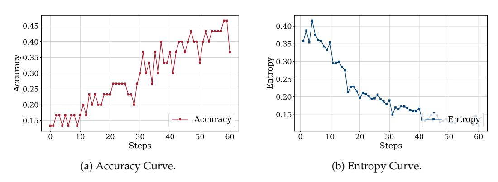

Figure 11: The entropy and accuracy curves of TTRL on AIME 2024 with Qwen2.5-Math-7B.

<span id="page-19-3"></span>Table 4: Additional results of **TTRL** on each task. \* indicates results from Dr. GRPO (Liu et al., 2025b). Our training data size matches the corresponding benchmark dataset size.

| Name                                                                                                                                | AIME 2024                                            | AMC                                                  | MATH-500                                             | Avg                                                  | Labeled Data                                         |
|-------------------------------------------------------------------------------------------------------------------------------------|------------------------------------------------------|------------------------------------------------------|------------------------------------------------------|------------------------------------------------------|------------------------------------------------------|
| Qwen2.5-Math-1.5B*                                                                                                                  | 20.0                                                 | 32.5                                                 | 33.0                                                 | 28.5                                                 | -                                                    |
| w/ TTRL<br>Δ                                                                                                                        | 20.0<br>0<br>0                                       | 53.0<br>+20.5<br>↑ 63.1%                             | <b>80.0</b><br>+47.0<br>↑ 142.4%                     | <b>51.0</b><br>+22.5<br>↑ <b>79.0</b> %              | X<br>X<br>X                                          |
| Qwen2.5-Math-1.5B-Instruct*<br>DeepSeek-R1-Distill-1.5B@3k*<br>DeepSeek-R1-Distill-1.5B@8k*<br>Oat-Zero-1.5B*                       | 10.0<br>2.5<br>20.0<br><b>20.0</b>                   | 48.2<br>21.7<br>49.4<br>53.0                         | 74.2<br>52.2<br>77.4<br>74.2                         | 44.1<br>25.5<br>48.9<br>49.1                         | 3.1M<br>800K<br>800K<br>8.9K                         |
| Qwen2.5-Math-7B*                                                                                                                    | 16.7                                                 | 38.6                                                 | 50.6                                                 | 35.3                                                 | -                                                    |
| w/ TTRL<br>Δ                                                                                                                        | 43.3<br>+26.6<br>↑ 159.3%                            | 67.5<br>+28.9<br>† 74.9%                             | 84.2<br>+33.6<br>↑ 66.4%                             | 65.0<br>+29.7<br>↑ 84.1%                             | X<br>X                                               |
| Qwen2.5-Math-7B-Instruct* DeepSeek-R1-Distill-7B@3k* SimpleRL-Zero-7B* PRIME-Zero-7B* OpenReasoner-Zero-7B@3k* Oat-Zero-7B* LIMR-7B | 16.7<br>10.0<br>26.7<br>16.7<br>13.3<br>43.3<br>32.5 | 53.0<br>26.2<br>60.2<br>62.7<br>47.0<br>62.7<br>63.8 | 83.6<br>60.1<br>78.2<br>83.8<br>79.2<br>80.0<br>78.0 | 51.1<br>32.1<br>55.0<br>54.4<br>46.5<br>62.0<br>58.1 | 3.1M<br>800K<br>8.9K<br>230K<br>129K<br>8.9K<br>1.4K |

## <span id="page-19-0"></span>C Training Metrics

Given the absence of ground-truth labels in the test data, evaluating the performance of **TTRL** throughout the training process presents a challenge. To mitigate this limitation, we introduce a set of training-time metrics specifically designed to monitor and assess the effectiveness of **TTRL**. These metrics inform the selection of the optimal checkpoint and provide valuable insights regarding training dynamics.

- **Entropy**: Measures the uncertainty of the model's generation.
- Majority Voting Reward: Rule-based rewards computed from the majority-voted label.
- Majority Ratio: The frequency of the most common answer within a rollout.

Furthermore, we define several metrics that rely on access to ground-truth labels, which allow for a deeper analysis of the model's behavior during training:

- Label Accuracy (maj@n): Indicates whether the estimated label matches ground-truth.
- **Reward Accuracy**: Indicates the proportion of majority voting rewards (computed from the estimated label) that match rewards computed from the ground-truth label.
- Ground-Truth Ratio: The frequency of the ground-truth answer within a rollout.

# <span id="page-19-1"></span>D Terminology

Test-time scaling refers to increasing computational resources during test time, which can be categorized into test-time training and test-time inference. These two approaches are complementary. We will provide an introduction below.

## <span id="page-19-2"></span>D.1 Test-Time Training (TTT)

Test-Time Training (TTT) is a technique for adapting a pre-trained model at inference time to improve generalization under distribution shifts. Let  $f_{\theta}$  denote a model trained on a

Table 5: Terminology relationship.

| Name                    | Category                                              | Methods                                                               |  |  |
|-------------------------|-------------------------------------------------------|-----------------------------------------------------------------------|--|--|
| Test-Time Scaling (TTS) | Test-Time Training (TTT)<br>Test-Time Inference (TTI) | Test-Time Reinforcement Learning (TTRL)<br>Majority Voting, Best-of-N |  |  |

source domain  $\mathcal{D}s = \{(x_i, y_i)\}i = 1^N$ , where  $x_i \in \mathcal{X}$ ,  $y_i \in \mathcal{Y}$ , and  $\theta$  represents the learned parameters. During standard inference, the model is evaluated on test samples  $x_t \sim \mathcal{D}_t$  with fixed parameters  $\theta$ , where  $\mathcal{D}_t \neq \mathcal{D}_s$ .

In contrast, TTT allows the model to adapt to each test sample  $x_t$  by minimizing an auxiliary self-supervised loss  $\mathcal{L}_{aux}$ , without access to labels  $y_t$ . The model parameters are updated online with the auxiliary task, which is typically designed to be label-free and consistent with the main task.

#### <span id="page-20-0"></span>D.2 Test-Time Inference (TTI)

Test-Time Inference (TTI) refers to the strategy of enhancing the performance of a large language model during inference by allocating additional computational resources. Formally, let  $f_{\theta}$  denote a language model with parameters  $\theta$ , and let x be an input prompt. The model generates an output y by sampling from the conditional distribution  $p_{\theta}(y \mid x)$ . TTI techniques aim to improve the quality of y by employing methods such as generating multiple candidate outputs and selecting the best one based on a scoring function, or by refining the output through iterative processes (Welleck et al., 2024).

One common approach involves generating N candidate outputs  $\{y_1, y_2, ..., y_N\}$  and selecting the optimal output  $y^*$  using a scoring function s(y, x):

<span id="page-20-1"></span>
$$y^* = \arg\max_{y_i} s(y_i, x) \tag{4}$$

The scoring function s(y, x) can be instantiated in various ways, such as:

- 1. Majority Voting (MV): Selecting the most frequent output among the candidates.
- 2. Best-of-N (BoN): Using reward models to score each candidate, then selecting the highest-scoring one.
- 3. Weighted BoN: Integrating MV and BoN strategies to leverage their respective strengths.