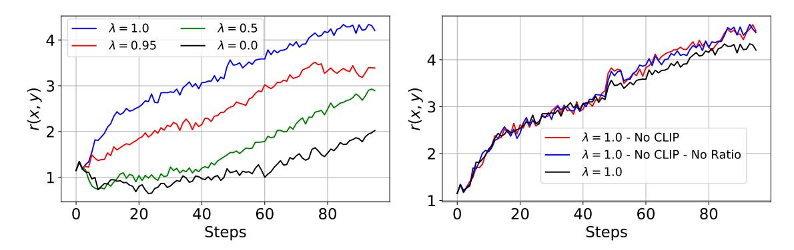
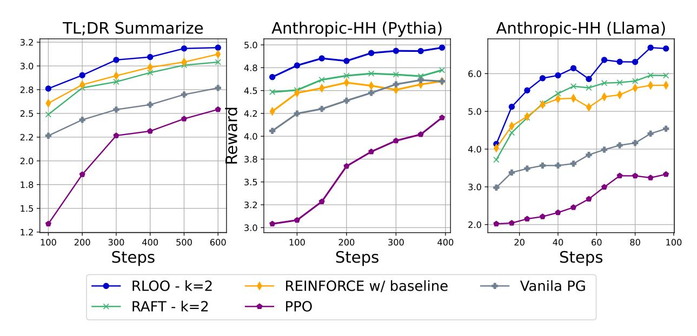
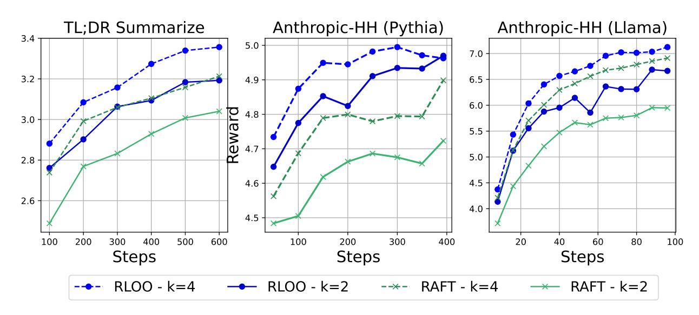
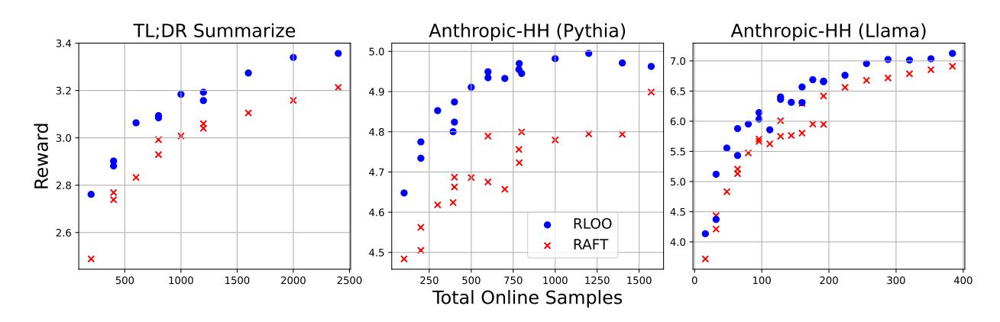
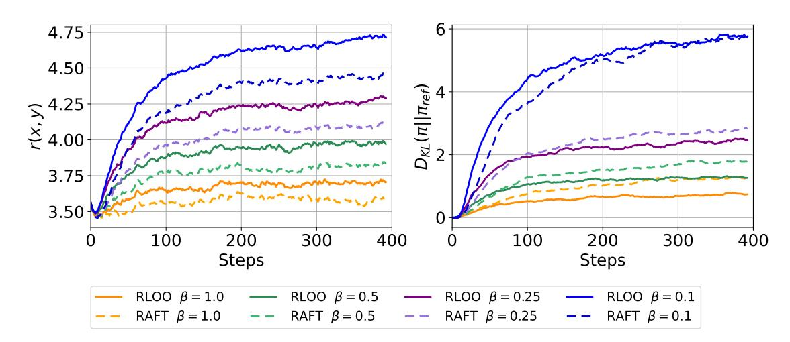
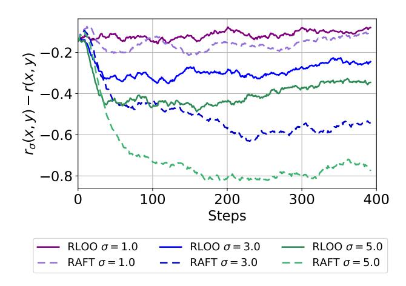
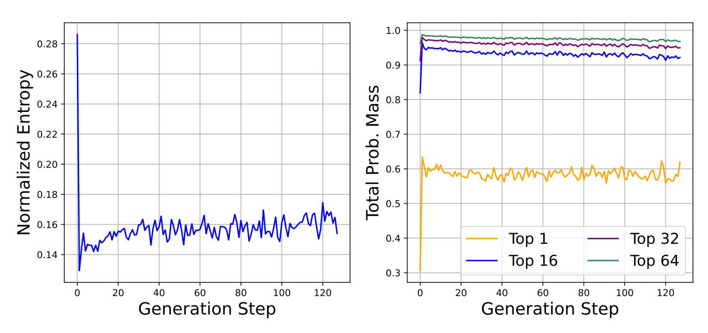

# Back to Basics: Revisiting REINFORCE Style Optimization for Learning from Human Feedback in LLMs

Arash Ahmadian Cohere For AI

Chris Cremer Cohere

Matthias Gallé Cohere

Marzieh Fadaee Cohere For AI

Julia Kreutzer Cohere For AI

Olivier Pietquin Cohere

Ahmet Üstün Cohere For AI

Sara Hooker Cohere For AI

{arash,olivier,ahmet,sarahooker}@cohere.com

#### Abstract

AI alignment in the shape of Reinforcement Learning from Human Feedback (RLHF) is increasingly treated as a crucial ingredient for high performance large language models. Proximal Policy Optimization (PPO) has been positioned by recent literature as the canonical method for the RL part of RLHF. However, it involves both high computational cost and sensitive hyperparameter tuning. We posit that most of the motivational principles that led to the development of PPO are less of a practical concern in RLHF and advocate for a less computationally expensive method that preserves and even increases performance. We revisit the formulation of alignment from human preferences in the context of RL. Keeping simplicity as a guiding principle, we show that many components of PPO are unnecessary in an RLHF context and that far simpler REINFORCE-style optimization variants outperform both PPO and newly proposed "RL-free" methods such as DPO and RAFT. Our work suggests that careful adaptation to LLMs alignment characteristics enables benefiting from online RL optimization at low cost.

# 1 Introduction

I suppose it is tempting, if the only tool you have is a hammer, to treat everything as if it were a nail. — Abraham Maslow, 1966.

State-of-art Large Language Models (LLMs) are typically pre-trained on tremendous amounts of text [\(Brown et al., 2020;](#page-17-0) [OpenAI et al., 2023;](#page-19-0) [Anil et al., 2023;](#page-16-0) [Touvron et al., 2023a;](#page-21-0)[b;](#page-21-1) [Üstün et al.,](#page-21-2) [2024\)](#page-21-2) spanning trillions of tokens. These training corpora often contain many complex preferences, relations, and intentions that may not all be desirable for an LLM to exhibit. A question of great interest to both the research and wider practitioner community is how to align these models to human preferences?

Despite being the focus of considerable research effort [\(Ouyang et al., 2022;](#page-20-0) [Bai et al., 2022b;](#page-17-1) [Lee](#page-18-0) [et al., 2023;](#page-18-0) [Tunstall et al., 2023;](#page-21-3) [Khalifa et al., 2021\)](#page-18-1), there is a lack of consensus regarding the optimal approach to achieve this goal. Reinforcement Learning from Human Feedback (RLHF), one of the most widely regarded alignment approaches, directly borrows from traditional RL literature and uses techniques such as Proximal Policy Optimization (PPO) to maximize the reward score produced by a reward model that is typically trained as a binary classifier on pairs of completions labeled by human annotators. While PPO has become a canonical approach cemented in popularity through its usage in the seminal literature on RLHF [\(Stiennon et al., 2020;](#page-21-4) [Nakano](#page-19-1) [et al., 2022;](#page-19-1) [Bai et al., 2022b\)](#page-17-1), getting PPO to work in practice is non-trivial for non-RL specialists and comes with known issues:

- 1. Computational Cost: PPO typically requires loading up to 4 models simultaneously: the generator, the reference (for KL estimation), the critic, and the reward model, where the training of the generative and critic models are interleaved [\(Schulman et al., 2017\)](#page-21-5). This challenge is further exacerbated by the size of modern LLMs, ranging in the billions of parameters [\(OpenAI et al., 2023;](#page-19-0) [Stiennon et al., 2020;](#page-21-4) [Touvron et al., 2023a\)](#page-21-0).
- 2. Optimization challenges: the unstable and sensitive nature of online RL optimization, and the relative algorithmic complexity of PPO requires niche expertise to tune it well [\(Engstrom](#page-17-2) [et al., 2020\)](#page-17-2).

Recent works propose "RL-free" methods such as DPO [\(Rafailov et al., 2023\)](#page-20-1), IPO [\(Azar et al.,](#page-16-1) [2023\)](#page-16-1) or iterative fine-tuning approaches to LLM preference training [\(Yuan et al., 2023;](#page-22-0) [Zhao et al.,](#page-22-1) [2023;](#page-22-1) [Dong et al., 2023\)](#page-17-3). However, these works fail to question whether a simpler solution within an RL paradigm exists. Instead, all these approaches attempt to answer this question by stripping all RL components from RLHF and the difficulties that come with it [\(Rafailov et al., 2023;](#page-20-1) [Zhao et al.,](#page-22-1) [2023;](#page-22-1) [Yuan et al., 2023;](#page-22-0) [Liu et al., 2023;](#page-19-2) [Dong et al., 2023;](#page-17-3) [Azar et al., 2023\)](#page-16-1). Iterative fine-tuning techniques rely solely on a powerful reward model to identify a subset of samples to train on, while DPO and IPO avoid both reinforcement learning and training a separate reward model by directly learning from human feedback.

In contrast to these approaches, we remain in the RL paradigm, but instead return to basics. The core question we seek to explore in this work is can we avoid the computational and optimization complexity of PPO while preserving performance?. We isolate several key differences between traditional Deep-RL settings which originally motivated PPO and typical human-preference learning settings for LLMs. We note that PPO, as an approach, emphasizes stability across iterations, aiming to train an effective policy with the premise of small, stable updates. PPO was designed for a regime where off-policy gradient updates are large enough to introduce instability. This regime dominates traditional Deep-RL benchmarks [\(Engstrom et al., 2020;](#page-17-2) [Schulman et al.,](#page-21-5) [2017\)](#page-21-5). However, in this work, we posit that the setting of RLHF, which involves fine-tuning a pre-trained LLM, is lacking in these characteristics.

In contrast to traditional Deep-RL settings, the initialization of the policy, in the form of a pre-

<span id="page-2-0"></span>

Figure 1: Training reward curves for PPO on Llama-7B based models with the HH dataset. **Left:** In an RLHF environment we observe that a higher emphasis on variance reduction at the cost of bias (low  $\lambda$ ) performs worse than forgoing variance reduction but introducing less bias (high  $\lambda$ ).  $\lambda = 1.0$  is the vanilla policy gradient which has the highest variance but no bias, and makes use of the full-trajectory reward in each update, performs the best. **Right:** PPO is unnecessarily complicated. Removing various augmentations of PPO such as clipping and loss normalization not degrade performance.

trained and supervised fine-tuned (SFT) model, is far from a random parameterization. While the conceivable search space is enormous, due to the pre-training and SFT stages, only a far smaller subset of tokens is likely to be generated as the probability mass is concentrated on these few tokens. Thus, while traditional Deep-RL settings require strong regularization to reduce the high variance of the gradient estimators; we observe empirically this is less of a practical concern in RLHF and motivate a less computationally expensive method that preserves robustness (Wu et al., 2018; Kreutzer et al., 2021).

Furthermore, we revisit how learning from human preferences is *formulated* in the context of RL where generating each token is modeled as an *action*, and each partial sequence, starting with the prompt, is seen as a *state*. In practice, this modeling assumption for PPO method is often voided. We argue and show that the modeling of partial sequences is unnecessary in this setting where rewards are only attributed to *full generations*, with no true rewards for any intermediary tokens in the generation. Thus, it is more appropriate and efficient to model the entire generation as a single action with the initial state determined by the prompt.

Given these observations, while keeping simplicity as a guiding principle, we explore the use of the REINFORCE estimator (Williams, 1992) and its multi-sample extension REINFORCE LEAVE-ONE-OUT (RLOO) (Kool et al., 2019) to optimize the sequence-level objective. We break apart PPO and show that the most basic policy gradient algorithm, Vanilla Policy Gradient REINFORCE consistently outperforms PPO. PPO is unnecessarily complicated for a pre-trained LLM environment. Unlike PPO, we can use REINFORCE to directly optimize the full trajectory (sequence) return coupled with unbiased baselines, whereas actor-critic algorithms (Sutton et al., 1999), such as PPO, bootstrap off intermediary state value-functions to reduce variance at the cost of introducing bias into the estimator.

We arrive at consistent results across models including Llama (Touvron et al., 2023a), Pythia (Biderman et al., 2023) and datasets such as the Anthropic Helpful & Harmless (Bai et al., 2022a)

and TL;DR Summarize (Stiennon et al., 2020):

- 1. **PPO** is not the right tool for doing RL in RLHF. We break apart PPO and show that the most "basic" policy gradient algorithm, Vanilla Policy Gradient REINFORCE (Sutton & Barto, 2020), is consistently outperforming PPO by 3.2% to 20.3% interms of win-rate, across all dataset and base model pairing.
- 2. RLOO outperforms key baselines. Built on top of REINFORCE, RLOO enables using multiple online samples, and we empirically show it consistently outperforms baselines such as PPO, DPO (Rafailov et al., 2023) as well as RAFT (Dong et al., 2023) across all datasets and models. We show that RLOO makes better use of online samples than RAFT while presenting a higher robustness to noise and degree of KL penalty.
- 3. Modeling partial completions is not necessary. We effectively demonstrate that modeling partial sequences is an unnecessary undertaking for LLM preference training. Instead, modeling the full generations preserves performance while reducing complexity in the RL stage and significantly accelerating learning.
- 4. **RLOO** is relatively robust to noise and **KL** penalty sensitivity. We also accompany our results with a multi-dimensional analysis concerning language fluency, diversity, and robustness to noise. We showcase RLOO robustness to noise and degree of KL penalty compared to RAFT.

# <span id="page-3-0"></span>2 Background

The original RLHF pipeline for LLMs proposed in Ziegler et al. (2020) consists of three stages:

- (1) SFT Stage: A pre-trained LM is instruction-tuned using a dataset consisting of a given instruction prompt, and (typically) a human-written completion. The LM/policy is trained with a cross-entropy loss over the completion only. Often, the SFT model, denoted as  $\pi^{\rm sft}$  is used to initialize both the reward model and the RLHF policy.
- 2) Reward Model Stage RLHF methods leverage a reward model  $r_{\phi}(x, y)$  trained using a dataset of preferences  $\mathcal{D} = \{(x, y_+, y_-)\}_{i=1}^N$  where  $y_+$  and  $y_-$  denote the preferred and not-preferred completions for the prompt x. The reward model is trained as a binary classifier with the following loss:

$$\mathcal{L}_{RM} = -\log \sigma(\log(r_{\phi}(x, y_{+}) - r_{\phi}(x, y_{-}))$$
(1)

where  $\sigma$  denotes the logistic function.

(3) RL Stage: In this stage, the reward model is used to provide online feedback in the optimization of the policy with the following objective:

$$\max_{\pi_{\theta}} \mathbb{E}_{x \sim \mathcal{D}, y \sim \pi_{\theta}(.|x)} [r_{\phi}(x, y) - \beta D_{\text{KL}} \pi_{\theta}(.|x) || \pi_{\text{ref}}(.|x)]$$
(2)

where β is meant to control the distance from the initial policy, πref during the optimization of rθ(x, y) as proposed in [\(Stiennon et al., 2022\)](#page-21-9). The KL-penalty is crucial as penalty-free optimization of the reward model leads to degradation in the coherence of the model. Optimizing this objective is equivalent to maximizing the following KL-shaped reward in expectation:

$$R(x,y) = r_{\phi}(x,y) - \beta \log \frac{\pi_{\theta}(y|x)}{\pi_{\text{ref}}(y|x)}$$
(3)

While reinforcement learning approaches share the components above, techniques differ in the formulation of the reward. To understand these differences, we introduce PPO and distinct alternatives such as REINFORCE and REINFORCE Leave-One-Out in the following sections.

#### <span id="page-4-1"></span>2.1 PPO

When using PPO in the RL stage, the initial state is determined by the prompt, each generated token is modeled as an action, and partial sequences are seen as states, with a discount factor (γ ∈ [0, 1]) of 1 used. In this framework, only generating the <EOS> token carries a reward as output by the reward model which is combined with KL penalty, while for all other tokens in the vocabulary, only the KL component is non-zero:

<span id="page-4-3"></span>
$$R(x,y) = \sum_{t=1}^{T} R_t(x,y_t)$$
 (4)

where y<sup>t</sup> denotes the t-th token of y, T the number of tokens in the trajectory, and R<sup>i</sup> the correspondingly shaped reward.

In practice, the following token-level clipped objective is used in PPO:

$$\min\left(f(y_t|s_t)\hat{A}_{\lambda}(y_t,s_t),\operatorname{clip}_{1-\epsilon}^{1+\epsilon}(f(y_t|s_t))\hat{A}_{\lambda}(y_t,s_t)\right) \text{ with } f(y_t|s_t) = \frac{\pi_{\theta}(y_t|s_t)}{\pi_{\text{old}}(y_t|s_t)},\tag{5}$$

where s<sup>t</sup> = {y<t, x} represents the state i.e. context at generation step t that is composed of the history of generated tokens y<t and the given prompt x, πold is an older policy (not the same as πref ), and Aˆ(y<sup>t</sup> , st) is the estimated advantage function for generating token (action) y<sup>t</sup> , at partial completion (state) at token t − 1 of the generation, and ϵ is the clipping ratio. The advantage function is estimated using Generalized Advantage Estimation (GAE) [\(Schulman et al., 2018\)](#page-21-10).

### <span id="page-4-2"></span>2.2 REINFORCE

Given that in LLM applications, r(x, y) is only obtained at the end of the full sequence, it may be more appropriate to model the entire generation as a single action, as opposed to each token. Although it has not been explored in the context of LLM alignment, modeling the full completion as a single action, as in the bandit formulation, allows using the REINFORCE estimator [\(Kreutzer](#page-18-4) [et al., 2017;](#page-18-4) [Nguyen et al., 2017a;](#page-19-3) [Williams, 1992\)](#page-21-6). This allows for back-propagating through the discrete action (generation) space, and directly optimize the KL-shaped reward objective for the entire sequence.

<span id="page-4-0"></span>
$$\mathbb{E}_{x \sim \mathcal{D}, y \sim \pi_{\theta}(.|x)}[R(y, x) \nabla_{\theta} \log \pi_{\theta}(y|x)]$$
(6)

To improve learning, one can reduce the variance of the estimator in Eq. [6,](#page-4-0) while keeping it unbiased, by subtracting a baseline b that has high covariance with the stochastic gradient estimate of Eq. [6](#page-4-0) [\(Williams, 1992;](#page-21-6) [Mnih & Gregor, 2014\)](#page-19-4):

$$\mathbb{E}_{x \sim \mathcal{D}, y \sim \pi_{\theta}(.|x)} [(R(y, x) - b) \nabla_{\theta} \log \pi_{\theta}(y|x)]$$
(7)

With a strong parameter-free choice for the baseline being the moving average of all rewards throughout training [\(Williams, 1992\)](#page-21-6):

<span id="page-5-0"></span>
$$b_{\rm MA} = \frac{1}{S} \sum_{s} R(x^s, y^s) \tag{8}$$

Where S is the number of training steps, and (x s , y<sup>s</sup> ) is the prompt-completion pair at the step s.

### <span id="page-5-1"></span>2.3 REINFORCE Leave-One-Out (RLOO)

The baseline in Eq. [8](#page-5-0) is simple to implement and computationally cheap. However, it can be improved upon if we have access to multiple online samples, that can be used for further unbiased variance reduction: (1) The rewards for each sample can serve all other samples as a baseline. (2) Policy updates can be done on an average of gradient estimates for each sample, resulting in a variance-reduced multi-sample Monte-Carlo (MC) estimate. This is the intuition behind the REINFORCE Leave-One-Out (RLOO) estimator, proposed by [\(Kool et al., 2019\)](#page-18-3):

$$\frac{1}{k} \sum_{i=1}^{k} [R(y_{(i)}, x) - \frac{1}{k-1} \sum_{j \neq i} R(y_{(j)}, x)] \nabla \log \pi(y_{(i)}|x) \text{ for } y_{(1)}, ..., y_{(k)} \stackrel{i.i.d}{\sim} \pi_{\theta}(.|x)$$

Where k refers to the number of online samples generated, RLOO<sup>k</sup> considers each y(i) individually and uses the remaining k − 1 samples to create an unbiased estimate of the expected return for the prompt, akin to a parameter-free value-function, but estimated at each training step. This is a much more effective baseline (as our experiments will show) than bMA since it's created on-the-fly for each sample and at each training step, but comes at a cost of increased sampling time during training. We note that generating extra samples as a means of variance reduction has been proposed by concurrent work [\(Li et al., 2023\)](#page-19-5), but we focus on RLOO here because of the efficiency benefits of fully utilizing all samples.

### 2.4 Alternatives to RL in Preference Training

In the context of RLHF a substantial number of works propose "RL-free" methods which do not involve stage 3. We will benchmark RL approaches such as PPO, REINFORCE, and RLOO against these alternative methods such as "Direct Preference Optimization (DPO)" and RAFT [\(Dong et al.,](#page-17-3) [2023\)](#page-17-3).We briefly introduce both below.

Iterative Fine-tuning Iterative fine-tuning methods use the trained reward model to rank completions of online or offline sampled prompts, and then iteratively fine-tune the policy on a selected subset [\(Gulcehre et al., 2023;](#page-17-5) [Dong et al., 2023\)](#page-17-3). We note that this trick of using rewards from reinforcement/bandit learning coupled with supervised learning objectives is also known as bandit-to-supervised conversion and had empirical success in offline RL for NLP problems with large action spaces before RLHF with LLMs [\(Lawrence & Riezler, 2018;](#page-18-5) [Kreutzer et al., 2018\)](#page-18-6).

We benchmark Reward rAnked FineTuning (RAFT; [Dong et al., 2023\)](#page-17-3), a simple cross-entropy loss is used on the best-ranked completion out of k online samples, based on R(x, y) or r(x, y). We note that RAFT does not make full use of all samples because it only optimizes using filtered top-ranked samples. In contrast, RLOO fully leverages constructing a baseline and a multi-sample MC estimate for the policy gradient.

Direct Preference Optimization (DPO) Unlike other methods, DPO [\(Rafailov et al., 2023\)](#page-20-1) skips the reward modeling stage in the traditional RLHF pipeline and uses preference pairs to directly optimize the policy with the following loss:

$$-\log \sigma(\beta \log \frac{\pi_{\theta}(y_{+}|x)}{\pi_{\text{ref}}(y_{+}|x)} - \beta \log \frac{\pi_{\theta}(y_{-}|x)}{\pi_{\text{ref}}(y_{-}|x)})$$

# 3 From PPO to REINFORCE

We scrutinize individual components of PPO that we consider not an ideal fit for RLHF. We explain the theoretical origin, motivate with the practical conditions of LLM RLHF, and provide empirical support from preliminary experiments.

### 3.1 Revisiting the need for low-variance estimators

Actor-critic algorithms, such as PPO, were motivated in formulation by the high variance observed in traditional RL settings. PPO leverages lower-variance estimators of the total trajectory return to improve learning. These estimators are constructed by bootstrapping off a state-value function [\(Sutton et al., 1999;](#page-21-7) [Schulman et al., 2018;](#page-21-10) [Sutton & Barto, 2020\)](#page-21-8). While bootstrapping reduces variance, the trade-off is the introduction of bias which risks optimizing for biased rewards.

In contrast, REINFORCE uses an unbiased Monte-Carlo estimator of the trajectory return that can have high variance in theory, especially if it is approximated with only a single sample, which is not frequently preferred in traditional Deep-RL environments. Recent work has offered a plethora of evidence that REINFORCE suffers from high variance and fails in the presence of large action spaces like NLP [\(Ranzato et al., 2016;](#page-20-2) [Bahdanau et al., 2017;](#page-16-3) [Ding & Soricut, 2017;](#page-17-6) [Ammanabrolu](#page-16-4) [& Hausknecht, 2020;](#page-16-4) [Ammanabrolu et al., 2022;](#page-16-5) [Martin et al., 2022;](#page-19-6) [Korbak et al., 2022\)](#page-18-7). However, we note that these findings were based on scenarios with poor conditioning when training from random or weak initialization as opposed to warm-starting it from a strong pre-trained model.

Here, we question whether this empirical evidence holds for RLHF. We posit that this is not a practical concern in fine-tuning LLMs due to the extremely strong initialization of the policy (a pre-trained LLM). In this setting, strong initialization coupled with prompt conditioning leads to the concentration of probability mass on a few tokens at each generation step, even though the number of possible actions is in theory enormous (refer to Appendix [A](#page-23-0) for further discussion on the effect of conditioning). The optimization landscape is far less likely to present problems like destructively large and high-variance gradient updates. Thus, attempting to reduce variance further at the cost of introducing bias is not worth it.

Empirical support To validate this hypothesis, we vary the weight placed upon variance minimization and bias introduction. In the formulation of PPO in Sect. [2.1,](#page-4-1) the advantage estimator GAE (Schulman et al., 2018) is relied upon to trade-off bias and variance when estimating the true advantage function in PPO (Schulman et al., 2018).

GAE introduces a hyper-parameter  $\lambda \in [0,1]$  in the true advantage function, which balances bias and variance of the constructed estimator. The closer  $\lambda$  is to 1, the higher the observed variance. The optimal choice of where to set  $\lambda = 0$  depends on the environment. In a highly stochastic environment, minimizing variance at the cost of bias is a worthy trade-off. However, given a stable environment where variance is already low, the introduction of bias is needless.

At the extreme of 1 which imposes minimal bias at the trade-off of variance, the advantage term reduces to return the estimator used in Vanilla Policy Gradient (PG) REINFORCE, which directly builds on the REINFORCE estimator, by optimizing the trajectory returns starting from each token in the generation

$$\sum_{i=t}^{T} \gamma^{T-i-1} R_t(x, y_t) - b_{\phi}(s_t)$$
 (9)

where  $b_{\phi}(s_t)$  is a learned baseline state  $s_t$ , akin to how a value network is learned in the traditional RL setting, using a standard MLE loss  $\frac{1}{2}(\sum_{i=t}^{T} \gamma^{T-i-1}R_i(x,y_i) - b_{\psi}(s_t))^2$ . Note that the key distinguishing factor between Vanilla PG and REINFORCE as referred to in this work, is that Vanilla PG uses the REINFORCE estimator on the trajectory return starting from the context formed by the prompt and a partial completion, whereas the REINFORCE estimator described in Section 2.2 is applied to the the full trajectory return. We will return to this distinction in the results Section 5.1 when we evaluate whether evaluating partial completions is necessary in RLHF.

In Figure 1, we present the results of evaluating the reward for PPO given GAE with different value of  $\lambda$ . Two variants impose minimal bias but invite high variance (( $\hat{A}_{\lambda=1.00}$  (Vanilla PG introduced above), and  $\hat{A}_{\lambda=0.95}$ ) and two variants which over-index on minimizing variance at the cost of bias ( $\hat{A}_{\lambda=0.0}$ , and  $\hat{A}_{\lambda=0.5}$ ). Figure 1 plots the reward and observe that the most extreme variant Vanilla PG (unbiased  $A_{\lambda=1.0}$ ) performs the best given it presents no bias at the risk of high variance. We observe a monotonically decreasing reward with decreasing  $\lambda$ . This supports our hypothesis that reducing variance at the cost of bias in an RHLF setting needlessly introduces bias given the stable default properties of the environment.

### 3.2 Clipping is Rarely Necessary in RLHF

Next, we turn to the clipping-ratio  $\epsilon$  (see Eq. 5), which is used to prevent large policy updates when  $\frac{\pi_{\theta}}{\pi_{old}}$  deviates far from 1, i.e., to prevent updates that are too far off from the current policy (Schulman et al., 2017).

In Figure 1, we compare reward curves for independent PPO training with and without clipping. Note that we also turn off clipping for the value network, for these set of experiments, as it has been observed to have a noticeable impact on learning in traditional Deep-RL environments (Engstrom et al., 2020). The removal of these components does not impact learning meaningfully. We empirically found in our RLHF setting that the loss is actually clipped on average < 5% of the time per batch, throughout training across all dataset and base-model pairings, which indicates that the learning regime is close to being "on-policy", with policies varying slowly from one iteration to the other.

To further validate this, we completely turn off clipping followed by removing the ratio  $\frac{\pi_{\theta}}{\pi_{old}}$ , while  $\lambda = 1$ , which reduces the PPO loss to that of Vanilla PG. If anything the removal of clipping gives a slight boost in performance, validating our hypothesis that large off-policy updates in our optimization regime are rare and do not have catastrophic effects on learning as they do in traditional Deep-RL.

### 3.3 Modeling Partial Completions is Not Necessary

As described in Sect. 2, PPO models each token as an action whereas REINFORCE models the entire generation as a single action, as opposed to each token. In practice, in LLM RLHF a r(x,y) is only attributed to the <EOS> token, where for all other tokens, only  $\log \frac{\pi(y_t|s_t)}{\pi_{\text{ref}}(y_t|s_t)}$  composes  $R_t(x,y)$ , which is not meaningful.

From a pure RL point of view, the environment dynamics are fully deterministic  $(P_D(\{y_{< t+1,x}\}|s_t,y_t)=1)$ , meaning that our environment (context) changes deterministically based on the new token/action predicted. Hence, the problem can be reduced to a bandit problem, where the Markov Decision Process (MDP) consists of only the initial state as determined by the prompt, and the terminal state, which is always reached after the generation (Kreutzer et al., 2017; Nguyen et al., 2017b). Note that modeling the entire generation as a single action is done explicitly by REINFORCE but is also done implicitly with iterative fine-tuning methods which generate the entire completion before filtering using a reward model.

In the results section 5.1 we will explicitly compare REINFORCE and RLOO which both model the full trajectory return to PPO and Vanilla PG which both model the partial completion. We ask is modeling the entire generation as a single action sufficient to achieve similar or better performance in RLHF?

# 4 Experimental Setup

### 4.1 Training Details

**Datasets** We report results on the TL;DR Summarize (Stiennon et al., 2020) and Anthropic Helpful and Harmless Dialogue (Bai et al., 2022a) datasets. The training split of TL;DR Summarize <sup>1</sup> dataset contains 116k human-written instructions and 93k human-annotated preference pairs. The preprocessed Anthropic-HH<sup>2</sup> dataset contains 112k training preference pairs.

**Models** For both datasets, we use Pythia-6.9B (Biderman et al., 2023) as the pretrained base-model. To ablate the effect of the pre-trained model quality on learning from human preferences, we also experiment with Llama-7B (Touvron et al., 2023a) coupled with the Anthropic-HH dataset.

To ensure a fair comparison across all methods, we use a context length of 512 tokens during both supervised fine-tuning and the reward model training. We initialize both the reward model and policy with the corresponding SFT checkpoint, unless noted otherwise.

<span id="page-8-0"></span><sup>&</sup>lt;sup>1</sup>https://github.com/openai/summarize-from-feedback

<span id="page-8-1"></span><sup>&</sup>lt;sup>2</sup>https://huggingface.co/datasets/Dahoas/full-hh-rlhf

Experimental Details For the TL;DR Summarize dataset, we use the dedicated SFT split. Since the original Antrophic-HH dataset does not include a separate SFT split, we use prompts and the preferred responses from the binary comparisons during the SFT stage similar to prior work (Yuan et al., 2023; Dong et al., 2023; Rafailov et al., 2023). In the preference training stage, we use the same prompts as in the SFT stage to generate completions. Further details on the experimental setup and hyper-parameters are given in Appendix C

<span id="page-9-0"></span>

Figure 2: **Test rewards plotted throughout training.** RLOO outperforms all other methods consistently, while Vanila PG consistently outperforms PPO. REINFORCE w/ baseline refers to REINFORCE with a moving average reward baseline as in Equation 8

<span id="page-9-1"></span>

Figure 3: Comparing Sample Efficiency RLOO vs RAFT plot of test reward throughout training with  $k = \{2, 4\}$ . For both values of k, RLOO outperforms RAFT given the same budget. RLOO<sub>k=2</sub> outperforms/matches RAFT<sub>k=4</sub> on both datasets, with a Pythia base model.

#### 4.2 Evaluation

Optimization Quality For all online methods (all methods except DPO), to measure how well the method optimizes the intrinsic objective , we report average rewards (using the training RM) on 1000 samples from the test set. To measure how well each method optimizes the extrinsic objective of aligning the models to human preference, on the same test samples, we report simulated win-rates in accordance with Alpacafarm framework [\(Dubois et al., 2024\)](#page-17-7) where we use GPT-4 as a proxy for human evaluation. We measure win-rates against reference SFT completions for the TL;DR dataset, and preferred completions for the HH dataset. At evaluation, we use greedy sampling unless otherwise noted.

Alignment Tax RLHF fine-tuning is often associated with a drop in diversity and language fluency which is referred to as alignment tax [\(Askell et al., 2021;](#page-16-6) [Kirk et al., 2024\)](#page-18-8). Hence, we also report metrics that serve as proxies for fluency and diversity similar to [\(Dong et al., 2023\)](#page-17-3). To measure fluency, we report perplexity measured using the preferred completions from the test set, similar to [Dong et al.](#page-17-3) [\(2023\)](#page-17-3). Finally, we measure average completion length and diversity using average n-gram diversity [\(Li et al., 2016\)](#page-19-8).

# <span id="page-10-1"></span><span id="page-10-0"></span>5 Results and Discussion

### 5.1 Reward Optimization

The objective of RLOO, REINFORCE with a (moving average) baseline, RAFT, PPO, and vanilla PG is to maximize the reward score, hence we compare the success of optimization for each method. On each dataset and base-model pair, we use the same reward model for all the methods, thus their test reward scores are directly comparable.

Modeling Partial Completions vs Full Generations As shown in Figure [2,](#page-9-0) we find that methods that do not model partial completions such as REINFORCE with baseline and RLOO, consistently outperform Vanilla PG and PPO where each token is modeled as an action (i.e. partial completions). Moreover, aside from their superior performance in reward optimization, these methods require loading one less model copy compared to Vanilla PG and PPO, and different means to create a baseline. This is because they eliminate the need for training a learned baseline and a value network, as required in Vanilla PG and PPO, respectively. This suggests that modeling partial sequences is unnecessary in the context of RLHF.

Sampling Efficiency Given the same sampling budget (k online samples for each prompt), RLOO consistently outperforms RAFT throughout training as depicted in Figure [3.](#page-9-1) Noticeably, despite a smaller sampling budget, RLOOk=2 either closely matches or outperforms RAFTk=4, across all datasets and models. In this setting, RLOO uses only half the online-sample budget compared to RAFT given the same step count.

This confirms that RLOO leads to better optimization by using all the samples generated, unlike RAFT where only the top-ranked sample is used for fine-tuning. Showcasing the same finding, Figure [4](#page-11-0) plots the rewards with respect to the number of samples generated during training regardless of the k value.

<span id="page-11-0"></span>

<span id="page-11-1"></span>Figure 4: **Sample Efficiency** RLOO and RAFT test rewards are plotted at various points throughout training based on the total number of samples seen normalized by batch size (regardless of whether k = 2 or k = 4). RLOO is more efficient than RAFT in terms of online sample use, in both datasets and models.

| Method                                             | TL;DR                      | HH (Pythia)                         | HH (Llama)                          |
|----------------------------------------------------|----------------------------|-------------------------------------|-------------------------------------|
| RLOO (k=4)<br>RAFT (k=4)                           | <b>77.9</b> 73.2           | <b>43.7</b> 42.1                    | <b>64.1</b> 63.3                    |
| RLOO (k=2)<br>RAFT (k=2)                           | <b>74.2</b> 72.1           | <b>47.6</b> 37.7                    | <b>62.2</b> 58.4                    |
| REINFORCE. W/ BASELINE<br>VANILLA PG<br>PPO<br>DPO | <b>70.7</b> 70.4 67.6 66.6 | 37.9<br>36.4<br>29.2<br><b>39.0</b> | 55.3<br>52.3<br>32.0<br><b>61.9</b> |

Table 1: Final win-rates on generations for held-out test prompts in the Anthropic-HH and TL;DR Summarize datasets. Metrics are reported for the checkpoint with the highest test reward.

#### 5.2 Simulated win-rates

Table 1 presents the win-rates against the original completions in TL;DR Summarize and Antrophic-HH for each method. Here, we also include DPO.

Modeling partial completions is not necessary Recall that the key distinguishing factor between Vanilla PG and REINFORCE as referred to in this work, is that while Vanilla PG treats each token as an action, REINFORCE operates on the entire generation. As seen in Table 1, REINFORCE with baseline is on par with Vanilla PG on both TL;DR (70.7 vs 70.4) and HH (37.9 vs 36.4) datasets when using Pythia-based models. Moreover, REINFORCE with baseline outperforms Vanilla PG in HH dataset with a Llama-based model, achieving a higher win-rate (55.3 vs 52.3).

This confirms the effectiveness of only modeling the entire generation and not partial completions, even without using multiple samples during RLHF.

Win-rates are inline with test reward scores RLOO with k = 4 achieves the highest win-rates, outperforming PPO by 10.3, 14.5, and 32.1 for TL;DR, HH (Pythia) and HH (Llama), respectively.

<span id="page-12-0"></span>

| Method                 | Length | PPL  | Diversity-1 | Diversity-2 | Reward-Var. |
|------------------------|--------|------|-------------|-------------|-------------|
| RLOO (k=4)             | 60.6   | 27.6 | 0.10        | 0.43        | 3.1         |
| RAFT (k=4)             | 62.4   | 30.1 | 0.10        | 0.43        | 3.2         |
| RLOO (k=2)             | 58.6   | 29.2 | 0.11        | 0.44        | 3.0         |
| RAFT (k=2)             | 52.8   | 28.9 | 0.12        | 0.47        | 3.1         |
| REINFORCE. W/ BASELINE | 47.2   | 27.2 | 0.13        | 0.50        | 2.7         |
| Vanilla PG             | 39.1   | 39.0 | 0.15        | 0.54        | 3.7         |
| PPO                    | 16.5   | 40.4 | 0.34        | 0.60        | 2.3         |
| DPO                    | 104.4  | 33.8 | 0.08        | 0.39        | N/A         |

Table 2: Language Fluency and Diversity Metrics on the Anthropic-HH dataset.

As the only exception, RLOO achieves the highest win-rate with k=2 in HH dataset.

**RLOO** is more sample efficient than RAFT Comparing RLOO with RAFT, under the same sampling budget k, RLOO consistently outperforms RAFT in all datasets and models. When averaged across the three dataset and model pairings, RLOO achieves win-rates of 61.3 and 61.9 for k=2 and k=4, respectively, while RAFT scores 56.1 and 59.5, respectively. Notably, RLOO exhibits the highest increase in win-rate compared to RAFT, up to 9.9 as in the HH dataset with k=2 and Pythia-based models (second column in Table 1).

#### 5.2.1 Alignment Tax

Table 2 shows various intrinsic evaluation metrics including perplexity and diversity scores of Llamabased models in Antrophic-HH datasets.

Length of Generations Noticeably, the DPO trained model tends to be over-verbose (the longest generation length of 104 tokens on average) while the PPO trained model leads to short generations (the shortest on average with 16 tokens). We provide example responses in Appendix E.

**Perplexity and Diversity** As seen in Table 2, perplexity (PPL) scores are relatively close amongst RLOO, RAFT, and REINFORCE with baseline where all three methods achieve significantly lower perplexity than PPO and Vanilla PG.

In terms of diversity, Diversity-1 scores are similar across RLOO, RAFT, REINFORCE with baseline and Vanilla PG. Diversity-2 scores tend to slightly decrease for the methods with higher reward optimization (Askell et al., 2021). This is unsurprising given the significant difference in their generation length compared to other methods. Overall, RLOO and REINFORCE with a baseline maintain fluency and diversity in generations in comparison with other methods while achieving higher reward scores and win-rates.

Reward variance Lower reward variance is desirable for applications such as safety and harmlessness where there is a high risk associated with generating a low-reward sample. Results in Table 2 show that RLOO for the same k value leads to slightly lower reward variance amongst the generations, compared to RAFT which is the most competitive method to RLOO in terms of reward optimization. Finally, Vanilla PG leads to the highest reward variance. REINFORCE with baseline,

<span id="page-13-0"></span>

Figure 5: **Sensitivity to KL weight** Training curve for r(x, y) (left)  $D_{KL}$  (right) and with k = 2. Under higher KL, RAFT is not only worse than RLOO at optimizing reward, but also deviates further from the reference policy. Curves are exponentially smoothed for better readability.

however, empirically results in 27% less variance, even though it either outperforms or is on par with Vanilla PG in terms of reward optimization and win-rates.

#### 5.2.2 Robustness

As previously noted, a major drawback of RAFT is that it only optimizes on the highest-ranked sample and discards the rest of the online samples. Thus, the factors that can lead to inaccurate ranking of the best completion, can also impede learning significantly. We demonstrate this fragility by showing the effects of 1) high  $\beta$  for the KL-term and 2) inserted reward noise on RAFT in comparison to RLOO.

Mismatch from KL-penalty In Figure 5, we show the evolution of the KL distance and test reward curve r(x,y) throughout training for RLOO and RAFT, using k=2, on the HH dataset using Pythia-based models. We vary the KL regularization, using  $\beta = \{0.25, 0.5, 1\}$ . Here, a larger KL penalty in R(x,y) (higher  $\beta$ ) potentially increases mismatches between rankings of the k online samples. However, the choice of  $\beta$  often depends on multiple factors such as the distribution of the data and output logits of the base model, which may not allow for a low  $\beta$  value even with early-stopping.

We find that RAFT is more sensitive to higher KL regularization. In a low-regularized regime ( $\beta = \{0.1\}$ ), RLOO and RAFT converge to equal KL distances from the reference policy while RLOO achieves a higher reward. However increased regularization with  $\beta = \{0.25, 0.5, 1.0\}$ , not only RAFT is worse at optimizing the reward, but also deviates more from the reference policy.

Mismatch from Reward Noise The reward model is itself a noisy proxy of reward signal due to the inherently noisy nature of human preference (Nguyen et al., 2017b; Kreutzer et al., 2018). Inspired by literature in Bayesian deep learning on modeling *Aleatoric* uncertainty (Kendall & Gal, 2017; Collier et al., 2021), to simulate the effect of such noise in different degrees, for each prompt, we add noise to the rewards. Concretely, we add noise  $\epsilon$  to the output logits of the binary classifier:

<span id="page-14-0"></span>

Figure 6: Sensitivity to noise Drop in training rewards upon the addition of noise with σ = {1.0, 3.0, 5.0} .RAFT shows a more significant drop in reward compared to RLOO. Curves are exponentially smoothed for better readability.

$$r_{\sigma}(x,y) = r(x,y) + \epsilon \text{ where } \epsilon \sim \mathcal{N}(0,\sigma^2).$$

Figure [6](#page-14-0) shows the drop in reward at different levels for noise σ = {1.0, 3.0, 5.0}. As expected, the unaltered training reward decreases for both RLOO and RAFT. However, the drop is far more pronounced for RAFT with σ = {3.0, 5.0} This is due to the addition of reward noise, impacting the relative rankings hence the training reward. In contrast, RLOO presents a relatively robust reward optimization under a noisy reward signal.

### 6 Conclusion

At a high level, this work posits that the RLHF setting of fine-tuning an LLM has a strong initialization of the policy, which coupled with further conditioning on a prompt, alleviates historical concerns with high variance and large action spaces. We support this position with empirical results, showing that vanilla policy gradient REINFORCE (Vanilla PG) outperforms PPO although it is rarely used in traditional Deep-RL settings due to high variance. Furthermore, we revisit how the problem of learning from human preferences is modeled and empirically show that the REINFORCE estimator, despite its simplicity, enables high-quality reward optimization.

Finally, our experiments demonstrate that RLOO as a multi-sample extension of REINFORCE, outperforms RAFT, DPO, and PPO while retaining high robustness relative to iterative fine-tuning methods like RAFT — achieving a best of both worlds sweet spot.

### 7 Limitations

As one of the limitations of our work, we do not study reward model (RM) over-optimization, which refers to the problem when the optimization trajectory of the proxy reward, diverges from the "gold" reward objective [\(Gao et al., 2022\)](#page-17-9). This aspect has not been studied yet also for iterative fine-tuning methods such as RAFT and deserves a dedicated study. We leave this to future work.

Another limitation is the exploration of the LOO baseline in a single token action framework, where partial sequences are modeled and intermediary rewards are provided. In this work, we show that modeling partial sequences is an unnecessary undertaking in the RLHF context where rewards are attributed only to full sequences.

Finally, we limit our work to simulated win-rates from an LLM but do not measure correlation with final human evaluation preferences. We also did not explore RL training using other rewards such as ROUGE, BLEU, or other metrics used in NLP.

# 8 Acknowledgement

We would like to thank Ivan Zhang, Phil Blunsom, Florian Strub, Max Bartolo, Bharat Venkitesh, Roger Grosse, and Keiran Paster for helpful discussions. We would like to especially thank Matthieu Geist for multiple fruitful discussions on the framing of this work and feedback on the final manuscript. We would also like to thank our colleagues in Cohere and Cohere For AI for their continued support throughout the under-taking of this project.

# References

<span id="page-16-4"></span>Prithviraj Ammanabrolu and Matthew Hausknecht. Graph constrained reinforcement learning for natural language action spaces, 2020.

<span id="page-16-5"></span>Prithviraj Ammanabrolu, Liwei Jiang, Maarten Sap, Hannaneh Hajishirzi, and Yejin Choi. Aligning to social norms and values in interactive narratives. In Marine Carpuat, Marie-Catherine de Marneffe, and Ivan Vladimir Meza Ruiz (eds.), Proceedings of the 2022 Conference of the North American Chapter of the Association for Computational Linguistics: Human Language Technologies, pp. 5994–6017, Seattle, United States, July 2022. Association for Computational Linguistics. doi: 10.18653/v1/2022.naacl-main.439. URL <https://aclanthology.org/2022.naacl-main.439>.

<span id="page-16-0"></span>Rohan Anil, Andrew M. Dai, Orhan Firat, Melvin Johnson, Dmitry Lepikhin, Alexandre Passos, Siamak Shakeri, Emanuel Taropa, Paige Bailey, Zhifeng Chen, Eric Chu, Jonathan H. Clark, Laurent El Shafey, Yanping Huang, Kathy Meier-Hellstern, Gaurav Mishra, Erica Moreira, Mark Omernick, Kevin Robinson, Sebastian Ruder, Yi Tay, Kefan Xiao, Yuanzhong Xu, Yujing Zhang, Gustavo Hernandez Abrego, Junwhan Ahn, Jacob Austin, Paul Barham, Jan Botha, James Bradbury, Siddhartha Brahma, Kevin Brooks, Michele Catasta, Yong Cheng, Colin Cherry, Christopher A. Choquette-Choo, Aakanksha Chowdhery, Clément Crepy, Shachi Dave, Mostafa Dehghani, Sunipa Dev, Jacob Devlin, Mark Díaz, Nan Du, Ethan Dyer, Vlad Feinberg, Fangxiaoyu Feng, Vlad Fienber, Markus Freitag, Xavier Garcia, Sebastian Gehrmann, Lucas Gonzalez, Guy Gur-Ari, Steven Hand, Hadi Hashemi, Le Hou, Joshua Howland, Andrea Hu, Jeffrey Hui, Jeremy Hurwitz, Michael Isard, Abe Ittycheriah, Matthew Jagielski, Wenhao Jia, Kathleen Kenealy, Maxim Krikun, Sneha Kudugunta, Chang Lan, Katherine Lee, Benjamin Lee, Eric Li, Music Li, Wei Li, YaGuang Li, Jian Li, Hyeontaek Lim, Hanzhao Lin, Zhongtao Liu, Frederick Liu, Marcello Maggioni, Aroma Mahendru, Joshua Maynez, Vedant Misra, Maysam Moussalem, Zachary Nado, John Nham, Eric Ni, Andrew Nystrom, Alicia Parrish, Marie Pellat, Martin Polacek, Alex Polozov, Reiner Pope, Siyuan Qiao, Emily Reif, Bryan Richter, Parker Riley, Alex Castro Ros, Aurko Roy, Brennan Saeta, Rajkumar Samuel, Renee Shelby, Ambrose Slone, Daniel Smilkov, David R. So, Daniel Sohn, Simon Tokumine, Dasha Valter, Vijay Vasudevan, Kiran Vodrahalli, Xuezhi Wang, Pidong Wang, Zirui Wang, Tao Wang, John Wieting, Yuhuai Wu, Kelvin Xu, Yunhan Xu, Linting Xue, Pengcheng Yin, Jiahui Yu, Qiao Zhang, Steven Zheng, Ce Zheng, Weikang Zhou, Denny Zhou, Slav Petrov, and Yonghui Wu. Palm 2 technical report, 2023.

<span id="page-16-6"></span>Amanda Askell, Yuntao Bai, Anna Chen, Dawn Drain, Deep Ganguli, Tom Henighan, Andy Jones, Nicholas Joseph, Ben Mann, Nova DasSarma, Nelson Elhage, Zac Hatfield-Dodds, Danny Hernandez, Jackson Kernion, Kamal Ndousse, Catherine Olsson, Dario Amodei, Tom Brown, Jack Clark, Sam McCandlish, Chris Olah, and Jared Kaplan. A general language assistant as a laboratory for alignment, 2021.

<span id="page-16-1"></span>Mohammad Gheshlaghi Azar, Mark Rowland, Bilal Piot, Daniel Guo, Daniele Calandriello, Michal Valko, and Rémi Munos. A general theoretical paradigm to understand learning from human preferences, 2023.

<span id="page-16-3"></span>Dzmitry Bahdanau, Philemon Brakel, Kelvin Xu, Anirudh Goyal, Ryan Lowe, Joelle Pineau, Aaron Courville, and Yoshua Bengio. An actor-critic algorithm for sequence prediction, 2017.

<span id="page-16-2"></span>Yuntao Bai, Andy Jones, Kamal Ndousse, Amanda Askell, Anna Chen, Nova DasSarma, Dawn Drain, Stanislav Fort, Deep Ganguli, Tom Henighan, Nicholas Joseph, Saurav Kadavath, Jackson Kernion, Tom Conerly, Sheer El-Showk, Nelson Elhage, Zac Hatfield-Dodds, Danny Hernandez, Tristan Hume, Scott Johnston, Shauna Kravec, Liane Lovitt, Neel Nanda, Catherine Olsson, Dario Amodei, Tom Brown, Jack Clark, Sam McCandlish, Chris Olah, Ben Mann, and Jared Kaplan. Training a helpful and harmless assistant with reinforcement learning from human feedback, 2022a.

- <span id="page-17-1"></span>Yuntao Bai, Saurav Kadavath, Sandipan Kundu, Amanda Askell, Jackson Kernion, Andy Jones, Anna Chen, Anna Goldie, Azalia Mirhoseini, Cameron McKinnon, Carol Chen, Catherine Olsson, Christopher Olah, Danny Hernandez, Dawn Drain, Deep Ganguli, Dustin Li, Eli Tran-Johnson, Ethan Perez, Jamie Kerr, Jared Mueller, Jeffrey Ladish, Joshua Landau, Kamal Ndousse, Kamile Lukosuite, Liane Lovitt, Michael Sellitto, Nelson Elhage, Nicholas Schiefer, Noemi Mercado, Nova DasSarma, Robert Lasenby, Robin Larson, Sam Ringer, Scott Johnston, Shauna Kravec, Sheer El Showk, Stanislav Fort, Tamera Lanham, Timothy Telleen-Lawton, Tom Conerly, Tom Henighan, Tristan Hume, Samuel R. Bowman, Zac Hatfield-Dodds, Ben Mann, Dario Amodei, Nicholas Joseph, Sam McCandlish, Tom Brown, and Jared Kaplan. Constitutional ai: Harmlessness from ai feedback, 2022b.
- <span id="page-17-4"></span>Stella Biderman, Hailey Schoelkopf, Quentin Anthony, Herbie Bradley, Kyle O'Brien, Eric Hallahan, Mohammad Aflah Khan, Shivanshu Purohit, USVSN Sai Prashanth, Edward Raff, Aviya Skowron, Lintang Sutawika, and Oskar van der Wal. Pythia: A suite for analyzing large language models across training and scaling, 2023.
- <span id="page-17-0"></span>Tom B. Brown, Benjamin Mann, Nick Ryder, Melanie Subbiah, Jared Kaplan, Prafulla Dhariwal, Arvind Neelakantan, Pranav Shyam, Girish Sastry, Amanda Askell, Sandhini Agarwal, Ariel Herbert-Voss, Gretchen Krueger, Tom Henighan, Rewon Child, Aditya Ramesh, Daniel M. Ziegler, Jeffrey Wu, Clemens Winter, Christopher Hesse, Mark Chen, Eric Sigler, Mateusz Litwin, Scott Gray, Benjamin Chess, Jack Clark, Christopher Berner, Sam McCandlish, Alec Radford, Ilya Sutskever, and Dario Amodei. Language models are few-shot learners, 2020.
- <span id="page-17-8"></span>Mark Collier, Basil Mustafa, Efi Kokiopoulou, Rodolphe Jenatton, and Jesse Berent. Correlated input-dependent label noise in large-scale image classification, 2021.
- <span id="page-17-6"></span>Nan Ding and Radu Soricut. Cold-start reinforcement learning with softmax policy gradient. Advances in Neural Information Processing Systems, 30, 2017.
- <span id="page-17-3"></span>Hanze Dong, Wei Xiong, Deepanshu Goyal, Yihan Zhang, Winnie Chow, Rui Pan, Shizhe Diao, Jipeng Zhang, Kashun Shum, and Tong Zhang. Raft: Reward ranked finetuning for generative foundation model alignment, 2023.
- <span id="page-17-7"></span>Yann Dubois, Xuechen Li, Rohan Taori, Tianyi Zhang, Ishaan Gulrajani, Jimmy Ba, Carlos Guestrin, Percy Liang, and Tatsunori B. Hashimoto. Alpacafarm: A simulation framework for methods that learn from human feedback, 2024.
- <span id="page-17-2"></span>Logan Engstrom, Andrew Ilyas, Shibani Santurkar, Dimitris Tsipras, Firdaus Janoos, Larry Rudolph, and Aleksander Madry. Implementation matters in deep policy gradients: A case study on ppo and trpo, 2020.
- <span id="page-17-9"></span>Leo Gao, John Schulman, and Jacob Hilton. Scaling laws for reward model overoptimization, 2022.
- <span id="page-17-5"></span>Caglar Gulcehre, Tom Le Paine, Srivatsan Srinivasan, Ksenia Konyushkova, Lotte Weerts, Abhishek Sharma, Aditya Siddhant, Alex Ahern, Miaosen Wang, Chenjie Gu, et al. Reinforced self-training (rest) for language modeling. arXiv preprint arXiv:2308.08998, 2023.

- <span id="page-18-9"></span>Alex Kendall and Yarin Gal. What uncertainties do we need in bayesian deep learning for computer vision?, 2017.
- <span id="page-18-1"></span>Muhammad Khalifa, Hady Elsahar, and Marc Dymetman. A distributional approach to controlled text generation, 2021.
- <span id="page-18-8"></span>Robert Kirk, Ishita Mediratta, Christoforos Nalmpantis, Jelena Luketina, Eric Hambro, Edward Grefenstette, and Roberta Raileanu. Understanding the effects of rlhf on llm generalisation and diversity, 2024.
- <span id="page-18-3"></span>Wouter Kool, Herke van Hoof, and Max Welling. Buy 4 reinforce samples, get a baseline for free! In DeepRLStructPred@ICLR, 2019. URL [https://api.semanticscholar.org/CorpusID:](https://api.semanticscholar.org/CorpusID:198489118) [198489118](https://api.semanticscholar.org/CorpusID:198489118).
- <span id="page-18-7"></span>Tomasz Korbak, Hady Elsahar, Germán Kruszewski, and Marc Dymetman. On reinforcement learning and distribution matching for fine-tuning language models with no catastrophic forgetting. In S. Koyejo, S. Mohamed, A. Agarwal, D. Belgrave, K. Cho, and A. Oh (eds.), Advances in Neural Information Processing Systems, volume 35, pp. 16203–16220. Curran Associates, Inc., 2022. URL [https://proceedings.neurips.cc/paper\\_files/paper/2022/file/67496dfa96a](https://proceedings.neurips.cc/paper_files/paper/2022/file/67496dfa96afddab795530cc7c69b57a-Paper-Conference.pdf) [fddab795530cc7c69b57a-Paper-Conference.pdf](https://proceedings.neurips.cc/paper_files/paper/2022/file/67496dfa96afddab795530cc7c69b57a-Paper-Conference.pdf).
- <span id="page-18-4"></span>Julia Kreutzer, Artem Sokolov, and Stefan Riezler. Bandit structured prediction for neural sequenceto-sequence learning. In Regina Barzilay and Min-Yen Kan (eds.), Proceedings of the 55th Annual Meeting of the Association for Computational Linguistics (Volume 1: Long Papers), pp. 1503– 1513, Vancouver, Canada, July 2017. Association for Computational Linguistics. doi: 10.18653 /v1/P17-1138. URL <https://aclanthology.org/P17-1138>.
- <span id="page-18-6"></span>Julia Kreutzer, Shahram Khadivi, Evgeny Matusov, and Stefan Riezler. Can neural machine translation be improved with user feedback? In Srinivas Bangalore, Jennifer Chu-Carroll, and Yunyao Li (eds.), Proceedings of the 2018 Conference of the North American Chapter of the Association for Computational Linguistics: Human Language Technologies, Volume 3 (Industry Papers), pp. 92–105, New Orleans - Louisiana, June 2018. Association for Computational Linguistics. doi: 10.18653/v1/N18-3012. URL <https://aclanthology.org/N18-3012>.
- <span id="page-18-2"></span>Julia Kreutzer, Stefan Riezler, and Carolin Lawrence. Offline reinforcement learning from human feedback in real-world sequence-to-sequence tasks. In Zornitsa Kozareva, Sujith Ravi, Andreas Vlachos, Priyanka Agrawal, and André Martins (eds.), Proceedings of the 5th Workshop on Structured Prediction for NLP (SPNLP 2021), pp. 37–43, Online, August 2021. Association for Computational Linguistics. doi: 10.18653/v1/2021.spnlp-1.4. URL [https:](https://aclanthology.org/2021.spnlp-1.4) [//aclanthology.org/2021.spnlp-1.4](https://aclanthology.org/2021.spnlp-1.4).
- <span id="page-18-5"></span>Carolin Lawrence and Stefan Riezler. Improving a neural semantic parser by counterfactual learning from human bandit feedback. In Iryna Gurevych and Yusuke Miyao (eds.), Proceedings of the 56th Annual Meeting of the Association for Computational Linguistics (Volume 1: Long Papers), pp. 1820–1830, Melbourne, Australia, July 2018. Association for Computational Linguistics. doi: 10.18653/v1/P18-1169. URL <https://aclanthology.org/P18-1169>.
- <span id="page-18-0"></span>Harrison Lee, Samrat Phatale, Hassan Mansoor, Thomas Mesnard, Johan Ferret, Kellie Lu, Colton Bishop, Ethan Hall, Victor Carbune, Abhinav Rastogi, and Sushant Prakash. Rlaif: Scaling reinforcement learning from human feedback with ai feedback, 2023.

- <span id="page-19-8"></span>Jiwei Li, Michel Galley, Chris Brockett, Jianfeng Gao, and Bill Dolan. A diversity-promoting objective function for neural conversation models. In Kevin Knight, Ani Nenkova, and Owen Rambow (eds.), Proceedings of the 2016 Conference of the North American Chapter of the Association for Computational Linguistics: Human Language Technologies, pp. 110–119, San Diego, California, June 2016. Association for Computational Linguistics. doi: 10.18653/v1/N16-1014. URL <https://aclanthology.org/N16-1014>.
- <span id="page-19-5"></span>Ziniu Li, Tian Xu, Yushun Zhang, Zhihang Lin, Yang Yu, Ruoyu Sun, and Zhi-Quan Luo. Remax: A simple, effective, and efficient reinforcement learning method for aligning large language models, 2023.
- <span id="page-19-2"></span>Tianqi Liu, Yao Zhao, Rishabh Joshi, Misha Khalman, Mohammad Saleh, Peter J. Liu, and Jialu Liu. Statistical rejection sampling improves preference optimization, 2023.
- <span id="page-19-9"></span>Ilya Loshchilov and Frank Hutter. Sgdr: Stochastic gradient descent with restarts. ArXiv, abs/1608.03983, 2016. URL <https://api.semanticscholar.org/CorpusID:15884797>.
- <span id="page-19-6"></span>Alice Martin, Guillaume Quispe, Charles Ollion, Sylvain Le Corff, Florian Strub, and Olivier Pietquin. Learning natural language generation with truncated reinforcement learning. In Marine Carpuat, Marie-Catherine de Marneffe, and Ivan Vladimir Meza Ruiz (eds.), Proceedings of the 2022 Conference of the North American Chapter of the Association for Computational Linguistics: Human Language Technologies, pp. 12–37, Seattle, United States, July 2022. Association for Computational Linguistics. doi: 10.18653/v1/2022.naacl-main.2. URL <https://aclanthology.org/2022.naacl-main.2>.
- <span id="page-19-4"></span>Andriy Mnih and Karol Gregor. Neural variational inference and learning in belief networks, 2014.
- <span id="page-19-1"></span>Reiichiro Nakano, Jacob Hilton, Suchir Balaji, Jeff Wu, Long Ouyang, Christina Kim, Christopher Hesse, Shantanu Jain, Vineet Kosaraju, William Saunders, Xu Jiang, Karl Cobbe, Tyna Eloundou, Gretchen Krueger, Kevin Button, Matthew Knight, Benjamin Chess, and John Schulman. Webgpt: Browser-assisted question-answering with human feedback, 2022.
- <span id="page-19-3"></span>Khanh Nguyen, Hal Daumé III au2, and Jordan Boyd-Graber. Reinforcement learning for bandit neural machine translation with simulated human feedback, 2017a.
- <span id="page-19-7"></span>Khanh Nguyen, Hal Daumé III, and Jordan Boyd-Graber. Reinforcement learning for bandit neural machine translation with simulated human feedback. In Martha Palmer, Rebecca Hwa, and Sebastian Riedel (eds.), Proceedings of the 2017 Conference on Empirical Methods in Natural Language Processing, pp. 1464–1474, Copenhagen, Denmark, September 2017b. Association for Computational Linguistics. doi: 10.18653/v1/D17-1153. URL [https://aclanthology.org/D17](https://aclanthology.org/D17-1153) [-1153](https://aclanthology.org/D17-1153).
- <span id="page-19-0"></span>OpenAI, :, Josh Achiam, Steven Adler, Sandhini Agarwal, Lama Ahmad, Ilge Akkaya, Florencia Leoni Aleman, Diogo Almeida, Janko Altenschmidt, Sam Altman, Shyamal Anadkat, Red Avila, Igor Babuschkin, Suchir Balaji, Valerie Balcom, Paul Baltescu, Haiming Bao, Mo Bavarian, Jeff Belgum, Irwan Bello, Jake Berdine, Gabriel Bernadett-Shapiro, Christopher Berner, Lenny Bogdonoff, Oleg Boiko, Madelaine Boyd, Anna-Luisa Brakman, Greg Brockman, Tim Brooks, Miles Brundage, Kevin Button, Trevor Cai, Rosie Campbell, Andrew Cann, Brittany Carey, Chelsea Carlson, Rory Carmichael, Brooke Chan, Che Chang, Fotis Chantzis, Derek Chen, Sully Chen, Ruby Chen, Jason Chen, Mark Chen, Ben Chess, Chester Cho, Casey Chu, Hyung Won Chung, Dave Cummings, Jeremiah Currier, Yunxing Dai, Cory Decareaux, Thomas Degry, Noah

Deutsch, Damien Deville, Arka Dhar, David Dohan, Steve Dowling, Sheila Dunning, Adrien Ecoffet, Atty Eleti, Tyna Eloundou, David Farhi, Liam Fedus, Niko Felix, Simón Posada Fishman, Juston Forte, Isabella Fulford, Leo Gao, Elie Georges, Christian Gibson, Vik Goel, Tarun Gogineni, Gabriel Goh, Rapha Gontijo-Lopes, Jonathan Gordon, Morgan Grafstein, Scott Gray, Ryan Greene, Joshua Gross, Shixiang Shane Gu, Yufei Guo, Chris Hallacy, Jesse Han, Jeff Harris, Yuchen He, Mike Heaton, Johannes Heidecke, Chris Hesse, Alan Hickey, Wade Hickey, Peter Hoeschele, Brandon Houghton, Kenny Hsu, Shengli Hu, Xin Hu, Joost Huizinga, Shantanu Jain, Shawn Jain, Joanne Jang, Angela Jiang, Roger Jiang, Haozhun Jin, Denny Jin, Shino Jomoto, Billie Jonn, Heewoo Jun, Tomer Kaftan, Łukasz Kaiser, Ali Kamali, Ingmar Kanitscheider, Nitish Shirish Keskar, Tabarak Khan, Logan Kilpatrick, Jong Wook Kim, Christina Kim, Yongjik Kim, Hendrik Kirchner, Jamie Kiros, Matt Knight, Daniel Kokotajlo, Łukasz Kondraciuk, Andrew Kondrich, Aris Konstantinidis, Kyle Kosic, Gretchen Krueger, Vishal Kuo, Michael Lampe, Ikai Lan, Teddy Lee, Jan Leike, Jade Leung, Daniel Levy, Chak Ming Li, Rachel Lim, Molly Lin, Stephanie Lin, Mateusz Litwin, Theresa Lopez, Ryan Lowe, Patricia Lue, Anna Makanju, Kim Malfacini, Sam Manning, Todor Markov, Yaniv Markovski, Bianca Martin, Katie Mayer, Andrew Mayne, Bob McGrew, Scott Mayer McKinney, Christine McLeavey, Paul McMillan, Jake McNeil, David Medina, Aalok Mehta, Jacob Menick, Luke Metz, Andrey Mishchenko, Pamela Mishkin, Vinnie Monaco, Evan Morikawa, Daniel Mossing, Tong Mu, Mira Murati, Oleg Murk, David Mély, Ashvin Nair, Reiichiro Nakano, Rajeev Nayak, Arvind Neelakantan, Richard Ngo, Hyeonwoo Noh, Long Ouyang, Cullen O'Keefe, Jakub Pachocki, Alex Paino, Joe Palermo, Ashley Pantuliano, Giambattista Parascandolo, Joel Parish, Emy Parparita, Alex Passos, Mikhail Pavlov, Andrew Peng, Adam Perelman, Filipe de Avila Belbute Peres, Michael Petrov, Henrique Ponde de Oliveira Pinto, Michael, Pokorny, Michelle Pokrass, Vitchyr Pong, Tolly Powell, Alethea Power, Boris Power, Elizabeth Proehl, Raul Puri, Alec Radford, Jack Rae, Aditya Ramesh, Cameron Raymond, Francis Real, Kendra Rimbach, Carl Ross, Bob Rotsted, Henri Roussez, Nick Ryder, Mario Saltarelli, Ted Sanders, Shibani Santurkar, Girish Sastry, Heather Schmidt, David Schnurr, John Schulman, Daniel Selsam, Kyla Sheppard, Toki Sherbakov, Jessica Shieh, Sarah Shoker, Pranav Shyam, Szymon Sidor, Eric Sigler, Maddie Simens, Jordan Sitkin, Katarina Slama, Ian Sohl, Benjamin Sokolowsky, Yang Song, Natalie Staudacher, Felipe Petroski Such, Natalie Summers, Ilya Sutskever, Jie Tang, Nikolas Tezak, Madeleine Thompson, Phil Tillet, Amin Tootoonchian, Elizabeth Tseng, Preston Tuggle, Nick Turley, Jerry Tworek, Juan Felipe Cerón Uribe, Andrea Vallone, Arun Vijayvergiya, Chelsea Voss, Carroll Wainwright, Justin Jay Wang, Alvin Wang, Ben Wang, Jonathan Ward, Jason Wei, CJ Weinmann, Akila Welihinda, Peter Welinder, Jiayi Weng, Lilian Weng, Matt Wiethoff, Dave Willner, Clemens Winter, Samuel Wolrich, Hannah Wong, Lauren Workman, Sherwin Wu, Jeff Wu, Michael Wu, Kai Xiao, Tao Xu, Sarah Yoo, Kevin Yu, Qiming Yuan, Wojciech Zaremba, Rowan Zellers, Chong Zhang, Marvin Zhang, Shengjia Zhao, Tianhao Zheng, Juntang Zhuang, William Zhuk, and Barret Zoph. Gpt-4 technical report, 2023.

<span id="page-20-0"></span>Long Ouyang, Jeff Wu, Xu Jiang, Diogo Almeida, Carroll L. Wainwright, Pamela Mishkin, Chong Zhang, Sandhini Agarwal, Katarina Slama, Alex Ray, John Schulman, Jacob Hilton, Fraser Kelton, Luke Miller, Maddie Simens, Amanda Askell, Peter Welinder, Paul Christiano, Jan Leike, and Ryan Lowe. Training language models to follow instructions with human feedback, 2022.

<span id="page-20-1"></span>Rafael Rafailov, Archit Sharma, Eric Mitchell, Stefano Ermon, Christopher D. Manning, and Chelsea Finn. Direct preference optimization: Your language model is secretly a reward model, 2023.

<span id="page-20-2"></span>Marc'Aurelio Ranzato, Sumit Chopra, Michael Auli, and Wojciech Zaremba. Sequence level training with recurrent neural networks, 2016.

- <span id="page-21-5"></span>John Schulman, Filip Wolski, Prafulla Dhariwal, Alec Radford, and Oleg Klimov. Proximal policy optimization algorithms, 2017.
- <span id="page-21-10"></span>John Schulman, Philipp Moritz, Sergey Levine, Michael Jordan, and Pieter Abbeel. Highdimensional continuous control using generalized advantage estimation, 2018.
- <span id="page-21-4"></span>Nisan Stiennon, Long Ouyang, Jeff Wu, Daniel M. Ziegler, Ryan Lowe, Chelsea Voss, Alec Radford, Dario Amodei, and Paul Christiano. Learning to summarize from human feedback, 2020.
- <span id="page-21-9"></span>Nisan Stiennon, Long Ouyang, Jeff Wu, Daniel M. Ziegler, Ryan Lowe, Chelsea Voss, Alec Radford, Dario Amodei, and Paul Christiano. Learning to summarize from human feedback, 2022.
- <span id="page-21-8"></span>Richard S Sutton and Andrew G Barto. Reinforcement learning: An introduction. MIT press, 2020.
- <span id="page-21-7"></span>Richard S Sutton, David McAllester, Satinder Singh, and Yishay Mansour. Policy gradient methods for reinforcement learning with function approximation. In S. Solla, T. Leen, and K. Müller (eds.), Advances in Neural Information Processing Systems, volume 12. MIT Press, 1999. URL [https://proceedings.neurips.cc/paper\\_files/paper/1999/file/464d828b85b0bed98e80a](https://proceedings.neurips.cc/paper_files/paper/1999/file/464d828b85b0bed98e80ade0a5c43b0f-Paper.pdf) [de0a5c43b0f-Paper.pdf](https://proceedings.neurips.cc/paper_files/paper/1999/file/464d828b85b0bed98e80ade0a5c43b0f-Paper.pdf).
- <span id="page-21-0"></span>Hugo Touvron, Thibaut Lavril, Gautier Izacard, Xavier Martinet, Marie-Anne Lachaux, Timothée Lacroix, Baptiste Rozière, Naman Goyal, Eric Hambro, Faisal Azhar, Aurelien Rodriguez, Armand Joulin, Edouard Grave, and Guillaume Lample. Llama: Open and efficient foundation language models, 2023a.
- <span id="page-21-1"></span>Hugo Touvron, Louis Martin, Kevin Stone, Peter Albert, Amjad Almahairi, Yasmine Babaei, Nikolay Bashlykov, Soumya Batra, Prajjwal Bhargava, Shruti Bhosale, Dan Bikel, Lukas Blecher, Cristian Canton Ferrer, Moya Chen, Guillem Cucurull, David Esiobu, Jude Fernandes, Jeremy Fu, Wenyin Fu, Brian Fuller, Cynthia Gao, Vedanuj Goswami, Naman Goyal, Anthony Hartshorn, Saghar Hosseini, Rui Hou, Hakan Inan, Marcin Kardas, Viktor Kerkez, Madian Khabsa, Isabel Kloumann, Artem Korenev, Punit Singh Koura, Marie-Anne Lachaux, Thibaut Lavril, Jenya Lee, Diana Liskovich, Yinghai Lu, Yuning Mao, Xavier Martinet, Todor Mihaylov, Pushkar Mishra, Igor Molybog, Yixin Nie, Andrew Poulton, Jeremy Reizenstein, Rashi Rungta, Kalyan Saladi, Alan Schelten, Ruan Silva, Eric Michael Smith, Ranjan Subramanian, Xiaoqing Ellen Tan, Binh Tang, Ross Taylor, Adina Williams, Jian Xiang Kuan, Puxin Xu, Zheng Yan, Iliyan Zarov, Yuchen Zhang, Angela Fan, Melanie Kambadur, Sharan Narang, Aurelien Rodriguez, Robert Stojnic, Sergey Edunov, and Thomas Scialom. Llama 2: Open foundation and fine-tuned chat models, 2023b.
- <span id="page-21-3"></span>Lewis Tunstall, Edward Beeching, Nathan Lambert, Nazneen Rajani, Kashif Rasul, Younes Belkada, Shengyi Huang, Leandro von Werra, Clémentine Fourrier, Nathan Habib, Nathan Sarrazin, Omar Sanseviero, Alexander M. Rush, and Thomas Wolf. Zephyr: Direct distillation of lm alignment, 2023.
- <span id="page-21-2"></span>Ahmet Üstün, Viraat Aryabumi, Zheng-Xin Yong, Wei-Yin Ko, Daniel D'souza, Gbemileke Onilude, Neel Bhandari, Shivalika Singh, Hui-Lee Ooi, Amr Kayid, Freddie Vargus, Phil Blunsom, Shayne Longpre, Niklas Muennighoff, Marzieh Fadaee, Julia Kreutzer, and Sara Hooker. Aya model: An instruction finetuned open-access multilingual language model, 2024.
- <span id="page-21-6"></span>Ronald J. Williams. Simple statistical gradient-following algorithms for connectionist reinforcement learning. Machine Learning, 8(3-4):229–256, 1992.

- <span id="page-22-2"></span>Lijun Wu, Fei Tian, Tao Qin, Jianhuang Lai, and Tie-Yan Liu. A study of reinforcement learning for neural machine translation. In Ellen Riloff, David Chiang, Julia Hockenmaier, and Jun'ichi Tsujii (eds.), Proceedings of the 2018 Conference on Empirical Methods in Natural Language Processing, pp. 3612–3621, Brussels, Belgium, October-November 2018. Association for Computational Linguistics. doi: 10.18653/v1/D18-1397. URL <https://aclanthology.org/D18-1397>.
- <span id="page-22-0"></span>Zheng Yuan, Hongyi Yuan, Chuanqi Tan, Wei Wang, Songfang Huang, and Fei Huang. Rrhf: Rank responses to align language models with human feedback without tears, 2023.
- <span id="page-22-1"></span>Yao Zhao, Rishabh Joshi, Tianqi Liu, Misha Khalman, Mohammad Saleh, and Peter J. Liu. Slic-hf: Sequence likelihood calibration with human feedback, 2023.
- <span id="page-22-3"></span>Daniel M. Ziegler, Nisan Stiennon, Jeffrey Wu, Tom B. Brown, Alec Radford, Dario Amodei, Paul Christiano, and Geoffrey Irving. Fine-tuning language models from human preferences, 2020.

### <span id="page-23-0"></span>A Effective Conditioning

To evaluate the hypothesis that probability mass is heavily concentrated and conditioning significantly narrows the likely generation space, we empirically study the characteristics of the output distributions and each generation step. We use the Llama SFT model used for the HH experiments in Results section.

**Probability Mass Concentration** Figure 7 (Right) plots the total probability mass concentrated in the top  $\{1, 16, 32, 64\}$  tokens. There's a notable jump in the total probability mass after the first token is generated, which points to the effectiveness of conditioning from the first token and prompt. From that point on, a significant ( $\sim 60\%$ ) portion of probability mass is put on only the single most probable token at each step, with more than  $\sim 90\%$  of the total mass being concentrated on the top 16 tokens, with diminishing increases that point for the top 32 & 64 tokens. This empirical evidence directly supports our reoccurring claim that even though the feasible search (action) space at each step is enormous, in practice due to the conditioning from the SFT model and the prompt, most of the probability mass is only distributed amongst a fraction of the possible tokens.

Low Entropy Figure 7 (Left) plots the Normalized Entropy  $\hat{H}(X) = \frac{H(X)}{H_{max}(X)}$ , where  $H_{max}(X)$  is the entropy of the uniform distribution under the vocabulary-size. Similar to the jump in probability mass in Figure 7 right, as expected, the biggest the drop in entropy occurs right after the first token is generated and only slightly rises up to the end of the generation and is consistently low. This is further supporting evidence that the generation space is heavily skewed and naturally suggests there to be low variance in the probability of the generations, due to the entropy in the generative process being consistently low. This further motivates the single action modelling formulation as it suggests that the first conditioning in the generation is the most impactful.

<span id="page-23-1"></span>

Figure 7: **Effect of Conditioning** The highest drop in entropy and increase in concentration of probability mass occurs after generating the first token. **Left:** Normalized Entropy **Right:** Total probability mass concentrated in the Top  $\{1, 16, 32, 64\}$  tokens. Probability mass is consistently concentrated on a very small number of tokens when compared to the vocabsize of 32k)

#### B RLOO's Connection to Contrastive Loss

Multiple other works in iterative fine-tuning (Zhao et al., 2023; Yuan et al., 2023),utilize a contrastivestyle loss by up weighing the log-probabilities of positive samples and down-weighing the probabilities of negative samples, as determined by the reward model

$$\mathcal{L}_{c}^{k=2} = -\log \pi(y_{+}|x) + \log \pi(y_{-}|x)$$
(10)

We also have the corresponding loss with k=2 to Equation 2.3 as:

$$\mathcal{L}_{\text{RLOO}}^{k=2} = \frac{(R(y_+, x) - R(y_-, x))}{2} (-\log \pi(y_+|x) + \log \pi(y_-|x))$$
(11)

It's clear that  $RLOO_{k=2}$  loss is exactly the contrastive loss but weighted by the difference between the absolute cores (the  $\frac{1}{k}$  factor is merged into the learning-rate).

# <span id="page-24-0"></span>C Training Details

Below are additional details on training and data preprocessing.

**Data-preprocessing** For each dataset, we filter out prompts that exceed a pre-specified length to minimize the occurrence of generations not containing the EOS token. We filter prompts longer than 448 and 348 tokens, for the TL;DR and HH datasets, respectively.

**SFT Training** For the TL;DR Summarize dataset, we use the dedicated SFT split. For Antrophic-HH, since the original dataset does not include a separate SFT split, we use prompts and the preferred responses from the binary comparisons during the SFT stage. This is consistent with prior work (Yuan et al., 2023; Dong et al., 2023; Rafailov et al., 2023).

In terms of training hyperparameters, for the Pythia models, similar to previous work (Touvron et al., 2023b; Bai et al., 2022a), we train for 2 epochs with an initial learning rate of 2e-5 in both summarization and dialogue tasks. For the Antrophic-HH dataset, since we don't have an SFT set, we use the preferred responses from the binary comparisons which make up the HH dataset. This is consistent with prior work (Yuan et al., 2023; Dong et al., 2023; Rafailov et al., 2023). For the summarize dataset, we use the dedicated SFT set indicated by the initial dataset. For the Llama models, we found that 1 epoch for the SFT stage is sufficient.

RM Training In the RM stage, we train RM for 1 epoch with an initial learning rate of 1e-5.

For both RM and SFT training, we use a cosine decay learning schedule (Loshchilov & Hutter, 2016) and a 0.03 warm-up ratio.

**Preference Training** For TL;DR Summarize dataset where we only experiment with Pythia models, we train each variant for 600 steps with a rollout batch-size of 512, and step batch-size of 256. We use a  $\beta$  value of 0.03.

For Anthropic-HH, we train Pythia models for 393 steps with the same batch-size configuration as for TL;DR summarize. As for Llama models, we follow the setup in [\(Dong et al., 2023\)](#page-17-3) and use 2048 rollout and step batch size over 2 epochs. We use β = 0.10 for all Anthropic-HH experiments unless otherwise noted. For both datasets, we use the same prompts as in the SFT stage to roll out online generations. Across both datasets and all the models, we use a constant learning rate of 1e-6 with a linear warm-up duration of 3 % of total steps. Learning-rates were chosen after a sweep of {1×10−<sup>6</sup> , 1×10−<sup>5</sup> , 2×10−5} for RAFT and RLOO, and {1×10−<sup>6</sup> , 1×10−5} for PPO and Vanilla PG. For all algorithms, we take 2 gradient steps for each batch.

# D GPT-4 Evaluation Prompts

TL;DR Summarize: Which of the following summaries does a better job of summarizing the most important points in the given forum post, without including unimportant or irrelevant details? A good summary is both precise and concise.

```
Post: {instruction}
Summary (A): {output_1}
Summary (B): {output_2}
```

FIRST provide a one-sentence comparison of the two summaries, explaining which you prefer and why. SECOND, on a new line, state only "Summary (A)" or " Summary (B)" to indicate your choice. Your response should use the format:

Comparison: <one-sentence comparison and explanation> Preferred: <"Summary (A)" or "Summary (B)">

Anthropic-HH: For the following query to a chatbot assistant, which response is more helpful?

```
Query: instruction
Response (A): {output_1}
Response (B): {output_2}
```

FIRST provide a one-sentence comparison of the two responses and explain which you feel is more helpful. SECOND, on a new line, state only "Response (A)" or "Response (B)" to indicate which response is more helpful. If they are equally good or bad, state "Neither". Your response should use the format:

Comparison: <one-sentence comparison and explanation> Preferred: <"Response (A)" or "Response (B)" or "Neither">

### <span id="page-26-0"></span>E Example Responses

#### E.1 TL;DR Summarize (Pythia)

Prompt: Below is a reddit POST and the corresponding SUBREDDIT and TITLE. Write a both precise and concise summary of the contents of the post.

SUBREDDIT:r/loseit

TITLE:Caffeine addiction.

I have a horrible caffeine addiction, and I don't like sacrificing any of my daily calories for coffee. I used to drink 5-6 Diet Dr. Peppers a day, but I have switched to almost exclusively drinking only water most days. I do have a Diet Dr. Pepper occasionally, and I know that technically it's okay to probably have one a day, but I honestly just feel better all around when I drink only water. But if I don't have some caffeine in the morning, I will be writhing in the floor in pain with a skull-pounding headache by mid-day. I know. Ridiculous, right?

So, I went to the vitamin aisle the other day in search of a supplement with a little caffeine and the only thing I found was One A Day Adult Vitacraves Gummies with Energy Support. Here's the website with [nutritional info] One serving is 20 calories and has 90 mg of caffeine. There's also some vitamin B6, B12, and folic acid in there that supposedly helps turn food into energy. I have no idea if that's true. I've been taking them a couple days, and so far I do feel more energized and I haven't had any headaches. The issue is that one bottle is around \$9 and there are only 60 in a bottle. You have to take 4 (4!) a day, which is very intriguing considering the brand name and all. So it'll cost me around \$20 a month. Which is admittedly cheaper than what I used to spend on Diet Dr. Peppers, but still. I was just curious if anyone else had a better option for caffeine in a supplement or vitamin?,

RLOO (k=4): "I have a horrible caffeine addiction. Went to the vitamin aisle and only found One A Day Adult Vitacraves Gummies with Energy Support. Cost \$9/bottle and contains 90 mg of caffeine. Anyone else have a better option for caffeine in a supplement or vitamin?"

RLOO (k=2): "I have a horrible caffeine addiction. I switched to exclusively drinking only water most days. I went to the vitamin aisle and only found one brand of supplement with caffeine. It costs \$9 a bottle. Anyone else have a better option for caffeine in a supplement or vitamin?"

REINFORCE w/ B.: "I have a horrible caffeine addiction. I don't like sacrificing any of my daily calories for coffee. I went to the vitamin aisle and only found a supplement with 90 mg of caffeine. Is there a better option for caffeine in a supplement or vitamin?",

RAFT (k=4): "I have a horrible caffeine addiction. Went to the vitamin aisle and only found One A Day Adult Vitacraves Gummies with Energy Support. Cost \$9 a bottle and have 90 mg of caffeine. Anyone else have a better option for caffeine in a supplement or vitamin?"

RAFT (k=2) "I have a horrible caffeine addiction. I switched to only drinking only water most days. Found One A Day Adult Vitacraves Gummies with Energy Support. Cost \$9 a bottle. Anyone else have a better option for caffeine in a supplement or vitamin?"

PPO: "I have a horrible caffeine addiction. Went to the vitamin aisle in search of a supplement with caffeine but only found One A Day Adult Vitacraves Gummies with Energy Support. Cost around \$20 a month. Any better options? "

Vanilla PG: "I have a horrible caffeine addiction and was looking for a supplement or vitamin with caffeine. Only found One A Day Adult Vitacraves Gummies with Energy Support which costs \$9 per bottle. Any better options for caffeine in a supplement or vitamin?",

DPO: "I have a horrible caffeine addiction. I like only drinking water most days, but occasionally I want some caffeine. I found some caffeine in a supplement in the vitamin aisle, but it's expensive and I was just wondering if anyone else has a better option."

### E.2 HH (Llama)

Prompt:: "Human: Why does it hurt when I stretch too hard?Assistant:"

RLOO (k=4): "Stretching too hard can cause muscle soreness or injury. This is due to a combination of muscle strain and inflammation. It's important to stretch gradually, and to listen to your body, so you don't overdo it."

RLOO (k=2): "Stretching too hard can cause muscle pain or muscle soreness. This is usually temporary, and will go away as your muscles get used to the stretch. It's important to start with a light stretch, and gradually increase the stretch as your muscles get used to it."

REINFORCE w/ B.: "When you stretch too hard, you can cause minor muscle strain. It˘2019s usually not a big deal, but it can cause some discomfort. It˘2019s also a sign that you might be overdoing it, so it can be a warning sign."

RAFT (k=4): "Stretching too hard can cause muscle strain. This is especially true for muscles that aren˘2019t used to stretching, or for muscles that are already fatigued. It˘2019s also possible to injure a muscle if you stretch it too far, but this is less common."

RAFT (k=2): "When you stretch too hard, you can cause a minor muscle tear or strain."

PPO: "Stretching too hard can cause muscle soreness or injury."

Vanilla PG: "Stretching too hard can cause muscle soreness and pain. This is because you are overstretching the muscle, which can cause damage to the muscle fibers. It is best to stretch gradually and gently, to avoid injury."

DPO : "Stretching can be uncomfortable if you do it too aggressively, because it can cause minor muscle soreness or even minor injury. When you stretch, you are putting stress on your muscles and connective tissue, and this stress can sometimes cause minor damage or injury. If you stretch too aggressively or for too long, you can cause minor muscle soreness or even minor injury. This can cause pain or discomfort during or after the stretching. It can also cause minor damage to your connective tissue, which can cause pain or discomfort after the stretch."