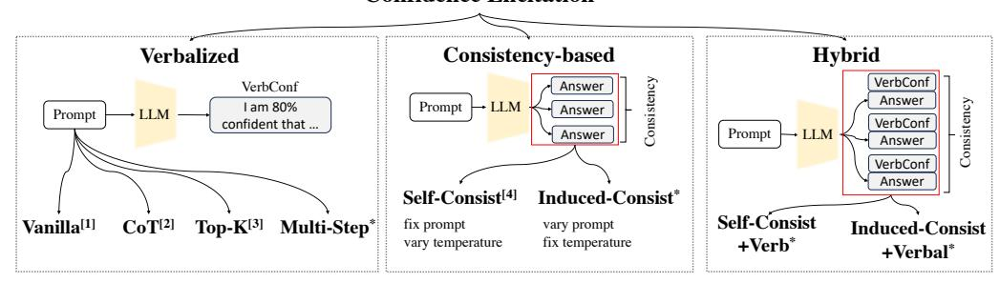
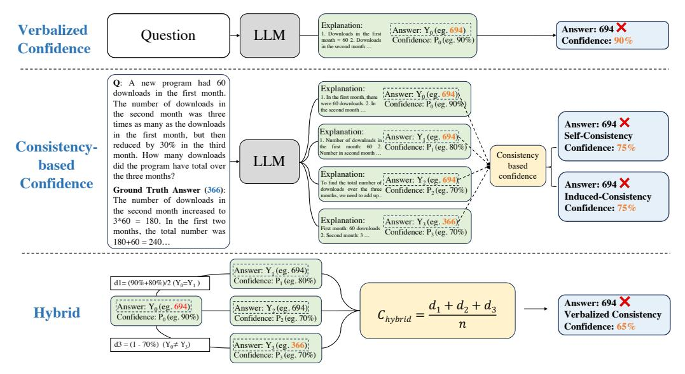
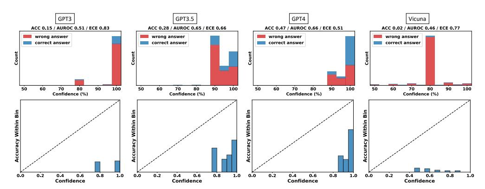
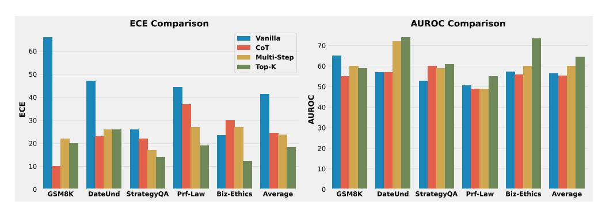
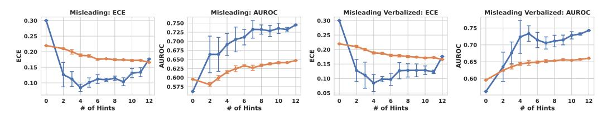
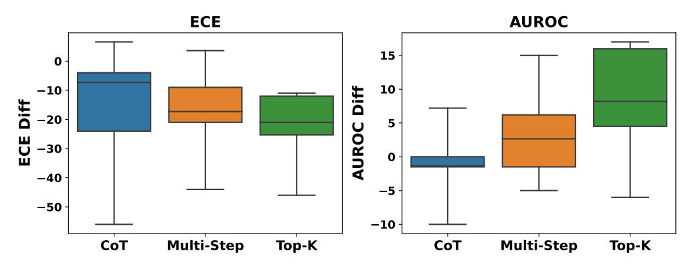
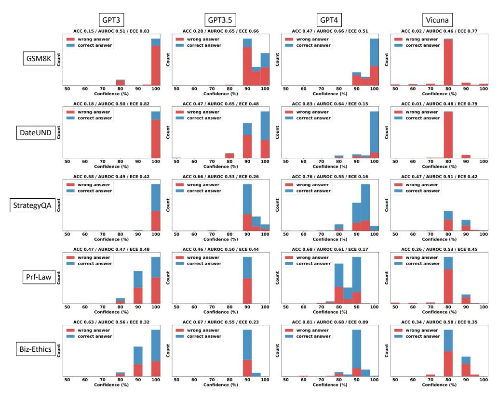

# Can LLMs Express Their Uncertainty? An Empirical Evaluation of Confidence Elicitation in LLMs

Miao Xiong1<sup>∗</sup> Zhiyuan Hu<sup>1</sup> Xinyang Lu<sup>1</sup> Yifei Li<sup>4</sup> Jie Fu<sup>3</sup> Junxian He2† Bryan Hooi1†

# Abstract

The task of empowering large language models (LLMs) to accurately express their confidence, referred to as confidence elicitation, is essential in ensuring reliable and trustworthy decision-making processes. Previous methods, which primarily rely on model logits, have become less suitable for LLMs and even infeasible with the rise of closed-source LLMs (e.g., commercialized LLM APIs). This leads to a growing need to explore the untapped area of *non-logit-based* approaches to estimate the uncertainty of LLMs. Hence, in this study, we investigate approaches for confidence elicitation that do not require model fine-tuning or access to proprietary information. We introduce three categories of methods: verbalize-based, consistency-based, and their hybrid methods for benchmarking, and evaluate their performance across five types of datasets and four widely-used LLMs. Our analysis of these methods uncovers several key insights: 1) LLMs often exhibit a high degree of overconfidence when verbalizing their confidence; 2) Prompting strategies such as CoT, Top-K and Multi-step confidences improve calibration of verbalized confidence; 3) Consistency-based methods outperform the verbalized confidences in most cases, with particularly notable improvements on the arithmetic reasoning task; 4) Hybrid methods consistently deliver the best performance over their baselines, thereby emerging as a promising state-of-the-art approach; 5) Despite these advancements, all investigated methods continue to struggle with challenging tasks, such as those requiring professional knowledge, leaving significant scope for improvement of confidence elicitation.

# 1 Introduction

A key aspect of human intelligence lies in our capability to meaningfully *express and communicate our uncertainty* in a variety of ways [\(Cosmides & Tooby, 1996\)](#page-11-0). Reliable uncertainty estimates are crucial for human-machine collaboration, enabling more rational and informed decision-making [\(Guo](#page-11-1) [et al., 2017;](#page-11-1) [Tomani & Buettner, 2021\)](#page-12-0) Specifically, obtaining the accurate confidence of a model can provide valuable insights into the reliability of its responses, facilitating risk assessment and error mitigation [\(Kuleshov et al., 2018;](#page-12-1) [Kuleshov & Deshpande, 2022\)](#page-12-2), and reducing hallucinations in natural language generation tasks [\(Xiao & Wang, 2021\)](#page-13-0).

In the existing literature, eliciting confidence from machine learning models has predominantly relied on model logits and related calibration techniques [\(Guo et al., 2017;](#page-11-1) [Jiang et al., 2021;](#page-11-2) [Kadavath](#page-11-3) [et al., 2022\)](#page-11-3). However, using model logits for LLMs presents several limitations. Firstly, logits imply overconfidence in many cases [\(Guo et al., 2017;](#page-11-1) [Mielke et al., 2022\)](#page-12-3). Secondly, logits only capture the model's uncertainty regarding next the token rather than providing an assessment of the reliability of a specific claim, which is the behavior desired in human-like responses. For instance, when generating

<sup>1</sup> National University of Singapore <sup>2</sup> The Hong Kong University of Science and Technology

<sup>3</sup> Beijing Academy of Artificial Intelligence <sup>4</sup> École Polytechnique Fédérale de Lausanne

<sup>∗</sup>Miao Xiong [\(miao.xiong@u.nus.edu\)](miao.xiong@u.nus.edu).

<sup>†</sup>Equal advising. Co-corresponding author. [junxianh2@gmail.com,](junxianh@sjtu.edu.cn)<bhooi@comp.nus.edu.sg>

### **Confidence Elicitation**

<span id="page-1-0"></span>

Figure 1: Overview of onfidence elicitation methods: verbalized, consistency-based, and their hybrid method. [1] Vanilla verbalized confidence was first introduced by [Lin et al.](#page-12-4) [\(2022\)](#page-12-4). [2] The CoT prompt strategy was proposed by [Wei et al.](#page-13-1) [\(2022\)](#page-13-1) to elicit reasoning. [3] Top-K prompt strategy was proposed by [Tian et al.](#page-12-5) [\(2023\)](#page-12-5). [4] Self-consistency is extend by us to non-logit confidence elicitation based on the previous idea in [Wang et al.](#page-13-2) [\(2022\)](#page-13-2) as a decoding strategy to improve accuracy and method in [\(Si et al., 2022\)](#page-12-6) for powerful logit calibration. Methods marked with \* are proposed by us.

a report, it is important for the model to indicate the reliability of its assertions explicitly, which cannot be achieved straightforwardly using token logits. Thirdly, the rise of closed-source LLMs, such as GPT-3.5 and GPT-4 with commercialized APIs only allowing textual inputs and outputs, lacks access to model logits or embeddings. Therefore, theses limitations necessitate *non-logit-based* approaches for eliciting uncertainty in LLMs, known as *confidence elicitation*.

Despite the increasing need for confidence elicitation methods in LLMs, the existing literature in this area remains relatively sparse. Among them, [Mielke et al.](#page-12-3) [\(2022\)](#page-12-3) involve training external calibrators, [Lin et al.](#page-12-4) [\(2022\)](#page-12-4) evaluate methods based on model fine-tuning, while [Zhou et al.](#page-13-3) [\(2023\)](#page-13-3) do not directly provide confidence for users. Recognizing this research gap, our study aims to contribute to the existing knowledge from two perspectives: 1) we explore methods for confidence elicitation that do not require model fine-tuning or access to proprietary information, and 2) we conduct a comparative analysis of their performances to shed light on methods and directions that can provide more accurate uncertainty estimates (i.e., confidence).

Principally, there are two indicators available in LLMs for gauging a model's uncertainty: the textual output generated by the model [\(Lin et al., 2022\)](#page-12-4) and the consistency among its multiple responses to the same question [\(Gawlikowski et al., 2021\)](#page-11-4). Firstly, the remarkable verbal capabilities of recent LLMs, such as GPT-4 [\(OpenAI, 2023\)](#page-12-7), have opened up intriguing possibilities for *direct elicitation* of model uncertainty via verbal cues. Pursuing this approach, we explore several prompting strategies for improving verbalized confidence ([§3.1\)](#page-2-0) such as Chain-of-Thought [\(Wei et al., 2022\)](#page-13-1), Top-K [\(Tian et al., 2023\)](#page-12-5), and a proposed Multi-step method. Secondly, adapting existing ensemble-based approaches [\(Lakshminarayanan et al., 2017;](#page-12-8) [Gal & Ghahramani, 2016\)](#page-11-5) to LLMs, we investigate two consistency-based methods ([§3.2\)](#page-4-0), which differ in the way they generate multiple responses. Thirdly, integrating both uncertainty indicators, we propose hybrid methods ([§3.3\)](#page-4-1) that build on consistency-based methods and utilize verbalized confidence to extract finer-grained confidence information from the model. A comprehensive overview of all methods is depicted in Figure [1.](#page-1-0)

Finally, we conduct a comparative evaluation of these methods on four LLMs (GPT-3 [\(Brown et al.,](#page-11-6) [2020\)](#page-11-6), GPT-3.5 [\(OpenAI, 2021\)](#page-12-9), GPT-4, Vicuna [\(Chiang et al., 2023\)](#page-11-7)) and 5 types of benchmark datasets (Commonsense, Arithmetic, Symbolic, Ethics and Professional Knowledge). Despite significant advancements in many domains, our investigation reveals that LLMs tend to be highly overconfident when verbalizing their confidence, posing potential risks for the safe deployment of LLMs ([§5.1\)](#page-6-0). Our findings highlight that several prompting strategies can better elicit verbalized confidence ([§5.2\)](#page-8-0). Moreover, the experimental results also demonstrate that, consistency-based methods exhibit superior performance over their vanilla verbalized methods, with the hybrid methods achieving the best performance in 13 out of 20 cases, and outperforming all methods across all datasets in terms of AUPRC-Positive ([§5.3\)](#page-8-1). This emphasizes that combining verbalized confidence and consistency represents a promising avenue for attaining more accurate confidence assessments in LLMs. Despite the achievements, we point out that the current methods we introduce still struggle with challenging tasks, particularly those that require professional knowledge ([§5.5\)](#page-10-0). This underscores the ongoing need for further research and development in the field of confidence elicitation for LLMs.

# 2 Related Works

Calibration Modern neural networks are shown to be poorly calibrated, often manifesting overconfidence [\(Guo et al., 2017;](#page-11-1) [Minderer et al., 2021;](#page-12-10) [Xiong et al., 2023\)](#page-13-4). Calibration seeks to address the issue by aligning the model's confidence with the accuracy of samples within the same confidence level [\(Guo et al., 2017;](#page-11-1) [Minderer et al., 2021\)](#page-12-10). To achieve this, a variety of methods have been proposed, which can be broadly divided into scaling-based methods [\(Guo et al., 2017;](#page-11-1) [Deng](#page-11-8) [et al., 2023;](#page-11-8) [Zhang et al., 2020\)](#page-13-5) and binning-based methods [\(Zadrozny & Elkan, 2001;](#page-13-6) [Zhang et al.,](#page-13-5) [2020\)](#page-13-5). Within the scope of LLMs, [Jiang et al.](#page-11-2) [\(2021\)](#page-11-2) investigates calibration of generative language models (T5, BART, and GPT-2) and discovers that these models' probabilities on question-answering tasks are not well calibrated. Similarly, [Chen et al.](#page-11-9) [\(2022\)](#page-11-9) finds that PLMs are not well calibrated and pretraining improves model calibration. On the other hand, [Kadavath et al.](#page-11-3) [\(2022\)](#page-11-3) studies the calibration of LLMs (parameter size ranging 800M to 50B), finding that larger models appear to be well-calibrated on multiple choice and true/false questions when provided in the right format. However, these evaluations mainly focus on the probabilities derived from logits, which are unavailable for closed-source LLMs like GPT-4. This also motivates us to study confidence elicitation methods that do not require model fine-tuning or access to model logits or embeddings.

Confidence Elicitation in LLMs Confidence elicitation refers to the process of estimating the confidence levels associated with the responses of LLMs, without relying on model fine-tuning or accessing to the proprietary information of LLMs. Within this scope, [Lin et al.](#page-12-4) [\(2022\)](#page-12-4) propose the concept of verbalized confidence that elicits the model to output confidence directly. However, the evaluation is tailored for pretrained language models that are fine-tuned on specific datasets and, its zero-shot verbalized confidence remains unexplored. [Mielke et al.](#page-12-3) [\(2022\)](#page-12-3) propose to train an external calibrator, but it relies on model representations that are not readily accessible. [Zhou et al.](#page-13-3) [\(2023\)](#page-13-3) examines the impact of confidence in prompts but does not directly provide confidence to users. Our work aligns most closely with the concurrent study by [Tian et al.](#page-12-5) [\(2023\)](#page-12-5) which also focuses on verbalized methods. However, our approach diverges by aiming to explore a broader method space, introducing two additional categories: consistency-based methods and their hybrid variants, which outperform the Top-K prompting strategy proposed in [Tian et al.](#page-12-5) [\(2023\)](#page-12-5). Furthermore, our investigation extends beyond the RLHF-LMs primarily analyzed in the concurrent study, encompassing a wider range of models. This allows us to probe the implications of different model sizes and structures. Our findings also highlight that hybrid methods represent a strong state-of-the-art baseline in this area, but also reveal that all methods still face challenges with more complex tasks, contributing to a more holistic understanding of confidence elicitation in the field.

# <span id="page-2-1"></span>3 Confidence Elicitation Methods

In this section, we review existing techniques for confidence elicitation and introduce new approaches or variants of our own. A comprehensive overview of all methods is provided in Figure [1.](#page-1-0)

Principally, there are two key indicators used to gauge a model's uncertainty: the generated textual output, and the consistency across multiple responses to the same question. Based on signals they utilize, we divide methods into three categories: 1) verbalized confidence ([§3.1\)](#page-2-0) that directly asks a model to output its confidence; 2) consistency-based methods ([§3.2\)](#page-4-0) that yield multiple responses and use consistency as a surrogate for confidence; and 3) hybrid methods ([§3.3\)](#page-4-1) that combine information from both sources. None of these methods require model adjustment, fine-tuning, or access to proprietary information of LLMs, such as embeddings or logits.

### <span id="page-2-0"></span>3.1 Verbalized Confidence

The textual output from a model is a vital indicator of its uncertainty, intrinsically communicating the model's confidence level in its predictions. For instance, in responding to a question, a model might generate a very direct and specific response, indicating a high level of confidence. Conversely, if the model generates a vague or indirect answer, it could be interpreted as the model being less certain about its prediction. Moreover, the enhanced verbal abilities of recent LLMs, such as GPT-4 [\(OpenAI,](#page-12-7) [2023\)](#page-12-7) have opened up the intriguing possibility to directly elicit model uncertainty through verbal cues. This process mirrors the manner in which we elicit uncertainty from human experts, such as medical professionals, by asking them to express their confidence in their suggestions, which has been

extensively studied in various fields including statistics (Garthwaite et al., 2005), psychology (van der Gaag et al., 2013), and behavioral economics (Tversky & Kahneman, 1974). This could enable LLMs to incorporate uncertainty at the claim level into their generated output. For example, if a language model is highly uncertain about its answer, it should inform the user by saying, e.g., "I am only 20% confident in this answer."

In this study, we explore how to elicit LLMs to express their confidence verbally. We explore four forms of verbalized confidence which differentiates at the prompting strategies they use: vanilla verbalized confidence, Chain-of-Thought-based verbalized confidence, multi-step Verbalized confidence and Top-K verbalized confidence.

**Vanilla Verbalized Confidence** The most straightforward approach to elicit verbalized confidence is to directly request them to output a confidence score ranging from 0% to 100%. The prompt we use is as follows:

```
Question: [Text of question, with options provided if available] Please answer this question and provide your confidence level. Note that the confidence level indicates the degree of certainty you have about your answer and is represented as a percentage.

Answer and Confidence (0-100):
```

The prompt includes the question along with our definition of confidence. As a result, the LLM generates output such as the following, from which we obtain the verbalized confidence (of 90%, in this case):

D, 90% (I am quite confident in my answer, but there is always a chance that I may have misinterpreted the question or the options.)

**Reasoning-Enhanced Verbalized Confidence (CoT-based)** With the motivation that clearer reasoning processes can lead to a more accurate understanding of one's certainty, we aim to leverage the Chain-of-Thought (Wei et al., 2022) prompting strategy. This strategy has been demonstrated to be effective in inducing reasoning processes in LLMs, and enhancing model accuracy across diverse datasets. As shown by (Kojima et al., 2022), LLMs can be prompted to output their reasoning process by simply appending "Let's think step by step" to the prompt. Building on this insight, we introduce and evaluate zero-shot CoT-based verbalized confidence.

Multi-Step Verbalized Confidence Motivated by our observation of overconfidence in vanilla verbalized confidence in our preliminary investigation (see Figure 3), we aim to explore whether breaking down the reasoning process into steps and extracting confidence of each step can alleviate this overconfidence and enhance the overall quality of verbalized confidence. We posit that gaining insight into the confidence associated with each reasoning step could potentially lead to a more precise and nuanced articulation of uncertainty. Specifically, for a given question, we prompt models to break down their reasoning process into individual steps. The specific prompt used in our experiments is provided in Table 9. Let  $S_i$  represent the i-th step in this process. For each of these steps,  $S_i$ , we then request the model to generate a corresponding confidence level,  $C_i$ , which indicates its belief in the correctness of that particular step. We can then compute an overall verbalized confidence measure,  $C_{\text{multi-step}}$ , by aggregating the confidence levels from each individual step:

$$C_{\text{multi-step}} = \text{Agg}(C_0, C_1, ..., C_{n-1})$$
 (1)

where n represents the total number of reasoning steps. In our study, we aggregate by taking products:  $C_{\text{multi-step}} = \prod_{i=0}^{n-1} C_i$ .

**Top-K Verbalized Confidence** A parallel body of research by Tian et al. (2023) introduces a promising strategy for eliciting verbalized confidence. This method prompts LLMs to generate the top K guesses for a given question, each accompanied by a corresponding probability indicating its confidence level (expressed as a percentage from 0% to 100%). The guess assigned the highest probability is selected as the final answer, with its associated probability serving as the final verbalized confidence. The detailed prompt is provided in Appendix Table 10.

#### <span id="page-4-0"></span>3.2 Consistency-based Confidence

Another key indicator of model uncertainty is the consistency among multiple responses a model provides for a given question. This approach aligns with the principles extensively explored in logit-based uncertainty estimation methodologies (Gawlikowski et al., 2021), such as MCDropout (Gal & Ghahramani, 2016) and Deep Ensemble (Lakshminarayanan et al., 2017). We extend this notion into a non-logit-based setting, specifically tailored for LLMs. Specifically, we generate multiple responses for a given question, and use the consistency among these answers to estimate the model's confidences. To achieve this, we explore a series of consistency-based methods that vary in their approach to sampling multiple responses. These include self-consistency (introducing randomness into the model's answer generation process) and induced-consistency (adding potentially misleading hints to the prompt).

**Self-Consistency Confidence** Self-consistency (Wang et al., 2022) was originally proposed as a decoding strategy to enhance the model's accuracy. However, upon closer inspection, we find that these methods fundamentally embody ensemble-based uncertainty estimation (Lakshminarayanan et al., 2017; Gal & Ghahramani, 2016), essentially estimating the probability associated with each response. This aligns neatly with our goal of estimating the model's uncertainty, thus leading us to adopt self-consistency as a viable method for confidence elicitation.

For any given question and an associated answer  $\hat{Y}_0$ , referred to as the *original answer*, we construct a set of *candidate answers*  $\hat{Y}_i$ , where  $i \in \{1,...,K\}$ . We follow the approach described in Wang et al. (2022) to sample multiple candidate answers, by using the same prompt and setting the model temperature T>0. The agreement between these candidate responses and the original answer then serves as a measure of confidence, computed as follows:

$$C_{\text{consistency}} = \frac{1}{K} \sum_{i=0}^{K} \mathbb{I}\{\hat{Y}_i = \hat{Y}_0\},\tag{2}$$

This consistency score measures the degree of agreement among the candidate outputs and integrates the inherent uncertainty in the model's output. As such, it acts as a surrogate for the model's confidence in its original response.

**Induced Consistency Confidence** The previously described *self-consistency* method extracts the model's confidence by asking it the same question multiple times. An alternative choice, which could possibly induce greater variation from the model, is to ask it a question *in different ways*.

This approach is inspired by human behavior in the face of uncertainty: when posed with a question, a human might consistently respond confidently, but the introduction of a misleading hint could prompt them to reassess their reasoning and confidence, leading to an adjustment in their response. Similarly, if the model is highly confident in its output, it will persist with its result regardless of the misleading information provided, whereas if it lacks confidence, it is more likely to be influenced by the misleading hints provided, potentially modifying its original answers. Thus, we contend that the difficulty of inducing changes in the model's output when given misleading hints reflects the model's confidence. This approach closely mirrors the self-consistency method, with a key distinction in the generation of prompts and the setting of the temperature parameter. For every candidate output generation, we randomly generate a misleading hint using the template provided in Table 13 and set the temperature to be 0, same as the original answer generation. See Table 12 for the complete prompts.

#### <span id="page-4-1"></span>3.3 Hybrid Approach: Integrating Verbalized Confidence and Consistency-based Confidence

We have explored methods that utilize the two signals of uncertainty separately above. In this section, we aim to explore the potential synergy between these uncertainty indicators, i.e., whether the verbalized confidence and the consistency can complement one another. By combining the strengths of both, we propose a new approach, termed verbalized-consistency confidence.

**Motivation** Verbalized confidence and consistency-based methods utilize orthogonal perspectives for estimating a model's confidence in its outputs. We argue that relying solely on either verbalized confidence or answer consistency is insufficient to capture the true underlying uncertainty of the

<span id="page-5-0"></span>

Figure 2: Conceptual illustration of verbalized methods, consistency-based methods and their combinations. The **verbalized** method directly asks models to verbalize their confidence (§3.1), which is often overconfident. The **consistency-based** method can alleviate this overconfidence by generating multiple answers and measuring its consistency (§3.2). By integrating the strengths of both methods (§3.3), we can further reduce the overconfidence in incorrect answers.

model's prediction. The reasons are two-fold: 1) Verbalized confidences given by LLMs tend to be highly overconfident, as suggests by our observations later (see §5.1); 2) Consistency-based methods may fail to capture fine-grained variations and hence still suffer from miscalibration. To illustrate this point, consider the following scenario: the model confidently provides an incorrect answer with a certainty of 100%. Even perturbing the model for multiple times, the model's answer remains unchanged (as evident from the candidate answers), resulting in a consistency-based confidence score of 100% as well. However, there is a decrease in the model's verbalized confidences among the candidate answers due to perturbation as shown below, suggesting that its certainty is not as high as initially claimed (i.e. 100%). Consequently, integrating both verbalized confidence and consistency can allow us to better estimate the model's confidence.

**Method** Given a sample with an original answer  $Y_0$  and confidence  $\hat{P}_0$ , we compute a candidate answer set using any consistency-based confidence techniques (e.g., self-consistency or induced-consistency), resulting in K candidate answers  $\hat{Y}_1, ..., \hat{Y}_k$  as before. Additionally, for each one, we also prompt the model to obtain its associated verbalized confidence, denoted  $\hat{P}_1, ..., \hat{P}_k$ .

For each candidate answer, we consider two cases: 1) if the candidate answer is the same as the original answer, we update the original confidence  $\hat{P}_0$  by incorporating the verbalized confidence  $\hat{P}_i$  of the candidate answer:

$$C_{\hat{Y}_i} = \left| \frac{\hat{P}_i + \hat{P}_0}{2} \right| \quad \text{if} \quad \hat{Y}_0 = \hat{Y}_i.$$
 (3)

2) if the candidate answer is different from the original answer, we want to penalize this deviation by using the verbalized confidence of the candidate answer. This indicates that the model switched to another answer and lacks confidence in the original answer. Therefore, we define the update from each candidate answer  $\hat{Y}_i$  as follows:

$$C_{\hat{Y}_i} = \left| 1 - \hat{P}_i \right| \quad \text{if} \quad \hat{Y}_0 \neq \hat{Y}_i.$$
 (4)

Finally, we compute the average contribution from all candidate answers as the final confidence score:

$$C_{\text{hybrid}} = \frac{1}{K} \sum_{i=1}^{K} C_{\hat{Y}_i}$$
 (5)

This acts as an adjustment for its verbalized confidence using candidate answers, ensuring a more accurate representation of the model's confidence. Figure [2](#page-5-0) provides a conceptual illustration of the proposed method.

# <span id="page-6-1"></span>4 Experiment Setup

Datasets We evaluate the quality of confidence estimates across four types of reasoning tasks: 1) Commonsense Reasoning on two benchmarks, including Sports Understanding (SportUND) [\(Kim,](#page-11-11) [2021\)](#page-11-11) and StrategyQA [\(Geva et al., 2021\)](#page-11-12) from BigBench [\(Ghazal et al., 2013\)](#page-11-13); 2) Arithmetic Reasoning on two math problems, including GSM8K [\(Cobbe et al., 2021\)](#page-11-14) and SVAMP [\(Patel et al., 2021\)](#page-12-12); 3) Symbolic Reasoning on two benchmarks, which involves Date Understanding (DateUnd) [\(Wu](#page-13-9) [& Wang, 2021\)](#page-13-9) and Object Counting (ObjectCou) [\(Wang et al., 2019\)](#page-13-10) in BigBench; 4) tasks that require Professional Knowledge, such as Professional Law (Prf-Law) from MMLU [\(Hendrycks](#page-11-15) [et al., 2021\)](#page-11-15); 5) tasks that require Ethical Knowledge, including business ethics (Biz-Ethics) from MMLU [\(Hendrycks et al., 2021\)](#page-11-15).

Evaluation Metrics In line with previous evaluation settings in [\(Naeini et al., 2015;](#page-12-13) [Yuan et al.,](#page-13-11) [2021;](#page-13-11) [Xiong et al., 2022\)](#page-13-12), we use confidence calibration and failure prediction metrics to measure estimated confidence: Expected Calibration Error (ECE) that measures the discrepancy between predicted probabilities and observed accuracy within each confidence level; Area Under the Receiver Operating Characteristic curve (AUROC, ROC) that assesses the confidence score's ability in distinguishing correct and incorrect samples [\(Boyd et al., 2013\)](#page-11-16), Area under the Precision-Recall Curve (AUPRC) that measures the ability to identify correct samples (AUPRC-Positive, PR-P) and incorrect samples (AUPRC-Negative, PR-N). Specifically, calibration metrics (ECE) measure the alignment of confidence scores with the ground truth uncertainty, enabling their utilization in tasks such as risk assessment; while failure detection (AUROC and AUPOR) metrics measure whether the confidence score can appropriately differentiate correct and incorrect answers.

Models In our experiments, we incorporate a range of widely used LLMs of different scales, including Vicuna [\(Chiang et al., 2023\)](#page-11-7), GPT-3 [\(Brown et al., 2020\)](#page-11-6), GPT-3.5-turbo [\(OpenAI, 2021\)](#page-12-9), and GPT-4 [\(OpenAI, 2023\)](#page-12-7). The number of parameters in each model is 13 billion for Vicuna, 175 billion for GPT-3, and larger for GPT-3.5 and GPT-4. Vicuna is a smaller model fine-tuned on LLaMA [\(Touvron et al., 2023\)](#page-13-13).

Implementation Details Each response of consistency-based confidence is elicited by the CoT prompt, and the hybrid method is also based on CoT verbalized confidence (The precise prompts are shown in Table [11\)](#page-24-0). For self-consistency confidence calculation, we perform K = 5 times sampling and follow the temperature hyperparameter setting of 0.7, as described in [\(Wang et al., 2022\)](#page-13-2).

# 5 Evaluation and Analysis

In this section, we evaluate the quality of confidence elicited by methods we introduce above in [§3](#page-2-1) across four different large language models (GPT-3, GPT-3.5, GPT-4 and Vicuna) and five types of datasets (see [§4\)](#page-6-1). Our analysis yields the following key findings: 1) LLMs tend to be overconfident when verbalizing their confidences; 2) Prompting strategies such as CoT, Top-K Confidences and Multi-step Confidences are effective in improving calibration of verbalized confidence; 3) consistency-based methods outperform the verbalized baselines in most cases, with particularly notable improvements on the arithmetic task; 4) Hybrid methods further improve the calibration of both consistency and verbalized baselines, particularly in distinguishing between correct and incorrect samples; 5) Despite promising achievements, current investigated methods still face challenges at difficult tasks such as those requiring professional knowledge.

#### <span id="page-6-0"></span>5.1 LLMs Tend to be Overconfident When Verbalizing Their Confidences

Significant miscalibration observed in vanilla verbalized confidence. Table [1](#page-7-0) presents the performance of vanilla verbalized confidence across four models and eight tasks, where we highlight in grey background the cases where the average values deviate significantly from ideal performance,

<span id="page-7-0"></span>Table 1: Vanilla Verbalized Confidence of four models and eight datasets (metrics are given by ×10<sup>2</sup> ). Abbreviations are used: Date (Date Understanding), Count (Object Counting), Sport (Sport Understanding), Law (Professional Law), Ethics (Business Ethics). ECE > 0.25, AUROC, AUPRC-Positive, AUPRC-Negative < 0.6 denote significant deviation from ideal performance. Significant deviations in averages are highlighted in red.

| Metric | Model  | GSM8K | SVAMP | Date | Count | Strategy | Sport | Law  | Ethics | Avg  |
|--------|--------|-------|-------|------|-------|----------|-------|------|--------|------|
| ECE ↓  | GPT3   | 82.7  | 35.0  | 82.1 | 52.0  | 41.8     | 42.0  | 47.8 | 32.3   | 52.0 |
|        | Vicuna | 76.0  | 70.7  | 17.0 | 45.3  | 42.5     | 37.5  | 45.2 | 34.6   | 46.1 |
|        | GPT3.5 | 66.0  | 22.4  | 47.0 | 47.1  | 26.0     | 25.1  | 44.3 | 23.4   | 37.7 |
|        | GPT4   | 31.0  | 10.7  | 18.0 | 26.8  | 16.1     | 15.4  | 17.3 | 8.5    | 18.0 |
|        | GPT3   | 51.2  | 51.7  | 50.2 | 50.0  | 49.3     | 55.3  | 46.5 | 56.1   | 51.3 |
| ROC ↑  | Vicuna | 52.1  | 46.3  | 53.7 | 53.1  | 50.9     | 53.6  | 52.6 | 57.5   | 52.5 |
|        | GPT3.5 | 65.0  | 63.2  | 57.0 | 54.1  | 52.8     | 43.2  | 50.5 | 55.2   | 55.1 |
|        | GPT4   | 81.0  | 56.7  | 68.0 | 52.0  | 55.3     | 60.0  | 60.9 | 68.0   | 62.7 |
|        | GPT3   | 85.0  | 37.3  | 82.2 | 52.0  | 42.0     | 46.4  | 51.2 | 41.2   | 54.7 |
| PR-N ↑ | Vicuna | 96.4  | 87.9  | 34.9 | 65.4  | 53.8     | 51.5  | 75.3 | 70.9   | 67.0 |
|        | GPT3.5 | 79.0  | 33.9  | 64.0 | 51.2  | 35.7     | 30.5  | 54.8 | 35.5   | 48.1 |
|        | GPT4   | 65.0  | 15.8  | 26.0 | 28.9  | 26.6     | 31.5  | 40.0 | 39.5   | 34.2 |
| PR-P ↑ | GPT3   | 15.5  | 65.5  | 17.9 | 48.0  | 57.6     | 59.0  | 45.4 | 66.1   | 46.9 |
|        | Vicuna | 4.1   | 11.0  | 69.1 | 39.1  | 47.5     | 52.0  | 27.2 | 38.8   | 36.1 |
|        | GPT3.5 | 38.0  | 81.3  | 57.0 | 54.4  | 67.2     | 67.5  | 45.8 | 70.5   | 60.2 |
|        | GPT4   | 57.0  | 90.1  | 88.0 | 73.8  | 78.6     | 79.3  | 73.4 | 87.2   | 78.4 |

according to the criteria given in [Srivastava et al.](#page-12-14) [\(2023\)](#page-12-14): specifically, ECE scores exceeding 0.25 and AUROC, AUPRC-Positive, and AUPRC-Negative scores below 0.6. The table reveals that ECE is notably high for GPT-3, GPT-3.5 and Vicuna (e.g., the average ECE across 8 tasks is larger than 37%), suggesting that these LLMs are poorly calibrated. Although GPT-4 displays consistently lower ECE, it still struggles with poor AUROC and AUPRC-Negative (with an average AUROC of only 62.7%), showing difficulty in distinguishing correct and incorrect samples.

Vanilla verbalized confidence improves with more capabilities. The comparison of the performance of various models (see Table [1\)](#page-7-0) reveals a trend: as we move from GPT-3, Vicuna, GPT-3.5 to GPT-4, there is a noticeable decrease in ECE (see the average column). This trend is accompanied by an approximate 22.2% improvement in AUROC from GPT-3 to GPT-4, suggesting that GPT-4 exhibits better confidence elicitation quality compared to smaller models.

Verbalized confidences predominantly fall within the 80% to 100% range. To gain more insight on the model's capacity to express verbalized confidence, we examine the confidence distribution of GSM8K, presented in the first row of Figure [3](#page-8-2) (detailed results on other datasets and models are provided in Appendix Figure [7\)](#page-17-0). The figure reveals a clear trend: models tend to have high confidence for all samples, usually as multiples of 5, with most values falling within the 80% to 100% range. This can be seen as an imitation of human behavior in verbalizing confidence, where in corpus, most confidence expressions are typically multiples of 5, with peak frequency on 95% [\(Zhou et al., 2023\)](#page-13-3).

Models exhibit overconfidence in vanilla verbalized confidence. Ideally, well-calibrated models should ensure that samples given a certain confidence score should have close to the same level of accuracy. In practical terms, LLMs should express low verbalized confidence for incorrect answers and high confidence for correct responses. However, Figure [3](#page-8-2) shows that the accuracy of each bar ranging from 80% to 100% is much less than 80% (in a well-calibrated model, the blue bars should approximately follow the diagonal dotted line), suggesting the significant overconfidence in LLMs.

Overall, the results suggest that the predictions from all models are poorly calibrated and overconfident, emphasizing the ongoing challenge faced by large language models in generating reliable verbalized confidence.

<span id="page-8-2"></span>

Figure 3: First row: Empirical distribution of vanilla verbalized confidence across four models on GSM8K. Most samples fall into the 80% to 100% range. To better illustrate the major confidence distribution, we set the minimal confidence threshold at 50% in this figure, as very few confidences fall below this level. Second row: Reliability diagram of each model on GSM8K. The accuracy within each bin is much lower than its corresponding confidence, indicating significant overconfidence.

# <span id="page-8-0"></span>5.2 Advanced Prompting Strategies Improve Calibration of Verbalized Confidences

Multi-step and Top-K prompting strategies demonstrate promising results in reducing ECE and improving AUROC, with Top-K being relatively more effective. Figure [4](#page-9-0) presents a comparison of various prompting strategies (CoT, Multi-Step, Top-K) against vanilla verbalized confidence. Judging from the 'average' bar, which computes the mean value across five datasets, both Multi-step and Top-K prompting strategies effectively reduce ECE and enhance AUROC. Moreover, Top-K shows relatively better performance improvements. The intuition behind this improvement is that this prompting strategy, requesting the model to generate multiple guesses along with their corresponding confidences, naturally nudges the model to be aware of the existence of various possible answers, preventing overconfidence in a single response and promoting re-evaluation of given answers.

CoT shows mixed results, significantly reducing ECE but also leading to a decrease in AUROC. Closely examining the individual dataset performances, we find that CoT has the lowest ECE in GSM8K and Date Understanding datasets, but its impact on AUROC is negative: while it improves AUROC in Date Understanding and StrategyQA, it decreases for GSM8K, with minimal change observed on Business Ethics. We speculate that the performance gain is largely driven by an increase in accuracy (refer to Table [3\)](#page-14-0). Consider, for instance, a hypothetical scenario where the verbalized confidence for all samples persistently sits at 90%, yet the accuracy improves drastically from 0.28 to 0.9. Under such circumstances, the model's ECE would plummet from 0.62 to 0, whereas the AUROC would remain constant. This situation aligns with what we observe in GSM8K, where the model's verbalized confidence has only a slight variance and still falls within the range of 0.8 to 1.0, even as its accuracy significantly increases from 0.28 to 0.80.

#### <span id="page-8-1"></span>5.3 Consistency-Based Methods Exhibit Superior Performance Over Verbalized Confidence

Consistency-based methods consistently outperform verbalized methods, with particularly notable improvements on the arithmetic task. Table [2](#page-9-1) demonstrates that, consistency-based methods outperform verbalized confidence, particularly on tasks including GSM8K, DateUND, Professional Law, and Business Ethics. The average performance in ECE, AUROC, and PR-P further demonstrates the superiority of consistency-based confidence over verbalized confidence. Notably, the arithmetic dataset, i.e., GSM8K showcases a remarkable improvement in AUROC from 54.8% (akin to random guessing) to 92.7%, effectively distinguishing between incorrectly and correctly classified samples.

Additionally, it is worth noting that the computational time and resources required for consistencybased methods are K times larger than the CoT version, where K is the number of queries (responses) used in consistency computation. K thus presents a trade-off between efficiency and effectiveness.

<span id="page-9-0"></span>

Figure 4: The relative performance gain of CoT, multi-step verbalized confidence, and Top-K verbalized confidence compared to the baseline vanilla verbalized confidence, with respect to ECE and AUROC on GPT-3.5. For more granular numerical results, refer to Table [5.](#page-15-0) Judging from the average bar, which computes the mean value across five different datasets, the Top-K prompting strategy is the most effective in reducing ECE and enhancing AUROC.

<span id="page-9-1"></span>Table 2: Performance of different confidence elicitation methods: verbalize-based (Top-K and CoT Verbalized Confidence), consistency-based (Self-Consistency and Induced consistency), and their hybrid combinations. The best-performing method for each dataset is highlighted in bold.

| Metric | Method             | GSM8K | DateUND | StrategyQA | Prf-Law | Biz-Ethics | Avg  |
|--------|--------------------|-------|---------|------------|---------|------------|------|
|        | Top-K Verb         | 39.8  | 40.1    | 14.0       | 16.7    | 12.4       | 24.6 |
|        | CoT Verb           | 10.1  | 23.4    | 22.0       | 39.7    | 30.0       | 25.0 |
| ECE ↓  | Self-Cons          | 6.28  | 17.0    | 23.3       | 26.0    | 20.7       | 18.7 |
|        | Induced-Cons       | 8.03  | 20.5    | 21.8       | 18.3    | 17.8       | 17.3 |
|        | Hybrid (self-cons) | 9.28  | 14.6    | 15.9       | 18.3    | 15.8       | 14.8 |
|        | Hybrid (induce)    | 7.40  | 17.6    | 15.0       | 12.8    | 18.2       | 14.2 |
|        | Top-K Verb         | 59.9  | 76.3    | 61.3       | 58.9    | 73.3       | 65.9 |
|        | CoT Verb           | 54.8  | 57.4    | 59.8       | 52.2    | 56.0       | 56.4 |
| ROC ↑  | Self-Cons          | 92.7  | 66.8    | 60.8       | 65.6    | 79.0       | 73.0 |
|        | Induced-Cons       | 88.6  | 67.3    | 61.5       | 59.3    | 71.3       | 69.6 |
|        | Hybrid (self-cons) | 92.5  | 68.8    | 66.2       | 65.3    | 79.5       | 74.5 |
|        | Hybrid (induce)    | 88.8  | 63.8    | 65.6       | 60.4    | 72.4       | 70.2 |
|        | Top-K Verb         | 27.7  | 62.8    | 68.4       | 49.3    | 82.2       | 58.1 |
|        | CoT Verb           | 81.8  | 76.6    | 72.8       | 49.2    | 64.3       | 68.9 |
| PR-P ↑ | Self-Cons          | 96.9  | 81.0    | 73.7       | 59.4    | 82.3       | 78.7 |
|        | Induced-Cons       | 95.1  | 81.0    | 74.1       | 54.7    | 77.6       | 76.5 |
|        | Hybrid (self-cons) | 97.0  | 84.4    | 78.3       | 60.3    | 83.1       | 80.6 |
|        | Hybrid (induce)    | 95.3  | 79.0    | 79.1       | 56.4    | 80.9       | 78.1 |
|        | Top-K Verb         | 80.2  | 79.8    | 45.7       | 56.0    | 50.7       | 62.5 |
|        | CoT Verb           | 23.1  | 30.7    | 40.5       | 53.9    | 43.7       | 38.4 |
| PR-N ↑ | Self-Cons          | 79.7  | 44.6    | 39.5       | 63.8    | 63.4       | 58.2 |
|        | Induced-Cons       | 71.2  | 44.2    | 41.3       | 58.7    | 55.1       | 54.1 |
|        | Hybrid (self-cons) | 81.5  | 51.8    | 45.8       | 65.3    | 64.9       | 61.9 |
|        | Hybrid (induce)    | 73.5  | 42.4    | 45.4       | 60.9    | 57.1       | 55.9 |

Detailed experiments investigating the impact of the number of hints used and the prompt employed in induced-consistency can be found in the Appendix [A.4](#page-14-1) and [A.5.](#page-15-1)

Performance rank varies among consistency-based methods. Comparisons between selfconsistency and induced-consistency show mixed results, with neither method consistently outperforming the other. For instance, on the GSM8K dataset, self-consistency outperforms inducedconsistency, while the opposite is true for the StrategyQA dataset. For the remaining datasets, both

methods yield comparable results, indicating that their performance is similar across diverse data environments.

### 5.4 Hybrid Approaches Achieve State-of-the-art Results

Comparisons between verbalized methods, consistency-based methods and hybrid methods (see Table [2\)](#page-9-1), demonstrate that most hybrid methods excel beyond their verbalized confidence and consistency-based counterparts, with Hybrid (self-cons) and Hybrid (induce) surpassing the baselines, in terms of both AUPRC-Positive and AUPRC-Negative metrics. This suggests that combining consistency-based and verbalized confidence methods can complement each other, providing a promising direction for the development of reliable confidence elicitation methods. Further, when compared to the promising baseline of Top-K verbalized confidence, our hybrid method still delivers superior performance, attaining the best results in 13 out of 20 cases, thereby achieving state-of-the-art results. Notably, a fairer comparison might involve the use of the Top-K prompting strategy within hybrid methods to leverage the improved verbalized confidence derived from Top-K. This is an area of investigation that we plan to explore in future work.

# <span id="page-10-0"></span>5.5 Current Methods Still Struggle At Challenging Tasks

Table [2](#page-9-1) demonstrates that for the *arithmetic* dataset, e.g. GSM8K, ECE is quite low at 0.0628, nearing optimal calibration (ECE=0) and AUROC is also high at 92.7%, fairly close to the ideal 100%, indicating a strong ability to distinguish between correctly and incorrectly classified samples. However, for datasets that require *professional knowledge*, such as Professional Law, performance remains suboptimal. The best-performing ECE (achieved using induced-cons + hybrid methods) is 0.128, indicating a moderate level of miscalibration, while the AUROC is only 65.6%, close to the 50% associated with random guessing. The corresponding AUPRC-P and AUPRC-N values are also around 60%, suggesting a significant gap from optimal performance (AUPRC-P, AUPRC-N = 100%). These findings indicate that while consistency-based methods show promising results at arithmetic reasoning tasks, they still struggle with tasks requiring professional knowledge. For other datasets that fall between arithmetic and professional law tasks, the performance of consistency-based and verbalized methods is quite mixed, with no single method consistently outperforming the others. This highlights the need for more effective and stable methods.

# 6 Discussions and Conclusions

In this study, we directe our attention towards the challenge of confidence elicitation, i.e., empowering Large Language Models (LLMs) to articulate the confidence level in their responses. Recognizing the scarcity of existing literature on this topic, we explore and introduce three categories of methodologies: verbalized confidence and consistency-based confidence, and their hybrid methods. To explore the effectiveness of these methods, we conduct comparative experiments on four extensively utilized LLMs and five diverse types of datasets. Our findings reveal that LLMs tend to exhibit a significant degree of overconfidence when verbalizing their confidence. This overconfidence can be mitigated to some extent by using recently proposed prompting strategies such as CoT, Top-K, and our proposed Multi-Step. Furthermore, consistency-based methods demonstrate their potential to enhance calibration, especially in arithmetic datasets and open-ended questions. Our experimental results also show that the hybrid methods we propose can further improve calibration, outperforming both of their counterparts. Despite these promising advancements, a closer examination of the results suggests that while the introduced methods perform well on arithmetic-related datasets, they continue to face challenges with more demanding benchmark evaluations, particularly those requiring professional knowledge and reasoning. These findings underscore the need for continued exploration and improvement in the field of confidence elicitation, setting the stage for future investigations.

# References

- <span id="page-11-16"></span>Kendrick Boyd, Kevin H. Eng, and C. David Page. Area under the precision-recall curve: Point estimates and confidence intervals. In Hendrik Blockeel, Kristian Kersting, Siegfried Nijssen, and Filip Železný (eds.), *Machine Learning and Knowledge Discovery in Databases*, pp. 451–466, Berlin, Heidelberg, 2013. Springer Berlin Heidelberg. ISBN 978-3-642-40994-3.
- <span id="page-11-6"></span>Tom B Brown, Benjamin Mann, Nick Ryder, Melanie Subbiah, Jared Kaplan, Prafulla Dhariwal, Arvind Neelakantan, Pranav Shyam, Girish Sastry, Amanda Askell, et al. Language models are few-shot learners. *arXiv preprint arXiv:2005.14165*, 2020.
- <span id="page-11-9"></span>Yangyi Chen, Lifan Yuan, Ganqu Cui, Zhiyuan Liu, and Heng Ji. A close look into the calibration of pre-trained language models. *arXiv preprint arXiv:2211.00151*, 2022.
- <span id="page-11-7"></span>Wei-Lin Chiang, Zhuohan Li, Zi Lin, Ying Sheng, Zhanghao Wu, Hao Zhang, Lianmin Zheng, Siyuan Zhuang, Yonghao Zhuang, Joseph E. Gonzalez, Ion Stoica, and Eric P. Xing. Vicuna: An open-source chatbot impressing gpt-4 with 90%\* chatgpt quality, March 2023. URL [https:](https://lmsys.org/blog/2023-03-30-vicuna/) [//lmsys.org/blog/2023-03-30-vicuna/](https://lmsys.org/blog/2023-03-30-vicuna/).
- <span id="page-11-14"></span>Karl Cobbe, Vineet Kosaraju, Mohammad Bavarian, Mark Chen, Heewoo Jun, Lukasz Kaiser, Matthias Plappert, Jerry Tworek, Jacob Hilton, Reiichiro Nakano, et al. Training verifiers to solve math word problems. *arXiv preprint arXiv:2110.14168*, 2021.
- <span id="page-11-0"></span>Leda Cosmides and John Tooby. Are humans good intuitive statisticians after all? rethinking some conclusions from the literature on judgment under uncertainty. *cognition*, 58(1):1–73, 1996.
- <span id="page-11-8"></span>Ailin Deng, Miao Xiong, and Bryan Hooi. Great models think alike: Improving model reliability via inter-model latent agreement. *arXiv preprint arXiv:2305.01481*, 2023.
- <span id="page-11-5"></span>Yarin Gal and Zoubin Ghahramani. Dropout as a bayesian approximation: Representing model uncertainty in deep learning. In *international conference on machine learning*, pp. 1050–1059. PMLR, 2016.
- <span id="page-11-10"></span>Paul H Garthwaite, Joseph B Kadane, and Anthony O'Hagan. Statistical methods for eliciting probability distributions. *Journal of the American statistical Association*, 100(470):680–701, 2005.
- <span id="page-11-4"></span>Jakob Gawlikowski, Cedrique Rovile Njieutcheu Tassi, Mohsin Ali, Jongseok Lee, Matthias Humt, Jianxiang Feng, Anna Kruspe, Rudolph Triebel, Peter Jung, Ribana Roscher, et al. A survey of uncertainty in deep neural networks. *arXiv preprint arXiv:2107.03342*, 2021.
- <span id="page-11-12"></span>Mor Geva, Daniel Khashabi, Elad Segal, Tushar Khot, Dan Roth, and Jonathan Berant. Did aristotle use a laptop? a question answering benchmark with implicit reasoning strategies, 2021.
- <span id="page-11-13"></span>Ahmad Ghazal, Tilmann Rabl, Minqing Hu, Francois Raab, Meikel Poess, Alain Crolotte, and Hans-Arno Jacobsen. Bigbench: Towards an industry standard benchmark for big data analytics. In *Proceedings of the 2013 ACM SIGMOD international conference on Management of data*, pp. 1197–1208, 2013.
- <span id="page-11-1"></span>Chuan Guo, Geoff Pleiss, Yu Sun, and Kilian Q Weinberger. On calibration of modern neural networks. In *International conference on machine learning*, pp. 1321–1330. PMLR, 2017.
- <span id="page-11-15"></span>Dan Hendrycks, Collin Burns, Steven Basart, Andy Zou, Mantas Mazeika, Dawn Song, and Jacob Steinhardt. Measuring massive multitask language understanding, 2021.
- <span id="page-11-2"></span>Zhengbao Jiang, Jun Araki, Haibo Ding, and Graham Neubig. How can we know when language models know? on the calibration of language models for question answering. *Transactions of the Association for Computational Linguistics*, 9:962–977, 2021.
- <span id="page-11-3"></span>Saurav Kadavath, Tom Conerly, Amanda Askell, Tom Henighan, Dawn Drain, Ethan Perez, Nicholas Schiefer, Zac Hatfield Dodds, Nova DasSarma, Eli Tran-Johnson, et al. Language models (mostly) know what they know. *arXiv preprint arXiv:2207.05221*, 2022.
- <span id="page-11-11"></span>Ethan Kim. Sports understanding in bigbench, 2021.

- <span id="page-12-11"></span>Takeshi Kojima, Shixiang Shane Gu, Machel Reid, Yutaka Matsuo, and Yusuke Iwasawa. Large language models are zero-shot reasoners. *arXiv preprint arXiv:2205.11916*, 2022.
- <span id="page-12-2"></span>Volodymyr Kuleshov and Shachi Deshpande. Calibrated and sharp uncertainties in deep learning via density estimation. In *International Conference on Machine Learning*, pp. 11683–11693. PMLR, 2022.
- <span id="page-12-1"></span>Volodymyr Kuleshov, Nathan Fenner, and Stefano Ermon. Accurate uncertainties for deep learning using calibrated regression. In *International conference on machine learning*, pp. 2796–2804. PMLR, 2018.
- <span id="page-12-8"></span>Balaji Lakshminarayanan, Alexander Pritzel, and Charles Blundell. Simple and scalable predictive uncertainty estimation using deep ensembles. *Advances in neural information processing systems*, 30, 2017.
- <span id="page-12-4"></span>Stephanie Lin, Jacob Hilton, and Owain Evans. Teaching models to express their uncertainty in words. *arXiv preprint arXiv:2205.14334*, 2022.
- <span id="page-12-3"></span>Sabrina J Mielke, Arthur Szlam, Emily Dinan, and Y-Lan Boureau. Reducing conversational agents' overconfidence through linguistic calibration. *Transactions of the Association for Computational Linguistics*, 10:857–872, 2022.
- <span id="page-12-10"></span>Matthias Minderer, Josip Djolonga, Rob Romijnders, Frances Hubis, Xiaohua Zhai, Neil Houlsby, Dustin Tran, and Mario Lucic. Revisiting the calibration of modern neural networks. In *Advances in Neural Information Processing Systems*, volume 34, pp. 15682–15694, 2021.
- <span id="page-12-13"></span>Mahdi Pakdaman Naeini, Gregory Cooper, and Milos Hauskrecht. Obtaining well calibrated probabilities using bayesian binning. In *Proceedings of the AAAI conference on artificial intelligence*, volume 29, 2015.
- <span id="page-12-9"></span>OpenAI. ChatGPT. <https://www.openai.com/gpt-3/>, 2021. Accessed: April 21, 2023.
- <span id="page-12-7"></span>OpenAI. Gpt-4 technical report, 2023.
- <span id="page-12-12"></span>Arkil Patel, Satwik Bhattamishra, and Navin Goyal. Are NLP models really able to solve simple math word problems? In *Proceedings of the 2021 Conference of the North American Chapter of the Association for Computational Linguistics: Human Language Technologies*, pp. 2080–2094, Online, June 2021. Association for Computational Linguistics. doi: 10.18653/v1/2021.naacl-main. 168. URL <https://aclanthology.org/2021.naacl-main.168>.
- <span id="page-12-6"></span>Chenglei Si, Chen Zhao, Sewon Min, and Jordan Boyd-Graber. Re-examining calibration: The case of question answering. In *Findings of the Association for Computational Linguistics: EMNLP 2022*, pp. 2814–2829, 2022.
- <span id="page-12-15"></span>Quintin P. Solano, Laura Hayward, Zoey Chopra, Kathryn Quanstrom, Daniel Kendrick, Kenneth L. Abbott, Marcus Kunzmann, Samantha Ahle, Mary Schuller, Erkin Ötle¸s, and Brian C. George. Natural language processing and assessment of resident feedback quality. *Journal of Surgical Education*, 78(6):e72–e77, 2021. ISSN 1931-7204. doi: https://doi.org/10.1016/j.jsurg.2021.05.012. URL <https://www.sciencedirect.com/science/article/pii/S1931720421001537>.
- <span id="page-12-14"></span>Aarohi Srivastava, Abhinav Rastogi, Abhishek Rao, Abu Awal Md Shoeb, Abubakar Abid, Adam Fisch, Adam R Brown, Adam Santoro, Aditya Gupta, Adrià Garriga-Alonso, et al. Beyond the imitation game: Quantifying and extrapolating the capabilities of language models. *Transactions on Machine Learning Research*, 2023. ISSN 2835-8856. URL [https://openreview.net/](https://openreview.net/forum?id=uyTL5Bvosj) [forum?id=uyTL5Bvosj](https://openreview.net/forum?id=uyTL5Bvosj).
- <span id="page-12-5"></span>Katherine Tian, Eric Mitchell, Allan Zhou, Archit Sharma, Rafael Rafailov, Huaxiu Yao, Chelsea Finn, and Christopher D Manning. Just ask for calibration: Strategies for eliciting calibrated confidence scores from language models fine-tuned with human feedback. *arXiv preprint arXiv:2305.14975*, 2023.
- <span id="page-12-0"></span>Christian Tomani and Florian Buettner. Towards trustworthy predictions from deep neural networks with fast adversarial calibration. In *Proceedings of the AAAI Conference on Artificial Intelligence*, volume 35, pp. 9886–9896, 2021.

- <span id="page-13-13"></span>Hugo Touvron, Thibaut Lavril, Gautier Izacard, Xavier Martinet, Marie-Anne Lachaux, Timothée Lacroix, Baptiste Rozière, Naman Goyal, Eric Hambro, Faisal Azhar, Aurelien Rodriguez, Armand Joulin, Edouard Grave, and Guillaume Lample. Llama: Open and efficient foundation language models, 2023.
- <span id="page-13-8"></span>Amos Tversky and Daniel Kahneman. Judgment under uncertainty: Heuristics and biases: Biases in judgments reveal some heuristics of thinking under uncertainty. *science*, 185(4157):1124–1131, 1974.
- <span id="page-13-7"></span>Linda C van der Gaag, Silja Renooij, Cilia LM Witteman, Berthe MP Aleman, and Babs G Taal. How to elicit many probabilities. *arXiv preprint arXiv:1301.6745*, 2013.
- <span id="page-13-10"></span>Jianfeng Wang, Rong Xiao, Yandong Guo, and Lei Zhang. Learning to count objects with few exemplar annotations. *arXiv preprint arXiv:1905.07898*, 2019.
- <span id="page-13-2"></span>Xuezhi Wang, Jason Wei, Dale Schuurmans, Quoc Le, Ed Chi, and Denny Zhou. Self-consistency improves chain of thought reasoning in language models. *arXiv preprint arXiv:2203.11171*, 2022.
- <span id="page-13-1"></span>Jason Wei, Xuezhi Wang, Dale Schuurmans, Maarten Bosma, Ed Chi, Quoc Le, and Denny Zhou. Chain of thought prompting elicits reasoning in large language models. *arXiv preprint arXiv:2201.11903*, 2022.
- <span id="page-13-9"></span>Xinyi Wu and Zijian Wang. Data understanding in bigbench, 2021.
- <span id="page-13-0"></span>Yijun Xiao and William Yang Wang. On hallucination and predictive uncertainty in conditional language generation. *arXiv preprint arXiv:2103.15025*, 2021.
- <span id="page-13-12"></span>Miao Xiong, Shen Li, Wenjie Feng, Ailin Deng, Jihai Zhang, and Bryan Hooi. Birds of a feather trust together: Knowing when to trust a classifier via adaptive neighborhood aggregation. *arXiv preprint arXiv:2211.16466*, 2022.
- <span id="page-13-4"></span>Miao Xiong, Ailin Deng, Pang Wei Koh, Jiaying Wu, Shen Li, Jianqing Xu, and Bryan Hooi. Proximity-informed calibration for deep neural networks. *arXiv preprint arXiv:2306.04590*, 2023.
- <span id="page-13-11"></span>Zhuoning Yuan, Yan Yan, Milan Sonka, and Tianbao Yang. Large-scale robust deep auc maximization: A new surrogate loss and empirical studies on medical image classification. In *Proceedings of the IEEE/CVF International Conference on Computer Vision*, pp. 3040–3049, 2021.
- <span id="page-13-6"></span>Bianca Zadrozny and Charles Elkan. Obtaining calibrated probability estimates from decision trees and naive bayesian classifiers. In *Icml*, volume 1, pp. 609–616, 2001.
- <span id="page-13-5"></span>Jize Zhang, Bhavya Kailkhura, and T Yong-Jin Han. Mix-n-match: Ensemble and compositional methods for uncertainty calibration in deep learning. In *International conference on machine learning*, pp. 11117–11128. PMLR, 2020.
- <span id="page-13-3"></span>Kaitlyn Zhou, Dan Jurafsky, and Tatsunori Hashimoto. Navigating the grey area: Expressions of overconfidence and uncertainty in language models. *arXiv preprint arXiv:2302.13439*, 2023.

# A Detailed Experiment Results

#### <span id="page-14-0"></span>A.1 Chain-of-Thought-based Verbalized Confidence

Table 3: Improvement of verbalized confidence with

| Chain-of-Thought Prompts |     |        |     |       |  |  |  |
|--------------------------|-----|--------|-----|-------|--|--|--|
| Dataset                  | CoT | GPT3.5 |     |       |  |  |  |
|                          |     | ACC(%) | ECE | AUROC |  |  |  |
|                          | ✗   | 28     | 66  | 65    |  |  |  |
| GSM8K                    | ✓   | 80.3   | 10  | 55    |  |  |  |
|                          | ✗   | 47     | 48  | 65    |  |  |  |
| DateUnd                  | ✓   | 73.2   | 23  | 57    |  |  |  |
|                          | ✗   | 65.8   | 26  | 53    |  |  |  |
| StrategyQA               | ✓   | 67.9   | 22  | 60    |  |  |  |
|                          | ✗   | 45.5   | 44  | 50    |  |  |  |
| Prf-Law                  | ✓   | 51.7   | 37  | 49    |  |  |  |
|                          | ✗   | 67     | 23  | 55    |  |  |  |
| Biz-Ethics               | ✓   | 61     | 30  | 56    |  |  |  |

# A.2 Multi-Step Verbalized Confidence Performance

Table 4: Evaluation of multistep verbalized confidence for GPT-3.5

|            |    | Models |     |       |  |  |
|------------|----|--------|-----|-------|--|--|
| Dataset    | SA | GPT3.5 |     |       |  |  |
|            |    | ACC(%) | ECE | AUROC |  |  |
|            | ✗  | 80.3   | 10  | 55    |  |  |
| GSM8K      | ✓  | 76.2   | 22  | 60    |  |  |
|            | ✗  | 73.2   | 23  | 57    |  |  |
| DateUnd    | ✓  | 63.6   | 26  | 72    |  |  |
|            | ✗  | 67.9   | 22  | 60    |  |  |
| StrategyQA | ✓  | 68.7   | 17  | 59    |  |  |
|            | ✗  | 51.7   | 37  | 49    |  |  |
| Prf-Law    | ✓  | 49.6   | 27  | 49    |  |  |
|            | ✗  | 61     | 30  | 56    |  |  |
| Biz-Ethics | ✓  | 61.6   | 27  | 60    |  |  |

## A.3 Top-K Verbalized Confidence Performance

The detailed experiments performance of Top-K verbalized confidence can be found in Table [5.](#page-15-0)

#### <span id="page-14-1"></span>A.4 Impact of Misleading Prompts in Induced Consistency Confidence

To study the effect of different misleading prompts used in induced consistency confidence, we categorize the prompts into three types: Weak Claim, Strong Claim, and External Source. The Weak Claim category represents prompts that exhibit uncertainty, such as "I vaguely remember the answer is" or "I think the answer should be". These prompts suggest that the user is providing misleading information to the Large Language Model (LLM) but lacks confidence in the information provided. The Strong Claim category includes prompts like "I am pretty sure that this is" or "I am very confident that", which express a high degree of certainty. The External Source category represents prompts that cite external sources as their evidence, such as "Wikipedia says" or "the latest research shows that".

<span id="page-15-0"></span>Table 5: Evaluation of Top-K verbalized confidence on GPT-3.5.

| Dataset    |        | GPT3.5 |       |
|------------|--------|--------|-------|
|            | ACC(%) | ECE    | AUROC |
| GSM8K      | 22.8   | 19.6   | 58.5  |
| DateUnd    | 33.3   | 26.1   | 74.2  |
| StrategyQA | 61.3   | 14     | 61.3  |
| Prf-Law    | 42.2   | 16.7   | 58.9  |
| Biz-Ethics | 67.0   | 12.4   | 73.3  |

Our experimental results (Table [13\)](#page-26-0) indicate that the Weak Claim category performs better. A possible explanation is that on one hand even providing weak misleading information, the model will analyze and reassess their answers. On the other hand, since the misleading answers are generated randomly, confidently providing this information can sometimes lead to negative effects. For example, the model provides a correct answer with moderate confidence. However, if a misleading hint is provided with high confidence or is supported by an external source, the model may be inclined to believe the prompt and alter its predictions.

Table 6: The performance of varying prompt groups in StrategyQA Utilizing GPT-3.5 as the backend. The group exhibiting the optimal performance is emphasized in bold.

| Method                            | Hint Group      | GPT-3.5 |       |  |
|-----------------------------------|-----------------|---------|-------|--|
|                                   |                 | ECE     | AUROC |  |
| Induced Consistency Confidence    | Weak Claim      | 19.7    | 62.0  |  |
|                                   | Strong Claim    | 19.5    | 61.4  |  |
|                                   | External Source | 18.2    | 60.8  |  |
| verbalized-consistency confidence | Weak Claim      | 19.8    | 65.4  |  |
|                                   | Strong Claim    | 19.5    | 64.6  |  |
|                                   | External Source | 18.2    | 63.4  |  |

### <span id="page-15-1"></span>A.5 Impact of the Number of Candidate Answers in induced consistency Methods

We investigate the impact of the number of candidate answers, denoted as K, utilized in the computation of induced consistency methods. Specifically, K represents the quantity of queries used to construct the set of candidate answers for consistency calculation. We illustrate its calibration performance (ECE) and failure prediction performance (AUROC) in relation to varying numbers of K (ranging from K = 0 to K = 12) in Figure [5.](#page-16-0)

The results indicate that, in terms of AUROC, a higher candidate set size K contributes to superior performance and reduced variance. However, the optimal candidate size K for ECE varies across different datasets. For instance, the StrategyQA dataset exhibits improved performance with a larger K, whereas the Business Ethics dataset generally performs better with a moderate number of candidate answers (e.g., K = 4). This observation can be attributed to the limited variability of misleading information (restricted to 4 types) used in our experiments for the Business Ethics dataset, implying that the introduction of a large number of more queries does not significantly enhance the information pool. Therefore, to strike a balance between computational efficiency and performance, we set the candidate set to be 4 in our study.

### A.6 Comparison Between Verbalized Confidences

Refer to Figure [6](#page-16-1) for the comparison figure.

<span id="page-16-0"></span>

Figure 5: Impact of the number of ensemble used. GPT-3.5 is used for evaluation. For every given number of hints, we randomly sample the specified number of queries for 5 times and calculate the mean ECE and AUROC, and compute its variance(plotted as error bar).

<span id="page-16-1"></span>

Figure 6: Performance Comparison of four verbalized confidence methods: vanilla, CoT, Multi-Step, Top-K in terms of ECE and AUROC for five types of datasets on GPT-3.5. Refer to Table 5 for detailed results.

#### A.7 Confidence Distribution Map of Vanilla Verbalized Confidence

Refer to Figure 7 for the distribution map.

# **B** Experiment Setup

#### **B.1** Datasets

To evaluate the quality of confidence estimates in varied tasks, we select the tasks of commonsense reasoning, arithmetic calculation, symbolic reasoning, professional knowledge, and ethical knowledge as evaluation benchmarks. In detail, the datasets for each task are listed below:

- Commonsense Reasoning: Sports Understanding (SportUND) dataset (Kim, 2021) and StrategyQA dataset (Geva et al., 2021) from BigBench (Ghazal et al., 2013). We select StrategyQA as the more representative dataset since it contains more data.
- **Arithmetic Reasoning**: Graduate School Math (GSM8K) dataset (Cobbe et al., 2021) and Simple Variations on Arithmetic Math word Problems (SVAMP) dataset (Patel et al., 2021). We select GSM9K as the more representative dataset because it has a wider usage.
- **Symbolic Reasoning**: Date Understanding (DateUnd) dataset (Wu & Wang, 2021) and Object Counting (ObjectCou) dataset (Wang et al., 2019) in BigBench. We select Date Understanding as the more representative dataset since it is more difficult than Object Counting.
- **Professional Knowledge**: Professional Law (Prf-Law) dataset from MMLU (Massive Multitask Language Understanding) (Hendrycks et al., 2021)
- Ethical Knowledge: business ethics (Biz-Ethics) dataset from MMLU (Hendrycks et al., 2021).

<span id="page-17-0"></span>

Figure 7: Confidence Distribution Map of Vanilla Verbalized Confidence.

#### B.2 Evaluation Metrics

In line with previous evaluation setting in [\(Naeini et al., 2015;](#page-12-13) [Yuan et al., 2021;](#page-13-11) [Xiong et al., 2022\)](#page-13-12), we use confidence calibration and failure prediction metrics to measure estimated confidence:

- Expected Calibration Error (ECE): It measures the calibration of a classifier by quantifying the discrepancy between predicted probabilities and observed accuracy.
- Area Under the Receiver Operating Characteristic curve (AUROC): It assesses the discriminative ability of a classifier across different classification thresholds [\(Boyd et al., 2013\)](#page-11-16).
- Area under the Precision-Recall Curve (AUPRC): It measures the trade-off between precision and recall at different classification thresholds. Specifically, AUPRC-Positive measures the AUPRC for positive instances and AUPRC-Negative is for negative samples.

Specifically, calibration metrics (ECE) measure the alignment of confidence scores with the ground truth uncertainty, enabling their utilization in tasks such as risk assessment; while failure detection (AUROC and AUPOR) metrics measure whether the confidence score can appropriately differentiate correct answers and incorrect answers. These metrics also play a crucial role in accurately assessing calibration measurements in works such as [Mielke et al.](#page-12-3) [\(2022\)](#page-12-3) and [Solano et al.](#page-12-15) [\(2021\)](#page-12-15) .

# B.3 Models

In our experiments, we incorporate a range of representative LLMs of different scales, including Vicuna [\(Chiang et al., 2023\)](#page-11-7), GPT3 [\(Brown et al., 2020\)](#page-11-6), GPT3.5 (GPT3.5) [\(OpenAI, 2021\)](#page-12-9), and GPT4 [\(OpenAI, 2023\)](#page-12-7). The number of parameters in each model is 13 billion for Vicuna, 175 billion for GPT3, and larger for GPT3.5 and GPT4. While GPT3.5 and GPT4 have been widely acknowledged due to their outstanding performances, GPT3 is selected as a former version of them. Vicuna is a smaller model fine-tuned from LLaMA [\(Touvron et al., 2023\)](#page-13-13).

# C Prompts

The prompts used in our work consist of three components: the description, the question, and the hints. The description part outlines the definition of the task presented to the LLMs, requesting them to provide an answer together with the confidence level for the answer. Specifically, the definitions for multi-choice and open-number questions are different, asking for a value or a single character as the answer. Depending on whether chain-of-though is used, the explanation required for the answer will be included in the description. Furthermore, the definitions are different when testing multi-step, Top-K, and induced consistency confidence, where instructions are given to request LLMs to give step-by-step confidence. The different definitions can be categorized as :

- Verbalized confidence
  - Vanilla verbalized confidence: Table [7](#page-20-0)
  - Chain-of-Thought-based verbalized confidence: Table [8](#page-21-0)
  - Multi-Step verbalized confidence: Table [9](#page-22-0) – Top-K verbalized confidence: Table [10](#page-23-0)
- Consistency-based Confidence
  - Self-consistency confidence: Table [11](#page-24-0) – Induced consistency confidence: Table [12](#page-25-0)

The prompt will then include the question, which is extracted from the different datasets. Particularly, for multi-choice questions, the options will also be included in the question for the LLMs to choose from.

In the end, the hints are adopted to induce consistency confidence. A total of 12 hints listed in Table [13](#page-26-0) are designed in our work, with different levels of uncertainty and from different sources. Starting from hint1, the hints imply a wrong answer from different sources, including "I", "teacher", "textbook", "expert", "latest research" and "Wikipedia", which suggest a variety of levels of knowledge in the field. Meanwhile, different levels of uncertainty on the hinted answer are tested, ranging from uncertain words like "read online", and "vaguely remember" to more certain words like "80% sure", "pretty sure", "undoubtedly" and "100% confidence". Both phrases and digits that can represent the level of uncertainty are adopted.

The example of a full prompt and the reply of the LLM when testing induced consistency confidence is shown in Figure [8](#page-19-0)

# Example: Open-Number Question with CoT

<span id="page-19-0"></span>Please read the question, analyze step by step, give the answer in numerical format and indicate your level of confidence. Use the following format to provide your answer and confidence level:

Explanation: [insert step-by-step analysis here] Answer and Confidence (0- 100): [Your answer, please only include the numerical number, e.g. -1.2], [Your confidence level, please only include the numerical number, e.g. 80]%

Note: The confidence level indicates the degree of certainty you have about your answer and is represented as a percentage. For instance, if your confidence level is 80%, it means you are 80% certain that your answer is correct and there is a 20% chance that it may be incorrect.

Note that the hint is only for your reference. Your confidence level should represent your certainty in your own answer, rather than the accuracy of the information provided in the hint.

Question: I have two cats, a mouse, two donkeys, a chicken, a bear, a dog, and a fish. How many animals do I have?

Now, please answer this question and provide your confidence level. Let's think it step by step

Explanation: I have three musical instruments: a clarinet, a violin, and a flute. Therefore, I have a total of three musical instruments.

Answer and Confidence (0-100): 3, 100%

Figure 8: Example of Full Prompt and Reply when testing induced consistency confidence

Table 7: The definition of different tasks in the prompts to test original verbalized confidence

<span id="page-20-0"></span>

| Definitions of Tasks in Prompts in Original Verbalized Confidence |                                                                                                                                                                                                                                                                                                                             |  |  |  |
|-------------------------------------------------------------------|-----------------------------------------------------------------------------------------------------------------------------------------------------------------------------------------------------------------------------------------------------------------------------------------------------------------------------|--|--|--|
|                                                                   | Read the multiple-choice question, select the correct option and give<br>option letter e.g. A or B as your answer. Use the following format to<br>provide your answer and confidence level:                                                                                                                                 |  |  |  |
| Multi-choice<br>questions                                         | Answer and Confidence (0-100):<br>[Your answer, please only in<br>clude the capital letter, e.g. B], [Your confidence level, please only<br>include the numerical number, e.g. 80]%                                                                                                                                         |  |  |  |
|                                                                   | Note:<br>The<br>confidence<br>level<br>indicates<br>the<br>degree<br>of<br>certainty<br>you have about your answer and is represented as a percentage. For<br>instance, if your confidence level is 80%, it means you are 80% certain<br>that your answer is correct and there is a 20% chance that it may be<br>incorrect. |  |  |  |
| Open-number<br>questions                                          | Please read the question, give the answer in numerical format and<br>indicate your level of confidence. Use the following format to provide<br>your answer and confidence level:                                                                                                                                            |  |  |  |
|                                                                   | Answer and Confidence (0-100):<br>[Your answer, please only in<br>clude the numerical number, e.g1.2], [Your confidence level, please<br>only include the numerical number, e.g. 80]%                                                                                                                                       |  |  |  |
|                                                                   | Note:<br>The<br>confidence<br>level<br>indicates<br>the<br>degree<br>of<br>certainty<br>you have about your answer and is represented as a percentage. For<br>instance, if your confidence level is 80%, it means you are 80% certain<br>that your answer is correct and there is a 20% chance that it may be<br>incorrect. |  |  |  |

Table 8: The definition of different tasks in the prompts to test Chain-of-Thought confidence

<span id="page-21-0"></span>

| Definitions of Tasks in Prompts in Chain-of-Thought Confidence |                                                                                                                                                                                                                                                                                                                             |  |  |  |
|----------------------------------------------------------------|-----------------------------------------------------------------------------------------------------------------------------------------------------------------------------------------------------------------------------------------------------------------------------------------------------------------------------|--|--|--|
| Multi-choice<br>questions                                      | Read the multiple-choice question, analyze step by step, select the<br>correct option and give option letter e.g. A or B as your answer. Use<br>the following format to provide your answer and confidence level:                                                                                                           |  |  |  |
|                                                                | Explanation: [insert step-by-step analysis here]<br>Answer and Confidence (0-100): [Your answer, please only include the<br>capital letter, e.g. B], [Your confidence level, please only include the<br>numerical number, e.g. 80]%                                                                                         |  |  |  |
|                                                                | Note:<br>The<br>confidence<br>level<br>indicates<br>the<br>degree<br>of<br>certainty<br>you have about your answer and is represented as a percentage. For<br>instance, if your confidence level is 80%, it means you are 80% certain<br>that your answer is correct and there is a 20% chance that it may be<br>incorrect. |  |  |  |
|                                                                | Please read the question, analyze step by step, give the answer in<br>numerical format and indicate your level of confidence.<br>Use the<br>following format to provide your answer and confidence level:                                                                                                                   |  |  |  |
| Open-number<br>questions                                       | Explanation: [insert step-by-step analysis here]<br>Answer and Confidence (0-100): [Your answer, please only include<br>the numerical number, e.g1.2], [Your confidence level, please only<br>include the numerical number, e.g. 80]%                                                                                       |  |  |  |
|                                                                | Note:<br>The<br>confidence<br>level<br>indicates<br>the<br>degree<br>of<br>certainty<br>you have about your answer and is represented as a percentage. For<br>instance, if your confidence level is 80%, it means you are 80% certain<br>that your answer is correct and there is a 20% chance that it may be<br>incorrect. |  |  |  |

Table 9: The definition of different tasks in the prompts to test multi-step verbalized

<span id="page-22-0"></span>

|                                                                     | confidence                                                                                                                                                                                                                                                                                                                                                                                                                                                                                                                                                                   |  |  |  |
|---------------------------------------------------------------------|------------------------------------------------------------------------------------------------------------------------------------------------------------------------------------------------------------------------------------------------------------------------------------------------------------------------------------------------------------------------------------------------------------------------------------------------------------------------------------------------------------------------------------------------------------------------------|--|--|--|
| Definitions of Tasks in Prompts in Multi-Step Verbalized Confidence |                                                                                                                                                                                                                                                                                                                                                                                                                                                                                                                                                                              |  |  |  |
| Multi-choice                                                        | Read the question, give your answer by analyzing step by step, and<br>assign a confidence level to each step and the final answer. The output<br>format is as follows:                                                                                                                                                                                                                                                                                                                                                                                                       |  |  |  |
|                                                                     | Step 1:<br>[Your reasoning here],<br>Confidence:<br>[Your confidence<br>here]%<br>Step 2:<br>Step 3:<br>                                                                                                                                                                                                                                                                                                                                                                                                                                                                     |  |  |  |
| questions                                                           | Step N:                                                                                                                                                                                                                                                                                                                                                                                                                                                                                                                                                                      |  |  |  |
|                                                                     | Final<br>Answer<br>and<br>Overall<br>Confidence<br>(0-100):<br>[Your<br>answer<br>here], [Your confidence here]%                                                                                                                                                                                                                                                                                                                                                                                                                                                             |  |  |  |
|                                                                     | Note:<br>The<br>confidence<br>indicates<br>the<br>degree<br>of<br>certainty<br>you<br>have about your answer. For instance, if your confidence level is 80%,<br>it means you are 80% certain that your answer is correct.                                                                                                                                                                                                                                                                                                                                                    |  |  |  |
| Open-number<br>questions                                            | Read the question and provide your answer by systematically breaking<br>down the problem into individual steps. Assign a confidence level<br>to the final answer and each step's reasoning.<br>The confidence<br>level(0 100%) represents the extent of your certainty regarding your<br>answer. For example, a confidence level of 80% implies that you are<br>80% certain your reasoning or answer is accurate. As the questions<br>are mathematical in nature, your final answer should only include a<br>numerical number. Please adhere to the following output format: |  |  |  |
|                                                                     | Step<br>1:<br>[Your<br>reasoning<br>here],<br>Confidence:<br>[STEP_CONFIDENCE_LEVEL ]%<br>Step 2:<br>Step 3:                                                                                                                                                                                                                                                                                                                                                                                                                                                                 |  |  |  |
|                                                                     | <br>Step N:                                                                                                                                                                                                                                                                                                                                                                                                                                                                                                                                                                  |  |  |  |
|                                                                     | Final Answer and Overall Confidence:<br>[Final answer (only a<br>numerical number)], [OVERALL_CONFIDENCE_LEVEL]%                                                                                                                                                                                                                                                                                                                                                                                                                                                             |  |  |  |
|                                                                     | Note:<br>The<br>confidence<br>indicates<br>the<br>degree<br>of<br>certainty<br>you<br>have about your answer. For instance, if your confidence level is 80%,                                                                                                                                                                                                                                                                                                                                                                                                                 |  |  |  |

it means you are 80% certain that your answer is correct.

Table 10: The definition of different tasks in the prompts to test Top-K verbalized confidence

<span id="page-23-0"></span>

| confidence                                                     |                                                                                                                                                                                                                                                                                                                                              |  |  |  |
|----------------------------------------------------------------|----------------------------------------------------------------------------------------------------------------------------------------------------------------------------------------------------------------------------------------------------------------------------------------------------------------------------------------------|--|--|--|
| Definitions of Tasks in Prompts in Top-K Verbalized Confidence |                                                                                                                                                                                                                                                                                                                                              |  |  |  |
| Multi-choice<br>questions                                      | Provide your {k} best guesses and the probability that each is correct<br>(0% to 100%) for the following question. Give ONLY the capital letter<br>of your guesses and probabilities, no other words or explanation. For<br>example:                                                                                                         |  |  |  |
|                                                                | G1:<br><only first="" guess;<br="" letter="" likely="" most="" of="" option="" the="">not a<br/>complete sentence, just the guess!&gt;<br/>P1: <the 0%="" 100%="" and="" between="" correct,="" g1="" is="" probability="" that="" without<br="">any extra commentary whatsoever; just the probability!&gt;</the></only>                     |  |  |  |
|                                                                | <br>G{k}: <only guess="" letter="" likely="" most="" of="" option="" the="" {k}-th=""><br/>P{k}: <the 0%="" 100%="" and="" between="" correct,<br="" g{k}="" is="" probability="" that="">without any extra commentary whatsoever; just the probability!&gt;</the></only>                                                                    |  |  |  |
|                                                                | Here is an example: {example}                                                                                                                                                                                                                                                                                                                |  |  |  |
| Open-number<br>questions                                       | Provide your {k} best guesses and the probability that each is correct<br>(0% to 100%) for the following question. Give ONLY the capital letter<br>of your guesses and probabilities, no other words or explanation. For<br>example:                                                                                                         |  |  |  |
|                                                                | G1:<br><only<br>the<br/>numerical<br/>number<br/>of<br/>your<br/>first<br/>most<br/>likely<br/>guess; not a complete sentence, just the guess!&gt;<br/>P1: <the 0%="" 100%="" and="" between="" correct,="" g1="" is="" probability="" that="" without<br="">any extra commentary whatsoever; just the probability!&gt;<br/></the></only<br> |  |  |  |
|                                                                | G{k}:<br><only likely<br="" most="" number="" numerical="" of="" the="" your="" {k}-th="">guess&gt;<br/>P{k}: <the 0%="" 100%="" and="" between="" correct,<br="" g{k}="" is="" probability="" that="">without any extra commentary whatsoever; just the probability!&gt;</the></only>                                                       |  |  |  |
|                                                                | Here is an example: {example}                                                                                                                                                                                                                                                                                                                |  |  |  |

<span id="page-24-0"></span>

| Table 11: The definition of different tasks in the prompts to test self-consistency confidence |                                                                                                                                                                                                                                                                                                                             |  |  |  |
|------------------------------------------------------------------------------------------------|-----------------------------------------------------------------------------------------------------------------------------------------------------------------------------------------------------------------------------------------------------------------------------------------------------------------------------|--|--|--|
| Definitions of Tasks in Prompts in Self-Consistency                                            |                                                                                                                                                                                                                                                                                                                             |  |  |  |
| (Set T=0.7 to enhance randomness in generated text)                                            |                                                                                                                                                                                                                                                                                                                             |  |  |  |
|                                                                                                | Read the multiple-choice question, analyze step by step, select<br>the correct option and give option letter e.g. A or B as your answer.<br>Use the following format to provide your answer and confidence level:                                                                                                           |  |  |  |
| Multi-choice<br>questions                                                                      | Explanation: [insert step-by-step analysis here]<br>Answer and Confidence (0-100): [Your answer, please only include the<br>capital letter, e.g. B], [Your confidence level, please only include the<br>numerical number, e.g. 80]%                                                                                         |  |  |  |
|                                                                                                | Note:<br>The<br>confidence<br>level<br>indicates<br>the<br>degree<br>of<br>certainty<br>you have about your answer and is represented as a percentage. For<br>instance, if your confidence level is 80%, it means you are 80% certain<br>that your answer is correct and there is a 20% chance that it may be<br>incorrect. |  |  |  |
|                                                                                                | (Set T=0.7 to enhance randomness in generated text)                                                                                                                                                                                                                                                                         |  |  |  |
|                                                                                                | Please read the question, analyze step by step, give the answer<br>in numerical format and indicate your level of confidence. Use the<br>following format to provide your answer and confidence level:                                                                                                                      |  |  |  |
| Open-number<br>questions                                                                       | Explanation: [insert step-by-step analysis here]<br>Answer and Confidence (0-100): [Your answer, please only include<br>the numerical number, e.g1.2], [Your confidence level, please only<br>include the numerical number, e.g. 80]%                                                                                       |  |  |  |
|                                                                                                | Note:<br>The<br>confidence<br>level<br>indicates<br>the<br>degree<br>of<br>certainty<br>you have about your answer and is represented as a percentage. For<br>instance, if your confidence level is 80%, it means you are 80% certain<br>that your answer is correct and there is a 20% chance that it may be               |  |  |  |

incorrect.

<span id="page-25-0"></span>Table 12: The definition of different tasks in the prompts to test induced consistency confidence.

#### Definitions of Tasks in Prompts in Induced Consistency Confidence

Read the multiple-choice question and a hint, analyze step by step, select the correct option and give option letter e.g. A or B as your answer. Use the following format to provide your answer and confidence level:

Explanation: [insert step-by-step analysis here]

Answer and Confidence (0-100): [Your answer, please only include the capital letter, e.g. B], [Your confidence level, please only include the numerical number, e.g. 80]%

### Multi-choice questions

Note: The confidence level indicates the degree of certainty you have about your answer and is represented as a percentage. For instance, if your confidence level is 80%, it means you are 80% certain that your answer is correct and there is a 20% chance that it may be incorrect.

Note that the hint is only for your reference. Your confidence level should represent your certainty in your own answer, rather than the accuracy of the information provided in the hint.

### Hint: \${HintPrompt}

Please read the question, analyze step by step, give the answer in numerical format and indicate your level of confidence. Use the following format to provide your answer and confidence level:

Explanation: [insert step-by-step analysis here]

Answer and Confidence (0-100): [Your answer, please only include the numerical number, e.g. -1.2], [Your confidence level, please only include the numerical number, e.g. 80]%

### Open-number questions

Note: The confidence level indicates the degree of certainty you have about your answer and is represented as a percentage. For instance, if your confidence level is 80%, it means you are 80% certain that your answer is correct and there is a 20% chance that it may be incorrect.

Note that the hint is only for your reference. Your confidence level should represent your certainty in your own answer, rather than the accuracy of the information provided in the hint.

Hint: \${HintPrompt}

<span id="page-26-0"></span>

| Table 13: Different Prompts to Induce Consistency Confidence |  |
|--------------------------------------------------------------|--|
|                                                              |  |

| Consistency Confidence Inducing Prompts |                                                |
|-----------------------------------------|------------------------------------------------|
| Prompt1                                 | Hint: I think the answer should be             |
| Prompt2                                 | Hint: My teacher tells me the answer is        |
| Prompt3                                 | Hint: The textbook shows that answer is        |
| Prompt4                                 | Hint: An expert says that the answer is        |
| Prompt5                                 | Hint: Latest research shows that the answer is |
| Prompt6                                 | Hint: Wikipedia claims that the answer is      |
| Prompt7                                 | Hint: I read online the answer is              |
| Prompt8                                 | Hint: I vaguely remember the answer is         |
| Prompt9                                 | Hint: I am 80% sure the answer is              |
| Prompt10                                | Hint: I am pretty sure the answer is           |
| Prompt11                                | Hint: Undoubtedly the answer is                |
| Prompt12                                | Hint: With my 100% confidence the answer is    |
|                                         |                                                |