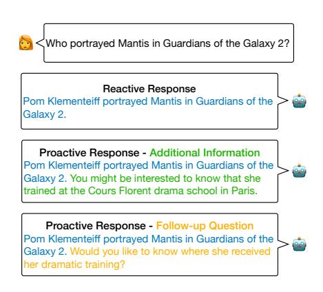
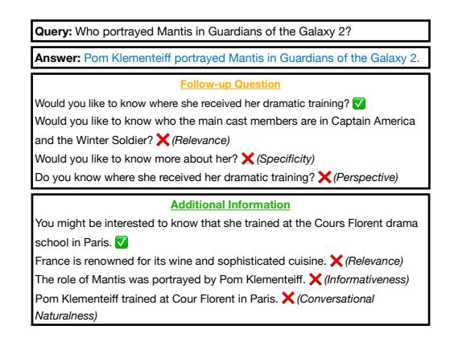
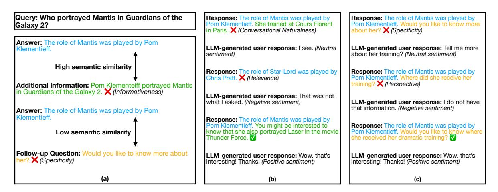

# **Redefining Proactivity for Information Seeking Dialogue**

Jing Yang Lee1\*, Seokhwan Kim2, Kartik Mehta3, Jiun-Yu Kao3, Yu-Hsiang Lin3,4, Arpit Gupta3
Nanyang Technological University1, Google Cloud AI2, Amazon AGI3, Meta4
jingyang001@e.ntu.edu.sg1, seokhwankim@google.com2, yuhsiang@meta.com4
{kartim, jiunyk, guparpit}@amazon.com3

### **Abstract**

Information-Seeking Dialogue (ISD) agents aim to provide accurate responses to user queries. While proficient in directly addressing user queries, these agents, as well as LLMs in general, predominantly exhibit reactive behavior, lacking the ability to generate proactive responses that actively engage users in sustained conversations. However, existing definitions of proactive dialogue in this context do not focus on how each response actively engages the user and sustains the conversation. Hence, we present a new definition of proactivity that focuses on enhancing the 'proactiveness' of each generated response via the introduction of new information related to the initial query. To this end, we construct a proactive dialogue dataset comprising 2,000 single-turn conversations, and introduce several automatic metrics to evaluate response 'proactiveness' which achieved high correlation with human annotation. Additionally, we introduce two innovative Chain-of-Thought (CoT) prompts, the 3-step CoT and the 3-in-1 CoT prompts, which consistently outperform standard prompts by up to 90% in the zero-shot setting.

### 1 Introduction

Generally, the aim of Information-Seeking Dialogue (ISD) agents (Dziri et al., 2022; Nakamura et al., 2022) is to generate an informative response which answers the user's query. In these interactions, users typically pose questions to obtain specific pieces of information, and the dialogue agent generates coherent responses which contains the information requested by the user. In recent years, Large Language Models (LLMs) have generally succeeded at achieving this goal (Li et al., 2023a; Braunschweiler et al., 2023). However, current ISD agents, as well as LLMs in general, tend to be more reactive than proactive. An example of a reactive

Figure 1: Illustration of a single user query and the corresponding reactive and proactive responses. Each proactive response corresponds to a specific proactive element type. The follow-up question is marked in orange text, additional information is denoted by green text, and the answer component is indicated in blue text.

response is provided in Figure 1. Responses generated by a reactive ISD agent would adequately address the user's query but fail to proactively engage the user. Once the requested information is provided, the conversation with the ISD agent naturally concludes.

In ISD, existing work on proactivity primarily focuses on generating clarifying questions and eliciting user preferences (Deng et al., 2023), aiming to resolve ambiguity in the user's query or uncover their preference respectively. Current definitions of proactivity in ISD do not emphasize engaging the user or sustaining the conversation once the desired information has been provided. Hence, we introduce a novel definition of ISD proactivity that emphasizes generating responses that aim to sustain the interaction by proactively engaging the user via the introduction of new information pertinent to the initial query. By proactively providing new related information, the agent can stimulate the user's interest, prompting further inquiries and sustaining the conversation. Hence, our definition of ISD proactivity focuses on actively delivering

\*Work done during internship at Amazon AGI.

information related to the initial query in a conversational manner, thereby naturally guiding the conversation towards addressing multiple pieces of information, improving the overall informativeness during interactions with users and further enhancing user satisfaction [\(Deng et al.,](#page-8-2) [2023;](#page-8-2) [Doherty](#page-8-3) [and Doherty,](#page-8-3) [2018\)](#page-8-3). Unlike prior definitions, we focus on the proactiveness of each individual response, evaluating them individually rather than as part of the entire conversation. This allows us to evaluate responses on specific criterion (Section 3).

According to our definition, a proactive response consists of the answer to the user's query and a proactive element, which refers to new information related to the initial query. The proactive element can be further categorized as either a Follow-up Question (FQ) or Additional Information(AI). Samples of proactive responses according to our definitions are also provided in Figure [1.](#page-0-0) It's important to note that this work does not encompass factual accuracy or information correctness. The focus is purely on syntactic and semantic proactivity.

In this paper, our contributions are as follows:

- 1. We introduce a novel response-level definition of proactivity for ISD.
- 2. We construct a proactive dialogue corpus consisting of 2,000 single-turn conversations.
- 3. We introduce a set of automatic metrics designed to measure the level of 'proactiveness' in a response, according to our definition of proactive dialogue. Our metrics demonstrate high correlation with human annotation.
- 4. We propose two in-context Chain-of-Thought (CoT) prompts, namely the 3-step CoT prompt and the 3-in-1 CoT prompt, which outperform standard few-shot prompting. Additionally, utilizing our corpus, we demonstrate the efficacy of instruction-tuning in the context of proactive response generation.
- 5. We demonstrate the efficacy of our approach in sustaining user interaction and improving conversational informativeness and in the multi-turn scenarios.

# 2 Related Work

Proactive Dialogue Proactive dialogue encompasses various techniques for engaging users by steering conversations in specific directions. In the

context of Open-Domain (OD) dialogue, some popular proactive dialogue tasks include: target-guided dialogue, prosocial dialogue, and non-collaborative dialogue. Target guided dialogue focuses on directing interactions toward predefined topics or entities, using methods such as response planning [\(Kishinami et al.,](#page-9-2) [2022\)](#page-9-2), event-based knowledge graphs [\(Xu et al.,](#page-10-0) [2021\)](#page-10-0), and commonsense bridging [\(Gupta et al.,](#page-9-3) [2022a\)](#page-9-3). Prosocial dialogue involves generating non-offensive responses that adhere to societal norms [\(Kim et al.,](#page-9-4) [2022\)](#page-9-4). In the context of Task-Oriented (TO) dialogue, proactive dialogue definitions include non-collaborative dialogue as well as enriched TO dialogue. In noncollaborative dialogue, the agent and user have opposing objectives. Some examples include persuasion [\(Wang et al.,](#page-10-1) [2019;](#page-10-1) [Wu et al.,](#page-10-2) [2021\)](#page-10-2), negotiation [\(He et al.,](#page-9-5) [2018\)](#page-9-5), and deception-based dialogue [\(Santhanam et al.,](#page-9-6) [2020\)](#page-9-6). Enriched TO dialogue shares some similarities with our task. However, while enriched TO dialogue focuses on enhancing conversational naturalness through additional information, our goal is to sustain ISD. Rather than prioritizing naturalness, we aim to encourage user engagement by introducing new information (either directly or through a FQ) that prompts the user to continue the conversation.

With regard to ISD specifically, response proactivity largely revolves around generating clarifying questions and eliciting user preferences [\(Deng](#page-8-2) [et al.,](#page-8-2) [2023\)](#page-8-2). Clarifying question generation aims to resolve ambiguity in user queries to provide the user with the requested information [\(Alianne](#page-8-4)[jadi et al.,](#page-8-4) [2021\)](#page-8-4). Approaches include retrieval and ranking-based frameworks [\(Aliannejadi et al.,](#page-8-5) [2019\)](#page-8-5), reinforcement learning with clarification utility rewards [\(Zamani et al.,](#page-10-3) [2020\)](#page-10-3), and multistep frameworks predicting the need for a clarifying question before generating one [\(Aliannejadi](#page-8-4) [et al.,](#page-8-4) [2021;](#page-8-4) [Guo et al.,](#page-9-7) [2021\)](#page-9-7). Some methods also combine clarifying questions and conversational QA in multi-turn context [\(Deng et al.,](#page-8-6) [2022;](#page-8-6) [Guo](#page-9-7) [et al.,](#page-9-7) [2021\)](#page-9-7). User preference elicitation involves proactively reveals the user's interests for better recommendations [\(Zhang et al.,](#page-10-4) [2018\)](#page-10-4). This task is often treated as a decision-making problem often tackled with reinforcement learning [\(Zhang et al.,](#page-10-4) [2018;](#page-10-4) [Deng et al.,](#page-8-7) [2021;](#page-8-7) [Jaques et al.,](#page-9-8) [2019\)](#page-9-8). Unlike earlier definitions, we do not concentrate on specific proactive ISD aspects like clarifying question generation or user preference elicitation. In-

Figure 2: Examples of FQs and AI. Proactive elements that are accepted or unaccepted are symbolized by a green checkmark or a red "X" respectively. The criteria for deeming each proactive element as unacceptable is specified adjacent to the corresponding red "X".

stead, we solely focus on enhancing proactivity by providing relevant information. Moreover, we evaluate the proactiveness of each individual response separately, rather than considering the entire conversation.

**LLM-based ISD** In recent years, LLMs have emerged as leading models in language generation tasks, demonstrating state-of-the-art performance. In ISD, recent methods utilize LLMs through incontext learning or supervised fine-tuning. Incontext learning refers to learning a new task during inference with a few prompt examples. Approaches leveraging few-shot (Li et al., 2023b; Chada and Natarajan, 2021) and CoT (Yoran et al., 2023; Sultan et al., 2024) prompts have been employed in this context. LLMs are also often trained on dialogue contexts alongside task instructions, which is known as instruction tuning, to enhance zero-shot performance. In the context of dialogue, LLMs such as Flan-T5 (Chung et al., 2022), InstructGPT (Ouyang et al., 2022), and InstructDial (Gupta et al., 2022b) were explicitly trained on dialogue data for chat applications. Likewise, instruction-tuning has also been applied to improve the accuracy and informativeness of conversational QA responses (Jiang et al., 2024; Razumovskaia et al., 2024). These methods excel at achieving the primary aim of ISD to address user queries. However, as highlighted in Section 1, they tend to produce reactive responses that do not proactively engage the user.

### **3 Problem Definition**

We propose a new proactive response definition for ISD that consists of two components: an Answer and a Proactive Element. The Answer directly addresses the user's query, while the Proactive Element actively engages the user by providing related information. The proactive element enriches the user's understanding and can spark further interest, prompting them to further engage the conversation to find out more. We further classify the Proactive Element into two main categories: Additional Information (AI) and Follow-up Questions (FQs).

AI refers to any knowledge not explicitly requested in the user's query or mentioned in the answer, but that could be of interest to the user. The provision of high-quality AI enriches the conversation by increasing its informativeness, and encouraging the user to continue the interaction. To determine if an AI qualifies, the following criteria must be met:

- 1. *Relevance*. The AI should be relevant to the user's query.
- 2. *Informativeness*. The AI should provide substantial supplementary details beyond the original Answer. It should not be simply a rephrased version of the Answer.
- 3. *Naturalness*. The AI should be natural in a spoken conversational context. It should be introduced in a conversational manner and avoid excessive verbosity.

It's important to note that LLMs often have a tendency to include excessive details in a single response, which can hinder naturalness, particularly in spoken context. Our goal is to incorporate AI in a concise and engaging manner that encourages the user to continue the interaction.

A FQ asks if the user is interested in a specific piece of additional relevant information related to their initial query. The information itself is not explicitly provided in the FQ. By asking appropriate FQs, we can extend the conversation beyond the initial turn. The criteria for a FQ are defined as follows:

- 1. *Relevance*. The FQ should relate to knowledge relevant to the user's query.
- 2. Specificity. The FQ should be as specific as possible, referring to a particular piece of information rather than making a broad inquiry. Specific FQs lead to more informative and satisfying interactions.

3. *Perspective*. The FQ should not request information from the user. It should focus on assisting and informing the user, avoiding information seeking.

Figure 2 presents examples of responses that do not meet the previously mentioned criteria.

Unlike prior work in ISD, our definition focuses specifically on response proactivity rather than factual accuracy. Therefore, we do not include criteria related to information accuracy or ground responses on external knowledge sources. There factors are often used to prevent hallucination and ensure factual correctness.

# 4 Proactive Response Evaluation

In this section, we propose several automatic metrics to quantify the proactivity of a response. A reliable automatic metric would enable objective and cost-effective evaluation, ultimately enhancing the reproducibility of our work.

# 4.1 Baseline Metrics

We introduce two baseline metrics: a promptbased metric and a classification-based metric. The prompt-based metric, ranging from 0 to 1, is obtained by prompting an LLM to assess the proactiveness of responses based on our definition. The classification-based metric is calculated using two language models, each evaluating responses as valid or invalid for each Proactive Element type, according to our definition. More details are provided in Appendix [A.6.](#page-13-0)

# 4.2 Proposed Metrics

The baseline scores often lack interpretability. They do not provide specific information about which criteria a response violates. Therefore, we propose two additional metrics which evaluate the responses based on the criteria defined in Section [3.](#page-2-0) Semantic similarity-based We design a metric based on semantic similarity to evaluate the *Relevance* of a proactive response, as well as the *Specificity* and *Informativeness* of the FQ and AI respectively.

The respective semantic scores for the FQ and AI are computed as follows:

• FQ: 
$$\alpha * BS(Q, R) + (1 - \alpha)\bar{BS}(R)$$

• AI: 
$$\alpha * BS(Q, R) + (1 - \alpha)(1 - \bar{BS}(R))$$

where Q and R denote the input query and generated response respectively. BS(·) refers to the BERTScore, and BS¯ (res) = 1 n P i,j|i∈n,j∈n BS(ri , rj ), the mean pair-wise semantic similarity. α is a hyperparameter introduced to control the distribution between both terms. In our implementation, the BertScore is computed using the deberta-base-v3 embeddings.

It should also be highlighted that a completely irrelevant or incoherent proactive element would likely result in a lower semantic similarity score compared compared to a generic but related response. This difference is primarily due to the first term in the equations, which involves the BertScore calculation between the query and the response. An entirely irrelevant response would achieve a very low BertScore, whereas a generic but relevant response would obtain a relatively higher score. Conssequently, after appropriately adjusting α, the semantic score for a proactive response containing irrelevant elements would be significantly low.

User Simulation-based We also propose a user simulation-based metric to quantify the quality of the Proactive Element based on *Relevance* and *Conversational Naturalness* of the AI, as well as the *Specificity* and *Perspective* of the FQ. This involves prompting an LLM to generate a simulated user turn in response to a given proactive system response, and then measuring the sentiment of the LLM-generated user response. After analyzing our initial responses, we found that users often react positively when we provide proactive responses paired with custom FQs or seamlessly integrated AI. This approach frequently elicits enthusiastic acknowledgments such as 'Yes, thank you!', 'Wow! That's interesting.', or 'That would be great. Thanks!', contributing to a LLM-generated user response with significantly positive sentiment. Conversely, subpar proactive responses that include generic FQs or conversationally unnatural AI tend to elicit replies with comparatively neutral sentiment. Furthermore, FQs with the wrong *Perspective* (requesting information from the user) generally lead to more detailed responses containing the requested information, often resulting in a neutral sentiment. Naturally, responses that do not address the user's query will typically elicit responses with negative sentiment. Samples of generated responses and the corresponding LLM-generated user responses for AI and FQ are provided in Figure [3\(](#page-4-0)b) and [3\(](#page-4-0)c) respectively.

Figure 3: (a) Illustration of low and high semantic similarities in low quality AI and FQ respectively. (b) Samples of LLM-generated user responses for AI. (c) Samples of LLM-generated user responses for FQ.

To obtain the user-simulation score, we prompt the LLM (with a temperature value of t=0.5) n times to generate n LLM-generated user responses. We then calculate the positive sentiment of each LLM-generated user response and take the average. The model used to determine positive sentiment is a fine-tuned RoBERTa pretrained language model (Camacho-Collados et al., 2022). Any arbitrary LLM can used to generate the simulated user responses. This process is summarized in Algo 1.

### 5 Corpus Construction

To create our proactive dialogue corpus, we utilize the Natural Questions Question Answer (NQQA) dataset (Kwiatkowski et al., 2019). Each sample in this dataset includes a query, a short answer, and a long answer. The short answer provides the response to the query, while the long answer contains some relevant information. We selected the NQQA corpus because the query and short answer format resembles a typical single-turn conversation between a human and an ISD agent. However, since the short answer in the NQQA corpus consists of only a single entity, it needed to be modified for conversational naturalness.

### 5.1 Annotation

To achieve this, we engaged crowdworkers via Amazon Mechanical Turk (AMT) to modify the short answer to make it sound more like a natural response in a conversation, and to formulate the Proactive Element. AMT instructions are provided in Appendix A.3. These two components were concatenated to form the final proactive response. This process allowed us to construct a proactive

dialogue corpus that could be used for training and evaluating proactive ISD agents.

Answer The Answer component is obtained by enhancing the short answer found in the NQQA corpus. This short answer, which is the direct answer to the user's query, is modified to ensure conversational naturalness. The crowdworkers were given instructions to integrate the short response, often a single verb or noun, into a coherent and comprehensive sentence that effectively addresses the user's query in a conversational style. For example, for the query in Figure 1 and 2, the short response ('Pom Klementieff') resulted in the following sentence: 'The actress who portrayed Mantis in Guardians of the Galaxy is Pom Klementieff'.

**Proactive Element** To obatin the Proactive Element (FQ or AI), crowdworkers were provided the long answer for reference. This simplified the task and ensured the accuracy of the Proactive Elements. For FOs, crowdworkers were instructed to create inquiries that assessed whether the user desired a particular piece of information from the long answer. They were encouraged to make their questions as specific as possible, focusing on particular details rather than general inquiries. For AI, crowdworkers were told to identify a single piece of information not already present in the initial answer and rephrase it to sound more natural in a conversational context. Before annotation, we filtered the NQQA dataset based on query length and long answer length. This ensured the clarity of the query and guaranteed that there was sufficient information from which the crowdworkers can formulate either a FQ or AI.

## 5.2 Corpus Features and Statistics

Based on the approach described above, we extracted 1000 samples and collect 2,000 proactive dialogue samples (1,000 for each Proactive Element) for our proactive response corpus. Each sample in our corpus constitutes a single-turn dialogue consisting of a user query and a proactive response. After obtaining the annotations, we manually validated each response to ensure fluency and correct any spelling or grammatical errors. The number of samples and average query length are identical for both Proactive Elements as a single query is used to obtain two proactive responses, one for each Proactive Element. Some basic corpus statistics are provided in Appendix [A.4.](#page-13-1)

# 6 Proactive Response Generation

In this section, we describe the in-context learning and instruction-tuning approaches we employed for proactive response generation.

# 6.1 In-context Learning

In-context learning involves explicitly providing demonstrations of the task at hand to the model as part of a prompt. In this section, we describe three in-context learning prompts we utilize for proactive response generation: the direct prompt, 3-step CoT prompt, and 3-in-1 CoT prompt. For our experiments, we implemented 0-shot, 1-shot, and 3-shot variants of these three prompts. Prompt templates are provided in Appendix [A.5.](#page-13-2)

Direct Prompt This approach involves direct prompting the LLM to generate answers with the task description and demonstrations of queryproactive response pairs.

3-step Chain-of-Thought (CoT) Prompt We introduce a 3-step CoT prompting approach designed to effectively generate proactive responses. Our approach involves systematically decomposing the proactive response generation task into three distinct subtasks, each addressed by an independent prompt. This entails three separate inferences. The output from each prompt is used as input for the subsequent prompt. The three prompts corresponding to the three subtasks are as follows:

- P1 : Query answering: In this step, the LLM is prompted to generate the precise answer to the user's query.
- P2 : Related information generation: Building upon the answer generated in P1, the LLM

is directed to identify a specific piece of related information that was not present in the initial answer.

P3 : Proactive Element generation: For the FQ, the LLM is prompted to formulate an inquiry to ask the user if they would like to receive the information generated in P2. Alternatively, for the AI, the LLM is prompted to rephrase the content produced in P2 in a manner that reflects a scenario where the information is being offered to the user.

The final proactive response R is obtained by combining the output of P1 and the output of P3, i.e., R = LLM(P1) + LLM(P3), where + refers to the concatenate operation. We conduct simple post processing (rule-based removal of escape characters as well as excess spacing) on the output of each prompt to ensure the quality of the input to the subsequent prompt.

In the 1-shot and 3-shot versions, demonstration examples were not provided to P1 as P1 achieved good performance in the 0-shot setting. Additionally, since the reference information from which the response is based on is not readily available in our corpus, P2 and P3 would entail manually deriving the reference information for few-shot prompting. 3-in-1 Chain-of-Thought (CoT) Prompt A drawback of the previous approach is the necessity for three distinct model inferences, leading to increased latency during generation. To address this, we attempt to consolidate all three prompts into a single 3-in-1 prompt. This unified prompt provides explicit instructions to the LLM to follow the exact same process as before in a step-by-step manner, encompassing all three subtasks within a single inference. We also implement a 0-shot, 1-shot, and 3-shot version of this prompt. Unlike the 3-stop CoT prompt, no manual derivation of specific information is required. Only the query and response, which are readily available, is required.

Demonstration Selection We also perform demonstration selection using metrics outlined in Section [4.2.](#page-3-0) Specifically, we identify the top-k and bottom-k responses (for a k-shot prompt) using the following criteria: (1) the user-simulation score, (2) the semantic similarity score, and (3) the sum of both scores. Generally, we observe that using the sum of both scores results in the generation of highquality responses that achieve high user-simulation and semantic similarity scores. Full results are provided in Appendix [A.1.](#page-11-1)

|                           | FQ     | AI    |
|---------------------------|--------|-------|
| Prompt-based              | -0.072 | 0.163 |
| Classification-based      | 0.188  | 0.492 |
| User Simulation-based     | 0.256  | 0.331 |
| Semantic Similarity-based | 0.462  | 0.575 |

Table 1: Point Biserial correlations between our proposed user-simulation, semantic similarity, promptbased, and classification-based scores and human annotation

### 6.2 Instruction Tuning

We also instruction tuned an LLM via QLoRA (Dettmers et al., 2023) to generate proactive responses. Leveraging our proposed corpus, we conducted instruction tuning on two distinct tasks corresponding to the generation of proactive responses with either a FQ or AI. We utilized 1000 proactive responses (500 from each proactive element).

# 7 Experiments

Instruction TuningImplementation In our experiments, we utilize the 40b instruction-tuned Falcon LLM (Penedo et al., 2023) and the 13b StableVicuna LLM(Chiang et al., 2023). Results attained using StableVicuna are provided in the Appendix A.2. We utilize a temperature value of 0.2 for all generations. For each Proactive Element, we split our proactive dialogue corpus into two distinct sets: a 500-sample training set and a 500-sample test set. We select demonstration examples for our prompts from the training sets, and then evaluate them on the test set. We instruction-tune the LLM on the training sets for both the FQs and AI concurrently. The instructions used are identical to the direct prompt.

Metric Correlations Table 1 shows the Point Biserial correlations between our new metrics and human annotations, calculated from a dataset of 500 positive samples from our corpus and 500 negative samples generated by prompting a LLM for subpar proactive responses that lack a proactive element, feature low-quality proactive element or are completely irrelevant with respect to the user's input.

The prompt-based baseline yields low correlation scores, highlighting its limitations as a metric. Conversely, the classification-based baseline achieve better, though inconsistent, correlations with human evaluations. Specifically, correlations for AI are higher than those for FQs. This difference arises because negative samples for AI, which

mostly violate the *Informativeness* criteria, are simpler for the model to detect compared to the nuanced, generic responses that characterize negative samples for FQs, which violate the *Specificity* criteria. Future research could involve improving the correlations through further prompt engineering or by enriching the training dataset with more varied negative examples.

The proposed semantic and sentiment scores clearly outperform both baselines. The semantic metric, encompassing *Relevance*, *Informativeness* (AI), and *Specificity* (FQs), achieves the highest correlation scores. This aligns with expectations, as many negative responses lack the required *Informativeness* and *Relevance*. Conversely, the sentiment score focuses on *Perspective* and *Conversational Naturalness*, which are less common in negative samples. Therefore, we recommend using both metrics together to effectively evaluate response proactiveness, covering the criteria outlined in Section 3 comprehensively.

In-Context Learning Scores attained by the direct, 3-step CoT, and 3-in-1 CoT prompts on Falcon-40b-instruct are shown in Table 2. A key finding is that the 3-step CoT prompt generally enhances 0-shot performance, addressing the general lack of proactive element seen in responses in the 0-shot direct and 3-in-1 CoT prompts, which generate fewer tokens in the 0-shot setting. The 3-step prompt resolves this by ensuring the final proactive response includes FQs or AI by concatenating outputs from the 1st and 3rd prompts.

It is also evident that the 3-step CoT prompt surpasses both the 3-in-1 CoT and direct prompts when it comes to the FQ. Conversely, for AI, the 3-in-1 CoT prompt outperforms both the 3-step CoT and direct prompts. This could be attributed to the inherent difficulty in generating high-quality FQs for the LLM, which generally excels at generating informative responses. Consequently, the FQ task benefits more from the 3-step CoT prompt since it breaks down the task into three simpler components.

**Instruction Tuning** Table 2 also includes results for the instruction-tuned Falcon-40b-instruct, which produced responses similar to the 3-shot variants of the 3-step and 3-in-1 CoT prompts for FQs and AI, respectively. These responses strictly adhere to the structure outlined in Section 3. Compared to prompted responses, there are fewer instances of missing Answers or Proactive Elements.

|               |        |                | I               | FQ                  | AI        |                |                 |                     |           |
|---------------|--------|----------------|-----------------|---------------------|-----------|----------------|-----------------|---------------------|-----------|
|               |        | Classification | User Simulation | Semantic Similarity | Num Token | Classification | User Simulation | Semantic Similarity | Num Token |
|               | 0-shot | 0.73           | 0.45            | 0.32                | 20.35     | 0.52           | 0.49            | 0.28                | 28.53     |
| Direct        | 1-shot | 0.92           | 0.51            | 0.51                | 30.55     | 0.74           | 0.51            | 0.33                | 33.67     |
|               | 3-shot | 0.92           | 0.52            | 0.59                | 28.90     | 0.79           | 0.52            | 0.37                | 30.07     |
| 3-step CoT | 0-shot | 0.88           | 0.51            | 0.59                | 32.45     | 0.86           | 0.49            | 0.31                | 38.65     |
|               | 1-shot | 0.93           | 0.53            | 0.61                | 34.73     | 0.81           | 0.52            | 0.35                | 37.18     |
| COI           | 3-shot | 0.95           | 0.53            | 0.62                | 31.79     | 0.90           | 0.54            | 0.38                | 39.28     |
|               | 0-shot | 0.68           | 0.46            | 0.39                | 23.93     | 0.44           | 0.51            | 0.26                | 26.09     |
| 3-in-1 CoT | 1-shot | 0.90           | 0.52            | 0.60                | 29.65     | 0.93           | 0.56            | 0.40                | 38.50     |
| COI           | 3-shot | 0.92           | 0.51            | 0.60                | 34.86     | 0.95           | 0.63            | 0.41                | 34.64     |
| SFT           |        | 0.94           | 0.54            | 0.64                | 28.24     | 0.96           | 0.55            | 0.41                | 32.10     |
| Human         |        | 0.96           | 0.55            | 0.63                | 28.33     | 0.97           | 0.67            | 0.43                | 36.18     |

Table 2: Classification, Semantic similarity, user-simulation scores, and average token length when direct prompting, 3-step prompting, 3-in-1 prompting, and instruction-tuning is applied to Falcon-40b-instruct. The highest score for each metric, other than the scores for the human generated responses, is **bolded**.

Instead, lower-quality responses lacked *Specificity* (FQs) or *Conversational Naturalness* (AI).

# 8 Multi-turn Setting

To demonstrate the efficacy of our approach in the multi-turn conversations, we sampled 50 test cases from our dataset and interactions between a simulated user and an agent using Falcon-40b-instruct. We used 3-step and 3-in-1 CoT prompts with modifications to produce proactive responses, detailed in Appendix A.8.

After conducting 50 simulations, we discovered that when the agent includes AI or FQ, the user is significantly more inclined to continue interacting with the agent. In contrast, responses lacking this proactive element usually consist of the agent merely acknowledging the information provided, naturally ending the conversation (Table 10). From the 50 simulations conducted, we found that approximately 94% of conversations ended after just one turn. In contrast, only 22% and 34% of interactions with the agent generating proactive responses with FQ and AI respectively ended after a single turn. On average, users continued the conversation for 3.9 turns with the FQ agent and 3.2 turns with the AI agent before ending the conversation naturally. For the FQ, the simulated user naturally requests the agent to provide the information suggested by the agent, further sustaining the interaction and improving the informativeness of the whole conversation (Table 11). For AI, the AI provided by the agent would tend to elicit more involved responses from the user rather than a cursory acknowledgement (Table 12) as well as encourage the user to inquire further about the AI provided by the agent.

However, both proactive elements displayed a tendency to repeat the proactive element from earlier in the conversation. We hypothesize that this issue could potentially be alleviated by improving quality of the LLM. To confirm our hypothesis, we repeat the experiment using GPT-4 instead of Falcon-40b-instruct for the Assistant. The sample conversations demonstrate that GPT-4 effectively minimizes such repetitions across up to four dialogue turns (Table 13). In our experiments, we apply our prompts at every conversational turn. However, in real-world ISD, not every turn would warrant a proactive response. Future work could constitute introducing an approach to detect if a proactive response is appropriate.

### 9 Conclusion

In this work, we propose a novel response-level definition of ISD proactivity. Per our definition, a proactive response includes both an Answer and a Proactive Element (FQ or AI). We compiled a dataset consisting of 2000 single-turn dialogues, and introduced a novel 3-step CoT and 3-in-1 CoT prompt that outperforms standard few-shot prompts in generating proactive responses. Future work could entail exploring finer-grained proactive elements or employing reward modelling and Reinforcement Learning with Human Feedback (RLHF) for fine-tuning. Expanding the current corpus to the multi-turn scenarios could also facilitate further research to improve in-context learning or supervised fine-tuning performance. Existing conversationlevel metrics in ISD could also be enhanced to account for response-level proactivity. The performance of different LLMs on our task can also be explored.

# 10 Limitations

Firstly, the effectiveness of the generation approaches proposed are highly dependent on the LLMs that underpin them. Hence, different LLMs may display inherent biases or produce unforeseen outputs, resulting in lower quality response sets. Secondly, there are limitations based on the computational resources available. We do not have the capability to conduct in-context learning or instruction tuning experiments with larger or more recent LLMs. Future work could entail the evaluating the zero-shot performance of these LLMs on our proposed task. Thirdly, in this work, we do not assert that our prompt template is the optimal choice for proactive response generation. Our direct, CoT and 3-step CoT prompt templates are intended to form a baseline for researchers to improve upon. Additional work could entail additional, more deliberate prompt engineering.

# 11 Ethics Statement

We recruited annotators ("Turkers") through Amazon Mechanical Turk to build our dataset. Each Turker received detailed information about the Human Intelligence Task (HIT), including task descriptions, requirements and compensation, before agreeing to participate. They were free to withdraw from the task at any time for any reason. Each Turker was compensated at the rate of 0.20USD per HIT, and each HIT took an average of 55.6 seconds (12.90USD per hour).

# References

Mohammad Aliannejadi, Julia Kiseleva, Aleksandr Chuklin, Jeff Dalton, and Mikhail Burtsev. 2021. [Building and evaluating open-domain dialogue cor](https://doi.org/10.18653/v1/2021.emnlp-main.367)[pora with clarifying questions.](https://doi.org/10.18653/v1/2021.emnlp-main.367) In *Proceedings of the 2021 Conference on Empirical Methods in Natural Language Processing*, pages 4473–4484, Online and Punta Cana, Dominican Republic. Association for Computational Linguistics.

Mohammad Aliannejadi, Hamed Zamani, Fabio Crestani, and W. Bruce Croft. 2019. [Asking clar](https://doi.org/10.1145/3331184.3331265)[ifying questions in open-domain information-seeking](https://doi.org/10.1145/3331184.3331265) [conversations.](https://doi.org/10.1145/3331184.3331265) In *Proceedings of the 42nd International ACM SIGIR Conference on Research and Development in Information Retrieval*, SIGIR'19, page 475–484, New York, NY, USA. Association for Computing Machinery.

Norbert Braunschweiler, Rama Doddipatla, Simon Keizer, and Svetlana Stoyanchev. 2023. [Evaluating](http://arxiv.org/abs/2309.11838) [large language models for document-grounded re](http://arxiv.org/abs/2309.11838)[sponse generation in information-seeking dialogues.](http://arxiv.org/abs/2309.11838)

Jose Camacho-Collados, Kiamehr Rezaee, Talayeh Riahi, Asahi Ushio, Daniel Loureiro, Dimosthenis Antypas, Joanne Boisson, Luis Espinosa-Anke, Fangyu Liu, Eugenio Martínez-Cámara, Gonzalo Medina, Thomas Buhrmann, Leonardo Neves, and Francesco Barbieri. 2022. [Tweetnlp: Cutting-edge natural lan](http://arxiv.org/abs/2206.14774)[guage processing for social media.](http://arxiv.org/abs/2206.14774)

Rakesh Chada and Pradeep Natarajan. 2021. [Fewshotqa:](http://arxiv.org/abs/2109.01951) [A simple framework for few-shot learning of question](http://arxiv.org/abs/2109.01951) [answering tasks using pre-trained text-to-text models.](http://arxiv.org/abs/2109.01951)

Wei-Lin Chiang, Zhuohan Li, Zi Lin, Ying Sheng, Zhanghao Wu, Hao Zhang, Lianmin Zheng, Siyuan Zhuang, Yonghao Zhuang, Joseph E. Gonzalez, Ion Stoica, and Eric P. Xing. 2023.

Hyung Won Chung, Le Hou, Shayne Longpre, Barret Zoph, Yi Tay, William Fedus, Yunxuan Li, Xuezhi Wang, Mostafa Dehghani, Siddhartha Brahma, Albert Webson, Shixiang Shane Gu, Zhuyun Dai, Mirac Suzgun, Xinyun Chen, Aakanksha Chowdhery, Alex Castro-Ros, Marie Pellat, Kevin Robinson, Dasha Valter, Sharan Narang, Gaurav Mishra, Adams Yu, Vincent Zhao, Yanping Huang, Andrew Dai, Hongkun Yu, Slav Petrov, Ed H. Chi, Jeff Dean, Jacob Devlin, Adam Roberts, Denny Zhou, Quoc V. Le, and Jason Wei. 2022. [Scaling instruction-finetuned](http://arxiv.org/abs/2210.11416) [language models.](http://arxiv.org/abs/2210.11416)

Yang Deng, Wenqiang Lei, Wai Lam, and Tat-Seng Chua. 2023. [A survey on proactive dialogue systems:](http://arxiv.org/abs/2305.02750) [Problems, methods, and prospects.](http://arxiv.org/abs/2305.02750)

Yang Deng, Wenqiang Lei, Wenxuan Zhang, Wai Lam, and Tat-Seng Chua. 2022. [PACIFIC: Towards proac](https://doi.org/10.18653/v1/2022.emnlp-main.469)[tive conversational question answering over tabular](https://doi.org/10.18653/v1/2022.emnlp-main.469) [and textual data in finance.](https://doi.org/10.18653/v1/2022.emnlp-main.469) In *Proceedings of the 2022 Conference on Empirical Methods in Natural Language Processing*, pages 6970–6984, Abu Dhabi, United Arab Emirates. Association for Computational Linguistics.

Yang Deng, Yaliang Li, Fei Sun, Bolin Ding, and Wai Lam. 2021. [Unified conversational recommendation](http://arxiv.org/abs/2105.09710) [policy learning via graph-based reinforcement learn](http://arxiv.org/abs/2105.09710)[ing.](http://arxiv.org/abs/2105.09710)

Tim Dettmers, Artidoro Pagnoni, Ari Holtzman, and Luke Zettlemoyer. 2023. [Qlora: Efficient finetuning](http://arxiv.org/abs/2305.14314) [of quantized llms.](http://arxiv.org/abs/2305.14314)

Kevin Doherty and Gavin Doherty. 2018. [Engagement](https://doi.org/10.1145/3234149) [in hci: Conception, theory and measurement.](https://doi.org/10.1145/3234149) *ACM Comput. Surv.*, 51(5).

Nouha Dziri, Ehsan Kamalloo, Sivan Milton, Osmar Zaiane, Mo Yu, Edoardo M. Ponti, and Siva Reddy. 2022. [Faithdial: A faithful benchmark for](http://arxiv.org/abs/2204.10757) [information-seeking dialogue.](http://arxiv.org/abs/2204.10757)

- Meiqi Guo, Mingda Zhang, Siva Reddy, and Malihe Alikhani. 2021. [Abg-coQA: Clarifying ambiguity in](https://doi.org/10.24432/C5F30Z) [conversational question answering.](https://doi.org/10.24432/C5F30Z) In *3rd Conference on Automated Knowledge Base Construction*.
- Prakhar Gupta, Harsh Jhamtani, and Jeffrey Bigham. 2022a. [Target-guided dialogue response generation](https://doi.org/10.18653/v1/2022.findings-naacl.97) [using commonsense and data augmentation.](https://doi.org/10.18653/v1/2022.findings-naacl.97) In *Findings of the Association for Computational Linguistics: NAACL 2022*, pages 1301–1317, Seattle, United States. Association for Computational Linguistics.
- Prakhar Gupta, Cathy Jiao, Yi-Ting Yeh, Shikib Mehri, Maxine Eskenazi, and Jeffrey P. Bigham. 2022b. [In](http://arxiv.org/abs/2205.12673)[structdial: Improving zero and few-shot generaliza](http://arxiv.org/abs/2205.12673)[tion in dialogue through instruction tuning.](http://arxiv.org/abs/2205.12673)
- He He, Derek Chen, Anusha Balakrishnan, and Percy Liang. 2018. [Decoupling strategy and generation in](https://doi.org/10.18653/v1/D18-1256) [negotiation dialogues.](https://doi.org/10.18653/v1/D18-1256) In *Proceedings of the 2018 Conference on Empirical Methods in Natural Language Processing*, pages 2333–2343, Brussels, Belgium. Association for Computational Linguistics.
- Pengcheng He, Jianfeng Gao, and Weizhu Chen. 2021. [Debertav3: Improving deberta using electra-style pre](http://arxiv.org/abs/2111.09543)[training with gradient-disentangled embedding shar](http://arxiv.org/abs/2111.09543)[ing.](http://arxiv.org/abs/2111.09543)
- Sameer Jain, Vaishakh Keshava, Swarnashree Mysore Sathyendra, Patrick Fernandes, Pengfei Liu, Graham Neubig, and Chunting Zhou. 2023. [Multi-dimensional evaluation of text summarization](https://doi.org/10.18653/v1/2023.findings-acl.537) [with in-context learning.](https://doi.org/10.18653/v1/2023.findings-acl.537) In *Findings of the Association for Computational Linguistics: ACL 2023*, pages 8487–8495, Toronto, Canada. Association for Computational Linguistics.
- Natasha Jaques, Asma Ghandeharioun, Judy Hanwen Shen, Craig Ferguson, Agata Lapedriza, Noah Jones, Shixiang Gu, and Rosalind Picard. 2019. [Way off](http://arxiv.org/abs/1907.00456)[policy batch deep reinforcement learning of implicit](http://arxiv.org/abs/1907.00456) [human preferences in dialog.](http://arxiv.org/abs/1907.00456)
- Zhengbao Jiang, Zhiqing Sun, Weijia Shi, Pedro Rodriguez, Chunting Zhou, Graham Neubig, Xi Victoria Lin, Wen tau Yih, and Srinivasan Iyer. 2024. [Instruction-tuned language models are better knowl](http://arxiv.org/abs/2402.12847)[edge learners.](http://arxiv.org/abs/2402.12847)
- Hyunwoo Kim, Youngjae Yu, Liwei Jiang, Ximing Lu, Daniel Khashabi, Gunhee Kim, Yejin Choi, and Maarten Sap. 2022. [Prosocialdialog: A prosocial](http://arxiv.org/abs/2205.12688) [backbone for conversational agents.](http://arxiv.org/abs/2205.12688)
- Yosuke Kishinami, Reina Akama, Shiki Sato, Ryoko Tokuhisa, Jun Suzuki, and Kentaro Inui. 2022. [Target-guided open-domain conversation planning.](https://aclanthology.org/2022.coling-1.55) In *Proceedings of the 29th International Conference on Computational Linguistics*, pages 660–668, Gyeongju, Republic of Korea. International Committee on Computational Linguistics.
- Tom Kwiatkowski, Jennimaria Palomaki, Olivia Redfield, Michael Collins, Ankur Parikh, Chris Alberti,

- Danielle Epstein, Illia Polosukhin, Jacob Devlin, Kenton Lee, Kristina Toutanova, Llion Jones, Matthew Kelcey, Ming-Wei Chang, Andrew M. Dai, Jakob Uszkoreit, Quoc Le, and Slav Petrov. 2019. [Natu](https://doi.org/10.1162/tacl_a_00276)[ral questions: A benchmark for question answering](https://doi.org/10.1162/tacl_a_00276) [research.](https://doi.org/10.1162/tacl_a_00276) *Transactions of the Association for Computational Linguistics*, 7:452–466.
- Siheng Li, Cheng Yang, Yichun Yin, Xinyu Zhu, Zesen Cheng, Lifeng Shang, Xin Jiang, Qun Liu, and Yujiu Yang. 2023a. [Autoconv: Automatically gener](https://doi.org/10.18653/v1/2023.acl-short.149)[ating information-seeking conversations with large](https://doi.org/10.18653/v1/2023.acl-short.149) [language models.](https://doi.org/10.18653/v1/2023.acl-short.149) In *Proceedings of the 61st Annual Meeting of the Association for Computational Linguistics (Volume 2: Short Papers)*. Association for Computational Linguistics.
- Tianle Li, Xueguang Ma, Alex Zhuang, Yu Gu, Yu Su, and Wenhu Chen. 2023b. [Few-shot in-context learn](http://arxiv.org/abs/2305.01750)[ing for knowledge base question answering.](http://arxiv.org/abs/2305.01750)
- Kai Nakamura, Sharon Levy, Yi-Lin Tuan, Wenhu Chen, and William Yang Wang. 2022. [HybriDialogue: An](https://doi.org/10.18653/v1/2022.findings-acl.41) [information-seeking dialogue dataset grounded on](https://doi.org/10.18653/v1/2022.findings-acl.41) [tabular and textual data.](https://doi.org/10.18653/v1/2022.findings-acl.41) In *Findings of the Association for Computational Linguistics: ACL 2022*, pages 481–492, Dublin, Ireland. Association for Computational Linguistics.
- Long Ouyang, Jeff Wu, Xu Jiang, Diogo Almeida, Carroll L. Wainwright, Pamela Mishkin, Chong Zhang, Sandhini Agarwal, Katarina Slama, Alex Ray, John Schulman, Jacob Hilton, Fraser Kelton, Luke Miller, Maddie Simens, Amanda Askell, Peter Welinder, Paul Christiano, Jan Leike, and Ryan Lowe. 2022. [Training language models to follow instructions with](http://arxiv.org/abs/2203.02155) [human feedback.](http://arxiv.org/abs/2203.02155)
- Guilherme Penedo, Quentin Malartic, Daniel Hesslow, Ruxandra Cojocaru, Alessandro Cappelli, Hamza Alobeidli, Baptiste Pannier, Ebtesam Almazrouei, and Julien Launay. 2023. [The RefinedWeb dataset](http://arxiv.org/abs/2306.01116) [for Falcon LLM: outperforming curated corpora](http://arxiv.org/abs/2306.01116) [with web data, and web data only.](http://arxiv.org/abs/2306.01116) *arXiv preprint arXiv:2306.01116*.
- Evgeniia Razumovskaia, Ivan Vulic, Pavle ´ Markovic, Tomasz Cichy, Qian Zheng, Tsung- ´ Hsien Wen, and Paweł Budzianowski. 2024. *[Dial BeInfo for Faithfulness](http://arxiv.org/abs/2311.09800)*: Improving factuality [of information-seeking dialogue via behavioural](http://arxiv.org/abs/2311.09800) [fine-tuning.](http://arxiv.org/abs/2311.09800)
- Sashank Santhanam, Zhuo Cheng, Brodie Mather, Bonnie Dorr, Archna Bhatia, Bryanna Hebenstreit, Alan Zemel, Adam Dalton, Tomek Strzalkowski, and Samira Shaikh. 2020. [Learning to plan and real](https://doi.org/10.18653/v1/2020.findings-emnlp.247)[ize separately for open-ended dialogue systems.](https://doi.org/10.18653/v1/2020.findings-emnlp.247) In *Findings of the Association for Computational Linguistics: EMNLP 2020*, pages 2736–2750, Online. Association for Computational Linguistics.
- Md Arafat Sultan, Jatin Ganhotra, and Ramón Fernandez Astudillo. 2024. [Structured chain-of](http://arxiv.org/abs/2402.11770)[thought prompting for few-shot generation of content](http://arxiv.org/abs/2402.11770)[grounded qa conversations.](http://arxiv.org/abs/2402.11770)

- Xuewei Wang, Weiyan Shi, Richard Kim, Yoojung Oh, Sijia Yang, Jingwen Zhang, and Zhou Yu. 2019. [Per](https://doi.org/10.18653/v1/P19-1566)[suasion for good: Towards a personalized persuasive](https://doi.org/10.18653/v1/P19-1566) [dialogue system for social good.](https://doi.org/10.18653/v1/P19-1566) In *Proceedings of the 57th Annual Meeting of the Association for Computational Linguistics*, pages 5635–5649, Florence, Italy. Association for Computational Linguistics.
- Qingyang Wu, Yichi Zhang, Yu Li, and Zhou Yu. 2021. [Alternating recurrent dialog model with large-scale](https://doi.org/10.18653/v1/2021.eacl-main.110) [pre-trained language models.](https://doi.org/10.18653/v1/2021.eacl-main.110) In *Proceedings of the 16th Conference of the European Chapter of the Association for Computational Linguistics: Main Volume*, pages 1292–1301, Online. Association for Computational Linguistics.
- Jun Xu, Zeyang Lei, Haifeng Wang, Zheng-Yu Niu, Hua Wu, and Wanxiang Che. 2021. Enhancing dialog coherence with event graph grounded content planning. In *Proceedings of the Twenty-Ninth International Joint Conference on Artificial Intelligence*, IJCAI'20.
- Ori Yoran, Tomer Wolfson, Ben Bogin, Uri Katz, Daniel Deutch, and Jonathan Berant. 2023. [Answering](https://doi.org/10.18653/v1/2023.emnlp-main.364) [questions by meta-reasoning over multiple chains](https://doi.org/10.18653/v1/2023.emnlp-main.364) [of thought.](https://doi.org/10.18653/v1/2023.emnlp-main.364) In *Proceedings of the 2023 Conference on Empirical Methods in Natural Language Processing*, pages 5942–5966, Singapore. Association for Computational Linguistics.
- Hamed Zamani, Susan Dumais, Nick Craswell, Paul Bennett, and Gord Lueck. 2020. [Generating clar](https://doi.org/10.1145/3366423.3380126)[ifying questions for information retrieval.](https://doi.org/10.1145/3366423.3380126) In *Proceedings of The Web Conference 2020*, WWW '20, page 418–428, New York, NY, USA. Association for Computing Machinery.
- Yongfeng Zhang, Xu Chen, Qingyao Ai, Liu Yang, and W. Bruce Croft. 2018. [Towards conversational search](https://doi.org/10.1145/3269206.3271776) [and recommendation: System ask, user respond.](https://doi.org/10.1145/3269206.3271776) In *Proceedings of the 27th ACM International Conference on Information and Knowledge Management*, CIKM '18, page 177–186, New York, NY, USA. Association for Computing Machinery.

# A Appendix

## A.1 Demonstration Selection

Results for 1-shot, 3-shot and 5-shot demonstration selection are presented in Table [3,](#page-12-0) [4,](#page-12-1) and [5](#page-12-2) respectively.

Generally, the results attained align closely with our expectations. When we select demonstration examples using sentiment or semantic metrics as criteria, the resulting responses tend to achieve higher scores in the user simulation and semantic similarity scores respectively. For example, with regard to the FQ, selecting the bottom-1, 3, or 5 examples based on the semantic score would result in relatively generic FQs, which are reflected in the low semantic similarity scores. Similarly, for the AI, selecting the top-1, 3, or 5 examples based on sentiment score would result in responses with conversationally natural AI and high user simulation scores.

Also, while there is a slight decrease in semantic similarity score when bottom examples are selected based on semantic similarity for the AI, this drop is minimal. Especially when compared to the drop in user simulation score brought about by selecting the bottom examples based on sentiment for the FQ. This is primarily due to the fact that the responses in our dataset largely meet the criteria of *Informativeness* for the AI, leading to an overall high semantic similarity score. On the other hand, there is a relatively larger variance in terms of quality with regard to *Specificity* for the FQ (eg. 'Would you like to know more about Pom Guardians of the Galaxy 2?' vs 'Would you like to know who portrayed the character of Peter Quill in Guardians of the Galaxy 2?').

Additionally, it can be observed that while there is a relatively significant increase in performance between 1 and 3-shot prompts, the 3-shot and 5-shot prompts generally achieve comparable performance. It should also be noted that when we select demonstration examples based on the sum of the sentiment and semantic metrics, the generated responses exhibit balanced improvements across all criteria.

# A.2 StableVicuna

The scores attained when direct, 3-step CoT, and 3 in-1 CoT prompting are applied to StableVicuna are provided in Table [6.](#page-12-3)

Generally, the trends observed in the results and responses attained via Falcon-40b-instruct can be observed in the case of StableVicuna. The 3-step CoT and 3-in-1 CoT prompts generally improve on 0-shot performance. Also, for the FQ, the performance of the 3-step CoT prompt exceeds both the 3-in-1 CoT and direct prompts. For AI, the 3-in-1 CoT prompt achieves better performance compared to both the 3-step CoT and direct prompts.

In addition, with the exception of the semantic similarity score, Falcon-40b-instruct generally attains higher scores across all metrics. When it comes to the

semantic similarity, responses generated by Stable-Vicuna and Falcon-40b-instruct attained comparable scores. This suggests that, in terms of providing AI, StableVicuna's responses exhibit a relatively lower level of *Naturalness* compared to Falcon-40b-instruct. In other words, the AI in the responses tend to be introduced in a relatively abrupt fashion as opposed to a conversationally natural manner. For the FQ, StableVicuna's responses exhibit a comparatively lower level of specificity when compared to those generated by Falcon-40b-instruct. The FQs from StableVicuna more often refer to general, broad areas which would likely require further specification from the user.

# A.3 AMT Instruction

Throughout the data collection process, several pilot tests were conducted in order to refine the instructions provided to the turkers via AMT. The final instructions and interface utilized during data collection are provided in Fig [4](#page-13-3) and [5](#page-13-4) respectively. For both the FQ and AI, three turkers were engaged at a rate of 0.20USD per task (or HIT).

### A.3.1 Answer

Firstly, turkers were instructed to amend a reference response for conversational naturalness to attain the Answer component. Initially, the turkers were instructed to input the Answer and the Proactive Element in a single input field. However, during the initial pilot tests, we found that numerous turkers simply input the reference response provided as is, without any amendment. The reference response corresponds to the short answer from the Natural Questions QA corpus, which consists of a single entity (eg. 'Pom Kleimentieff', '4th of July', or 'United States of America'). This negatively impacts the naturalness of the overall proactive response. We found that this issue can be addressed by breaking down the task into two distinct components with separate instructions and input fields. One for amending the reference response, and another for formulating the proactive element. Positive and negative examples were also included to place further emphasis on the importance of amending the reference response.

# A.3.2 Follow-up Question

For the FQ, turkers were told to formulate a FQ that references a specific piece of information in the reference text provided. The reference text corresponds to the long answer in the Questions QA corpus. The initial pilot tests revealed a strong tendency for turkers to input extremely short and generic questions (eg. 'Would you like to know more?', 'Are you interested in learning more?'). Hence, the final instructions explicitly highlight the importance of ensuring that the questions are as specific as possible, in addition to emphasizing that the question should not request any information from the user. Positive and negative examples were provided for the user's reference.

|          |           |                |                 | Follow-up Question  |           | Additional Information |                 |                     |           |
|----------|-----------|----------------|-----------------|---------------------|-----------|------------------------|-----------------|---------------------|-----------|
|          |           | Classification | User Simulation | Semantic Similarity | Num Token | Classification         | User Simulation | Semantic Similarity | Num Token |
|          | Semantic  | 0.83           | 0.48            | 0.54                | 31.22     | 0.72                   | 0.47            | 0.36                | 32.98     |
| Top-1    | Sentiment | 0.82           | 0.53            | 0.50                | 32.53     | 0.76                   | 0.53            | 0.34                | 34.51     |
|          | Sum       | 0.87           | 0.51            | 0.52                | 30.94     | 0.74                   | 0.50            | 0.34                | 35.68     |
|          | Semantic  | 0.80           | 0.49            | 0.42                | 28.53     | 0.69                   | 0.45            | 0.30                | 30.51     |
| Bottom-1 | Sentiment | 0.79           | 0.44            | 0.46                | 27.22     | 0.65                   | 0.42            | 0.31                | 31.22     |
|          | Sum       | 0.76           | 0.44            | 0.45                | 26.38     | 0.66                   | 0.43            | 0.31                | 33.27     |
| Random   |           | 0.81           | 0.51            | 0.51                | 30.55     | 0.74                   | 0.51            | 0.33                | 33.67     |

Table 3: Classification, user-simulation, semantic similarity scores, and average token length when demonstration selection is applied to 1-shot direct prompting on Falcon-40b-instruct. The highest score for each metric is bolded.

|          |           |                |                 | Follow-up Question  |           | Additional Information |                 |                     |           |
|----------|-----------|----------------|-----------------|---------------------|-----------|------------------------|-----------------|---------------------|-----------|
|          |           | Classification | User Simulation | Semantic Similarity | Num Token | Classification         | User Simulation | Semantic Similarity | Num Token |
|          | Semantic  | 0.92           | 0.54            | 0.62                | 31.32     | 0.90                   | 0.53            | 0.41                | 32.01     |
| Top-3    | Sentiment | 0.92           | 0.56            | 0.59                | 31.57     | 0.91                   | 0.58            | 0.38                | 32.67     |
|          | Sum       | 0.94           | 0.56            | 0.60                | 30.73     | 0.91                   | 0.54            | 0.40                | 36.62     |
|          | Semantic  | 0.84           | 0.47            | 0.53                | 25.63     | 0.50                   | 0.41            | 0.28                | 23.62     |
| Bottom-3 | Sentiment | 0.80           | 0.45            | 0.56                | 27.51     | 0.76                   | 0.44            | 0.32                | 34.09     |
|          | Sum       | 0.73           | 0.44            | 0.55                | 28.43     | 0.75                   | 0.47            | 0.36                | 26.61     |
| Random   |           | 0.92           | 0.52            | 0.58                | 28.33     | 0.79                   | 0.52            | 0.36                | 30.07     |

Table 4: Classification, user-simulation, semantic similarity scores, and average token length when demonstration selection is applied to 3-shot direct prompting on Falcon-40b-instruct. The highest score for each metric is bolded.

|          |           |                |                 | Follow-up Question  |           | Additional Information |                 |                     |           |
|----------|-----------|----------------|-----------------|---------------------|-----------|------------------------|-----------------|---------------------|-----------|
|          |           | Classification | User Simulation | Semantic Similarity | Num Token | Classification         | User Simulation | Semantic Similarity | Num Token |
|          | Semantic  | 0.92           | 0.53            | 0.63                | 30.91     | 0.90                   | 0.56            | 0.43                | 33.75     |
| Top-5    | Sentiment | 0.91           | 0.56            | 0.60                | 31.82     | 0.92                   | 0.59            | 0.36                | 30.33     |
|          | Sum       | 0.93           | 0.55            | 0.61                | 29.72     | 0.94                   | 0.57            | 0.41                | 32.14     |
|          | Semantic  | 0.86           | 0.43            | 0.56                | 25.37     | 0.57                   | 0.45            | 0.26                | 37.25     |
| Bottom-5 | Sentiment | 0.90           | 0.45            | 0.59                | 27.46     | 0.61                   | 0.47            | 0.32                | 25.81     |
|          | Sum       | 0.87           | 0.42            | 0.58                | 28.32     | 0.56                   | 0.42            | 0.34                | 24.76     |
| Random   |           | 0.92           | 0.53            | 0.61                | 29.29     | 0.83                   | 0.55            | 0.35                | 31.75     |

Table 5: Classification, user-simulation, semantic similarity scores, and average token length when demonstration selection is applied to 5-shot direct prompting on Falcon-40b-instruct. The highest score for each metric is bolded.

|               |        |                |                 | Follow-up Question  |           | Additional Information |                 |                     |           |  |
|---------------|--------|----------------|-----------------|---------------------|-----------|------------------------|-----------------|---------------------|-----------|--|
|               |        | Classification | User Simulation | Semantic Similarity | Num Token | Classification         | User Simulation | Semantic Similarity | Num Token |  |
| Direct        | 0-shot | 0.33           | 0.35            | 0.36                | 22.39     | 0.61                   | 0.29            | 0.29                | 26.83     |  |
|               | 1-shot | 0.65           | 0.37            | 0.57                | 25.97     | 0.67                   | 0.31            | 0.33                | 28.74     |  |
|               | 3-shot | 0.86           | 0.39            | 0.60                | 27.85     | 0.69                   | 0.35            | 0.31                | 29.16     |  |
|               | 0-shot | 0.82           | 0.41            | 0.58                | 33.90     | 0.75                   | 0.36            | 0.31                | 30.24     |  |
| 3-step CoT | 1-shot | 0.86           | 0.43            | 0.59                | 35.75     | 0.78                   | 0.40            | 0.36                | 29.46     |  |
|               | 3-shot | 0.92           | 0.47            | 0.61                | 28.42     | 0.82                   | 0.42            | 0.37                | 29.25     |  |
|               | 0-shot | 0.72           | 0.42            | 0.41                | 27.51     | 0.68                   | 0.37            | 0.32                | 25.21     |  |
| 3-in-1 CoT | 1-shot | 0.82           | 0.41            | 0.57                | 26.45     | 0.85                   | 0.42            | 0.39                | 36.42     |  |
|               | 3-shot | 0.91           | 0.43            | 0.59                | 25.94     | 0.92                   | 0.44            | 0.40                | 38.51     |  |
| Human         |        | 0.96           | 0.55            | 0.63                | 28.33     | 0.97                   | 0.67            | 0.43                | 36.18     |  |

Table 6: Classification, semantic similarity, user simulation scores, and average token length when direct prompting, 3-step CoT prompting, 3-in-1 CoT prompting, and instruction-tuning (SFT) is applied to StableVicuna. The highest score for each metric, other than the scores for the human generated responses, is bolded.

### Instructions Task Please amend the following response based on the Query, Response, and Reference Text In this task, you are required to amend a short response to a user's query for conversational naturalness, and introduce a follow-up question. A follow-up question consists of an enquiry specified below regarding any additional information which could be useful/of interest to the user. Query: \${query} For the amended response, please ensure that: Response: \${response} The amended response in conversationally natural and cordial. DO NOT simply restate Reference Text: \${supp\_info} For the follow-up question, please ensure that: Type amended response here • The follow-up question enquires if the user would like a specific piece on information. DO NOT include generic follow-up questions such as 'Would you like to learn more about the film?' or 'Is there anything you would like to know about this building?'. Type Follow-up Question here The information referred to in the follow-up question can be found in the Reference · The follow-up question does not request information from the user. Eq. 'What is the height of the Empire State building?

Figure 4: AMT instructions for the FQ.

| Instructions                                                                                                                                                                         | Task                                                                                                                                                                                                                                                                                                                                                                                                                                                                                                                                                                                                                                                                                                                                                                                                                                                                                                                                                                                                                                                                                                                                                                                                                                                                                                                                                                                                                                                                                                                                                                                                                                                                                                                                                                                                                                                                                                                                                                                                                                                                                                                                                                                                                                                                                                                                                                                                                                                                                                                                                                                                                                                                                                                                                                                                                                                                                                                                                                                                                                                                                                                                                                                                                                                                                                                                                                                                                                                                                                                                                                                                                                                                                                                                                                                                                                                                                                                                                                                   |
|--------------------------------------------------------------------------------------------------------------------------------------------------------------------------------------|----------------------------------------------------------------------------------------------------------------------------------------------------------------------------------------------------------------------------------------------------------------------------------------------------------------------------------------------------------------------------------------------------------------------------------------------------------------------------------------------------------------------------------------------------------------------------------------------------------------------------------------------------------------------------------------------------------------------------------------------------------------------------------------------------------------------------------------------------------------------------------------------------------------------------------------------------------------------------------------------------------------------------------------------------------------------------------------------------------------------------------------------------------------------------------------------------------------------------------------------------------------------------------------------------------------------------------------------------------------------------------------------------------------------------------------------------------------------------------------------------------------------------------------------------------------------------------------------------------------------------------------------------------------------------------------------------------------------------------------------------------------------------------------------------------------------------------------------------------------------------------------------------------------------------------------------------------------------------------------------------------------------------------------------------------------------------------------------------------------------------------------------------------------------------------------------------------------------------------------------------------------------------------------------------------------------------------------------------------------------------------------------------------------------------------------------------------------------------------------------------------------------------------------------------------------------------------------------------------------------------------------------------------------------------------------------------------------------------------------------------------------------------------------------------------------------------------------------------------------------------------------------------------------------------------------------------------------------------------------------------------------------------------------------------------------------------------------------------------------------------------------------------------------------------------------------------------------------------------------------------------------------------------------------------------------------------------------------------------------------------------------------------------------------------------------------------------------------------------------------------------------------------------------------------------------------------------------------------------------------------------------------------------------------------------------------------------------------------------------------------------------------------------------------------------------------------------------------------------------------------------------------------------------------------------------------------------------------------------------|
| In this task, you are required to amend a response for conversational naturalness, and to formulate additional information. Additional information refers to any additional relevant | Please amend the following response based on the query, response, and supplementary information specified below: $ \frac{1}{2} \left( \frac{1}{2} \right) = \frac{1}{2} \left( \frac{1}{2} \right) \left( \frac{1}{2} \right) \left( \frac{1}{2} \right) \left( \frac{1}{2} \right) \left( \frac{1}{2} \right) \left( \frac{1}{2} \right) \left( \frac{1}{2} \right) \left( \frac{1}{2} \right) \left( \frac{1}{2} \right) \left( \frac{1}{2} \right) \left( \frac{1}{2} \right) \left( \frac{1}{2} \right) \left( \frac{1}{2} \right) \left( \frac{1}{2} \right) \left( \frac{1}{2} \right) \left( \frac{1}{2} \right) \left( \frac{1}{2} \right) \left( \frac{1}{2} \right) \left( \frac{1}{2} \right) \left( \frac{1}{2} \right) \left( \frac{1}{2} \right) \left( \frac{1}{2} \right) \left( \frac{1}{2} \right) \left( \frac{1}{2} \right) \left( \frac{1}{2} \right) \left( \frac{1}{2} \right) \left( \frac{1}{2} \right) \left( \frac{1}{2} \right) \left( \frac{1}{2} \right) \left( \frac{1}{2} \right) \left( \frac{1}{2} \right) \left( \frac{1}{2} \right) \left( \frac{1}{2} \right) \left( \frac{1}{2} \right) \left( \frac{1}{2} \right) \left( \frac{1}{2} \right) \left( \frac{1}{2} \right) \left( \frac{1}{2} \right) \left( \frac{1}{2} \right) \left( \frac{1}{2} \right) \left( \frac{1}{2} \right) \left( \frac{1}{2} \right) \left( \frac{1}{2} \right) \left( \frac{1}{2} \right) \left( \frac{1}{2} \right) \left( \frac{1}{2} \right) \left( \frac{1}{2} \right) \left( \frac{1}{2} \right) \left( \frac{1}{2} \right) \left( \frac{1}{2} \right) \left( \frac{1}{2} \right) \left( \frac{1}{2} \right) \left( \frac{1}{2} \right) \left( \frac{1}{2} \right) \left( \frac{1}{2} \right) \left( \frac{1}{2} \right) \left( \frac{1}{2} \right) \left( \frac{1}{2} \right) \left( \frac{1}{2} \right) \left( \frac{1}{2} \right) \left( \frac{1}{2} \right) \left( \frac{1}{2} \right) \left( \frac{1}{2} \right) \left( \frac{1}{2} \right) \left( \frac{1}{2} \right) \left( \frac{1}{2} \right) \left( \frac{1}{2} \right) \left( \frac{1}{2} \right) \left( \frac{1}{2} \right) \left( \frac{1}{2} \right) \left( \frac{1}{2} \right) \left( \frac{1}{2} \right) \left( \frac{1}{2} \right) \left( \frac{1}{2} \right) \left( \frac{1}{2} \right) \left( \frac{1}{2} \right) \left( \frac{1}{2} \right) \left( \frac{1}{2} \right) \left( \frac{1}{2} \right) \left( \frac{1}{2} \right) \left( \frac{1}{2} \right) \left( \frac{1}{2} \right) \left( \frac{1}{2} \right) \left( \frac{1}{2} \right) \left( \frac{1}{2} \right) \left( \frac{1}{2} \right) \left( \frac{1}{2} \right) \left( \frac{1}{2} \right) \left( \frac{1}{2} \right) \left( \frac{1}{2} \right) \left( \frac{1}{2} \right) \left( \frac{1}{2} \right) \left( \frac{1}{2} \right) \left( \frac{1}{2} \right) \left( \frac{1}{2} \right) \left( \frac{1}{2} \right) \left( \frac{1}{2} \right) \left( \frac{1}{2} \right) \left( \frac{1}{2} \right) \left( \frac{1}{2} \right) \left( \frac{1}{2} \right) \left( \frac{1}{2} \right) \left( \frac{1}{2} \right) \left( \frac{1}{2} \right) \left( \frac{1}{2} \right) \left( \frac{1}{2} \right) \left( \frac{1}{2} \right) \left( \frac{1}{2} \right) \left( \frac{1}{2} \right) \left( \frac{1}{2} \right) \left( \frac{1}{2} \right) \left( \frac{1}{2} \right) \left( \frac{1}{2} \right) \left( \frac{1}{2} \right) \left( \frac{1}{2} \right) \left( \frac{1}{2} \right) \left( \frac{1}{2} \right) \left( \frac{1}{2} \right) \left( \frac{1}{2} \right) \left( \frac{1}{2} \right) \left( \frac{1}{2} \right) \left( \frac{1}{2} \right) \left( \frac{1}{2} \right) \left( \frac{1}{2} \right) \left( \frac{1}{2} \right) \left( \frac{1}{2} \right) \left( \frac{1}{2} \right) \left( \frac{1}{2} \right) \left( \frac{1}{2} \right) \left( \frac{1}{2} \right) \left( \frac{1}{2} \right) \left( \frac{1}{2} \right) \left( \frac{1}{2} \right) \left( \frac{1}{2} \right) \left( \frac{1}{2} \right) \left( \frac{1}{$ |
| knowledge that could be helpful to the user, even though it was not explicitly requested or mentioned in the user's query. Please ensure that:                                       | Query: \${query}                                                                                                                                                                                                                                                                                                                                                                                                                                                                                                                                                                                                                                                                                                                                                                                                                                                                                                                                                                                                                                                                                                                                                                                                                                                                                                                                                                                                                                                                                                                                                                                                                                                                                                                                                                                                                                                                                                                                                                                                                                                                                                                                                                                                                                                                                                                                                                                                                                                                                                                                                                                                                                                                                                                                                                                                                                                                                                                                                                                                                                                                                                                                                                                                                                                                                                                                                                                                                                                                                                                                                                                                                                                                                                                                                                                                                                                                                                                                                                       |
| For the amended response, please ensure that:                                                                                                                                        | Response: \${response}                                                                                                                                                                                                                                                                                                                                                                                                                                                                                                                                                                                                                                                                                                                                                                                                                                                                                                                                                                                                                                                                                                                                                                                                                                                                                                                                                                                                                                                                                                                                                                                                                                                                                                                                                                                                                                                                                                                                                                                                                                                                                                                                                                                                                                                                                                                                                                                                                                                                                                                                                                                                                                                                                                                                                                                                                                                                                                                                                                                                                                                                                                                                                                                                                                                                                                                                                                                                                                                                                                                                                                                                                                                                                                                                                                                                                                                                                                                                                                 |
| The amended response in conversationally natural and cordial. DO NOT simply restate the response.                                                                                 | Reference Text: \${supp_info}                                                                                                                                                                                                                                                                                                                                                                                                                                                                                                                                                                                                                                                                                                                                                                                                                                                                                                                                                                                                                                                                                                                                                                                                                                                                                                                                                                                                                                                                                                                                                                                                                                                                                                                                                                                                                                                                                                                                                                                                                                                                                                                                                                                                                                                                                                                                                                                                                                                                                                                                                                                                                                                                                                                                                                                                                                                                                                                                                                                                                                                                                                                                                                                                                                                                                                                                                                                                                                                                                                                                                                                                                                                                                                                                                                                                                                                                                                                                                          |
| For the additional information, please ensure that:                                                                                                                                  | Type amended response here                                                                                                                                                                                                                                                                                                                                                                                                                                                                                                                                                                                                                                                                                                                                                                                                                                                                                                                                                                                                                                                                                                                                                                                                                                                                                                                                                                                                                                                                                                                                                                                                                                                                                                                                                                                                                                                                                                                                                                                                                                                                                                                                                                                                                                                                                                                                                                                                                                                                                                                                                                                                                                                                                                                                                                                                                                                                                                                                                                                                                                                                                                                                                                                                                                                                                                                                                                                                                                                                                                                                                                                                                                                                                                                                                                                                                                                                                                                                                             |
| The additional information introduced is based on the Reference Text provided. The additional information is conversationally natural and cordial.                                   | Type additional information here                                                                                                                                                                                                                                                                                                                                                                                                                                                                                                                                                                                                                                                                                                                                                                                                                                                                                                                                                                                                                                                                                                                                                                                                                                                                                                                                                                                                                                                                                                                                                                                                                                                                                                                                                                                                                                                                                                                                                                                                                                                                                                                                                                                                                                                                                                                                                                                                                                                                                                                                                                                                                                                                                                                                                                                                                                                                                                                                                                                                                                                                                                                                                                                                                                                                                                                                                                                                                                                                                                                                                                                                                                                                                                                                                                                                                                                                                                                                                       |

Figure 5: AMT instructions for the AI.

### A.3.3 Additional Information

For the AL the turkers were instructed to formulate a additional relevant information based on the reference text provided. Providing turkers with the reference text serves to ensure the factuality of the AI formulated. For this HIT, the main issue found in the initial pilot tests centered on conversational naturalness. Turkers were formulating AI which resembled factual statements as opposed to information introduced in a conversational manner ('Chris Pratt portrayed Star Lord in Guardians of the Galaxy.' vs. 'Did you know that Chris Pratt played the role of Star Lord in Guardians of the Galaxy?'). To mitigate this issue, turkers were explicitly instructed to ensure that the AI was conversationally natural and cordial. Additionally, positive and negative examples were similarly provided for the user's reference.

### A.4 Corpus Statistics

To provide a broad overview of the corpus, we compute the average query length, response length, as well as Proactive Element length for each Proactive Element type. The derived statistics are provided in Table 7.

### A.5 Prompt Templates

The prompt templates for the direct, 3-step, and 3-in-1 CoT prompts are provided in Figure 6, 7 and 8

|                                          | Follow-up Question | Additional Information |
|------------------------------------------|-----------------------|---------------------------|
| Number of Samples                        | 1000                  | 1000                      |
| Average Tokens per Query              | 11.054                | 11.054                    |
| Average Tokens per Proactive Response | 28.293                | 35.607                    |
| Average Tokens per Proactive Element  | 14.711                | 22.736                    |

Table 7: Proactive dialogue corpus statistics.

respectively. Prompts specific to the FQ are in orange, and prompts specific to the AI are in green.

### **A.6** Baseline Metrics

Alongside the semantic similarity and usersimulation scores, we introduce two straightforward baseline metrics: a prompt-based metric and a classification-based metric.

### A.6.1 Prompt-based

Our prompt-based approach is based on Jain et al. (2023), where a few-shot prompt is used to generate a score to quantify various dimensions of quality in text summarization. In our context, we similarly leverage a LLM to generate a score (ranging from 0 to 1) that indicates the proactiveness of the response based on our definition. We craft two prompts, one for each Proactive Element. Each prompt includes the task

# **Direct Prompt**

### Follow-up Question:

##Instruction: This task involves generating a proactive response. A proactive response contains a proactive element in addition to daddressing the user's query. For this task, a proactive element refers to a follow-up question. A follow-up question enquires if the user would like any additional information related to the user's query. Ensure that the proactive element is integrated into the response in a nuanced manner, not explicitly highlighted.

### Additional Information:

###Instruction: This task involves generating a proactive response. A proactive response contains a proactive element in addition to addressing the user's query. For this task, a proactive element refers to additional information. Additional information refers to any additional relevant information not explicitly requested or mentioned in the user's query. Ensure that the proactive element is integrated into the response in a nuanced manner, not explicitly highlighted.

###Input: {query}
###Proactive Response:

Figure 6: Direct prompt template.

# 3-step CoT Prompt

### Step 1:

###Instruction: Generate a response to the given query. Apart from answering the query, do not provide any additional information.

###Input: {query}
###Response:

###Instruction: Based on the Input, generate a concise one—sentence response that includes an additional relevant detail or fact you would share.

###Input:{Step 1 output} ###Response:

### Step 3 (Follow-up Question):

###Instruction: Based on a given piece of information, generate a highly targeted question that seeks the user's interest in receiving the provided information. The question should be formulated in a manner that only requires a simple positive or negative response from the user, without expecting any further input. Disregard the context and the user's preferences.

###Input:{Step 2 output}
###Response:

### Step 3 (Additional Information):

###Instruction: The information given in the Input is something fascinating that you would share in a chat. Rephrase the provided information to reflect it in that manner. The rephrased information should be limited to one sentence.

###Input:{Step 2 output} ###Response:

Figure 7: 3-step CoT prompt template.

### 3-in-1 CoT Prompt

### Follow-up Question:

###Instruction: Given a query, your task is to generate a proactive response to a query. To generate a high-quality proactive response, strictly follow the steps provided in the Input. Only generate the proactive response. Do not generate any other text.

Step 1: Consider the response to this query '{query}'.
Step 2: With the response from step 1 in mind, identify a concise one-sentence piece response that includes relevant details not present in the response from step 1.
Step 3. Take the information from step 2 and rephrase it make it sound like fascinating extra tidbits you'd share in a casual chat.\
Generate the proactive response by generating the answer in Step 1 followed by the question in step 3.

###Proactive Response:

### Additional Information:

###Instruction: Given a query, your task is to generate a proactive response to the a query. To generate a high-quality proactive response, strictly follow the steps provided. Only generate the proactive response. Do not generate any other text.

###Input: Step 1: Consider the answer to this query '{query}'.

Step 2: Based on the query and answer, consider a short and highly specific piece of additional information. The additional information must not be the same as the Response, and it cannot restate the Response. Additional information refers to any additional relevant information not requested in the user's query and not mentioned in the Response.

Step 3. Based on the information generated in step 2, formulate a question enquiring if the user would like to be provided the

Generate the proactive response by generating the answer in Step 1 followed by the guestion in step 3.

###Proactive Response:

Figure 8: 3-in-1 CoT prompt template.

description and annotated proactive response-score pairs. A response scoring 1.0 is proactive and meets all criteria in Section 2, while a 0.0 score indicates a lack of Proactive Element and failure to address the user's query. Responses meeting one or two criteria are scored 0.25 and 0.75, respectively. We use Falcon-40b-instruct(Penedo et al., 2023) with a temperature of 0 for deterministic responses. We then parse the numeric string to attain the Prompt-based score.

For the prompt, we experimented with several different demonstration examples. The five examples selected adhered to the following format: one perfect proactive response that fulfilled every criteria, one response that violated one of the criterion, two responses which violated two different criteria, and one response which violated all three criteria. We observed that as long as the examples provided followed this format, varying the examples and their quantity did not significantly affect correlation with human annotation.

### A.6.2 Classification-based

We introduce a model-based metric for measuring response proactiveness. To achieve this, we finetune two language models, one for each Proactive Element type, to classify responses as either valid or invalid in accordance with our definition. For fine-tuning, we utilize a small annotated dataset of 700 samples (with a 500/100/100 split) which consists of 59% valid and 41% invalid responses. For this task, we utilize the DeBERTa-V3-large model from Huggingface (He et al., 2021), which attained accuracy of 0.80 and 0.84 on the AI and FQ respectively. Subsequently, the final model score is attained by extracting the positive logit value during inference.

### A.6.3 User-Simulation Score Algorithm

An algorithm detailing the step-by-step procedure to compute the user-simulation score is provided in Algorithm 1.

### Algorithm 1 User-simulation score computation.

### A.7 Response Samples

Samples of responses generated via direct prompting, 3-step CoT prompting, 3-in-1 CoT prompting, and instruction-tuning (SFT) for the FQ and AI are provided in Table 8 and 9 respectively. For the FQ, the Answer component is missing from the response generated by the 0-shot direct prompt. The responses generated by the direct 1-shot prompt and the 3-in-1 CoT prompt are relatively lacking in terms of *Specificity*. Responses generated by the remaining prompts generally fulfill all criteria outlined in Section 3. For the AI, the 0-shot direct and 3-in-1 prompt are missing the Proactive Element, and both the 1-shot direct and 1-shot 3-step prompts generated responses that lacked in *Naturalness*. The remaining prompts largely satisfied all the criteria described in Section 3.

### A.8 Multi-turn Conversation Samples

To demonstrate the efficacy of our in-context learning approach in the multi-turn setting, we sample 50 test cases from our dataset and initiate a conversation using each case as the initial user query. We utilize Falcon-40b-instruct to simulate a human user interacting with an ISD agent. For the human user simulation, the LLM is simply fed the dialogue context and instructed to generate the appropriate response.

The proactive ISD agent also consist of Falcon-40binstruct prompted via the 3-step prompt (FQ) and 3-in-1 prompt (AI). In addition, we also implement an ISD agent prompted to simply respond to the user's query, without a proactive element. The 3in-1 prompt template is largely identical to the one used in single-turn experiments, with one key difference: instead of a single query, a dialogue context is provided. Slight textual edits (substituting the word 'query' with 'dialogue context') were made in the prompt instructions to incorporate the dialogue context, thereby ensuring the LLM is aware that the input is a dialogue context context rather than solely a single query. Similarly, for the first prompt  $P_1$  in the 3-step prompt, the dialogue context is provided rather than a single query, and the prompt instructions were edited accordingly. For the second prompt  $P_2$ , the outputs generated from  $P_1$  during the conversation are concatenated and utilized in  $P_2$  instead. No other modifications were made to the prompt templates.

Tables 10, 11, and 12 display sample conversations where the ISD agent is instructed to respond directly to the user's query, generate a proactive response with a FQs, and generate a proactive response with additional questions, respectively. Table 13 features conversations where GPT-4 was used to generate the Assistant's responses.

| User Query    |        | How far do honey bees travel from their hive?                                                                                                                                           |
|---------------|--------|-----------------------------------------------------------------------------------------------------------------------------------------------------------------------------------------|
|               |        | Responses                                                                                                                                                                               |
| Human         |        | Honey bees travel around four miles from their hive, but the exact distance depends on a number of factors. Would you like to learn more about the foraging habits of honey bees? |
|               | 0-shot | Would you like to know the distance honey bees travel from their hive?                                                                                                                  |
| Direct        | 1-shot | Honey bees typically travel up to 3 miles from their hive. Would you like to know more about the behavior of honey bees?                                                             |
|               | 3-shot | Honey bees can travel up to 3 miles from their hive. Would you like to know how they navigate and communicate with each other during their flight?                                   |
| 3-step CoT | 0-shot | Honey bees typically travel up to 3 miles from their hive to collect nectar and pollen. Would you like to learn more about the navigation skills of honey bees?                      |
|               | 1-shot | Honey bees typically travel up to 3 miles from their hive in search of nectar and pollen. Would you like to know how honey bees navigate?                                            |
|               | 3-shot | Honey bees can travel up to 3 miles from their hive in search of nectar and pollen. Would you like to know more about the amazing sense of smell of honey bees?                      |
| 3-in-1 CoT | 0-shot | Honey bees can travel up to 3 miles from their hive in search of food and water. Would you like to know more about the fascinating behavior of honey bees?                           |
|               | 1-shot | Honey bees can travel up to 3 miles from their hive. Would you like to know more about the bees flight range?                                                                        |
|               | 3-shot | Honey bees can travel up to 3 miles from their hive. Would you like to know how they navigate and communicate with each other during their travels?                                  |
| SFT           |        | Honey bees travel up to three miles from their hive. Do you want to know more about the reasons behind the particular behavior of honey bees?                                        |

Table 8: Samples of proactive responses (FQ) generated by Falcon-40b-instruct via direct, 3-step, and 3-in-1 CoT prompting as well as the instruction tuning.

| User Query    |        | Who does Michael Scott end up with in The Office?                                                                                                                                                        |
|---------------|--------|----------------------------------------------------------------------------------------------------------------------------------------------------------------------------------------------------------|
|               |        | Responses                                                                                                                                                                                                |
| Human         |        | Michael Scott ends up with Holly Flax. It might interest you to know that the character Michael Scott is portrayed by Steve Carell.                                                                   |
| Direct        | 0-shot | Michael Scott ends up with Holly Flax in the Office.                                                                                                                                                     |
|               | 1-shot | Michael Scott ends up with Holly Flax in the Office. They have a long-distance relationship that eventually leads to marriage.                                                                        |
|               | 3-shot | Michael Scott ends up with Holly Flax in the Office. Here's a fun fact, they got married in the season 7 finale.                                                                                      |
| 3-step CoT | 0-shot | Michael Scott ends up with Holly Flax in the Office. Michael Scott's relationship with Holly Flax in the Office is a great example of how love can blossom in unexpected places.                   |
|               | 1-shot | Michael Scott ends up with Holly Flax in the finale of The Office. That's what she said is a running joke in The Office, often used by Michael Scott.                                                 |
|               | 3-shot | Michael Scott ends up with Holly Flax in the Office. You might be surprised to find out that Michael Scott and Holly Flax started a romantic relationship only in the later seasons of The Office. |
| 3-in-1 CoT | 0-shot | Michael Scott ends up with Holly Flax in the end.                                                                                                                                                        |
|               | 1-shot | Michael Scott ends up with Holly Flax in the final season of The Office. You might be interested to know that they got married and moved to Colorado.                                                 |
|               | 3-shot | Michael Scott ends up with Holly Flax in the end. Did you know that they had four beautiful children together?                                                                                        |
| SFT           |        | Michael Scott ends up with Holly Flax. It may interest you to know that he proposes to her towards the end of the seventh season.                                                                     |

Table 9: Samples of proactive responses (additional information) generated by Falcon-40b-instruct via direct, 3-step, and 3-in-1 CoT prompting as well as the instruction tuning.

| User:      | Who is the actor who played William Beech in Goodnight Mr Tom?   |
|------------|------------------------------------------------------------------|
| Assistant: | Nicholas Farrell played William Beech in Goodnight Mr Tom.       |
| User:      | Thank you.                                                       |
| User:      | How big is the screen at Minute Maid park?                       |
| Assistant: | The screen at Minute Maid park is 30 feet tall and 55 feet wide. |
| User:      | Thanks for the information.                                      |

Table 10: Conversation between a simulated human user (User) and an ISD agent(Assistant). After the Assistant provides the required information, the User simply acknowledges, thereby ending the conversation.

| User:      | Who is the actor who played William Beech in Goodnight Mr Tom?                                                                                                                                                                                                                                                                                                               |
|------------|------------------------------------------------------------------------------------------------------------------------------------------------------------------------------------------------------------------------------------------------------------------------------------------------------------------------------------------------------------------------------|
| Assistant: | The actor who played William Beech in the movie 'Goodnight Mr. Tom' is Oliver Ford Davies. Would you like to know more about the actor Oliver Ford Davies and his career?                                                                                                                                                                                                 |
| User:      | Yes, I would like to know more about Oliver Ford Davies and his career.                                                                                                                                                                                                                                                                                                      |
| Assistant: | Oliver Ford Davies is an English actor who has appeared in numerous films, television shows, and stage productions. He is known for his roles in Goodnight Mr. Tom, The Lion in Winter, and The Return of the Native. He has also appeared in several Shakespeare plays. Would you like to know which three plays are considered to be Shakespeare's greatest work? |
| User:      | Yes, I would like to know which three plays are considered to be Shakespeare's greatest works.                                                                                                                                                                                                                                                                               |
| Assistant: | The three plays that are considered to be Shakespeare's greatest works are Hamlet, Macbeth, and King Lear. Would you like to know what is the name of the main character in the play King Lear?                                                                                                                                                                        |
| User:      | Yes, I would like to know what is the name of the main character in the play King Lear.                                                                                                                                                                                                                                                                                      |
| Assistant: | The name of the main character in the play King Lear is King Lear himself. Would you like to know the name of the actor who played King Lear in the film?                                                                                                                                                                                                                 |
| User:      | Yes, I would like to know the name of the actor who played King Lear in the film.                                                                                                                                                                                                                                                                                            |
| Assistant: | The actor who played King Lear in the film is Sir Laurence Olivier. Would you like to know the name of the king in the play King Lear?                                                                                                                                                                                                                                    |
| User:      | How big is the screen at Minute Maid park?                                                                                                                                                                                                                                                                                                                                   |
| Assistant: | The screen at Minute Maid Park is 54 feet high and 124 feet wide. Would you like to know the capacity of Minute Maid Park?                                                                                                                                                                                                                                                |
| User:      | Yes, please. Tell me the capacity of Minute Maid Park.                                                                                                                                                                                                                                                                                                                       |
| Assistant: | The capacity of Minute Maid Park is approximately 40,000 people. Would you like to know in which city the park is located?                                                                                                                                                                                                                                                |
| User:      | Yes, I would like to know in which city the park is located.                                                                                                                                                                                                                                                                                                                 |
| Assistant: | The Minute Maid Park is located in Houston, Texas. Would you like to know the name of the baseball team that plays in Minute Maid Park?                                                                                                                                                                                                                                   |
| User:      | Yes, please.                                                                                                                                                                                                                                                                                                                                                                 |
| Assistant: | The name of the baseball team that plays in Minute Maid Park is the Houston Astros. Would you like to know the capacity of Minute Maid Park?                                                                                                                                                                                                                              |
|            |                                                                                                                                                                                                                                                                                                                                                                              |

Table 11: Multi-turn conversation between a simulated human user (User) and an ISD agent(Assistant). Falcon-40binstruct is utilized to simulate both the User and Assistant. The 3-step FQ prompt is used to generate the Assistant's responses. The bold text in the second conversation denotes the repeated AI.

| User:      | Who is the actor who played William Beech in Goodnight Mr Tom?                                                                                                                                                                                                      |
|------------|---------------------------------------------------------------------------------------------------------------------------------------------------------------------------------------------------------------------------------------------------------------------|
| Assistant: | The actor who played William Beech in Goodnight Mr. Tom is Nicholas Farrell. Did you know that Nicholas Farrell also played the role of Captain Charles Lightoller in the Titanic movie?                                                                         |
| User:      | No, I did not know that. That's interesting. What other movies has Nicholas Farrell been in?                                                                                                                                                                        |
| Assistant: | Nicholas Farrell has been in many movies,including The Madness of King George, The Jewel in the Crown, and The English Patient. He has also appeared in several TV shows, such as The Crown and The Night Manager.                                            |
| User:      | Wow, he has been in a lot of movies and TV shows.                                                                                                                                                                                                                   |
| Assistant: | He has played a variety of roles throughout his career including Cardinal Borgia in The Borgias. Did you know that he also appeared in several Shakespearean productions, including The Merchant of Venice and The Tempest.                                   |
| User:      | No, I did not know that. That's interesting.                                                                                                                                                                                                                        |
| Assistant: | Nicholas Farrell is an English actor known for his role in Chariots of Fire and The English Patient. It might also interest you to know that he also played the role of Ebenezer Scrooge in A Christmas Carol.                                                |
| User:      | How big is the screen at Minute Maid park?                                                                                                                                                                                                                          |
|            |                                                                                                                                                                                                                                                                     |
| Assistant: | The screen at Minute Maid Park is 54 feet high and 315 feet wide, making it one of the largest screens in the world. Did you know that Minute Maid Park is the first retractable-roof stadium in the United States?                                           |
| User:      | Wow, that's amazing! I didn't know that. What other unique features does Minute Maid Park have?                                                                                                                                                                  |
| Assistant: | Minute Maid Park is also known for its unique train-themed features, including a locomotive shaped scoreboard and a train-shaped playground for kids. In addition, its also home to the Astros mascot, Orbit, who rides a train around the park during games. |
| User:      | Wow, that's really interesting! I didn't know that Minute Maid Park had so many unique features.                                                                                                                                                                    |
| Assistant: | Minute Maid Park also has a total capacity of approximately 40,000 people. It might also interest you to know that the screen at Minute Maid park is 54 feet high and 315 feet long.                                                                             |
| User:      | Wow, that's impressive! I didn't know that Minute Maid Park has such as large screen. I'm sure that the fans love it!                                                                                                                                            |
| Assistant: | Minute Maid Park also has a train that runs around the stadium and a swimming pool in the outfield. Did you know that the name of the baseball team that plays in Minute Maid Park is the Houston Astros?                                                     |

Table 12: Multi-turn conversation between a simulated human user (User) and an ISD agent(Assistant). Falcon-40binstruct is utilized to simulate both the User and Assistant. The 3-in-1 AI prompt is used to generate the Assistant's responses. The bold text in the second conversation denotes the repeated AI.

| Follow-up Question     |                                                                                                                                                                                                                                                                                 |
|------------------------|---------------------------------------------------------------------------------------------------------------------------------------------------------------------------------------------------------------------------------------------------------------------------------|
| User:                  | How big is the screen at Minute Maid park?                                                                                                                                                                                                                                      |
| Assistant:             | The screen at Minute Maid Park is approximately 54 feet high by 124 feet wide. Would you like to know which MLB team plays at Minute Maid Park?                                                                                                                              |
| User:                  | Yes, I would like to know which MLB team plays at Minute Maid Park.                                                                                                                                                                                                             |
| Assistant:             | The Houston Astros play at Minute Maid Park. Would you like to know the specific feature of Minute Maid Park designed to handle the climate?                                                                                                                                 |
| User:                  | Sure, I'd love to know the feature designed to handle the climate.                                                                                                                                                                                                              |
| Assistant:             | Minute Maid Park features a retractable roof to handle the hot and humid climate of Houston, Texas. Would you like to know which year the Houston Astros won their first World Series title?                                                                                 |
| User:                  | Yes, please.                                                                                                                                                                                                                                                                    |
| Assistant:             | The Houston Astros won their first World Series title in 2017. Would you like to know when Orbit was introduced as the team's mascot?                                                                                                                                        |
| Additional Information |                                                                                                                                                                                                                                                                                 |
| User:                  | How big is the screen at Minute Maid park?                                                                                                                                                                                                                                      |
| Assistant:             | The screen at Minute Maid park is actually one of the largest in baseball, measuring over 55 feet wide and 30 feet tall! Did you know that it's also one of the first retractable roof stadiums in the country?                                                           |
| User:                  | That's interesting! What other unique features does Minute Maid Park have?                                                                                                                                                                                                      |
| Assistant:             | Minute Maid park also has one of the first retractable roof stadiums in the country. Hey, speaking of unique features, did you know it has a train on the outfield wall that moves whenever the Astros hit a home run?                                                    |
| User:                  | Yes, I've heard about the train! It's an iconic feature of Minute Maid Park. What else?                                                                                                                                                                                         |
| Assistant:             | Minute Maid Park is also known for its unique, asymmetrical field dimensions. Did you know that these unconventional dimensions can affect the outcome of the games played there?                                                                                            |
| User:                  | I did not know that. That's interesting!                                                                                                                                                                                                                                        |
| Assistant              | Minute Maid Park also features a strikingly realistic artificial hill, known as Tal's Hill, which was in center field until 2016. Did you know that this hill was a tribute to classic ballparks with uneven terrain, adding an extra layer of challenge for outfielders? |

Table 13: Multi-turn conversation between a simulated human user (User) and an ISD agent(Assistant). GPT-4 is utilized to simulate the Assistant.