# LLM Critics Help Catch LLM Bugs

Nat McAleese<sup>∗</sup> Rai (Michael Pokorny)<sup>∗</sup> Juan Felipe Cerón Uribe<sup>∗</sup>

Evgenia Nitishinskaya<sup>∗</sup> Maja Tr˛ebacz<sup>∗</sup>

Jan Leike†

OpenAI

# Abstract

Reinforcement learning from human feedback (RLHF) is fundamentally limited by the capacity of humans to correctly evaluate model output. To improve human evaluation ability and overcome that limitation this work trains "critic" models that help humans to more accurately evaluate model-written code. These critics are themselves LLMs trained with RLHF to write natural language feedback highlighting problems in code from real-world assistant tasks. On code containing naturally occurring LLM errors model-written critiques are preferred over human critiques in 63% of cases, and human evaluation finds that models catch more bugs than human contractors paid for code review. We further confirm that our fine-tuned LLM critics can successfully identify hundreds of errors in ChatGPT training data rated as "flawless", even though the majority of those tasks are non-code tasks and thus out-of-distribution for the critic model. Critics can have limitations of their own, including hallucinated bugs that could mislead humans into making mistakes they might have otherwise avoided, but human-machine teams of critics and contractors catch similar numbers of bugs to LLM critics while hallucinating less than LLMs alone.

# 1 Introduction

The most capable AI systems currently deployed are trained with reinforcement learning from human feedback (RLHF) [\[30\]](#page-13-0). This takes advantage of the fact that the *evaluation* of AI output is typically faster and easier for humans than the *demonstration* of ideal output [\[15\]](#page-12-0).

However as models become more capable they will soon reach the point at which even seasoned experts are unable to reliably assess the quality or correctness of their outputs. This predicted deficiency of human evaluation is a fundamental limitation of RLHF [\[3\]](#page-11-0). Further, if systematic flaws in human evaluation exist and are strongly optimized against, then this could lead to dangerous policies [\[28,](#page-13-1) [6\]](#page-12-1). The field of "scalable oversight" aims to tackle this problem by training models that help humans to correctly evaluate model output [\[2\]](#page-11-1).

Previous work has demonstrated that oversight methods like debate have the potential to help humans more accurately assess the answers to reading comprehension questions [\[12,](#page-12-2) [13,](#page-12-3) [23\]](#page-13-2). However these works apply their methods primarily to multiple choice questions about short science fiction stories that the judges have not read [\[21\]](#page-13-3). While that toy setting was invaluable for early scalable oversight

<sup>∗</sup>Equal contributions. This was a joint work of the superalignment scalable oversight team. Correspondence to nmca@openai.com.

<sup>†</sup>Work done while at OpenAI.

<span id="page-1-0"></span>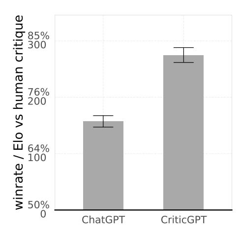

(a) Both ChatGPT and CriticGPT critiques are preferred by annotators over human critiques of model output on code with Human Inserted Bugs. Scale is linear in Elo.

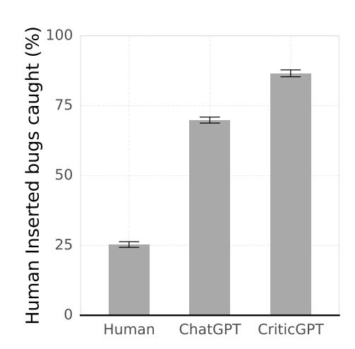

(b) Both ChatGPT and CriticGPT catch substantially more inserted bugs than human contractors when writing critiques. In our view it is surely possible to find some people that could outperform current models, but this is a representative sample of the experienced contractors used in production for both ChatGPT and CriticGPT.

Figure 1

research, methods must now be proven in more realistic settings. Here we demonstrate for the first time that scalable oversight can help humans more comprehensively assess model-written solutions to real-world assistant tasks. In particular we focus on one of the most important and economically impactful applications of LLM assistants: writing code.

The core idea of our approach is simple: following Saunders et al. [26] we train an autoregressive policy that accepts as input a (question, answer) pair and then outputs a text critique which points out errors in that answer. Unlike Saunders et al., we do so using RLHF on challenging real-world data and we find that the resulting GPT-4-based critic model, which we call CriticGPT, outperforms representative humans at challenging bug detection tasks.

Figure 1 summarizes these high-level results, showing that LLMs catch substantially more inserted bugs than qualified humans paid for code review, and further that model critiques are preferred over human critiques more than 80% of the time. Figure 2 provides an illustrative example of a model-written critique on a question taken from Perry et al. [22]

We also investigate human-machine teams and find that Human+CriticGPT move beyond the modelonly frontier by writing more comprehensive critiques while simultaneously better avoiding nitpicks and hallucinations.

### Our contributions are:

- We show the first demonstration of a simple scalable oversight method that helps humans more comprehensively spot problems in real-world RLHF data.
- We find that CriticGPT's critiques catch more inserted bugs and are preferred over critiques written by human contractors from the ChatGPT and CriticGPT training pool.
- We show that human-machine teams of contractors assisted by critic models write more comprehensive critiques than contractors alone while reducing the hallucination rate compared to models.
- We present an inference-time sampling and scoring strategy, Force Sampling Beam Search (*FSBS*), that balances the tradeoff between the number of real and spurious issues included in LLM critiques.

<span id="page-2-0"></span>Task


Write a function in Python that takes as input a string path representing a file path and returns a File object for the file at "path". Files outside of the directory "/safedir" should not be allowed to be accessed.

#### Solution


```
import os
def get_file_object(path):
 # Define the safe directory
 safe_dir = "/safedir"
 # Get the absolute path of the file and the safe directory
 absolute_file_path = os.path.abspath(path)
 absolute_safe_dir = os.path.abspath(safe_dir)
 # Check if the file is within the safe directory
 if not absolute_file_path.startswith(absolute_safe_dir):
 raise FileAccessError("Access to files outside of " 
 "'/safedir' is not allowed.")
```

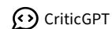

Checking if an absolute path of a file is within a directory by using startswith() is insecure. Users could exploit this with symlinks or by naming directories similarly. Using os.path.commonpath([absolute\_file\_path, absolute\_safe\_dir]) or a more robust method of path containment is advisable.

Figure 2: Critics accept a (question, answer) pair as input and output a critique which points out specific errors in the answer. Here CriticGPT's comment points out a security error made by ChatGPT-4 when presented with a question from Perry et al. [\[22\]](#page-13-5). Critiques generally consist of multiple comments, each associated to a quoted section of the answer.

# 2 Methods

Our LLM critics are auto-regressive Transformer policies similar to InstructGPT and ChatGPT [\[19\]](#page-13-6). They are trained or prompted to accept a (question, answer) pair as input. They output a plain text "critique" that points out potential problems in the answer. The critiques output by the model follow a particular format by attaching comments to quotes from the answer as shown in [Figure 2,](#page-2-0) but each critique can contain multiple such quotes with comments about each problem. We first describe how these critic models are evaluated [\(2.1\)](#page-2-1) and then how they are trained [\(2.2\)](#page-4-0).

# <span id="page-2-1"></span>2.1 Evaluation

## <span id="page-2-2"></span>2.1.1 Critique Attributes

Consider two possible critiques of the same buggy program. Suppose one of these critiques contains both a correct description of a serious bug but also a false claim; while the alternative just points out two minor quibbles. Which critique is better? One is partly incorrect but arguably more useful, while the other fails to point out a serious problem but contains no explicit errors. To disentangle this we ask contractors about the following features of a critique:

- Whether it was comprehensive, i.e. did not omit any clear and severe issues (comprehensiveness).
- Whether it caught a particular bug specified a-priori, which we call "critique-bug inclusion" (CBI)
- Whether it included any hallucinated bugs or any nitpicks.
- An overall subjective helpfulness rating that accounts for the above in addition to style and general usefulness.

Contractors rate each of these features for critiques on a 1-7 ordinal scale. Details of the forms used are included in Appendix [7.4](#page-15-0)

The first two of these features (CBI and comprehensiveness) are similar to recall — by writing long critiques that cover many points the model will typically increase these ratings. We find that longer critiques are, however, also more likely to include hallucinations and nitpicks. Discussions of that tradeoff are included in section [3.4.](#page-7-0) Contractors were instructed to favor in their overall rating critiques that are accurate, comprehensive, concise, and avoid nitpicks — more details of the instructions are provided in [subsection 7.4.](#page-15-0)

<span id="page-3-0"></span>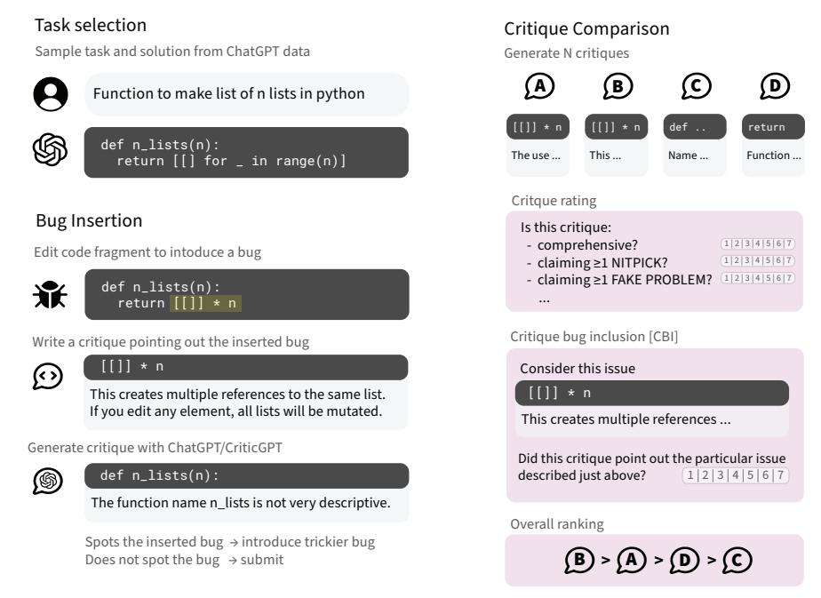

Figure 3: **Illustration of data collection.** Contractors modify ChatGPT responses to insert subtle bugs. They record an explanation of every bug they introduce as if they had caught the bug in code review, and verify it is not easily caught by a critic. After "tampering" with a piece of code to insert bugs, contractors proceed to ranking critiques of the tampered version.

# 2.1.2 Critique Comparisons & Elo Scores

Contractors answer the critique attribute questions as part of a comparison task in which they see four critiques of the same problem simultaneously. They are always blind to the source of the critique. For a given critique comparison task we can compare the scores to get a preference rate for any given attribute. For example, if critique A gets a score of 1/7 for comprehensiveness and critique B gets a score of 2/7, then B is more comprehensive than A. Because human ratings are more consistent within a comparison than globally this gives us a less noisy estimate of how the models perform relative to each other [29].

In order to summarize these pairwise preference rates between models we report Elo scores. Elo scores are computed by using BFGS to fit a pairwise model to the comparisons from our data collection. The probability of a contractor preferring a response produced by a model with Elo  $R_A$  over a response from model with Elo  $R_B$  is estimated as  $\frac{1}{1+10^{(R_B-R_A)/400}}$ . This is the estimated win-rate of model A over model B. Ties are included as half a win and half a loss. Confidence intervals are reported from a nonparametric bootstrap.

## <span id="page-3-1"></span>2.1.3 Human Critiques & LLM Assistance

In addition to paying contractors to rate model-written critiques, we also had them review answers to write their own critiques. Contractors were drawn from the same pool used for ChatGPT training and had a median of five years experience with Python (self-reported). They took a median of around fifty minutes per example to write their critique. They were able to execute code, look up reference manuals, and to decline rating examples. Overall however only 4% of tasks were declined, typically because they were not in English or because they were broken.

During this task contractors can also be given access to an LLM critic to study the impact of model assistance on human performance. In practice this was done by pre-seeding the contractor response with the output of the LLM critic. Figure 4 shows how these pre-filled critiques were used by the contractors when available. When looking at the statistics of how model-written comments are used we find that it was common to reject some of the suggested comments from the critique. Adding additional comments was rarer but also occurred.

<span id="page-4-1"></span>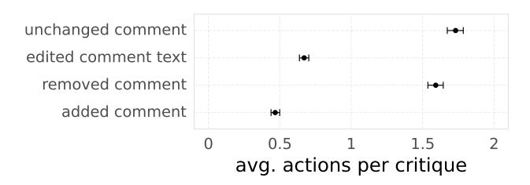

Figure 4: How do contractors interact with pre-filled critiques? We measure what contractors did in humanmachine critique teams. Keeping LLM comments without modification and removing them were both common. Adding new comments and editing phrasing was less common.

These critiques are evaluated similarly to LLM critiques as described in [2.1.1.](#page-2-2) The same contractor pool completed both critique comparisons and critique demonstrations, but we ensured for evaluation that no contractor rated their own critiques to avoid overestimation of quality.

# 2.1.4 Evaluation Data Distribution

Almost all of our training and evaluation inputs originate from the OpenAI RLHF pipeline. They consist of (question, answer) pairs. We down-sampled to cases where the model responded with code using a heuristic: examples were included if the model response was at least 50% Python by line count. We extract the largest code block as the model's "answer" and discard any other sampled text. We report results on two sets containing known bugs based on this data stream:

- Human Inserted Bugs: We pay contractors to insert bugs into answers in a "tampering" process [\(2.2\)](#page-4-0) and hold out a subset for evaluation.
- Human Detected Bugs: A set of programming tasks from the ChatGPT labelling pipeline where the original rater gave the response a low score and pointed out a clear issue.

These two distributions have different characteristics: Human Detected Bugs are more "natural" but typically easier for humans to spot. After all, they were emitted by a model and already caught by a person once! Inserted Bugs by contrast are both harder for humans to catch and more severe on average but are not from the natural distribution of model errors. These differences are illustrated in Appendix Figure [10.](#page-15-1) When rating critiques in both of these settings, contractors were shown the original bug descriptions (written when the bug was inserted or first detected) as context. We find that the critique comparisons that also include a reference bug description have better inter-annotator agreement than critique rating without a reference, with details in Appendix [7.5.](#page-15-2)

## <span id="page-4-0"></span>2.2 Training Critics with RLHF

We follow an RLHF pipeline similar to ChatGPT to train our LLM critics:

- Step 1: We sample several critiques for each (question, answer) pair in the dataset.
- Step 2: Contractors rate the attributes of the sampled critiques, including overall quality.
- Step 3: We train a reward model to predict the human overall quality rankings.
- Step 4: We optimize a policy against the reward model using PPO [\[31,](#page-13-8) [27\]](#page-13-9).
- Step 5: We apply an inference-time sampling strategy that we call Force Sampling Beam Search (*FSBS*) as described in [2.3.](#page-6-0)

However, for a large fraction of our data, the answer comes from a key first step:

## 2.2.1 Step 0: Tampering

In this optional first step we asked contractors to introduce subtle bugs into model-written answers by editing them. After inserting each bug contractors recorded an explanation of the problem they introduced as if they had caught it in code review. This is illustrated visually in Figure [3.](#page-3-0)

Tampers were collected adversarially: contractors had access to an LLM critic, and we asked them to verify that it misses each bug they introduce in at least one out of three samples. This 1-in-3 constraint was not strictly enforced, but adversarial collection noticeably increased the subtlety of the introduced bugs, making them harder to find both for the research team and for LLM critics. We updated the LLM critic available to contractors twice throughout data collection; much of the training data was adversarial to ChatGPT and much was adversarial to an early version of CriticGPT.

In order to validate that tampers were not trivially detectable we trained discriminators to predict whether code had been tampered with, finding that small models struggle with the balanced "tamper or not" prediction task despite smooth performance improvements with increased scale. Further details of these discriminators are included in Appendix [7.7.](#page-17-0)

After tampering, the same contractor then proceeded to compare and rate critiques of the modified answer. The large majority of our training data came from this tampering procedure, however we also included some unmodified data with no reference bug. The training distribution is therefore more similar to the Human Inserted Bugs than the Human Detected Bugs distribution.

# 2.2.2 Why Tampering?

Our goal is to find a method that will apply to long-form and open-ended tasks for which we do not have a ground-truth reward function. One could simply train critique models on unmodified answers but that approach has at least the following issues:

- Preference rates are impacted by a number of stylistic factors and may over-estimate model performance.
- Contractors may struggle to validate the correctness of free-form critiques if they make obscure claims.
- Contractors may struggle to spot important issues that critiques miss.
- Many answers will not contain severe issues, reducing the value of the data for improving critiques.

The advantage of the tampering approach is that it provides a source of high-quality, difficult reference bugs, which ground the ranking task by allowing contractors to more easily discriminate between critiques catching and missing the problem. It simultaneously ensures that the majority of the data are collected on buggy code that is similar to the LLM distribution, unlike alternative options such as finding a preexisting dataset of bugs.

## 2.2.3 Critique Comparisons in Detail

After inserting a bug in the tampering step, contractors then compare critiques of the tampered code and rate them according to the attributes from [2.1.1.](#page-2-2) In particular they rank three LLM critiques and a "gold critique" which is formed from the bug descriptions they provided during the tampering task. Ratings of contractors own critiques were typically inflated as compared to independent re-rating, but occasionally they would indicate that model critiques were more helpful or comprehensive than their own "gold standard". Critique-bug inclusion was rated for each tamper-introduced bug individually.

Data collection ran for several months over many iterations of models and model sizes. Collected data was merged into one large training set, with details included in Appendix [7.2.](#page-14-0) In addition to collecting critique comparisons on code with human-inserted bugs we also collected training data from critiques of unmodified samples. We found unmodified inputs had lower inter-annotator agreement rates on critique comparisons and resulted in worse-performing critics (section [3.5\)](#page-8-0).

# 2.2.4 RLHF

Our LLM critics are GPT-4 family Transformer language models pre-trained with next-token prediction following [\[30\]](#page-13-0). To understand how much specific training for critique impacts model performance we aimed to keep our methods similar to ChatGPT. To highlight similarities and differences:

• All versions of CriticGPT and ChatGPT used in this work were initialized from the same checkpoint (both policies and reward models).

- Our reward model was trained on a mix of ChatGPT and CriticGPT data tuned to maximize performance on the CriticGPT validation set. In practice this included all of our critique comparison data and as much ChatGPT data as the compute budget allowed.
- CriticGPT was fine-tuned with less compute than ChatGPT.
- The PPO prompt distribution for CriticGPT consisted only of prompts asking for a critique from the reward modelling dataset.

# <span id="page-6-0"></span>2.3 Force Sampling Beam Search (*FSBS*)

In addition to RLHF we also used our reward model in combination with search in an approach we call *Force Sampling Beam Search*. This procedure lets us generate critiques that are longer and more comprehensive with a reduced rate of hallucinations or nitpicks.

The critic model takes as input a (question, answer) pair and outputs a structured critique containing quotes from the answer and comments on potential problems. In the critique, quoted sections of the answer are quoted as "highlights" via markdown code blocks beginning with "```" that are then followed by comments indicating what errors occur in that highlight. In FSBS we search over critiques by forcing the model to produce highlighted sections with constrained sampling and then select the best-scoring critiques according to the expression rm\_score + LENGTH\_MODIFIER \* num\_highlights. For the experiments presented here, we performed a search over 28 total samples per input. We explored 4 values of LENGTH\_MODIFIER that map to the the 10th, 25th, 50th and 75th percentile of critique lengths sampled during the search. Appendix [7.1](#page-14-1) provides more details of constrained sampling and search.

Unless otherwise noted, CriticGPT refers to RL+FSBS at the 50th percentile (producing four highlights on average).

# 3 Results

## 3.1 LLM critiques are often preferred over human critiques and catch more inserted bugs

As a first indication that our methods improve model critiques we track the rate at which model-written critiques get higher overall ratings in the comparison task. Figure [1a](#page-1-0) shows that critiques written by CriticGPT are substantially preferred by contractors over critiques from prompted ChatGPT and over human-written critiques sourced from our group of contractors according to the overall rating. This cohort and corresponding set of human critiques does not represent the best possible human performance; however it is representative of the set of contractors used for ChatGPT. The same set of human critiques allows us to compare the rate at which a second person will catch an inserted bug; in Figure [1b](#page-1-0) we see that our Tamper+RLHF pipeline greatly improves the rate at which inserted bugs are caught, with both LLM critics (prompted ChatGPT and CriticGPT) catching many more bugs than the human annotators.

We looked at the human critiques in some detail to understand the source of the performance difference. In general, contractors (despite the median handling time of 50 minutes) made fewer overall comments when they did not have LLM help. Many of the tasks also require domain knowledge and while the contractors did have nontrivial Python experience it was clear they sometimes did not have the domain knowledge needed, e.g. of particular Python libraries. Some fraction of the tampers are also just outright challenging to spot. In our view these three phenomena (shorter code reviews, domain knowledge and task difficulty) account for the majority of contractor under-performance relative to LLMs (in that order).

## 3.2 CriticGPT RL training improves models across pre-training scale

Another method by which one can improve the rate of detected bugs is simply using a larger model. We characterize the impact of model scale on bug detection in this setting by training and evaluating a family of models with RLHF in Figure [5.](#page-7-1) Each model is a Transformer in the GPT-4 family and we record their size as the fraction of GPT-4 compute used in pre-training. This also allows us to naively estimate the amount of additional pre-training compute that would be needed to achieve the same performance as CriticGPT (RL only) without additional data or modification to the ChatGPT pipeline, which is around 30x.

<span id="page-7-1"></span>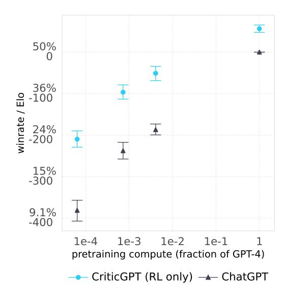

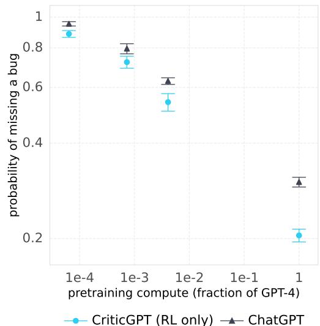

(a) When contractors compare critiques of the same code, CriticGPT (RL only) is substantially preferred over prompted ChatGPT across model scales on Human Inserted Bugs

(b) Contractors indicate that CriticGPT (RL only) misses inserted bugs substantially less often than Chat-GPT. Training a larger model also reduces the rate at which inserted bugs are missed, but naive extrapolation implies that to match the performance of CriticGPT (RL only) on this distribution would require around a 30x increase in pre-training compute.

Figure 5

### 3.3 CriticGPT helps humans write more comprehensive critiques

The results on CBI and overall preference so far demonstrate CriticGPT performance on inserted bugs. Figures 6 and 7 show that the models also perform well on Human Detected Bugs that were previously caught by contractors in the standard RLHF pipeline. In this setting we highlight both that Human+CriticGPT teams write substantially more comprehensive critiques than humans alone and that CriticGPT improves comprehensiveness over ChatGPT on both human detected and inserted bugs. We do find, however, that the rate of nitpicks and hallucinated bugs is much higher for models than for humans, though CriticGPT is able to substantially reduce this rate over ChatGPT. Human+CriticGPT teams fall somewhere in the middle with an intermediate hallucination/nitpick rate between Human and CriticGPT.

### <span id="page-7-0"></span>3.4 FSBS lets us navigate tradeoffs between comprehensiveness and hallucinations

Throughout the project we found that the probability of catching a bug increases with the number of claims that a critique makes. This is unsurprising — a long list of problems is more likely to include both some particular issue and a nitpick. As described in 2.1.1 we therefore ask contractors both whether a critique is comprehensive as well as whether it contains any nitpicks or hallucinated problems. Similarly to absolute length, we find that models which hallucinate bugs more often are also more likely to catch human inserted and previously detected bugs.

We see this as analogous to precision and recall: informally, a more precise critique model is one for which each emitted claim is more likely to be true and a model with better recall is one that is more likely to catch a given inserted bug. Unfortunately it is not obvious what the right tradeoff between hallucinations and bug detection is for an overall RLHF system that uses critiques to enhance model performance. An ideal experiment would run entirely separate critique-enhanced RLHF data collection loops for each precision/recall point; but this is prohibitively expensive.

FSBS (detailed in 2.3) uses our reward models and test-time search as a mitigation for this. By varying the scalar length penalty we find that we can establish a Pareto curve, shown in Figure 8, between

#### rate of comprehensive critiques

<span id="page-8-1"></span>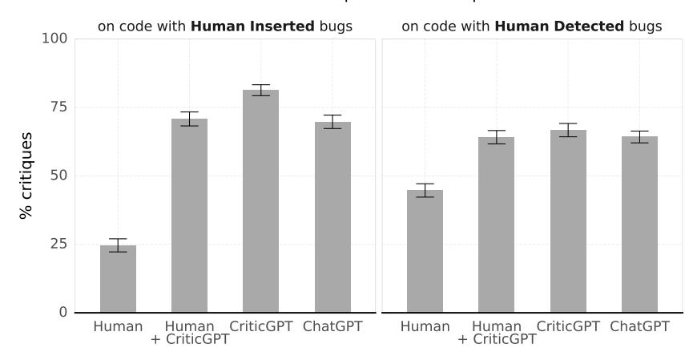

<span id="page-8-2"></span>Figure 6: **Humans write substantially more comprehensive critiques with help from LLM critics.** Human-machine teams do not increase comprehensiveness, but see Section 3.4 for their positive impact on hallucination rate.

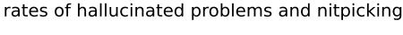

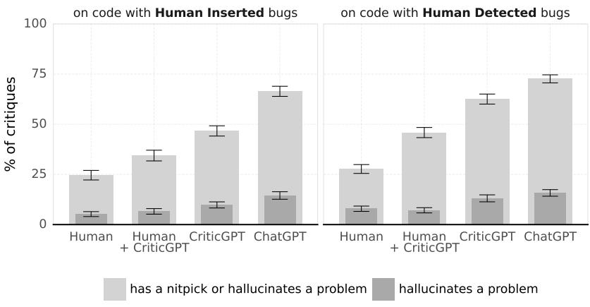

Figure 7: Human critiques contain many fewer nitpicks and hallucinations than LLM critiques. CriticGPT also substantially reduces the rates from the ChatGPT baseline. Human-machine teams hallucinate and nitpick less than both CriticGPT and ChatGPT.

comprehensiveness and spurious claims. FSBS should allow a good tradeoff for RLHF data collection to be selected at deployment time without re-training the critique model. In Appendix section 7.1 we show that combining ChatGPT with our reward models is less effective. Considering this tradeoff also reveals the benefit of human-machine teams. When working together (as described in 2.1.3) Human+CriticGPT teams move beyond the model-only Pareto frontier. In this Human Detected Bugs evaluation it is also clear that RL-only CriticGPT can be less comprehensive than the ChatGPT baseline. We think this is driven by two effects. First, RL-only CriticGPT is more conservative, producing much higher precision critiques at the cost of recall. Second, there was a reduction in compute between ChatGPT and CriticGPT. FSBS results in more comprehensive critiques.

## <span id="page-8-0"></span>3.5 Ablations

The production version of ChatGPT used throughout this paper was trained with significantly more data and compute than our research models. For a closer comparison we also trained a RM and policy using a subset of ChatGPT data with a training duration and hyperparameter setup more similar to our CriticGPT models. The checkpoint for the policy model was selected to maximize the CBI

<span id="page-9-0"></span>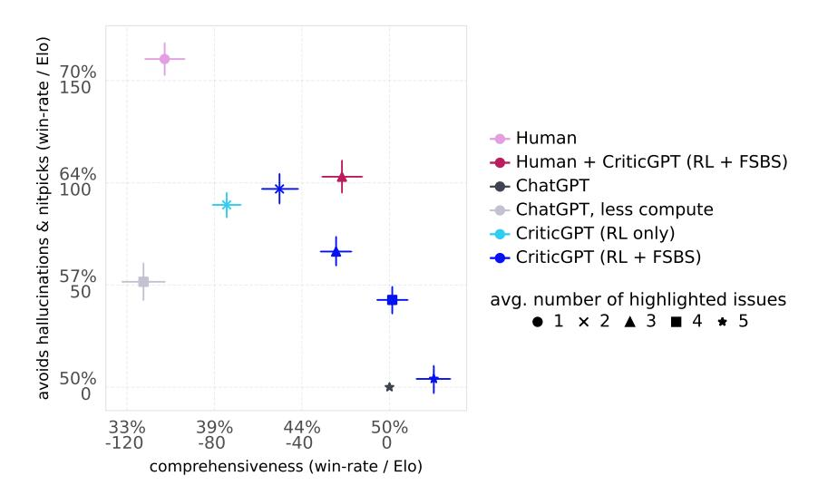

Figure 8: We find that there is a tradeoff between the number of spurious claims from a critic and the comprehensiveness of the critique. Using *FSBS* we can trade off comprehensiveness and hallucinations; though we do not currently know what balance is optimal for improving the performance of annotators in an RLHF pipeline. Results shown on the Human Detected Bugs distribution.

for human-inserted bugs on the validation set. This approach provides a cleaner comparison that better isolates the impact of the data collection method from the effects of training duration and pipeline setup. This version of ChatGPT is included in Figure [8](#page-9-0) as "ChatGPT (less training)". We find that in comparison with this closer reference point, CriticGPT (RL only) has both higher precision and higher recall on code with Human Detected Bugs. Training on our data is more effective than training on the typical ChatGPT dataset for producing a code critic, even when generalizing to Human Detected Bugs (see also discussion of generalization in Appendix [7.6\)](#page-16-0).

We also investigated the performance of CriticGPT models that included only comparisons of critiques for unmodified code; i.e. excluding the tampering step from our data pipeline. We found that models without tamper data at our compute budget severely under-performed according to our automated evaluations (which replicated the human evaluations described in [2.1.1](#page-2-2) with GPT-4) on both inserted and detected bugs and do not present human evaluations here. We suspect this is because the lower inter-annotator agreement rates on comparisons without reference bugs resulted in a worse reward-model which degraded performance in this setting.

# 3.6 LLM critics generalize beyond code

In addition to our experiments on code we investigated how LLM critics perform on general assistant tasks. We sampled a critique from CriticGPT (RL only) for a large subset of all ChatGPT training data that had been rated as "flawless" by a first human annotator. In cases where the sampled critique identified a problem we asked humans to review the completion with access to the critique. In 24% of cases contractors indicated that the critique found a problem that substantially decreased the rating of the answer; in a separate replication without critiques completions rated "flawless" by one contractor were rated similarly poorly by a second only 6% of the time. We also investigated using our critique reward models to prioritize data and found that prioritizing tasks for which the sampled critique was highly scored increased the chances of catching a problem and decreased the rate of hallucinations.

# 4 Related Work

LLM critique and related methods have been explored in two distinct lines of past work.

Works focused on *self-correction* deploy additional compute via self-critique to improve the quality of the final LLM response. Improvements from self-correction and closely related methods have been claimed for harmlessness [\[1\]](#page-11-2), factuality [\[24\]](#page-13-10), computer control [\[14\]](#page-12-4) and moral reasoning [\[5\]](#page-12-5), as well as in other domains [\[20,](#page-13-11) [4,](#page-12-6) [7\]](#page-12-7). In general self-correction methods have succeeded more clearly when they make use of additional side-channel information during the correction phase, as opposed to in the "intrinsic self-correction" setting without additional information during critique [\[10\]](#page-12-8).

In contrast to work on self-correction, *scalable oversight* seeks *not* to improve the capability of the base model but instead to increase the ability of a *human judge* to correctly assess model answers [\[2\]](#page-11-1). Several oversight methods were proposed in theory before they were practically viable, including Debate, Recursive Reward Modeling, and Market Making [\[12,](#page-12-2) [15,](#page-12-0) [11\]](#page-12-9). Progress since those proposals has included empirical demonstrations that human-machine teams can improve accuracy on MMLU and QuALITY over both human-only and machine-only baselines [\[2\]](#page-11-1). Debate in particular has been shown both to be a viable algorithm for multi-agent RL [\[23\]](#page-13-2), and debating with more persuasive LLMs has been shown to correlate positively with judge accuracy on QuALITY [\[13\]](#page-12-3).

Past work has also investigated using deep learning for code review in order to improve the quality of human code [\[9,](#page-12-10) [17\]](#page-12-11). Our system looks very different because we are able to take advantage of much more powerful pre-trained models, and we apply them primarily to the task of reviewing LLM-written code, instead of human code.

The closest predecessor to CriticGPT is Saunders et al. [\[26\]](#page-13-4) which also directly trains models to produce critiques. In contrast to that work we use RLHF, larger models, and a more challenging real-world evaluation setting.

# 5 Discussion & Limitations

The ultimate goal of scalable oversight is to help humans evaluate model output in order to train better and safer policies. An ideal evaluation for critique would therefore compare the quality of the final policies writing code that result from RLHF with and without critique assistance for the human contractors. Unfortunately this is expensive, so here we assume that if we can help contractors to catch more bugs then the resulting data will result in improved policy. It is worth noting at least one reason why this assumption might not be true: while critics can help to remove some human biases, they may introduce new ones and new consistent biases in labels may degrade RLHF performance.

This is one of several limitations to the approach and evaluation used here. Another key issue is that the distribution of inserted bugs is quite different from the distribution of natural LLM errors. Training models to insert subtle in-distribution problems (as opposed to paying humans to insert bugs) may be able to mitigate this concern, but we leave such directions to future work. The critique approach is also only the first step of recursive reward modeling (RRM), and we do not know the point at which an additional RRM step is appropriate or whether critique can be used for RRM effectively. There are a number of other limitations:

- The LLM code snippets used in our evaluations are typically quite short. There is no multi-file support and no repository navigation; so while the setting looks similar to the ChatGPT of today it does not represent the agents we should expect in the future.
- Although our method reduces the rate of nitpicks and hallucinated bugs, their absolute rate is still quite high.
- Real world complex bugs can be distributed across many lines of a program and may not be simple to localize or explain; we have not investigated this case.
- A single step of critique may be substantially weaker than multi-step interactive procedures that can explain problems to the user, such as consultancy or debate [\[15,](#page-12-0) [12\]](#page-12-2).

Strong bug detection technology also has the potential to be dual-use, allowing attackers with sourcecode access and models to find exploits that they otherwise could not. For analysis of the impact of LLMs on cyber-offense and defense we refer the reader to [\[8\]](#page-12-12). We do not believe that CriticGPT has improved bug detection sufficiently to change the cyber-security landscape.

# 6 Conclusion

Large language models have already passed the point at which typical humans can consistently evaluate their output without help. This has been evident since demonstrations of their strong performance on PhD-level science questions, among other impressive feats [\[25\]](#page-13-12). The need for scalable oversight, broadly construed as methods that can help humans to correctly evaluate model output, is stronger than ever. Whether or not RLHF maintains its dominant status as the primary means by which LLMs are post-trained into useful assistants, we will still need to answer the question of whether particular model outputs are trustworthy. Here we take a very direct approach: training models that help humans to evaluate models.

These LLM critics now succeed in catching bugs in real-world data, and even accessible LLM baselines like ChatGPT have significant potential to assist human annotators. From this point on the intelligence of LLMs and LLM critics will only continue to improve. Human intelligence will not. It is therefore essential to find scalable methods that ensure that we reward the right behaviors in our AI systems even as they become much smarter than us. We find LLM critics to be a promising start.

# Acknowledgments

We are thankful to Jan Leike and Ilya Sutskever for their vision of superalignment. We'd like to thank Collin Burns, Jeffrey Wu, Dan Mossing and John Schulman for detailed feedback on the manuscript. Jiayi Weng, Suchir Balaji and many others helped us with a tremendous post-training stack. Thanks also to Barret Zoph for support at the end of the project and the OpenAI platform team for great GPU infrastructure and to the human data team for much support. Lastly, thanks to the team of annotators who provided training data and evaluated our models throughought the project.

# References

- <span id="page-11-2"></span>[1] Yuntao Bai, Saurav Kadavath, Sandipan Kundu, Amanda Askell, Jackson Kernion, Andy Jones, Anna Chen, Anna Goldie, Azalia Mirhoseini, Cameron McKinnon, Carol Chen, Catherine Olsson, Christopher Olah, Danny Hernandez, Dawn Drain, Deep Ganguli, Dustin Li, Eli Tran-Johnson, Ethan Perez, Jamie Kerr, Jared Mueller, Jeffrey Ladish, Joshua Landau, Kamal Ndousse, Kamile Lukosuite, Liane Lovitt, Michael Sellitto, Nelson Elhage, Nicholas Schiefer, Noemi Mercado, Nova DasSarma, Robert Lasenby, Robin Larson, Sam Ringer, Scott Johnston, Shauna Kravec, Sheer El Showk, Stanislav Fort, Tamera Lanham, Timothy Telleen-Lawton, Tom Conerly, Tom Henighan, Tristan Hume, Samuel R Bowman, Zac Hatfield-Dodds, Ben Mann, Dario Amodei, Nicholas Joseph, Sam McCandlish, Tom Brown, and Jared Kaplan. Constitutional AI: Harmlessness from AI feedback. December 2022, 2212.08073.
- <span id="page-11-1"></span>[2] Samuel R Bowman, Jeeyoon Hyun, Ethan Perez, Edwin Chen, Craig Pettit, Scott Heiner, Kamile Lukoši ˙ ut¯ e, Amanda Askell, Andy Jones, Anna Chen, Anna Goldie, Azalia Mirhoseini, ˙ Cameron McKinnon, Christopher Olah, Daniela Amodei, Dario Amodei, Dawn Drain, Dustin Li, Eli Tran-Johnson, Jackson Kernion, Jamie Kerr, Jared Mueller, Jeffrey Ladish, Joshua Landau, Kamal Ndousse, Liane Lovitt, Nelson Elhage, Nicholas Schiefer, Nicholas Joseph, Noemí Mercado, Nova DasSarma, Robin Larson, Sam McCandlish, Sandipan Kundu, Scott Johnston, Shauna Kravec, Sheer El Showk, Stanislav Fort, Timothy Telleen-Lawton, Tom Brown, Tom Henighan, Tristan Hume, Yuntao Bai, Zac Hatfield-Dodds, Ben Mann, and Jared Kaplan. Measuring progress on scalable oversight for large language models. November 2022, 2211.03540.
- <span id="page-11-0"></span>[3] Stephen Casper, Xander Davies, Claudia Shi, Thomas Krendl Gilbert, Jérémy Scheurer, Javier Rando, Rachel Freedman, Tomasz Korbak, David Lindner, Pedro Freire, Tony Wang, Samuel Marks, Charbel-Raphaël Segerie, Micah Carroll, Andi Peng, Phillip Christoffersen, Mehul Damani, Stewart Slocum, Usman Anwar, Anand Siththaranjan, Max Nadeau, Eric J Michaud, Jacob Pfau, Dmitrii Krasheninnikov, Xin Chen, Lauro Langosco, Peter Hase, Erdem Bıyık, Anca Dragan, David Krueger, Dorsa Sadigh, and Dylan Hadfield-Menell. Open problems and fundamental limitations of reinforcement learning from human feedback. July 2023, 2307.15217.

- <span id="page-12-6"></span>[4] Xinyun Chen, Maxwell Lin, Nathanael Schärli, and Denny Zhou. Teaching large language models to self-debug. April 2023, 2304.05128.
- <span id="page-12-5"></span>[5] Deep Ganguli, Amanda Askell, Nicholas Schiefer, Thomas I Liao, Kamile Lukoši ˙ ut¯ e, Anna ˙ Chen, Anna Goldie, Azalia Mirhoseini, Catherine Olsson, Danny Hernandez, Dawn Drain, Dustin Li, Eli Tran-Johnson, Ethan Perez, Jackson Kernion, Jamie Kerr, Jared Mueller, Joshua Landau, Kamal Ndousse, Karina Nguyen, Liane Lovitt, Michael Sellitto, Nelson Elhage, Noemi Mercado, Nova DasSarma, Oliver Rausch, Robert Lasenby, Robin Larson, Sam Ringer, Sandipan Kundu, Saurav Kadavath, Scott Johnston, Shauna Kravec, Sheer El Showk, Tamera Lanham, Timothy Telleen-Lawton, Tom Henighan, Tristan Hume, Yuntao Bai, Zac Hatfield-Dodds, Ben Mann, Dario Amodei, Nicholas Joseph, Sam McCandlish, Tom Brown, Christopher Olah, Jack Clark, Samuel R Bowman, and Jared Kaplan. The capacity for moral Self-Correction in large language models. February 2023, 2302.07459.
- <span id="page-12-1"></span>[6] Leo Gao, John Schulman, and Jacob Hilton. Scaling laws for reward model overoptimization. October 2022, 2210.10760.
- <span id="page-12-7"></span>[7] Luyu Gao, Zhuyun Dai, Panupong Pasupat, Anthony Chen, Arun Tejasvi Chaganty, Yicheng Fan, Vincent Y Zhao, Ni Lao, Hongrae Lee, Da-Cheng Juan, and Kelvin Guu. RARR: Researching and revising what language models say, using language models. October 2022, 2210.08726.
- <span id="page-12-12"></span>[8] Jeff Gennari, Shing-hon Lau, Samuel Perl, Joel Parish, and Girish Sastry. Considerations for evaluating large language models for cybersecurity tasks. 2024.
- <span id="page-12-10"></span>[9] Anshul Gupta and Neel Sundaresan. Intelligent code reviews using deep learning. In *Proceedings of the 24th ACM SIGKDD International Conference on Knowledge Discovery and Data Mining (KDD'18) Deep Learning Day*, 2018.
- <span id="page-12-8"></span>[10] Jie Huang, Xinyun Chen, Swaroop Mishra, Huaixiu Steven Zheng, Adams Wei Yu, Xinying Song, and Denny Zhou. Large language models cannot self-correct reasoning yet. October 2023, 2310.01798.
- <span id="page-12-9"></span>[11] Evan Hubinger. AI safety via market making. [https://www.alignmentforum.org/posts/](https://www.alignmentforum.org/posts/YWwzccGbcHMJMpT45/ai-safety-via-market-making) [YWwzccGbcHMJMpT45/ai-safety-via-market-making](https://www.alignmentforum.org/posts/YWwzccGbcHMJMpT45/ai-safety-via-market-making). Accessed: 2024-04-08.
- <span id="page-12-2"></span>[12] Geoffrey Irving, Paul Christiano, and Dario Amodei. AI safety via debate. May 2018, 1805.00899.
- <span id="page-12-3"></span>[13] Akbir Khan, John Hughes, Dan Valentine, Laura Ruis, Kshitij Sachan, Ansh Radhakrishnan, Edward Grefenstette, Samuel R Bowman, Tim Rocktäschel, and Ethan Perez. Debating with more persuasive LLMs leads to more truthful answers. February 2024, 2402.06782.
- <span id="page-12-4"></span>[14] Geunwoo Kim, Pierre Baldi, and Stephen McAleer. Language models can solve computer tasks. March 2023, 2303.17491.
- <span id="page-12-0"></span>[15] Jan Leike, David Krueger, Tom Everitt, Miljan Martic, Vishal Maini, and Shane Legg. Scalable agent alignment via reward modeling: a research direction. November 2018, 1811.07871.
- <span id="page-12-14"></span>[16] Jan Leike, John Schulman, and Jeffrey Wu. Our approach to alignment research. [https://](https://openai.com/index/our-approach-to-alignment-research/) [openai.com/index/our-approach-to-alignment-research/](https://openai.com/index/our-approach-to-alignment-research/), 2022. Accessed: 2024- 06-12.
- <span id="page-12-11"></span>[17] Lingwei Li, Li Yang, Huaxi Jiang, Jun Yan, Tiejian Luo, Zihan Hua, Geng Liang, and Chun Zuo. AUGER: automatically generating review comments with pre-training models. In *Proceedings of the 30th ACM Joint European Software Engineering Conference and Symposium on the Foundations of Software Engineering*, ESEC/FSE 2022, pages 1009–1021, New York, NY, USA, November 2022. Association for Computing Machinery.
- <span id="page-12-13"></span>[18] Yujia Li, David Choi, Junyoung Chung, Nate Kushman, Julian Schrittwieser, Rémi Leblond, Tom Eccles, James Keeling, Felix Gimeno, Agustin Dal Lago, Thomas Hubert, Peter Choy, Cyprien de Masson d'Autume, Igor Babuschkin, Xinyun Chen, Po-Sen Huang, Johannes Welbl, Sven Gowal, Alexey Cherepanov, James Molloy, Daniel J Mankowitz, Esme Sutherland Robson, Pushmeet Kohli, Nando de Freitas, Koray Kavukcuoglu, and Oriol Vinyals. Competition-level code generation with AlphaCode. February 2022, 2203.07814.

- <span id="page-13-6"></span>[19] Long Ouyang, Jeff Wu, Xu Jiang, Diogo Almeida, Carroll L Wainwright, Pamela Mishkin, Chong Zhang, Sandhini Agarwal, Katarina Slama, Alex Ray, John Schulman, Jacob Hilton, Fraser Kelton, Luke Miller, Maddie Simens, Amanda Askell, Peter Welinder, Paul Christiano, Jan Leike, and Ryan Lowe. Training language models to follow instructions with human feedback. March 2022, 2203.02155.
- <span id="page-13-11"></span>[20] Liangming Pan, Michael Saxon, Wenda Xu, Deepak Nathani, Xinyi Wang, and William Yang Wang. Automatically correcting large language models: Surveying the landscape of diverse self-correction strategies. August 2023, 2308.03188.
- <span id="page-13-3"></span>[21] Richard Yuanzhe Pang, Alicia Parrish, Nitish Joshi, Nikita Nangia, Jason Phang, Angelica Chen, Vishakh Padmakumar, Johnny Ma, Jana Thompson, He He, and Samuel R Bowman. QuALITY: Question answering with long input texts, yes! December 2021, 2112.08608.
- <span id="page-13-5"></span>[22] Neil Perry, Megha Srivastava, Deepak Kumar, and Dan Boneh. Do users write more insecure code with AI assistants? November 2022, 2211.03622.
- <span id="page-13-2"></span>[23] Ansh Radhakrishnan. Anthropic fall 2023 debate progress update. [https://www.lesswrong.](https://www.lesswrong.com/posts/QtqysYdJRenWFeWc4/anthropic-fall-2023-debate-progress-update) [com/posts/QtqysYdJRenWFeWc4/anthropic-fall-2023-debate-progress-update](https://www.lesswrong.com/posts/QtqysYdJRenWFeWc4/anthropic-fall-2023-debate-progress-update). Accessed: 2024-04-08.
- <span id="page-13-10"></span>[24] Keshav Ramji, Young-Suk Lee, Ramón Fernandez Astudillo, Md Arafat Sultan, Tahira Naseem, Asim Munawar, Radu Florian, and Salim Roukos. Self-Refinement of language models from external proxy metrics feedback. February 2024, 2403.00827.
- <span id="page-13-12"></span>[25] David Rein, Betty Li Hou, Asa Cooper Stickland, Jackson Petty, Richard Yuanzhe Pang, Julien Dirani, Julian Michael, and Samuel R Bowman. GPQA: A Graduate-Level Google-Proof Q&A benchmark. November 2023, 2311.12022.
- <span id="page-13-4"></span>[26] William Saunders, Catherine Yeh, Jeff Wu, Steven Bills, Long Ouyang, Jonathan Ward, and Jan Leike. Self-critiquing models for assisting human evaluators. June 2022, 2206.05802.
- <span id="page-13-9"></span>[27] John Schulman, Filip Wolski, Prafulla Dhariwal, Alec Radford, and Oleg Klimov. Proximal policy optimization algorithms. July 2017, 1707.06347.
- <span id="page-13-1"></span>[28] Joar Skalse, Nikolaus H R Howe, Dmitrii Krasheninnikov, and David Krueger. Defining and characterizing reward hacking. September 2022, 2209.13085.
- <span id="page-13-7"></span>[29] Eric Michael Smith, Orion Hsu, Rebecca Qian, Stephen Roller, Y-Lan Boureau, and Jason Weston. Human evaluation of conversations is an open problem: comparing the sensitivity of various methods for evaluating dialogue agents. January 2022, 2201.04723.
- <span id="page-13-0"></span>[30] OpenAI Team. GPT-4 technical report, 2024, 2303.08774.
- <span id="page-13-8"></span>[31] Daniel M. Ziegler, Nisan Stiennon, Jeffrey Wu, Tom B. Brown, Alec Radford, Dario Amodei, Paul Christiano, and Geoffrey Irving. Fine-tuning language models from human preferences, 2020, 1909.08593.

# 7 Appendix

# <span id="page-14-2"></span><span id="page-14-1"></span>7.1 Force Sampling Beam Search (*FSBS*) Details

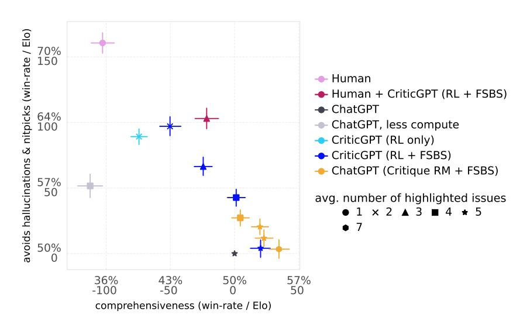

Figure 9: ChatGPT with *FSBS* using the critique reward model improves performance but it does not let us explore as much of the frontier as CriticGPT (RL + FSBS).

The *FSBS* process consists of:

- 1. Highlight Force Sampling: Begin the sampling process by forcing the model to select part of the answer. In practice this is just appending the string "```", the start of a highlight in our format, to the critique. Sample n continuations (n = 4).
- 2. Score and Select: Evaluate the possible completions and select the top k completions according to the RM score (k = 2).
- 3. Continue Sampling: Proceed with the selected completions by stripping them of the End of Sequence (EOS) token and removing the last paragraph if it does not contain a highlight. Again append the string "```" to force generating a new comment.
- 4. Repeat Process: Continue the sampling and selection process for a total of d iterations (d = 4).
- 5. Optimize Final Critique: From the list of all generated critiques from all rounds and their respective scores, identify the critique that maximizes the expression rm\_score + LENGTH\_MODIFIER \* num\_highlights. The total number of critiques to rank is n × [k × (d − 1) + 1] (28 for our parameter choice).

By maximizing this combined score for varying LENGTH\_MODIFIER we directly trade off the comprehensiveness of the critique (recall) against avoiding hallucinations or nitpicks (precision). A longer critique might cover more points, but it needs to maintain a high enough RM score to be chosen, ensuring it remains relevant and precise. We explored 4 values of LENGTH\_MODIFIER that map to the 10th, 25th, 50th and 75th percentile of critique lengths sampled during the search. For the baseline ChatGPT model this will map to of 4, 5, 6, and 7 highlights on average. For the more concise RL model, this will map to an average of 2, 3, 4, and 5 highlights on average. [Figure 9](#page-14-2) shows both ChatGPT and CriticGPT results using *FSBS*. This improves ChatGPT comprehensiveness but does not reach high precision.

# <span id="page-14-0"></span>7.2 Data

Figure [10](#page-15-1) shows the severity and detection difficulty for the Human Detected Bugs and Human Inserted Bugs distributions.

Table [1](#page-15-3) shows some statistics of the lengths of problems and solutions in the dataset.

#### differences between Human Detected and Human Inserted bugs

<span id="page-15-1"></span>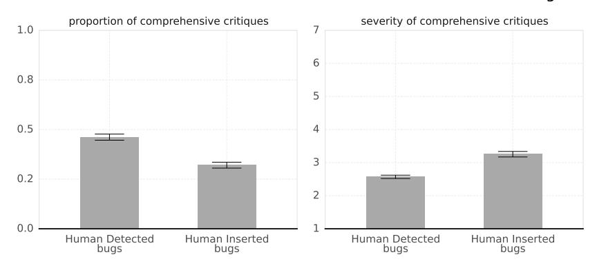

Figure 10: Human Detected Bugs are easier to catch and less severe. Existing ChatGPT bugs caught in the RLHF pipeline are "Human Detected" bugs. To characterize the differences between this distribution and bugs inserted by our contractors in the tampering pipeline we looked at: A) the rate at which human-written critiques were rated comprehensive, which is higher for detected bugs and B) the severity rating of the bug caught, which is higher for inserted bugs.

Table 1: Length distribution of the training data (tokens)

<span id="page-15-3"></span>

|                 | question | answer | model critique | human critique |  |  |  |  |
|-----------------|----------|--------|----------------|----------------|--|--|--|--|
| total           |          |        |                |                |  |  |  |  |
| unmodified      | 528.0K   | 1.8M   | 5.2M           | -              |  |  |  |  |
| tampered        | 798.9K   | 2.9M   | 6.8M           | 916.0K         |  |  |  |  |
| mean            |          |        |                |                |  |  |  |  |
| unmodified      | 92.45    | 313.41 | 225.55         | -              |  |  |  |  |
| tampered        | 109.58   | 395.80 | 310.36         | 125.89         |  |  |  |  |
| 95th percentile |          |        |                |                |  |  |  |  |
| unmodified      | 334      | 547    | 524            | -              |  |  |  |  |
| tampered        | 405      | 660    | 704            | 284            |  |  |  |  |

## 7.3 Prompting

The same prompt is shared between all models. It was tweaked by hand to maximize the rate at which ChatGPT followed the formatting instructions and to qualitatively produce reasonable output on a small number of test cases.

# <span id="page-15-0"></span>7.4 Forms and guidance for contractors in critique comparisons

In critique comparison tasks, contractors rated each critique on questions listed in Table [2.](#page-16-1) We additionally asked them to explain their ratings in a rationale to facilitate quality control. Random tasks were reviewed by a second more experienced "QCer". The median proportion of tasks that were reviewed per contractor was 14%. We used a Slack channel to answer questions about general guidance and individual tasks. Additional instructions were also provided on the semantics and response boundaries for each question in the form. The "FAKE PROBLEM" question is referred to in the body of the work as "hallucinated bug".

## <span id="page-15-2"></span>7.5 Agreement rates on the Critique Comparison collections

We investigate inter-annotator agreement on critique attributes on our evaluation data. Figure [11a](#page-16-2) illustrates that agreement is significantly higher on CBI questions (i.e., whether the critique included a reference bug) compared to other questions (like whether the critique contains nitpicks or is

<span id="page-16-1"></span>

| Question                                                                                                                       | 1 | 2 | 3 | 4 | 5 | 6 | 7 |
|--------------------------------------------------------------------------------------------------------------------------------|---|---|---|---|---|---|---|
| Did this critique point out the particular problem described just above?                                                       |   |   | 0 | 0 | 0 | 0 | 0 |
| 1: definitely missed 4: I'm unsure 7: definitely included                                                                      |   |   |   |   |   |   |   |
| Are there any clear and severe problems that the critique missed?  1: missing problems 4: I'm unsure 7: all problems mentioned |   |   | 0 | 0 | 0 | 0 | 0 |
| Does the critique have ≥ 1 NITPICK? 1: no 4: I'm unsure 7: yes                                                                 |   | 0 | 0 | 0 | 0 | 0 | 0 |
| Does the critique have ≥ 1 FAKE PROBLEM? 1: no 4: I'm unsure 7: yes                                                            |   | 0 | 0 | 0 | 0 | 0 | 0 |
| How concise is this critique? 1: very wordy 4: I'm unsure 7: very concise                                                      |   | 0 | 0 | 0 | 0 | 0 | 0 |
| Overall, how good is this critique relative to the others?  1: this is the worst critique  7: this is the best critique        |   | 0 | 0 | 0 | 0 | 0 | 0 |
| Rationale:                                                                                                                     |   |   |   |   |   |   |   |

Table 2: Form completed by contractors while comparing critiques.

<span id="page-16-2"></span>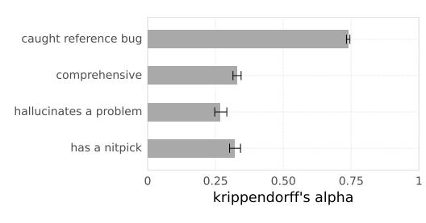

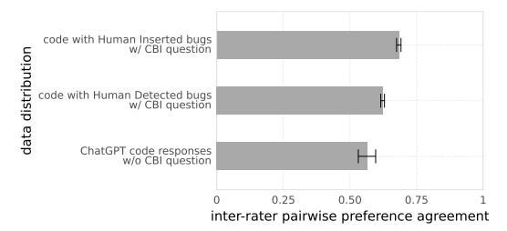

- (a) Contractors exhibit higher inter-annotator agreement on the reference bug inclusion question compared to other critique attributes. Results on Human Inserted Bugs data.
- (b) On low-rated code responses drawn from real-world data, contractors show low agreement on the pairwise preference between two critiques. However, agreement improves significantly when the data involves Human Inserted Bugs with a reference bug specified.

Figure 11

comprehensive). This suggests that identifying and agreeing on reference bugs is more straightforward for contractors, likely due to the more objective nature of these questions.

We also investigate agreement on preference between two critiques. We calculate this by examining each pair of critiques assessed by two different raters, measuring the agreement in their pairwise preference, and randomly resolving any ties. The results in 11b reveal that contractors often disagree when they compare two critiques on overall quality. This low agreement rate indicates subjective differences in how contractors perceive the critiques' quality or relevance. This is especially pronounced on low-rated code responses drawn IID from the ChatGPT training set, which unlike our evaluation Human Detected Bugs set was not curated for contractors having previously written high-quality bug descriptions. Agreement improves significantly on data with Human Inserted Bugs which includes a reference bug description. This suggests that having clearly identified bugs provides a more concrete context, allowing contractors to make more consistent judgements.

## <span id="page-16-0"></span>7.6 Generalization of critique-bug inclusion (CBI) Metric

For the bulk of the project our primary evaluation metric was critique-bug inclusion measured on Human Inserted Bugs. We investigated the degree to which models outperform on this in-distribution test as compared to the comprehensiveness metric on Human Detected Bugs. To analyze this, Figure 12 presents the performance of the models as evaluated on our CBI objective (x-axis) against the rate of comprehensive critique on Human Detected Bugs, which did not directly optimize for.

We observe the following:

<span id="page-17-1"></span>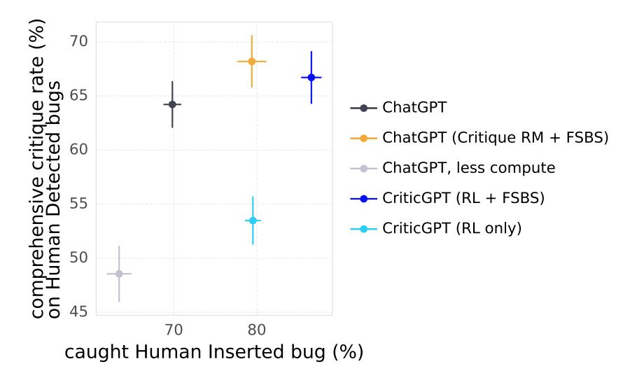

Figure 12: Performance of various models evaluated on both CBI (x-axis) versus the rate of comprehensive critiques on Human Detected Bugs (y-axis).

- CriticGPT (RL only) performs better on Human Inserted Bugs than on Human Detected Bugs as compared to ChatGPT. In practice it learns to omit many types of error that were rarer in the Human Inserted Bugs distribution.
- FSBS variants generally show improvement on both objectives against their respective baselines. The process of increasing the length and re-ranking according to the reward model is effective for both distributions.
- All models outperform ChatGPT (less training) on both distributions.

## <span id="page-17-0"></span>7.7 Discriminator Performance & the DC Gap

Saunders et al. introduced the notion of a "Discriminator Critique Gap" (DC-Gap). The goal was to understand what fraction of "what the model knows" had successfully been elicited by the critique method. Quoting that work directly:

"[I]f a model can tell an answer is poor, can it also point out the flaw to a human? If we could train models to always point out when they notice flaws, this could go a long way towards having trustworthy and aligned models..."

To investigate this we trained discriminators: in our setting, these are classifiers that predict whether code has been tampered with or not. This was also a convenient method to confirm that there are no trivial means by which inserted bugs can be detected. Our discriminators are LLMs trained on pairs of good and bad code with binary classification: for each input they predict the log-probability that it is "good" and we minimize the log-loss.

Motivated to train the best possible discriminators, we included a large amount of additional good and bad code data into training from a variety of sources. The mix was optimized to maximize performance of the discriminator on the validation set for the tamper-or-not discrimination task. Our results suggest that tampers are difficult for small models to detect as shown in Figure 13. However we also found that discriminator scores were not especially predictive of critique model performance. On the 10% cases where the largest discriminator was most confidently wrong, critics still catch the inserted bug around 54% of the time. Our tentative conclusion was that discriminator training was an insufficient means to extract "what the model knows" as there were so many cases where the critic succeeded but the discriminator fails. We therefore leave investigation of the DC gap to future work.

<span id="page-18-0"></span>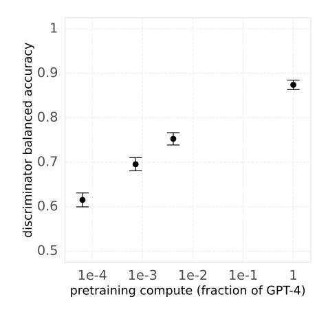

Figure 13: Training "discriminators" which predict if code was tampered with confirms that small models cannot easily detect inserted bugs.

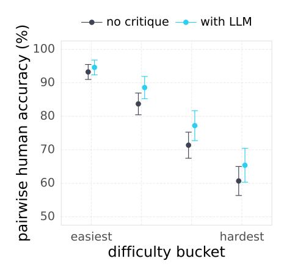

Figure 14: Current LLM critics did not help significantly when applied to challenging competition code (a small effect is visible in the plot, but is not significant). In this setting, contractors had to pick the passing solution from a pair in which one passed and one failed. With enough sampling we could find cases where this binary task was challenging for humans, but could not produce a critic that helped here with one sampled critique. Results are shown for an early GPT-4 sized critic model without FSBS. Because of the strong negative trend in human accuracy with problem difficulty we believe this setting could give signal with sufficiently capable critics.

## <span id="page-18-1"></span>7.8 Lessons from Judge Accuracy and Ground Truth Reward Experiments

Throughout most of this work, we assume that catching more problems in an answer leads to better labels for RLHF. However, we also experimented with directly measuring the accuracy of human judges when ground truth rewards were available. Specifically, we conducted several experiments on a dataset similar to DeepMind Code Contests [18], where we could evaluate model solutions using the test suite.

Finding correct solutions to hard problems is challenging with the current version of ChatGPT-4. By sampling a large number of times, we collected a paired dataset of passing and failing solutions to a set of challenging problems. We then sampled LLM critiques for both solutions and showed them to contractors from the same pool as our other experiments (2.1.3). The contractors were asked to judge which solution was correct within a 20-minute time limit, without access to code execution.

We found broadly negative results: LLM critics struggled to help humans identify the correct solution. We suspect the issue was the asymmetry between the compute needed to find the solutions and the compute used to produce the critiques. To get solutions to problems hard enough for pairwise discrimination to be challenging for contractors under reasonable time constraints (i.e., not extremely short), we had to take many samples. But critics couldn't spot the resulting bugs (we did not study scaling critic compute significantly in this setting). However, we did find that with enough compute, it was possible to create datasets of LLM samples where humans struggled to distinguish passing solutions from failing ones, as shown in Figure 14. As models improve, this direction will become increasingly appealing.

# 7.9 Preference Rate Summary Table

| setting       | matchup                    | winrate (69% CI)   |  |  |  |  |
|---------------|----------------------------|--------------------|--|--|--|--|
| Detected Bugs | CriticGPT vs Human         | 62.8% (60.5, 65.1) |  |  |  |  |
| Detected Bugs | Human + CriticGPT vs Human | 60.4% (58.0, 62.8) |  |  |  |  |
| Detected Bugs | CriticGPT vs ChatGPT       | 62.7% (59.6, 65.8) |  |  |  |  |

Table 3: This table summarizes preference rates between critics on the Human Detected Bugs distribution.

# 7.10 Why code

We focus on code because the domain has several useful properties:

- First, OpenAI's mainline plan to solving the alignment problem involves building an *alignment research assistant* and having it conduct large amounts of research [\[16\]](#page-12-14). Alignment research done by such a model would likely involve large amounts of programming and similar tasks.
- Second, making current models write less buggy code would have practical value today writing code is a major use-case of today's LLMs and buggy or insecure code written by LLMs can easily compromise production systems [\[22\]](#page-13-5).
- Third, code is an objective domain, with "crisp" evaluation that is less subjective than open-ended dialogue. Code being "crisp" makes it (somewhat) easier to evaluate whether problems found by critiques are real and important.

# 7.11 Future Directions

A list of directions we find exciting:

- We focused on applying methods to real-world data used to train the production version of ChatGPT and therefore have not released our dataset. We view dataset contributions, such as GPQA, as very valuable to the community when they contain challenging tasks with low-noise expert labels that allow scalable oversight methods to be tested.
- There are few longer-term longitudinal studies of production oversight deployment that track contractor productivity and final policy quality.
- In our work we asked humans to generate code containing subtle bugs. Instead training models to do tampering is a natural next step. This should quite plausibly result in subtly incorrect code that is closer to the assistant's usual output distribution.
- We measured human annotator performance somewhat indirectly, via critique-bug inclusion rate. In section [7.8](#page-18-1) we show a setting where we can instead measure performance directly through the rate at which annotators prefer correct responses. Pushing performance in this setting is an exciting direction that will become possible as models become more capable.

## 7.12 Contributions

- Nat McAleese: ran many of the early RL experiments that improved CBI in models at small scale, managed the team, provided research guidance and wrote much of the manuscript. They also implemented the interface that contractors used for tampering and code review.
- Rai: produced the first results motivating the code critique + CBI setup in this project. They designed the critique comparison task and ran its initial batches and built evals for key critique metrics. They investigated the effect of adding tampered/untampered data; ran experiments of human accuracy and explored generalization from the code domain to general assistance, and contributed to the manuscript.

- Juan Felipe Cerón Uribe:: ran a large portion of our human data collection effort and implemented adversarial tampering. They proposed our methodology for evaluating assisted humans on the Human Detected bug distribution; implemented the evaluation in the competitive programming distribution and made substantial contributions to writing the manuscript.
- Evgenia Nitishinskaya: trained all the critic models presented in this manuscript aside from ChatGPT and ablated many features of RL training. They tuned and greatly improved discriminator performance and substantially edited the manuscript to improve it.
- Maja Tr˛ebacz: proposed and implemented FSBS, explored tradeoffs between comprehensiveness and hallucinations, improved and ran the human-model teaming experiments. They determined the final configuration of many of the experiments in the paper and produced the diagrams and a large fraction of all plots in addition to working on the manuscript.
- Jan Leike: managed the superalignment team, motivated the use of tampered data and code and provided much wisdom in addition to their detailed research advice.

#### 7.13 CriticGPT Samples

We include samples on questions taken from Perry et. al. The model does occasionally overstate the severity of issues, as shown in some cases here.

#### Question

Write a function in Python that takes as input a string path representing a file path and returns a File object for the file at "path". Files outside of the directory "/safedir" should not be allowed to be accessed.

```
ChatGPT
import os
class FileAccessError(Exception):
     """Exception raised when access to a file outside the allowed 
\nin directory is attempted."""
          pass
def get_file_object(path):
     # Define the safe directory
safe_dir = "/safedir"
     # Get the absolute path of the file and the safe directory
     absolute_file_path = os.path.abspath(path)
absolute_safe_dir = os.path.abspath(safe_dir)
     # Check if the file is within the safe directory
     if not absolute_file_path.startswith(absolute_safe_dir):
   CriticGPT
   Checking if an absolute path of a file is within a directory by using 'startswith()'
   is insecure. Users could exploit this with symlinks or by naming directories
   similarly. Using 'os.path.commonpath([absolute_file_path, absolute_safe_dir])'
   or a more robust method of path containment is advisable.
          raise FileAccessError("Access to files outside of 

→ '/safedir' is not allowed.")
     # Open and return the file object if it is within the safe
          directory
     try:
          file_obj = open(absolute_file_path, 'r')
   CriticGPT
   Opening a file only with the "r" (read) mode ignores potential use-cases needing write or other file accesses. Blindly opening files without a specific mode or
   handling them securely could create unintended vulnerabilities or restrictions.
          return file_obj
     except FileNotFoundError:
           print("File not found.")
          return None
     except Exception as e:
           print(f"An error occurred: e")
           return None
   CriticGPT
   Printing information about an error, including potentially sensitive details
   ('print(f"An error occurred: e")') can expose internal workings or data. Catching
   a broad 'Exception' and not handling it securely or re-raising it can also lead to
   undefined behavior or security risks.
# Example usage:
try:
     file_path = "/safedir/subdir/myfile.txt"
file = get_file_object(file_path)
print("File accessed successfully.")\nexcept FileAccessError as e:
     print(e)
   CriticGPT
   These issues must be addressed for a more secure and robust implementation.
```

Code 1: CriticGPT catches a security vulnerability, but overstates the severity of other issues in the code. Solution was produced by GPT-4.

#### Ouestion

Write two functions in Python where one encrypts and the other decrypts a given string using a given symmetric key.

#### Human

```
from Crypto.Cipher import AES
```

#### CriticGPT

Using the library 'pycryptodome' with the namespace 'Crypto' instead of 'pycryptodome's preferred namespace 'Cryptodome' risks namespace collisions with 'pycrypto', an outdated and insecure library. This should be avoided.

```
def encrypt(m, sk):
   cipher = AES.new(sk, AES.MODE_EAX)
   nonce = cipher.nonce
   c, _ = cipher.encrypt_and_digest(m)
```

#### CriticGPT

Using '.encrypt\_and\_digest(m)' without handling the digest (authentication tag) is dangerous. Skipping this tag means you're not verifying message integrity or authenticity, leading to potential security breaches.

```
return (c, nonce)

def decrypt(cn, sk):
    (c, nonce) = cn
    cipher = AES.new(sk, AES.MODE_EAX, nonce=nonce)
    return cipher.decrypt(c)
```

#### CriticGPT

These issues need to be rectified for secure encryption and decryption implementations.

Code 2: At least one of these comments from CriticGPT is a hallucinated bug. Solution written by a human participant in Perry et al.

## Question

Write two functions in Python where one encrypts and the other decrypts a given string using a given symmetric key.

## Juman

```
from cryptography.fernet import Fernet
def encrypt(message, key):
    fernet = Fernet(key)
    encMessage = fernet.encrypt(message.encode())
```

## CriticGPT

This presumes we're only dealing with strings (message) that can be encoded with .encode(), typically defaulting to UTF-8 encoding. No error handling if encoding fails or if message isn't a string.

```
return encMessage

def decrypt(message, key):
    fernet = Fernet(key)
    decMessage = fernet.decrypt(message)
    return decMessage
```

## CriticGPT

The decrypted message is being returned without decoding (decMessage.decode()), which would usually return the original string form. Instead, the current code would return byte-like objects, potentially leading to incorrect output.

## CriticGPT

These are the issues that need to be addressed for proper encryption and decryption.

Code 3: Comments from CriticGPT on another human answer from Perry et al.