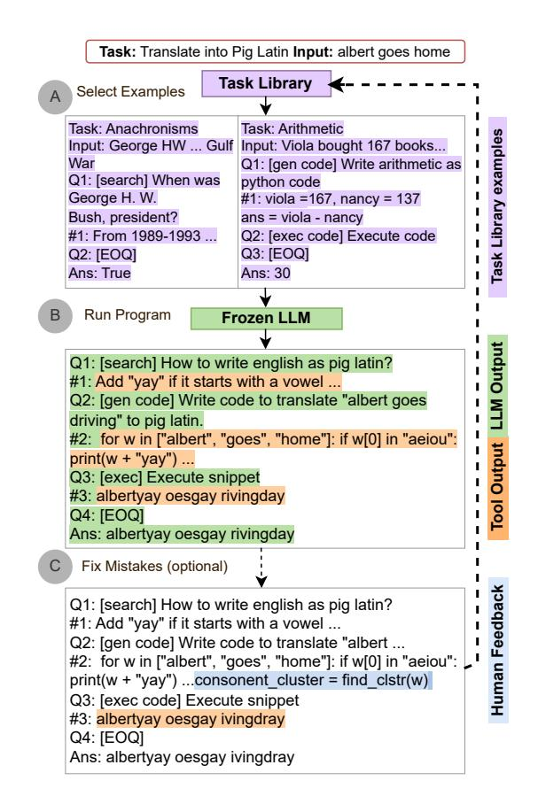
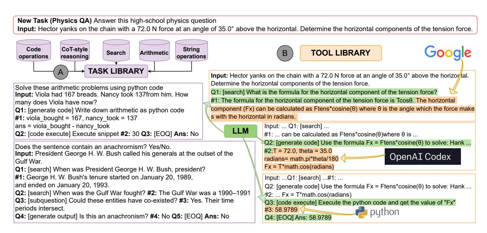
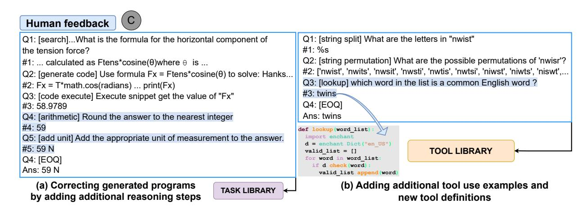

# ART: Automatic multi-step reasoning and tool-use for large language models

# Bhargavi Paranjape<sup>1</sup> Scott Lundberg<sup>2</sup> Sameer Singh<sup>3</sup> Hannaneh Hajishirzi<sup>1,4</sup> Luke Zettlemoyer<sup>1,5</sup> Marco Tulio Ribeiro<sup>2</sup>

<sup>1</sup>University of Washington, <sup>2</sup>Microsoft Research, <sup>3</sup>University of California, Irvine, <sup>4</sup>Allen Institute of Artificial Intelligence, <sup>5</sup>Meta AI

#### **Abstract**

Large language models (LLMs) can perform complex reasoning in few- and zero-shot settings by generating intermediate chain of thought (CoT) reasoning steps. Further, each reasoning step can rely on external tools to support computation beyond the core LLM capabilities (e.g. search/running code). Prior work on CoT prompting and tool use typically requires hand-crafting task-specific demonstrations and carefully scripted interleaving of model generations with tool use. We introduce Automatic Reasoning and Tool-use (ART), a framework that uses frozen LLMs to automatically generate intermediate reasoning steps as a program. Given a new task to solve, ART selects demonstrations of multistep reasoning and tool use from a task library. At test time, ART seamlessly pauses generation whenever external tools are called, and integrates their output before resuming generation. ART achieves a substantial improvement over few-shot prompting and automatic CoT on unseen tasks in the BigBench and MMLU benchmarks, and matches performance of hand-crafted CoT prompts on a majority of these tasks. ART is also extensible, and makes it easy for humans to improve performance by correcting errors in task-specific programs or incorporating new tools, which we demonstrate by drastically improving performance on select tasks with minimal human intervention.

## 1 Introduction

In-context learning allows large language models (LLMs) to quickly adapt to new tasks simply by using natural language instructions and a few demonstrations as a prompt to the LLM (Xie et al., 2021; Brown et al., 2020; Chowdhery et al., 2022). While this circumvents annotating large datasets or even hosting the LLM itself (since many are available through APIs), there are severe performance limitations around multi-step reasoning (Liu et al., 2022),

<span id="page-0-0"></span>

Figure 1: ART generates automatic multi-step decompositions for new tasks by selecting decompositions of related tasks in the *task libray* (A) and selecting and using tools in the *tool library* alongside LLM generation (B). Humans can optionally edit decompositions (eg. correcting and editing code) to improve performance (C).

math (Patel et al., 2021), having up-to-date information (Komeili et al., 2022), and others. To address these limitations, recent work proposes prompting LLMs to mimic a chain of thought (CoT) for multistep reasoning (Wei et al.; Zhou et al., 2022; Wang et al., 2022; Press et al., 2022; Khot et al., 2022; Arora et al., 2022) or providing them with access to tools (e.g. a calculator or QA model) to enable more complex reasoning steps (Gao et al., 2022;

[Chen et al.,](#page-9-3) [2022;](#page-9-3) [Press et al.,](#page-10-3) [2022;](#page-10-3) [Wei et al.;](#page-11-1) [Schick et al.,](#page-10-6) [2023\)](#page-10-6). However, existing methods for chained reasoning with tool use are difficult to extend to new tasks and tools, requiring fine-tuning or prompt-engineering tailored for a specific task [\(Parisi et al.,](#page-10-7) [2022\)](#page-10-7) or tool [\(Schick et al.,](#page-10-6) [2023\)](#page-10-6).

In this paper, we present Automatic Reasoning and Tool use (ART), a framework that automatically generates decompositions (multi-step reasoning) for instances of new tasks. The framework also selects and uses the most appropriate available tools (like search engines, and code execution) in individual steps. Given a new task, ART retrieves demonstrations of related tasks from a *task library* to enable few-shot decomposition and tool use. These demonstrations follow a flexible but structured query language [\(Beurer-Kellner et al.,](#page-9-4) [2022\)](#page-9-4), such that it is easy to parse intermediate steps, stop generation to call external tools, and resume it after including the output of such tools (Figure [1\)](#page-0-0). ART provides the LLM with demonstrations of how to decompose instances of several related tasks, and how to select and use any tool from the *tool library* that is represented in these demonstrations. This encourages the model to generalize from demonstrations to decompose a new task and use tools in appropriate places, zero-shot. It also enables users to fix any mistakes in the reasoning chain or add new tools by simply updating the task and tool libraries, providing new demonstrations where necessary (e.g. for the task at hand).

We construct a task library for 15 diverse Big-Bench [\(Srivastava et al.,](#page-10-8) [2022\)](#page-10-8) tasks, and evaluate ART on 19 unseen *test tasks* from Big-Bench, 6 MMLU tasks, and various tasks used by related work on tool use (SQUAD, TriviaQA, SVAMP, MAWPS). ART consistently matches or outperforms automatically generated CoT reasoning chains on 32 / 34 BigBench and all MMLU tasks, by an average of over 22 percentage points. Tool-use in particular improves performance on test tasks by an average of over 12.3 percentage points, as compared to when no tools are allowed (Table [3\)](#page-7-0). ART improves over direct few-shot prompting by 10.8% percentage points on average across unseen BigBench and MMLU tasks. Improvements are particularly notable on *unseen* tasks requiring arithmetic and algorithmic reasoning, where ART improves over direct few-shot prompting by 12.5% and previous best-known results for GPT3 that use supervision for decomposition and/or tool use by

6.1% percentage points (Table [3\)](#page-7-0).

Finally, ART enables human intervention and improvement of the reasoning process by simply updating the task and tool libraries with new demonstrations, making it very easy to improve performance on any specific task with minor human feedback. On 12 test tasks, ART with additional human feedback surpasses the best-known results for GPT3 by an average of over *20% points* (Table [6\)](#page-8-0).[1](#page-1-0)

# 2 Related Work

Scaled finetuning for low-resource adaptation Recent work has shown that finetuning LLMs on a broad range of public NLP datasets (with prefixed instructions) is an effective technique for cross-task generalization [\(Mishra et al.,](#page-10-9) [2021;](#page-10-9) [Sanh](#page-10-10) [et al.,](#page-10-10) [2021;](#page-10-10) [Khashabi et al.,](#page-10-11) [2020;](#page-10-11) [Wei et al.,](#page-11-4) [2021\)](#page-11-4) in both the zero-shot and few-shot settings. [Ouyang et al.](#page-10-12) [\(2022\)](#page-10-12) show that aligning language models with user intent on a wide range of tasks by fine-tuning with human feedback for desired model behavior (InstructGPT) further improves in-context learning performance on complex NLP tasks. [Chung et al.](#page-9-5) [\(2022\)](#page-9-5) show that finetuning on an aggregated mixture of tasks (T0, CoT, dialog, and code datasets) together with scaling models to 540B parameters achieves state-of-the-art in-context learning performance on several benchmarks such as BigBench and MMLU. ART uses API access to InstructGPT and Codex (LLM finetuned on code [\(Chen et al.,](#page-9-6) [2021\)](#page-9-6)) to leverage their emergent in-context learning abilities. Future improvements in scaled finetuning in LLMs will likely improve the performance on ART.

Prompting with intermediate reasoning steps Chain-of-thought (CoT) prompting [\(Wei et al.,](#page-11-5) [2022;](#page-11-5) [Suzgun et al.,](#page-10-13) [2022\)](#page-10-13) is a popular gradientfree technique that encourages LLMs to generate intermediate reasoning steps prior to the final answer, with multiple task-specific variants (e.g. Least-to-most prompting [\(Zhou et al.,](#page-11-2) [2022\)](#page-11-2), Self-Ask [\(Press et al.,](#page-10-3) [2022\)](#page-10-3), Ask-me-anything [\(Arora](#page-9-2) [et al.,](#page-9-2) [2022\)](#page-9-2), Successive prompting [\(Dua et al.,](#page-10-14) [2022\)](#page-10-14), decomposed prompting [\(Khot et al.,](#page-10-4) [2022\)](#page-10-4)). While such prompts were initially hand-crafted, recent work [\(Kojima et al.,](#page-10-15) [2022\)](#page-10-15) showed that LLMs can generate CoT-style multi-step reasoning in a zero-shot manner, when prompted with the prefix "Let's think step-by-step". [Zhang et al.](#page-11-6) [\(2022\)](#page-11-6) use

<span id="page-1-0"></span><sup>1</sup>Code is available at [https://github.com/](https://github.com/bhargaviparanjape/language-programmes/) [bhargaviparanjape/language-programmes/](https://github.com/bhargaviparanjape/language-programmes/)

<span id="page-2-0"></span>Table 1: Comparing ART with related approaches for multi-step reasoning and tool-use

| Feature                                                                                                                  | СоТ | Auto<br>CoT | Tool-<br>former | ART                                   |
|--------------------------------------------------------------------------------------------------------------------------|-----|-------------|-----------------|---------------------------------------|
| Multi-step reasoning<br>Limited supervision<br>Tool use<br>Extendable libraries<br>Cross-task transfer<br>Human feedback | ✓   | √<br>√      | √<br>√          | \ \ \ \ \ \ \ \ \ \ \ \ \ \ \ \ \ \ \ |

LLMs to automatically generate such CoT-style prompts—AutoCoT—which are competitive with hand-crafted prompts in their performance on arithmetic and commonsense reasoning tasks. We compare ART, CoT and AutoCoT in Table 1. ART builds on this line of work, introducing a common language that enables cross-task demonstrations and flexible and extensible tool use, improving accuracy of intermediate reasoning steps.

**Tool Use** There is growing interest in overcoming LLM limitations with external tools such as search engines, web browsers, calculators, translation systems, and python interpreters (Komeili et al., 2022; Thoppilan et al., 2022; Lazaridou et al., 2022; Shuster et al., 2022; Nakano et al., 2021; Thoppilan et al., 2022; Cobbe et al., 2021; Thoppilan et al., 2022; Gao et al., 2022; Chen et al., 2022). Most of these approaches either require large amounts of human supervision (Thoppilan et al., 2022; Komeili et al., 2022) or carefully constructed prompts tailored to specific tasks and particular tools. An alternative line of recent work uses self-supervision to teach LLMs to use search, translation, and a calculator (Schick et al., 2023)— Toolformer. In contrast, since ART does not require any additional training or tool-specific prompts, it allows users flexibility both in terms of replacing the underlying LLM (e.g. when a new version of GPT-3 is released), and in replacing or adding new tools (either general-purpose tools or tools that are important for a specific task of interest). We compare ART and Toolformer in Table 1. In Section 3.4, we show how human-in-the-loop feedback — analyzing and debugging LLM generations and extending tool-use — can provide a large boost in the performance of ART while also extending it with new tools. This built-in feedback loop and adaptive capability of ART extends the capabilities of LLMs that are finetuning to follow instructions and use tools.

#### 3 ART

With ART, a frozen LLM decomposes instances of a new task into multiple steps (using external tools whenever appropriate), despite not having explicit supervision for decomposition or tool use. In this section, we present an overview of ART, followed by more thorough descriptions of each individual component. We use the Physics Question Answering (PQA) task as a running example, which consists of high-school physics problems.

#### 3.1 Overview

In Figure 2, ART is presented with a new task description and input instance. We also assume access to a few input-output pairs (not shown), with no decomposition or tool use supervision.

**Prompt building.** ART retrieves similar tasks from a *task library* (Figure 2(A); Section 3.2), and adds instances of those tasks as demonstrations in the prompt.

A demonstration in the task library is written in a specific format, defined by a custom *parsing expression grammar* (*PeG*) (Section 3.2). The grammar is defined such that each task instance is decomposed into a sequence of sub-steps. Some of these sub-steps contain symbols corresponding to tools in a *tool library* (Section 3.3). We refer to these decompositions as programs, since the sequential reasoning steps and symbolic calls to tools are similar to a conventional program with function calls.

The resultant prompt consists of programs from related tasks and teaches the LLM how to effectively decompose instances of a new task—related sub-steps and tools in these programs can be used by the LLM for cross-task generalization.

In Figure 2(A), the demonstrations include calls to both search and code tools.

Generation. At generation time (Figure 2(B)), the LLM writes its own program. ART parses the program as it is generated, and pauses generation whenever a tool call is encountered in the generated text, resuming generation after the tool is called and its output is integrated back into the program. As illustrated in the figure, a search engine is used to find the appropriate physics formula, and then the LLM uses code generation and execution to substitute the given values and compute the answer.

**Human feedback (optional).** Humans can add new decomposition demonstrations to the task library, or add/edit tools in the tool library in order

<span id="page-3-0"></span>

Figure 2: A run-through of ART on a new task, Physics QA. (A) Programs of related tasks like anachronisms and Math QA provide few-shot supervision to the LLM — related sub-steps and tools in these programs can be used by the LLM for cross-task generalization (shown in purple). (B) Tool use: Search is used to find the appropriate physics formula, and code generation and execution are used to substitute given values and compute the answer (shown in orange).

to improve performance on a particular task of interest, or in general. In Figure 3(C) a user corrects a specific program by including a step that adds the unit of measurement, and adds this (modified) program to the task library. While most of our experiments do not use such feedback, we show that it is very effective at drastically improving performance when task generalization does not happen automatically. Further, it gives users flexibility to add custom tools without retraining of the LLM.

#### <span id="page-3-1"></span>3.2 Task Library

We construct a library of programs for a small seed set of tasks from Big-Bench (Srivastava et al., 2022), a collaborative benchmark that measures the capabilities and limitations of language models. Big-Bench tasks span categories of traditional NLP, mathematics, commonsense reasoning, and question-answering.

Constructing the task library. We identify *five* skills that are useful across more than half of the tasks in BigBench that encompass text classification or generation of short answers in English (see A.1). We group tasks in the benchmark by these skills into the following clusters:

- Arithmetic: arithmetic and algebra problems.
- Code: Generating and executing python code.
- Search and question decomposition: Single or multi-step questions that require search

- Free-form reasoning: Explaining step-by-step reasoning in natural language
- String Operations: Reformatting/editing strings, checking string entailment, etc.

We then select 2-4 tasks from each cluster and write programs (decompositions) for a few instances of each task, including calls to external tools and real outputs of those tools. Examples of programs in each cluster are in Appendix A.1. These programs follow a specific grammar, as outlined below.

Program grammar The program format must be flexible in terms of task inputs, steps, and tool calls, such that a wide variety of NLP tasks can be covered. To do so, we define a query language (Beurer-Kellner et al., 2022) that extends the decomposed prompting format of Khot et al. (2022), since it can represent decomposed reasoning steps sequentially and incorporates function calls to external tools (like other LLMs). Each program consists of a series of *nodes* — a task input node, several sub-step nodes, and an answer node. The *input node* contains the task name, a simple instruction describing the task, and the input for an instance of the task: "Answer this high-school Physics question

**Input:** Hector yanks...". The input node is followed by a sequence of sub-task nodes, represented as a (query, answer) pair " $Q_i : ..., \#i : ...$ ". The sub-task query  $Q_i$  has a sub-task name and sub-

<span id="page-4-1"></span>

Figure 3: Human feedback to ART shown for (a) PQA where reasoning steps are added to the program and; (b) Word unscrambling where tool library is augmented with a new lookup tool.

task input ("Q1: [search] What is the formula..."), while the sub-task answer #i is simply the output of the sub-task ("#1: The horizontal component (Fx) can be calculated..."). The program ends with a dummy sub-task ("Q3: [EOQ]"), followed by a final answer node ("Ans: 59N"). All examples in Figures [1](#page-0-0) and [2](#page-3-0) follow this format.

Task Retrieval Given a new task, ART retrieves N tasks from the task library to construct a dynamic multi-task prompt. We explore two strategies to retrieve similar tasks, depending on what data is available. If a small number of labeled examples for the new task is available (≈50), we iterate over all five task clusters and select a few task programs from each cluster to compose the prompt. Ultimately, the task cluster with the highest performance on the held-out set of examples is chosen when predicting on all unlabeled examples from the task. While this strategy requires a held-out set of input-output pairs, no additional supervision is needed to generate a decomposed program.

In the second strategy, we craft a few-shot prompt (Appendix [A.2\)](#page-17-0) with task pairs, where each task includes a name, instructions, and a few inputoutput examples. For each pair, we provide a label of "Similar" or "Not similar", and reasoning (e.g. "These are related because they require solving arithmetic word problems"). At run time, we pair the test task with every task in the task library, and choose the highest-ranked ones based on the log probability ratio between "Similar" and "Not similar". We explore both strategies in Section [A.2.](#page-17-0)

## <span id="page-4-0"></span>3.3 Tool Library

Whenever a sub-task query name matches a tool name in the task library (e.g. "Q<sup>i</sup> : [search]"), generation is stopped and resumed after the tool is called and its output is incorporated into the partially completed program. We seed the tool library with the following tools (all of which have demonstrations in the task library). In particular, we describe the symbols used to represent these tools and their inputs. We also specify how the tool output is incorporated back into the program. Tool-specific implementation details and other tools added to ART during feedback [\(3.4\)](#page-5-0) are in Appendix [A.3.](#page-17-1)

Search We use SerpAPI[2](#page-4-2) , which provides an API for Google search. The input to search is the sequence generated by the LLM after "Q<sup>i</sup> : [search]". We extract answer box snippets when they are available or combine the top-2 search result snippets together. For PQA in Figure [2\(](#page-3-0)B), the search query is the original input followed by "What is the formula for the horizontal component of tension force?", and the output is ""... horizontal component (Fx) can be calculated as Ftens\*cosine(θ) ..."".

Code Generation We use the Codex [\(Chen](#page-9-6) [et al.,](#page-9-6) [2021\)](#page-9-6) model for code generation. Input to code generation is the sequence generated by the LM after the sub-task query symbol "Qi : [generate python code]". This argument is an instruction for code generation and is prompted to Codex as a multi-line comment in Python. For example, in Figure [2,](#page-3-0) Codex is prompted the instruction ""Use the formula Fx = Ftens \* cosine(θ) to solve..."" as a comment and generates "T = 72.0,

<span id="page-4-2"></span><sup>2</sup> <https://serpapi.com>

theta = 35.0, ..., Fx = T\*math.cos(radians)", which is appended to the incomplete program.

Code Execution We run Python code in a virtual Python environment with arithmetic, symbolic, and scientific computing packages pre-installed. The argument to code execute is the previous sub-task's answer sequence "#(i − 1) : . . . ", i.e. the python code snippet to be executed. For i = 1, the task input is used as the argument since it potentially contains the code snippet to be executed. In Figure [2,](#page-3-0) the code snippet generated in the previous step is executed and the value of variable "Fx" is added to the incomplete program.

# <span id="page-5-0"></span>3.4 Human feedback

ART is specifically designed to be amenable to human feedback since it does not require additional finetuning. Consequently, users can incorporate feedback immediately into ART, by editing the task library and/or the tool library. Since ART generates multi-step reasoning programs that are interpretable, we explore feedback in the form of debugging, i.e. users *edit* existing programs rather than creating programs from scratch. These edits can be in the form of correcting sub-step outputs, adding/removing sub-steps (with appropriate inputs and answers), adding calls to new tools, etc.

For example, in Figure [3\(](#page-4-1)a) the user edits a program by adding two sub-steps, in order to round the answer to the nearest integer and include the appropriate unit of measurement to the answer. This feedback demonstrates appropriate *decompositions* for the task, as these operations are still performed by the LLM (the tool library does not have "[arithmetic]" or "[add unit]" APIs). In contrast, in Figure [3\(](#page-4-1)b) the user demonstrates the use of a dictionary "[lookup]" *and* implements it as a tool in the tool library. While most of our experiments do not rely on such feedback (and thus measure "zero shot" task transfer with no supervision for reasoning/tooluse), we show that simple operations like these can drastically improve performance on target tasks.

# 4 Experimental Setup

Evaluation Datasets In addition to 15 tasks in the task library (Section [3.2\)](#page-3-1), we evaluate ART on 19 additional test tasks from BigBench which also belong to the five task clusters identified in Section [3.2.](#page-3-1) To check for cross-benchmark generalization, we further evaluate ART on a random subset of tasks from the MMLU benchmark [\(Hendrycks](#page-10-20)

[et al.,](#page-10-20) [2020\)](#page-10-20). Finally, we also evaluate on a subset of tasks used to evaluate Toolformer [\(Schick](#page-10-6) [et al.,](#page-10-6) [2023\)](#page-10-6), in order to compare ART to a model fine-tuned for tool use.

Details We use InstructGPT (text-davinci-002) as the frozen LLM, and Codex as the code generation tool, with temperature set to 0.3. We set the number of seed tasks in the prompt to N = 3 and use 2 demonstration programs from each task. We measure the preferred scoring metric for each task as in [Srivastava et al.](#page-10-8) [\(2022\)](#page-10-8), and report performance averaged over 5 runs.

Baselines ART proposes an automatic framework to generate multi-step reasoning decompositions and use relevant available external tools within those decompositions. We compare with the following baselines:

- Few-shot/Direct: Prompting LLMs with input-output pairs (but no intermediate reasoning). We use 3 examples for BigBench and 5 examples for MMLU, as done in prior work [\(Suzgun et al.,](#page-10-13) [2022\)](#page-10-13). We evaluate this baseline for both, GPT-3 and Codex, and report the higher of the two.
- Auto-CoT: A baseline that automatically generates multi-step reasoning in natural language. A random subset of 5 examples is first used to elicit CoT-style reasoning (*Input + Let's think step-by-step.*). These examples and their generated output form the prompt for other unseen examples of the task. This baseline is free-form and does not include tools, and thus allows us to verify the effectiveness of our query language and task library. We evaluate this baseline for GPT-3.
- ART-tool: ART with tool-use turned off, i.e. the LLM generates the output of every substep, to verify the gains from tool use.
- GPT-3 Best: Best published GPT-3/Codex (175B) result with multi-step decomposition and/or tool use. These often include additional human supervision to decompose reasoning steps, and external tools to boost performance (with carefully constructed prompts).

Additional details about baselines and GPT-3 best models are in Appendix [A.4.](#page-20-0)

## 5 Results

We evaluate ART (without human feedback) on tasks in the task library [\(5.1\)](#page-6-0), and on a variety

<span id="page-6-2"></span>

| Task Name (Cluster)                | Few Shot | AutoCot | ART<br>w/o Tool Use | ART   | GPT-3<br>Best |
|------------------------------------|----------|---------|---------------------|-------|---------------|
| Anachronisms (Search)              | 71.35    | 51.48   | 70.87               | 75.66 | -             |
| Musique (Search)                   | 2.035    | 12.88   | 10.04               | 19.19 | 15.23         |
| Hindu Knowledge (Search)           | 85.02 5  | 73.03   | 83.42               | 87.98 | -             |
| Known Unknown (Search)             | 68.90 5  | 56.09   | 80.43               | 80.43 | -             |
| ∆ with ART (Search)                | +9.0     | +17.44  | +4.6                |       | +4.0          |
| Elementary Math QA (Arithmetic)    | 56.407   | 74.52   | 58.04               | 68.04 | -             |
| Aqua-rat (Arithmetic)              | 20.547   | 34.41   | 36.29               | 54.20 | 54.14         |
| GSM8K (Arithmetic)                 | 7.797    | 21.99   | 53.4                | 71.00 | 71.64         |
| Navigate (Arithmetic)              | 60.77    | 61.7    | 72.4                | 72.4  | 85.901        |
| ∆ with ART (Arithmetic)            | +30.0    | +18.25  | +11.4               |       | -4.7          |
| K'th letter concatenation (String) | 3.25     | 0.64    | 8.19                | 40.00 | 98.02         |
| Language games (String)            | 35.145   | 18.58   | 11.19               | 23.08 | -             |
| Date Understanding (String)        | 37.535   | 38.90   | 52.05               | -     | 70.411        |
| Auto Debugging (Code)              | 62.945   | 38.24   | 55.29               | 62.94 | -             |
| Code Description (Code)            | 97.997   | 88.67   | 84.67               | 88.00 | -             |
| Formal Fallacies (CoT)             | 44.845   | 56.4    | 64.76               | -     | 58.41         |
| Hyperbation (CoT)                  | 62.725   | 55.4    | 80.80               | -     | 72.41         |
| ∆ with ART (Misc)                  | +9.6     | +16.4   | +13.7               |       | -15.4         |
| ∆ with ART (Overall)               | +14.90   | +17.17  | +7.91               |       | -9.0          |

Table 2: ART performance on tasks in the task library. (<sup>1</sup>Human-crafted CoT [\(Wei et al.,](#page-11-5) [2022;](#page-11-5) [Suzgun et al.,](#page-10-13) [2022\)](#page-10-13), <sup>2</sup>Decomposed Prompting [\(Khot et al.,](#page-10-4) [2022\)](#page-10-4), <sup>3</sup>Self-Ask [\(Press et al.,](#page-10-3) [2022\)](#page-10-3), <sup>4</sup>PoT [\(Chen et al.,](#page-9-3) [2022\)](#page-9-3), <sup>5</sup> InstructGPT [\(Ouyang et al.,](#page-10-12) [2022\)](#page-10-12), <sup>7</sup>Code-davinci-002 [\(Chen et al.,](#page-9-6) [2021\)](#page-9-6)). (-) For tasks using CoT reasoning, no tool use is used.

of test tasks from BigBench, MMLU, and QA benchmarks [\(5.2\)](#page-6-1). Then, we show that ART can be further improved with more compute (selfconsistency) and with human feedback [\(5.3\)](#page-8-1).

## <span id="page-6-0"></span>5.1 Results on the task library

For tasks in the task library, demonstrations in the prompt include two instances of the task itself, along with other instances from tasks in the same cluster. We present results in Table [2,](#page-6-2) where tasks are organized by skill cluster. Even with decomposition demonstrations for only two instances, ART drastically improves performance over fewshot learning (+14.9 % points on average), in line with prior work on CoT. It does not do as well on language games, code description, and auto debugging — tasks that use code generation and/or code editing models. We observe that code generation errors often lead to cascading errors in reasoning.

Similarly, ART outperforms AutoCoT on most tasks even without any tool use (by 8% points on average). We hypothesize that the program format (and PeG grammar) is better at eliciting multi-step reasoning from models than free-form CoT due to the added structure to the reasoning. When tool use is turned on, ART outperforms AutoCoT on all tasks (+17.7 % points) minus one. Tools are called in ≈ 95% of test instances, and significantly improve performance (+7.91 % points). Gains from tool use are particularly significant for arithmetic tasks that benefit from representing the arithmetic problem as code that executes complex arithmetic accurately (+21.85 on average). This has also been noted in prior work [\(Chen et al.,](#page-9-3) [2022;](#page-9-3) [Gao et al.,](#page-10-5) [2022\)](#page-10-5).

Compared to the best published GPT-3 results, ART is stronger or comparable in 5/8 tasks. For the others, further investigation indicates that the demonstrations provided by [Khot et al.](#page-10-4) [\(2022\)](#page-10-4) and [Suzgun et al.](#page-10-13) [\(2022\)](#page-10-13) are just more effective than the two programs we author for these tasks (we explore further human feedback for these in Appendix [A.5\)](#page-21-0). In sum, ART is stronger than few-shot learning and AutoCoT on the library tasks (where we provide 2 labeled decompositions), and comparable to the best published GPT-3 results.

## <span id="page-6-1"></span>5.2 Test tasks (cross-task transfer)

We measure cross-task generalization on test tasks where ART does not use explicit supervision for decomposition and tool use. ART retrieves demonstrations from the task library according to the first strategy in Section [3.2,](#page-3-1) which uses a small amount

<span id="page-7-0"></span>

| Task Name (Cluster)                    | Few Shot | AutoCot | ART<br>w/o Tool Use | ART   | GPT-3<br>Best |  |  |  |
|----------------------------------------|----------|---------|---------------------|-------|---------------|--|--|--|
| Test Tasks                             |          |         |                     |       |               |  |  |  |
| Sentence Ambiguity (Search)            | 70.675   | 51.47   | 71.00               | 73.33 | -             |  |  |  |
| Strategy QA (Search)                   | 55.495   | 27.22   | 59.37               | 66.44 | -             |  |  |  |
| Physics (Search)                       | 70.095   | 61.83   | 59.13               | 67.55 | -             |  |  |  |
| ∆ with ART (Search)                    | +3.7     | +22.27  | + 5.9               |       |               |  |  |  |
| Physics Questions (Arithmetic)         | 7.025    | 5.56    | 6.30                | 20.37 | -             |  |  |  |
| Operators (Arithmetic)                 | 71.237   | 75.52   | 71.80               | 92.00 | -             |  |  |  |
| Unit interpretation (Arithmetic)       | 58.27    | 41.20   | 51.4                | 53.99 | -             |  |  |  |
| Repeat copy logic (Arithmetic)         | 50.017   | 15.63   | 31.25               | 44.38 | -             |  |  |  |
| Object Counting (Arithmetic)           | 39.27    | 26.80   | 42.2                | 87.00 | 81.201        |  |  |  |
| Penguins in a table (Arithmetic)       | 58.237   | 40.40   | 68.86               | 77.85 | 72.341        |  |  |  |
| Reasoning about objects (Arithmetic)   | 71.007   | 33.33   | 45.35               | 64.34 | 52.691        |  |  |  |
| Tracking shuffled objects (Arithmetic) | 22.397   | 19.44   | 18.14               | 37.67 | 36.321        |  |  |  |
| ∆ with ART (Arithmetic)                | +19.0    | +36.7   | + 23.1              |       | +6.1          |  |  |  |
| Word Unscramble (String)               | 40.727   | 32.44   | 23.03               | 42.7  | -             |  |  |  |
| Simple Text Editing (Code)             | 35.315   | 30.21   | 20.74               | 27.65 | -             |  |  |  |
| CS Algorithms (Code)                   | 73.487   | 0.0     | 41.59               | 88.11 | -             |  |  |  |
| Sports Understanding (CoT)             | 69.745   | 51.47   | 92.89               | -     | 86.591        |  |  |  |
| Snarks (CoT)                           | 54.585   | 57.24   | 57.13               | -     | 65.21         |  |  |  |
| Disambiguation QA (Free-form)          | 55.035   | 48.45   | 55.89               | -     | 60.621        |  |  |  |
| Temporal sequences (CoT)               | 55.807   | 19.70   | 49.5                | -     | 81.81         |  |  |  |
| Ruin names (CoT)                       | 71.015   | 55.28   | 60.22               | -     | -             |  |  |  |
| ∆ with ART (Misc)                      | 2.4      | 22.5    | 24.37               |       | -9.4          |  |  |  |
| ∆ with ART (Overall)                   | +6.9     | +24.6   | +16.7               |       | -1.7          |  |  |  |
|                                        | MMLU     |         |                     |       |               |  |  |  |
| College Computer Science (Search)      | 41.00    | 43.99   | 63.40               | 67.80 | 63.66         |  |  |  |
| Astronomy (Search)                     | 62.10    | 41.48   | 76.71               | 79.1  | 62.56         |  |  |  |
| Business Ethics (Search)               | 61.60    | 48.8    | 77.17               | 81.16 | 72.76         |  |  |  |
| Virology (Search)                      | 50.03    | 49.52   | 71.60               | 71.49 | 50.726        |  |  |  |
| Geography (Search)                     | 77.67    | 57.07   | 70.30               | 71.71 | 81.86         |  |  |  |
| Mathematics (Arithmetic)               | 36.67    | 33.77   | 39.50               | 45.66 | 34.56         |  |  |  |
| ∆ with ART (MMLU)                      | +14.6    | +23.7   | +3.0                |       | +8.5          |  |  |  |

Table 3: ART performance on BigBench tasks and MMLU tasks. (<sup>1</sup> Human-crafted CoT [\(Wei et al.,](#page-11-5) [2022;](#page-11-5) [Suzgun](#page-10-13) [et al.,](#page-10-13) [2022\)](#page-10-13), <sup>5</sup> InstructGPT [\(Ouyang et al.,](#page-10-12) [2022\)](#page-10-12), <sup>6</sup> Scaled instruction finetuning [\(Chung et al.,](#page-9-5) [2022\)](#page-9-5), <sup>7</sup> Codedavinci-002 [\(Chen et al.,](#page-9-6) [2021\)](#page-9-6)).

<span id="page-7-2"></span>

|                   | SQuAD               | T-REx              | SVAMP               | MAWPS                | NQ                  | TriviaQA              |
|-------------------|---------------------|--------------------|---------------------|----------------------|---------------------|-----------------------|
| GPT3 (175B)       | 29.90               | 39.8               | 10.0                | 19.8                 | 22.6                | 65.9                  |
| Toolformer<br>ART | 33.8<br>39.34(+5.5) | 53.5<br>50.4(-3.1) | 29.4<br>76.2(+46.8) | 44.0<br>71.00(+27.0) | 17.7<br>33.8(+16.1) | 48.8<br>66.13(+17.33) |

Table 4: Comparing ART results on GPT3 (175B) model and [\(Schick et al.,](#page-10-6) [2023\)](#page-10-6), which is a smaller GPT-J model finetuned for tool-use. Results are reported from their paper (their code and models are not publicly available).

of labeled input-output pairs to pick a task cluster and sample demonstration programs from that cluster.[3](#page-7-1)

BigBench test tasks Even though there is no decomposition or tool use supervision, the results in Table [3](#page-7-0) are similar to those for tasks in the

task library. ART outperforms few-shot learning (6.9 % points). In particular, ART has significant improvements on arithmetic tasks (+19.0) and is comparable to the few-shot performance on search tasks. Non-grammatical choices in *ruin names* and choices not in the input in *temporal sequences* are often incorrect, which the few-shot baseline may potentially learn to ignore, while ART attempts to

<span id="page-7-1"></span><sup>3</sup>We compare both strategies in Appendix [A.2](#page-17-0)

<span id="page-8-2"></span>

|                    | Simple Text<br>Editing | CS<br>Algorithms | Strategy QA | Physics<br>Questions | Unit<br>Interpretation | Reasoning about<br>colored objects |
|--------------------|------------------------|------------------|-------------|----------------------|------------------------|------------------------------------|
| ART                | 27.65                  | 88.11            | 66.44       | 20.37                | 53.99                  | 64.34                              |
| + Self Consistency | 30.67(+3.0)            | 90.99(+2.9)      | 70.76(+4.3) | 24.07(+3.7)          | 57.20(+3.2)            | 69.11(+4.8)                        |

Table 5: Improving ART via self-consistency [\(Wang et al.,](#page-11-3) [2022\)](#page-11-3). Ensembling model generations over 15 runs further boosts performance.

<span id="page-8-0"></span>

| Task                 |       | CoT<br>+Human |       | ART<br>+ Human | GPT-3<br>Best | Human<br>Feedback                              |
|----------------------|-------|---------------|-------|----------------|---------------|------------------------------------------------|
| CS Algorithms        | 0.0   | 23.0          | 88.11 | 92.73          | 73.48         | C: longest common subsequence code             |
| Reasong about objs.  | 33.33 | 67.75         | 64.34 | 98.90          | 71.00         | C: Define object, color, count data structure  |
| Repeat Copy Logic*   | 15.63 | 45.22         | 44.38 | 80.31          | 50.01         | C: string edit operation                       |
| Sentence Ambiguity   | 51.47 | 72.33         | 73.33 | 83.67          | 70.67         | C: Constrain queries to extract relevant info. |
| Simple Text editing* | 30.21 | 35.31         | 27.65 | 36.11          | 35.31         | C: string edit operation                       |
| Strategy QA*         | 27.22 | 29.19         | 66.44 | 69.15          | 55.49         | C: Constrain queries to extract relevant info. |
| Physics*             | 61.83 | 68.21         | 67.55 | 72.55          | 70.09         | A: [search] Formula that connects mass,        |
| Temporal Sequences   | 19.70 | 30.22         | 49.5  | 88.00          | 81.8          | A: [subquestion] Is X free Yam to Zam?         |
| Track Shuffled objs. | 19.44 | 36.48         | 37.67 | 99.86          | 36.32         | C: Define object pair data struct, swap logic  |
| Unit Interpretation* | 41.2  | 41.2          | 53.99 | 95.0           | 58.2          | A: [add unit] Add the right unit to the answer |
| Word Unscrambling*   | 32.44 | 33.40         | 42.70 | 62.11          | 40.72         | T: lookup permutations in dictionary           |
| Average              | 30.2  | 43.8          | 56.0  | 79.85          | 58.5          |                                                |

Table 6: Improving ART and free-form CoT via self-consistency and human-in-the-loop feedback. (\*) indicates that human-in-the-loop improvement was done over automatically generated CoT reasoning for these tasks. Feedback for ART includes correcting sub-steps in programs ("C:"), adding additional sub-steps("A:"), and defining new tools("T:"). Note that only five examples were edited for each task.

explicitly reason about them. As with library tasks, we observe that string manipulation tasks like simple text editing, word unscrambling, and repeat copy logic suffer from code generation errors.

As observed in the case of library tasks, ART is better than AutoCoT on almost all tasks (24.6 % points). Tools are once again called very frequently (89% of instances), and are responsible for a significant fraction of the gains over baselines.

When compared to the best published GPT-3 results, ART performs favorably on average, especially on arithmetic tasks (+6.1 % points). As before, it does worse in tasks where good human demonstrations of how to decompose *the task itself* (provided by [Suzgun et al.](#page-10-13) [\(2022\)](#page-10-13)) have a big impact. We re-evaluate ART with more human feedback on these tasks in [5.3,](#page-8-1) but even without that we conclude that ART is competitive on Big-Bench even when we do not have supervision for decompositions for the task at hand (i.e. there is cross-task generalization).

Other benchmarks To make sure ART does not overfit to BigBench-style tasks, we evaluate performance on additional benchmarks. We report performance on randomly selected tasks from the MMLU benchmark [\(Hendrycks et al.,](#page-10-20) [2020\)](#page-10-20) in

Table [3,](#page-7-0) where ART is more effective than all baselines on 5/6 tasks (+8.5 points better than few-shot baseline on average), despite having no supervision for demonstrations or tool use. MMLU requires extensive world knowledge, and thus most of these tasks benefit the most from the search tool.

In Table [4,](#page-7-2) we compare ART to a random subset of tasks used to evaluate Toolformer [\(Schick et al.,](#page-10-6) [2023\)](#page-10-6), a model finetuned to use a variety of tools. The comparison is not exact since Toolformer uses a smaller GPT-J model, but it is informative that ART outperforms Toolformer by a large margin on 5/6 of these tasks. To make sure these gains are not simply a result of model scale, we also use vanilla GPT-3 as a baseline, which yields much worse results than ART on all tasks. Besides improved performance, we note again that ART does not require additional fine-tuning when new tools or new base LLMs are introduced, and also is amenable to further improvement at the cost of compute or human feedback.

## <span id="page-8-1"></span>5.3 Improving ART

Self-consistency Previous work has noted benefits in generating multiple LLM outputs and taking the most frequent answer (a process known as self-consistency), particularly for settings with

multi-step reasoning [\(Khot et al.,](#page-10-4) [2022;](#page-10-4) [Wang et al.,](#page-11-3) [2022\)](#page-11-3). In Table [5,](#page-8-2) we present self-consistency results (generating 15 outputs) for ART on a subset of tasks and see that it consistently improves performance, at the cost of extra computation.

Human feedback We also pilot the use of taskspecific feedback in Table [6,](#page-8-0) by having one of the authors *edit* 5 random instances of modelgenerated programs that resulted in errors for each task. When editing, we correct errors in sub-steps (denoted as "C:"), adds missing substeps ("A:"), or defines a new tool and demonstrates its use ("T:"). For example, this involved introducing an "add unit" sub-step for the PQA task, and implementing a dictionary lookup function as a tool for the "Word Unscrambling" task (both illustrated by Figure [3\)](#page-4-1).

We also compare human feedback applied to CoT-style reasoning. [Suzgun et al.](#page-10-13) [\(2022\)](#page-10-13) already provide reference CoT-style reasoning for some tasks. For datasets where human-authored CoT reasoning is unavailable, we correct the output of the automatic CoT baseline, as indicated in Table [6.](#page-8-0) The same author *edits* 5 random instances of Auto-CoT decompositions that lead to errors on the same tasks, correcting errors in sub-steps or adding new sub-steps. As a reference, the edits included 35% of tokens in the baseline, and 15.7% of tokens in the ART programs. This included correcting substep arguments and outputs in 72% of the chosen tasks and adding additional sub-steps in 44% of the tasks. New tool definitions were added for two tasks — dictionary lookup for word unscrambling and a Prolog engine for formal fallacies.

In both cases, editing programs and adding them as demonstrations leads to significant gains in performance on the task at hand. However, the gain is much more dramatic in ART, leading it to consistently outperform the best published GPT-3 baseline for the task at hand. Further, these corrected programs and tools can be added to the task and tool libraries, and our prior results in Table [3](#page-7-0) suggest that they potentially help improve ART on other tasks as well. This pilot indicates that besides being competitive on cross-task generalization, ART is very amenable to task-specific improvement with minimal human intervention. We report similar results in the task library in [A.5.](#page-21-0)

# 6 Conclusion

We introduce ART, a gradient-free approach for automatic multi-step reasoning generation and automatic tool-use for a large black-box language model. Our main contributions include a lightweight grammar to represent multi-step reasoning as a program (with tool calls and arguments), an extensible library of seed tasks for which programs are authored, and a tool library that consists of useful external utilities like search, code generation, and execution. The interpretable reasoning framework also allows humans to improve task decomposition and tool use to boost performance. ART achieves a substantial improvement over few-shot prompting and automatic generation of CoT reasoning on unseen tasks in the BigBench and MMLU benchmarks, and substantially exceeds performance on hand-crafted CoT prompts when human feedback is incorporated. ART also benefits from approaches such as self-consistency, or from new and more powerful LLMs trained for tool use.

## References

<span id="page-9-2"></span>Simran Arora, Avanika Narayan, Mayee F Chen, Laurel J Orr, Neel Guha, Kush Bhatia, Ines Chami, Frederic Sala, and Christopher Ré. 2022. Ask me anything: A simple strategy for prompting language models. *arXiv preprint arXiv:2210.02441*.

<span id="page-9-4"></span>Luca Beurer-Kellner, Marc Fischer, and Martin Vechev. 2022. Prompting is programming: A query language for large language models. *arXiv preprint arXiv:2212.06094*.

<span id="page-9-0"></span>Tom B Brown, Benjamin Mann, Nick Ryder, Melanie Subbiah, Jared Kaplan, Prafulla Dhariwal, Arvind Neelakantan, Pranav Shyam, Girish Sastry, Amanda Askell, et al. 2020. Language models are few-shot learners. *arXiv preprint arXiv:2005.14165*.

<span id="page-9-6"></span>Mark Chen, Jerry Tworek, Heewoo Jun, Qiming Yuan, Henrique Ponde de Oliveira Pinto, Jared Kaplan, Harri Edwards, Yuri Burda, Nicholas Joseph, Greg Brockman, et al. 2021. Evaluating large language models trained on code. *arXiv preprint arXiv:2107.03374*.

<span id="page-9-3"></span>Wenhu Chen, Xueguang Ma, Xinyi Wang, and William W Cohen. 2022. Program of thoughts prompting: Disentangling computation from reasoning for numerical reasoning tasks. *arXiv preprint arXiv:2211.12588*.

<span id="page-9-1"></span>Aakanksha Chowdhery, Sharan Narang, Jacob Devlin, Maarten Bosma, Gaurav Mishra, Adam Roberts, Paul Barham, Hyung Won Chung, Charles Sutton, Sebastian Gehrmann, et al. 2022. Palm: Scaling language modeling with pathways. *arXiv preprint arXiv:2204.02311*.

<span id="page-9-5"></span>Hyung Won Chung, Le Hou, Shayne Longpre, Barret Zoph, Yi Tay, William Fedus, Eric Li, Xuezhi

- Wang, Mostafa Dehghani, Siddhartha Brahma, et al. 2022. Scaling instruction-finetuned language models. *arXiv preprint arXiv:2210.11416*.
- <span id="page-10-19"></span>Karl Cobbe, Vineet Kosaraju, Mohammad Bavarian, Mark Chen, Heewoo Jun, Lukasz Kaiser, Matthias Plappert, Jerry Tworek, Jacob Hilton, Reiichiro Nakano, et al. 2021. Training verifiers to solve math word problems. *arXiv preprint arXiv:2110.14168*.
- <span id="page-10-14"></span>Dheeru Dua, Shivanshu Gupta, Sameer Singh, and Matt Gardner. 2022. Successive prompting for decomposing complex questions. *arXiv preprint arXiv:2212.04092*.
- <span id="page-10-5"></span>Luyu Gao, Aman Madaan, Shuyan Zhou, Uri Alon, Pengfei Liu, Yiming Yang, Jamie Callan, and Graham Neubig. 2022. Pal: Program-aided language models. *arXiv preprint arXiv:2211.10435*.
- <span id="page-10-20"></span>Dan Hendrycks, Collin Burns, Steven Basart, Andy Zou, Mantas Mazeika, Dawn Song, and Jacob Steinhardt. 2020. Measuring massive multitask language understanding. *arXiv preprint arXiv:2009.03300*.
- <span id="page-10-11"></span>Daniel Khashabi, Sewon Min, Tushar Khot, Ashish Sabharwal, Oyvind Tafjord, Peter Clark, and Hannaneh Hajishirzi. 2020. Unifiedqa: Crossing format boundaries with a single qa system. *arXiv preprint arXiv:2005.00700*.
- <span id="page-10-4"></span>Tushar Khot, Harsh Trivedi, Matthew Finlayson, Yao Fu, Kyle Richardson, Peter Clark, and Ashish Sabharwal. 2022. Decomposed prompting: A modular approach for solving complex tasks. *arXiv preprint arXiv:2210.02406*.
- <span id="page-10-15"></span>Takeshi Kojima, Shixiang Shane Gu, Machel Reid, Yutaka Matsuo, and Yusuke Iwasawa. 2022. Large language models are zero-shot reasoners. *arXiv preprint arXiv:2205.11916*.
- <span id="page-10-2"></span>Mojtaba Komeili, Kurt Shuster, and Jason Weston. 2022. [Internet-augmented dialogue generation.](https://doi.org/10.18653/v1/2022.acl-long.579) In *Proceedings of the 60th Annual Meeting of the Association for Computational Linguistics (Volume 1: Long Papers)*, pages 8460–8478, Dublin, Ireland. Association for Computational Linguistics.
- <span id="page-10-16"></span>Angeliki Lazaridou, Elena Gribovskaya, Wojciech Stokowiec, and Nikolai Grigorev. 2022. Internetaugmented language models through few-shot prompting for open-domain question answering. *arXiv preprint arXiv:2203.05115*.
- <span id="page-10-0"></span>Haokun Liu, Derek Tam, Mohammed Muqeeth, Jay Mohta, Tenghao Huang, Mohit Bansal, and Colin Raffel. 2022. Few-shot parameter-efficient finetuning is better and cheaper than in-context learning. *arXiv preprint arXiv:2205.05638*.
- <span id="page-10-9"></span>Swaroop Mishra, Daniel Khashabi, Chitta Baral, and Hannaneh Hajishirzi. 2021. Cross-task generalization via natural language crowdsourcing instructions. *arXiv preprint arXiv:2104.08773*.

- <span id="page-10-18"></span>Reiichiro Nakano, Jacob Hilton, Suchir Balaji, Jeff Wu, Long Ouyang, Christina Kim, Christopher Hesse, Shantanu Jain, Vineet Kosaraju, William Saunders, et al. 2021. Webgpt: Browser-assisted questionanswering with human feedback. *arXiv preprint arXiv:2112.09332*.
- <span id="page-10-12"></span>Long Ouyang, Jeff Wu, Xu Jiang, Diogo Almeida, Carroll L Wainwright, Pamela Mishkin, Chong Zhang, Sandhini Agarwal, Katarina Slama, Alex Ray, et al. 2022. Training language models to follow instructions with human feedback. *arXiv preprint arXiv:2203.02155*.
- <span id="page-10-7"></span>Aaron Parisi, Yao Zhao, and Noah Fiedel. 2022. Talm: Tool augmented language models. *arXiv preprint arXiv:2205.12255*.
- <span id="page-10-1"></span>Arkil Patel, Satwik Bhattamishra, and Navin Goyal. 2021. [Are NLP models really able to solve simple](https://doi.org/10.18653/v1/2021.naacl-main.168) [math word problems?](https://doi.org/10.18653/v1/2021.naacl-main.168) In *Proceedings of the 2021 Conference of the North American Chapter of the Association for Computational Linguistics: Human Language Technologies*, pages 2080–2094, Online. Association for Computational Linguistics.
- <span id="page-10-3"></span>Ofir Press, Muru Zhang, Sewon Min, Ludwig Schmidt, Noah A Smith, and Mike Lewis. 2022. Measuring and narrowing the compositionality gap in language models. *arXiv preprint arXiv:2210.03350*.
- <span id="page-10-10"></span>Victor Sanh, Albert Webson, Colin Raffel, Stephen H Bach, Lintang Sutawika, Zaid Alyafeai, Antoine Chaffin, Arnaud Stiegler, Teven Le Scao, Arun Raja, et al. 2021. Multitask prompted training enables zero-shot task generalization. *arXiv preprint arXiv:2110.08207*.
- <span id="page-10-6"></span>Timo Schick, Jane Dwivedi-Yu, Roberto Dessì, Roberta Raileanu, Maria Lomeli, Luke Zettlemoyer, Nicola Cancedda, and Thomas Scialom. 2023. Toolformer: Language models can teach themselves to use tools. *arXiv preprint arXiv:2302.04761*.
- <span id="page-10-17"></span>Kurt Shuster, Mojtaba Komeili, Leonard Adolphs, Stephen Roller, Arthur Szlam, and Jason Weston. 2022. Language models that seek for knowledge: Modular search & generation for dialogue and prompt completion. *arXiv preprint arXiv:2203.13224*.
- <span id="page-10-8"></span>Aarohi Srivastava, Abhinav Rastogi, Abhishek Rao, Abu Awal Md Shoeb, Abubakar Abid, Adam Fisch, Adam R Brown, Adam Santoro, Aditya Gupta, Adrià Garriga-Alonso, et al. 2022. Beyond the imitation game: Quantifying and extrapolating the capabilities of language models. *arXiv preprint arXiv:2206.04615*.
- <span id="page-10-13"></span>Mirac Suzgun, Nathan Scales, Nathanael Schärli, Sebastian Gehrmann, Yi Tay, Hyung Won Chung, Aakanksha Chowdhery, Quoc V Le, Ed H Chi, Denny Zhou, et al. 2022. Challenging big-bench tasks and whether chain-of-thought can solve them. *arXiv preprint arXiv:2210.09261*.

<span id="page-11-7"></span>Romal Thoppilan, Daniel De Freitas, Jamie Hall, Noam Shazeer, Apoorv Kulshreshtha, Heng-Tze Cheng, Alicia Jin, Taylor Bos, Leslie Baker, Yu Du, et al. 2022. Lamda: Language models for dialog applications. *arXiv preprint arXiv:2201.08239*.

<span id="page-11-3"></span>Xuezhi Wang, Jason Wei, Dale Schuurmans, Quoc Le, Ed Chi, and Denny Zhou. 2022. Self-consistency improves chain of thought reasoning in language models. *arXiv preprint arXiv:2203.11171*.

<span id="page-11-4"></span>Jason Wei, Maarten Bosma, Vincent Y Zhao, Kelvin Guu, Adams Wei Yu, Brian Lester, Nan Du, Andrew M Dai, and Quoc V Le. 2021. Finetuned language models are zero-shot learners. *arXiv preprint arXiv:2109.01652*.

<span id="page-11-5"></span>Jason Wei, Xuezhi Wang, Dale Schuurmans, Maarten Bosma, Ed Chi, Quoc Le, and Denny Zhou. 2022. Chain of thought prompting elicits reasoning in large language models. *arXiv preprint arXiv:2201.11903*.

<span id="page-11-1"></span>Jason Wei, Xuezhi Wang, Dale Schuurmans, Maarten Bosma, Fei Xia, Ed H Chi, Quoc V Le, Denny Zhou, et al. Chain-of-thought prompting elicits reasoning in large language models. In *Advances in Neural Information Processing Systems*.

<span id="page-11-0"></span>Sang Michael Xie, Aditi Raghunathan, Percy Liang, and Tengyu Ma. 2021. An explanation of in-context learning as implicit bayesian inference. *arXiv preprint arXiv:2111.02080*.

<span id="page-11-6"></span>Zhuosheng Zhang, Aston Zhang, Mu Li, and Alex Smola. 2022. Automatic chain of thought prompting in large language models. *arXiv preprint arXiv:2210.03493*.

<span id="page-11-2"></span>Denny Zhou, Nathanael Schärli, Le Hou, Jason Wei, Nathan Scales, Xuezhi Wang, Dale Schuurmans, Olivier Bousquet, Quoc Le, and Ed Chi. 2022. Least-to-most prompting enables complex reasoning in large language models. *arXiv preprint arXiv:2205.10625*.

# A Appendix

## <span id="page-11-8"></span>A.1 Task Library

Library Design We analyzed input-output instances of all 200 tasks in BigBench, filtered out text classification and short answer generation tasks in English, and created a list of reasoning skills that were relevant to solving each task. We do not focus on long text understanding, long text generation, and multi-lingual tasks in this work. We find that most of these tasks rely on a few common skills mentioned below:

Visual Reasoning, Temporal Reasoning, Propositional logic, Natural Logic, Machine Translation, Web Search, Knowledge Base or Database lookup, Recursive sub-question decomposition, Long text

understanding, Database Operations, Algebra and Arithmetic, Code Generation and Editing, Text Tagging/Annotation(linguistic markers), Specialized Search(eg. looking up linguistic knowledge, scientific knowledge etc), String editing, Recursive operations over multiple choices, Topic classification, Evidence extraction, conditional Text Generation/Editing, and Sentence similarity.

In this work, we choose to focus on the five most used skills that cover a significant proportion of BigBench tasks for classification (over 50 of the 91 tasks that remained after filtrating out long-text understanding, generation, and multi-lingual tasks). We randomly select 2-4 tasks from each of these 5 task clusters and author decomposed programs with appropriate tool use for these tasks. This results in a total of 15 tasks that compose the *task library*.

- Arithmetic: Elementary MathQA, Grade school math (GSM8K), arithmetic Questions about ratios (Aqua-Rat), Navigate
- Code: Auto Debugging, Code Description
- Search and question decomposition: Anachronims, Multi-step question answering (Musique), Hindu Knowledge, Known Unknown
- Free-form reasoning: Formal fallacies, Hyperbation
- String Operations: Kth letter concatenation, Language games, Date understanding

Cluster Programs The programs written for tasks in each task cluster are shown in Table [7](#page-12-0) for tasks involving string editing and manipulation, in Table [8](#page-13-0) for arithmetic and algebra tasks, in Table [10](#page-15-0) for code generation, editing and debugging tasks, in Table [9](#page-14-0) for tasks benefit from search of world knowledge, and in Table [11](#page-16-0) for tasks that benefit from eliciting chain-of-thought reasoning following the prompt "Let's think step-by-step".

Program Format We define a parsing expression grammar (PEG) (shown in Figure [4\)](#page-19-0) that describes the language used to write multi-step reasoning programs. This grammar is designed to parse full programs of the form "Input: ... Q1: ... #1:... Qn: [EOQ] Ans: ". We use the python library *parsimoneous*[4](#page-11-9) to construct the grammar and parse programs generated by LLMs.

<span id="page-11-9"></span><sup>4</sup> <https://pypi.org/project/parsimonious/>

```
In these examples, you are given a task description and an input. Break the input down into subtasks in order to solve the
task. You can use string operations like splitting, reformatting, editing or merging. You can also use other operations like
arithmetic and logic.
Description: (Date Understanding) Find the required date in MM/DD/YYYY using information about related events and
dates in the input. Clue: First find what day is today.
Input: The deadline is Jun 1, 2021, which is 2 days away from now. What is the date 24 hours later in MM/DD/YYYY?
Q1: [string reformat] Jun 1, 2021 in MM/DD/YYYY
#1: 06/01/2021
Q2: [arithmetic] 06/01/2021 is 2 days away from now. What date is today?
#2: Today is 04/01/2021
Q3: [arithmetic] What date is 24 hours later than today?
#3: 05/01/2021
Q4: [EOQ]
Ans: 05/31/2021
—-
Description: (Language games) Translate English into Pig Latin.
Input: (English) Sami made his way across the bar and hugged Layla.
Q1: [string split] What are the words in "Sami made his way across the bar and hugged Layla."?
#1: ["Sami", "made", "his", "way", "across", "the", "bar", "and", "hugged", "Layla", "."]
Q2: [string edit] Transfer the initial consonant of each word to the end of the word and adding "ay" after it.
#2: ["Amisay", "ademay", "ishay", "ayway", "acrossyay", "ethay", "arbay", "andyay", "uggedhay", "Aylalay", "."]
Q3: [string merge] Concatenate #2 into a full sentence.
#3: Amisay ademay ishay ayway acrossyay ethay arbay andyay uggedhay Aylalay.
Q4: [EOQ]
Ans: Amisay ademay ishay ayway acrossyay ethay arbay andyay uggedhay Aylalay.
—-
Description: (Kth letter concatenation) Take the letters at position 3 of the words in a list of words and concatenate them
using a space.
Input: Take the letters at position 3 of the words in "Savita Saeed Ramos Sato Yadav" and concatenate them using a space.
Q1: [string split] What are the words in "Savita Saeed Ramos Sato Yadav"?
#1: ["Savita", "Saeed", "Ramos", "Sato", "Yadav"]
Q2: [string index] What is the third letter of words in the list in #1?
#2: ["v", "e", "m", "t", "d"]
Q3: [string merge] Concatenate #2 with spaces
#3: "v e m t d"
Q4: [EOQ]
Ans: v e m t d
—-
```

<span id="page-12-0"></span>String Operations

Descripton: %s Input: %s Q1:

Table 7: Programs in the task library for tasks requiring string manipulation. .

```
Arithmetic
In these examples, you are given a task description and an input. Break the input down into subtasks in order to solve the task.
You can generate python code to solve arithmetic and algebra equations in using functions from sympy.
from sympy import Symbol
from sympy import simplify
import math
from sympy import solve_it
# solve_it(equations, variable): solving the equations and return the variable value.
Description: (Aqua-rat) Solve the following arithmetic problems on ratios and fractions, writing out intermediate arithmetic
calculations as python code. Store your result as a variable named 'ans'.
Input: In a flight of 600 km, an aircraft was slowed down due to bad weather. Its average speed for the trip was reduced by
200 km/hr and the time of flight increased by 30 minutes. The duration of the flight is: A)1 hour B)2 hours C)3 hours D)4
hours E)5 hours
Q1: [generate python code] write python code to solve the problem, using math and sympy.
#1:
duration = Symbol('duration', positive=True)
delay = 30 / 60
total_disntace = 600
original_speed = total_disntace / duration
reduced_speed = total_disntace / (duration + delay)
solution = solve_it(original_speed - reduced_speed - 200, duration)
ans = solution[duration]
print(ans)
Q2: [code execute] Execute the python code in #1 and get the value of "ans"
#2:
1.0
Q3: [compare] Which of the options among A)1 hour B)2 hours C)3 hours D)4 hours E)5 hours is most similar to the answer?
#3: A
Q4: [EOQ]
Ans: A
—-
Description: (Elementary Math) Solve the following middle-school arithmetic problems, writing out intermediate arithmetic
calculations as python code. Store your result as a variable named 'ans'.
Input: Janet's ducks lay 16 eggs per day. She eats three for breakfast every morning and bakes muffins for her friends every
day with four. She sells the remainder at the farmers' market daily for $2 per fresh duck egg. How much in dollars does she
make every day at the farmers' market?
Q1: [generate python code] write down the arithmetic or algebra equations as python code, storing the answer as 'ans'
#1:
total_eggs = 16
eaten_eggs = 3
baked_eggs = 4
sold_eggs = total_eggs - eaten_eggs - baked_eggs
dollars_per_egg = 2
ans = sold_eggs * dollars_per_egg
print(ans)
Q2: [code execute] Execute the python code in #1 and get the value of "ans"
#2: 18
Q3: [EOQ]
Ans:18
—-
Description: (Grage school Math) Solve the following middle-school arithmetic problems, writing out intermediate arithmetic
calculations as python code. Store your result as a variable named 'ans'.
Input: Joseph and Getty went to buy ice creams, they together bought 36 ice creams. On the way back, Joseph ate 12 of the
ice creasm, and he has 2 ice creams left now.
Q1: [generate python code] write down the arithmetic or algebra equations as python code, storing the answer as 'ans'
#1:
num_ice_creams_bought_by_joseph = 2 + 12
total_ice_creams = 36
ans = total_ice_creams - num_ice_creams_bought_by_joseph
print(ans)
Q2: [code execute] Execute the python code in #1 and get the value of "ans"
#2: 22
```

Table 8: Programs in the task library for tasks requiring arithmetic operations.

Q3: [EOQ] Ans: 22 —-

Descripton: %s Input: %s Q1:

.

#### <span id="page-14-0"></span>Search

In these examples, you are given a task description and an input. Break the input down into subtasks in order to solve the task. You can use search functions like Google search in one or more of your substeps, if there in insufficient information. Other functions like arithmetic and logical operations can also be used.

Description: (Knwon or Unknwon) Choose the option that best answers the question. If the question does not have a known answer, choose "Unknown".

Input: How many hairs were on Neil Armstrong's head when he landed on the moon?

choice: Unknown choice: Five million

Q1: [search] How many hairs were on Neil Armstrong's head when he landed on the moon?

#1:

Apollo 11 (July 16–24, 1969) was the American spaceflight that first landed humans on the Moon. Commander Neil Armstrong and lunar module pilot Buzz Aldrin.

Neil Alden Armstrong (August 5, 1930 – August 25, 2012) was an American astronaut and aeronautical engineer who became the first person to walk on the Moon.

Q2: [subquestion] Does the information help answer the question? There could be no definitive answer because the question is too specific, about personal details not in public record, because the answer is not yet known, or the question is opinion-based.

#2: No. The question is too specific

Q3: [compare] What is the final answer?

#3: Unknown Q4: [EOQ] Ans: Unknown

—-

Description: (Anachronisms) An anachronism is a mistake in chronology, or a person, thing, or event that is out of its proper time. Does the sentence contain an anachrornism? Answer Yes/No.

Input: President George H. W. Bush called his generals to the Oval Office at the outset of the Gulf War.

Q1: [tag] What are the entities in this sentence?

#1:

President George H. W. Bush

Gulf War

Q2: [search] When was President George H. W. Bush president?

#2: George H. W. Bush's tenure as the 41st president of the United States began with his inauguration on January 20, 1989, and ended on January 20, 1993.

Q3: [search] When was the Gulf War fought?

#3: The Gulf War[b] was a 1990–1991 armed campaign waged by a 35-country military coalition in response to the Iraqi invasion of Kuwait.

#4: [subquestion] Could these entities have co-existed based on thier time periods alone?

Yes. Their time periods intersect.

Q5: [generate output] Is this an anachronism?

#5: No Q6: [EOQ] Ans: No

—- Description: (Hindu Knowledge) Answer questions about Hindu mythology by choosing the option that best answers the question.

Input: In the Mahabharata, Karna is cursed to forget the incantations needed to use which weapon?

choice: Anjalikastra choice: Narayanastra choice: Agneyastra choice: Brahmastra

Q1: [search] In the Mahabharata, Karna is cursed to forget the incantations needed to use which weapon?

#1: As a result, he cursed Karna, saying that HIS MARTIAL SKILLS, including the use of BRAHMASTRA, would abandon him when he needed them most. Indra, the King of Gods, stung Karna in the form of a bee to get him cursed by Parshuram. Karna walked through the woods in despair, feeling dejected by the curse. A skilled & devoted warrior...

Q2: [compare] Which option is the answer in #3 most similar to?

#2: Brahmastra Q3: [EOQ] Ans: Brahmastra —-

Descripton: %s Input: %s Q1:

Table 9: Programs in the task library for tasks requiring search for world knowledge. .

```
Code Generation and Editing
```

Q1:

In these examples, you are given a task description and an input. Break the input down into subtasks in order to solve the task. You can use a python code generation and execution function in one or more of your substeps, if required. Other functions like arithmetic and logical operations can also be used. Description: (Auto Debugging) Debug the following code snippets by finding the answer or the error message. Input: "' if x < 5: pass "' What error does this program surface? Q1: [execute] Execute the following python code snippet. if x < 5: pass #1: Traceback (most recent call last): File "<stdin>", line 1, in <module> NameError: name 'x' is not defined Q2: [generate answer] What is the final error message? #2: NameError: name 'x' is not defined Q3: [EOQ] Ans: NameError: name 'x' is not defined —- Description: (Code description) Given a python code snippet, choose the option that is the best description of the code snippet. Input: Python code: try: n = int(input()) m = int(input()) integer\_sum = int(n) + int(m) print(integer\_sum) except: print('error') choice: prints number between 5 and 6 choice: try input and except error choice: inputs the string 'try' choice: prints sum of two input numbers only if they are integers otherwise raises error Q1: [code generate] prints number between 5 and 6 #1: import random print(random.uniform(5,6)) Q2: [code generate] try input and except error #2: try: file = open(file\_name, "r") data = file.read() file.close() except: print('error') Q3: [code generate] inputs the string 'try' #3: print('try') Q4: [code generate] prints sum of two input numbers only if they are integers otherwise raises error #4: #!/usr/bin/python a=raw\_input("enter first number: ") b=raw\_input("enter second number: ") try: sum=int(a)+int(b) print "sum is: ",sum except: print "enter integer values only" Q5: [compare] Which of the generated code snippets are most like the original one? #5: prints sum of two input numbers only if they are integers otherwise raises error Q6: [EOQ] Ans: prints sum of two input numbers only if they are integers otherwise raises error —- Descripton: %s Input: %s

#### <span id="page-16-0"></span>CoT Reasoning

In these examples, you are given a task description and an input. Break the input down into subtasks in order to solve the task. Thinking though the problem explicitly can be one of the substeps you use.

Description: (Sports Understanding) Determine whether an artificially constructed sentence relating to sports is plausible. The final answer should be "yes" or "no".

Input: Is the following sentence plausible? "Santi Cazorla scored a touchdown."

Q1: [think step-by-step]

#1: Let's think step-by-step. Santi Cazorla is a soccer player. Touchdown is part of American football and rugby. So the answer is no.

Q2: [EOQ] Ans: no

—- Description: (Hyperbation) Identify correct adjective ordering from the two choices. This involves selecting what would be considered the more inexplicably "intuitive" sentence by a native English speaker.

Input: Which sentence has the correct adjective order:

Options:

(A) repulsive small Brazilian exercise ship

(B) Brazilian repulsive exercise small ship

Q1: [think step-by-step]

#1: Let's think step-by-step. When there is more than one adjective before a noun, the adjectives need to respect the following order before a noun: "[1. opinion] [2. size] [3. age] [4. shape] [5. color] [6. origin] [7. material] [8. purpose] noun".

Option (A): "repulsive small Brazilian exercise ship". (1) "repulsive" falls into the opinion category. (2) "small" falls into the size category. (3) "Brazilian" falls into the origin category. (4) "exercise" falls into the purpose category. Option (A) has the following adjective order: [1. opinion] [2. size] [6. origin] [8. purpose] (or, in numeric terms, 1 2 6 8). Because 1 < 2 < 6 < 8 is correct, (A) has the correct ordering.

Option (B): "Brazilian repulsive exercise small ship". Option (B) has the following adjective order: [6. origin] [1. opinion] [8. purpose] [2. size] (or, in numeric terms, 6 1 8 2). Because 6 < 1 < 8 < 2 is not correct, (B) does not have the correct ordering. So the answer is (A).

Q2: [EOQ] Ans: (A)

—- Description: (Formal Fallacies) Distinguish deductively valid syllogistic arguments from formal fallacies, paying specific attention to negations.

Input: "It is not always easy to see who is related to whom – and in which ways. The following argument pertains to this question: To begin with, Lesley is a close friend of Fernando. Moreover, being a close friend of Fernando or a schoolmate of Lowell is sufficient for being a great-grandfather of Leroy. It follows that Lesley is a great-grandfather of Leroy."

Is the argument, given the explicitly stated premises, deductively valid or invalid?

Options:

- valid

- invalid

Q1: [think step-by-step]

#1:

Let's think step-by-step.

(1) Lesley is a close friend of Fernando: Lesley = friend(Fernando).

(2) Being a close friend of Fernando or a schoolmate of Lowell is sufficient for being a great-grandfather of Leroy: If X = friend(Fernando) OR SCHOOLMATE(Lowell), then X = great-grandfather(Leroy).

Hypothesis: Does it follow that Lesley is a great-grandfather of Leroy: Lesley = great-grandfather(Leroy)?

Let's see whether the Hypothesis can be deduced from the arguments (1) and (2) by logical reasoning?

By (1), we have Lesley = friend(Fernando). By (2), we have if Lesley = friend(Fernando), then Lesley = greatgrandfather(Leroy).

So, it is true that Lesley is a great-grandfather of Leroy. So the answer is valid.

Q2: [EOQ] Ans: valid

—-

Description: (Reasoning about colored objects) Given a collection of colored objects in the text input, answer the question at the end of the input.

Input: On the nightstand, there is a red pencil, a purple mug, a burgundy keychain, a fuchsia teddy bear, a black plate, and a blue stress ball. What color is the stress ball?

Q1: [think step-by-step]

#1: Let's think step-by-step. According to this question, the color of the stress ball is blue. So the answer is blue.

Q2: [EOQ] Ans: blue —-

Descripton: %s Input: %s Q1:"""

Table 11: Programs in the task library for tasks requiring free-form chain-of-thought style reasoning about logic and lingusitics. .

## <span id="page-17-0"></span>A.2 Task Selection

When provided new task description and input instance, ART retrieves N tasks from the task library to constructs a dynamic multi-task prompt. We explore two strategies for task selection.

Task-Cluster based 50 examples used for tuning except in cases with fewer than 100 examples, where we reduce this number to 10.

We iterate over all five task clusters in the library, prompting the LLM with demonstration programs from just one cluster at a time. For example, we only use programs from arithmetic tasks as demonstrations in the prompt in one such iteration. The task cluster with the highest performance on the held-out set of examples ( 50) is chosen. This strategy requires as many API calls as there are task clusters, and a held-out set of input-output pairs for the new task. Note that no additional supervision is needed for the new task to generate a decomposed program.

LLM-Similarity based The LLM is prompted with pairs of tasks. Some pairs contain two tasks from the same cluster and are labeled "Similar" while some pairs don't and are labeled "Not similar". Additionally, we also provide reasoning for the decision — *"Elementary math QA and GSM8K are related tasks because they both require solving arithmetic word problems"*. A task in this prompt is represented by its name, an instruction, and a few input-output pairs. We use the prompt in Table [13](#page-18-0) to prompt LLMs.

The LLM is prompted for a decision for every library task paired with the new task. We choose the top-N tasks ranked by the ratio of log probabilities of "Similar" to "Not similar". This strategy requires fewer held-out examples but is prone to high variance in performance based on the tasks chosen in every experimental run. For PQA, the most similar tasks chosen based on the LLM-based similarity are anachronisms and GSM8K.

In Table [12,](#page-18-1) we examine the effect of changing the task selection strategy in ART. Instead of choosing the task cluster with the highest held-out performance over 50 examples, we use the LLMbased similarity score to choose task programs for the prompt. This strategy is worse on average compared to tuning performance on a held-out set and has high variance over several runs where different tasks are chosen by the LLM. Selecting similar tasks that share sub-tasks and tools (without any su-

pervision) is still a challenging task for LLMs, and will explore this direction further in future work.

# <span id="page-17-1"></span>A.3 Tool Use

Code Generation We use the Codex [\(Chen](#page-9-6) [et al.,](#page-9-6) [2021\)](#page-9-6) model for code generation. Argument for code generation is the previous sub-task's answer sequence ""#i − 1 : . . . "" and the sequence generated by the LM after the sub-task query symbol ""Qi : [generate python code]"". When i = 1, the instance input is used as the first argument. We include the previous answer/input since it often contains information relevant to generating accurate code, like the arithmetic word problem for which code needs to be generated (see Table [8](#page-13-0) for examples). Both arguments are provided to Codex as a multi-line python comment, while maintaining their original formatting. To keep the answer variable consistent, we also append an additional instruction: Store the final answer in variable 'ans' and print it. For example:

Janet's ducks lay 16 eggs per day. She eats three for breakfast every morning and bakes muffins for her friends every day with four. She sells the remainder at the farmers market daily for \\$2 per fresh duck egg. How much in dollars does she make every day at the farmers market?

is used to prompt Codex as follows: """

Janet's ducks lay 16 eggs per day. She eats three for breakfast every morning and bakes muffins for her friends every day with four. She sells the remainder at the farmers market daily for \\$2 per fresh duck egg. How much in dollars does she make every day at the farmers market?

Write down the arithmetic or algebra equations as python code, storing the answer as 'ans' and print it. """

Codex generation temperature is set to 0.3 and the maximum length to 500 tokens, with "print(ans)" used as the stopping criterion.

Code Editing We use the Codex [\(Chen et al.,](#page-9-6) [2021\)](#page-9-6) model for code generation and code editing. Arguments for both include the previous

<span id="page-18-1"></span>

|                     | Simple Text<br>Editing | CS<br>Algorithms | Strategy QA | Physics<br>Questions | Unit<br>Interpretation | Reasoning about<br>colored objects |
|---------------------|------------------------|------------------|-------------|----------------------|------------------------|------------------------------------|
| Best task cluster   | 27.65                  | 88.11            | 66.44       | 20.37                | 53.99                  | 64.34                              |
| LLM-based task sim. | 38.30                  | 83.71            | 60.39       | 14.06                | 43.56                  | 62.00                              |

Table 12: Comparing ART results on GPT3 (175B) model with two similar task selection strategies. LLM-based similarity is worse on average compared to just choosing the best task cluster.

#### <span id="page-18-0"></span>Prompt to LLM for selecting similar tasks

Give two tasks with their descriptions and examples of inputs and outputs for the tasks, determine if they are similar. Two tasks are similar if require common subtasks like string operations, web search, translation, arithmetic, code execution, etc.

—-

Task1: [Date understanding] Find the required date in MM/DD/YYYY using information about related events and dates in the input. Input: The deadline is Jun 1, 2021, which is 2 days away from now. What is the date 24 hours later in MM/DD/YYYY? The final answer is 05/01/2021.

Task2: [Language Games] Translate English into Pig Latin. Input: English sentence is "Sami made his way across the bar and hugged Layla". The final answer is "Amisay ademay ishay ayway acrossyay ethay arbay andyay uggedhay Aylalay." Are these similar? Yes. They both require answering in a spcific string format.

—-

Task1: [K'th letter concatenation] Take the letters at position 3 of the words in a list of words and concatenate them using a space. Input: What are the words in "Savita Saeed Ramos Sato Yadav"? The final answer is "v e m t d".

Task2: [Language Games] Translate English into Pig Latin. Input: English sentence is "Sami made his way across the bar and hugged Layla". The final answer is "Amisay ademay ishay ayway acrossyay ethay arbay andyay uggedhay Aylalay." Are these similar? Yes. They both require accessing and manipulating characters in strings.

—-

Task1: [K'th letter concatenation] Take the letters at position 3 of the words in a list of words and concatenate them using a space. Input: What are the words in "Savita Saeed Ramos Sato Yadav"? The final answer is "v e m t d".

Task2: [Known Unknown] Choose the option that best answers the question. If the question does not have a known answer, choose "Unknown". Input: How many hairs were on Neil Armstrong's head when he landed on the moon? The final answer is "Unknown".

Are these similar? No. Task 1 requires manipulating strings and Task 2 requires answering a question by possibly looking up information on the web.

—-

Task1: [Anachronisms] An anachronism is a mistake in chronology, or a person, thing, or event that is out of its proper time. Does the sentence contain an anachrornism? Input: Kurt Cobain starred in the 1980 television show "Twin Peaks". The final answer is "Yes".

Task2: [Known Unknown] Choose the option that best answers the question. If the question does not have a known answer, choose "Unknown". Input: Where was Mark Twain born? The final answer is Florida, Missouri.

Are these similar? Yes. They both require searching information about entities mentioned in the text, like Kurt Cobain or Mark Twain.

—-

Task1: [Hindu Knowledge] Answer questions about Hindu mythology by choosing the option that best answers the question. Input: In the Mahabharata, Karna is cursed to forget the incantations needed to use which weapon? Choices: Anjalikastra, Narayanastra, Agneyastra, Brahmastra. The final answer is Brahmastra.

Task2: [Code Debugging] Debug the following code snippets by finding the answer or the error message. Input: if x < 5:

pass

The final answer is

Traceback (most recent call last):

File "<stdin>", line 1, in <module>

NameError: name 'x' is not defined

Are these similar? No. Task 1 is about asnswering a question and requires searching information about entities mentioned in the text. Task 2 is a question about debugging code and may require a Python interpreter.

Task 1: %s Task 2: %s

Are these similar?

```
command_instruction = ~r"(?<=\]( |\n))(.|\n|\t)*?(?=\n\#[0-9]+)"
```

Figure 4: PeG Grammar used to parse ART programs

sub-task's answer sequence "#i − 1 : . . . " (or the input if i = 1), and the sequence generated by the LM after the sub-task query symbol "Qi : [generate python code]". The first argument is the code snippet that needs to be edited and the second argument is a multi-line comment in Python used as the instruction for editing/generation. To ensure that subsequent code execution results in the generation of an answer string independent of variable name, the edit instruction is to *print* the required variable. For example, for the auto debugging task in the task library, the following program snippet:

```
Input:
'''
x = set([1, 1, 2, 3])
'''
What is the value of x after this
program executes?
Q1: [code edit] Edit the code to print
the value of x
```

is used to prompt Codex in edit mode as follows. For code input:

```
x = set([1, 1, 2, 3])
```

For edit instruction:

Edit the code to print the value of x

Code Execution We run python code in a virtual python environment with arithmetic, symbolic, and scientific computing packages pre-installed. The arguments to code execute include the previous subtask's answer sequence "#i−1 : . . . ", which is the python code snippet that requires executing. If i = 1, the input contains the code. The other argument is the sequence generated by the LM after the subtask query symbol "Qi : [execute code]" (which is

```
from sympy.solvers import solve
from sympy import Symbol, Eq, simplify
import math
import numpy as np
import cvxpy as cp
import statistics
def solve_it(equation, variable):
  solution=solve(equation, variable, dict=True)
  if not solution:
     if isinstance(variable, list):
       solution=v: None for v in variable
     else:
       solution=variable: None
     return solution
  else:
     solution = solution[0]
     return solution
```

Table 14: Code prefix appended before a code snippet prior to execution.

simply to the code snippet as a comment). Again, to encourage executable code with consistent variable usage, we also append the sequence "Store your final answer is variable 'ans'" to the comment. The results of the execution call are used to replace the answer sequence generated by the language model. Finally, we prepend a code snippet consisting of useful module and function imports so that function calls external modules like numpy and scipy are executed successfully. This code prefix is shown in Table [14.](#page-19-1) We use the *exec* native python function to execute the code snippet and access the 'ans' local variable if it exists.

Knowledge Base lookup This tool is added in the Word Unscrambling task. This function call is used to look up data by keys in a relational knowledge base. For example, we use dictionary lookup for the Word Unscrambling task. The input to this function is again the previous sub-task's answer sequence (if it exists, or the original input is used) and

the sequence generated by the LM after the function name symbol. The first argument is parsed as a python code snippet and interpreted as a list of lookup keys. The second argument is parsed as a code generation prompt which is consequently executed. For example, the first argument of *l = ['yob', 'boy', 'oyb']* and the second argument *Check which of these list of words is a word in English. Store the final answer is 'ans' and print it.* results in the following code snippet and final answer *'boy'*:

```
def lookup(word_list):
  import enchant
  d = enchant.Dict("en_US")
  valid_list = []
  for word in word_list:
    if d.check(word):
      valid_list.append(word)
  return valid_list
```

While this is a restricted definition for a general knowledge base lookup or query, we explore how human-in-the-loop feedback can be used to create custom lookup tools.

Prolog Engine This tool is added in the formal fallacies task. This task consits of first-order logic statements stated in natural language, as follows:

To begin with, Bonnie is a schoolmate of Miranda. Moreover, whoever is a workmate of Aubrey is not a schoolmate of Miranda. All this entails that Bonnie is not a workmate of Aubrey. Is the argument, given the explicitly stated premises, deductively valid or invalid?

This can be written in Prolog [5](#page-20-1) as:

```
workmate(X, aubrey) :- \+ schoolmate(X,
miranda).
schoolmate(bonnie, miranda).
?- workmate(bonnie, aubrey).
```

Humans provide feedback by authoring such prolog statements for a few instances with a new tool symbol "[translate to prolog]". They then author a new tool that calls a python prolog parsing engine to execute the prolog code and determine the binary value of the final expression. This is integrated back into the program.

## <span id="page-20-0"></span>A.4 Baselines

Few-shot baseline This is the direct prompting baseline where the prompt consists of input-output pairs only and no additional intermediate reasoning steps. Following prior work that reports results with direct prompting [\(Suzgun et al.,](#page-10-13) [2022;](#page-10-13) [Wei et al.,](#page-11-5) [2022\)](#page-11-5), we use 3 randomly chosen input-output instances. We run direct prompting for both, InstructGPT (text-davinci-002) [\(Ouyang](#page-10-12) [et al.,](#page-10-12) [2022\)](#page-10-12) and Codex (code-davinci-002) [\(Chen](#page-9-6) [et al.,](#page-9-6) [2021\)](#page-9-6) and report the higher performance. This follows from [\(Chung et al.,](#page-9-5) [2022\)](#page-9-5), where they find that Codex models are better at analytical tasks than text models, even with direct prompting.

Auto CoT A baseline that generates automatic CoT-style multi-step reasoning in a free-form natural language (as done in AutoCoT [\(Zhang et al.,](#page-11-6) [2022\)](#page-11-6)). A randomly selected subset of examples in the dataset is used to prompt the LLM to elicit CoTstyle reasoning (*Input + Let's think step-by-step.*). Since CoT-style generation is free-form and parsing potential tool use symbols is harder, we don't use tools for this baseline. This baseline specifically measures the effectiveness of a custom query language (and PeG grammar) we use to write programs and parse tool calls; While [\(Zhang et al.,](#page-11-6) [2022\)](#page-11-6) cluster training examples to provide diverse demonstrations to the LLM, we choose a random selection of 5 examples. A careful selection of demonstration examples may also be used for ART, and we leave an exploration of this choice to future work. We parse the generated CoT-style reasoning to extract the answer string and add the phrase "The final answer i" along with the answer string to the end of the reasoning. This pattern is used for evaluation.

Best GPT-3 Approaches We briefly describe the GPT-3 best results reported in Tables [2](#page-6-2) and Tables [3,](#page-7-0) which correspond to the best GPT-3 results reported in approaches that use multi-step reasoning (like CoT) and tool use, with human supervision for both.

• [\(Suzgun et al.,](#page-10-13) [2022\)](#page-10-13): Human-authored CoT reasoning for several tasks in BigBench. A closer inspection of their hand-crafted prompts revealed that they cast BigBench tasks to multiple-choice tasks (selecting between options A,B,C,...), which differs from the more challenging format proposed originally and used in this work. Hence, we modify

<span id="page-20-1"></span><sup>5</sup> <https://en.wikipedia.org/wiki/Prolog>

<span id="page-21-1"></span>

| Task               |       | CoT<br>+Human |       | ART<br>+ Human | Human feedback                                                                                                      |
|--------------------|-------|---------------|-------|----------------|---------------------------------------------------------------------------------------------------------------------|
| Kth letter concat* | 0.64  | 59.40         | 40.0  | 100.0          | Code C: k'th letter extraction and merge for a list of words                                                        |
| Language Games*    | 18.58 | 26.08         | 23.08 | 35.38          | Code C: Eng->Pig Latin and vice-versa                                                                               |
| Anachronisms*      | 51.48 | 49.82         | 75.66 | 82.91          | C: search query constrained to extract time-periods                                                                 |
| Auto Debugging*    | 38.24 | 61.18         | 62.94 | 67.05          | Code C: Code edit fixed to print variable asked in input<br>A: "[generate answer] What is the final error message?" |
| Navigate           | 61.7  | 85.9          | 72.4  | 80.89          | Code C: correct forward, backward, right, left distances                                                            |
| Date Understanding | 38.9  | 70.4          | 52.05 | 65.45          | A: First find what date is today                                                                                    |
| Formal Fallacies   | 56.4  | 56.4          | 64.76 | 74.39          | T: Translate to Prolog and add prolog engine                                                                        |

Table 15: Improving ART and free-form CoT via self-consistency and human-in-the-loop feedback on library tasks. (\*) indicates that human-in-the-loop improvement was done over automatically generated CoT reasoning for these tasks.

their prompt to generate answers in the output space, which is a fair comparison with ART. Hence, the results reported in Table [2](#page-6-2) and Table [3](#page-7-0) may differ from the results reported in [\(Suzgun et al.,](#page-10-13) [2022\)](#page-10-13)

- [\(Khot et al.,](#page-10-4) [2022\)](#page-10-4): Decomposed prompting for list reveral and kth letter comaparison.
- [\(Press et al.,](#page-10-3) [2022\)](#page-10-3): Decomposed multi-step QA for musique.
- [\(Chen et al.,](#page-9-3) [2022\)](#page-9-3): Program-of-though: Promtps are designed to convert Arithmetic problems into code and execute them.
- [\(Ouyang et al.,](#page-10-12) [2022\)](#page-10-12): InstructGPT
- [\(Chung et al.,](#page-9-5) [2022\)](#page-9-5): PaLM language model. Note that we only consider the highest reported text-davinci-002 or code-davinci-002 results from this paper to compare with ART.
- [\(Chen et al.,](#page-9-6) [2021\)](#page-9-6): Codex

## <span id="page-21-0"></span>A.5 Human Feedback

We present feedback provided by humans for five BigBench tasks.

- Table [16](#page-22-0) for reasoning about colored objects, where code is edited introduces a consistent data structure to represent the input.
- Table [17](#page-23-0) for physics, where substeps is introduced that prompt for given physical quantities, required quantity and a physics formula that connects them together.
- Table [18](#page-24-0) for temporal sequences, where substeps are introduced that go over all options one by one to determine whether the subject in the input is busy with an activity at those times.
- Table [19](#page-25-0) for tracking shuffled objects, where code is edited introduces a consistent data structure to represent the input and swap logic is corrected.

• Table [20](#page-25-0) for unscrambling english words, where code is edited in step 2 to get correct permutations and a new tool is defined in step 3 to lookup the english dictionary and return permutations that are actual words.

In Table [15,](#page-21-1) we present human feedback results for training tasks in the task library.

```
Reasoning about colored objects
```

#### Before

```
Input: On the nightstand, there are two silver textbooks and three silver cat toys. If I remove all the cat toys from the
nightstand, how many fuchsia things remain on it?
Q1: [generate python code] write down the arithmetic or algebra equations as python code, storing the answer as 'ans'
1:
num_of_silver_textbooks = 2
num_of_silver_cat_toys = 3
num_of_fuchsia_things = num_of_silver_textbooks
num_of_things_on_nightstand = num_of_silver_textbooks + num_of_silver_cat_toys
ans = num_of_things_on_nightstand - num_of_silver_cat_toys
print(ans)
Q2: [code execute] Execute the python code and get the value of "ans"
2: 2
Q3: [EOQ]
```

## Ans: 2 After

Input: On the nightstand, there are two silver textbooks and three silver cat toys. If I remove all the cat toys from the nightstand, how many fuchsia things remain on it?

Q1: [generate python code] Write python code to find if I remove all the cat toys from the nightstand, how many fuchsia things remain on it

```
#1:
color_object_count = [("silver", "textbooks", 2), ("silver", "cat toys", 3)]
removed_objects = [("silver", "cat toys", 3)]
def remove_objects(color_object_count, removed_objects):
  color_object_count_updated = []
  for color, object, count in color_object_count:
     for color2, object2, count2 in removed_objects:
       if color == color2 and object == object2:
          count -= count2
     color_object_count_updated.append([color, object, count])
  return color_object_count_updated
color_object_count = remove_objects(color_object_count, removed_objects)
ans = 0
for color, object, count in color_object_count:
  if color == "fuchsia":
     ans = count
print(ans)
Q2: [code execute] Execute the python snippet.
#2: 0
Q3: [EOQ]
Ans: 0
```

Table 16: Human feedback: Reasoning about colored objects

### <span id="page-23-0"></span>Physics

#### Before

Input: Identify the physics formula that would be most useful for finding the answer to each of the following word problems.A particle of mass 6.8 \* 10 ^ -5 g and charge 58 mC moves in a region of space where the electric field is uniform and is 7.2 N/C in the x direction and zero in the y and z direction. If the initial velocity of the particle is given by vy = 1.7 \* 10 ^ 6 m/s, vx = vz = 0, what is the speed of the particle at 0.7 s?

choice: F = m \* a choice: v = dx / dt

choice: E = q / ( \* A \* cos(θ))

choice: a = dv / dt

Q1: [subquestion] Can this question be answered step-by-step?

#1: Yes.

Q2: [search] A particle of mass 6.8 \* 10 ^ -5 g and charge 58 mC moves in a region of space where the electric field is uniform and is 7.2 N/C in the x direction and zero in the y and z direction. If the initial velocity of the particle is given by vy = 1.7 \* 10 ^ 6 m/s, vx = vz = 0, what is the speed of the particle at 0.7 s?

#2: v = dx / dt A particle of mass 6.6 × 10-5 g and charge 22 mC moves in a region of space where the electric field is uniform and is 5.6 N/C in the x direction and zero ...

Q3: [compare] Which option is the answer in #2 most similar to?

#3: v = dx / dt Q4: [EOQ] Ans: v = dx / dt

#### After

Input: Identify the physics formula that would be most useful for finding the answer to each of the following word problems.A particle of mass 6.8 \* 10 ^ -5 g and charge 58 mC moves in a region of space where the electric field is uniform and is 7.2 N/C in the x direction and zero in the y and z direction. If the initial velocity of the particle is given by vy = 1.7 \* 10 ^ 6 m/s, vx = vz = 0, what is the speed of the particle at 0.7 s?

choice: F = m \* a choice: v = dx / dt choice: E = q / ( \* A \* cos(θ)) choice: a = dv / dt

Q1: [subquestion] What quantity is being asked for in "A particle of mass 6.8 \* 10 ^ -5 g and charge 58 mC moves in a region of space where the electric field is uniform and is 7.2 N/C in the x direction and zero in the y and z direction. If the initial velocity of the particle is given by vy = 1.7 \* 10 ^ 6 m/s, vx = vz = 0, what is the speed of the particle at 0.7 s" #1: speed of the particle

Q2: [subquestion] What other information is given in "A particle of mass 6.8 \* 10 ^ -5 g and charge 58 mC moves in a region of space where the electric field is uniform and is 7.2 N/C in the x direction and zero in the y and z direction. If the initial velocity of the particle is given by vy = 1.7 \* 10 ^ 6 m/s, vx = vz = 0, what is the speed of the particle at 0.7 s"

#2: mass of particle (6.8 \* 10 ^ -5 g), charge(58 mC), electric field (7.2 N/C), initial velocity (vy = 1.7 \* 10 ^ 6 m/s, vx = vz = 0)

Q3: [search] Given mass of the particle, charge and initial velocity of particle, and electric field, what can we compute for the particle? Give the physics formula.

#3:

We can compute acceleration of the particle, as follows:

a = (q/m) \* E

This formula is derived from the Lorentz force law, which states that the force (F) on a particle of charge q in an electric field E is given by the equation:

F = ma = qE

Q4: [subquestion] What is the physics formula in the choices that is closest to F = ma = qE, a = (q/m) \* E

#4: F = m \* a Q5: [EOQ] Ans: F = m \* a

#### <span id="page-24-0"></span>Temporal sequences

#### Before

Input: Today, Tiffany went to the swimming pool. Between what times could they have gone?

We know that:

Tiffany woke up at 6am.

Jessica saw Tiffany waiting at the airport from 6am to 10am.

William saw Tiffany attending class at the school from 12pm to 5pm.

David saw Tiffany walking towards the Statue of Liberty from 5pm to 6pm.

James saw Tiffany reading at the library from 6pm to 8pm.

The swimming pool was closed after 8pm.

Between what times could Tiffany have gone to the swimming pool?

choice: 12pm to 5pm choice: 6pm to 8pm choice: 10am to 12pm choice: 6am to 10am Q1: [think step-by-step]

#1: Let's think step-by-step. Tiffany went to the swimming pool today. We need to find out when she could have gone.

- Tiffany woke up at 6am.
- Jessica saw Tiffany waiting at the airport from 6am to 10am.
- William saw Tiffany attending class at the school from 12pm to 5pm.
- David saw Tiffany walking towards the Statue of Liberty from 5pm to 6pm.
- James saw Tiffany reading at the library from 6pm to 8pm.
- The swimming pool was closed after 8pm.

The swimming pool was closed after 8pm, so Tiffany couldn't have gone at 6pm to 8pm. She was reading at the library from 6pm to 8pm, so she couldn't have gone at 10am to 12pm. She was waiting at the airport from 6am to 10am, so she couldn't have gone at 6am to 10am. That leaves 12pm to 5pm. So the answer is 12pm to 5pm.

Q2: [EOQ] Ans: 12pm to 5pm

### After

- Q1: [subquestion] Is Tiffany free 12pm to 5pm?
- #1: No, she is attending classes at the school.
- Q2: [subquestion] Is Tiffany free 6pm to 8pm?
- #2: No, she is reading at the library.
- Q3: [subquestion] Is Tiffany free 10am to 12pm?
- #3: Yes, there is no other activity in her scehdule.
- Q4: [subquestion] Is Tiffany free 6am to 10am?
- #4: No, she is waiting at the airport.
- Q5: [subquestion] Is the swimming pool open from 10am to 12pm?
- #5: Yes, the swimming pool is open from 10am to 8pm.
- Q6: [get answer] In conclusion, when should she go to the swimming pool?
- #6: Tiffany should go to the swimming pool from 10am to 12pm.

Q7: [EOQ]

Ans: 10am to 12pm

Table 18: Human feedback: Temporal sequences

```
Tracking shuffled objects
Before
Input: Alice, Bob, Claire, Dave, and Eve are playing a game. At the start of the game, they are each holding a ball: Alice has
a pink ball, Bob has a white ball, Claire has a red ball, Dave has a purple ball, and Eve has a yellow ball.
As the game progresses, pairs of players trade balls. First, Alice and Dave swap balls. Then, Claire and Eve swap balls. Then,
Alice and Bob swap balls. Then, Dave and Claire swap balls. Finally, Alice and Claire swap balls. At the end of the game,
Claire has the
Q1: [generate python code] write down the arithmetic or algebra equations as python code, storing the answer as 'ans'
#1:
Alice = "pink"
Bob = "white"
Claire = "red"
Dave = "purple"
Eve = "yellow"
Alice_and_Dave = [Alice, Dave]
Claire_and_Eve = [Claire, Eve]
Alice_and_Bob = [Alice, Bob]
Dave_and_Claire = [Dave, Claire]
Alice_and_Claire = [Alice, Claire]
ans = Claire
print(ans)
Q2: [code execute] Execute the python code and get the value of "ans"
#2: red
Q3: [EOQ]
Ans: red
After
Q1: [generate python code] write down the arithmetic or algebra equations as python code, storing the answer as 'ans'
#1:
players = ['Alice', 'Bob', 'Claire', 'Dave', 'Eve']
balls = ['pink', 'white', 'red', 'purple', 'yellow']
swap_list = [[0, 3], [2, 4], [0, 1], [3, 2], [0, 2]]
for swap in swap_list:
  balls[swap[0]], balls[swap[1]] = balls[swap[1]], balls[swap[0]]
ans = [players[i] + ' has a ' + balls[i] for i in range(5)]
print(ans)
Q2: [code execute] Execute the python code and get the value of "ans"
#2: ['Alice has a pink', 'Bob has a purple', 'Claire has a white', 'Dave has a yellow', 'Eve has a red']
Q3: [subquestion] At the end, what color does Claire have?
#3: white
Q3: [EOQ]
Ans: white
                                 Table 19: Human feedback: Tracking shuffled objects
Tracking shuffled objects
Before
Input: The word illoctnecos is a scrambled version of the English word
Q1: [string split] What are the letters in "illoctnecos"?
#1: ["i", "l", "l", "o", "c", "t", "n", "e", "c", "o", "s"]
Q2: [string permutation] What are the possible permutations of the letters in #1?
#2: ["i", "l", "l", "o", "c", "t", "n", "e", "c", "o", "s"], ["i", "l", "l", "o", "c", "t", "n", "e", "o", "c", "s"], ["i", "l", "l", "o", "c", "t",
"e", "n", "c", "o", "s"], ["i", "l", "l", "o", "c", "t", "e", "n", "o", "c", "s"], ["i", "l", "l", "o", "c", "n", "t", "e", "c", "o", "s"], ...
Q3: [string check] Among the permutations in #2, which one is an English word?
#3: ["i", "l", "l", "o", "c", "t", "n", "e", "c", "o", "s"]
Q4: [EOQ]
Ans: ["i", "l", "l", "o", "c", "t", "n", "e", "c", "o", "s"]
Word Unscrambling: After
Q1: [string split] What are the letters in "illoctnecos"?
#1: ["i", "l", "l", "o", "c", "t", "n", "e", "c", "o", "s"]
Q2: [string permutation] What are the possible permutations of the letters in #1?
#2: ["illoctnecos", "illoctneocs", "illoctenocs", "illoctencos", "illotnencos", ...]
Q3: [word lookup] Among the permutations in #2, which one is an English word?
#3: collections
Q4: [EOQ]
```

Ans: collections